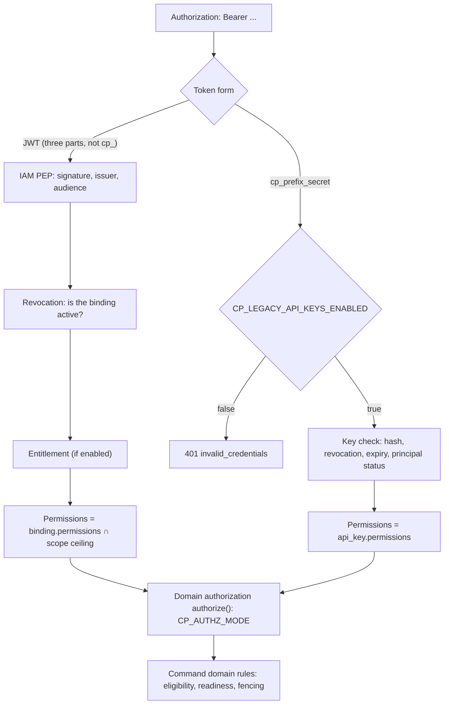

# Authorization and permissions

This page describes how the Control Plane decides **who** is calling it and
**what** that participant is allowed to do. It covers authentication (an IAM
token or a legacy key), bindings of external identities to local principals,
flat permissions, the token scope ceiling, the organizational model (roles,
capabilities, skills), delegation, the `CP_AUTHZ_MODE` modes, and the tool
policy. It is for administrators and integration developers.

## Decision order



1. **Identity.** Who this is: an IAM token or a legacy key.
2. **Revocation and entitlement.** Whether the binding is still in effect and
    whether there is a license (if entitlement is enabled).
3. **Domain policy.** Whether the caller has the required permission on the
    resource.
4. **Domain rules.** Eligibility by roles and capabilities, task readiness,
    leases, fencing.

Permissions are checked twice: in the API layer and in the application-layer
commands. The actor is always derived from the credential; an `actorId` field
in the request body is not accepted.

## Authentication

### IAM access token

The primary mode. A harness, service, or gateway exchanges a Platform Access
Token (PAT) or client credentials in IAM for a short-lived access token with
audience `control-plane` and presents it as `Bearer`. The Control Plane remains
a resource server: it verifies someone else's token but does not issue
credentials itself.

| Variable | Meaning |
|---|---|
| `CP_IAM_ENABLED` | enables IAM token verification (`false` by default, `true` in `deploy/local/compose.yml`) |
| `CP_IAM_ISSUER` | the expected `iss` of the token |
| `CP_IAM_JWKS_URL` | where to get the signing keys |
| `CP_IAM_AUDIENCE` | the expected `aud`, `control-plane` by default |

If you enable `CP_IAM_ENABLED` without `CP_IAM_ISSUER` or `CP_IAM_JWKS_URL`,
the process does not start. A service that has "almost" moved to IAM is worse
than either of the two finished states.

!!! tip "JWKS by internal address"
    Signature verification must not depend on the external proxy or on its own
    TLS. In `deploy/local/compose.yml`, `CP_IAM_JWKS_URL` points to
    `http://iam-service:8010/.well-known/jwks.json`, and `CP_IAM_ISSUER` to the
    public `${TAIMEN_PUBLIC_URL}/iam`.

### Legacy API key

A key of the form `cp_<prefix>_<secret>` is issued through
`POST /principals/{id}/api-keys` (the full key is shown once) and revoked
through `POST /api-keys/{id}:revoke`. The key is accepted only while
`CP_LEGACY_API_KEYS_ENABLED=true`. The default in the settings is `true`; in
the delivery's `deploy/local/compose.yml` it is `false`: the "IAM only" mode.

Which kind of credential the server is looking at is determined **by the form**
of the value, without trying methods one by one: trying them would reveal
through the response code which method worked.

!!! warning "Emergency access"
    If IAM is unavailable, you do not need to open the legacy key window: the
    host owner issues an emergency key `cp_bg…` with the command
    `python -m control_plane.break_glass issue` in the `control-plane-api`
    container (CP-ADR-0065). It is accepted even with
    `CP_LEGACY_API_KEYS_ENABLED=false`, lives no longer than
    `CP_BREAK_GLASS_MAX_TTL_SECONDS`, and is issued only to a human. The
    procedure is in [Emergency procedures](../operations/emergency.md).

## Identity bindings: `iam_principal_bindings` {#bindings}

An IAM token carries no Control Plane permissions, and this is intentional:
the right to create a task belongs to the product, not to the identity
provider. An external identity is mapped to a local principal by a row in the
`iam_principal_bindings` table, and permissions are read from there.

| Binding field | Meaning |
|---|---|
| `issuer` | IAM issuer |
| `iamTenantId` | the tenant in IAM; must match the token's tenant, otherwise sign-in is closed (`tenant_mismatch`) |
| `iamPrincipalId` | the principal in IAM (the token's `sub`) |
| `principalId` | the local Control Plane principal |
| `permissions` | a flat set of permissions |
| `status` | `active`, `disabled`, or `revoked` |

The lookup key is the pair `(issuer, iamPrincipalId)`. It is unique across the
whole database.

!!! danger "Changing the issuer closes sign-in"
    A binding is looked up by the pair `(issuer, iam_principal_id)`. If you
    change the public IAM address (and with it `iss`) without moving the
    bindings, nobody can sign in, including the administrator.

### Managing bindings through the API

| Method and path | Permission | Purpose |
|---|---|---|
| `POST /api/v1/bootstrap` with `iamBinding` | bootstrap token | the first administrator with an IAM binding right away |
| `GET /api/v1/principals/{id}/iam-bindings` | `principals.read` | all bindings of the principal, including revoked ones |
| `POST /api/v1/principals/{id}/iam-bindings` | `principals.write` | create or rebind (upsert by `issuer` + `iamPrincipalId`); `201` — created, `200` — updated |
| `POST /api/v1/iam-bindings/{id}:revoke` | `principals.write` | close sign-in without waiting for token expiry |

```bash
curl -s -X POST https://platform.example.com/api/v1/principals/<principal-id>/iam-bindings \
  -H "Authorization: Bearer $ADMIN_TOKEN" \
  -H "Content-Type: application/json" \
  -H "Idempotency-Key: $(uuidgen)" \
  -d '{
    "issuer": "https://platform.example.com/iam",
    "iamTenantId": "<iam-tenant-id>",
    "iamPrincipalId": "<iam-principal-id>",
    "permissions": ["sessions.open", "tasks.read", "tasks.write", "tasks.claim",
                    "events.read", "artifacts.read", "artifacts.write"]
  }'
```

Granting rules (they also apply to API keys):

- an unknown permission or an empty list returns `422 invalid_permissions`;
- **no escalation.** You cannot grant a permission the caller does not have
  (`403 permission_escalation`, missing permissions in `details.missing`).
  Only an admin can grant `admin`;
- **human-only permissions.** Principals of kinds `agent` and `service` cannot
  receive `admin` and `approvals.decide`
  (`422 permissions_not_allowed_for_kind`). An agent with `admin` could rewrite
  its own binding, and an agent with `approvals.decide` could approve the gate
  that is supposed to stop it;
- the principal must be in the `active` status;
- an identity already bound in another tenant returns
  `409 iam_identity_bound_elsewhere`.

### Binding cache

A binding is not read on every request: the projection is cached for
`CP_IAM_BINDING_CACHE_TTL_SECONDS` (30 s). If it cannot be re-read, the cached
answer is used for no longer than `CP_IAM_BINDING_STALE_AFTER_SECONDS`
(120 s), after which sign-in is closed. Creating, rebinding, or revoking
through the API resets the cache for that identity in the process that handled
the request.

!!! warning "Binding first, first request second"
    An unknown identity gets the same response as a revoked one: the client
    sees `401 invalid_credentials`, and the reason `binding_not_found` goes only
    into the decision log. This negative answer is cached too. If a binding is
    created bypassing the API (with direct SQL) after the identity has already
    knocked, restart `control-plane-api`. The correct order is: binding through
    the API first, then the first request.

### Token scope ceiling

The scopes of the presented token act as a **ceiling**. The resulting
permissions are the intersection of the binding's permissions and what the
token allows. The ceiling narrows permissions but never widens them.

| Token scope | Which binding permissions pass |
|---|---|
| `control-plane:read` | permissions ending in `.read` |
| `control-plane:write` | all other permissions except `admin` |
| `control-plane:admin` | everything in the binding, including `admin` |

The token must carry at least one of these three scopes, otherwise
`403 scope_not_granted`. Short forms (`read`, `write`) do not work: IAM scopes
always carry the audience prefix. Which scopes can be issued for the
`control-plane` audience is set by the IAM audience registry (`allowedScopes`).
Bootstrap brings it to
`["control-plane:read", "control-plane:write", "control-plane:admin"]`.
Details are in [Tokens, audiences, scopes](../iam/tokens.md).

!!! example "Example"
    The binding has the permissions `tasks.read`, `tasks.write`, `admin`. The
    token was issued with scope `control-plane:read`. The result is only
    `tasks.read`: `admin` requires the admin scope, `tasks.write` the write
    scope.

## Permissions {#permissions}

The flat set of a credential's permissions. The `admin` permission implies all
the others.

| Permission | What it allows |
|---|---|
| `principals.read` / `principals.write` | read principals; create principals, issue and revoke API keys, manage IAM bindings |
| `delegations.manage` | delegation from a human to an agent |
| `sessions.open` / `sessions.manage` | open your own session; see and manage other sessions |
| `tasks.read` / `tasks.write` / `tasks.claim` | read tasks, runs, claims, tools; create and change tasks, relations, comments; claim tasks and conduct runs |
| `claims.manage` | other principals' claims and runs: release, fail, cancel, `force_cancel` |
| `events.read` | the event log and WebSocket; reading memory in `/context` |
| `workspaces.read` / `workspaces.manage` | workspace tree, workspace types, members, workspace knowledge packs |
| `org.read` / `org.manage` | roles, capabilities, skills, and their assignment |
| `artifacts.read` / `artifacts.write` | artifacts |
| `approvals.read` / `approvals.manage` / `approvals.decide` | read; request and cancel; decide approvals |
| `observations.write` | explicit knowledge records, connector knowledge snapshots |
| `projects.read` / `projects.manage` | projects, effective configuration, revisions, project external references |
| `project_templates.read` / `project_templates.manage` | project templates |
| `operations.read` / `operations.manage` | context-adapter status; redrive, rebuild, event log archiving and pruning |
| `task_types.read` / `task_types.manage` | task type registry |
| `skills.invoke` / `skills.execute` | ask the core to invoke a skill; execute invocations (executor transport) |
| `goals.read` / `goals.write` | goals and binding work to them |
| `admin` | everything listed |

The exact permission of each endpoint is given in the [API](api.md) reference.
A summary of permissions for all platform services is in
[Permissions and scopes](../reference/permissions.md).

!!! note "Typical sets"
    By default, bootstrap gives agents `sessions.open`, `tasks.read`,
    `tasks.write`, `tasks.claim`, `events.read`, `artifacts.read`,
    `artifacts.write`, `projects.read`, `task_types.read`, `goals.read`,
    `goals.write`. The executor of tasks performed by a Skill additionally needs
    `skills.invoke` and `skills.execute`. Bootstrap gives the first
    administrator all permissions.

`skills.invoke` and `skills.execute` are deliberately separate. The caller
does not get the right to execute, and the executor is only a transport with no
invocation rights of its own.

## Organizational model: roles, capabilities, skills {#org-model}

Roles, capabilities, and skills **grant no API permissions**. They define
**eligibility**: who can claim a task with requirements and who can decide an
approval.

| Primitive | Where it is defined | Assigning to a principal | What it is for |
|---|---|---|---|
| Role | `POST /roles` (tenant or workspace), `slug` is unique within the scope | `POST /principals/{id}/roles {roleId, workspaceId?}` | task requirements, approval addressing |
| Capability | `POST /capabilities` | `POST /principals/{id}/capabilities` | task requirements |
| Skill | `POST /skills` (`name` + `version`) | `POST /principals/{id}/skills` | task requirements and the effective tool policy |

Management requires `org.manage`, reading — `org.read` (a principal's
assignments can also be read with `principals.read`).

To claim a task, four conditions must hold **at once**:

```text
tasks.claim permission  ∧  eligibility (the task's roles, capabilities, skills)
                        ∧  readiness (dependencies, gate approval)  ∧  concurrency rules
```

A skill requirement in a task is written as `name` (any version except
`disabled`; the newest `active` one is chosen by default) or `name@version`
(an exact version).

An approval can be decided with `approvals.decide` **and** eligibility: the
approval is addressed to the caller personally or to their role in a matching
scope (a tenant-level role, or a role on the approval's workspace or its
ancestor). Cancelling a gate approval requires the same authority as deciding
it, or authorship of the request, otherwise `403 not_eligible`.

## Delegation

An agent can work on behalf of a human:

1. `POST /delegations {humanPrincipalId, agentPrincipalId, permissions, startsAt?, expiresAt?}`
   (permission `delegations.manage`). `humanPrincipalId` must point to a
   `human`, `agentPrincipalId` to an `agent`.
2. The agent opens a session with `onBehalfOf: <human-principal-id>`. Without
   an active delegation it gets `403 delegation_required`.

Revocation: `POST /delegations/{id}:revoke`.

## Domain authorization modes: `CP_AUTHZ_MODE` {#authz-mode}

Who makes the domain decision "may the principal perform action X on resource
Y" is determined by the `CP_AUTHZ_MODE` variable (CP-ADR-0055).

| Mode | Who decides | What it is for |
|---|---|---|
| `local` (default) | the credential's flat permission set (`require`) | regular operation without an external PDP |
| `shadow` | `local` decides; the external PDP is asked in parallel, divergences are counted and logged | safe policy verification before switching |
| `policy` | the external Policy Decision Point decides; legacy keys without an IAM identity are still checked locally | resource-scoped authorization |

!!! note "The external PDP is not part of the delivery"
    The `shadow` and `policy` modes are an extension point: they require an
    external Policy Decision Point that is not part of the delivery. For
    regular operation use `local`.

What `shadow` and `policy` need:

| Variable | Default | Meaning |
|---|---|---|
| `CP_IAM_CLIENT_ID`, `CP_IAM_CLIENT_SECRET` | — | the core's service account; without them the process does not start |
| `CP_POLICY_BASE_URL` | `http://localhost:8030` | the external PDP address |
| `CP_POLICY_AUDIENCE` | PDP audience | the audience of the core's token |
| `CP_POLICY_SCOPES` | `["policy:check","policy:check-on-behalf"]` | scopes of the core's token |
| `CP_POLICY_TIMEOUT_SECONDS` | `3.0` | request timeout |
| `CP_POLICY_CACHE_TTL_SECONDS` | `5.0` | decision cache |

Mode specifics:

- The subject the PDP reasons about is the **IAM principal** (the token's
  `sub`), not the local `principals.id`. The Control Plane calls the PDP with
  its service identity and names the end principal in `on_behalf_of`.
- Commands pass the concrete resource (`workspace:<id>`, `task:<id>`, and so
  on) wherever it is known. Without a resource the question is asked at the
  tenant level.
- An unavailable PDP in `policy` mode returns `503 policy_unavailable`, not a
  silent allow.
- In `shadow` mode the metrics `authz_shadow_checks_total`,
  `authz_shadow_divergence_total`, `authz_shadow_unavailable_total`, and
  `authz_shadow_skipped_total` show readiness to switch. Each divergence is
  logged as `authz shadow divergence` with the fields `actions`, `resource`,
  `localAllowed`, `policyAllowed`, `reasonCode`.
- In `policy` mode, reading memory in `/context` is narrowed by the visibility
  the PDP computed: the core passes `allowedNamespaces` and `allowedScopes` to
  memory-service, and memory-service does not widen this set. More in
  [Task context and memory](context.md).

The Control Plane actions and resource types for the PDP are described in the
file `services/control-plane/authz/catalog.yaml`; you register it in the external PDP.
Action names match the permissions except for three: `admin` maps to the
tenant-admin role, `delegations.manage` to the PDP admin API, and
`observations.write` to the memory-service catalog. Examples of derived rules:
`tasks.read` = owner, request author, executor, or a permission in the scope;
`approvals.decide` = a permission in the scope, but not for the request author.

## Entitlement

The license check is built into the pipeline between identity and domain
policy. It is enabled with `CP_ENTITLEMENT_ENABLED=true` (disabled by default)
and requires the core's service account
(`CP_IAM_CLIENT_ID`/`CP_IAM_CLIENT_SECRET`). The API area is licensed:
`/api/v1/tasks/...` corresponds to feature `tasks`, and anything that cannot be
parsed to feature `CP_ENTITLEMENT_DEFAULT_FEATURE` (`api`). Disabled
entitlement is visible in the audit as the decision source `disabled`.

!!! note "The license service is not part of the delivery"
    The license check is an extension point: with
    `CP_ENTITLEMENT_ENABLED=true` the core calls an external license service
    that is not part of the delivery.

## Tool and skill policy

Which tools (skills) are available to a run is computed on every read; nothing
is cached. A tool is visible only if all conditions hold:

| Condition | Hiding reason (`reason`) |
|---|---|
| the skill is assigned to the principal (`POST /principals/{id}/skills`) | `not_assigned` |
| the version is not `disabled` | `skill_disabled` |
| the protocol is allowed by the project governance (`effectiveConfig.governance.allowedSkillProtocols`) | `protocol_not_allowed_by_governance` |
| the skill is in the child run's grant (if the run was launched through a child handle) | `not_granted_by_child_handle` |
| the protocol is declared by the session (`skills.protocol.<p>`) | `protocol_not_supported_by_harness` (listed, but `visible: false`) |

If all conditions hold, `reason` takes the value
`assigned_and_protocol_supported`.

- Search (`GET /tools`) grants no permissions. Writing an action with `skill`
  and calling `:invoke` recompute the policy and refuse with
  `403 tool_not_authorized` or `403 child_grant_exceeded`.
- A tool outside the policy cannot be described: the response is
  `404 tool_not_found`, as for a nonexistent one.
- A skill invocation additionally checks the contract's `requiredPermissions`
  on the task's workspace (`403 skill_permission_denied`). The
  `external_write` side effect requires an approved gate approval or an
  `execution` basis (the task type pinned this skill version). Details are in
  [API](api.md#skills).

### Skill executor allow-list

The tenant administrator publishes the skill contract, but the network and
tokens belong to the executor. So the executor daemon takes only the
invocations its configuration explicitly allows:

- protocols — `CONTROL_PLANE_SKILLS_PROTOCOLS`;
- `local` entrypoints — `CONTROL_PLANE_SKILLS_LOCAL_PACKAGES`;
- origins for `http` and `mcp` — `CONTROL_PLANE_SKILLS_HTTP_ALLOWED_ORIGINS`,
  `CONTROL_PLANE_SKILLS_MCP_ALLOWED_ORIGINS`;
- token audiences for skills — `CONTROL_PLANE_SKILLS_ALLOWED_AUDIENCES`.
  This list cannot include `control-plane`, `iam`, or the daemon's own
  audience.

The server hands out an invocation (`POST /skill-invocations:claim`) only to an
executor that declared a matching protocol, entrypoint, origin, and audience.
The setup is described in [Executor configuration](../runner/configuration.md).

### Child run grant

A child run (child handle) gets a `grant` ceiling: permissions, capabilities,
and skills. The ceiling can only narrow the parent's permissions, never widen
them (`422 child_grant_exceeds_parent`). The child run's actions, its skill
invocations, and `tasks.write` are checked against this ceiling.

## Bootstrap: the first administrator

`POST /api/v1/bootstrap` is protected by a separate token `CP_BOOTSTRAP_TOKEN`
(`Authorization: Bearer <token>`, constant-time comparison). If the token is
not set, the endpoint is disabled (`403 bootstrap_disabled`). The request
creates the tenant, an admin principal with all permissions, an admin API key,
and, if `iamBinding` is present, the administrator's IAM binding in the same
transaction. A repeated bootstrap returns `409 already_bootstrapped`. The
procedure is in [Bootstrap](../getting-started/bootstrap.md).

## Common errors

| Code | Cause | What to do |
|---|---|---|
| `401 invalid_credentials` | no header, the token failed verification, or a legacy key with `CP_LEGACY_API_KEYS_ENABLED=false` | check the PAT exchange, `iss`, `aud`, the clock |
| `403 permission_denied` | missing permission; the required one is in `details.required` | add the permission to the binding or issue a token with the needed scope |
| `401 invalid_credentials` with a valid token | no active identity binding (`binding_not_found`, `binding_disabled`, `tenant_mismatch`, `principal_not_active` — the reason is visible only in the `authz denied` decision log) | create a binding through the API; after a manual database edit, restart the API |
| `403 scope_not_granted` | the token has none of the scopes `control-plane:read`, `control-plane:write`, `control-plane:admin` | issue a token with the needed scope |
| `403 principal_not_active` | the principal is suspended | activate the principal |
| `403 permission_escalation` | an attempt to grant a permission you do not have | grant it as an admin |
| `403 not_eligible` | no role, capability, or skill for the task or approval | assign a role or capability |
| `403 delegation_required` | `onBehalfOf` without an active delegation | create a delegation |
| `422 permissions_not_allowed_for_kind` | `admin` or `approvals.decide` for an agent or service | these permissions are for humans only |
| `503 policy_unavailable` | `policy` mode, the PDP is unavailable | restore the PDP or switch back to `local` |

Sign-in problems are covered in [Diagnostics: authentication and access](../troubleshooting/auth.md).

## See also

- [Tokens, audiences, scopes](../iam/tokens.md)
- [Tenants and principals](../iam/principals.md)
- [Service accounts](../iam/service-accounts.md)
- [Permissions and scopes](../reference/permissions.md)
- [Agent identity](../runner/agent-identity.md)
- [API](api.md)
