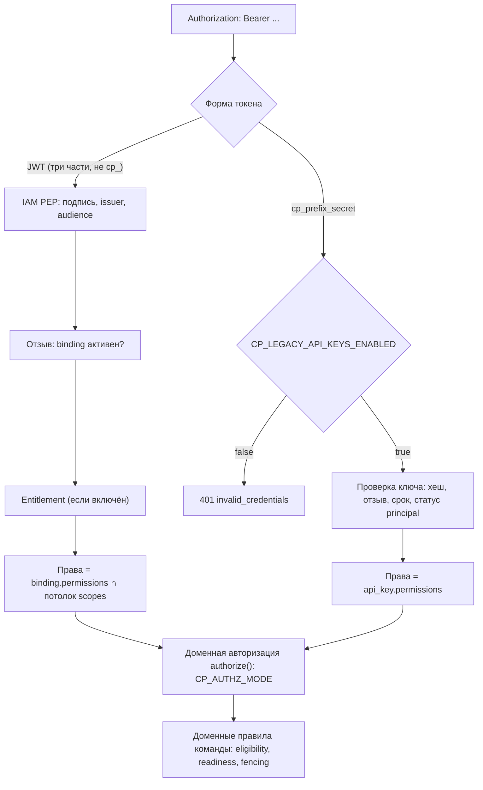

# Авторизация и права

Статья описывает, как Control Plane решает, **кто** обращается к нему и **что**
этому участнику можно. Разобраны аутентификация (IAM-токен или legacy-ключ),
привязки внешних identity к локальным principal, плоские права (permissions),
потолок scopes токена, организационная модель (роли, capabilities, skills),
делегирование, режимы `CP_AUTHZ_MODE` и политика инструментов. Статья для
администраторов и разработчиков интеграций.

## Порядок решения



1. **Identity.** Кто это: токен IAM или legacy-ключ.
2. **Отзыв и entitlement.** Действует ли ещё привязка, есть ли лицензия (если
    entitlement включён).
3. **Доменная политика.** Есть ли у вызывающего нужное право на ресурс.
4. **Доменные правила.** Eligibility по ролям и capabilities, готовность
    задачи, аренды, fencing.

Права проверяются дважды: в API-слое и в командах прикладного слоя. Actor
всегда вычисляется из credential, поле `actorId` в теле запроса не
принимается.

## Аутентификация

### Access token IAM

Основной режим. Харнесс, сервис или шлюз обменивает Platform Access Token
(PAT) или client credentials в IAM на короткоживущий access token audience
`control-plane` и предъявляет его как `Bearer`. Control Plane остаётся resource
server: он проверяет чужой токен, но сам credentials не выдаёт.

| Переменная | Смысл |
|---|---|
| `CP_IAM_ENABLED` | включает проверку IAM-токенов (по умолчанию `false`, в `deploy/local/compose.yml` — `true`) |
| `CP_IAM_ISSUER` | ожидаемый `iss` токена |
| `CP_IAM_JWKS_URL` | откуда брать ключи подписи |
| `CP_IAM_AUDIENCE` | ожидаемый `aud`, по умолчанию `control-plane` |

Если включить `CP_IAM_ENABLED` без `CP_IAM_ISSUER` или `CP_IAM_JWKS_URL`,
процесс не стартует. Сервис, «почти» перешедший на IAM, хуже любого из двух
законченных состояний.

!!! tip "JWKS — по внутреннему адресу"
    Проверка подписи не должна зависеть от внешнего прокси и собственного TLS.
    В `deploy/local/compose.yml` `CP_IAM_JWKS_URL` указывает на
    `http://iam-service:8010/.well-known/jwks.json`, а `CP_IAM_ISSUER` — на
    публичный `${TAIMEN_PUBLIC_URL}/iam`.

### Legacy API-ключ

Ключ вида `cp_<prefix>_<secret>` выпускается через
`POST /principals/{id}/api-keys` (полный ключ показывается один раз) и
отзывается через `POST /api-keys/{id}:revoke`. Ключ принимается, только пока
`CP_LEGACY_API_KEYS_ENABLED=true`. Значение по умолчанию в настройках — `true`,
в `deploy/local/compose.yml` поставки — `false`: это режим «только IAM».

Какой вид credential перед сервером, определяется **по форме** значения, без
перебора способов: перебор выдавал бы через код ответа, какой способ сработал.

!!! warning "Аварийный вход"
    Если IAM недоступен, открывать окно legacy-ключей не нужно: владелец хоста
    выпускает аварийный ключ `cp_bg…` командой
    `python -m control_plane.break_glass issue` в контейнере
    `control-plane-api` (CP-ADR-0065). Он принимается и при
    `CP_LEGACY_API_KEYS_ENABLED=false`, живёт не дольше
    `CP_BREAK_GLASS_MAX_TTL_SECONDS` и выпускается только человеку. Процедура —
    в [Аварийных процедурах](../operations/emergency.md).

## Привязки identity: `iam_principal_bindings` {#bindings}

IAM-токен не несёт прав Control Plane, и это сделано намеренно: право создать
задачу принадлежит продукту, а не провайдеру identity. Внешняя identity
сопоставляется с локальным principal строкой в таблице
`iam_principal_bindings`, и права читаются оттуда.

| Поле binding | Смысл |
|---|---|
| `issuer` | issuer IAM |
| `iamTenantId` | tenant в IAM; обязан совпадать с tenant'ом токена, иначе вход закрыт (`tenant_mismatch`) |
| `iamPrincipalId` | principal в IAM (`sub` токена) |
| `principalId` | локальный principal Control Plane |
| `permissions` | плоский набор прав |
| `status` | `active`, `disabled` или `revoked` |

Ключ поиска — пара `(issuer, iamPrincipalId)`. Она уникальна во всей базе.

!!! danger "Смена issuer закрывает вход"
    Binding ищется по паре `(issuer, iam_principal_id)`. Если сменить
    публичный адрес IAM (а с ним `iss`), не перенеся bindings, войти не сможет
    никто, включая администратора.

### Управление bindings через API

| Метод и путь | Право | Назначение |
|---|---|---|
| `POST /api/v1/bootstrap` с `iamBinding` | bootstrap-токен | первый администратор сразу с IAM-привязкой |
| `GET /api/v1/principals/{id}/iam-bindings` | `principals.read` | все привязки principal, включая отозванные |
| `POST /api/v1/principals/{id}/iam-bindings` | `principals.write` | создать или перепривязать (upsert по `issuer` + `iamPrincipalId`); `201` — создана, `200` — обновлена |
| `POST /api/v1/iam-bindings/{id}:revoke` | `principals.write` | закрыть вход, не дожидаясь истечения токена |

```bash
curl -s -X POST https://platform.example.com/api/v1/principals/<principal-id>/iam-bindings \
  -H "Authorization: Bearer $ADMIN_TOKEN" \
  -H "Content-Type: application/json" \
  -H "Idempotency-Key: $(uuidgen)" \
  -d '{
    "issuer": "https://platform.example.com/iam",
    "iamTenantId": "<iam-tenant-id>",
    "iamPrincipalId": "<iam-principal-id>",
    "permissions": ["sessions.open", "tasks.read", "tasks.write", "tasks.claim",
                    "events.read", "artifacts.read", "artifacts.write"]
  }'
```

Правила выдачи (они же действуют для API-ключей):

- неизвестное право или пустой список дают `422 invalid_permissions`;
- **без эскалации.** Нельзя выдать право, которого нет у самого вызывающего
  (`403 permission_escalation`, недостающие права — в `details.missing`).
  Выдать `admin` может только admin;
- **права только для людей.** Principal видов `agent` и `service` не может
  получить `admin` и `approvals.decide`
  (`422 permissions_not_allowed_for_kind`). Агент с `admin` мог бы переписать
  собственный binding, а агент с `approvals.decide` — одобрить gate, который
  должен его остановить;
- principal должен быть в статусе `active`;
- identity, уже привязанная в другом tenant'е, даёт
  `409 iam_identity_bound_elsewhere`.

### Кэш привязок

Привязка читается не на каждый запрос: проекция кэшируется на
`CP_IAM_BINDING_CACHE_TTL_SECONDS` (30 с). Если перечитать её не удалось,
закэшированный ответ используется не дольше `CP_IAM_BINDING_STALE_AFTER_SECONDS`
(120 с), после чего вход закрывается. Создание, перепривязка или отзыв через
API сбрасывают кэш этой identity в процессе, который обработал запрос.

!!! warning "Сначала binding, потом первый запрос"
    Неизвестная identity получает такой же ответ, как отозванная: клиент видит
    `401 invalid_credentials`, а причина `binding_not_found` попадает только в
    журнал решений. Этот отрицательный ответ тоже кэшируется. Если
    binding заведён в обход API (прямым SQL) после того, как identity уже
    стучалась, перезапустите `control-plane-api`. Правильный порядок — сначала
    binding через API, потом первый запрос.

### Потолок scopes токена

Scopes предъявленного токена работают как **потолок**. Итоговые права — это
пересечение прав binding и того, что разрешает токен. Потолок сужает права, но
никогда их не расширяет.

| Scope токена | Какие права binding проходят |
|---|---|
| `control-plane:read` | права, оканчивающиеся на `.read` |
| `control-plane:write` | все остальные права, кроме `admin` |
| `control-plane:admin` | всё, что есть в binding, включая `admin` |

Токен должен нести хотя бы один из этих трёх scopes, иначе `403 scope_not_granted`. Короткие формы (`read`,
`write`) не подходят: scopes IAM всегда с префиксом audience. Какие scopes
можно выпустить для audience `control-plane`, задаёт реестр audiences IAM
(`allowedScopes`). Bootstrap приводит его к
`["control-plane:read", "control-plane:write", "control-plane:admin"]`.
Подробности — в статье [Токены, audiences, scopes](../iam/tokens.md).

!!! example "Пример"
    У binding права `tasks.read`, `tasks.write`, `admin`. Токен выпущен со
    scope `control-plane:read`. Итог — только `tasks.read`: `admin` требует
    admin-scope, `tasks.write` — write-scope.

## Права (permissions) {#permissions}

Плоский набор прав credential'а. Право `admin` подразумевает все остальные.

| Право | Что разрешает |
|---|---|
| `principals.read` / `principals.write` | чтение principal; создание principal, выпуск и отзыв API-ключей, управление IAM-bindings |
| `delegations.manage` | делегирование человек → агент |
| `sessions.open` / `sessions.manage` | открыть свою сессию; видеть и управлять чужими |
| `tasks.read` / `tasks.write` / `tasks.claim` | читать задачи, прогоны, claims, инструменты; создавать и менять задачи, связи, комментарии; брать задачи и вести прогоны |
| `claims.manage` | чужие claims и прогоны: release, fail, cancel, `force_cancel` |
| `events.read` | журнал событий и WebSocket; чтение памяти в `/context` |
| `workspaces.read` / `workspaces.manage` | дерево workspace, типы workspace, участники, пакеты знаний workspace |
| `org.read` / `org.manage` | роли, capabilities, скиллы и их назначение |
| `artifacts.read` / `artifacts.write` | артефакты |
| `approvals.read` / `approvals.manage` / `approvals.decide` | читать, запрашивать и отменять, решать approvals |
| `observations.write` | явная запись знаний, снимки знаний коннекторов |
| `projects.read` / `projects.manage` | проекты, эффективная конфигурация, ревизии, внешние ссылки проекта |
| `project_templates.read` / `project_templates.manage` | шаблоны проектов |
| `operations.read` / `operations.manage` | статус context-adapter; redrive, rebuild, архивация и очистка журнала |
| `task_types.read` / `task_types.manage` | реестр типов задач |
| `skills.invoke` / `skills.execute` | попросить ядро вызвать скилл; исполнять вызовы (транспорт исполнителя) |
| `goals.read` / `goals.write` | цели и привязка работы к ним |
| `admin` | всё перечисленное |

Точное право каждого endpoint указано в справочнике [API](api.md). Сводка
прав всех сервисов платформы — в [Права и scopes](../reference/permissions.md).

!!! note "Типовые наборы"
    Bootstrap выдаёт агентам по умолчанию `sessions.open`, `tasks.read`,
    `tasks.write`, `tasks.claim`, `events.read`, `artifacts.read`,
    `artifacts.write`, `projects.read`, `task_types.read`, `goals.read`,
    `goals.write`. Исполнителю задач, которые выполняет Skill, дополнительно
    нужны `skills.invoke` и `skills.execute`. Первому администратору bootstrap
    выдаёт все права.

`skills.invoke` и `skills.execute` намеренно разделены. Вызывающий не получает
права исполнять, а исполнитель — лишь транспорт без собственных прав на вызов.

## Организационная модель: роли, capabilities, skills {#org-model}

Роли, capabilities и skills **не дают API-прав**. Они определяют
**eligibility**: кто может взять задачу с требованиями и кто может решить
approval.

| Примитив | Где задаётся | Назначение principal | Для чего |
|---|---|---|---|
| Role | `POST /roles` (tenant или workspace), `slug` уникален в scope | `POST /principals/{id}/roles {roleId, workspaceId?}` | требования задач, адресация approvals |
| Capability | `POST /capabilities` | `POST /principals/{id}/capabilities` | требования задач |
| Skill | `POST /skills` (`name` + `version`) | `POST /principals/{id}/skills` | требования задач и эффективная политика инструментов |

Управление требует `org.manage`, чтение — `org.read` (назначения principal
можно читать и с `principals.read`).

Чтобы захватить задачу, должны выполниться **одновременно** четыре условия:

```text
право tasks.claim  ∧  eligibility (roles, capabilities, skills задачи)
                   ∧  readiness (зависимости, gate-approval)  ∧  правила конкуренции
```

Требование скилла в задаче записывается как `name` (любая версия, кроме
`disabled`; по умолчанию выбирается новейшая `active`) или `name@version`
(точная версия).

Решить approval можно при `approvals.decide` **и** eligibility: approval
адресован вызывающему лично или его роли в подходящем scope (роль уровня
tenant'а либо роль на workspace approval'а или на его предке). Отмена
gate-approval требует тех же полномочий, что и решение, или авторства запроса,
иначе `403 not_eligible`.

## Делегирование

Агент может работать от имени человека:

1. `POST /delegations {humanPrincipalId, agentPrincipalId, permissions, startsAt?, expiresAt?}`
   (право `delegations.manage`). `humanPrincipalId` должен указывать на
   `human`, `agentPrincipalId` — на `agent`.
2. Агент открывает сессию с `onBehalfOf: <human-principal-id>`. Без активной
   delegation он получает `403 delegation_required`.

Отзыв: `POST /delegations/{id}:revoke`.

## Режимы доменной авторизации: `CP_AUTHZ_MODE` {#authz-mode}

Кто принимает доменное решение «можно ли principal'у действие X над ресурсом
Y», определяет переменная `CP_AUTHZ_MODE` (CP-ADR-0055).

| Режим | Кто решает | Для чего |
|---|---|---|
| `local` (по умолчанию) | плоский набор прав credential'а (`require`) | обычная эксплуатация без внешнего PDP |
| `shadow` | решает `local`; внешний PDP спрашивается параллельно, расхождения считаются и пишутся в журнал | безопасная проверка политики перед переключением |
| `policy` | решает внешний Policy Decision Point; legacy-ключи без IAM-identity по-прежнему проверяются локально | ресурсная (scoped) авторизация |

!!! note "Внешний PDP не входит в поставку"
    Режимы `shadow` и `policy` — точка расширения: они требуют внешнего
    Policy Decision Point, который в поставку не входит. Для обычной
    эксплуатации используйте `local`.

Что нужно для `shadow` и `policy`:

| Переменная | По умолчанию | Смысл |
|---|---|---|
| `CP_IAM_CLIENT_ID`, `CP_IAM_CLIENT_SECRET` | — | service account ядра; без них процесс не стартует |
| `CP_POLICY_BASE_URL` | `http://localhost:8030` | адрес внешнего PDP |
| `CP_POLICY_AUDIENCE` | audience PDP | audience токена ядра |
| `CP_POLICY_SCOPES` | `["policy:check","policy:check-on-behalf"]` | scopes токена ядра |
| `CP_POLICY_TIMEOUT_SECONDS` | `3.0` | таймаут запроса |
| `CP_POLICY_CACHE_TTL_SECONDS` | `5.0` | кэш решений |

Особенности режимов:

- Субъект, о котором рассуждает PDP, — **IAM principal** (`sub` токена), а не
  локальный `principals.id`. Control Plane обращается к PDP своей service
  identity и называет конечного principal в `on_behalf_of`.
- Команды передают конкретный ресурс (`workspace:<id>`, `task:<id>` и т. п.)
  везде, где он известен. Без ресурса вопрос задаётся на уровне tenant'а.
- Недоступный PDP в режиме `policy` даёт `503 policy_unavailable`, а не
  тихое разрешение.
- В режиме `shadow` метрики `authz_shadow_checks_total`,
  `authz_shadow_divergence_total`, `authz_shadow_unavailable_total` и
  `authz_shadow_skipped_total` показывают готовность к переключению. Каждое
  расхождение пишется в лог `authz shadow divergence` с полями `actions`,
  `resource`, `localAllowed`, `policyAllowed`, `reasonCode`.
- В режиме `policy` чтение памяти в `/context` сужается видимостью, которую
  вычислил PDP: ядро передаёт memory-service `allowedNamespaces` и
  `allowedScopes`, а memory-service этот набор не расширяет. Подробнее — в
  [Контекст задачи и память](context.md).

Действия и типы ресурсов Control Plane для PDP описаны в файле
`services/control-plane/authz/catalog.yaml`; его регистрируют во внешнем PDP. Имена
действий совпадают с правами, кроме трёх: `admin` отображается на роль
tenant-admin, `delegations.manage` — на admin API PDP, `observations.write` —
на каталог memory-service. Примеры выводимых правил: `tasks.read` = владелец,
автор запроса, исполнитель или право в scope; `approvals.decide` = право в
scope, но не для автора запроса.

## Entitlement

Проверка лицензии встроена в конвейер между identity и доменной политикой.
Включается `CP_ENTITLEMENT_ENABLED=true` (по умолчанию выключена) и требует
service account ядра (`CP_IAM_CLIENT_ID`/`CP_IAM_CLIENT_SECRET`). Лицензируется
область API: `/api/v1/tasks/...` соответствует feature `tasks`, а всё, что не
разбирается, — feature `CP_ENTITLEMENT_DEFAULT_FEATURE` (`api`). Выключенный
entitlement виден в аудите как источник решения `disabled`.

!!! note "Сервис лицензий не входит в поставку"
    Проверка лицензии — точка расширения: при `CP_ENTITLEMENT_ENABLED=true`
    ядро обращается к внешнему сервису лицензий, который в поставку не входит.

## Политика инструментов и скиллов

Какие инструменты (скиллы) доступны прогону, вычисляется при каждом чтении,
ничего не кэшируется. Инструмент видим, только если выполнены все условия:

| Условие | Причина скрытия (`reason`) |
|---|---|
| скилл назначен principal (`POST /principals/{id}/skills`) | `not_assigned` |
| версия не `disabled` | `skill_disabled` |
| протокол разрешён governance проекта (`effectiveConfig.governance.allowedSkillProtocols`) | `protocol_not_allowed_by_governance` |
| скилл входит в grant дочернего прогона (если прогон запущен через child handle) | `not_granted_by_child_handle` |
| протокол заявлен сессией (`skills.protocol.<p>`) | `protocol_not_supported_by_harness` (видим, но `visible: false`) |

Если все условия выполнены, `reason` принимает значение
`assigned_and_protocol_supported`.

- Поиск (`GET /tools`) прав не даёт. Запись действия с `skill` и вызов
  `:invoke` пересчитывают политику и отказывают с `403 tool_not_authorized`
  или `403 child_grant_exceeded`.
- Инструмент вне политики нельзя описать: ответ `404 tool_not_found`, как для
  несуществующего.
- Вызов скилла дополнительно проверяет `requiredPermissions` контракта на
  workspace задачи (`403 skill_permission_denied`). Побочный эффект
  `external_write` требует одобренного gate-approval или основания
  `execution` (тип задачи закрепил эту версию скилла). Подробности — в
  [API](api.md#skills).

### Allow-list исполнителя скиллов

Контракт скилла публикует администратор tenant'а, а сеть и токены принадлежат
исполнителю. Поэтому демон-исполнитель берёт только вызовы, которые явно
разрешены его конфигурацией:

- протоколы — `CONTROL_PLANE_SKILLS_PROTOCOLS`;
- `local`-entrypoints — `CONTROL_PLANE_SKILLS_LOCAL_PACKAGES`;
- origins для `http` и `mcp` — `CONTROL_PLANE_SKILLS_HTTP_ALLOWED_ORIGINS`,
  `CONTROL_PLANE_SKILLS_MCP_ALLOWED_ORIGINS`;
- audiences токенов для скиллов — `CONTROL_PLANE_SKILLS_ALLOWED_AUDIENCES`.
  В этот список нельзя включить `control-plane`, `iam` и собственный audience
  демона.

Сервер выдаёт вызов (`POST /skill-invocations:claim`) только исполнителю,
который объявил подходящий протокол, entrypoint, origin и audience.
Настройка описана в [Конфигурации runner](../runner/configuration.md).

### Grant дочернего прогона

Дочерний прогон (child handle) получает потолок `grant`: права, capabilities и
скиллы. Потолок может только сузить права родителя, расширить нельзя
(`422 child_grant_exceeds_parent`). Действия дочернего прогона, его вызовы
скиллов и `tasks.write` проверяются против этого потолка.

## Bootstrap: первый администратор

`POST /api/v1/bootstrap` защищён отдельным токеном `CP_BOOTSTRAP_TOKEN`
(`Authorization: Bearer <token>`, сравнение за постоянное время). Если токен
не задан, endpoint выключен (`403 bootstrap_disabled`). Запрос создаёт tenant,
admin-principal со всеми правами, admin API-ключ и, при наличии `iamBinding`,
IAM-привязку администратора в той же транзакции. Повторный bootstrap даёт
`409 already_bootstrapped`. Процедура — в статье
[Bootstrap](../getting-started/bootstrap.md).

## Типичные ошибки

| Код | Причина | Что делать |
|---|---|---|
| `401 invalid_credentials` | нет заголовка, токен не прошёл проверку или legacy-ключ при `CP_LEGACY_API_KEYS_ENABLED=false` | проверить обмен PAT, `iss`, `aud`, время |
| `403 permission_denied` | нет права; нужное указано в `details.required` | добавить право в binding или выпустить токен с нужным scope |
| `401 invalid_credentials` при валидном токене | нет активной привязки identity (`binding_not_found`, `binding_disabled`, `tenant_mismatch`, `principal_not_active` — причина видна только в журнале решений `authz denied`) | завести binding через API; после ручной правки БД — перезапустить API |
| `403 scope_not_granted` | в токене нет ни одного из scopes `control-plane:read`, `control-plane:write`, `control-plane:admin` | выпустить токен с нужным scope |
| `403 principal_not_active` | principal приостановлен | активировать principal |
| `403 permission_escalation` | попытка выдать право, которого нет у себя | выдавать от admin |
| `403 not_eligible` | нет роли, capability или скилла для задачи или approval | назначить роль или capability |
| `403 delegation_required` | `onBehalfOf` без активного делегирования | создать delegation |
| `422 permissions_not_allowed_for_kind` | `admin` или `approvals.decide` агенту или сервису | эти права — только людям |
| `503 policy_unavailable` | режим `policy`, PDP недоступен | восстановить PDP или вернуть `local` |

Разбор проблем входа — в [Диагностика: аутентификация и доступ](../troubleshooting/auth.md).

## См. также

- [Токены, audiences, scopes](../iam/tokens.md)
- [Tenants и principals](../iam/principals.md)
- [Service accounts](../iam/service-accounts.md)
- [Права и scopes](../reference/permissions.md)
- [Identity агента](../runner/agent-identity.md)
- [API](api.md)
