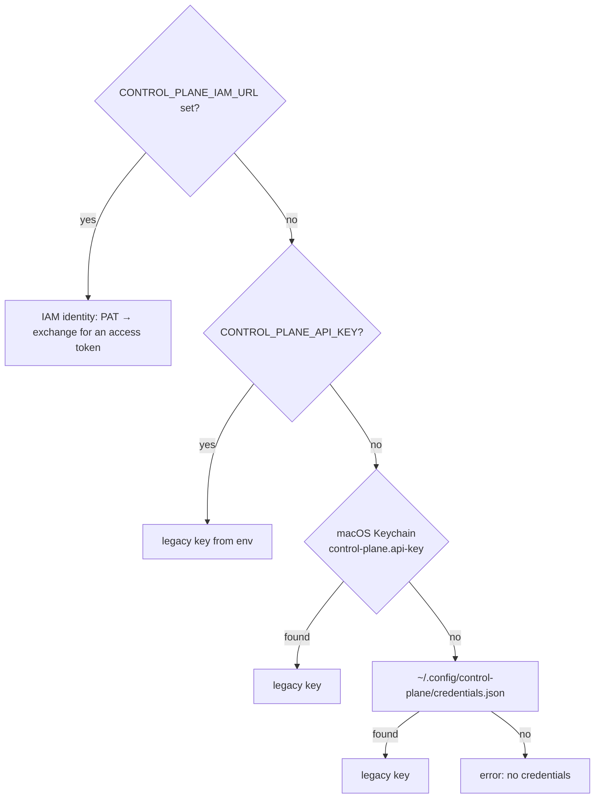

# CLI and MCP server

The `control-plane` package includes two client tools built on top of the
official `control_plane_client` SDK:

- **`control-plane`** — a minimal CLI for debugging, smoke checks, and
  operator actions;
- **`control-plane-mcp`** — an MCP server (stdio). Through it, Claude Code,
  Codex, and other MCP clients work with the Control Plane as a harness.

This page describes installation, project binding, credential lookup, all CLI
commands, and all MCP tools as implemented in code. How to connect the MCP
plugin to Claude Code as an operator is covered in
[MCP plugin for Claude Code](../operator/mcp-plugin.md).

!!! note "No special trust"
    The CLI and the MCP server are ordinary API clients. The server re-checks
    permissions, eligibility, leases, and fencing on every command. The MCP
    server holds no business invariants and no authoritative state.

## Installation

Both tools are entry points of the `control-plane` package (`[project.scripts]`):

| Command | Module |
|---|---|
| `control-plane` | `control_plane_cli.main:main` |
| `control-plane-mcp` | `control_plane_mcp.server:main` |
| `control-plane-agent` | autonomous executor daemon, see [Runner](../runner/index.md) |
| `control-plane-opencode` | OpenCode adapter, see [Executor adapters](../runner/adapters.md) |

```bash
# from a superproject clone: the package is installed together with the neighboring platform-auth-sdk
cd services/control-plane
uv tool install --reinstall .
control-plane --version
```

!!! warning "Reinstall the client after a server upgrade"
    The MCP server runs the **locally installed** package, not the server
    code. New `cp_*` tools appear only after `uv tool install --reinstall .`
    and a restart of the MCP client.

## Server address and project binding

The server address is determined in this order:

1. the `--server` flag (CLI only);
2. the `CONTROL_PLANE_SERVER` variable;
3. the `.control-plane/config.json` file. It is searched upward from the
   current directory, but the search stops at the repository root (the
   directory with `.git`) and does not go beyond the home directory.

`control-plane init` creates the binding file:

```bash
control-plane init --server https://platform.example.com \
  --workspace engineering --project <project-id> --repository github:acme/app
```

```json
{
  "server": "https://platform.example.com",
  "workspace": "engineering",
  "project": "<project-id>",
  "repository": "github:acme/app"
}
```

The file contains only non-secret metadata, so you can commit it. The `tenant`
field is also supported; `init` does not write it. For local files next to it,
add this entry to `.gitignore`: `.control-plane/*.local.json`.

!!! tip "Search boundary"
    The server address is where the client sends the credential. That is why a
    stray `.control-plane/config.json` in an ancestor directory outside the
    repository must not choose the server: the search stops there.

## Credentials {#credentials}

Neither the CLI nor the MCP server accepts secrets in arguments or in the MCP
configuration. The credential is chosen in this order:



### IAM identity (the primary path)

| Variable | Required | Meaning |
|---|---|---|
| `CONTROL_PLANE_IAM_URL` | yes | IAM base URL; without it the IAM path is not used |
| `CONTROL_PLANE_IAM_TENANT` | yes (except for an explicitly passed PAT) | the tenant in IAM; addresses the entry in the PAT store |
| `CONTROL_PLANE_IAM_AUDIENCE` | no | audience, `control-plane` by default |
| `CONTROL_PLANE_IAM_SCOPES` | no | scopes separated by spaces or commas, for example `"control-plane:read control-plane:write"` |
| `IAM_PRINCIPAL` | when the machine has several identities of one tenant | which principal runs this process |
| `IAM_CREDENTIAL_MODE` + `IAM_PLATFORM_ACCESS_TOKEN` | for CI | a PAT from the variable is accepted **only** together with `IAM_CREDENTIAL_MODE=environment` (or `ci`) |
| `IAM_NO_KEYCHAIN=1` | no | do not read the Keychain (macOS) |

Where the PAT comes from:

1. the `IAM_PLATFORM_ACCESS_TOKEN` variable (with `IAM_CREDENTIAL_MODE=environment`);
2. macOS Keychain, service `iam.platform-access-token`;
3. the file `~/.config/iam/credentials.json` (or `$XDG_CONFIG_HOME/iam/…`).
   The entry key is `<iam-url>|<tenant>|<principal>`. The file permissions must
   be exactly `0600`, otherwise the credential is not used
   (`iam_credentials_file_permissions`).

The PAT is presented only to IAM:
`POST <iam-url>/api/v1/platform-access-tokens:exchange`. The Control Plane
receives a short-lived access token, which the client caches and exchanges
again 30 s before expiry. PAT issuance and `iam auth login` are described in
[Credentials and PAT](../iam/credentials.md).

| Client error | Cause |
|---|---|
| `iam_tenant_required` | `CONTROL_PLANE_IAM_URL` is set, but `CONTROL_PLANE_IAM_TENANT` is not |
| `iam_not_authenticated` | PAT not found: run `iam auth login` |
| `iam_credential_ambiguous` | the machine has several identities of this tenant; set `IAM_PRINCIPAL` |
| `iam_environment_mode_required` | `IAM_PLATFORM_ACCESS_TOKEN` is set without `IAM_CREDENTIAL_MODE=environment` |
| `iam_invalid_token` | IAM rejected the PAT (expired or revoked) |
| `iam_audience_not_allowed` | the PAT is not allowed for the audience |
| `iam_unreachable` | IAM is unavailable |

### Legacy API key

This path is used only if `CONTROL_PLANE_IAM_URL` is not set, and works only if
the server accepts legacy keys (`CP_LEGACY_API_KEYS_ENABLED=true`).

1. `CONTROL_PLANE_API_KEY` — an explicit override for any server (convenient in
   CI; set it together with `CONTROL_PLANE_SERVER`).
2. macOS Keychain, service `control-plane.api-key`, account — the server URL.
   Disabled with `CONTROL_PLANE_NO_KEYCHAIN=1`.
3. `~/.config/control-plane/credentials.json`, keyed by the server URL. The
   file is created with `0600` permissions from the start.

`control-plane login` verifies the key with a `GET /harness/context` request
and saves it to the most secure available store. The key is passed to the
Keychain through stdin, not as an argument: argv is visible in `ps`. `logout`
deletes the key locally. Revoking it on the server is a separate action
(`POST /api-keys/{id}:revoke`).

!!! note "Removed variables"
    If only one of the old variables is set (`TAIMEN_API_KEY`,
    `TAIMEN_SERVER`, `TAIMEN_NO_KEYCHAIN`, and others), the CLI exits with code
    `2` and names the replacement. The old `.taimen/config.json` directory is
    not read either: the client raises `LegacyProjectConfigError` asking you to
    move the file to `.control-plane/config.json`.

## The `control-plane` CLI

General syntax:

```text
control-plane [--server URL] [--version] <command> [subcommand] [arguments]
```

Output is indented JSON or short tabular lines. On an API error the CLI prints
`control-plane: <code>: <message>` and `details` to stderr and exits with code
`1`. A configuration error gives code `2`, an interrupt — `130`.

### Identity and context

| Command | What it does | API |
|---|---|---|
| `whoami` | tenant, principal, and permissions | `GET /harness/context` |
| `context [--session <id>]` | the full harness bootstrap context | `GET /harness/context` |

### Work and tasks

| Command | Arguments | What it does |
|---|---|---|
| `work list` | `--limit N`, `--workspace <id>`, `--include-descendants`, `--project <id>`, `--include-subprojects` | available work: lines `publicId [priority] title` |
| `task get <task>` | id or publicId | the whole task |
| `task claimability <task>` | — | whether the task can be claimed and why not |
| `task claim <task>` | `--intent "…"` | opens a session (`harness.type=cli`, capability `resume`) and takes a claim; prints `sessionId` and the claim |
| `run start <task>` | `--claim <id>` and `--fencing-token N` (both required) | starts a run |
| `run status <run>` | — | run |
| `artifact add` | `--type` and `--name` (required), `--task`, `--run`, `--uri` | registers an artifact |
| `approvals list` | `--status` (`pending` by default) | approvals |

!!! warning "The CLI does not send heartbeats"
    `task claim` opens a session and exits immediately. The session and the
    claim expire after the TTL (300 s by default) unless extended. For real
    work use the MCP server or the SDK with `HeartbeatRunner`; use the CLI for
    debugging.

### Events

```bash
control-plane events tail                 # replay the last 10 and keep following
control-plane events tail --replay 50     # the last 50
control-plane events tail --after ec1_... # continue from a saved cursor
```

Event line: `sequence  occurredAt  type  entityType:entityId`. Without
`--after` and with `--replay 0`, following starts from the current
`eventCursor`.

### Projects

| Command | Arguments | What it does |
|---|---|---|
| `project list` | `--limit`, `--workspace`, `--status` | lines `id [systemStatusCategory] statusKey templateKey` |
| `project get <project>` | — | project profile |
| `project config <project>` | — | effective configuration with provenance |

### Operator actions

| Command | Permission | What it does |
|---|---|---|
| `ops adapter status` | `operations.read` | context-adapter delivery state for your own tenant |
| `ops adapter redrive <tenant-id> [--reason …]` | `operations.manage` | unpark and retry the same position (the cursor does not move) |

Rebuild, archiving, and pruning of the event log are not exposed in the CLI;
call them through the API (see [API](api.md#operations)).

### Local setup

| Command | What it does |
|---|---|
| `init --server URL [--workspace] [--project] [--repository]` | writes `.control-plane/config.json` in the current directory |
| `login` | saves a legacy API key (from `CONTROL_PLANE_API_KEY` or from input without echo) |
| `logout` | deletes the saved key locally |

## The `control-plane-mcp` MCP server

The server works over **stdio** and is named `control-plane`. It is a
stateless adapter. The process cache holds only the current `sessionId`,
`claimId`, `fencingToken`, `runId`, the task, and the project in focus, and all
of it is restored through `cp_context` after a restart.

### Connecting

=== "Claude Code (`.mcp.json`)"

    ```json
    {
      "mcpServers": {
        "control_plane": {
          "type": "stdio",
          "command": "control-plane-mcp",
          "args": [],
          "env": {
            "CONTROL_PLANE_HARNESS_TYPE": "claude-code",
            "CONTROL_PLANE_HARNESS_CLIENT_NAME": "claude-code-operator"
          }
        }
      }
    }
    ```

=== "Codex (`.codex/config.toml`)"

    ```toml
    [mcp_servers.control_plane]
    command = "control-plane-mcp"
    required = true
    default_tools_approval_mode = "prompt"

    [mcp_servers.control_plane.env]
    CONTROL_PLANE_HARNESS_TYPE = "codex"
    CONTROL_PLANE_HARNESS_CLIENT_NAME = "codex-operator"
    ```

=== "By command"

    ```bash
    claude mcp add control-plane -- control-plane-mcp
    ```

There are no secrets in the MCP configuration: the address comes from
`CONTROL_PLANE_SERVER` or `.control-plane/config.json`, and the credential —
in the order given in [Credentials](#credentials).

| Variable | Default | Meaning |
|---|---|---|
| `CONTROL_PLANE_HARNESS_TYPE` | `mcp-client` | the session's `harness.type`, format `^[a-z0-9][a-z0-9._-]{0,99}$` |
| `CONTROL_PLANE_HARNESS_VERSION` | package version | `harness.version` |
| `CONTROL_PLANE_HARNESS_CLIENT_NAME` | `control-plane-mcp` | the session's `clientName` |

### Session and leases

- The session opens lazily on the first tool that needs it. In the `harness`
  block the server declares the capabilities `tasks.interactive`,
  `artifacts.publish`, `approvals.interactive`, `resume`, `checkpoints`,
  `active_turn_control.v1`, `child_run_handle.v1`, `skills.protocol.mcp`, and
  `skills.protocol.local`. If the project binding specifies `repository`, it
  goes into `environment`.
- While a claim is held, a background `HeartbeatRunner` extends the session
  and the claim every 60 s. If the heartbeat died, the next tool call returns
  a `leaseWarning` with a hint to call `cp_context`.
- A new session is opened only on a domain error (expired, closed, not found).
  A network failure is propagated so as not to orphan the claims of a live
  session.

### Response format and errors

Tools return JSON text. An error comes as
`{"error": code, "message": …, "details": …}`. For `stale_claim`,
`task_already_claimed`, and `run_not_active` a `hint` is added: do not retry
the write, call `cp_context`, tell the human.

### Tool annotations

Each tool is marked as `readOnlyHint=true` (read) or as mutating. The
descriptions of mutating tools require an explicit human decision. Annotations
are a hint for the UI, not an authorization boundary.

When a harness adapter runs an agent **inside** a run, a list of forbidden
tools is computed from the tools: everything that is not read-only and not
among the "evidence" tools (`cp_checkpoint`, `cp_record_action`,
`cp_create_artifact`, `cp_remember`, `cp_comment`, `cp_request_approval`). An
unannotated tool is considered authoritative, that is, closed. This narrows
the agent's behavior; it is not a security boundary: the real ceiling is the
grant computed by the server.

### Tool reference

Notation: **R** — read only, **M** — mutating. Required arguments are in bold.

#### Identity, context, memory

| Tool | Type | Arguments | What it does |
|---|---|---|---|
| `cp_whoami` | R | — | tenant, principal, permissions, and the project in focus |
| `cp_context` | R | — | the full harness context (`/harness/context`), project focus, local cache (`local`); call it at the start of work and after a restart |
| `cp_get_context` | R | `query`, `task`, `project`, `max_tokens`, `anchors`, `mode` | working context with memory (`POST /context`); `mode` is the memory strategy, `briefing` assembles a summary without a query |
| `cp_remember` | M | **`content`**, `kind` (`finding` by default), `task`, `assertions`, `source`, `dedup_key`, `observed_at`, `supersedes`, `external_ref` | explicit knowledge record (`POST /observations`); bound to the current task and run |
| `cp_list_events` | R | `after`, `limit` | events after an opaque cursor |

#### Finding and managing work

| Tool | Type | Arguments | What it does |
|---|---|---|---|
| `cp_list_work` | R | `workspace_id`, `include_descendants`, `project_id`, `include_subprojects`, `assigned_to_me`, `limit` | available work (`/work/available`) |
| `cp_list_tasks` | R | `status`, `system_status_category`, `type_key`, `workspace_id`, `project_id`, `assignee_id`, `owner_id`, `due_from`, `due_to`, `start_from`, `start_to`, `sort`, `include_subprojects`, `cursor`, `limit` | tasks in any status |
| `cp_get_task` | R | **`task`** | the task, claimability diagnostics, and allowed status transitions (with `route`: `update` or `complete`) |
| `cp_create_task` | M | **`title`**, `description`, `priority`, `type_key`, `type_version`, `workspace_id`, `project_id`, `assignee_id`, `owner_id`, `custom_fields`, `start_date`, `due_date`, `parent_task`, `goal_id`, `origin`, `acceptance`, `evidence` | create a task; with `parent_task` the relation is created atomically |
| `cp_update_task` | M | **`task`**, **`expected_version`**, `title`, `description`, `priority`, `status`, `assignee_id`, `owner_id`, `custom_fields`, `start_date`, `due_date`, `clear_start_date`, `clear_due_date`, `goal_id`, `clear_goal`, `acceptance`, `evidence` | update a task; on `version_conflict`, re-read |
| `cp_add_task_relation` | M | **`from_task`**, **`to_task`**, **`relation_type`** | add a relation (`parent`, `blocks`, `depends_on`, …) |
| `cp_remove_task_relation` | M | **`task`**, **`relation_id`** | delete a relation |
| `cp_list_task_types` | R | `key`, `status`, `cursor`, `limit` | task types of the tenant |
| `cp_get_task_type` | R | **`type_id`** | a type version: lifecycle, fields, `approvalSchema` |

Creating and deprecating task types is deliberately not exposed through MCP:
it is a change to the tenant configuration, not coordination. Use the HTTP
API, the SDK, and [catalog packages](catalog-packages.md) for that.

#### Goals

| Tool | Type | Arguments | What it does |
|---|---|---|---|
| `cp_create_goal` | M | **`title`**, `desired_state`, `criteria`, `owner_id`, `workspace_id`, `parent_goal_id`, `created_from` | create a goal |
| `cp_update_goal` | M | **`goal_id`**, **`expected_version`**, `title`, `desired_state`, `criteria`, `status`, `owner_id`, `clear_owner`, `parent_goal_id`, `clear_parent` | update or close a goal (`achieved`, `abandoned`) |
| `cp_list_goals` | R | `status`, `workspace_id`, `owner_id`, `parent_goal_id`, `cursor`, `limit` | goals, newest first |
| `cp_get_goal` | R | **`goal_id`**, `include_subgoals`, `work_cursor`, `work_limit` | a goal and the first page of its work |

#### Discussion

| Tool | Type | Arguments | What it does |
|---|---|---|---|
| `cp_list_comments` | R | **`task`**, `cursor`, `limit` | the task thread, oldest first |
| `cp_comment` | M | **`task`**, **`body`**, `run_id`, `artifact_id` | add a comment; the author is the session's principal |
| `cp_edit_comment` | M | **`task`**, **`comment_id`**, **`body`**, **`expected_version`** | correct your own comment; the previous text is kept as a revision |

#### Execution

| Tool | Type | Arguments | What it does |
|---|---|---|---|
| `cp_claim_task` | M | **`task`**, `intent` | claim a task (lease and fencing token); only after an explicit human choice |
| `cp_release_task` | M | `reason` | release the current claim without completing |
| `cp_start_run` | M | `max_duration_seconds`, `max_actions` | start a run under the current claim |
| `cp_get_run` | R | `run_id` | run (the current one by default) |
| `cp_get_run_context` | R | `run_id` | Run Context: the task, claim, requirements, artifacts, checkpoints of past attempts, approvals, skills |
| `cp_checkpoint` | M | **`kind`**, **`data`** | durable state checkpoint |
| `cp_record_action` | M | **`action`**, `status`, `skill`, `external_reference` | an entry in the run's action log |
| `cp_complete_run` | M | `output`, `complete_task` | finish the run successfully and, by default, the task |
| `cp_fail_run` | M | `reason` | honestly record a failure |
| `cp_suspend_run` | M | `reason`, `waiting_for_approval_id` | suspend while waiting (the claim is released) |
| `cp_prepare_handoff` | M | **`summary`**, `next_steps`, `evidence_refs`, `run_id` | hand off to another harness: checkpoint, suspend, release atomically |

#### Tools and skills

| Tool | Type | Arguments | What it does |
|---|---|---|---|
| `cp_search_tools` | R | `query`, `limit`, `cursor`, `run_id` | search available tools (`GET /tools`) |
| `cp_describe_tool` | R | **`tool`**, `run_id` | the full sanitized schema of a tool |
| `cp_describe_skill` | R | **`skill`** | the full contract of a skill version |
| `cp_invoke_skill` | M | **`skill`**, `inputs`, `idempotency_key`, `approval_id`, `wait_seconds` | invoke a skill through the core in the context of the current run or task and wait for the result (up to 120 s); otherwise return the invocation with its `id` |

#### Run control and child runs

| Tool | Type | Arguments | What it does |
|---|---|---|---|
| `cp_control_run` | M | **`operation`**, **`causal_position`**, **`expected_run_version`**, `directive`, `reason`, `run_id` | control message `queue`, `steer`, `redirect`, `request_cancel`, `force_cancel` |
| `cp_list_run_controls` | R | `run_id`, `limit`, `cursor` | the run's control messages |
| `cp_ack_run_control` | M | **`message_id`**, **`status`**, **`expected_run_version`**, **`expected_message_version`**, `safe_boundary`, `reason`, `run_id` | acknowledge the oldest accepted message at a safe boundary |
| `cp_launch_child` | M | **`correlation_id`**, **`title`**, `description`, `priority`, `grant`, `cancellation_policy`, `expires_in_seconds`, `run_id` | launch a child run; a repeat with the same `correlation_id` returns the existing one |
| `cp_list_child_handles` | R | `run_id`, `limit`, `cursor`, `active` | the run's child handles |
| `cp_resolve_child` | R | **`ref`** | status and result of a child run by id or `ch1_…` token |
| `cp_revoke_child` | M | **`handle_id`**, `reason`, `cancel_child` | revoke a handle, optionally asking the child to stop |

#### Artifacts and approvals

| Tool | Type | Arguments | What it does |
|---|---|---|---|
| `cp_create_artifact` | M | **`type`**, **`name`**, `uri`, `content`, `metadata`, `supersedes_artifact_id` | register a result (reference and metadata, no blobs) |
| `cp_list_artifacts` | R | `task_id` | artifacts of a task (the current one by default) |
| `cp_request_approval` | M | `comment`, `gate`, `required_role_id`, `assigned_principal_id`, `artifact_id` | request an approval; exactly one of `required_role_id` / `assigned_principal_id` |
| `cp_list_approvals` | R | `status` | approvals (`pending` by default) |
| `cp_approve` | M | **`approval_id`**, `comment` | approve (requires eligibility) |
| `cp_reject` | M | **`approval_id`**, `comment` | reject |

#### Projects and workspaces

| Tool | Type | Arguments | What it does |
|---|---|---|---|
| `cp_list_projects` | R | `workspace_id`, `status`, `limit` | projects |
| `cp_get_project` | R | **`project`** | profile, parent, template, and status |
| `cp_project_config` | R | **`project`** | effective configuration with provenance |
| `cp_focus_project` | M | `project` | focus the session on a project for `cp_list_work` and `cp_get_context`; local state only, grants no permissions |
| `cp_workspace_tree` | R | `root_id`, `depth` | workspace tree with project projections |

### Typical scenario

```text
cp_whoami → cp_context → cp_list_work / cp_list_tasks → cp_get_task
   → (the human chose a task) cp_claim_task → cp_start_run → cp_get_run_context
   → work: cp_checkpoint, cp_record_action, cp_create_artifact, cp_remember
   → (the human confirmed) cp_complete_run
```

Rules for an agent working through MCP:

- do not claim or complete tasks without an explicit human decision;
- on `stale_claim`, stop writing and re-read `cp_context`;
- the task's type defines its statuses: look at the transitions in
  `cp_get_task`, and rely on `systemStatusCategory` for logic;
- do not put credentials, raw prompts, chat history, hidden reasoning, or
  absolute local paths into tasks, checkpoints, comments, or artifacts.

## Common problems

| Symptom | Cause | What to do |
|---|---|---|
| `no server configured` / `not_configured` | no `--server`, `CONTROL_PLANE_SERVER`, or `.control-plane/config.json` | `control-plane init --server …` |
| `no credentials for …` / `not_authenticated` | no IAM identity and no legacy key | set `CONTROL_PLANE_IAM_URL` and `CONTROL_PLANE_IAM_TENANT` and run `iam auth login` |
| `401 invalid_credentials` with a legacy key | the server runs in IAM-only mode | switch to an IAM identity |
| the MCP client lacks a new tool | the local package is older than the server | `uv tool install --reinstall .` and restart the client |
| `invalid_harness_configuration` | `CONTROL_PLANE_HARNESS_TYPE` is not lowercase or has invalid characters | fix the value |
| `leaseWarning` in the `cp_context` response | a heartbeat failed; the lease may have been lost | re-read the context; if the claim is gone, stop and decide with the human |

## See also

- [MCP plugin for Claude Code](../operator/mcp-plugin.md)
- [Harness protocol](harness-protocol.md)
- [Credentials and PAT](../iam/credentials.md)
- [Service clients](../sdk/clients.md)
- [Everyday workflows](../operator/workflows.md)
- [API](api.md)
