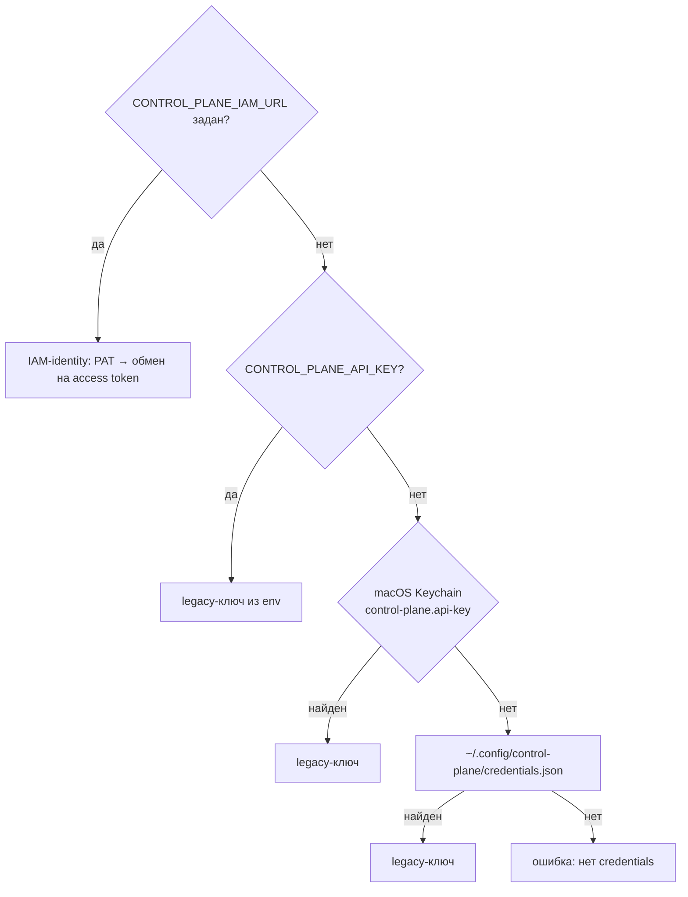

# CLI и MCP-сервер

В пакет `control-plane` входят два клиентских инструмента поверх официального
SDK `control_plane_client`:

- **`control-plane`** — минимальный CLI для отладки, smoke-проверок и
  операторских действий;
- **`control-plane-mcp`** — MCP-сервер (stdio). Через него Claude Code, Codex
  и другие MCP-клиенты работают с Control Plane как харнесс.

Статья описывает установку, привязку проекта, поиск credential'а, все
команды CLI и все инструменты MCP по коду. Как подключить MCP-плагин к Claude
Code как оператор — в статье [MCP-плагин для Claude Code](../operator/mcp-plugin.md).

!!! note "Никакого особого доверия"
    CLI и MCP-сервер — обычные клиенты API. Сервер перепроверяет права,
    eligibility, аренды и fencing на каждой команде. MCP-сервер не хранит
    бизнес-инвариантов и авторитетного состояния.

## Установка

Оба инструмента — точки входа пакета `control-plane` (`[project.scripts]`):

| Команда | Модуль |
|---|---|
| `control-plane` | `control_plane_cli.main:main` |
| `control-plane-mcp` | `control_plane_mcp.server:main` |
| `control-plane-agent` | демон автономного исполнителя, см. [Runner](../runner/index.md) |
| `control-plane-opencode` | адаптер OpenCode, см. [Адаптеры исполнителей](../runner/adapters.md) |

```bash
# из клона суперпроекта: пакет ставится вместе с соседним platform-auth-sdk
cd services/control-plane
uv tool install --reinstall .
control-plane --version
```

!!! warning "После обновления сервера переустановите клиент"
    MCP-сервер запускает **локально установленный** пакет, а не код сервера.
    Новые инструменты `cp_*` появятся только после
    `uv tool install --reinstall .` и перезапуска MCP-клиента.

## Адрес сервера и привязка проекта

Адрес сервера определяется в таком порядке:

1. флаг `--server` (только CLI);
2. переменная `CONTROL_PLANE_SERVER`;
3. файл `.control-plane/config.json`. Он ищется вверх от текущего каталога,
   но поиск останавливается на корне репозитория (каталоге с `.git`) и не
   выходит за пределы домашнего каталога.

Файл привязки создаёт `control-plane init`:

```bash
control-plane init --server https://platform.example.com \
  --workspace engineering --project <project-id> --repository github:acme/app
```

```json
{
  "server": "https://platform.example.com",
  "workspace": "engineering",
  "project": "<project-id>",
  "repository": "github:acme/app"
}
```

В файле только несекретные метаданные, его можно коммитить. Поле `tenant`
тоже поддерживается, `init` его не пишет. Для локальных файлов рядом
рекомендуется запись в `.gitignore`: `.control-plane/*.local.json`.

!!! tip "Граница поиска"
    Адрес сервера — это место, куда клиент отправит credential. Поэтому
    посторонний `.control-plane/config.json` в каталоге-предке вне репозитория
    не должен выбирать сервер: поиск на этом останавливается.

## Credentials {#credentials}

Ни CLI, ни MCP-сервер не принимают секреты в аргументах и конфигурации MCP.
Credential выбирается в таком порядке:



### IAM-identity (основной путь)

| Переменная | Обязательна | Смысл |
|---|---|---|
| `CONTROL_PLANE_IAM_URL` | да | базовый URL IAM; без неё IAM-путь не используется |
| `CONTROL_PLANE_IAM_TENANT` | да (кроме явно переданного PAT) | tenant в IAM; адресует запись в хранилище PAT |
| `CONTROL_PLANE_IAM_AUDIENCE` | нет | audience, по умолчанию `control-plane` |
| `CONTROL_PLANE_IAM_SCOPES` | нет | scopes через пробел или запятую, например `"control-plane:read control-plane:write"` |
| `IAM_PRINCIPAL` | когда на машине несколько identity одного tenant'а | какой principal запускает этот процесс |
| `IAM_CREDENTIAL_MODE` + `IAM_PLATFORM_ACCESS_TOKEN` | для CI | PAT из переменной принимается **только** вместе с `IAM_CREDENTIAL_MODE=environment` (или `ci`) |
| `IAM_NO_KEYCHAIN=1` | нет | не читать Keychain (macOS) |

Откуда берётся PAT:

1. переменная `IAM_PLATFORM_ACCESS_TOKEN` (при `IAM_CREDENTIAL_MODE=environment`);
2. macOS Keychain, сервис `iam.platform-access-token`;
3. файл `~/.config/iam/credentials.json` (или `$XDG_CONFIG_HOME/iam/…`).
   Ключ записи — `<iam-url>|<tenant>|<principal>`. Права файла строго `0600`,
   иначе credential не используется (`iam_credentials_file_permissions`).

PAT предъявляется только IAM:
`POST <iam-url>/api/v1/platform-access-tokens:exchange`. Control Plane получает
короткоживущий access token, который клиент кэширует и обменивает заново за
30 с до истечения. Выпуск PAT и `iam auth login` описаны в статье
[Credentials и PAT](../iam/credentials.md).

| Ошибка клиента | Причина |
|---|---|
| `iam_tenant_required` | задан `CONTROL_PLANE_IAM_URL`, но нет `CONTROL_PLANE_IAM_TENANT` |
| `iam_not_authenticated` | PAT не найден: выполнить `iam auth login` |
| `iam_credential_ambiguous` | на машине несколько identity этого tenant'а, задайте `IAM_PRINCIPAL` |
| `iam_environment_mode_required` | задан `IAM_PLATFORM_ACCESS_TOKEN` без `IAM_CREDENTIAL_MODE=environment` |
| `iam_invalid_token` | IAM отверг PAT (истёк или отозван) |
| `iam_audience_not_allowed` | PAT не разрешён для audience |
| `iam_unreachable` | IAM недоступен |

### Legacy API-ключ

Путь используется, только если `CONTROL_PLANE_IAM_URL` не задан, и работает,
только если сервер принимает legacy-ключи (`CP_LEGACY_API_KEYS_ENABLED=true`).

1. `CONTROL_PLANE_API_KEY` — явный override для любого сервера (удобно в CI;
   задавайте его в паре с `CONTROL_PLANE_SERVER`).
2. macOS Keychain, сервис `control-plane.api-key`, учётная запись — URL
   сервера. Отключается через `CONTROL_PLANE_NO_KEYCHAIN=1`.
3. `~/.config/control-plane/credentials.json`, ключ — URL сервера. Файл
   создаётся сразу с правами `0600`.

`control-plane login` проверяет ключ запросом `GET /harness/context` и
сохраняет его в самое защищённое доступное хранилище. В Keychain ключ
передаётся через stdin, а не аргументом: argv виден в `ps`. `logout` удаляет
ключ локально. Отзыв на сервере — отдельное действие
(`POST /api-keys/{id}:revoke`).

!!! note "Удалённые переменные"
    Если задана только одна из старых переменных (`TAIMEN_API_KEY`,
    `TAIMEN_SERVER`, `TAIMEN_NO_KEYCHAIN` и др.), CLI завершается с кодом `2`
    и называет замену. Старый каталог `.taimen/config.json` тоже не читается:
    клиент выдаёт `LegacyProjectConfigError` с указанием перенести файл в
    `.control-plane/config.json`.

## CLI `control-plane`

Общий синтаксис:

```text
control-plane [--server URL] [--version] <команда> [подкоманда] [аргументы]
```

Вывод — JSON с отступами или короткие табличные строки. При ошибке API CLI
печатает `control-plane: <code>: <message>` и `details` в stderr и выходит с
кодом `1`. Ошибка конфигурации даёт код `2`, прерывание — `130`.

### Идентичность и контекст

| Команда | Что делает | API |
|---|---|---|
| `whoami` | tenant, principal и права | `GET /harness/context` |
| `context [--session <id>]` | полный bootstrap-контекст харнесса | `GET /harness/context` |

### Работа и задачи

| Команда | Аргументы | Что делает |
|---|---|---|
| `work list` | `--limit N`, `--workspace <id>`, `--include-descendants`, `--project <id>`, `--include-subprojects` | доступная работа: строки `publicId [priority] title` |
| `task get <task>` | id или publicId | задача целиком |
| `task claimability <task>` | — | можно ли взять задачу и почему нет |
| `task claim <task>` | `--intent "…"` | открывает сессию (`harness.type=cli`, capability `resume`) и берёт claim; печатает `sessionId` и claim |
| `run start <task>` | `--claim <id>` и `--fencing-token N` (оба обязательны) | запускает прогон |
| `run status <run>` | — | прогон |
| `artifact add` | `--type` и `--name` (обязательны), `--task`, `--run`, `--uri` | регистрирует артефакт |
| `approvals list` | `--status` (по умолчанию `pending`) | approvals |

!!! warning "CLI не держит heartbeat"
    `task claim` открывает сессию и сразу выходит. Сессия и claim истекут через
    TTL (по умолчанию 300 с), если их не продлевать. Для настоящей работы
    используйте MCP-сервер или SDK с `HeartbeatRunner`, а CLI — для отладки.

### События

```bash
control-plane events tail                 # воспроизвести 10 последних и следить дальше
control-plane events tail --replay 50     # 50 последних
control-plane events tail --after ec1_... # продолжить с сохранённого курсора
```

Строка события: `sequence  occurredAt  type  entityType:entityId`. Без
`--after` и с `--replay 0` слежение начинается с текущего `eventCursor`.

### Проекты

| Команда | Аргументы | Что делает |
|---|---|---|
| `project list` | `--limit`, `--workspace`, `--status` | строки `id [systemStatusCategory] statusKey templateKey` |
| `project get <project>` | — | профиль проекта |
| `project config <project>` | — | эффективная конфигурация с provenance |

### Операторские действия

| Команда | Право | Что делает |
|---|---|---|
| `ops adapter status` | `operations.read` | состояние доставки context-adapter своего tenant'а |
| `ops adapter redrive <tenant-id> [--reason …]` | `operations.manage` | снять парковку и повторить ту же позицию (курсор не двигается) |

Rebuild, архивация и очистка журнала в CLI не вынесены, они вызываются через
API (см. [API](api.md#operations)).

### Локальная настройка

| Команда | Что делает |
|---|---|
| `init --server URL [--workspace] [--project] [--repository]` | пишет `.control-plane/config.json` в текущий каталог |
| `login` | сохраняет legacy API-ключ (из `CONTROL_PLANE_API_KEY` или ввод без эха) |
| `logout` | удаляет сохранённый ключ локально |

## MCP-сервер `control-plane-mcp`

Сервер работает по **stdio** и называется `control-plane`. Это адаптер без
состояния. Процессный кэш хранит только текущие `sessionId`, `claimId`,
`fencingToken`, `runId`, задачу и проект в фокусе, и всё это восстанавливается
через `cp_context` после рестарта.

### Подключение

=== "Claude Code (`.mcp.json`)"

    ```json
    {
      "mcpServers": {
        "control_plane": {
          "type": "stdio",
          "command": "control-plane-mcp",
          "args": [],
          "env": {
            "CONTROL_PLANE_HARNESS_TYPE": "claude-code",
            "CONTROL_PLANE_HARNESS_CLIENT_NAME": "claude-code-operator"
          }
        }
      }
    }
    ```

=== "Codex (`.codex/config.toml`)"

    ```toml
    [mcp_servers.control_plane]
    command = "control-plane-mcp"
    required = true
    default_tools_approval_mode = "prompt"

    [mcp_servers.control_plane.env]
    CONTROL_PLANE_HARNESS_TYPE = "codex"
    CONTROL_PLANE_HARNESS_CLIENT_NAME = "codex-operator"
    ```

=== "Командой"

    ```bash
    claude mcp add control-plane -- control-plane-mcp
    ```

Секретов в конфигурации MCP нет: адрес берётся из `CONTROL_PLANE_SERVER` или
`.control-plane/config.json`, credential — по порядку из раздела
[Credentials](#credentials).

| Переменная | По умолчанию | Смысл |
|---|---|---|
| `CONTROL_PLANE_HARNESS_TYPE` | `mcp-client` | `harness.type` сессии, формат `^[a-z0-9][a-z0-9._-]{0,99}$` |
| `CONTROL_PLANE_HARNESS_VERSION` | версия пакета | `harness.version` |
| `CONTROL_PLANE_HARNESS_CLIENT_NAME` | `control-plane-mcp` | `clientName` сессии |

### Сессия и аренды

- Сессия открывается лениво при первом инструменте, которому она нужна. В
  блоке `harness` сервер объявляет capabilities `tasks.interactive`,
  `artifacts.publish`, `approvals.interactive`, `resume`, `checkpoints`,
  `active_turn_control.v1`, `child_run_handle.v1`, `skills.protocol.mcp` и
  `skills.protocol.local`. Если в привязке проекта указан `repository`, он
  попадает в `environment`.
- Пока удерживается claim, фоновый `HeartbeatRunner` продлевает сессию и
  claim каждые 60 с. Если heartbeat умер, следующий вызов инструмента вернёт
  предупреждение `leaseWarning` с подсказкой вызвать `cp_context`.
- Новая сессия открывается только при доменной ошибке (истекла, закрыта, не
  найдена). Сетевой сбой пробрасывается, чтобы не осиротить claims живой
  сессии.

### Формат ответов и ошибки

Инструменты возвращают JSON-текст. Ошибка приходит как
`{"error": code, "message": …, "details": …}`. На `stale_claim`,
`task_already_claimed` и `run_not_active` добавляется `hint`: не повторять
запись, вызвать `cp_context`, сообщить человеку.

### Аннотации инструментов

Каждый инструмент помечен как `readOnlyHint=true` (чтение) или как мутирующий.
Описания мутирующих инструментов требуют явного решения человека. Аннотации —
подсказка для UI, а не граница авторизации.

Когда харнесс-адаптер запускает агента **внутри** прогона, из инструментов
вычисляется список запрещённых: всё, что не read-only и не входит в
«доказательные» инструменты (`cp_checkpoint`, `cp_record_action`,
`cp_create_artifact`, `cp_remember`, `cp_comment`, `cp_request_approval`).
Неаннотированный инструмент считается авторитетным, то есть закрытым. Это
сужение поведения агента, а не граница безопасности: настоящий потолок —
grant, который вычисляет сервер.

### Справочник инструментов

Обозначения: **R** — только чтение, **M** — мутирующий. Жирным выделены
обязательные аргументы.

#### Идентичность, контекст, память

| Инструмент | Тип | Аргументы | Что делает |
|---|---|---|---|
| `cp_whoami` | R | — | tenant, principal, права и проект в фокусе |
| `cp_context` | R | — | полный контекст харнесса (`/harness/context`), фокус проекта, локальный кэш (`local`); вызывать в начале работы и после рестарта |
| `cp_get_context` | R | `query`, `task`, `project`, `max_tokens`, `anchors`, `mode` | рабочий контекст с памятью (`POST /context`); `mode` — стратегия памяти, `briefing` собирает сводку без запроса |
| `cp_remember` | M | **`content`**, `kind` (по умолчанию `finding`), `task`, `assertions`, `source`, `dedup_key`, `observed_at`, `supersedes`, `external_ref` | явная запись знания (`POST /observations`); привязывается к текущей задаче и прогону |
| `cp_list_events` | R | `after`, `limit` | события после непрозрачного курсора |

#### Поиск и управление работой

| Инструмент | Тип | Аргументы | Что делает |
|---|---|---|---|
| `cp_list_work` | R | `workspace_id`, `include_descendants`, `project_id`, `include_subprojects`, `assigned_to_me`, `limit` | доступная работа (`/work/available`) |
| `cp_list_tasks` | R | `status`, `system_status_category`, `type_key`, `workspace_id`, `project_id`, `assignee_id`, `owner_id`, `due_from`, `due_to`, `start_from`, `start_to`, `sort`, `include_subprojects`, `cursor`, `limit` | задачи в любом статусе |
| `cp_get_task` | R | **`task`** | задача, диагностика claimability и допустимые переходы статуса (с `route`: `update` или `complete`) |
| `cp_create_task` | M | **`title`**, `description`, `priority`, `type_key`, `type_version`, `workspace_id`, `project_id`, `assignee_id`, `owner_id`, `custom_fields`, `start_date`, `due_date`, `parent_task`, `goal_id`, `origin`, `acceptance`, `evidence` | создать задачу; с `parent_task` связь создаётся атомарно |
| `cp_update_task` | M | **`task`**, **`expected_version`**, `title`, `description`, `priority`, `status`, `assignee_id`, `owner_id`, `custom_fields`, `start_date`, `due_date`, `clear_start_date`, `clear_due_date`, `goal_id`, `clear_goal`, `acceptance`, `evidence` | изменить задачу; `version_conflict` — перечитать |
| `cp_add_task_relation` | M | **`from_task`**, **`to_task`**, **`relation_type`** | добавить связь (`parent`, `blocks`, `depends_on`, …) |
| `cp_remove_task_relation` | M | **`task`**, **`relation_id`** | удалить связь |
| `cp_list_task_types` | R | `key`, `status`, `cursor`, `limit` | типы задач tenant'а |
| `cp_get_task_type` | R | **`type_id`** | версия типа: жизненный цикл, поля, `approvalSchema` |

Создание и депрецирование типов задач через MCP намеренно не публикуются: это
изменение конфигурации tenant'а, а не координация. Для этого есть HTTP API,
SDK и [пакеты каталога](catalog-packages.md).

#### Цели

| Инструмент | Тип | Аргументы | Что делает |
|---|---|---|---|
| `cp_create_goal` | M | **`title`**, `desired_state`, `criteria`, `owner_id`, `workspace_id`, `parent_goal_id`, `created_from` | создать цель |
| `cp_update_goal` | M | **`goal_id`**, **`expected_version`**, `title`, `desired_state`, `criteria`, `status`, `owner_id`, `clear_owner`, `parent_goal_id`, `clear_parent` | изменить или закрыть цель (`achieved`, `abandoned`) |
| `cp_list_goals` | R | `status`, `workspace_id`, `owner_id`, `parent_goal_id`, `cursor`, `limit` | цели, новые сверху |
| `cp_get_goal` | R | **`goal_id`**, `include_subgoals`, `work_cursor`, `work_limit` | цель и первая страница её работы |

#### Обсуждение

| Инструмент | Тип | Аргументы | Что делает |
|---|---|---|---|
| `cp_list_comments` | R | **`task`**, `cursor`, `limit` | тред задачи, старые сверху |
| `cp_comment` | M | **`task`**, **`body`**, `run_id`, `artifact_id` | добавить комментарий; автор — principal сессии |
| `cp_edit_comment` | M | **`task`**, **`comment_id`**, **`body`**, **`expected_version`** | исправить свой комментарий; прежний текст сохраняется ревизией |

#### Исполнение

| Инструмент | Тип | Аргументы | Что делает |
|---|---|---|---|
| `cp_claim_task` | M | **`task`**, `intent` | взять задачу (аренда и fencing token); только после явного выбора человека |
| `cp_release_task` | M | `reason` | освободить текущий claim без завершения |
| `cp_start_run` | M | `max_duration_seconds`, `max_actions` | начать прогон под текущим claim |
| `cp_get_run` | R | `run_id` | прогон (по умолчанию текущий) |
| `cp_get_run_context` | R | `run_id` | Run Context: задача, claim, требования, артефакты, checkpoints прошлых попыток, approvals, скиллы |
| `cp_checkpoint` | M | **`kind`**, **`data`** | долговременный checkpoint состояния |
| `cp_record_action` | M | **`action`**, `status`, `skill`, `external_reference` | запись в журнал действий прогона |
| `cp_complete_run` | M | `output`, `complete_task` | успешно завершить прогон и, по умолчанию, задачу |
| `cp_fail_run` | M | `reason` | честно зафиксировать неудачу |
| `cp_suspend_run` | M | `reason`, `waiting_for_approval_id` | приостановить в ожидании (claim освобождается) |
| `cp_prepare_handoff` | M | **`summary`**, `next_steps`, `evidence_refs`, `run_id` | передача другому харнессу: checkpoint, suspend, release атомарно |

#### Инструменты и скиллы

| Инструмент | Тип | Аргументы | Что делает |
|---|---|---|---|
| `cp_search_tools` | R | `query`, `limit`, `cursor`, `run_id` | поиск доступных инструментов (`GET /tools`) |
| `cp_describe_tool` | R | **`tool`**, `run_id` | полная санитизированная схема инструмента |
| `cp_describe_skill` | R | **`skill`** | полный контракт версии скилла |
| `cp_invoke_skill` | M | **`skill`**, `inputs`, `idempotency_key`, `approval_id`, `wait_seconds` | вызвать скилл через ядро в контексте текущего run или задачи и ждать результат (до 120 с); иначе вернуть вызов с `id` |

#### Управление прогоном и дочерние прогоны

| Инструмент | Тип | Аргументы | Что делает |
|---|---|---|---|
| `cp_control_run` | M | **`operation`**, **`causal_position`**, **`expected_run_version`**, `directive`, `reason`, `run_id` | control-сообщение `queue`, `steer`, `redirect`, `request_cancel`, `force_cancel` |
| `cp_list_run_controls` | R | `run_id`, `limit`, `cursor` | control-сообщения прогона |
| `cp_ack_run_control` | M | **`message_id`**, **`status`**, **`expected_run_version`**, **`expected_message_version`**, `safe_boundary`, `reason`, `run_id` | подтвердить старейшее принятое сообщение на безопасной границе |
| `cp_launch_child` | M | **`correlation_id`**, **`title`**, `description`, `priority`, `grant`, `cancellation_policy`, `expires_in_seconds`, `run_id` | запустить дочерний прогон; повтор с тем же `correlation_id` вернёт существующий |
| `cp_list_child_handles` | R | `run_id`, `limit`, `cursor`, `active` | дочерние handles прогона |
| `cp_resolve_child` | R | **`ref`** | статус и результат дочернего прогона по id или токену `ch1_…` |
| `cp_revoke_child` | M | **`handle_id`**, `reason`, `cancel_child` | отозвать handle, опционально попросить ребёнка остановиться |

#### Артефакты и approvals

| Инструмент | Тип | Аргументы | Что делает |
|---|---|---|---|
| `cp_create_artifact` | M | **`type`**, **`name`**, `uri`, `content`, `metadata`, `supersedes_artifact_id` | зарегистрировать результат (ссылка и метаданные, без блобов) |
| `cp_list_artifacts` | R | `task_id` | артефакты задачи (по умолчанию текущей) |
| `cp_request_approval` | M | `comment`, `gate`, `required_role_id`, `assigned_principal_id`, `artifact_id` | запросить approval; ровно одно из `required_role_id` / `assigned_principal_id` |
| `cp_list_approvals` | R | `status` | approvals (по умолчанию `pending`) |
| `cp_approve` | M | **`approval_id`**, `comment` | одобрить (нужна eligibility) |
| `cp_reject` | M | **`approval_id`**, `comment` | отклонить |

#### Проекты и workspace

| Инструмент | Тип | Аргументы | Что делает |
|---|---|---|---|
| `cp_list_projects` | R | `workspace_id`, `status`, `limit` | проекты |
| `cp_get_project` | R | **`project`** | профиль, родитель, шаблон и статус |
| `cp_project_config` | R | **`project`** | эффективная конфигурация с provenance |
| `cp_focus_project` | M | `project` | сфокусировать сессию на проекте для `cp_list_work` и `cp_get_context`; только локальное состояние, прав не даёт |
| `cp_workspace_tree` | R | `root_id`, `depth` | дерево workspace с проекциями проектов |

### Типичный сценарий

```text
cp_whoami → cp_context → cp_list_work / cp_list_tasks → cp_get_task
   → (человек выбрал задачу) cp_claim_task → cp_start_run → cp_get_run_context
   → работа: cp_checkpoint, cp_record_action, cp_create_artifact, cp_remember
   → (человек подтвердил) cp_complete_run
```

Правила для агента, работающего через MCP:

- не брать и не завершать задачи без явного решения человека;
- на `stale_claim` прекратить запись и перечитать `cp_context`;
- статусы задачи задаёт её тип: смотреть переходы в `cp_get_task`, а для
  логики опираться на `systemStatusCategory`;
- не передавать в задачи, checkpoints, комментарии и артефакты credentials,
  сырые промпты, историю чата, скрытые рассуждения и абсолютные локальные пути.

## Типичные проблемы

| Симптом | Причина | Что делать |
|---|---|---|
| `no server configured` / `not_configured` | нет `--server`, `CONTROL_PLANE_SERVER` и `.control-plane/config.json` | `control-plane init --server …` |
| `no credentials for …` / `not_authenticated` | нет IAM-identity и legacy-ключа | настроить `CONTROL_PLANE_IAM_URL` и `CONTROL_PLANE_IAM_TENANT` и выполнить `iam auth login` |
| `401 invalid_credentials` с legacy-ключом | сервер работает в режиме только IAM | перейти на IAM-identity |
| в MCP-клиенте нет нового инструмента | локальный пакет старее сервера | `uv tool install --reinstall .` и перезапуск клиента |
| `invalid_harness_configuration` | `CONTROL_PLANE_HARNESS_TYPE` не в нижнем регистре или с недопустимыми символами | исправить значение |
| `leaseWarning` в ответе `cp_context` | heartbeat не прошёл, аренда могла потеряться | перечитать контекст; если claim пропал — остановиться и решить с человеком |

## См. также

- [MCP-плагин для Claude Code](../operator/mcp-plugin.md)
- [Харнесс-протокол](harness-protocol.md)
- [Credentials и PAT](../iam/credentials.md)
- [Клиенты сервисов](../sdk/clients.md)
- [Повседневные сценарии](../operator/workflows.md)
- [API](api.md)
