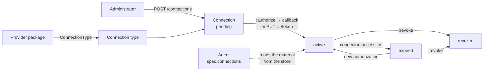
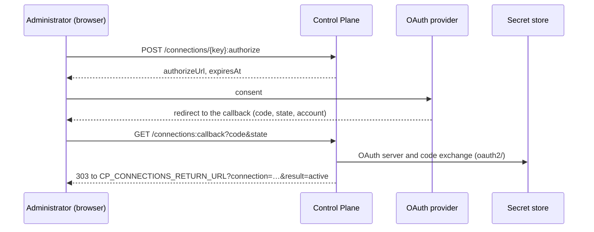

# Connections

A connection is an account in an external system (a CRM, a tracker, an
accounting system) that an organization administrator connects to the platform
once; agents then use it without the secret ever passing through the core to
them. This article is for the administrator, the author of an integration
package, and the developer of a connector: the model, the core API, the OAuth
flow, keys, agent access, revocation, permissions, and events.

The rationale is CP-ADR-0079 (connections in the core) and TAI-ADR-0061. The
access material is kept in the [secret store](../operations/secret-store.md);
the core keeps only the information about the connection.

!!! note "Console"
    Setting up connections in the console will come later. For now, a
    connection is created and connected through the core API described below.

## Model



| Entity | Whose | What it holds |
|---|---|---|
| Connection type (`ConnectionType`) | Data of the provider package | Connection methods (`oauth2`, `token`), OAuth addresses and requested permissions, the account field, the schema of non-secret settings, the default connection key. No secrets |
| A type's OAuth application | The installation, once per type | `client_id` and `client_secret` of the application at the provider; kept only in the secret store |
| Connection (`Connection`) | The tenant | Key, type and its version, account, status, who connected it and when, non-secret settings, `secretRef` (the path of the material in the store) |
| Access material | The secret store | OAuth tokens (the store's plugin refreshes them) or a key pasted by an administrator |

A tenant can have several connections of one type, one per account, with
different keys. Connections are not deleted and their keys are not reused: a
revoked connection stays on record with the `revoked` status.

## Connection type { #connection-type }

A provider package publishes a type with the `ConnectionType` catalog kind; the
fields are described in the [package schema](../reference/package-schema.md#connection-type).
An example of a type with both connection methods:

```yaml
apiVersion: taimen.ai/v1
kind: ConnectionType
key: helpdesk-alpha
spec:
  version: 1
  displayName: Helpdesk Alpha
  auth: [oauth2, token]
  oauth2:
    authorizeUrl: https://auth.helpdesk.example/oauth
    tokenUrlTemplate: https://{account}/oauth2/access_token
    accountParam: account          # the callback parameter that names the account
    authStyle: in_params           # client id and secret go in the exchange request body
    scopes: []
  accountField:
    title: Portal address
    pattern: '^[a-z0-9-]+\.helpdesk\.example$'
  settingsSchema:
    type: object
    properties:
      queue: {type: string}
  defaultKey: helpdesk-alpha
```

| Rule | The core's check |
|---|---|
| `auth` | A non-empty list without repeats from `oauth2` and `token` |
| `oauth2` | Required if and only if `auth` contains `oauth2`. `authorizeUrl` and `tokenUrlTemplate` are `https`; the only placeholder in the template is `{account}`, and it takes whole labels of the host name; no port and no userinfo; the host is an external DNS name (not an IP, not a single label) |
| `accountParam` | Required if `tokenUrlTemplate` contains `{account}` |
| `accountField` | Required with `token` or with `{account}` in the template; `pattern` is a regular expression the whole account matches |
| `settingsSchema` | A JSON Schema with the root `type: object`. Properties named like secrets (`password`, `token`, `secret`, `apikey`, `credential`, `clientSecret`…) are refused |
| Any string of `spec` | A value that looks like a secret (an API key, a JWT, a PEM) gives `422 secret_material_rejected`; the value itself is not echoed in the response |
| Version | The `(key, version)` pair is immutable: the same `spec` again gives `200` with no changes, a different one gives `409 connection_type_version_exists` |

Version statuses go `active` → `deprecated` → `disabled`, forward only. A new
connection is created on the latest `active` version and stays on it until an
explicit `PATCH` with `typeVersion`. Retiring a type in a package installation
(`retire.ConnectionType`) moves all its active versions to `deprecated`: there
will be no new connections, existing ones keep working.

### A type's OAuth application { #oauth-app }

For the `oauth2` method, an application is registered at the provider; its
credentials are set once per type:

```bash
curl -s -X PUT https://platform.example.com/api/v1/connection-types/helpdesk-alpha/oauth-app \
  -H "Authorization: Bearer $TOKEN" -H "Content-Type: application/json" \
  -d '{"clientId": "<client id>", "clientSecret": "<client secret>"}'
```

```json
{"type": "helpdesk-alpha", "configured": true, "clientId": "<client id>", "updatedAt": "2026-10-04T09:00:00Z"}
```

The secret goes to the store (`kv/data/platform/oauth-apps/<type>`) in transit
and does not reach the response, the event log, or the logs. `GET …/oauth-app`
shows only `configured` and `clientId`. The application belongs to the tenant
that wrote it: for another tenant, `GET` answers `configured: false`, and a
write gives `409 oauth_app_owned_by_other_tenant`. A type without `oauth2` gives
`422 auth_not_supported`.

## Connection lifecycle

| Status | Meaning | How it gets there |
|---|---|---|
| `pending` | Created, waiting for authorization | `POST /connections` |
| `active` | The material is in the store, agents can read it | A successful OAuth callback or `PUT …/token`, from any status, including `revoked` |
| `expired` | Access is lost | The connector reported lost access (`PUT …/status`) or the pasted key expired |
| `revoked` | The material is deleted, the agents' policies no longer name it | `:revoke` |

A failed authorization does not change the status: `statusReason` and
`statusMessage` are filled in, and the `connection.authorization_failed` event
is recorded.

### Creating

```bash
curl -s -X POST https://platform.example.com/api/v1/connections \
  -H "Authorization: Bearer $TOKEN" -H "Content-Type: application/json" \
  -d '{"type": "helpdesk-alpha", "settings": {"queue": "support"}}'
```

| Field | Required | Description |
|---|---|---|
| `type` | yes | The type key; an `active` version of it is required, otherwise `422 unknown_connection_type` |
| `key` | | The connection key (`^[a-z0-9][a-z0-9-]{0,62}$`); by default the type's `defaultKey`. A taken key gives `409 connection_key_taken` |
| `displayName` | | 1–200 characters; by default the type's `displayName` |
| `settings` | | Non-secret settings by the `settingsSchema` of the type version; otherwise `422 invalid_connection_settings` |

The response is `201` with the connection's representation:

```json
{
  "id": "<connection-id>",
  "key": "helpdesk-alpha",
  "type": "helpdesk-alpha",
  "typeVersion": 1,
  "displayName": "Helpdesk Alpha",
  "account": null,
  "auth": null,
  "status": "pending",
  "statusReason": null,
  "statusMessage": null,
  "settings": {"queue": "support"},
  "secretRef": null,
  "expiresAt": null,
  "connectedBy": null,
  "connectedAt": null,
  "lastCheckedAt": null,
  "createdBy": "<principal-id>",
  "createdAt": "2026-10-04T09:00:00Z",
  "updatedAt": "2026-10-04T09:00:00Z",
  "version": 1
}
```

`GET /connections/{key}` adds `agents` (the keys of active agents whose
current revision names this connection) and the `ETag:
"connection-<version>"` header. `PATCH /connections/{key}` with `If-Match`
changes `displayName`, `settings` (as a whole), and `typeVersion`; the settings
are checked against the schema of the resulting type version. Unchanged values
do not move the version and record no event.

### Connecting with OAuth { #oauth }



1. `POST /connections/{key}:authorize` (body `{}` or empty) → `{"authorizeUrl":
   "…", "expiresAt": "…"}`. The core issues a one-time state of 256 random bits;
   only its SHA-256 is stored, together with the principal that started the
   authorization; it lives `CP_OAUTH_STATE_TTL_SECONDS` (600 s). Earlier live
   states of the connection are superseded. The consent address gets
   `client_id`, `state`, `response_type=code`, `redirect_uri`, and `scope`.
2. The person consents at the provider, and the provider returns the browser
   to `GET /api/v1/connections:callback`. The route is public: the state
   itself authenticates it.
3. The core consumes the state, checks that the person who started the
   authorization still has an active credential and the `connections.manage`
   permission, takes the account from the `accountParam` parameter, builds the
   exchange address from `tokenUrlTemplate`, and exchanges the code for tokens
   inside the store. The tokens do not reach the core.
4. The connection becomes `active`, the `connection.authorized` event is
   recorded, and the browser goes to
   `CP_CONNECTIONS_RETURN_URL?connection=<key>&result=active`.

| Callback `result` | When | What happens to the connection |
|---|---|---|
| `active` | The exchange succeeded | `active` |
| `failed` (with `reason`) | Consent denied, a provider error, an invalid account, the initiator lacks the permission, the exchange failed | The status stays the same, `statusReason` is the code |
| `invalid_state` | The state is missing, foreign, expired, or already used | Nothing changes and nothing is named |

The `reason` codes: `consent_denied`, `provider_error`, `invalid_account`,
`initiator_not_authorized`, `oauth_exchange_failed`, `oauth_app_not_configured`,
`auth_not_supported`, `secret_store_unavailable`. If
`CP_CONNECTIONS_RETURN_URL` is empty, the callback answers `200 text/plain` with
`result=… reason=…`. Both answers carry `Cache-Control: no-store` and
`Referrer-Policy: no-referrer`; the callback query is not written to the core's
access log, and the edge replaces the values of `code` and `state` with
`REDACTED` in its log.

`:authorize` errors:

| Code | Cause |
|---|---|
| `422 auth_not_supported` | The type version has no `oauth2` |
| `409 oauth_not_configured` | `CP_OAUTH_REDIRECT_URI` or `CP_CONNECTIONS_RETURN_URL` is not set (`details.missing`) |
| `409 oauth_app_not_configured` | The type has no [OAuth application](#oauth-app) |
| `503 secret_store_unavailable` | The store is not configured or not reachable; retrying makes sense |

### Connecting with a key { #token }

For the `token` method, the administrator pastes a long-lived key issued by
the provider:

```bash
curl -s -X PUT https://platform.example.com/api/v1/connections/helpdesk-alpha/token \
  -H "Authorization: Bearer $TOKEN" -H "Content-Type: application/json" \
  -d '{"account": "acme.helpdesk.example", "token": "<key>", "expiresAt": "2027-10-01T00:00:00Z"}'
```

| Field | Required | Description |
|---|---|---|
| `account` | yes | The account, 1–253 characters (empty or longer gives `400 invalid_request`), by `accountField.pattern` (no match gives `422 invalid_account`) |
| `token` | yes | The key, up to 8192 characters; goes to `kv/data/tenants/<t>/connections/<key>` in transit |
| `expiresAt` | | The key's expiry, in the future (otherwise `422 invalid_expiry`). When it passes, the core's worker moves the connection to `expired` with `statusReason: token_expired` |

The connection becomes `active`. If it was OAuth before, the OAuth tokens and
server in the store are deleted. The key does not reach the response, the
`Idempotency-Key` fingerprint, the event log, or the logs.

### Reporting lost access

A connector whose external system has stopped accepting access (for example,
the refresh token was revoked) reports it to the core:

```bash
curl -s -X PUT https://platform.example.com/api/v1/connections/helpdesk-alpha/status \
  -H "Authorization: Bearer $AGENT_TOKEN" -H "Content-Type: application/json" \
  -d '{"status": "expired", "reason": "refresh_rejected", "checkedAt": "2026-10-04T09:05:00Z"}'
```

- The caller needs the `connections.status.write` permission; otherwise `403
  permission_denied`.
- The key must be in the `spec.connections` of the caller's agent; otherwise `403
  connection_not_assigned`, checked before the connection is looked up, so the
  answer does not reveal whether such a key exists.
- `reason` is a code `^[a-z][a-z0-9_]{0,63}$`; a code of another shape gives `400
  invalid_request`.
- Only the `active` → `expired` transition is allowed, and on it `reason` is
  required: without it, `422 status_reason_required`. A repeated
  `active` on `active` or `expired` on `expired` only moves `lastCheckedAt`. Other
  pairs give `409 connection_status_conflict`: access comes back through a new
  authorization, not through the connector.
- A report older than `lastCheckedAt` gives `409 stale_status_report`.
- `message` (up to 500 characters) is stored without anything shaped like
  credentials.

The transition records the `connection.status_changed` event; on it, the
`connections` package creates a reconnect task for whoever connected it.

### Revocation

```bash
curl -s -X POST https://platform.example.com/api/v1/connections/helpdesk-alpha:revoke \
  -H "Authorization: Bearer $TOKEN" -H "Content-Type: application/json" \
  -d '{"reason": "account closed"}'
```

The core deletes the material from the store (the OAuth tokens and server, or
the key with all its versions), sets `revoked`, narrows the agents' policies,
and records `connection.revoked`. `auth`, `secretRef`, and `expiresAt` become
`null`. The agent's next request for the material is refused by the store, and
the agent's SDK raises `connection_revoked`. A repeated revocation is `200`
without an event. A revoked connection can be connected again with the same
authorization.

## Agent access { #agents }

An agent gets access to a connection only if the agent's description names its
key:

```yaml
kind: Agent
key: helpdesk-alpha-observer
spec:
  connections: [helpdesk-alpha]
  # …
```

- `spec.connections` holds up to 20 unique keys. Whether the connection exists
  is not checked on publish: the administrator may create it later.
- A non-empty list needs the `connections.manage` permission of whoever
  publishes the revision, otherwise `403 permission_escalation`
  (`details.missing: ["connections.manage"]`).
- `package-sdk check` warns if a key matches no `defaultKey` of the types of
  the package and its dependencies: the administrator will have to create a
  connection with that key by hand.

### What the agent sees

The agent reads the information about its connections from the core, and the
material only from the store:

| Route | Response |
|---|---|
| `GET /api/v1/agents/me/connections` | `{"items": [...]}`: the connections from `spec.connections` of the current revision that exist |
| `GET /api/v1/agents/me/connections/{key}` | One connection; a key outside the list gives `404` |

```json
{
  "key": "helpdesk-alpha",
  "type": "helpdesk-alpha",
  "typeVersion": 1,
  "account": "acme.helpdesk.example",
  "auth": "oauth2",
  "status": "active",
  "settings": {"queue": "support"},
  "secretRef": "oauth2/creds/tenants/<tenant-id>/connections/helpdesk-alpha",
  "expiresAt": null
}
```

A caller that is not an active registry agent gets `404`.

The agent reads the material like this: it exchanges its PAT for an IAM token
with the `openbao` audience, logs in to the store with `POST
/secrets/v1/auth/jwt/login` and the `agent-<principal-id>` role, and reads `GET
/secrets/v1/<secretRef>`. The store policy allows it only `read` on the paths of
its active connections.

### `ctx.connection` in skill-sdk

Skill and observer code does not repeat this chain by hand; `skill-sdk` does it
(installed with the `connections` extra):

```python
from pydantic import BaseModel
from skill_sdk import SkillContext, skill


class SummaryIn(BaseModel):
    connection: str          # a key from spec.connections of the executor agent
    ticketId: str


class SummaryOut(BaseModel):
    summary: str


@skill("helpdesk.ticket_summary", version="1", side_effects="external_read", risk="low")
async def ticket_summary(inputs: SummaryIn, ctx: SkillContext) -> SummaryOut:
    connection = await ctx.connection(inputs.connection)
    token = await connection.access_token()
    # connection.type, .account, .settings: information without the material
    ...
```

| Property or method | What it gives |
|---|---|
| `key`, `type`, `type_version`, `account`, `auth`, `status`, `settings` | Information from the core; `settings` is read-only |
| `await access_token(fresh=False)` | The token from the store. Cached for no longer than 60 s and no longer than the token's own expiry (minus 5 s); `fresh=True` bypasses the cache |

An observer outside a skill uses `skill_sdk.ConnectionClient.from_environment()`
with the same interface. Environment variables:

| Variable | Default | Purpose |
|---|---|---|
| `SKILL_SDK_SECRET_STORE_URL` | — | Store address through the edge (`https://platform.example.com/secrets`). Without it, the information can be read but the material cannot (`secret_store_unavailable`, `not_configured`) |
| `SKILL_SDK_SECRET_STORE_AUDIENCE` | `openbao` | Audience of the IAM token for the login |
| `SKILL_SDK_SECRET_STORE_SCOPES` | `secrets:read` | Scope of that token |
| `SKILL_SDK_SECRET_STORE_ROLE` | `agent-<principal-id>` from `GET /agents/me` | The `jwt` role in the store |

Errors are `SkillError` with a code:

| Code | Retry | When |
|---|---|---|
| `connection_revoked` | no | The connection is revoked |
| `connection_expired` | no | The connection is `expired` or the token is unavailable (`details.reason`: `token_unavailable`, `token_expired`) |
| `connection_pending` | no | The connection is created but not connected yet |
| `connection_not_found` | no | The key is not in the agent's description, or there is no connection |
| `secret_ref_invalid` | no | The path is outside the connection store |
| `secret_store_unavailable` | yes | The store is not configured, unreachable, sealed, the login was refused, and so on (`details.reason`) |
| `core_unavailable` | yes | The core answered `5xx`, `429`, or is unreachable |

In tests, use `skill_sdk.testing.FakeConnections`: `add()`, `pending()`,
`rotate()`, `revoke()`, `expire()`, `seal()`, and `client()` with a real
`ConnectionClient` on top of the fakes; plug it in with
`configure_connections(lambda ctx: fake.client())`.

### Store policies: `connections-policy-sync` { #policy-sync }

The `control-plane-worker` worker reconciles agents' access in the store
idempotently:

- for each active agent with an active IAM binding that has something to read,
  the `cp-agent-<principal-id>` policy with `read` on the `secretRef` of its
  active connections and on `kv/data/tenants/<t>/agents/<agent>/*` if the agent
  has secrets;
- the `jwt` role `agent-<principal-id>`: `bound_subject` is the principal in
  IAM, `bound_claims {tenant_id, principal_type: agent}`, audience `openbao`, no
  default policy, a 300 s token;
- it runs on the events `agent.revision_published`, `agent.retired`,
  `agent.secret_set`, `agent.secret_deleted`, `iam_binding.*`, and any
  `connection.*`, plus a full pass every `CP_CONNECTIONS_SYNC_SECONDS` (300 s);
  the full pass removes extra policies and roles.

The worker checks the expiry of pasted keys (`expiresAt`) on every cycle.

## Agent secrets by name { #agent-secrets }

Besides connections, an agent can have its own secrets: a name in
`placement.secrets` of its description. The value is set through the core and
kept in the store:

```bash
curl -s -X PUT https://platform.example.com/api/v1/agents/helpdesk-alpha-observer/secrets/api-key \
  -H "Authorization: Bearer $TOKEN" -H "Content-Type: application/json" \
  -d '{"value": "<value>"}'
```

| Route | Permission | Response |
|---|---|---|
| `PUT /api/v1/agents/{key}/secrets/{name}` | `agents.secrets.manage` | `201` for the first value, `200` for a replacement; `{"name", "updatedAt", "updatedBy"}` |
| `GET /api/v1/agents/{key}/secrets` | `agents.read` | `{"items": [...]}`: names only, in alphabetical order |
| `DELETE /api/v1/agents/{key}/secrets/{name}` | `agents.secrets.manage` | `204`; the value is deleted with all its versions |

- The name is `^[a-z0-9][a-z0-9-]{0,62}$`: on `PUT` a wrong name gives `422
  invalid_secret_name`, on `DELETE` it gives `404`, like an unknown name.
- The value is 1 to 65,536 characters; empty or longer gives `400
  invalid_request`. A retired agent gives `409`.
- The path is `kv/data/tenants/<t>/agents/<agent>/<name>`; an agent reads only
  its own secrets.
- The `agent.secret_set` and `agent.secret_deleted` events carry only the name.

## Permissions { #permissions }

| Permission | What it allows |
|---|---|
| `connections.read` | Reading connection types, connections, and the state of a type's OAuth application |
| `connections.manage` | Publishing types and changing the status of their versions, setting the OAuth application, creating, changing, connecting (`:authorize`, `…/token`), and revoking connections; publishing an agent with a non-empty `spec.connections` |
| `connections.status.write` | Reporting lost access (`PUT …/status`), only for a connector whose description names the connection |
| `agents.secrets.manage` | Setting and deleting agent secrets (`PUT`, `DELETE …/secrets/{name}`) |

All four are on the tenant (`resource: tenant`). `admin` covers them; the core
creates no default roles for them. The `/agents/me/connections*` routes need
authentication only: an agent sees only its own connections.

## Events

| Type | Stream | Key payload fields |
|---|---|---|
| `connection_type.published` | connection_type | `key`, `version`, `auth` |
| `connection_type.oauth_app_set` | connection_type | `type`, `created`, without the client id and the secret |
| `connection.created` | connection | `key`, `type`, `typeVersion`, `status` |
| `connection.updated` | connection | `key`, `version`, `changes`: field names only |
| `connection.authorized` | connection | `key`, `type`, `auth`, `previousStatus`, `connectedBy` |
| `connection.authorization_failed` | connection | `key`, `type`, `reason`, `initiatedBy` |
| `connection.status_changed` | connection | `key`, `type`, `from`, `to`, `reason`, `connectedBy` |
| `connection.revoked` | connection | `key`, `type`, `previousStatus` |
| `agent.secret_set` | agent | `agentKey`, `name`, `created` |
| `agent.secret_deleted` | agent | `agentKey`, `name` |

No event carries values, the account, or the provider's text. The core's log
replaces with `[REDACTED]` the values of fields by key name (`authorization`,
`api_key`, `apikey`, `key_hash`, `password`, `token`, `code`, `access_token`,
`refresh_token`, `client_secret`) and drops the query string of the OAuth
callback; it does not check the content of strings. Strings that look like
credentials are replaced with `[redacted]` by content only in the connection's
`statusMessage` and in event texts.

## Configuration { #configuration }

| Variable | Default | Purpose |
|---|---|---|
| `CP_SECRET_STORE_URL` | empty | Store address in the network (`http://openbao:8200`). Empty means the routes that need the store answer `503 secret_store_unavailable` (`details.reason: not_configured`) |
| `CP_SECRET_STORE_AUDIENCE` | `openbao` | Audience of the core's IAM token for logging in to the store |
| `CP_SECRET_STORE_ROLE` | `control-plane` | The core's `jwt` role in the store |
| `CP_SECRET_STORE_TIMEOUT_SECONDS` | `10.0` | Timeout of a request to the store |
| `CP_OAUTH_REDIRECT_URI` | empty | Public `https` address of the callback: `https://platform.example.com/api/v1/connections:callback`; the same address is registered at the provider |
| `CP_CONNECTIONS_RETURN_URL` | empty | The page the callback returns the browser to, with `connection` and `result` |
| `CP_OAUTH_STATE_TTL_SECONDS` | `600` | Lifetime of the one-time state |
| `CP_CONNECTIONS_SYNC_SECONDS` | `300` | Period of the full pass of `connections-policy-sync` |

Non-empty `CP_OAUTH_REDIRECT_URI` and `CP_CONNECTIONS_RETURN_URL` without
`https` fail at startup. The core logs in to the store with its IAM service
account (`CP_IAM_CLIENT_ID`, `CP_IAM_CLIENT_SECRET`); how its role is created is
in [Secret store](../operations/secret-store.md). `deploy/local/compose.yml` does not set
the store address for the core; the same article shows how to set it through
`compose.override.yml`.

## Common problems

| Symptom | Cause | Fix |
|---|---|---|
| `503 secret_store_unavailable`, `reason: not_configured` | The core has no `CP_SECRET_STORE_URL` | Set the address (see [Configuration](#configuration)) |
| `409 oauth_not_configured` on `:authorize` | The callback and return addresses are not set | `CP_OAUTH_REDIRECT_URI`, `CP_CONNECTIONS_RETURN_URL` |
| `409 oauth_app_not_configured` | The type's OAuth application is not set | `PUT /connection-types/{key}/oauth-app` |
| The callback returned `result=invalid_state` | More than 10 minutes passed, the link was opened again, or a new authorization was started | Start `:authorize` again |
| The callback returned `result=failed&reason=initiator_not_authorized` | The initiator's credential or `connections.manage` permission was revoked | Connect as someone who has the permission |
| The agent gets `connection_not_found` | The key is not in `spec.connections` of the current revision, or the connection is not created | Publish a revision with the key; create the connection |
| The agent is refused by the store right after connecting | The worker has not reconciled the policy yet (event-driven, otherwise within 300 s) | Retry; check the `control-plane-worker` log |
| `403 permission_escalation` when publishing an agent | The publisher has no `connections.manage` | Apply the package with an account that has this permission |

## See also

- [Secret store](../operations/secret-store.md)
- [Integrations](../packages/integrations.md)
- [Package schema: connection type](../reference/package-schema.md#connection-type)
- [Events](events.md)
- [Authorization and permissions](authorization.md)
