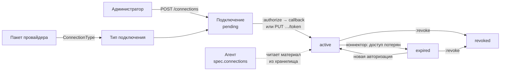
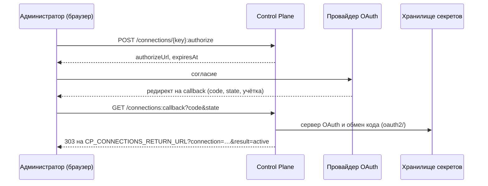

# Подключения

Подключение — учётка внешней системы (CRM, трекера, учётной системы), которую
администратор организации один раз подключает к платформе, а агенты пользуются
ею без доступа к самому секрету через ядро. Статья для администратора, автора
пакета интеграции и разработчика коннектора: модель, API ядра, OAuth-поток,
ключи, доступ агентов, отзыв, права и события.

Обоснование — CP-ADR-0079 (подключения в ядре) и TAI-ADR-0061. Материал доступа
хранится в [хранилище секретов](../operations/secret-store.md); ядро хранит
только сведения о подключении.

!!! note "Консоль"
    Настройка подключений в консоли появится позже. Пока подключение заводится и
    подключается через API ядра, описанный ниже.

## Модель



| Сущность | Чьё | Что содержит |
|---|---|---|
| Тип подключения (`ConnectionType`) | Данные пакета провайдера | Способы подключения (`oauth2`, `token`), адреса OAuth и запрашиваемые права, поле учётки, схему несекретных настроек, ключ подключения по умолчанию. Секретов не содержит |
| OAuth-приложение типа | Инсталляция, один раз на тип | `client_id` и `client_secret` приложения у провайдера; хранится только в хранилище секретов |
| Подключение (`Connection`) | Tenant | Ключ, тип и его версия, учётка, статус, кто и когда подключил, несекретные настройки, `secretRef` — путь материала в хранилище |
| Материал доступа | Хранилище секретов | Токены OAuth (их обновляет плагин хранилища) или ключ, вставленный администратором |

У одного tenant'а может быть несколько подключений одного типа — по одному на
учётку, с разными ключами. Подключения не удаляются, их ключи повторно не
используются: отозванное подключение остаётся в учёте со статусом `revoked`.

## Тип подключения { #connection-type }

Тип публикует пакет провайдера видом каталога `ConnectionType` — поля описаны в
[схеме пакета](../reference/package-schema.md#connection-type). Пример типа с
обоими способами подключения:

```yaml
apiVersion: taimen.ai/v1
kind: ConnectionType
key: helpdesk-alpha
spec:
  version: 1
  displayName: Helpdesk Alpha
  auth: [oauth2, token]
  oauth2:
    authorizeUrl: https://auth.helpdesk.example/oauth
    tokenUrlTemplate: https://{account}/oauth2/access_token
    accountParam: account          # параметр callback, который называет учётку
    authStyle: in_params           # client id и secret — в теле запроса обмена
    scopes: []
  accountField:
    title: Адрес портала
    pattern: '^[a-z0-9-]+\.helpdesk\.example$'
  settingsSchema:
    type: object
    properties:
      queue: {type: string}
  defaultKey: helpdesk-alpha
```

| Правило | Проверка ядра |
|---|---|
| `auth` | Непустой список без повторов из `oauth2` и `token` |
| `oauth2` | Обязателен, если и только если в `auth` есть `oauth2`. `authorizeUrl` и `tokenUrlTemplate` — `https`; в шаблоне единственная подстановка — `{account}`, она занимает целые метки имени хоста; без порта и userinfo; хост — внешнее DNS-имя (не IP, не одна метка) |
| `accountParam` | Обязателен, если в `tokenUrlTemplate` есть `{account}` |
| `accountField` | Обязателен при `token` или при `{account}` в шаблоне; `pattern` — регулярное выражение, которому соответствует вся учётка |
| `settingsSchema` | JSON Schema с корнем `type: object`. Свойства с именами, похожими на секреты (`password`, `token`, `secret`, `apikey`, `credential`, `clientSecret`…), отвергаются |
| Любая строка `spec` | Значение, похожее на секрет (ключ API, JWT, PEM), — `422 secret_material_rejected`; само значение в ответ не попадает |
| Версия | Пара `(key, version)` неизменна: та же `spec` повторно — `200` без изменений, другая — `409 connection_type_version_exists` |

Статусы версии — `active` → `deprecated` → `disabled`, только вперёд. Новое
подключение создаётся на последней `active` версии и остаётся на ней до явного
`PATCH` с `typeVersion`. Вывод типа из оборота в установке пакета
(`retire.ConnectionType`) переводит все его активные версии в `deprecated`:
новых подключений не будет, существующие работают.

### OAuth-приложение типа { #oauth-app }

Для способа `oauth2` у провайдера регистрируется приложение; его учётные данные
задаются один раз на тип:

```bash
curl -s -X PUT https://platform.example.com/api/v1/connection-types/helpdesk-alpha/oauth-app \
  -H "Authorization: Bearer $TOKEN" -H "Content-Type: application/json" \
  -d '{"clientId": "<client id>", "clientSecret": "<client secret>"}'
```

```json
{"type": "helpdesk-alpha", "configured": true, "clientId": "<client id>", "updatedAt": "2026-10-04T09:00:00Z"}
```

Секрет уходит в хранилище (`kv/data/platform/oauth-apps/<тип>`) транзитом и в
ответ, журнал событий и логи не попадает. `GET …/oauth-app` показывает только
`configured` и `clientId`. Приложение принадлежит tenant'у, который его записал:
для другого tenant'а `GET` отвечает `configured: false`, запись —
`409 oauth_app_owned_by_other_tenant`. Тип без `oauth2` — `422 auth_not_supported`.

## Жизненный цикл подключения

| Статус | Что значит | Как попадает |
|---|---|---|
| `pending` | Заведено, ждёт авторизации | `POST /connections` |
| `active` | Материал в хранилище, агенты могут его читать | Успешный OAuth callback или `PUT …/token` — из любого статуса, в том числе из `revoked` |
| `expired` | Доступ потерян | Коннектор сообщил о потере доступа (`PUT …/status`) или истёк срок вставленного ключа |
| `revoked` | Материал удалён, политики агентов его больше не называют | `:revoke` |

Неудачная авторизация статус не меняет: заполняются `statusReason` и
`statusMessage`, пишется событие `connection.authorization_failed`.

### Создание

```bash
curl -s -X POST https://platform.example.com/api/v1/connections \
  -H "Authorization: Bearer $TOKEN" -H "Content-Type: application/json" \
  -d '{"type": "helpdesk-alpha", "settings": {"queue": "support"}}'
```

| Поле | Обязательно | Описание |
|---|---|---|
| `type` | да | Ключ типа; нужна его `active` версия, иначе `422 unknown_connection_type` |
| `key` | | Ключ подключения (`^[a-z0-9][a-z0-9-]{0,62}$`); по умолчанию `defaultKey` типа. Занятый — `409 connection_key_taken` |
| `displayName` | | 1–200 символов; по умолчанию `displayName` типа |
| `settings` | | Несекретные настройки по `settingsSchema` версии типа; иначе `422 invalid_connection_settings` |

Ответ — `201` с представлением подключения:

```json
{
  "id": "<connection-id>",
  "key": "helpdesk-alpha",
  "type": "helpdesk-alpha",
  "typeVersion": 1,
  "displayName": "Helpdesk Alpha",
  "account": null,
  "auth": null,
  "status": "pending",
  "statusReason": null,
  "statusMessage": null,
  "settings": {"queue": "support"},
  "secretRef": null,
  "expiresAt": null,
  "connectedBy": null,
  "connectedAt": null,
  "lastCheckedAt": null,
  "createdBy": "<principal-id>",
  "createdAt": "2026-10-04T09:00:00Z",
  "updatedAt": "2026-10-04T09:00:00Z",
  "version": 1
}
```

`GET /connections/{key}` добавляет `agents` — ключи активных агентов, чья
текущая ревизия называет это подключение, — и заголовок `ETag:
"connection-<version>"`. `PATCH /connections/{key}` с `If-Match` меняет
`displayName`, `settings` (целиком) и `typeVersion`; настройки проверяются по
схеме итоговой версии типа. Неизменённые значения версию не двигают и события не
пишут.

### Подключение через OAuth { #oauth }



1. `POST /connections/{key}:authorize` (тело `{}` или пустое) → `{"authorizeUrl":
   "…", "expiresAt": "…"}`. Ядро выпускает одноразовый state — 256 случайных бит,
   хранится только его SHA-256 вместе с principal, который начал авторизацию; срок —
   `CP_OAUTH_STATE_TTL_SECONDS` (600 с). Прежние живые state подключения
   гасятся. В адрес согласия добавляются `client_id`, `state`,
   `response_type=code`, `redirect_uri` и `scope`.
2. Человек соглашается у провайдера, провайдер возвращает браузер на
   `GET /api/v1/connections:callback`. Маршрут публичный: его аутентифицирует
   сам state.
3. Ядро гасит state, проверяет, что у начавшего авторизацию всё ещё есть
   действующий credential и право `connections.manage`, берёт учётку из
   параметра `accountParam`, собирает адрес обмена по `tokenUrlTemplate` и меняет
   код на токены внутри хранилища. Токены в ядро не попадают.
4. Подключение — `active`, событие `connection.authorized`; браузер уходит на
   `CP_CONNECTIONS_RETURN_URL?connection=<ключ>&result=active`.

| `result` callback | Когда | Что с подключением |
|---|---|---|
| `active` | Обмен прошёл | `active` |
| `failed` (с `reason`) | Отказ согласия, ошибка провайдера, неверная учётка, у начавшего нет права, обмен не удался | Статус прежний, `statusReason` — код |
| `invalid_state` | State нет, он чужой, просрочен или уже использован | Ничего не меняется и не называется |

Коды `reason`: `consent_denied`, `provider_error`, `invalid_account`,
`initiator_not_authorized`, `oauth_exchange_failed`, `oauth_app_not_configured`,
`auth_not_supported`, `secret_store_unavailable`. Если `CP_CONNECTIONS_RETURN_URL`
пуст, callback отвечает `200 text/plain` с `result=… reason=…`. Оба ответа — с
`Cache-Control: no-store` и `Referrer-Policy: no-referrer`; query callback не
пишется в журнал доступа ядра, а edge заменяет в журнале значения `code` и
`state` на `REDACTED`.

Ошибки `:authorize`:

| Код | Причина |
|---|---|
| `422 auth_not_supported` | У версии типа нет `oauth2` |
| `409 oauth_not_configured` | Не заданы `CP_OAUTH_REDIRECT_URI` или `CP_CONNECTIONS_RETURN_URL` (`details.missing`) |
| `409 oauth_app_not_configured` | Для типа не задано [OAuth-приложение](#oauth-app) |
| `503 secret_store_unavailable` | Хранилище не настроено или недоступно; повтор имеет смысл |

### Подключение ключом { #token }

Для способа `token` администратор вставляет долгоживущий ключ, выданный
провайдером:

```bash
curl -s -X PUT https://platform.example.com/api/v1/connections/helpdesk-alpha/token \
  -H "Authorization: Bearer $TOKEN" -H "Content-Type: application/json" \
  -d '{"account": "acme.helpdesk.example", "token": "<ключ>", "expiresAt": "2027-10-01T00:00:00Z"}'
```

| Поле | Обязательно | Описание |
|---|---|---|
| `account` | да | Учётка, 1–253 символа (пустая или длиннее — `400 invalid_request`), по `accountField.pattern` (не совпала — `422 invalid_account`) |
| `token` | да | Ключ, до 8192 символов; уходит в `kv/data/tenants/<t>/connections/<ключ>` транзитом |
| `expiresAt` | | Срок ключа, в будущем (иначе `422 invalid_expiry`). По истечении воркер ядра переводит подключение в `expired` с `statusReason: token_expired` |

Подключение становится `active`. Если раньше оно было OAuth, токены и сервер OAuth
в хранилище удаляются. Ключ не попадает в ответ, отпечаток `Idempotency-Key`,
журнал событий и логи.

### Сообщение о потере доступа

Коннектор, у которого внешняя система перестала принимать доступ (например,
отозван refresh token), сообщает ядру:

```bash
curl -s -X PUT https://platform.example.com/api/v1/connections/helpdesk-alpha/status \
  -H "Authorization: Bearer $AGENT_TOKEN" -H "Content-Type: application/json" \
  -d '{"status": "expired", "reason": "refresh_rejected", "checkedAt": "2026-10-04T09:05:00Z"}'
```

- Нужно право `connections.status.write`, иначе `403 permission_denied`.
- Ключ должен быть в `spec.connections` агента вызывающего, иначе `403
  connection_not_assigned` — до поиска подключения, так что ответ не говорит, есть
  ли такой ключ.
- `reason` — код `^[a-z][a-z0-9_]{0,63}$`; код другого вида — `400
  invalid_request`.
- Допустим только переход `active` → `expired`, и на нём `reason` обязателен: без
  него — `422 status_reason_required`. Повтор `active`
  на `active` или `expired` на `expired` только двигает `lastCheckedAt`. Прочие пары —
  `409 connection_status_conflict`: доступ возвращается новой авторизацией, а не
  коннектором.
- Отчёт старше `lastCheckedAt` — `409 stale_status_report`.
- `message` (до 500 символов) хранится без всего, похожего на учётные данные.

Переход пишет событие `connection.status_changed`; на нём пакет `connections`
заводит задачу переподключения тому, кто подключал.

### Отзыв

```bash
curl -s -X POST https://platform.example.com/api/v1/connections/helpdesk-alpha:revoke \
  -H "Authorization: Bearer $TOKEN" -H "Content-Type: application/json" \
  -d '{"reason": "учётка закрыта"}'
```

Ядро удаляет материал из хранилища (токены и сервер OAuth или ключ со всеми
версиями), ставит `revoked`, сужает политики агентов и пишет
`connection.revoked`. `auth`, `secretRef` и `expiresAt` становятся `null`.
Следующий запрос агента за материалом получает отказ хранилища, а SDK агента —
ошибку `connection_revoked`. Повторный отзыв — `200` без события. Подключить
отозванное подключение снова можно той же авторизацией.

## Доступ агентов { #agents }

Агент получает доступ к подключению, только если описание агента называет его
ключ:

```yaml
kind: Agent
key: helpdesk-alpha-observer
spec:
  connections: [helpdesk-alpha]
  # …
```

- `spec.connections` — до 20 уникальных ключей. Существование подключения при
  публикации не проверяется: администратор может завести его позже.
- Непустой список требует права `connections.manage` у того, кто публикует
  ревизию, иначе `403 permission_escalation` (`details.missing:
  ["connections.manage"]`).
- `package-sdk check` предупреждает, если ключ не совпадает ни с одним
  `defaultKey` типов пакета и его зависимостей: подключение с таким ключом
  администратору придётся завести вручную.

### Что видит агент

Сведения о своих подключениях агент читает у ядра; материал — только из
хранилища:

| Маршрут | Ответ |
|---|---|
| `GET /api/v1/agents/me/connections` | `{"items": [...]}` — подключения из `spec.connections` текущей ревизии, которые существуют |
| `GET /api/v1/agents/me/connections/{key}` | Одно подключение; ключ вне списка — `404` |

```json
{
  "key": "helpdesk-alpha",
  "type": "helpdesk-alpha",
  "typeVersion": 1,
  "account": "acme.helpdesk.example",
  "auth": "oauth2",
  "status": "active",
  "settings": {"queue": "support"},
  "secretRef": "oauth2/creds/tenants/<tenant-id>/connections/helpdesk-alpha",
  "expiresAt": null
}
```

Вызывающий, который не является активным агентом реестра, получает `404`.

Материал агент читает так: обменивает свой PAT на токен IAM audience `openbao`,
входит в хранилище `POST /secrets/v1/auth/jwt/login` ролью
`agent-<principal-id>` и читает `GET /secrets/v1/<secretRef>`. Политика хранилища
разрешает ему только `read` путей своих активных подключений.

### `ctx.connection` в skill-sdk

Код скилла и наблюдателя не повторяет эту цепочку руками — её делает
`skill-sdk` (установка с extra `connections`):

```python
from pydantic import BaseModel
from skill_sdk import SkillContext, skill


class SummaryIn(BaseModel):
    connection: str          # ключ из spec.connections агента-исполнителя
    ticketId: str


class SummaryOut(BaseModel):
    summary: str


@skill("helpdesk.ticket_summary", version="1", side_effects="external_read", risk="low")
async def ticket_summary(inputs: SummaryIn, ctx: SkillContext) -> SummaryOut:
    connection = await ctx.connection(inputs.connection)
    token = await connection.access_token()
    # connection.type, .account, .settings — сведения без материала
    ...
```

| Свойство и метод | Что даёт |
|---|---|
| `key`, `type`, `type_version`, `account`, `auth`, `status`, `settings` | Сведения из ядра; `settings` только для чтения |
| `await access_token(fresh=False)` | Токен из хранилища. Кэш — не дольше 60 с и не дольше срока самого токена (минус 5 с); `fresh=True` — мимо кэша |

Наблюдателю вне скилла — `skill_sdk.ConnectionClient.from_environment()` с тем же
интерфейсом. Переменные окружения:

| Переменная | По умолчанию | Назначение |
|---|---|---|
| `SKILL_SDK_SECRET_STORE_URL` | — | Адрес хранилища через edge (`https://platform.example.com/secrets`). Без него сведения читаются, материал — нет (`secret_store_unavailable`, `not_configured`) |
| `SKILL_SDK_SECRET_STORE_AUDIENCE` | `openbao` | Audience токена IAM для входа |
| `SKILL_SDK_SECRET_STORE_SCOPES` | `secrets:read` | Scope этого токена |
| `SKILL_SDK_SECRET_STORE_ROLE` | `agent-<principal-id>` из `GET /agents/me` | Роль `jwt` в хранилище |

Ошибки — `SkillError` с кодом:

| Код | Повтор | Когда |
|---|---|---|
| `connection_revoked` | нет | Подключение отозвано |
| `connection_expired` | нет | Подключение `expired` или токен недоступен (`details.reason`: `token_unavailable`, `token_expired`) |
| `connection_pending` | нет | Подключение заведено, но ещё не подключено |
| `connection_not_found` | нет | Ключа нет в описании агента или подключения нет |
| `secret_ref_invalid` | нет | Путь вне хранилища подключений |
| `secret_store_unavailable` | да | Хранилище не настроено, недоступно, запечатано, вход отклонён и т.п. (`details.reason`) |
| `core_unavailable` | да | Ядро ответило `5xx`, `429` или недоступно |

В тестах — `skill_sdk.testing.FakeConnections`: `add()`, `pending()`, `rotate()`,
`revoke()`, `expire()`, `seal()` и `client()` с настоящим `ConnectionClient`
поверх фейков; подключается `configure_connections(lambda ctx: fake.client())`.

### Политики хранилища: `connections-policy-sync` { #policy-sync }

Воркер `control-plane-worker` сводит доступ агентов в хранилище идемпотентно:

- для каждого активного агента с активной IAM-связкой, которому есть что читать,
  — политика `cp-agent-<principal-id>` с `read` на `secretRef` его активных
  подключений и на `kv/data/tenants/<t>/agents/<агент>/*`, если у агента есть
  секреты;
- роль `jwt` `agent-<principal-id>`: `bound_subject` — principal в IAM,
  `bound_claims {tenant_id, principal_type: agent}`, audience `openbao`, без
  default-политики, токен 300 с;
- запуск — по событиям `agent.revision_published`, `agent.retired`,
  `agent.secret_set`, `agent.secret_deleted`, `iam_binding.*` и любому
  `connection.*`, а также полным проходом раз в `CP_CONNECTIONS_SYNC_SECONDS`
  (300 с); полный проход убирает лишние политики и роли.

Истечение вставленных ключей (`expiresAt`) воркер проверяет на каждом цикле.

## Секреты агентов по имени { #agent-secrets }

Кроме подключений у агента бывают свои секреты — имя в `placement.secrets`
описания. Значение задаётся через ядро и хранится в хранилище:

```bash
curl -s -X PUT https://platform.example.com/api/v1/agents/helpdesk-alpha-observer/secrets/api-key \
  -H "Authorization: Bearer $TOKEN" -H "Content-Type: application/json" \
  -d '{"value": "<значение>"}'
```

| Маршрут | Право | Ответ |
|---|---|---|
| `PUT /api/v1/agents/{key}/secrets/{name}` | `agents.secrets.manage` | `201` — первое значение, `200` — замена; `{"name", "updatedAt", "updatedBy"}` |
| `GET /api/v1/agents/{key}/secrets` | `agents.read` | `{"items": [...]}` — только имена, по алфавиту |
| `DELETE /api/v1/agents/{key}/secrets/{name}` | `agents.secrets.manage` | `204`; значение удаляется со всеми версиями |

- Имя — `^[a-z0-9][a-z0-9-]{0,62}$`: у `PUT` неверное имя — `422
  invalid_secret_name`, у `DELETE` — `404`, как у неизвестного имени.
- Значение — от 1 до 65 536 символов; пустое или длиннее — `400
  invalid_request`. Выведенный агент — `409`.
- Путь — `kv/data/tenants/<t>/agents/<агент>/<имя>`; агент читает только свои
  секреты.
- События `agent.secret_set` и `agent.secret_deleted` несут только имя.


## Права { #permissions }

| Право | Что разрешает |
|---|---|
| `connections.read` | Читать типы подключений, подключения и состояние OAuth-приложения типа |
| `connections.manage` | Публиковать типы и менять статус их версий, задавать OAuth-приложение, заводить, менять, подключать (`:authorize`, `…/token`) и отзывать подключения; публиковать агента с непустым `spec.connections` |
| `connections.status.write` | Сообщать о потере доступа (`PUT …/status`) — только коннектору, чьё описание называет подключение |
| `agents.secrets.manage` | Задавать и удалять секреты агентов (`PUT`, `DELETE …/secrets/{name}`) |

Все четыре — на tenant (`resource: tenant`). `admin` покрывает их; отдельных
ролей по умолчанию ядро не заводит. Маршруты `/agents/me/connections*` требуют
только аутентификации: агент видит лишь свои подключения.

## События

| Тип | Поток | Ключевые поля payload |
|---|---|---|
| `connection_type.published` | connection_type | `key`, `version`, `auth` |
| `connection_type.oauth_app_set` | connection_type | `type`, `created` — без client id и секрета |
| `connection.created` | connection | `key`, `type`, `typeVersion`, `status` |
| `connection.updated` | connection | `key`, `version`, `changes` — только имена полей |
| `connection.authorized` | connection | `key`, `type`, `auth`, `previousStatus`, `connectedBy` |
| `connection.authorization_failed` | connection | `key`, `type`, `reason`, `initiatedBy` |
| `connection.status_changed` | connection | `key`, `type`, `from`, `to`, `reason`, `connectedBy` |
| `connection.revoked` | connection | `key`, `type`, `previousStatus` |
| `agent.secret_set` | agent | `agentKey`, `name`, `created` |
| `agent.secret_deleted` | agent | `agentKey`, `name` |

Ни одно событие не несёт значений, учётки и текста провайдера. Журнал ядра
заменяет на `[REDACTED]` значения полей по имени ключа (`authorization`,
`api_key`, `apikey`, `key_hash`, `password`, `token`, `code`, `access_token`,
`refresh_token`, `client_secret`), а у callback OAuth отбрасывает строку запроса;
содержимое строк журнал не проверяет. Строки, похожие на учётные данные,
заменяются на `[redacted]` по содержимому только в `statusMessage` подключения и в
текстах событий.

## Конфигурация { #configuration }

| Переменная | По умолчанию | Назначение |
|---|---|---|
| `CP_SECRET_STORE_URL` | пусто | Адрес хранилища в сети (`http://openbao:8200`). Пусто — маршруты, которым нужно хранилище, отвечают `503 secret_store_unavailable` (`details.reason: not_configured`) |
| `CP_SECRET_STORE_AUDIENCE` | `openbao` | Audience токена IAM ядра для входа в хранилище |
| `CP_SECRET_STORE_ROLE` | `control-plane` | Роль `jwt` ядра в хранилище |
| `CP_SECRET_STORE_TIMEOUT_SECONDS` | `10.0` | Таймаут запроса к хранилищу |
| `CP_OAUTH_REDIRECT_URI` | пусто | Публичный `https`-адрес callback: `https://platform.example.com/api/v1/connections:callback`; его же регистрируют у провайдера |
| `CP_CONNECTIONS_RETURN_URL` | пусто | Страница, на которую callback возвращает браузер с `connection` и `result` |
| `CP_OAUTH_STATE_TTL_SECONDS` | `600` | Срок одноразового state |
| `CP_CONNECTIONS_SYNC_SECONDS` | `300` | Период полного прохода `connections-policy-sync` |

Непустые `CP_OAUTH_REDIRECT_URI` и `CP_CONNECTIONS_RETURN_URL` без `https` — отказ
при старте. Ядро входит в хранилище своим service account'ом IAM
(`CP_IAM_CLIENT_ID`, `CP_IAM_CLIENT_SECRET`); как заводится его роль — в
[Хранилище секретов](../operations/secret-store.md). В `deploy/local/compose.yml` адрес
хранилища ядру не задан — см. там же, как задать его через
`compose.override.yml`.

## Типичные проблемы

| Симптом | Причина | Решение |
|---|---|---|
| `503 secret_store_unavailable`, `reason: not_configured` | У ядра нет `CP_SECRET_STORE_URL` | Задать адрес (см. [Конфигурация](#configuration)) |
| `409 oauth_not_configured` на `:authorize` | Не заданы адреса callback и возврата | `CP_OAUTH_REDIRECT_URI`, `CP_CONNECTIONS_RETURN_URL` |
| `409 oauth_app_not_configured` | Не задано OAuth-приложение типа | `PUT /connection-types/{key}/oauth-app` |
| Callback вернул `result=invalid_state` | Прошло больше 10 минут, ссылку открыли повторно или начали новую авторизацию | Начать `:authorize` заново |
| Callback вернул `result=failed&reason=initiator_not_authorized` | У начавшего авторизацию отозван credential или право `connections.manage` | Подключать тем, у кого есть право |
| Агент получает `connection_not_found` | Ключа нет в `spec.connections` текущей ревизии или подключение не заведено | Опубликовать ревизию с ключом; завести подключение |
| Агент получает отказ хранилища сразу после подключения | Воркер ещё не свёл политику (событийный запуск, иначе до 300 с) | Повторить; проверить журнал `control-plane-worker` |
| `403 permission_escalation` при публикации агента | У публикующего нет `connections.manage` | Применять пакет учёткой с этим правом |

## См. также

- [Хранилище секретов](../operations/secret-store.md)
- [Интеграции](../packages/integrations.md)
- [Схема пакета: тип подключения](../reference/package-schema.md#connection-type)
- [События](events.md)
- [Авторизация и права](authorization.md)
