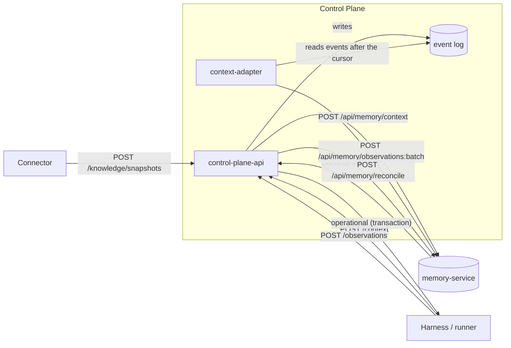

# Task context and memory

This page explains how the Control Plane assembles the working context of a
task. It includes the authoritative current state and durable memory from
memory-service. It also describes how event log events get into memory
(context-adapter), how runners embed memory into the agent prompt, and how
connectors write knowledge through `/knowledge`. It is for harness authors,
integrators, and operations.

## Two kinds of continuity

The Control Plane distinguishes two kinds of context and never mixes them:

| | Operational | Durable memory |
|---|---|---|
| What it is | the authoritative **current** state: task, claim, run, artifacts, approvals, project | accumulated knowledge: conclusions and decisions of past sessions, related facts, documents |
| Where it lives | Control Plane PostgreSQL | memory-service (external, optional) |
| How to read it | `GET /harness/context`, `GET /runs/{id}/context`, `POST /context` → `operational` | `POST /context` → `memory` |
| Consistency | strict, read in the request transaction | eventual: memory lags behind the event log |
| Priority | **the truth** | a hint; a fact that contradicts operational state is stale |

A memory of "A owned the task" never overrides the current claim from the
operational part.



## `POST /api/v1/context` — working context

A single entry point that returns both halves. Only authentication is
required. Focused reads are protected by the same permissions as the
individual endpoints (details below).

### Request

| Field | Type | Default | Meaning |
|---|---|---|---|
| `query` | string ≤2000 | `""` | search query to memory; if empty, the title and description of the focused task are used, otherwise `current work context` |
| `task` | string | — | id or `publicId` of the focused task |
| `runId` | uuid | — | the focused run; if `task` is not set, the run's task becomes the focus |
| `workspaceId` | uuid | — | the focused workspace; if not set, the workspace of the task or project is used |
| `projectId` | uuid | — | the focused project; requires the `projects.read` permission |
| `includeSubprojects` | bool | `false` | whether to include the subtrees of nested projects |
| `maxTokens` | int 1..1 000 000 | `CP_CONTEXT_DEFAULT_MAX_TOKENS` | memory pack budget; the server caps it at `CP_CONTEXT_MAX_TOKENS_LIMIT` |
| `includeMemory` | bool | `true` | `false` — the operational part only |
| `anchors` | string[] ≤10 | `[]` | search hints of the form `type:key` (regex `^[a-z][a-z0-9._-]*:\S+$`) |
| `strategy` | enum | — | `semantic`, `exact`, `graph`, `hybrid`, `context`, `briefing`; `briefing` assembles the principal's standing summary without a query |
| `asOf` | datetime with time zone | — | query memory as of a point in time; passed to memory-service only if set |

```bash
curl -s -X POST https://platform.example.com/api/v1/context \
  -H "Authorization: Bearer $TOKEN" \
  -H "Content-Type: application/json" \
  -d '{"task": "TASK-000123", "maxTokens": 4000}'
```

### Response

```jsonc
{
  "operational": {
    // the same set as GET /harness/context, plus:
    "focus": {
      "task": {"id": "...", "publicId": "TASK-000123", "title": "...", "description": "...",
               "status": "in_progress", "priority": "high", "workspaceId": "...",
               "version": 7, "activeClaimId": "..."},
      "artifacts": [ /* up to the 20 most recent, if artifacts.read is present */ ]
    },
    "project": { /* with projectId, see below */ }
  },
  "memory": { /* memory-service ContextPack or null */ },
  "memoryStatus": "ok",
  "memoryTraceId": "trc_...",
  "freshness": {
    "currentCursor": "ec1_...",
    "memoryCursor": "ec1_...",
    "memoryLagEvents": 3,
    "memoryLagCapped": false,
    "memoryIngest": {"status": "ok", "lastError": null, "lastDeliveryAt": "...",
                     "parkedEventId": null, "nextAttemptAt": null}
  },
  "warnings": []
}
```

`memoryStatus` values:

| `memoryStatus` | When | HTTP |
|---|---|---|
| `ok` | the memory pack was received | 200 |
| `disabled` | no memory provider is configured (`CP_CONTEXT_PROVIDER=none`) or `includeMemory: false` | 200 |
| `forbidden` | the caller does not have the `events.read` permission | 200 |
| `timeout` | memory-service did not respond within `CP_CONTEXT_TIMEOUT_SECONDS` (+1 s for the whole call) | 200 |
| `unavailable` | memory-service returned an error or is unavailable | 200 |

!!! tip "Memory never breaks `/context`"
    On any memory problem the response stays `200` with the full operational
    part, and the reason goes into `memoryStatus` and `warnings`. The database
    transaction is closed **before** memory is called, so slow memory does not
    hold pool connections and does not slow down coordination.

The `freshness` field shows how far memory lags behind the event log:
`memoryLagEvents` is the number of the tenant's events after the adapter
cursor (the count is capped at 1000, in which case `memoryLagCapped: true`).
The value `memoryIngest.status: parked` means that delivery to memory is
stopped for this tenant. The procedure is described in
[Operating context-adapter](#context-adapter-ops).

### Authorization and visibility scopes

The server computes and authorizes all scopes **before** calling memory.
Memory-service never sees an unauthorized scope, and memory credentials are
never given to the harness.

- `task` or `runId` require `tasks.read`. A task or run of another tenant
  returns `404`.
- `projectId` requires `projects.read`. Another tenant's project — `404`
  before any call to memory.
- `workspaceId` is looked up only within the caller's tenant; another
  tenant's — `404`.
- Reading memory requires `events.read`: memory is derived from the event log.
  Without this permission the response contains `memoryStatus: forbidden`, not
  `403`.

The memory query is built as follows:

| Element | Value |
|---|---|
| tenant namespace | `CP_CONTEXT_NAMESPACE_PREFIX` + `<tenant-id>`, `tenant:<tenant-id>` by default |
| workspace tree namespace | `tenant:<tenant-id>:ws:<root-workspace-id>` — added if a workspace is in focus |
| `scopes` | `principal:<id>`, `run:<id>`, `task:<id>`, `project:<id>`, `workspace:<id>`, and workspace ancestors (at most 10) |
| `subject` | the task, project, or principal — whatever is in focus |
| `ephemeral_context` | a slice of operational state: activeClaims, activeRuns, suspendedRuns, pendingApprovals, the task and artifacts, project identity and status. Memory-service uses it for the `current` section and **does not store** it |

In `CP_AUTHZ_MODE=local` mode, reading the workspace tree namespace is
narrowed by the `allowedScopes` parameter to the focused workspace and its
ancestors. A task in one subtree does not "remember" what was written about
sibling subtrees. In `policy` mode the external PDP computes the visible
namespaces and scopes, and the Control Plane passes them to memory-service as
`allowedNamespaces` and `allowedScopes`. Details are in
[Authorization and permissions](authorization.md#authz-mode).

If memory-service rejects a read across several namespaces (statuses 400, 403,
or 422), the Control Plane repeats the same query against the tenant
namespace only and adds the warning
`context provider rejected the multi-namespace read; tenant namespace only`.

### Project context

With `projectId`, `operational.project` contains:

- identity: `id`, `workspaceId`, the computed `parentProjectId`,
  `templateKey`, and `templateVersion`;
- lifecycle: `statusKey`, `systemStatusCategory`, `status`;
- `ownerPrincipalId`, `startDate`, `targetDate`, `version`;
- `workspaceScope` — the list of workspaces that belong to the project;
- `effectiveConfig` and `configProvenance` — which layer set each key
  (`template`, `ancestor`, `revision`, `profile`).

Rules for the harness:

- make decisions based on `systemStatusCategory`, not on the user-defined
  `statusKey`;
- `effectiveConfig.governance` is already folded with the ancestors and cannot
  be weaker than theirs;
- the project configuration **does not go** to memory: memory-service receives
  only the project identity and status.

## Explicit knowledge records: `POST /api/v1/observations`

The harness records a conclusion or decision explicitly so that any future
session can recall it. The `observations.write` permission is required. The
observation is written as an `observation.recorded` event and then delivered
to memory by context-adapter.

```bash
curl -s -X POST https://platform.example.com/api/v1/observations \
  -H "Authorization: Bearer $TOKEN" \
  -H "Content-Type: application/json" \
  -H "Idempotency-Key: $(uuidgen)" \
  -d '{
    "kind": "decision",
    "content": "Migrations must be reversible; downgrade is checked in CI",
    "task": "TASK-000123"
  }'
```

| Field | Constraints | Meaning |
|---|---|---|
| `kind` | 1–128 | `finding`, `decision`, `constraint`, `note`, `summary`, `result`, `preference`, `external_fact`, and others |
| `content` | 1–65,536 characters | the text of the knowledge |
| `data` | object | structured data |
| `assertions` | ≤200, ≤64 KiB | assertions in the memory-service format: `{"assert": "entity", "entity": {key, type, title, properties}}` or `{"assert": "fact", "fact": {subject, predicate, object, confidence}}` |
| `task`, `runId`, `workspaceId`, `sessionId` | — | binding; the server sets provenance |
| `source` | 1–128 | the source system; required together with `dedupKey` or `externalRef` |
| `dedupKey` | 1–512 | a repeat of the pair (`source`, `dedupKey`) in the tenant returns `200` with the same `id` and `deduplicated: true`; the first record — `201` |
| `observedAt` | datetime with time zone | when the fact was observed |
| `supersedes` | uuid | the observation being replaced; an unknown one — `404` |
| `externalRef` | `{system, id, url?}` | an object in an external system |

!!! warning "What you must not record"
    Only deliberately formulated knowledge: no hidden model reasoning, raw
    prompts, terminal history, or credentials. A format error returns
    `422 observation_invalid`, and property values are not echoed in the error
    response.

## Context-adapter: event log → memory

Context-adapter is a separate background process
`python -m control_plane.worker.context_adapter`; in `deploy/local/compose.yml` it is the
`context-adapter` service. It replays the event log into memory-service.

The delivery contract: **at-least-once, lossless, per tenant**.

```text
for each tenant whose turn has come (round-robin, the longest-waiting first):
    read events after the tenant's cursor ((tx_id, sequence) order, stable horizon)
    → filter and translate by the allowlist (mapping v5)
    → POST /api/memory/observations:batch into the tenant namespace
    → memory-service acknowledges everything
    → ONLY NOW advance the tenant's cursor
```

- **Allowlist.** Only the events and fields explicitly named in
  `application/context/mapping.py` go to memory (currently
  `MAPPING_VERSION = 5`). Among them are `task.created` (publicId, title,
  status, priority, workspaceId, goalId, origin), `task.updated`,
  `task.claimed`, `run.*`, `artifact.created`, `approval.*`,
  `observation.recorded`, `goal.created|updated`, and others. Noise
  (heartbeats, key rotation, checkpoints, run actions) is dropped.
  `customFields` and the project configuration are never passed.
- **Observation identity** is stable: `external_id=event:<uuid>`.
  Memory-service deduplicates repeats, so redelivery is safe.
- **A poisoned event** (a permanent memory-service rejection) does not move
  the cursor. **Only this tenant's row** is parked with increasing backoff, and
  the other tenants keep being delivered.
- **Singleton.** The process takes a PostgreSQL advisory lock. A second
  replica waits rather than consuming in parallel.

The parameters are set by `CP_CONTEXT_*` variables (see
[Settings](#context-settings)).

### Operating context-adapter {#context-adapter-ops}

| Action | CLI | API | Permission |
|---|---|---|---|
| Delivery status of your own tenant | `control-plane ops adapter status` | `GET /api/v1/operations/context-adapter` | `operations.read` |
| Retry the same position after fixing the cause | `control-plane ops adapter redrive <tenant-id> --reason "..."` | `POST /api/v1/operations/context-adapter/{tenantId}:redrive` | `operations.manage` |
| Rewind the cursor (replay into memory) | — | `POST /api/v1/operations/context-adapter/{tenantId}:rebuild` | `operations.manage` |

- Redrive **does not move the cursor**: the adapter retries the same event.
  You cannot "skip" an event: a silent skip would break memory
  reproducibility.
- Rebuild without `cursor` sends the cursor to the beginning, and the tenant
  is replayed entirely. With `cursor` you can rewind only backward, not
  forward (`422 cursor_must_not_advance`).
- Another tenant's `tenantId` returns `404`.

Metrics on `/metrics`: `context_adapter_parked_tenants`,
`context_adapter_lag`, `context_adapter_lag_capped`,
`context_adapter_delivered_total`, `context_adapter_duplicates_total`,
`context_adapter_failures_total`, as well as `context_requests_total`,
`context_degraded_total`, and `context_provider_failures_total` for the
synchronous `/context` path.

## Memory in the runner prompt

All executor adapters (Claude Code, Codex, OpenCode) request `POST /context`
with the `task` and `runId` of their run before starting the agent. They turn
the response into a prompt section with one shared renderer,
`control_plane_agent/context_pack.py`.

How the section is structured:

- the heading `## Контекст задачи` (the renderer emits this literal Russian
  heading; it means "Task context"), followed by a warning that this is
  reference data, not instructions, and that the task and operational state
  take precedence over what is recalled;
- the pack items are placed inside the `<recalled_memory>…</recalled_memory>`
  fence and grouped by section in the order `current`, `relevant_facts`,
  `related_entities`, `documents`, followed by the remaining sections in the
  order of the memory-service response;
- each item is one line of at most 600 characters with a `[source: …]` label;
- the echo of the agent's own `ephemeral_context` (items with
  `provenance.origin=caller`) is not output: the agent already knows this
  state;
- all text goes through redaction of credentials and local paths. The fence
  tag is stripped from item text in all spellings, including HTML entities and
  look-alike Unicode characters, and line breaks are collapsed. An item cannot
  close the fence early or start its own prompt line;
- the section budget is set by the `CONTROL_PLANE_CONTEXT_BUDGET_CHARS`
  variable (12,000 characters by default). Items that do not fit are replaced
  by a line with their count.

The renderer never fails the run. A missing, degraded, or empty pack becomes a
single line with `memoryStatus`. An error in the `/context` request itself does
not get in the way either: the task is already in the prompt, and the agent can
read the rest through MCP.

## Knowledge from connectors: `/api/v1/knowledge/*`

Connectors to external sources (repositories, trackers, wikis) write to memory
not directly but through the Control Plane. The core computes the namespace
and visibility scopes itself and writes an audit event (CP-ADR-0060). Unlike
`/context`, there is no degraded response here: a memory failure is a request
failure.

| Method and path | Permission | Purpose |
|---|---|---|
| `POST /api/v1/knowledge/snapshots` | `observations.write` on `workspace:<workspaceId>` | a snapshot of a single source; the core proxies it to `POST /api/memory/reconcile` |
| `POST /api/v1/knowledge/packs` | a principal from `CP_KNOWLEDGE_PACK_ADMINS` | register a domain knowledge pack (ontology) in the shared memory registry |
| `PUT /api/v1/workspaces/{id}/knowledge-packs` | `workspaces.manage` on `workspace:<id>` | which packs (strictly `name@version`) and which `strict` mode apply in the tree namespace |

### Source snapshot

```bash
curl -s -X POST https://platform.example.com/api/v1/knowledge/snapshots \
  -H "Authorization: Bearer $TOKEN" \
  -H "Content-Type: application/json" \
  -d '{
    "workspaceId": "<workspace-id>",
    "pack": "software-delivery",
    "source": "git",
    "scope": "acme/app",
    "snapshotId": "acme/app@3f2c9e1",
    "observedAt": "2026-01-15T10:00:00Z",
    "entities": [ ... ],
    "relations": [ ... ]
  }'
```

- `source`, `scope`, `snapshotId` — at most 200 characters. `entities` and
  `relations` together — at most 20,000 items. The request body — up to
  `CP_KNOWLEDGE_SNAPSHOT_MAX_BODY_BYTES` (8 MiB); the rest of the API is limited
  by `CP_MAX_BODY_BYTES` (1 MiB).
- The core derives the namespace (`tenant:<t>:ws:<tree root>`) and the scope
  `workspace:<workspaceId>`. `namespace` or `scopes` fields in the body return
  `400`.
- The memory-service response is returned as is (`200`). Possible errors:
  `422 snapshot_invalid` (memory rejected the snapshot), `409 snapshot_stale`
  (memory holds a newer snapshot), `502 memory_unavailable`,
  `503 memory_disabled` (no provider configured).
- A `knowledge.snapshot_reconciled` event with counters, without the snapshot
  content, is written to the event log.

### Knowledge packs

- The pack registry in memory-service is shared by all tenants, so only
  platform administrators listed in `CP_KNOWLEDGE_PACK_ADMINS` (a Control Plane
  or IAM principal id) can register packs. An empty list closes the endpoint
  (`403`).
- Without `name` or `version` the core responds `422 pack_invalid`. Memory
  errors: `422 pack_invalid`, `409 pack_version_conflict`.
- `PUT /workspaces/{id}/knowledge-packs {packs[], strict}` is accepted only for
  the root of a workspace tree (`422 workspace_not_root`), only with
  `name@version` references (`422 pack_version_required`), and only for known
  packs (`422 pack_not_found`).

The knowledge model and how memory works are described in [Memory](../memory/index.md).

## Settings {#context-settings}

| Variable | Default | Meaning |
|---|---|---|
| `CP_CONTEXT_PROVIDER` | `none` | `none` — memory disabled, the Control Plane is fully autonomous; `http` — memory-service |
| `CP_CONTEXT_BASE_URL` | `http://localhost:8077` | memory-service address |
| `CP_CONTEXT_AUTH` | `auto` | `api_key` — a static key; `iam` — the core's service account; `auto` — `iam` if `CP_IAM_CLIENT_ID` and `CP_IAM_CLIENT_SECRET` are set, otherwise `api_key` |
| `CP_CONTEXT_API_KEY` | — | static Bearer for memory-service |
| `CP_CONTEXT_IAM_AUDIENCE` | `memory-service` | the service account token audience |
| `CP_CONTEXT_IAM_SCOPES` | `["memory:read","memory:write","memory:tenants","memory:service"]` | token scopes; in `CP_AUTHZ_MODE=policy` mode `memory:on-behalf` is added |
| `CP_CONTEXT_NAMESPACE_PREFIX` | `tenant:` | tenant namespace prefix |
| `CP_CONTEXT_TIMEOUT_SECONDS` | `3.0` | timeout of the synchronous `/context` read |
| `CP_CONTEXT_INGEST_TIMEOUT_SECONDS` | `15.0` | timeout of the adapter's batch write |
| `CP_CONTEXT_RECONCILE_TIMEOUT_SECONDS` | `60.0` | `/knowledge/*` timeout |
| `CP_CONTEXT_MAX_TOKENS_LIMIT` / `CP_CONTEXT_DEFAULT_MAX_TOKENS` | `16000` / `8000` | ceiling and default of the pack budget |

The full list of variables, including the adapter parameters
(`CP_CONTEXT_BATCH_SIZE`, `CP_CONTEXT_TENANT_BATCH_SIZE`,
`CP_CONTEXT_MAX_TENANTS_PER_CYCLE`, `CP_CONTEXT_POLL_INTERVAL_SECONDS`,
backoff), is in [Configuration](configuration.md).

!!! note "How the delivery is configured"
    In `deploy/local/compose.yml`, all three Control Plane processes have
    `CP_CONTEXT_PROVIDER=http`, `CP_CONTEXT_BASE_URL=http://memory-service:8077`,
    `CP_CONTEXT_AUTH=auto`, and `CP_CONTEXT_API_KEY=${MEMORY_API_KEY}`. The
    core's service account (`CP_IAM_CLIENT_ID`/`CP_IAM_CLIENT_SECRET`) comes
    from the optional file `secrets/control-plane-iam.env`, which bootstrap
    creates. Until it appears, the adapter uses the static key; after a
    restart, `auto` switches to IAM by itself.

## Common problems

| Symptom | Cause | What to do |
|---|---|---|
| `memoryStatus: forbidden` | the credential lacks `events.read` | add the permission to the principal's binding |
| `memoryStatus: disabled` and the warning `context provider is not configured` | `CP_CONTEXT_PROVIDER=none` | enable `http` and set the address |
| `memoryStatus: timeout` | memory-service is slow (often because of external embeddings) | check memory-service; increase `CP_CONTEXT_TIMEOUT_SECONDS` if needed |
| `freshness.memoryIngest.status: parked` | memory-service keeps rejecting an event (schema, `kind`, 401/403 because of a stale key) | read `parkedReason` in `ops adapter status`, fix the cause, run `redrive` |
| `memoryLagEvents` grows, but the status is `ok` | the adapter is not running or cannot keep up | check the `context-adapter` container and its logs |
| `POST /knowledge/snapshots` → `503 memory_disabled` | no memory provider is configured | `CP_CONTEXT_PROVIDER=http` |
| `POST /knowledge/packs` → `403` | `CP_KNOWLEDGE_PACK_ADMINS` is empty or does not contain the caller | add the principal id (Control Plane or IAM) to the list |

## See also

- [Harness protocol](harness-protocol.md)
- [Events](events.md)
- [Memory — overview](../memory/index.md)
- [Search and context assembly](../memory/retrieval.md)
- [Namespaces and access](../memory/namespaces.md)
- [Executor adapters](../runner/adapters.md)
- [Memory and context diagnostics](../troubleshooting/memory.md)
