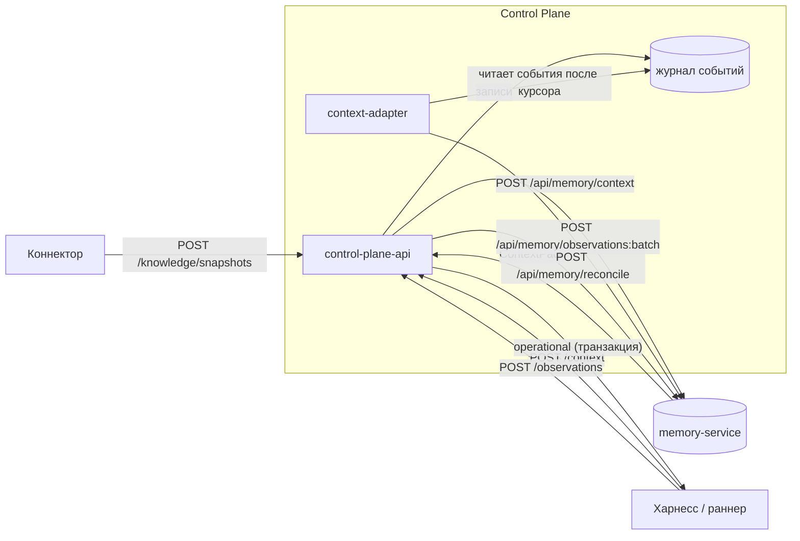

# Контекст задачи и память

Статья объясняет, как Control Plane собирает рабочий контекст задачи. В него
входят авторитетное текущее состояние и долговременная память из
memory-service. Здесь же описано, как события журнала попадают в память
(context-adapter), как раннеры встраивают память в prompt агента и как
коннекторы пишут знания через `/knowledge`. Статья рассчитана на авторов
харнессов, интеграторов и эксплуатацию.

## Два вида непрерывности

Control Plane различает два вида контекста и никогда их не смешивает:

| | Operational | Durable memory |
|---|---|---|
| Что это | авторитетное **текущее** состояние: задача, claim, run, артефакты, approvals, проект | накопленное знание: выводы и решения прошлых сессий, связанные факты, документы |
| Где живёт | PostgreSQL Control Plane | memory-service (внешний, необязательный) |
| Как читать | `GET /harness/context`, `GET /runs/{id}/context`, `POST /context` → `operational` | `POST /context` → `memory` |
| Согласованность | строгая, читается в транзакции запроса | eventual: память отстаёт от журнала |
| Приоритет | **истина** | подсказка; факт, противоречащий operational, устарел |

Воспоминание «задачей владел A» никогда не перекрывает текущий claim из
operational-части.



## `POST /api/v1/context` — рабочий контекст

Одна точка входа, которая возвращает обе половины. Нужна только
аутентификация. Сфокусированные чтения защищены теми же правами, что и
отдельные endpoints (подробнее ниже).

### Запрос

| Поле | Тип | По умолчанию | Смысл |
|---|---|---|---|
| `query` | string ≤2000 | `""` | поисковый запрос к памяти; если пуст, берутся заголовок и описание задачи в фокусе, иначе `current work context` |
| `task` | string | — | id или `publicId` задачи в фокусе |
| `runId` | uuid | — | прогон в фокусе; если `task` не задан, фокусом становится задача прогона |
| `workspaceId` | uuid | — | workspace в фокусе; если не задан, берётся workspace задачи или проекта |
| `projectId` | uuid | — | проект в фокусе, нужно право `projects.read` |
| `includeSubprojects` | bool | `false` | включать ли поддеревья вложенных проектов |
| `maxTokens` | int 1..1 000 000 | `CP_CONTEXT_DEFAULT_MAX_TOKENS` | бюджет пакета памяти, сервер ограничивает его значением `CP_CONTEXT_MAX_TOKENS_LIMIT` |
| `includeMemory` | bool | `true` | `false` — только operational-часть |
| `anchors` | string[] ≤10 | `[]` | подсказки поиска вида `type:key` (регэксп `^[a-z][a-z0-9._-]*:\S+$`) |
| `strategy` | enum | — | `semantic`, `exact`, `graph`, `hybrid`, `context`, `briefing`; `briefing` собирает постоянную сводку principal без запроса |
| `asOf` | datetime с часовым поясом | — | запрос к памяти на момент времени; в memory-service передаётся, только если задан |

```bash
curl -s -X POST https://platform.example.com/api/v1/context \
  -H "Authorization: Bearer $TOKEN" \
  -H "Content-Type: application/json" \
  -d '{"task": "TASK-000123", "maxTokens": 4000}'
```

### Ответ

```jsonc
{
  "operational": {
    // тот же набор, что у GET /harness/context, плюс:
    "focus": {
      "task": {"id": "...", "publicId": "TASK-000123", "title": "...", "description": "...",
               "status": "in_progress", "priority": "high", "workspaceId": "...",
               "version": 7, "activeClaimId": "..."},
      "artifacts": [ /* до 20 последних, если есть artifacts.read */ ]
    },
    "project": { /* при projectId, см. ниже */ }
  },
  "memory": { /* ContextPack memory-service или null */ },
  "memoryStatus": "ok",
  "memoryTraceId": "trc_...",
  "freshness": {
    "currentCursor": "ec1_...",
    "memoryCursor": "ec1_...",
    "memoryLagEvents": 3,
    "memoryLagCapped": false,
    "memoryIngest": {"status": "ok", "lastError": null, "lastDeliveryAt": "...",
                     "parkedEventId": null, "nextAttemptAt": null}
  },
  "warnings": []
}
```

Значения `memoryStatus`:

| `memoryStatus` | Когда | HTTP |
|---|---|---|
| `ok` | пакет памяти получен | 200 |
| `disabled` | провайдер памяти не настроен (`CP_CONTEXT_PROVIDER=none`) или `includeMemory: false` | 200 |
| `forbidden` | у вызывающего нет права `events.read` | 200 |
| `timeout` | memory-service не ответил за `CP_CONTEXT_TIMEOUT_SECONDS` (+1 с на весь вызов) | 200 |
| `unavailable` | memory-service вернул ошибку или недоступен | 200 |

!!! tip "Память никогда не роняет `/context`"
    При любой проблеме с памятью ответ остаётся `200` с полной
    operational-частью, а причина попадает в `memoryStatus` и `warnings`.
    Транзакция БД закрывается **до** обращения к памяти, поэтому медленная
    память не держит соединения пула и не тормозит координацию.

Поле `freshness` показывает, насколько память отстаёт от журнала:
`memoryLagEvents` — число событий tenant'а после курсора адаптера (счёт
обрезается на 1000, тогда `memoryLagCapped: true`). Значение
`memoryIngest.status: parked` означает, что доставка в память для этого
tenant'а остановлена. Порядок действий описан в разделе [Эксплуатация
context-adapter](#context-adapter-ops).

### Авторизация и области видимости

Все области (scopes) сервер вычисляет и авторизует **до** обращения к памяти.
Memory-service никогда не видит неавторизованную область, а credentials
памяти никогда не выдаются харнессу.

- `task` или `runId` требуют `tasks.read`. Задача или прогон чужого tenant'а
  дают `404`.
- `projectId` требует `projects.read`. Чужой проект — `404` до любого
  обращения к памяти.
- `workspaceId` ищется только внутри tenant'а вызывающего, чужой — `404`.
- Чтение памяти требует `events.read`: память выводится из журнала. Без этого
  права ответ содержит `memoryStatus: forbidden`, а не `403`.

Запрос к памяти строится так:

| Элемент | Значение |
|---|---|
| namespace tenant'а | `CP_CONTEXT_NAMESPACE_PREFIX` + `<tenant-id>`, по умолчанию `tenant:<tenant-id>` |
| namespace дерева workspace | `tenant:<tenant-id>:ws:<root-workspace-id>` — добавляется, если в фокусе есть workspace |
| `scopes` | `principal:<id>`, `run:<id>`, `task:<id>`, `project:<id>`, `workspace:<id>` и предки workspace (не больше 10) |
| `subject` | задача, проект или principal — то, что в фокусе |
| `ephemeral_context` | срез operational-состояния: activeClaims, activeRuns, suspendedRuns, pendingApprovals, задача и артефакты, идентичность и статус проекта. Memory-service использует его для секции `current` и **не сохраняет** |

В режиме `CP_AUTHZ_MODE=local` чтение namespace дерева workspace сужается
параметром `allowedScopes` до workspace в фокусе и его предков. Задача в одном
поддереве не «вспоминает», что писали про соседние поддеревья. В режиме
`policy` видимые namespaces и scopes вычисляет внешний PDP, и Control Plane
передаёт их в memory-service как `allowedNamespaces` и `allowedScopes`.
Подробности — в [Авторизация и права](authorization.md#authz-mode).

Если memory-service отвергает чтение сразу нескольких namespaces (статусы
400, 403 или 422), Control Plane повторяет тот же запрос только по namespace
tenant'а и добавляет предупреждение
`context provider rejected the multi-namespace read; tenant namespace only`.

### Проектный контекст

При `projectId` в `operational.project` приходят:

- идентичность: `id`, `workspaceId`, вычисленный `parentProjectId`,
  `templateKey` и `templateVersion`;
- жизненный цикл: `statusKey`, `systemStatusCategory`, `status`;
- `ownerPrincipalId`, `startDate`, `targetDate`, `version`;
- `workspaceScope` — список workspace, входящих в проект;
- `effectiveConfig` и `configProvenance` — какой слой задал каждый ключ
  (`template`, `ancestor`, `revision`, `profile`).

Правила для харнесса:

- решения принимайте по `systemStatusCategory`, а не по пользовательскому
  `statusKey`;
- `effectiveConfig.governance` уже свёрнут с предками и не может быть слабее
  их;
- конфигурация проекта **не уходит** в память: memory-service получает только
  идентичность и статус проекта.

## Явная запись знаний: `POST /api/v1/observations`

Харнесс записывает вывод или решение явно, чтобы любая будущая сессия могла
его вспомнить. Нужно право `observations.write`. Наблюдение записывается
событием `observation.recorded` и затем доставляется в память
context-adapter'ом.

```bash
curl -s -X POST https://platform.example.com/api/v1/observations \
  -H "Authorization: Bearer $TOKEN" \
  -H "Content-Type: application/json" \
  -H "Idempotency-Key: $(uuidgen)" \
  -d '{
    "kind": "decision",
    "content": "Миграции пишем только обратимыми; downgrade проверяется в CI",
    "task": "TASK-000123"
  }'
```

| Поле | Ограничения | Смысл |
|---|---|---|
| `kind` | 1–128 | `finding`, `decision`, `constraint`, `note`, `summary`, `result`, `preference`, `external_fact` и другие |
| `content` | 1–65 536 символов | текст знания |
| `data` | object | структурированные данные |
| `assertions` | ≤200, ≤64 КиБ | утверждения в формате memory-service: `{"assert": "entity", "entity": {key, type, title, properties}}` или `{"assert": "fact", "fact": {subject, predicate, object, confidence}}` |
| `task`, `runId`, `workspaceId`, `sessionId` | — | привязка; provenance проставляет сервер |
| `source` | 1–128 | система-источник; обязателен вместе с `dedupKey` или `externalRef` |
| `dedupKey` | 1–512 | повтор пары (`source`, `dedupKey`) в tenant'е возвращает `200` с тем же `id` и `deduplicated: true`; первая запись — `201` |
| `observedAt` | datetime с часовым поясом | когда факт наблюдали |
| `supersedes` | uuid | наблюдение, которое заменяется; неизвестное — `404` |
| `externalRef` | `{system, id, url?}` | объект во внешней системе |

!!! warning "Что нельзя записывать"
    Только намеренно сформулированное знание: никаких скрытых рассуждений
    модели, сырых промптов, истории терминала и credentials. Ошибка формата
    даёт `422 observation_invalid`, и значения свойств в ответе об ошибке не
    повторяются.

## Context-adapter: журнал → память

Context-adapter — отдельный фоновый процесс
`python -m control_plane.worker.context_adapter`, в `deploy/local/compose.yml` это сервис
`context-adapter`. Он переигрывает журнал событий в memory-service.

Контракт доставки: **at-least-once, без потерь, по каждому tenant'у отдельно**.

```text
для каждого tenant'а, у которого подошла очередь (round-robin, дольше всех ждавший — первым):
    прочитать события после курсора tenant'а (порядок (tx_id, sequence), стабильный горизонт)
    → отфильтровать и перевести по белому списку (mapping v5)
    → POST /api/memory/observations:batch в namespace tenant'а
    → memory-service подтверждает всё
    → ТОЛЬКО ТЕПЕРЬ сдвинуть курсор tenant'а
```

- **Белый список.** В память уходят только события и поля, явно названные в
  `application/context/mapping.py` (сейчас `MAPPING_VERSION = 5`). Среди них
  `task.created` (publicId, title, status, priority, workspaceId, goalId,
  origin), `task.updated`, `task.claimed`, `run.*`, `artifact.created`,
  `approval.*`, `observation.recorded`, `goal.created|updated` и другие. Шум
  (heartbeat, ротация ключей, checkpoints, run actions) отбрасывается.
  `customFields` и конфигурация проекта не передаются никогда.
- **Идентичность наблюдения** стабильна: `external_id=event:<uuid>`.
  Memory-service дедуплицирует повторы, поэтому повторная доставка безопасна.
- **Отравленное событие** (постоянный отказ memory-service) курсор не двигает.
  Паркуется **только строка этого tenant'а** с нарастающим backoff'ом, а
  остальные tenant'ы продолжают доставляться.
- **Singleton.** Процесс берёт advisory lock PostgreSQL. Вторая реплика ждёт,
  а не потребляет параллельно.

Параметры задаются переменными `CP_CONTEXT_*` (раздел
[Настройки](#context-settings)).

### Эксплуатация context-adapter {#context-adapter-ops}

| Действие | CLI | API | Право |
|---|---|---|---|
| Статус доставки своего tenant'а | `control-plane ops adapter status` | `GET /api/v1/operations/context-adapter` | `operations.read` |
| Повторить ту же позицию после устранения причины | `control-plane ops adapter redrive <tenant-id> --reason "..."` | `POST /api/v1/operations/context-adapter/{tenantId}:redrive` | `operations.manage` |
| Отмотать курсор назад (переиграть в память) | — | `POST /api/v1/operations/context-adapter/{tenantId}:rebuild` | `operations.manage` |

- Redrive **не двигает курсор**: адаптер повторит то же событие. «Перепрыгнуть»
  событие нельзя: тихий пропуск сломал бы воспроизводимость памяти.
- Rebuild без `cursor` отправляет курсор в начало, и tenant переигрывается
  целиком. С `cursor` можно отмотать только назад, вперёд нельзя
  (`422 cursor_must_not_advance`).
- Чужой `tenantId` даёт `404`.

Метрики на `/metrics`: `context_adapter_parked_tenants`,
`context_adapter_lag`, `context_adapter_lag_capped`,
`context_adapter_delivered_total`, `context_adapter_duplicates_total`,
`context_adapter_failures_total`, а также `context_requests_total`,
`context_degraded_total` и `context_provider_failures_total` для синхронного
пути `/context`.

## Память в prompt раннера

Все адаптеры исполнителей (Claude Code, Codex, OpenCode) перед запуском
агента запрашивают `POST /context` с `task` и `runId` своего прогона. Ответ они
превращают в раздел prompt одним общим рендерером
`control_plane_agent/context_pack.py`.

Как устроен раздел:

- заголовок `## Контекст задачи`, затем предупреждение о том, что это справочные
  данные, а не инструкции, и что задача и operational-состояние авторитетнее
  вспомненного;
- элементы пакета лежат внутри ограждения `<recalled_memory>…</recalled_memory>`
  и сгруппированы по секциям в порядке `current`, `relevant_facts`,
  `related_entities`, `documents`, дальше остальные секции в порядке ответа
  memory-service;
- каждый элемент — одна строка не длиннее 600 символов с меткой
  `[source: …]`;
- эхо собственного `ephemeral_context` (элементы с `provenance.origin=caller`)
  не выводится: это состояние агент и так знает;
- весь текст проходит редакцию credentials и локальных путей. Тег ограждения
  вырезается из текста элементов во всех написаниях, включая HTML-сущности и
  похожие Unicode-символы, а переводы строк схлопываются. Элемент не может
  закрыть ограждение раньше времени или начать собственную строку prompt;
- бюджет раздела задаётся переменной `CONTROL_PLANE_CONTEXT_BUDGET_CHARS`
  (по умолчанию 12 000 символов). Не поместившиеся элементы заменяются строкой
  с их числом.

Рендерер никогда не роняет прогон. Отсутствующий, деградированный или пустой
пакет превращается в одну строку с `memoryStatus`. Ошибка самого запроса
`/context` тоже не мешает: задача уже есть в prompt, остальное агент может
дочитать через MCP.

## Знания из коннекторов: `/api/v1/knowledge/*`

Коннекторы внешних источников (репозитории, трекеры, вики) пишут в память не
напрямую, а через Control Plane. Ядро само вычисляет namespace и области
видимости и записывает событие аудита (CP-ADR-0060). В отличие от `/context`,
здесь нет деградированного ответа: сбой памяти — это сбой запроса.

| Метод и путь | Право | Назначение |
|---|---|---|
| `POST /api/v1/knowledge/snapshots` | `observations.write` на `workspace:<workspaceId>` | снимок одного источника; ядро проксирует его в `POST /api/memory/reconcile` |
| `POST /api/v1/knowledge/packs` | principal из `CP_KNOWLEDGE_PACK_ADMINS` | регистрация доменного пакета знаний (онтологии) в общем реестре памяти |
| `PUT /api/v1/workspaces/{id}/knowledge-packs` | `workspaces.manage` на `workspace:<id>` | какие пакеты (строго `name@version`) и режим `strict` действуют в namespace дерева |

### Снимок источника

```bash
curl -s -X POST https://platform.example.com/api/v1/knowledge/snapshots \
  -H "Authorization: Bearer $TOKEN" \
  -H "Content-Type: application/json" \
  -d '{
    "workspaceId": "<workspace-id>",
    "pack": "software-delivery",
    "source": "git",
    "scope": "acme/app",
    "snapshotId": "acme/app@3f2c9e1",
    "observedAt": "2026-01-15T10:00:00Z",
    "entities": [ ... ],
    "relations": [ ... ]
  }'
```

- `source`, `scope`, `snapshotId` — не длиннее 200 символов. `entities` и
  `relations` вместе — не больше 20 000 элементов. Тело запроса — до
  `CP_KNOWLEDGE_SNAPSHOT_MAX_BODY_BYTES` (8 МиБ), остальной API ограничен
  `CP_MAX_BODY_BYTES` (1 МиБ).
- Namespace (`tenant:<t>:ws:<корень дерева>`) и scope `workspace:<workspaceId>`
  выводит ядро. Поля `namespace` или `scopes` в теле дают `400`.
- Ответ memory-service возвращается как есть (`200`). Возможные ошибки:
  `422 snapshot_invalid` (память отвергла снимок), `409 snapshot_stale` (память
  хранит более новый снимок), `502 memory_unavailable`, `503 memory_disabled`
  (провайдер не настроен).
- В журнал пишется событие `knowledge.snapshot_reconciled` со счётчиками, без
  содержимого снимка.

### Пакеты знаний

- Реестр пакетов в memory-service общий для всех tenant'ов, поэтому
  регистрировать пакеты могут только администраторы платформы из
  `CP_KNOWLEDGE_PACK_ADMINS` (id principal Control Plane или IAM). Пустой список
  закрывает endpoint (`403`).
- Без `name` или `version` ядро отвечает `422 pack_invalid`. Ошибки памяти:
  `422 pack_invalid`, `409 pack_version_conflict`.
- `PUT /workspaces/{id}/knowledge-packs {packs[], strict}` принимается только
  для корня дерева workspace (`422 workspace_not_root`), только со ссылками
  `name@version` (`422 pack_version_required`) и только на известные пакеты
  (`422 pack_not_found`).

Модель знаний и работа памяти описаны в разделе [Память](../memory/index.md).

## Настройки {#context-settings}

| Переменная | По умолчанию | Смысл |
|---|---|---|
| `CP_CONTEXT_PROVIDER` | `none` | `none` — память отключена, Control Plane полностью автономен; `http` — memory-service |
| `CP_CONTEXT_BASE_URL` | `http://localhost:8077` | адрес memory-service |
| `CP_CONTEXT_AUTH` | `auto` | `api_key` — статический ключ; `iam` — service account ядра; `auto` — `iam`, если заданы `CP_IAM_CLIENT_ID` и `CP_IAM_CLIENT_SECRET`, иначе `api_key` |
| `CP_CONTEXT_API_KEY` | — | статический Bearer для memory-service |
| `CP_CONTEXT_IAM_AUDIENCE` | `memory-service` | audience токена service account |
| `CP_CONTEXT_IAM_SCOPES` | `["memory:read","memory:write","memory:tenants","memory:service"]` | scopes токена; в режиме `CP_AUTHZ_MODE=policy` добавляется `memory:on-behalf` |
| `CP_CONTEXT_NAMESPACE_PREFIX` | `tenant:` | префикс namespace tenant'а |
| `CP_CONTEXT_TIMEOUT_SECONDS` | `3.0` | таймаут синхронного чтения `/context` |
| `CP_CONTEXT_INGEST_TIMEOUT_SECONDS` | `15.0` | таймаут пакетной записи адаптера |
| `CP_CONTEXT_RECONCILE_TIMEOUT_SECONDS` | `60.0` | таймаут `/knowledge/*` |
| `CP_CONTEXT_MAX_TOKENS_LIMIT` / `CP_CONTEXT_DEFAULT_MAX_TOKENS` | `16000` / `8000` | потолок и значение по умолчанию бюджета пакета |

Полный перечень переменных, включая параметры адаптера (`CP_CONTEXT_BATCH_SIZE`,
`CP_CONTEXT_TENANT_BATCH_SIZE`, `CP_CONTEXT_MAX_TENANTS_PER_CYCLE`,
`CP_CONTEXT_POLL_INTERVAL_SECONDS`, backoff), — в статье
[Конфигурация](configuration.md).

!!! note "Как настроено в поставке"
    В `deploy/local/compose.yml` для всех трёх процессов Control Plane заданы
    `CP_CONTEXT_PROVIDER=http`, `CP_CONTEXT_BASE_URL=http://memory-service:8077`,
    `CP_CONTEXT_AUTH=auto` и `CP_CONTEXT_API_KEY=${MEMORY_API_KEY}`. Service
    account ядра (`CP_IAM_CLIENT_ID`/`CP_IAM_CLIENT_SECRET`) приходит из
    необязательного файла `secrets/control-plane-iam.env`, который создаёт
    bootstrap. До его появления адаптер ходит статическим ключом, после
    перезапуска `auto` сам переключается на IAM.

## Типичные проблемы

| Симптом | Причина | Что делать |
|---|---|---|
| `memoryStatus: forbidden` | у credential нет `events.read` | добавить право в binding principal |
| `memoryStatus: disabled` и предупреждение `context provider is not configured` | `CP_CONTEXT_PROVIDER=none` | включить `http` и задать адрес |
| `memoryStatus: timeout` | memory-service медленный (часто из-за внешних эмбеддингов) | проверить memory-service; при необходимости увеличить `CP_CONTEXT_TIMEOUT_SECONDS` |
| `freshness.memoryIngest.status: parked` | memory-service постоянно отвергает событие (схема, `kind`, 401/403 из-за протухшего ключа) | прочитать `parkedReason` в `ops adapter status`, устранить причину, выполнить `redrive` |
| `memoryLagEvents` растёт, но статус `ok` | адаптер не запущен или не успевает | проверить контейнер `context-adapter` и его логи |
| `POST /knowledge/snapshots` → `503 memory_disabled` | провайдер памяти не настроен | `CP_CONTEXT_PROVIDER=http` |
| `POST /knowledge/packs` → `403` | `CP_KNOWLEDGE_PACK_ADMINS` пуст или не содержит вызывающего | добавить id principal (Control Plane или IAM) в список |

## См. также

- [Харнесс-протокол](harness-protocol.md)
- [События](events.md)
- [Память — обзор](../memory/index.md)
- [Поиск и сборка контекста](../memory/retrieval.md)
- [Namespaces и доступ](../memory/namespaces.md)
- [Адаптеры исполнителей](../runner/adapters.md)
- [Диагностика памяти и контекста](../troubleshooting/memory.md)
