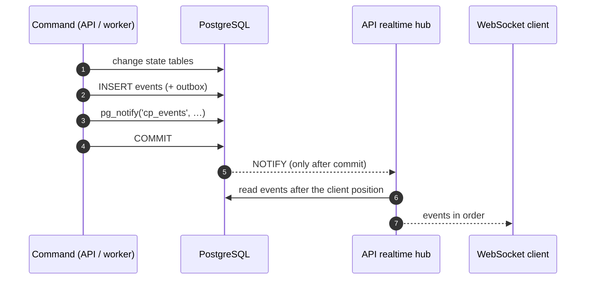
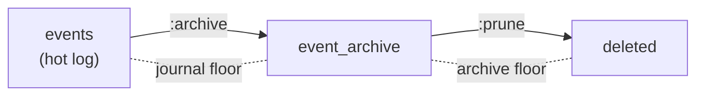

# Events

The Control Plane event log is the append-only history of everything that happened in
a tenant: task creation and status changes, claims, runs, approvals,
artifacts, comments, goals. It serves as the audit trail, the synchronization source
for harnesses and workplaces, and the input for memory. This article describes the event
model, the durable cursor, reading by pages and over WebSocket, the event type
catalog, and log retention. Subscription filters, event data versions, and the consumer
SDK are covered in [Event subscriptions](event-subscriptions.md).

## How an event appears

An event is written **in the same transaction** as the state change:



- Commit publishes everything atomically: the state, the event, and the outbox record; a rollback
  leaves nothing behind.
- `NOTIFY` is delivered only on commit, so subscribers never
  wake up on rolled-back data.
- The log is append-only: database triggers forbid `UPDATE`, `DELETE`, and
  `TRUNCATE`. The only exception is operator archiving (see below).

## Event model

```json
{
  "sequence": 48211,
  "id": "…",
  "tenantId": "…",
  "type": "task.updated",
  "schemaVersion": 1,
  "entityType": "task",
  "workspaceId": "<workspace-id>",
  "entityId": "…",
  "actorId": "<principal-id>",
  "sessionId": null,
  "correlationId": "…",
  "causationId": null,
  "requestId": "req_…",
  "traceRunId": "…",
  "iamActorId": "<iam-principal-id>",
  "payload": {
    "publicId": "TASK-000123",
    "changes": {"status": "blocked", "customFields": true},
    "fromStatus": "in_progress",
    "status": "blocked",
    "systemStatusCategory": "blocked",
    "version": 9
  },
  "occurredAt": "2026-09-01T10:15:04.117Z",
  "cursor": "ec1_…"
}
```

| Field | Description |
|---|---|
| `sequence` | Event identifier and order within a transaction. **Not** a replay cursor |
| `id` | Event identifier (UUID) — the consumer's deduplication key |
| `type` | Event type, see the catalog below |
| `schemaVersion` | Version of the `payload` schema of this type; versions only add fields, see [Event subscriptions](event-subscriptions.md) |
| `entityType`, `entityId` | The entity whose stream the event belongs to |
| `workspaceId` | Workspace of the entity (or of its task); `null` for tenant-level events |
| `actorId` | The principal that performed the action (`null` for background worker actions) |
| `iamActorId` | IAM identity of the actor; `null` for legacy keys |
| `sessionId` | The session, if the action was performed within it |
| `correlationId` | From the `X-Correlation-ID` header or generated |
| `causationId` | The causing event (for example, the approval decision for the events of its outcome) |
| `requestId` | From `X-Request-ID` |
| `traceRunId` | Trace correlation from `X-Run-Id` (not the domain Run) |
| `payload` | Event data — only references and safe fields |
| `cursor` | Opaque cursor of this event's position |

## What does not go into the log

The log is read more widely than the entities themselves, and memory is built from it. That is why
the following are deliberately not written to it:

| Not written | What is written instead |
|---|---|
| Contents of custom fields | `"customFields": true` |
| Comment texts | `bodyLength` |
| Artifact `content` | References: `type`, `name`, `uri`, ids |
| Checkpoint data | `checkpointId`, `seq`, `kind` |
| Texts of `directive` / `reason` of control messages | ids, `seq`, operation, status, `causalPosition`, `safeBoundary` |
| Task acceptance and evidence | Element counts |
| Goal desired state, `spec` of checks | `desired_state: true`, number of criteria |
| `note` and `url` in origin | Summary: kind, ref, ruleId, fact ids |
| Run actions | A separate execution audit table, not the log |
| Title, summary, and data of child work | ids, `correlationId`, outcome, result hash |

## Durable cursor

The delivery order is the pair `(tx_id, sequence)`, where `tx_id` is the 64-bit
identifier of the writing PostgreSQL transaction. Only events below the
**stable horizon** are delivered — transactions that are guaranteed to have already
finished. Hence the property: a cursor that advances only through delivered
positions **cannot skip over an event that commits later**.

!!! note "Why not `sequence`"
    `sequence` is assigned on `INSERT`, and `tx_id` on the transaction's first
    write; for concurrent commands these orders can diverge. A cursor on
    `sequence` could permanently skip a not-yet-visible event with a lower
    number. The price of the durable cursor is a delivery delay equal to the longest
    open writing transaction: delivery is postponed, not lost.

A cursor is an opaque string of the form `ec1_<base64url>`. Clients **must not**
parse, compare, or construct cursors: store the last one
received and pass it back.

| Situation | Response |
|---|---|
| Malformed cursor | `422 invalid_cursor` |
| Cursor of a future format version | `422 unsupported_cursor_version` |
| Cursor below the boundary of deleted history | `422 cursor_below_journal_floor` |

For compatibility, legacy forms are accepted: the integer `?after=<sequence>` and
the old `nextCursor` encoding. When migrating from them, already seen events may be
delivered again (at-least-once).

## Reading by pages

```bash
# From the start of the available history
curl -s "$CP/events?limit=200" -H "Authorization: Bearer $TOKEN"

# Continue from a saved cursor
curl -s "$CP/events?cursor=ec1_…&limit=200" -H "Authorization: Bearer $TOKEN"

# The stream of one task
curl -s "$CP/events?entityType=task&entityId=<task-id>" -H "Authorization: Bearer $TOKEN"

# The last 20 stable events (diagnostics)
curl -s "$CP/events?tail=20" -H "Authorization: Bearer $TOKEN"
```

| Parameter | Description |
|---|---|
| `cursor` | Opaque cursor; without it, reading starts from the beginning of the available history |
| `after` | Legacy integer cursor (`sequence`) |
| `limit` | 1–200, 50 by default |
| `tail` | The last N stable events in delivery order (no more than `limit`) |
| `entityType`, `entityId` | Filter by entity stream |
| `types` | Type prefixes (`approval.`), up to 20 — see [Event subscriptions](event-subscriptions.md) |
| `workspaceId` | Events of the workspace subtree; the `events.read` permission is checked on that workspace |

The response **always** contains `nextCursor` (on an empty page, an echo of the input
cursor) and `hasMore`:

```json
{"items": [{"…": "…", "cursor": "ec1_…"}], "nextCursor": "ec1_…", "hasMore": false}
```

Permission: `events.read` on the tenant, and with `workspaceId`, on that workspace.

### Subscriber loop

```python
cursor = load_cursor()                     # None on first start
while True:
    page = get("/api/v1/events", cursor=cursor, limit=200)
    for event in page["items"]:
        handle(event)                      # the handler must be idempotent
        cursor = event["cursor"]
        save_cursor(cursor)
    if not page["hasMore"]:
        sleep(1)                           # or wait for WebSocket
    cursor = page["nextCursor"]
```

Delivery is at-least-once: after a failure between processing and saving the cursor,
the event arrives again. Make processing idempotent, for example by
`event["id"]`. A ready-made loop with cursor storage, deduplication, and retries is
`EventConsumer` from the SDK, see [Event subscriptions](event-subscriptions.md#sdk).

## WebSocket

```text
WS /api/v1/events/ws?after=<cursor>[&types=<prefix>][&workspaceId=<id>]
```

WebSocket is not a source of truth but a "wake up and read the rest" signal. The server
always reads events from the table in `(tx_id, sequence)` order, sends them
in batches of 200, and sleeps until a `NOTIFY` for its tenant or until the
`CP_WS_POLL_INTERVAL_SECONDS` timeout (5 s by default) — a lost notification does not
lose events. Each message is an event in the same form as in `GET
/events`, with a `cursor` field.

Authentication is the same as for HTTP; permission `events.read`. Errors are delivered as a close
code after the connection is established:

| Close code | Reason |
|---|---|
| `4401` | Missing or invalid credentials |
| `4403` | No `events.read` permission |
| `4404` | The filter's workspace does not exist |
| `4400` | Malformed or unsupported cursor, invalid type filter |
| `4503` | No authorization decision received (PDP unavailable) — retrying makes sense |
| `1011` | Internal server error |

When reconnecting, pass `?after=<cursor of the last processed
event>` — whatever was missed will be read.

## Event catalog

### Tasks and work

| Type | Stream | Key payload fields |
|---|---|---|
| `task.created` | task | `publicId`, `title`, `status`, `systemStatusCategory`, `typeKey`, `typeVersion`, `priority`, `workspaceId`, `startDate`, `dueDate`, `customFields` (flag), `goalId`, `origin` (summary), `acceptanceChecks` |
| `task.updated` | task | `changes`, `version`; on a status change — `fromStatus`, `status`, `systemStatusCategory` |
| `task.claimed` | task | `claimId`, `sessionId`, `holderId`, `fencingToken`, `expiresAt`, `status`, `systemStatusCategory`, `version` |
| `task.completed` | task | `publicId`, `status`, `systemStatusCategory`, `version` |
| `task.relation_added`, `task.relation_removed` | task | The relation |
| `task.comment_added`, `task.comment_edited` | task | `commentId`, `authorPrincipalId`, `version`, `bodyLength`, `runId`, `artifactId` |
| `task.external_reference_added`, `task.external_reference_updated` | task | External reference without `metadata` |
| `task_type.created`, `task_type.deprecated` | task_type | `key`, `version`, and a lifecycle summary |
| `goal.created`, `goal.updated` | goal | See [Goals](goals-and-evidence.md) |
| `task.verification_started` | task | `publicId`, `taskId`, `verificationId`, `attempt`, `trigger`, `checks` |
| `task.verification_failed` | task | The same plus `results`, `failedCheck`, `reason`, `consecutiveFailures`, `blocked`, `fromStatus`, `status`, `systemStatusCategory` |
| `task.verified` | task | `publicId`, `taskId`, `verificationId`, `attempt`, `results`, `artifactId` |
| `task.completion_work_executed`, `task.completion_work_failed` | task | Post-completion work declared by the task type |
| `task.context_pack_recorded` | task | Context pack assembled on claim: ids and counters |
| `rule.created`, `.updated`, `.enabled`, `.disabled`, `.archived`, `.evaluated` | rule | Work rules |
| `work.derived`, `work.reconciled` | task | Work derived by a rule: `ruleId`, `ruleKey`, `evaluationId`, `taskId`, `dedupKey` |

### Execution

| Type | Stream | Key payload fields |
|---|---|---|
| `session.opened`, `session.closed`, `session.expired` | session | — |
| `claim.released` | claim | `taskId`, `reason`, `taskStatus` (and `taskSystemStatusCategory` when a session closes) |
| `claim.expired` | claim | `taskId`, `reason` (`expired`, `session_inactive`) |
| `run.started` (v2) | run | `taskId`, `claimId`, `attempt`, `fencingToken`; v2 — `agentRevisionId` (the agent revision the run goes by; `null` for an executor without an agent) |
| `run.succeeded` | run | `taskId`, `attempt`, `taskCompleted` |
| `run.failed` | run | `taskId`, `reason` (including `superseded`), `attempt` |
| `run.cancelled` | run | `taskId`, `reason`, `attempt` |
| `run.suspended` | run | `taskId`, `reason`, `attempt`, `waitingForApprovalId` |
| `run.checkpointed` | run | `taskId`, `checkpointId`, `seq`, `kind` |
| `run.handoff_prepared` | run | `taskId`, `claimId`, `checkpointId`, `fencingToken`, `reason` |
| `run.cancel_requested` | run | `taskId`, `attempt` |
| `run.control_message.accepted`, `.applied`, `.rejected`, `.superseded` | run | `controlMessageId`, `seq`, `operation`, `status`, `causalPosition`, `safeBoundary` |
| `run.manifest_compiled`, `run.manifest_ephemeral_recorded` | run | No longer written (CP-ADR-0073): kept in the catalog for events already in the journal |
| `run.child.launched`, `.started`, `.resolved`, `.revoked`, `.cancel_requested` | run | ids, `correlationId`, outcome, result hash |

### Approvals, artifacts, observations

| Type | Stream | Key payload fields |
|---|---|---|
| `approval.requested` (v2) | approval | `taskId`, `artifactId`, `requiredRoleId`, `assignedPrincipalId`, `gate`; v2 — `workspaceId`, `taskPublicId`, `taskTitle`, `requestedBy`, `comment` |
| `approval.approved`, `approval.rejected` (v2) | approval | `taskId`, `artifactId`, `outcomeStatus`; v2 — `decisionBy`, `comment`, `channel` (decision channel, `null` for a direct API call) |
| `approval.cancelled` (v2) | approval | `taskId`; v2 — `cancelledBy` |
| `approval.outcome_executed`, `.outcome_failed`, `.outcome_deferred` | approval | See [Approvals](approvals.md) |
| `artifact.created` | artifact | `type`, `name`, `taskId`, `runId`, `uri`, `supersedesArtifactId` |
| `observation.recorded` | observation | An explicit "remember" (see [Task context and memory](context.md)) |
| `knowledge.snapshot_reconciled`, `knowledge.pack_registered`, `knowledge.packs_configured` | — | Counters without content |
| `skill.invocation_requested`, `_claimed`, `_retry_scheduled`, `_succeeded`, `_failed`, `_cancelled` | skill_invocation | ids, skill and version, attempt, error code — without inputs and outputs |

### Processes

The event stream of an instance is `process_instance`; reading it requires
`events.read` on the process workspace. Events carry no instance data. Common
payload fields of instance events: `instanceId`, `definitionKey`, `version`,
`instanceKey`, `workspaceId`.

| Type | Key payload fields beyond the common ones |
|---|---|
| `process.started`, `.correlated`, `.data_changed`, `.completed`, `.cancelled`, `.failed`, `.suspended`, `.resumed`, `.migrated` | Instance lifecycle (see [Processes](../processes/index.md#outcomes)) |
| `process.stage_entered`, `process.stage_exited` | Stage |
| `process.step_entered` | `element`, `stage`, `stepKind`, `waitsFor`, `attempt`, `activityId`, `enteredAt`, `taskId`, `approvalIds`, `skillInvocationId`, `childInstanceId`, `due`, `warnAt`, `provisional` |
| `process.step_exited` | `element`, `stage`, `stepKind`, `attempt`, `activityId`, `enteredAt`, `exitedAt`, `outcome`, `durationSeconds`, `due`, `breached`, `overdueSeconds` |
| `process.sla_warning` | `scope`, `element`, `attempt`, `activityId`, `dueAt`, `warnAt`, `provisional`, `owner`, `assignee` |
| `process.sla_breached` | `scope`, `element`, `attempt`, `activityId`, `dueAt`, `detectedAt`, `overdueSeconds`, `detectedBy`, `provisional`, `owner`, `assignee` |
| `process.sla_failed` | `scope`, `element`, `attempt`, `activityId`, `error`, `owner` |
| `process.timer_fired`, `process.timer_rescheduled` | Timer; a reschedule also has `previousDueAt`, `dueAt`, `cause` (`data_changed`, `calendar_changed`, `resumed`, `migrated`) |
| `process.escalated`, `process.compensated`, `process.milestone_reached`, `process.milestone_lost`, `process.recall_completed`, `process.recall_timed_out` | See [Processes](../processes/index.md#process-events) |
| `process.definition_published`, `calendar.published` | A new version of a process or calendar |

Step events and their outcomes are described in [Step events](../processes/index.md#step-events),
deadlines and the `owner`, `assignee` addressees in [Deadlines and SLA](../processes/index.md#sla).

### Connections and agent secrets

None of these events carries secret values, the account or the provider's text
(see [Connections](connections.md)).

| Type | Stream | Key payload fields |
|---|---|---|
| `connection_type.published` | connection_type | `key`, `version`, `auth`; a repeat of the same `spec` records nothing |
| `connection_type.oauth_app_set` | connection_type | `type`, `created` — without the client id and the secret |
| `connection.created` | connection | `key`, `type`, `typeVersion`, `status` |
| `connection.updated` | connection | `key`, `version`, `changes` — names of the changed fields (`displayName`, `settings`, `typeVersion`) |
| `connection.authorized` | connection | `key`, `type`, `auth`, `previousStatus`, `connectedBy` |
| `connection.authorization_failed` | connection | `key`, `type`, `reason` (a code, e.g. `consent_denied`), `initiatedBy` |
| `connection.status_changed` | connection | `key`, `type`, `from`, `to`, `reason` (a code), `connectedBy` |
| `connection.revoked` | connection | `key`, `type`, `previousStatus`; a repeated revocation records nothing |
| `agent.secret_set` | agent | `agentKey`, `name`, `created` (the first value, not a replacement) |
| `agent.secret_deleted` | agent | `agentKey`, `name` |

### Organization and configuration

| Group | Types |
|---|---|
| Tenant and principals | `tenant.bootstrapped`, `principal.created`, `api_key.created`, `api_key.revoked`, `iam_binding.created`, `iam_binding.revoked`, `delegation.created`, `delegation.revoked` |
| Workspaces | `workspace.created`, `.updated`, `.archived`, `.moved`, `.member_added`, `.member_removed`; `workspace_type.created`, `.updated`, `.archived` |
| Roles and catalog | `role.created`, `.updated`, `.assigned`, `.revoked`; `capability.created`, `.assigned`, `.revoked`; `skill.registered`, `.updated`, `.assigned`, `.revoked` |
| Projects | `project_template.created`, `.deprecated`; `project.created`, `.updated`, `.archived`, `.status_changed`, `.config_revision_created`, `.config_revision_activated`, `.external_reference_added`, `.external_reference_updated` |
| Operations | `context_adapter.redriven`, `context_adapter.rebuilt`, `event_journal.archived`, `event_journal.pruned` |
| Packages | `package.settings_changed`: package settings were saved; `package`, `version`, `previousVersion`, `schemaRevision`, `changedPaths`, `actorId`, no values (see [Package settings](../packages/settings.md#event)) |

!!! tip "Status: key or category"
    Task events carry both the user-defined `status` key and
    `systemStatusCategory`. A subscriber that cares about the meaning ("the task
    is finished") should react to the category: keys differ between task
    types.

## Log consumers

| Consumer | How it reads | Guarantee |
|---|---|---|
| Harnesses, workplaces, runners | `GET /events`, WebSocket | At-least-once by the client's cursor |
| Services on the `EventConsumer` SDK (for example, the [notification service](../notifications/index.md)) | `GET /events` with filters, WebSocket as an alarm clock | Cursor and processed-event marks in the consumer's database: no losses and no duplicates for effects in that database |
| Context Adapter | Internal per-tenant cursor in `event_consumer_cursors` | At-least-once; the cursor advances only after memory confirms; a failing tenant is parked separately |
| Worker outbox | The `outbox` table, `FOR UPDATE SKIP LOCKED` | At-least-once; bounded retries with backoff, after they are exhausted the record stays with `last_error`. In the base delivery the delivery target is a structured log |

Managing the Context Adapter (`GET /operations/context-adapter`,
`:redrive`, `:rebuild`) is described in [Task context and memory](context.md).

## Log retention

The log grows without limit until an operator performs archiving.
The operations require the `operations.manage` permission.

```bash
# Move acknowledged and sufficiently old events to the archive
curl -s -X POST "$CP/operations/journal:archive" \
  -H "Authorization: Bearer $TOKEN" -H "Content-Type: application/json" \
  -d '{"beforeSeconds": 2592000, "maxEvents": 50000}'

# Physically delete archived events (irreversible)
curl -s -X POST "$CP/operations/journal:prune" \
  -H "Authorization: Bearer $TOKEN" -H "Content-Type: application/json" \
  -d '{"beforeSeconds": 7776000}'
```



- `:archive` moves events older than `beforeSeconds` (by default
  `CP_JOURNAL_RETENTION_MIN_AGE_SECONDS`, 30 days), but not past the minimum
  position of consumer cursors and not past the oldest undelivered
  outbox event. Nothing someone still needs is moved. Reading through
  `GET /events` transparently covers the archive — the audit trail does not change.
- If no consumer has registered a cursor yet, archiving
  is rejected with `409 retention_blocked_by_consumer`.
- `:prune` is the **only** operation after which data is lost.
  A cursor below the deleted boundary gets `422 cursor_below_journal_floor`,
  not a silent skip; reading without a cursor starts from the first
  remaining event.
- Both operations write their own events `event_journal.archived` /
  `event_journal.pruned`.

!!! danger "Before prune"
    Make sure database backups contain the history you need
    (see [Backup](../operations/backup.md)) and that memory
    will not have to be rebuilt from the part of the log being deleted.

## See also

- [Event subscriptions](event-subscriptions.md) — filters, data versions,
  catalog, and consumer SDK.
- [Task context and memory](context.md) — Context Adapter and observations.
- [Harness protocol](harness-protocol.md) — the cursor in the harness self-context.
- [Monitoring and health](../operations/monitoring.md)
- [Artifacts and comments](artifacts.md)
