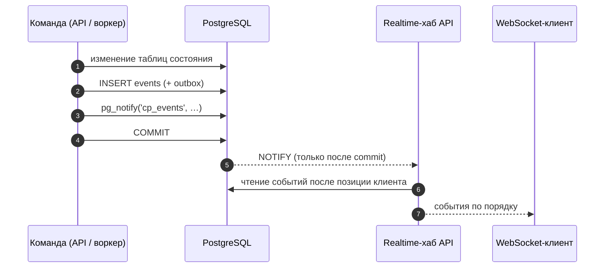
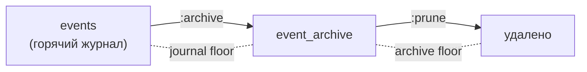

# События

Журнал событий Control Plane — append-only история всего, что произошло в
tenant'е: создание и смена статусов задач, claims, runs, approvals,
артефакты, комментарии, цели. Он служит аудитом, источником синхронизации
для харнессов и рабочих мест и входом для памяти. Статья описывает модель
события, надёжный курсор, чтение страницами и через WebSocket, каталог типов
событий и хранение журнала. Фильтры подписки, версии данных событий и SDK
потребителя — в статье [Подписки на события](event-subscriptions.md).

## Как событие появляется

Событие пишется **той же транзакцией**, что и изменение состояния:



- Commit публикует всё атомарно: состояние, событие и запись outbox; откат
  не оставляет ничего.
- `NOTIFY` доставляется только при commit, поэтому подписчики никогда не
  просыпаются по откаченным данным.
- Журнал append-only: триггеры базы запрещают `UPDATE`, `DELETE` и
  `TRUNCATE`. Единственное исключение — операторская архивация (см. ниже).

## Модель события

```json
{
  "sequence": 48211,
  "id": "…",
  "tenantId": "…",
  "type": "task.updated",
  "schemaVersion": 1,
  "entityType": "task",
  "workspaceId": "<workspace-id>",
  "entityId": "…",
  "actorId": "<principal-id>",
  "sessionId": null,
  "correlationId": "…",
  "causationId": null,
  "requestId": "req_…",
  "traceRunId": "…",
  "iamActorId": "<iam-principal-id>",
  "payload": {
    "publicId": "TASK-000123",
    "changes": {"status": "blocked", "customFields": true},
    "fromStatus": "in_progress",
    "status": "blocked",
    "systemStatusCategory": "blocked",
    "version": 9
  },
  "occurredAt": "2026-09-01T10:15:04.117Z",
  "cursor": "ec1_…"
}
```

| Поле | Описание |
|---|---|
| `sequence` | Идентификатор события и порядок внутри транзакции. **Не** курсор воспроизведения |
| `id` | Идентификатор события (UUID) — ключ дедупликации у потребителя |
| `type` | Тип события, см. каталог ниже |
| `schemaVersion` | Версия схемы `payload` этого типа; версии только добавляют поля, см. [Подписки на события](event-subscriptions.md) |
| `entityType`, `entityId` | Сущность, в чей поток относится событие |
| `workspaceId` | Workspace сущности (или её задачи); `null` у событий уровня tenant |
| `actorId` | Principal, выполнивший действие (`null` у фоновых действий воркера) |
| `iamActorId` | IAM-identity актора; `null` у legacy-ключей |
| `sessionId` | Сессия, если действие выполнено в её рамках |
| `correlationId` | Из заголовка `X-Correlation-ID` или сгенерирован |
| `causationId` | Событие-причина (например, решение approval для событий его исхода) |
| `requestId` | Из `X-Request-ID` |
| `traceRunId` | Trace-корреляция из `X-Run-Id` (не доменный Run) |
| `payload` | Данные события — только ссылки и безопасные поля |
| `cursor` | Непрозрачный курсор позиции этого события |

## Что в журнал не попадает

Журнал читают шире, чем сами сущности, и из него строится память. Поэтому
в него сознательно не пишутся:

| Не пишется | Что пишется вместо |
|---|---|
| Содержимое custom fields | `"customFields": true` |
| Тексты комментариев | `bodyLength` |
| `content` артефактов | Ссылки: `type`, `name`, `uri`, ids |
| Данные checkpoints | `checkpointId`, `seq`, `kind` |
| Тексты `directive` / `reason` управляющих сообщений | ids, `seq`, операция, статус, `causalPosition`, `safeBoundary` |
| Acceptance и evidence задачи | Числа элементов |
| Желаемое состояние цели, `spec` проверок | `desired_state: true`, число критериев |
| `note` и `url` в origin | Сводка: kind, ref, ruleId, ids фактов |
| Run actions | Отдельная таблица аудита исполнения, не журнал |
| Title, summary и данные дочерней работы | ids, `correlationId`, исход, хэш результата |

## Надёжный курсор

Порядок выдачи — пара `(tx_id, sequence)`, где `tx_id` — 64-битный
идентификатор пишущей транзакции PostgreSQL. Выдаются только события ниже
**стабильного горизонта** — транзакции, которые уже гарантированно
завершились. Отсюда свойство: курсор, продвигающийся только по выданным
позициям, **не может перешагнуть событие, которое закоммитится позже**.

!!! note "Почему не `sequence`"
    `sequence` назначается при `INSERT`, а `tx_id` — при первой записи
    транзакции; у конкурентных команд эти порядки могут расходиться. Курсор по
    `sequence` мог бы навсегда перескочить ещё невидимое событие с меньшим
    номером. Цена надёжного курсора — задержка выдачи на время самой долгой
    открытой пишущей транзакции: доставка откладывается, но не теряется.

Курсор — непрозрачная строка вида `ec1_<base64url>`. Клиенты **не должны**
разбирать, сравнивать или конструировать курсоры: храните последний
полученный и передавайте его обратно.

| Ситуация | Ответ |
|---|---|
| Малформированный курсор | `422 invalid_cursor` |
| Курсор будущей версии формата | `422 unsupported_cursor_version` |
| Курсор ниже границы удалённой истории | `422 cursor_below_journal_floor` |

Для совместимости принимаются устаревшие формы: целое `?after=<sequence>` и
старое кодирование `nextCursor`. При переходе с них возможна повторная выдача
уже виденных событий (at-least-once).

## Чтение страницами

```bash
# С начала доступной истории
curl -s "$CP/events?limit=200" -H "Authorization: Bearer $TOKEN"

# Продолжение с сохранённого курсора
curl -s "$CP/events?cursor=ec1_…&limit=200" -H "Authorization: Bearer $TOKEN"

# Поток одной задачи
curl -s "$CP/events?entityType=task&entityId=<task-id>" -H "Authorization: Bearer $TOKEN"

# Последние 20 стабильных событий (диагностика)
curl -s "$CP/events?tail=20" -H "Authorization: Bearer $TOKEN"
```

| Параметр | Описание |
|---|---|
| `cursor` | Непрозрачный курсор; без него — чтение с начала доступной истории |
| `after` | Устаревший целочисленный курсор (`sequence`) |
| `limit` | 1–200, по умолчанию 50 |
| `tail` | Последние N стабильных событий в порядке доставки (не больше `limit`) |
| `entityType`, `entityId` | Фильтр по потоку сущности |
| `types` | Префиксы типа (`approval.`), до 20 — см. [Подписки на события](event-subscriptions.md) |
| `workspaceId` | События поддерева workspace; право `events.read` проверяется на этом workspace |

Ответ **всегда** содержит `nextCursor` (на пустой странице — эхо входного
курсора) и `hasMore`:

```json
{"items": [{"…": "…", "cursor": "ec1_…"}], "nextCursor": "ec1_…", "hasMore": false}
```

Право: `events.read` на tenant, а с `workspaceId` — на этом workspace.

### Цикл подписчика

```python
cursor = load_cursor()                     # None при первом запуске
while True:
    page = get("/api/v1/events", cursor=cursor, limit=200)
    for event in page["items"]:
        handle(event)                      # обработчик должен быть идемпотентным
        cursor = event["cursor"]
        save_cursor(cursor)
    if not page["hasMore"]:
        sleep(1)                           # или ждать WebSocket
    cursor = page["nextCursor"]
```

Доставка — at-least-once: после сбоя между обработкой и сохранением курсора
событие придёт снова. Делайте обработку идемпотентной, например по
`event["id"]`. Готовый цикл с хранением курсора, дедупликацией и повторами —
`EventConsumer` из SDK, см. [Подписки на события](event-subscriptions.md#sdk).

## WebSocket

```text
WS /api/v1/events/ws?after=<cursor>[&types=<префикс>][&workspaceId=<id>]
```

WebSocket — не источник истины, а сигнал «проснись и дочитай». Сервер
всегда читает события из таблицы в порядке `(tx_id, sequence)`, отдаёт их
пачками по 200 и засыпает до `NOTIFY` своего tenant'а или до таймаута
`CP_WS_POLL_INTERVAL_SECONDS` (5 с по умолчанию) — потерянное уведомление не
теряет событий. Каждое сообщение — событие в той же форме, что и в `GET
/events`, с полем `cursor`.

Аутентификация — как у HTTP; право `events.read`. Ошибки передаются кодом
закрытия после установления соединения:

| Код закрытия | Причина |
|---|---|
| `4401` | Нет или неверные credentials |
| `4403` | Нет права `events.read` |
| `4404` | Workspace фильтра не существует |
| `4400` | Малформированный или неподдерживаемый курсор, неверный фильтр типов |
| `4503` | Решение об авторизации не получено (PDP недоступен) — повтор имеет смысл |
| `1011` | Внутренняя ошибка сервера |

При переподключении передайте `?after=<cursor последнего обработанного
события>` — пропущенное будет дочитано.

## Каталог событий

### Задачи и работа

| Тип | Поток | Ключевые поля payload |
|---|---|---|
| `task.created` | task | `publicId`, `title`, `status`, `systemStatusCategory`, `typeKey`, `typeVersion`, `priority`, `workspaceId`, `startDate`, `dueDate`, `customFields` (флаг), `goalId`, `origin` (сводка), `acceptanceChecks` |
| `task.updated` | task | `changes`, `version`; при смене статуса — `fromStatus`, `status`, `systemStatusCategory` |
| `task.claimed` | task | `claimId`, `sessionId`, `holderId`, `fencingToken`, `expiresAt`, `status`, `systemStatusCategory`, `version` |
| `task.completed` | task | `publicId`, `status`, `systemStatusCategory`, `version` |
| `task.relation_added`, `task.relation_removed` | task | Связь |
| `task.comment_added`, `task.comment_edited` | task | `commentId`, `authorPrincipalId`, `version`, `bodyLength`, `runId`, `artifactId` |
| `task.external_reference_added`, `task.external_reference_updated` | task | Внешняя ссылка без `metadata` |
| `task_type.created`, `task_type.deprecated` | task_type | `key`, `version` и сводка lifecycle |
| `goal.created`, `goal.updated` | goal | См. [Цели](goals-and-evidence.md) |
| `task.verification_started` | task | `publicId`, `taskId`, `verificationId`, `attempt`, `trigger`, `checks` |
| `task.verification_failed` | task | То же плюс `results`, `failedCheck`, `reason`, `consecutiveFailures`, `blocked`, `fromStatus`, `status`, `systemStatusCategory` |
| `task.verified` | task | `publicId`, `taskId`, `verificationId`, `attempt`, `results`, `artifactId` |
| `task.completion_work_executed`, `task.completion_work_failed` | task | Работа после завершения, объявленная типом задачи |
| `task.context_pack_recorded` | task | Пакет контекста, собранный при claim: ids и счётчики |
| `rule.created`, `.updated`, `.enabled`, `.disabled`, `.archived`, `.evaluated` | rule | Правила вывода работы |
| `work.derived`, `work.reconciled` | task | Работа, выведенная правилом: `ruleId`, `ruleKey`, `evaluationId`, `taskId`, `dedupKey` |

### Исполнение

| Тип | Поток | Ключевые поля payload |
|---|---|---|
| `session.opened`, `session.closed`, `session.expired` | session | — |
| `claim.released` | claim | `taskId`, `reason`, `taskStatus` (и `taskSystemStatusCategory` при закрытии сессии) |
| `claim.expired` | claim | `taskId`, `reason` (`expired`, `session_inactive`) |
| `run.started` (v2) | run | `taskId`, `claimId`, `attempt`, `fencingToken`; v2 — `agentRevisionId` (ревизия агента, по которой идёт прогон; `null` у исполнителя без агента) |
| `run.succeeded` | run | `taskId`, `attempt`, `taskCompleted` |
| `run.failed` | run | `taskId`, `reason` (в том числе `superseded`), `attempt` |
| `run.cancelled` | run | `taskId`, `reason`, `attempt` |
| `run.suspended` | run | `taskId`, `reason`, `attempt`, `waitingForApprovalId` |
| `run.checkpointed` | run | `taskId`, `checkpointId`, `seq`, `kind` |
| `run.handoff_prepared` | run | `taskId`, `claimId`, `checkpointId`, `fencingToken`, `reason` |
| `run.cancel_requested` | run | `taskId`, `attempt` |
| `run.control_message.accepted`, `.applied`, `.rejected`, `.superseded` | run | `controlMessageId`, `seq`, `operation`, `status`, `causalPosition`, `safeBoundary` |
| `run.manifest_compiled`, `run.manifest_ephemeral_recorded` | run | Больше не пишутся (CP-ADR-0073): остаются в каталоге для событий, уже лежащих в журнале |
| `run.child.launched`, `.started`, `.resolved`, `.revoked`, `.cancel_requested` | run | ids, `correlationId`, исход, хэш результата |

### Approvals, артефакты, наблюдения

| Тип | Поток | Ключевые поля payload |
|---|---|---|
| `approval.requested` (v2) | approval | `taskId`, `artifactId`, `requiredRoleId`, `assignedPrincipalId`, `gate`; v2 — `workspaceId`, `taskPublicId`, `taskTitle`, `requestedBy`, `comment` |
| `approval.approved`, `approval.rejected` (v2) | approval | `taskId`, `artifactId`, `outcomeStatus`; v2 — `decisionBy`, `comment`, `channel` (канал решения, `null` для прямого вызова API) |
| `approval.cancelled` (v2) | approval | `taskId`; v2 — `cancelledBy` |
| `approval.outcome_executed`, `.outcome_failed`, `.outcome_deferred` | approval | См. [Approvals](approvals.md) |
| `artifact.created` | artifact | `type`, `name`, `taskId`, `runId`, `uri`, `supersedesArtifactId` |
| `observation.recorded` | observation | Явное «запомнить» (см. [Контекст задачи и память](context.md)) |
| `knowledge.snapshot_reconciled`, `knowledge.pack_registered`, `knowledge.packs_configured` | — | Счётчики без содержимого |
| `skill.invocation_requested`, `_claimed`, `_retry_scheduled`, `_succeeded`, `_failed`, `_cancelled` | skill_invocation | ids, skill и версия, попытка, код ошибки — без входов и выходов |

### Процессы

Поток событий экземпляра — `process_instance`, чтение — `events.read` на
workspace процесса. Данных экземпляра события не несут. Общие поля payload
событий экземпляра: `instanceId`, `definitionKey`, `version`, `instanceKey`,
`workspaceId`.

| Тип | Ключевые поля payload сверх общих |
|---|---|
| `process.started`, `.correlated`, `.data_changed`, `.completed`, `.cancelled`, `.failed`, `.suspended`, `.resumed`, `.migrated` | Жизненный цикл экземпляра (см. [Процессы](../processes/index.md#outcomes)) |
| `process.stage_entered`, `process.stage_exited` | Стадия |
| `process.step_entered` | `element`, `stage`, `stepKind`, `waitsFor`, `attempt`, `activityId`, `enteredAt`, `taskId`, `approvalIds`, `skillInvocationId`, `childInstanceId`, `due`, `warnAt`, `provisional` |
| `process.step_exited` | `element`, `stage`, `stepKind`, `attempt`, `activityId`, `enteredAt`, `exitedAt`, `outcome`, `durationSeconds`, `due`, `breached`, `overdueSeconds` |
| `process.sla_warning` | `scope`, `element`, `attempt`, `activityId`, `dueAt`, `warnAt`, `provisional`, `owner`, `assignee` |
| `process.sla_breached` | `scope`, `element`, `attempt`, `activityId`, `dueAt`, `detectedAt`, `overdueSeconds`, `detectedBy`, `provisional`, `owner`, `assignee` |
| `process.sla_failed` | `scope`, `element`, `attempt`, `activityId`, `error`, `owner` |
| `process.timer_fired`, `process.timer_rescheduled` | Таймер; у сдвига — `previousDueAt`, `dueAt`, `cause` (`data_changed`, `calendar_changed`, `resumed`, `migrated`) |
| `process.escalated`, `process.compensated`, `process.milestone_reached`, `process.milestone_lost`, `process.recall_completed`, `process.recall_timed_out` | См. [Процессы](../processes/index.md#process-events) |
| `process.definition_published`, `calendar.published` | Новая версия процесса или календаря |

События шагов и их исходы — в разделе [События шагов](../processes/index.md#step-events),
сроки и адресаты `owner`, `assignee` — в [Сроках и SLA](../processes/index.md#sla).

### Подключения и секреты агентов

Ни одно из этих событий не несёт значений секретов, учётки и текста провайдера
(см. [Подключения](connections.md)).

| Тип | Поток | Ключевые поля payload |
|---|---|---|
| `connection_type.published` | connection_type | `key`, `version`, `auth`; повтор той же `spec` событий не пишет |
| `connection_type.oauth_app_set` | connection_type | `type`, `created` — без client id и секрета |
| `connection.created` | connection | `key`, `type`, `typeVersion`, `status` |
| `connection.updated` | connection | `key`, `version`, `changes` — имена изменённых полей (`displayName`, `settings`, `typeVersion`) |
| `connection.authorized` | connection | `key`, `type`, `auth`, `previousStatus`, `connectedBy` |
| `connection.authorization_failed` | connection | `key`, `type`, `reason` (код, например `consent_denied`), `initiatedBy` |
| `connection.status_changed` | connection | `key`, `type`, `from`, `to`, `reason` (код), `connectedBy` |
| `connection.revoked` | connection | `key`, `type`, `previousStatus`; повторный отзыв событий не пишет |
| `agent.secret_set` | agent | `agentKey`, `name`, `created` (первое значение, а не замена) |
| `agent.secret_deleted` | agent | `agentKey`, `name` |

### Организация и конфигурация

| Группа | Типы |
|---|---|
| Tenant и principals | `tenant.bootstrapped`, `principal.created`, `api_key.created`, `api_key.revoked`, `iam_binding.created`, `iam_binding.revoked`, `delegation.created`, `delegation.revoked` |
| Workspaces | `workspace.created`, `.updated`, `.archived`, `.moved`, `.member_added`, `.member_removed`; `workspace_type.created`, `.updated`, `.archived` |
| Роли и каталог | `role.created`, `.updated`, `.assigned`, `.revoked`; `capability.created`, `.assigned`, `.revoked`; `skill.registered`, `.updated`, `.assigned`, `.revoked` |
| Проекты | `project_template.created`, `.deprecated`; `project.created`, `.updated`, `.archived`, `.status_changed`, `.config_revision_created`, `.config_revision_activated`, `.external_reference_added`, `.external_reference_updated` |
| Операции | `context_adapter.redriven`, `context_adapter.rebuilt`, `event_journal.archived`, `event_journal.pruned` |
| Пакеты | `package.settings_changed` — сохранены настройки пакета: `package`, `version`, `previousVersion`, `schemaRevision`, `changedPaths`, `actorId`, без значений (см. [Настройки пакета](../packages/settings.md#event)) |

!!! tip "Статус: ключ или категория"
    События задач несут и пользовательский ключ `status`, и
    `systemStatusCategory`. Подписчику, которому важен смысл («задача
    завершена»), стоит реагировать на категорию: ключи у разных типов
    задач разные.

## Потребители журнала

| Потребитель | Как читает | Гарантия |
|---|---|---|
| Харнессы, рабочие места, runner'ы | `GET /events`, WebSocket | At-least-once по курсору клиента |
| Сервисы на SDK `EventConsumer` (например, [сервис уведомлений](../notifications/index.md)) | `GET /events` с фильтрами, WebSocket как будильник | Курсор и отметки обработанных событий в базе потребителя: без потерь и без повторов для эффектов в этой базе |
| Context Adapter | Внутренний per-tenant курсор в `event_consumer_cursors` | At-least-once; курсор двигается только после подтверждения памятью; сбойный tenant паркуется отдельно |
| Outbox воркера | Таблица `outbox`, `FOR UPDATE SKIP LOCKED` | At-least-once; ограниченные повторы с backoff, после исчерпания запись остаётся с `last_error`. В базовой поставке точка доставки — структурированный лог |

Управление Context Adapter (`GET /operations/context-adapter`,
`:redrive`, `:rebuild`) описано в [Контексте задачи и памяти](context.md).

## Хранение журнала

Журнал растёт без ограничений, пока оператор не выполнит архивацию.
Операции требуют права `operations.manage`.

```bash
# Перенести подтверждённые и достаточно старые события в архив
curl -s -X POST "$CP/operations/journal:archive" \
  -H "Authorization: Bearer $TOKEN" -H "Content-Type: application/json" \
  -d '{"beforeSeconds": 2592000, "maxEvents": 50000}'

# Физически удалить заархивированное (необратимо)
curl -s -X POST "$CP/operations/journal:prune" \
  -H "Authorization: Bearer $TOKEN" -H "Content-Type: application/json" \
  -d '{"beforeSeconds": 7776000}'
```



- `:archive` переносит события старше `beforeSeconds` (по умолчанию
  `CP_JOURNAL_RETENTION_MIN_AGE_SECONDS`, 30 суток), но не дальше минимальной
  позиции курсоров потребителей и не дальше самого старого недоставленного
  outbox-события. То, что кому-то ещё нужно, не уезжает. Чтение через
  `GET /events` прозрачно охватывает архив — аудит не меняется.
- Если ни один потребитель ещё не зарегистрировал курсор, архивация
  отклоняется `409 retention_blocked_by_consumer`.
- `:prune` — **единственная** операция, после которой данные теряются.
  Курсор ниже удалённой границы получает `422 cursor_below_journal_floor`,
  а не молчаливый пропуск; чтение без курсора начинается с первого
  сохранившегося события.
- Обе операции пишут собственные события `event_journal.archived` /
  `event_journal.pruned`.

!!! danger "Перед prune"
    Убедитесь, что резервные копии базы содержат нужную историю
    (см. [Резервное копирование](../operations/backup.md)) и что память
    не придётся перестраивать из удаляемой части журнала.

## См. также

- [Подписки на события](event-subscriptions.md) — фильтры, версии данных,
  каталог и SDK потребителя.
- [Контекст задачи и память](context.md) — Context Adapter и наблюдения.
- [Харнесс-протокол](harness-protocol.md) — курсор в self-контексте харнесса.
- [Мониторинг и здоровье](../operations/monitoring.md)
- [Артефакты и комментарии](artifacts.md)
