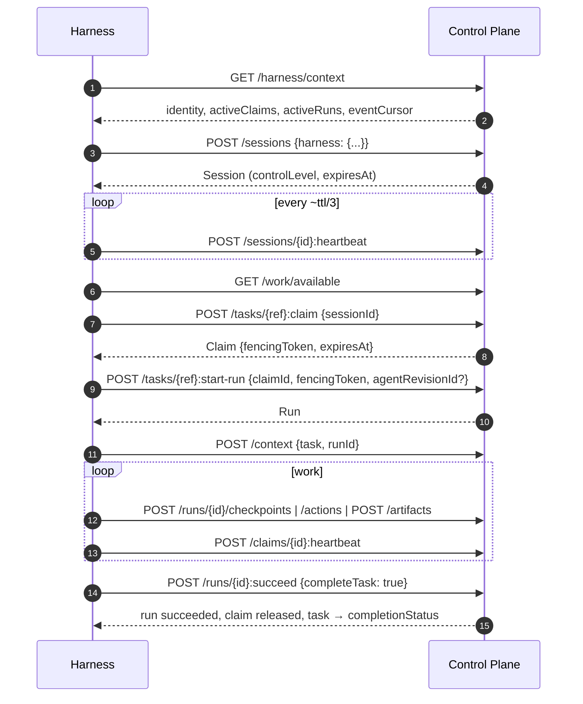

# Harness protocol

The harness protocol (`control-harness`) is the semantic contract between the
Control Plane and the execution environment. The execution environment (the
harness) can be Claude Code, Codex, OpenCode, a CLI, an IDE extension, an
autonomous agent daemon, a CI worker, or a third-party client. This page is for
those who write their own harness or want to understand how the existing
adapters behave.

The protocol **does not introduce a new wire format**. The transport is the
regular REST API `/api/v1` and the event log: polling `GET /api/v1/events`
and/or the WebSocket `/api/v1/events/ws`. Human and autonomous harnesses use
the same protocol. Only the client policy differs: a human picks the task, or
the agent picks it itself. The server paths are the same.

## Roles and trust

| Participant | Role | What is trusted |
|---|---|---|
| Control Plane | authoritative coordination core | every command re-checks permissions, eligibility, readiness, leases, and fencing in its own transaction |
| Harness | untrusted distributed client | nothing on its word: neither "I still own the task" nor "the user confirmed" |
| Credential | the only source of identity | `Authorization: Bearer <token>`, see [Authorization and permissions](authorization.md) |

!!! warning "`harness.type` is not a security boundary"
    The harness type, its version, the declared capabilities, and
    `controlLevel` are observability metadata. The server makes no
    authorization decision based on them.

A bearer credential comes in two kinds:

- **IAM access token** (JWT with audience `control-plane`). The harness obtains
  it by exchanging a Platform Access Token (PAT). Permissions come from the
  binding of the identity to a local principal. This is the primary mode of the
  delivery;
- **legacy API key** `cp_<prefix>_<secret>`. Accepted only while
  `CP_LEGACY_API_KEYS_ENABLED=true`. The delivery's `deploy/local/compose.yml` sets `false`
  by default.

## Harness lifecycle



## Session: registering the harness

There is no separate "harness" entity. A harness is metadata of a live session:
the `harness` block in the body of `POST /api/v1/sessions`. Opening a session
requires the `sessions.open` permission.

```bash
curl -s -X POST https://platform.example.com/api/v1/sessions \
  -H "Authorization: Bearer $TOKEN" \
  -H "Content-Type: application/json" \
  -H "Idempotency-Key: $(uuidgen)" \
  -d '{
    "clientName": "my-harness",
    "clientVersion": "1.4.0",
    "ttlSeconds": 300,
    "harness": {
      "type": "my-harness",
      "version": "1.4.0",
      "protocolVersion": "2",
      "capabilities": ["tasks.interactive", "artifacts.publish", "resume",
                       "checkpoints", "skills.protocol.mcp"],
      "environment": {"repository": "github:acme/app"}
    }
  }'
```

Request fields:

| Field | Type | Constraints | Meaning |
|---|---|---|---|
| `clientName` | string | 1–200 characters | client name |
| `clientVersion` | string | ≤100 | client version |
| `metadata` | object | — | arbitrary non-secret metadata |
| `onBehalfOf` | uuid | — | the human principal on whose behalf the agent works; requires an active delegation, otherwise `403 delegation_required` |
| `ttlSeconds` | int | clamped to `[CP_SESSION_TTL_MIN_SECONDS, CP_SESSION_TTL_MAX_SECONDS]` | session lease TTL, `CP_SESSION_TTL_SECONDS` (300) by default |
| `harness.type` | string | `^[a-z0-9][a-z0-9._-]{0,99}$` | client identifier, otherwise `422 invalid_harness` |
| `harness.version` | string | ≤100 | harness version |
| `harness.protocolVersion` | string | `"1"` or `"2"`, `"1"` by default | protocol version |
| `harness.capabilities` | string[] | ≤100 | what the client can do (see below) |
| `harness.hostname` | string | ≤255 | host name, for observability |
| `harness.environment` | object | — | non-secret environment, for example the repository |

The `harness` block is optional: you can open a session without it.

### Control level (`controlLevel`)

The server sets `controlLevel`; the client does not pass it:

| Principal kind | `controlLevel` |
|---|---|
| `human` | `human_operated` |
| `agent`, `service` | `connected` |

The database schema also has the value `managed`, but the server does not
assign it when a session opens. `controlLevel` is for observability only: it is
neither a permission nor a trust signal.

### Protocol versions

The server supports the versions listed in
`GET /harness/context → protocol.supportedVersions`. Currently `["1", "2"]`.
An unsupported version returns `422 unsupported_protocol_version`, and the list
of allowed versions comes in `details.supported`.

| Version | Difference |
|---|---|
| `2` | cursors (`eventCursor`, `/events` cursors) are opaque `ec1_…` strings; an `/events` page always carries `nextCursor` and `hasMore`; each event has its own `cursor` field |
| `1` | accepted for compatibility: the server adapts an integer `after` itself; already seen events may be delivered again (at-least-once) |

!!! warning "Responses are always in the v2 format"
    Even a session with `protocolVersion: "1"` receives string cursors. A
    client that does arithmetic on `eventCursor` will break. New harnesses
    must declare `"2"`.

### Harness capabilities

Protocol capabilities describe **what the client can do**. Do not confuse them
with the organizational capabilities of a principal (see [Authorization and
permissions](authorization.md#org-model)).

| capability | meaning |
|---|---|
| `events.realtime` | consumes the WebSocket event stream |
| `tasks.interactive` | a human picks tasks; there is no automatic claim |
| `artifacts.publish` | can register artifacts |
| `approvals.interactive` | shows approvals to a human |
| `resume` | stores cursors and state, can continue after a restart |
| `checkpoints` | writes run checkpoints |
| `active_turn_control.v1` | reads and acknowledges durable run control messages |
| `child_run_handle.v1` | launches child runs and recovers them after a restart |
| `skills.protocol.<p>` | executes skills of protocol `<p>`: `mcp`, `http`, `local`, `opencode`, `custom` |

The server silently drops unknown capabilities: this lets a new client work
with an old server. The declared `skills.protocol.*` affect tool visibility
(section [Tools and skills](#tools-and-skills)).

### Heartbeat and leases

A session and a claim are leases. Send heartbeats with a period of `ttl / 3`.
With the default TTL of 300 s this is about once every 100 s. The SDK class
`HeartbeatRunner` beats every 60 s by default.

| Endpoint | Who can call it |
|---|---|
| `POST /sessions/{id}:heartbeat` | session owner or `sessions.manage` |
| `POST /claims/{id}:heartbeat` | claim holder or `claims.manage` |
| `POST /sessions/{id}:close` | owner or `sessions.manage`; releases the session's claims |

Error handling rules:

- a heartbeat is not a domain event and is not written to the event log;
- a **domain** error (`409 session_expired`, `claim_expired`,
  `session_not_active`) means the lease is lost. The harness immediately stops
  authoritative writes, notifies the user in an interactive harness, and rebuilds the
  context;
- a **transport** failure does not prove loss of ownership. It is retried:
  `HeartbeatRunner` tolerates up to three consecutive failures
  (`max_transport_failures=3`), after which it treats the lease as lost.

System correctness does not depend on heartbeats. An expired lease is reaped by
the next claim or by a background worker.

## Bootstrap: `GET /harness/context`

One request answers "who am I", "where am I", "what am I doing", "what is
available to me", and "what has happened". Only authentication is required: the
data describes the caller.

```bash
curl -s "https://platform.example.com/api/v1/harness/context?sessionId=<session-id>" \
  -H "Authorization: Bearer $TOKEN"
```

```jsonc
{
  "protocol": {"name": "control-harness", "supportedVersions": ["1", "2"]},
  "tenant": {"id": "<tenant-id>", "slug": "acme", "name": "Acme"},
  "principal": {"id": "<principal-id>", "kind": "agent", "displayName": "Runner", "status": "active"},
  "session": { /* with ?sessionId=; contains controlLevel */ },
  "activeSessions": [ ... ],
  "activeClaims": [{"id": "...", "taskId": "...", "taskPublicId": "TASK-000042",
                    "fencingToken": 3, "expiresAt": "..."}],
  "activeRuns": [ ... ],
  "suspendedRuns": [ ... ],
  "roles": [{"id": "...", "slug": "reviewer", "name": "Reviewer", "workspaceId": null}],
  "capabilities": [{"id": "...", "name": "python", "description": "..."}],
  "skills": [ ... ],
  "pendingApprovals": [ ... ],
  "eventCursor": "ec1_...",
  "permissions": ["tasks.read", "tasks.claim", "..."]
}
```

- `pendingApprovals` holds at most 50 entries, and only the approvals the
  caller can actually decide: addressed to them personally or through a role in
  a matching scope (a tenant-level role, or a role on the approval's workspace
  or its ancestor).
- `eventCursor` is an opaque string. A subscription from this point is
  guaranteed to receive everything committed after it. Do not parse, compare, or
  construct the cursor on the client. Only store it and return it to the server
  (`GET /events?cursor=…`, `WS /events/ws?after=…`).

## Finding work

```bash
curl -s "https://platform.example.com/api/v1/work/available?workspaceId=<ws-id>&includeDescendants=true&limit=20" \
  -H "Authorization: Bearer $TOKEN"
```

The endpoint returns the tasks the caller **could** claim right now. The task
status is not terminal, there is no live claim, dependencies are satisfied,
there is no open gate approval, and organizational requirements are met.
Sorting is stable: priority (critical → low), then `created_at` and `id`.

| Parameter | Meaning |
|---|---|
| `workspaceId`, `includeDescendants` | workspace subtree |
| `projectId` | the project's workspace and its regular descendants, without nested projects |
| `projectId` + `includeSubprojects=true` | the whole subtree of the project's workspace |
| `assigneeId` | tasks assigned to this principal |
| `assignedToMe=true` | only tasks addressed to the caller; overrides `assigneeId` |
| `limit`, `cursor` | pagination |

!!! note "A page can be shorter than `limit`"
    Eligibility is checked after the query, so a page can be shorter than
    `limit` with a non-empty `nextCursor`. Page through until `nextCursor: null`.

Finding work is **advisory**. The only authoritative gate is the claim itself:
the world can change between showing a task and claiming it. Why a specific
task cannot be claimed is shown by `GET /tasks/{ref}/claimability`. The response
has the form `{claimable, reasons[]}`, with reason codes: `task_already_claimed`,
`task_not_ready`, `approval_required`, `not_eligible`, `task_not_claimable`.

## Execution cycle

```text
claim → start-run → (checkpoints | actions | artifacts)* → succeed | fail | suspend | handoff | cancel
```

1. `POST /tasks/{ref}:claim` with the body `{sessionId, ttlSeconds?, intent?}`
   (permission `tasks.claim`) returns a claim with a `fencingToken` (the new
   claim epoch of the task) and an `expiresAt` lease.
2. `POST /tasks/{ref}:start-run` with the body
   `{claimId, fencingToken, input?, maxDurationSeconds?, maxActions?, agentRevisionId?}`
   creates a run bound to this epoch. An executor whose principal is linked to
   an agent names in `agentRevisionId` the revision it works by (see
   [Agent revision on a run](#agent-revision)).
3. `GET /runs/{id}/context` returns the operational context: the task,
   workspace, claim, requirements, relations, recent artifacts, pending
   approvals, **checkpoints of all past runs of the task**, executable skills,
   `pendingControlMessages`, `childHandles`, and `eventCursor`. This is
   operational state, not memory and not chat history. Memory is
   `POST /context`, see [Task context and memory](context.md).
4. Work:
    - `POST /runs/{id}/checkpoints {kind, data}` — durable operational
      state;
    - `POST /runs/{id}/actions {action, status, skill?, externalReference?, metadata}`
      — log of external actions;
    - `POST /artifacts` — results, see [Artifacts and comments](artifacts.md).
5. Finish:
    - `:succeed {output?, completeTask: true}` atomically moves the run to
      `succeeded`, releases the claim, and completes the task;
    - `:fail` honestly records the failure. It does not touch the task and
      works even after the lease is lost;
    - `:suspend` and `:handoff` are described below;
    - `:cancel` is a terminal cancellation.

### Fencing and `stale_claim`

Before every authoritative write the server checks three things: the claim is
alive (the lease has not expired, the session is alive), the `fencingToken`
matches the task's current claim epoch, and the caller is the owner. Any
mismatch returns `409 stale_claim`.

!!! danger "After `stale_claim`, stop writing"
    The harness must stop authoritative writes and re-read `/harness/context`.
    Retrying the write is pointless: ownership has passed to someone else, or
    the lease has expired.

### Run budgets

`maxActions` and `maxDurationSeconds` are set at `start-run`. The harness must
respect them. On its side, the server rejects an action or checkpoint write
over budget with `409 budget_exceeded`. The budget does not block finalization
(`:succeed`, `:fail`).

### Action log

`POST /runs/{id}/actions` records an external action: a tool call, a skill
use, an external effect. For long operations there is a two-phase variant: a
record with `status: started`, then `POST /runs/{id}/actions/{aid}:finish`.

- Both phases go through the full claim check. Having lost the lease, a process
  cannot append an outcome to the audit of someone else's work: an unfinished
  `started` stays unfinished.
- This is the execution log, separate from the domain event log. It contains no
  secrets, no model reasoning, and no full payloads.
- The `skill` field (`uuid | name | name@version`) goes through
  **re-authorization**: the server recomputes the effective tool policy. For a
  revoked or forbidden assignment it responds `403 tool_not_authorized`, and
  nothing is committed: `seq` does not grow, the budget is intact.
- If the skill's protocol is not declared by the session, the action is still
  recorded, and the mismatch is noted in `metadata.capabilityMismatch`.

Autonomous adapters write one action per tool call; see
[Run trace](../runner/trace.md).

## Waiting: gate approval and suspend

The minimal waiting scheme without a workflow engine consists of three steps:
`checkpoint → gate-approval → suspend`.

1. `POST /runs/{id}/checkpoints` — save the state.
2. `POST /approvals` with `gate: true` and exactly one of the fields
   `requiredRoleId` or `assignedPrincipalId`. While such an approval is
   `pending`, the task can be neither claimed nor completed:
   `409 approval_required`.
3. `POST /runs/{id}:suspend {reason, waitingForApprovalId?}`. Atomically: the
   run moves to `suspended` (a terminal state for this run), the claim is
   released, and the task returns to its type's `releaseStatus`.

Continuation is a new claim with a new fencing token and a new run, which reads
the checkpoints of past attempts from the Run Context. No exclusive lease is
held while waiting. Details about approvals are in [Approvals](approvals.md).

## Handing a run off to another harness (handoff)

When a human explicitly decides to switch harnesses, the current harness calls:

```bash
curl -s -X POST https://platform.example.com/api/v1/runs/<run-id>:handoff \
  -H "Authorization: Bearer $TOKEN" \
  -H "Content-Type: application/json" \
  -H "Idempotency-Key: handoff-<run-id>-1" \
  -d '{
    "reason": "human_harness_handoff",
    "checkpoint": {
      "kind": "handoff",
      "data": {
        "summary": "Migration is written; the roundtrip still needs to run",
        "nextSteps": ["Create a new Claim and Run", "Run make test"],
        "evidenceRefs": ["commit:abc1234"]
      }
    }
  }'
```

A single transaction checks the permission, tenant, owner, live claim, and
fencing, writes the checkpoint, moves the run to `suspended`, releases the
claim, and returns the task to work. The events `run.checkpointed`,
`run.suspended`, `claim.released`, and `run.handoff_prepared` go to the event
log. The response contains `run`, `task`, `checkpoint`, `eventCursor`, and a
hint for continuing.

- A repeat with the same `Idempotency-Key` after an ambiguous response returns
  the stored response and does not create a second checkpoint.
- The second harness opens its own session, takes a new claim and a new run,
  and reads the Run Context. The old run is not resumed. Process state and the
  transcript are not transferred.
- A summary and evidence with credential-like values or full local paths are
  rejected.

## Agent revision on a run {#agent-revision}

The executor's configuration — model, instructions, work selection, working
copy — is fixed by the revision of its agent: an immutable snapshot of the
description in the Control Plane agent registry (CP-ADR-0073). A run names the
revision it went by: the server records `agentRevisionId` on the run and returns
it in the `start-run` response and in the `run.started` event. There is no
separate configuration snapshot per run.

| Who starts the run | `agentRevisionId` in `start-run` | Refusal |
|---|---|---|
| a principal linked to an agent | required: a revision of its own agent | no field — `422 agent_revision_required`; a revision of another agent — `422 agent_revision_mismatch` |
| a principal without an agent (a person, an executor in env mode) | not passed | a passed field — `422 agent_revision_mismatch` |

A revision of its own agent that is not the current one is accepted: the
executor learns about a new revision between runs, and publishing a revision
while a run starts must not break work. The revision the run actually goes by
is recorded. The revision is checked before the task is locked and before the
claim is checked.

The executor learns its agent and the current revision through
`GET /agents/me`; how the executor daemon chooses its mode and what it takes
from the revision is described in
[Executor configuration](../runner/configuration.md).

## Tools and skills {#tools-and-skills}

The harness executes skills. The Control Plane coordinates their availability
and keeps the audit. Three layers are deliberately separated:

- **catalog** — what the runtime can do technically;
- **effective tool policy** — what is allowed for this principal, run, and
  workspace right now;
- **search view** — a bounded projection of the intersection of the two.

```bash
# search: short cards; the first page for an empty query
curl -s "https://platform.example.com/api/v1/tools?query=deploy&runId=<run-id>&limit=25" \
  -H "Authorization: Bearer $TOKEN"

# the full sanitized schema of a single tool
curl -s "https://platform.example.com/api/v1/tools/git.merge@1?runId=<run-id>" \
  -H "Authorization: Bearer $TOKEN"
```

Rules you can rely on:

- a tool outside the policy can be neither found nor described: describe
  responds `404 tool_not_found`, the same as for a nonexistent name;
- a tool is assigned, but the session did not declare its protocol: it is
  visible with `visible: false` and `reason: protocol_not_supported_by_harness`.
  This is a diagnostic of the harness configuration, not a denial;
- the fields `view.catalogRevision`, `view.policyRevision`, and `view.viewHash`
  describe what the page is built from. `viewHash` is returned as the `ETag`,
  and `If-None-Match` returns `304` while both revisions are unchanged;
- `config`, `default`, `examples`, and vendor extensions are removed from the
  describe schema. The removed paths are listed in `schemaRedactions`;
- **finding a tool grants no permissions.** The policy is recomputed before an
  action is written.

Visibility reasons (`reason`): `assigned_and_protocol_supported`,
`not_assigned`, `skill_disabled`, `protocol_not_allowed_by_governance`,
`not_granted_by_child_handle`, `protocol_not_supported_by_harness`.

## Active Turn Control

A plain "Stop" does not say which execution exactly to interrupt. A harness
with the `active_turn_control.v1` capability accepts durable messages bound to
the run.

```bash
curl -s -X POST https://platform.example.com/api/v1/runs/<run-id>/control-messages \
  -H "Authorization: Bearer $TOKEN" \
  -H "Content-Type: application/json" \
  -H "Idempotency-Key: $(uuidgen)" \
  -d '{
    "operation": "steer",
    "causalPosition": "turn:17/tool-batch:2",
    "directive": "Check the migration roundtrip first",
    "expectedRunVersion": 4
  }'
```

| Operation | Semantics | Permission |
|---|---|---|
| `queue` | a new intent after the current turn finishes | `tasks.write` |
| `steer` | a correction at the nearest safe boundary, without cancelling the action | `tasks.write` |
| `redirect` | cancel only the model inference; while a tool is running, the harness applies it as `steer` | `tasks.write` |
| `request_cancel` | cooperative stop; new actions are forbidden only after an `applied` acknowledgement | `tasks.write` |
| `force_cancel` | the server immediately moves the run to `cancelled`, releases the claim, and cancels active descendants by `spawned_by` | `claims.manage` |

`Idempotency-Key` and `expectedRunVersion` are required (without the key —
`422 idempotency_key_required`).

The harness reads messages through `GET /runs/{id}/control-messages` with an
opaque cursor `rc1_…` bound to the run (50 entries by default, 200 maximum).
`GET /runs/{id}/context` additionally carries `pendingControlMessages`, so a
restart between the `accepted` and `applied` states does not lose the intent.

Application is acknowledged with
`POST /runs/{id}/control-messages/{messageId}:acknowledge` with the fields
`status` (`applied`, `rejected`, or `superseded`), `claimId`, `fencingToken`,
`expectedRunVersion`, `expectedMessageVersion`, `safeBoundary` (required for
`applied`), and `reason`. Only the holder of the live claim can acknowledge,
and messages are resolved strictly in `seq` order. Message statuses:
`accepted`, `applied`, `rejected`, `superseded`. The `directive` and `reason`
text is not copied into events or the outbox.

The old endpoint `POST /runs/{id}:request-cancel` (permission `tasks.write` or
`claims.manage`) remains a wrapper: it materializes a typed `request_cancel`
message and writes a `run.cancel_requested` event.

## Child runs (Child Run Handle)

A harness with the `child_run_handle.v1` capability can delegate work to a
child run and survive its own restart.

```bash
curl -s -X POST https://platform.example.com/api/v1/runs/<run-id>/child-handles \
  -H "Authorization: Bearer $TOKEN" \
  -H "Content-Type: application/json" \
  -H "Idempotency-Key: $(uuidgen)" \
  -d '{
    "correlationId": "review:migration-roundtrip",
    "title": "Check the migration roundtrip",
    "grant": {"permissions": ["tasks.read", "tasks.claim"]},
    "cancellationPolicy": "cascade_cooperative"
  }'
```

- **Idempotent launch.** A repeat with the same `correlationId` returns `200`
  and the same child run, even with a different `Idempotency-Key`. A new run
  responds `201`.
- **`handleToken` (`ch1_…`) is returned once.** It is a pointer, not a
  credential: every access still checks the key, tenant, and permission.
  Losing the token is harmless; everything also works by `handleId`.
- **A grant narrows but does not widen.** A request above the parent's ceiling
  returns `422 child_grant_exceeds_parent`. The child run's grant must include
  `tasks.claim`, otherwise `:start-run` is rejected.
- **Reconnection.** `GET /runs/{id}/context` carries `childHandles`. There are
  also `GET /runs/{id}/child-handles?active=true` (cursor `cd1_…`) and
  `GET /child-handles/{idOrToken}`.
- **The status is computed** from the child task and run. A revoked handle
  with a live child shows `running`, not `revoked`.
- **The result is size-limited and immutable.** The `output` of the child's
  `:succeed` can carry `summary`, `data`, and `artifactRefs`. Exceeding the
  limits returns `422 child_result_too_large`; move bulky data into an Artifact.
- **Cancellation policy.** `cascade_cooperative` (the default) passes the
  parent's acknowledged `request_cancel` to active children; `detach` does not.
  `force_cancel` always cascades.
- Revocation: `POST /child-handles/{id}:revoke {reason, cancelChild}`. The
  holder of the parent run or a principal with `claims.manage` can call it.

## Cancellation

- `POST /runs/{id}:request-cancel` is a cooperative signal. It sets
  `cancel_requested_at` and writes a `run.cancel_requested` event. Idempotent.
- "Cancellation requested" does not mean "execution stopped". The harness
  notices the signal through events or `GET /runs/{id}`, stops, and finalizes
  the run through `:cancel` or `:fail`.
- You can authoritatively stop someone else's run through `:cancel`: this is
  allowed to the holder or a principal with `claims.manage`. After the
  cancellation commits, `:succeed` is impossible (`409 run_not_active`). The
  cancel/succeed race is serialized by task and run locks; there is always
  exactly one winner.

## Events

```text
store the last processed cursor
GET /events?cursor=<cursor>   (or WS /events/ws?after=<cursor>)
catch up → process → reconnect → catch up again
```

The event log in PostgreSQL is the source of truth. The WebSocket serves only
as a "wake up" signal: if NOTIFY is lost, the server polls the log with a
period of `CP_WS_POLL_INTERVAL_SECONDS`. The issued log prefix is always
complete, so the only thing to store is the last processed cursor. The SDK's
`follow_events(cursor=...)` implements this pattern on top of polling.

Events an interactive harness should show to the user:
`approval.requested|approved|rejected`, `task.claimed` (by someone else),
`claim.released|expired` (loss of ownership), `run.cancel_requested`,
`run.suspended`, `artifact.created`, `task.completed`. The full list of types is
in [Events](events.md).

## Recovery after a restart

Continuity of work does not depend on process memory. After a restart the
harness:

1. Finds the credential (see [CLI and MCP server](cli-and-mcp.md#credentials)).
2. Calls `GET /harness/context`.
3. Chooses a branch:

    | Situation | What to do |
    |---|---|
    | the claim is alive (the task is in `activeClaims`) | continue: heartbeat; an existing `activeRuns[*]` can be carried on with the same fencing token |
    | the claim expired, the task is free | a new claim (new token) and a new run |
    | the task was taken over | make no authoritative writes; `:succeed` honestly returns `409 stale_claim` |
    | the run is `suspended` | check the gate, then a new claim and a new run |

4. Reads the remaining events from the stored cursor or from the context's
   `eventCursor`.
5. Opens a new session if the old one died. Sessions are cheap, but a new
   session does not inherit other sessions' claims: they must be claimed again.

The Control Plane restores the state of the work, but not the hidden state of
the LLM.

## Failure summary

| Failure | Authoritative state | Client action | Safe to retry? |
|---|---|---|---|
| network failure | unknown | retry with the same `Idempotency-Key` | yes, with the key |
| harness crash | leases live until TTL | restart, see the section above | — |
| Control Plane restart | everything is in PostgreSQL | reconnect, read the remaining events | yes |
| session expired | the session is stale, claims are released | new session, new claim | yes |
| claim expired | the next claim reaps it | new claim (new token) | yes |
| takeover | the task has someone else's claim | stop writing, tell the human | no, for the old process |
| approval rejected | the gate is open, the task is back in work | the executor decides | — |
| skill unavailable | `409 skill_unavailable` | choose another version or skill | yes |
| event stream dropped | the event log is complete | reconnect from the last cursor | yes |

Key error codes for harness UX: `not_eligible`, `task_not_ready`,
`task_already_claimed`, `stale_claim`, `session_expired`, `approval_required`,
`skill_unavailable`, `version_conflict`, `idempotency_key_reused`,
`idempotency_in_flight`, `budget_exceeded`, `run_not_active`,
`unsupported_protocol_version`, `task_cancelled`, `task_not_claimable`.
The error format is described in [API](api.md#errors).

## New harness checklist

- [ ] Obtain the principal's credential and keep it outside the repository and shell history.
- [ ] `GET /harness/context`: identity and the recovery branch.
- [ ] Open a session with the `harness` block, `protocolVersion: "2"`, and honest capabilities.
- [ ] Start session and claim heartbeats with a period of about `ttl/3`.
- [ ] Find work through `/work/available` (with `projectId` if the work happens inside a project).
- [ ] claim → start-run → `POST /context` → checkpoints, actions, artifacts.
- [ ] Record important conclusions and decisions through `POST /observations`.
- [ ] Finalize the run; when waiting, use a gate and suspend.
- [ ] Subscribe to events from the stored cursor.
- [ ] On any `stale_claim`, stop authoritative writes.
- [ ] Send every mutation with an `Idempotency-Key`; on a transport failure, retry with the same key.

## See also

- [Execution — claims and runs](execution.md)
- [Task context and memory](context.md)
- [Authorization and permissions](authorization.md)
- [CLI and MCP server](cli-and-mcp.md)
- [API](api.md)
- [Executor adapters](../runner/adapters.md)
- [MCP plugin for Claude Code](../operator/mcp-plugin.md)
