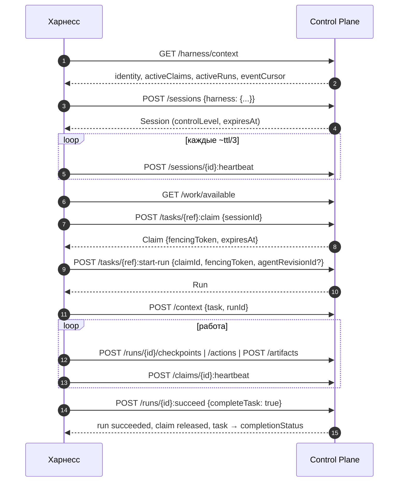

# Харнесс-протокол

Харнесс-протокол (`control-harness`) — это семантический контракт между Control
Plane и исполняющей средой. Исполняющей средой (harness) может быть Claude Code,
Codex, OpenCode, CLI, IDE-расширение, демон автономного агента, CI-воркер или
сторонний клиент. Статья нужна тем, кто пишет свой харнесс или разбирается,
как ведут себя готовые адаптеры.

Протокол **не вводит новый wire-формат**. Транспорт — обычный REST API `/api/v1`
и журнал событий: поллинг `GET /api/v1/events` и/или WebSocket
`/api/v1/events/ws`. Человеческий и автономный харнессы работают по одному
протоколу. Различается только политика клиента: задачу выбирает человек или сам
агент. Серверные пути у них одни и те же.

## Роли и доверие

| Участник | Роль | Чему доверяют |
|---|---|---|
| Control Plane | авторитетное ядро координации | каждая команда в своей транзакции перепроверяет права, eligibility, readiness, аренды и fencing |
| Харнесс | недоверенный распределённый клиент | ничему на слово: ни «я всё ещё владею задачей», ни «пользователь подтвердил» |
| Credential | единственный источник identity | `Authorization: Bearer <token>`, см. [Авторизация и права](authorization.md) |

!!! warning "`harness.type` — не граница безопасности"
    Тип харнесса, его версия, заявленные capabilities и `controlLevel` —
    метаданные для наблюдаемости. Сервер не принимает на их основании ни одного
    решения об авторизации.

Bearer-credential бывает двух видов:

- **access token IAM** (JWT audience `control-plane`). Харнесс получает его
  обменом Platform Access Token (PAT). Права берутся из привязки identity к
  локальному principal. Это основной режим поставки;
- **legacy API-ключ** `cp_<prefix>_<secret>`. Принимается, только пока
  `CP_LEGACY_API_KEYS_ENABLED=true`. В `deploy/local/compose.yml` поставки по умолчанию
  стоит `false`.

## Жизненный цикл харнесса



## Сессия: регистрация харнесса

Отдельной сущности «харнесс» нет. Харнесс — это метаданные живой сессии: блок
`harness` в теле `POST /api/v1/sessions`. Для открытия сессии нужно право
`sessions.open`.

```bash
curl -s -X POST https://platform.example.com/api/v1/sessions \
  -H "Authorization: Bearer $TOKEN" \
  -H "Content-Type: application/json" \
  -H "Idempotency-Key: $(uuidgen)" \
  -d '{
    "clientName": "my-harness",
    "clientVersion": "1.4.0",
    "ttlSeconds": 300,
    "harness": {
      "type": "my-harness",
      "version": "1.4.0",
      "protocolVersion": "2",
      "capabilities": ["tasks.interactive", "artifacts.publish", "resume",
                       "checkpoints", "skills.protocol.mcp"],
      "environment": {"repository": "github:acme/app"}
    }
  }'
```

Поля запроса:

| Поле | Тип | Ограничения | Смысл |
|---|---|---|---|
| `clientName` | string | 1–200 символов | имя клиента |
| `clientVersion` | string | ≤100 | версия клиента |
| `metadata` | object | — | произвольные несекретные метаданные |
| `onBehalfOf` | uuid | — | human-principal, от имени которого работает агент; нужна активная delegation, иначе `403 delegation_required` |
| `ttlSeconds` | int | зажимается в `[CP_SESSION_TTL_MIN_SECONDS, CP_SESSION_TTL_MAX_SECONDS]` | TTL аренды сессии, по умолчанию `CP_SESSION_TTL_SECONDS` (300) |
| `harness.type` | string | `^[a-z0-9][a-z0-9._-]{0,99}$` | идентификатор клиента, иначе `422 invalid_harness` |
| `harness.version` | string | ≤100 | версия харнесса |
| `harness.protocolVersion` | string | `"1"` или `"2"`, по умолчанию `"1"` | версия протокола |
| `harness.capabilities` | string[] | ≤100 | что умеет клиент (см. ниже) |
| `harness.hostname` | string | ≤255 | имя хоста, для наблюдаемости |
| `harness.environment` | object | — | несекретное окружение, например репозиторий |

Блок `harness` необязателен: сессию можно открыть и без него.

### Уровень управления (`controlLevel`)

`controlLevel` проставляет сервер, клиент его не передаёт:

| Вид principal | `controlLevel` |
|---|---|
| `human` | `human_operated` |
| `agent`, `service` | `connected` |

В схеме БД есть и значение `managed`, но при открытии сессии сервер его не
назначает. `controlLevel` служит только для наблюдаемости: это не право и не
сигнал доверия.

### Версии протокола

Сервер поддерживает версии, перечисленные в
`GET /harness/context → protocol.supportedVersions`. Сейчас это `["1", "2"]`.
Неподдерживаемая версия даёт `422 unsupported_protocol_version`, список
допустимых версий приходит в `details.supported`.

| Версия | Отличие |
|---|---|
| `2` | курсоры (`eventCursor`, курсоры `/events`) — непрозрачные строки `ec1_…`; страница `/events` всегда несёт `nextCursor` и `hasMore`; у каждого события есть своё поле `cursor` |
| `1` | принимается для совместимости: целочисленный `after` сервер адаптирует сам, возможна повторная выдача уже виденного (at-least-once) |

!!! warning "Ответы всегда в формате v2"
    Даже сессия с `protocolVersion: "1"` получает курсоры-строки. Клиент,
    который делает арифметику над `eventCursor`, сломается. Новые харнессы
    обязаны объявлять `"2"`.

### Capabilities харнесса

Protocol capabilities описывают, **что умеет клиент**. Их не надо путать с
организационными capabilities principal (см. [Авторизация и
права](authorization.md#org-model)).

| capability | значение |
|---|---|
| `events.realtime` | потребляет WebSocket-поток событий |
| `tasks.interactive` | задачи выбирает человек, автоматического claim нет |
| `artifacts.publish` | умеет регистрировать артефакты |
| `approvals.interactive` | показывает approvals человеку |
| `resume` | хранит курсоры и состояние, умеет продолжить после рестарта |
| `checkpoints` | пишет checkpoints прогона |
| `active_turn_control.v1` | читает и подтверждает durable control-сообщения прогона |
| `child_run_handle.v1` | запускает дочерние прогоны и восстанавливает их после рестарта |
| `skills.protocol.<p>` | исполняет скиллы протокола `<p>`: `mcp`, `http`, `local`, `opencode`, `custom` |

Неизвестные capabilities сервер молча отбрасывает: так новый клиент может
работать со старым сервером. Заявленные `skills.protocol.*` влияют на видимость
инструментов (раздел [Инструменты и скиллы](#tools-and-skills)).

### Heartbeat и аренды

Сессия и claim — это аренды (lease). Heartbeat рекомендуется слать с периодом
`ttl / 3`. При TTL по умолчанию 300 с это примерно раз в 100 с. SDK-класс
`HeartbeatRunner` по умолчанию бьёт каждые 60 с.

| Endpoint | Кто может вызвать |
|---|---|
| `POST /sessions/{id}:heartbeat` | владелец сессии или `sessions.manage` |
| `POST /claims/{id}:heartbeat` | держатель claim или `claims.manage` |
| `POST /sessions/{id}:close` | владелец или `sessions.manage`; снимает claims сессии |

Правила обработки ошибок:

- heartbeat — не доменное событие, в журнал он не пишется;
- **доменная** ошибка (`409 session_expired`, `claim_expired`,
  `session_not_active`) означает, что аренда потеряна. Харнесс немедленно
  прекращает авторитетные записи, в человеческом харнессе уведомляет
  пользователя и пересобирает контекст;
- **транспортный** сбой не доказывает потерю владения. Его повторяют:
  `HeartbeatRunner` терпит до трёх сбоев подряд (`max_transport_failures=3`),
  после этого считает аренду потерянной.

Корректность системы от heartbeat'ов не зависит. Просроченную аренду пожнёт
следующий claim или фоновый worker.

## Bootstrap: `GET /harness/context`

Один запрос отвечает на вопросы «кто я», «где я», «что я делаю», «что мне
доступно» и «что произошло». Нужна только аутентификация: данные описывают
самого вызывающего.

```bash
curl -s "https://platform.example.com/api/v1/harness/context?sessionId=<session-id>" \
  -H "Authorization: Bearer $TOKEN"
```

```jsonc
{
  "protocol": {"name": "control-harness", "supportedVersions": ["1", "2"]},
  "tenant": {"id": "<tenant-id>", "slug": "acme", "name": "Acme"},
  "principal": {"id": "<principal-id>", "kind": "agent", "displayName": "Runner", "status": "active"},
  "session": { /* при ?sessionId=; содержит controlLevel */ },
  "activeSessions": [ ... ],
  "activeClaims": [{"id": "...", "taskId": "...", "taskPublicId": "TASK-000042",
                    "fencingToken": 3, "expiresAt": "..."}],
  "activeRuns": [ ... ],
  "suspendedRuns": [ ... ],
  "roles": [{"id": "...", "slug": "reviewer", "name": "Reviewer", "workspaceId": null}],
  "capabilities": [{"id": "...", "name": "python", "description": "..."}],
  "skills": [ ... ],
  "pendingApprovals": [ ... ],
  "eventCursor": "ec1_...",
  "permissions": ["tasks.read", "tasks.claim", "..."]
}
```

- `pendingApprovals` содержит не больше 50 записей, и только те approvals,
  которые вызывающий действительно может решить: адресованные ему лично или
  через роль в подходящем scope (роль уровня tenant либо роль на workspace
  approval'а или на его предке).
- `eventCursor` — непрозрачная строка. Подписка с этой точки гарантированно
  получит всё, что закоммитится после. Курсор нельзя разбирать, сравнивать или
  собирать на клиенте. Его только сохраняют и возвращают серверу
  (`GET /events?cursor=…`, `WS /events/ws?after=…`).

## Поиск работы

```bash
curl -s "https://platform.example.com/api/v1/work/available?workspaceId=<ws-id>&includeDescendants=true&limit=20" \
  -H "Authorization: Bearer $TOKEN"
```

Endpoint возвращает задачи, которые вызывающий **мог бы** захватить прямо сейчас.
Статус задачи не терминальный, живого claim нет, зависимости выполнены,
незакрытого gate-approval нет, организационные требования удовлетворены.
Сортировка стабильная: приоритет (critical → low), затем `created_at` и `id`.

| Параметр | Смысл |
|---|---|
| `workspaceId`, `includeDescendants` | поддерево workspace |
| `projectId` | workspace проекта и его обычные потомки, без вложенных проектов |
| `projectId` + `includeSubprojects=true` | всё поддерево workspace проекта |
| `assigneeId` | задачи, назначенные этому principal |
| `assignedToMe=true` | только задачи, адресованные вызывающему; перекрывает `assigneeId` |
| `limit`, `cursor` | пагинация |

!!! note "Страница бывает короче `limit`"
    Eligibility проверяется после выборки, поэтому страница может оказаться
    короче `limit` при непустом `nextCursor`. Листайте до `nextCursor: null`.

Поиск работы носит **рекомендательный** характер. Единственный авторитетный
gate — сам claim: между показом задачи и её захватом мир успевает измениться.
Почему конкретную задачу нельзя взять, показывает
`GET /tasks/{ref}/claimability`. Ответ имеет вид `{claimable, reasons[]}`, коды
причин: `task_already_claimed`, `task_not_ready`, `approval_required`,
`not_eligible`, `task_not_claimable`.

## Цикл исполнения

```text
claim → start-run → (checkpoints | actions | artifacts)* → succeed | fail | suspend | handoff | cancel
```

1. `POST /tasks/{ref}:claim` с телом `{sessionId, ttlSeconds?, intent?}`
   (право `tasks.claim`) возвращает claim с `fencingToken` (новой эпохой claim
   задачи) и арендой `expiresAt`.
2. `POST /tasks/{ref}:start-run` с телом
   `{claimId, fencingToken, input?, maxDurationSeconds?, maxActions?, agentRevisionId?}`
   создаёт run, привязанный к этой эпохе. Исполнитель, чей principal привязан к
   агенту, называет в `agentRevisionId` ревизию, по которой работает (см.
   [Ревизия агента на прогоне](#agent-revision)).
3. `GET /runs/{id}/context` отдаёт операционный контекст: задачу, workspace,
   claim, требования, связи, последние артефакты, pending approvals,
   **checkpoints всех прошлых run'ов задачи**, исполнимые скиллы,
   `pendingControlMessages`, `childHandles` и `eventCursor`. Это операционное
   состояние, а не память и не история чата. Память — `POST /context`, см.
   [Контекст задачи и память](context.md).
4. Работа:
    - `POST /runs/{id}/checkpoints {kind, data}` — долговременное операционное
      состояние;
    - `POST /runs/{id}/actions {action, status, skill?, externalReference?, metadata}`
      — журнал внешних действий;
    - `POST /artifacts` — результаты, см. [Артефакты и комментарии](artifacts.md).
5. Финал:
    - `:succeed {output?, completeTask: true}` атомарно переводит run в
      `succeeded`, освобождает claim и завершает задачу;
    - `:fail` честно записывает неудачу. Задачу не трогает и работает даже
      после потери аренды;
    - `:suspend` и `:handoff` описаны ниже;
    - `:cancel` — терминальная отмена.

### Fencing и `stale_claim`

Перед каждой авторитетной записью сервер проверяет три вещи: claim жив (аренда
не истекла, сессия жива), `fencingToken` совпадает с текущей эпохой claim
задачи, вызывающий — владелец. Любое несовпадение даёт `409 stale_claim`.

!!! danger "Получив `stale_claim`, прекратите писать"
    Харнесс обязан прекратить авторитетные записи и заново прочитать
    `/harness/context`. Повторять запись бессмысленно: владение перешло к
    другому, или аренда истекла.

### Бюджеты прогона

`maxActions` и `maxDurationSeconds` задаются при `start-run`. Харнесс обязан их
уважать. Сервер со своей стороны отклоняет запись действия или checkpoint сверх
бюджета с `409 budget_exceeded`. Финализацию (`:succeed`, `:fail`) бюджет не
блокирует.

### Журнал действий

`POST /runs/{id}/actions` записывает внешнее действие: вызов инструмента,
использование скилла, внешний эффект. Для длинных операций есть двухфазный
вариант: запись со `status: started`, затем `POST /runs/{id}/actions/{aid}:finish`.

- Обе фазы проходят полную проверку claim. Потеряв аренду, процесс не допишет
  исход в аудит чужой работы: незавершённое `started` так и останется
  незавершённым.
- Это журнал исполнения, отдельный от доменного журнала событий. В нём нет
  секретов, рассуждений модели и полных payload'ов.
- Поле `skill` (`uuid | name | name@version`) проходит **повторную
  авторизацию**: сервер заново вычисляет эффективную политику инструментов. На
  отозванное или запрещённое назначение он отвечает `403 tool_not_authorized`,
  и ничего не коммитится: `seq` не растёт, бюджет цел.
- Если протокол скилла не заявлен сессией, действие всё равно записывается, а
  расхождение отмечается в `metadata.capabilityMismatch`.

Автономные адаптеры пишут одно действие на каждый вызов инструмента, подробнее
в [Трасса прогонов](../runner/trace.md).

## Ожидание: gate-approval и suspend

Минимальная схема ожидания без workflow-движка строится из трёх шагов:
`checkpoint → gate-approval → suspend`.

1. `POST /runs/{id}/checkpoints` — сохранить состояние.
2. `POST /approvals` с `gate: true` и ровно одним из полей `requiredRoleId` или
   `assignedPrincipalId`. Пока такой approval в статусе `pending`, задачу
   нельзя ни захватить, ни завершить: `409 approval_required`.
3. `POST /runs/{id}:suspend {reason, waitingForApprovalId?}`. Атомарно: run
   переходит в `suspended` (для этого run состояние терминальное), claim
   освобождается, задача возвращается в `releaseStatus` своего типа.

Продолжение — это новый claim с новым fencing token и новый run, который
прочитает checkpoints прошлых попыток из Run Context. Эксклюзивная аренда на
время ожидания не удерживается. Подробности про approvals — в
[Approvals](approvals.md).

## Передача прогона другому харнессу (handoff)

Когда человек явно решил сменить харнесс, текущий харнесс вызывает:

```bash
curl -s -X POST https://platform.example.com/api/v1/runs/<run-id>:handoff \
  -H "Authorization: Bearer $TOKEN" \
  -H "Content-Type: application/json" \
  -H "Idempotency-Key: handoff-<run-id>-1" \
  -d '{
    "reason": "human_harness_handoff",
    "checkpoint": {
      "kind": "handoff",
      "data": {
        "summary": "Миграция написана, осталось прогнать roundtrip",
        "nextSteps": ["Создать новый Claim и Run", "Прогнать make test"],
        "evidenceRefs": ["commit:abc1234"]
      }
    }
  }'
```

Одна транзакция проверяет право, tenant, владельца, живой claim и fencing,
пишет checkpoint, переводит run в `suspended`, освобождает claim и возвращает
задачу в работу. В журнал уходят события `run.checkpointed`, `run.suspended`,
`claim.released` и `run.handoff_prepared`. Ответ содержит `run`, `task`,
`checkpoint`, `eventCursor` и подсказку для продолжения.

- Повтор с тем же `Idempotency-Key` после неоднозначного ответа возвращает
  сохранённый ответ и не создаёт второй checkpoint.
- Второй харнесс открывает свою сессию, берёт новый claim и новый run и читает
  Run Context. Старый run не возобновляется. Процессное состояние и transcript
  не переносятся.
- Summary и evidence с credential-подобными значениями или полными локальными
  путями отклоняются.

## Ревизия агента на прогоне {#agent-revision}

Конфигурацию исполнителя — модель, инструкции, выбор работы, рабочую копию —
фиксирует ревизия его агента: неизменяемый снимок описания в реестре агентов
Control Plane (CP-ADR-0073). Прогон называет ревизию, по которой шёл: сервер
записывает `agentRevisionId` на run, отдаёт его в ответе `start-run` и в событии
`run.started`. Отдельного снимка конфигурации на каждый run нет.

| Кто запускает прогон | `agentRevisionId` в `start-run` | Отказ |
|---|---|---|
| principal, привязанный к агенту | обязателен: ревизия своего агента | нет поля — `422 agent_revision_required`; ревизия другого агента — `422 agent_revision_mismatch` |
| principal без агента (человек, исполнитель в режиме env) | не передаётся | переданное поле — `422 agent_revision_mismatch` |

Ревизия своего агента, но не текущая, принимается: исполнитель узнаёт о новой
ревизии между прогонами, и публикация ревизии во время старта не должна ронять
работу. Записывается ревизия, по которой прогон идёт на самом деле. Ревизию
проверяют до блокировки задачи и до проверки claim.

Исполнитель узнаёт своего агента и текущую ревизию через `GET /agents/me`; как
демон исполнителя выбирает режим и что берёт из ревизии — в статье
[Конфигурация исполнителя](../runner/configuration.md).

## Инструменты и скиллы {#tools-and-skills}

Скиллы исполняет харнесс. Control Plane координирует их доступность и ведёт
аудит. Три слоя намеренно разделены:

- **каталог** — что runtime умеет технически;
- **эффективная политика инструментов** — что разрешено этому principal, run и
  workspace сейчас;
- **представление для поиска** — ограниченная проекция пересечения этих двух.

```bash
# поиск: краткие карточки, первая страница — при пустом query
curl -s "https://platform.example.com/api/v1/tools?query=deploy&runId=<run-id>&limit=25" \
  -H "Authorization: Bearer $TOKEN"

# полная санитизированная схема одного инструмента
curl -s "https://platform.example.com/api/v1/tools/git.merge@1?runId=<run-id>" \
  -H "Authorization: Bearer $TOKEN"
```

Правила, на которые можно опираться:

- инструмент вне политики нельзя ни найти, ни описать: describe отвечает
  `404 tool_not_found` так же, как на несуществующее имя;
- инструмент назначен, но его протокол сессия не объявила: он виден с
  `visible: false` и `reason: protocol_not_supported_by_harness`. Это
  диагностика конфигурации харнесса, а не запрет;
- поля `view.catalogRevision`, `view.policyRevision` и `view.viewHash`
  описывают, из чего собрана страница. `viewHash` отдаётся как `ETag`, и
  `If-None-Match` даёт `304`, пока обе ревизии не менялись;
- из схемы describe удалены `config`, `default`, `examples` и vendor-расширения.
  Удалённые пути перечислены в `schemaRedactions`;
- **поиск инструмента не даёт прав.** Перед записью действия политика
  пересчитывается заново.

Причины видимости (`reason`): `assigned_and_protocol_supported`,
`not_assigned`, `skill_disabled`, `protocol_not_allowed_by_governance`,
`not_granted_by_child_handle`, `protocol_not_supported_by_harness`.

## Управление активным ходом (Active Turn Control)

Простой «Stop» не говорит, какое именно исполнение нужно прервать. Харнесс с
capability `active_turn_control.v1` принимает durable-сообщения, привязанные к
прогону.

```bash
curl -s -X POST https://platform.example.com/api/v1/runs/<run-id>/control-messages \
  -H "Authorization: Bearer $TOKEN" \
  -H "Content-Type: application/json" \
  -H "Idempotency-Key: $(uuidgen)" \
  -d '{
    "operation": "steer",
    "causalPosition": "turn:17/tool-batch:2",
    "directive": "Сначала проверь roundtrip миграции",
    "expectedRunVersion": 4
  }'
```

| Операция | Семантика | Право |
|---|---|---|
| `queue` | новое намерение после завершения текущего хода | `tasks.write` |
| `steer` | поправка на ближайшей безопасной границе, без отмены действия | `tasks.write` |
| `redirect` | отменить только инференс модели; во время работы инструмента харнесс применяет его как `steer` | `tasks.write` |
| `request_cancel` | кооперативная остановка; новые actions запрещаются только после подтверждения `applied` | `tasks.write` |
| `force_cancel` | сервер сразу переводит run в `cancelled`, освобождает claim и отменяет активных потомков по `spawned_by` | `claims.manage` |

`Idempotency-Key` и `expectedRunVersion` обязательны (без ключа —
`422 idempotency_key_required`).

Харнесс читает сообщения через `GET /runs/{id}/control-messages` с
непрозрачным курсором `rc1_…`, привязанным к прогону (по умолчанию 50 записей,
максимум 200). `GET /runs/{id}/context` дополнительно несёт
`pendingControlMessages`, поэтому рестарт между состояниями `accepted` и
`applied` не теряет намерение.

Применение подтверждается запросом
`POST /runs/{id}/control-messages/{messageId}:acknowledge` с полями `status`
(`applied`, `rejected` или `superseded`), `claimId`, `fencingToken`,
`expectedRunVersion`, `expectedMessageVersion`, `safeBoundary` (обязателен при
`applied`) и `reason`. Подтверждать может только держатель живого claim,
сообщения разрешаются строго по порядку `seq`. Статусы сообщения: `accepted`,
`applied`, `rejected`, `superseded`. Текст `directive` и `reason` в события и
outbox не копируется.

Старый endpoint `POST /runs/{id}:request-cancel` (право `tasks.write` или
`claims.manage`) остаётся обёрткой: он материализует типизированное сообщение
`request_cancel` и пишет событие `run.cancel_requested`.

## Дочерние прогоны (Child Run Handle)

Харнесс с capability `child_run_handle.v1` может делегировать работу дочернему
прогону и пережить собственный рестарт.

```bash
curl -s -X POST https://platform.example.com/api/v1/runs/<run-id>/child-handles \
  -H "Authorization: Bearer $TOKEN" \
  -H "Content-Type: application/json" \
  -H "Idempotency-Key: $(uuidgen)" \
  -d '{
    "correlationId": "review:migration-roundtrip",
    "title": "Проверить roundtrip миграции",
    "grant": {"permissions": ["tasks.read", "tasks.claim"]},
    "cancellationPolicy": "cascade_cooperative"
  }'
```

- **Идемпотентность запуска.** Повтор с тем же `correlationId` возвращает `200`
  и тот же дочерний прогон, даже при другом `Idempotency-Key`. Новый прогон
  отвечает `201`.
- **`handleToken` (`ch1_…`) отдаётся один раз.** Это указатель, а не
  credential: каждое обращение всё равно проверяет ключ, tenant и право.
  Потерять токен не страшно, всё работает и по `handleId`.
- **Grant сужает, но не расширяет.** Запрос сверх потолка родителя даёт
  `422 child_grant_exceeds_parent`. У дочернего прогона в grant обязано быть
  `tasks.claim`, иначе `:start-run` будет отклонён.
- **Переподключение.** `GET /runs/{id}/context` несёт `childHandles`. Кроме
  того, есть `GET /runs/{id}/child-handles?active=true` (курсор `cd1_…`) и
  `GET /child-handles/{idOrToken}`.
- **Статус вычисляется** из дочерних задачи и прогона. Отозванный handle с
  живым ребёнком показывает `running`, а не `revoked`.
- **Результат ограничен по размеру и неизменяем.** `output` дочернего
  `:succeed` может нести `summary`, `data` и `artifactRefs`. Превышение границ
  даёт `422 child_result_too_large`, объёмные данные выносятся в Artifact.
- **Политика отмены.** `cascade_cooperative` (по умолчанию) передаёт
  подтверждённый `request_cancel` родителя активным детям, `detach` этого не
  делает. `force_cancel` каскадируется всегда.
- Отзыв: `POST /child-handles/{id}:revoke {reason, cancelChild}`. Вызвать может
  держатель родительского прогона или principal с `claims.manage`.

## Отмена

- `POST /runs/{id}:request-cancel` — кооперативный сигнал. Ставит
  `cancel_requested_at` и пишет событие `run.cancel_requested`. Идемпотентен.
- «Запрошена отмена» не означает «исполнение остановлено». Харнесс замечает
  сигнал по событиям или `GET /runs/{id}`, останавливается и финализирует
  прогон через `:cancel` или `:fail`.
- Авторитетно остановить чужой прогон можно через `:cancel`: это разрешено
  держателю или principal с `claims.manage`. После коммита отмены `:succeed`
  невозможен (`409 run_not_active`). Гонку cancel/succeed сериализуют
  блокировки задачи и прогона, победитель всегда один.

## События

```text
сохранить последний обработанный cursor
GET /events?cursor=<cursor>   (или WS /events/ws?after=<cursor>)
догнать → обработать → переподключиться → снова догнать
```

Журнал в PostgreSQL — источник истины. WebSocket служит только сигналом
«проснись»: при потере NOTIFY сервер опрашивает журнал с периодом
`CP_WS_POLL_INTERVAL_SECONDS`. Выдаваемый префикс журнала всегда полон,
поэтому единственное, что нужно хранить, — последний обработанный курсор. SDK
`follow_events(cursor=...)` реализует этот паттерн поверх поллинга.

События, которые человеческий харнесс должен показывать пользователю:
`approval.requested|approved|rejected`, `task.claimed` (кем-то другим),
`claim.released|expired` (потеря владения), `run.cancel_requested`,
`run.suspended`, `artifact.created`, `task.completed`. Полный перечень типов —
в статье [События](events.md).

## Восстановление после рестарта

Непрерывность работы не зависит от памяти процесса. После рестарта харнесс:

1. Находит credential (см. [CLI и MCP-сервер](cli-and-mcp.md#credentials)).
2. Вызывает `GET /harness/context`.
3. Выбирает ветку:

    | Ситуация | Что делать |
    |---|---|
    | claim жив (задача есть в `activeClaims`) | продолжать: heartbeat, существующий `activeRuns[*]` можно вести дальше с тем же fencing token |
    | claim истёк, задача свободна | новый claim (новый token) и новый run |
    | задачу перехватили | авторитетных записей не делать; `:succeed` честно вернёт `409 stale_claim` |
    | run в `suspended` | проверить gate, затем новый claim и новый run |

4. Дочитывает события с сохранённого курсора или с `eventCursor` контекста.
5. Открывает новую сессию, если старая умерла. Сессии дёшевы, но чужие claims
   новая сессия не наследует: их нужно захватить заново.

Control Plane восстанавливает состояние работы, но не скрытое состояние LLM.

## Сводка отказов

| Сбой | Авторитетное состояние | Действие клиента | Повтор безопасен? |
|---|---|---|---|
| сетевой сбой | неизвестно | повторить с тем же `Idempotency-Key` | да, с ключом |
| падение харнесса | аренды доживают до TTL | рестарт, раздел выше | — |
| рестарт Control Plane | всё в PostgreSQL | переподключиться, дочитать события | да |
| истекла сессия | сессия stale, claims освобождены | новая сессия, новый claim | да |
| истёк claim | claim пожнёт следующий захват | новый claim (новый token) | да |
| перехват | у задачи claim другого | прекратить записи, сообщить человеку | нет, для старого процесса |
| approval отклонён | gate открыт, задача снова в работе | решает исполнитель | — |
| скилл недоступен | `409 skill_unavailable` | выбрать другую версию или скилл | да |
| обрыв потока событий | журнал полон | переподключиться с последнего курсора | да |

Ключевые коды ошибок для UX харнесса: `not_eligible`, `task_not_ready`,
`task_already_claimed`, `stale_claim`, `session_expired`, `approval_required`,
`skill_unavailable`, `version_conflict`, `idempotency_key_reused`,
`idempotency_in_flight`, `budget_exceeded`, `run_not_active`,
`unsupported_protocol_version`, `task_cancelled`, `task_not_claimable`.
Формат ошибки описан в [API](api.md#errors).

## Чек-лист нового харнесса

- [ ] Получить credential principal'а и хранить его вне репозитория и истории shell.
- [ ] `GET /harness/context`: identity и ветка восстановления.
- [ ] Открыть сессию с блоком `harness`, `protocolVersion: "2"` и честными capabilities.
- [ ] Запустить heartbeat сессии и claim с периодом около `ttl/3`.
- [ ] Искать работу через `/work/available` (с `projectId`, если работа идёт внутри проекта).
- [ ] claim → start-run → `POST /context` → checkpoints, actions, artifacts.
- [ ] Важные выводы и решения записывать через `POST /observations`.
- [ ] Финализировать прогон; при ожидании использовать gate и suspend.
- [ ] Подписаться на события с сохранённого курсора.
- [ ] На любой `stale_claim` прекращать авторитетные записи.
- [ ] Каждую мутацию слать с `Idempotency-Key`, при транспортном сбое повторять с тем же ключом.

## См. также

- [Исполнение — claims и runs](execution.md)
- [Контекст задачи и память](context.md)
- [Авторизация и права](authorization.md)
- [CLI и MCP-сервер](cli-and-mcp.md)
- [API](api.md)
- [Адаптеры исполнителей](../runner/adapters.md)
- [MCP-плагин для Claude Code](../operator/mcp-plugin.md)
