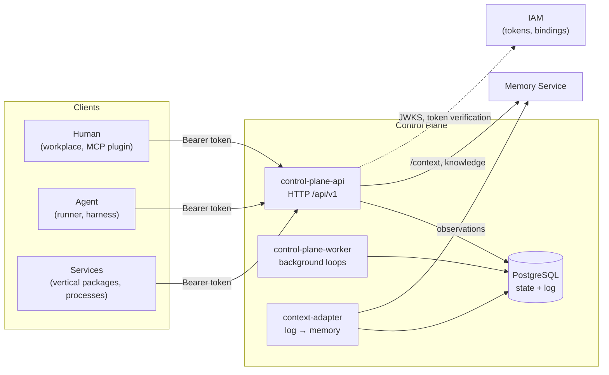
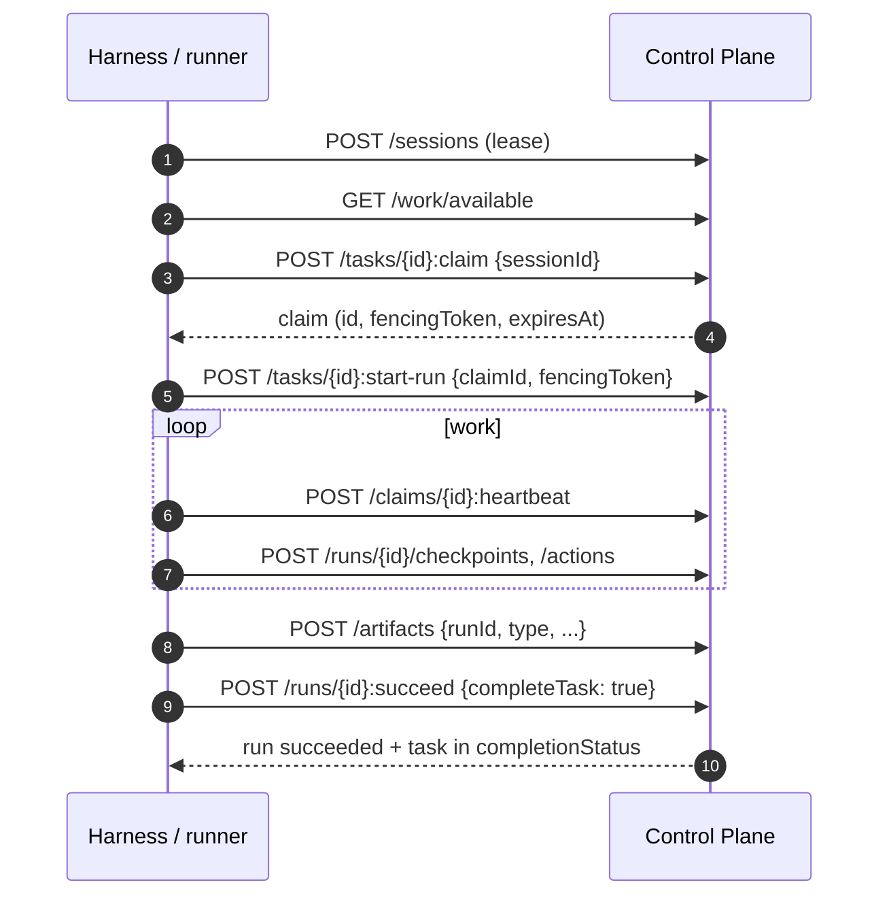

# Control Plane

Control Plane is the coordination core of the Taimen platform: it stores the
authoritative state of work (tasks, goals, claims, runs, approvals,
artifacts) and the event log that people, agents, and services use to
stay in sync with each other. This section is for architects, integration
developers, and operators who need to understand how the core is built and how
to work with it through the HTTP API.

!!! note "What Control Plane does not do"
    The core **does not execute** LLM or agent logic. It answers the questions
    "what needs to be done", "who owns it right now", "what happened", and "is
    this allowed". Execution is the job of harnesses and runners
    (see [Agents and runner](../runner/index.md)).

## Place in the platform



The key principle: **continuity of work lives not in the conversation with a model but in the
bundle** `principal + workspace + task + run + checkpoints + artifacts + events`.
An agent can crash, be replaced, or hand the work over to a human — everything needed
to continue stays in the core.

## Core entities

| Entity | What it is | Article |
|---|---|---|
| Tenant | An isolated data space; everything else belongs to exactly one tenant | [Work model](work-model.md) |
| Principal | The identity of a participant: `human`, `agent`, or `service`. Humans and agents are equal in the protocol | [Authorization and permissions](authorization.md) |
| Workspace | A node of the hierarchy where work lives; it can be a project, a team, a work stream | [Work model](work-model.md) |
| Project | A project profile bound one-to-one to a workspace | [Work model](work-model.md) |
| Task (work item) | A unit of work with a type, status, fields, dates, relations | [Work model](work-model.md) |
| Task type | A versioned registry: field schema, lifecycle, approval outcomes | [Task types and statuses](task-types.md) |
| Goal | A desired state that the work serves | [Goals, acceptance, and evidence](goals-and-evidence.md) |
| Session | A live client connection (lease + heartbeat) | [Execution](execution.md) |
| Claim | Exclusive leased ownership of a task with a fencing token | [Execution](execution.md) |
| Run | One attempt to execute a task under a claim | [Execution](execution.md) |
| Approval | A decision by a human or an agent; a gate blocks the task until the decision | [Approvals](approvals.md) |
| Artifact | An append-only reference to a work result | [Artifacts and comments](artifacts.md) |
| Comment | A message in a task thread with edit history | [Artifacts and comments](artifacts.md) |
| Event | An append-only log record, the basis for audit and synchronization | [Events](events.md) |

Remember the difference between the execution entities right away:

```text
Principal = identity             (who)
Session   = live context         (live connection, lease + heartbeat)
Claim     = exclusive ownership  (leased ownership of a task, fencing token)
Run       = execution attempt    (a specific attempt; result, artifacts)
```

## Processes

A single `control-plane` image runs as three processes. In the superproject's `deploy/local/compose.yml` they belong to the `core` profile.

| Compose service | Command | Purpose |
|---|---|---|
| `control-plane-api` | `alembic upgrade head && uvicorn control_plane.main:app --port 8000` | HTTP API `/api/v1`, event log WebSocket, `/health/*`, `/metrics`, `/openapi.json`, `/docs`. Applies migrations on startup |
| `control-plane-worker` | `python -m control_plane.worker` | Background loops: outbox delivery, execution of approval outcomes, sweep of expired sessions/claims, return of expired skill invocation leases, cleanup of idempotency keys |
| `context-adapter` | `python -m control_plane.worker.context_adapter` | Moves the event log into Memory Service as observations: per-tenant cursor, at-least-once, parking of "poison" batches |
| `control-plane-db` | `postgres:16-alpine` | The single source of truth: state, log, outbox, idempotency |

### control-plane-api

A route handler does exactly four things: it validates the HTTP contract,
obtains the authentication context from credentials, calls a command or query
of the application layer, and turns the result into an HTTP response. There are no
business rules in handlers; commands re-check permissions themselves.

Every mutating command runs **in a single PostgreSQL transaction**:
state changes in the tables, an event is written to `events`, a delivery record
to `outbox`, and `pg_notify` wakes subscribers only after commit.
A rollback leaves nothing behind — neither state nor event.

### control-plane-worker

The worker loop (interval `CP_WORKER_POLL_INTERVAL_SECONDS`, 1 s by default)
performs subtasks, each in its own transaction:

1. **outbox** — batches with `FOR UPDATE SKIP LOCKED`, bounded retries with
   exponential backoff (`CP_OUTBOX_*`); in the base delivery the delivery target
   is a structured log;
2. **approval outcomes** — execution of the actions declared by the task type
   (see [Approvals](approvals.md));
3. **sweep sessions** and **sweep claims** — moving expired leases to `stale`
   with `session.expired` / `claim.expired` events;
4. **skill invocation leases** — returning expired invocations to the queue;
5. **idempotency GC** — deleting expired keys.

!!! tip "The worker is an optimization, not a correctness requirement"
    Expired claims are also reclaimed by the claim command itself, and expired
    leases are rejected lazily by any command that encounters them. Stopping
    the worker slows convergence but does not break invariants. The exceptions are
    approval outcomes and outbox delivery: without the worker they are not executed.

Several workers can run in parallel: all selects use
`SKIP LOCKED`.

### context-adapter

A separate singleton process (a second instance waits on an advisory lock rather than
consuming again). It reads the log by a durable cursor, turns events
into observations using an explicit field whitelist, and sends them to the tenant's memory;
the cursor advances only after delivery is confirmed. A failure of one tenant
parks only its row. Memory unavailability does not affect the API or the worker —
events simply accumulate. See [Task context and memory](context.md) for details.

## How a call works

All endpoints are under `/api/v1`, JSON fields are `camelCase`. The full schema
is available at `GET /openapi.json`, the interactive one at `/docs`.

```bash
export CP=https://platform.example.com/api/v1
export TOKEN=<access-token>   # see IAM: tokens, audiences, scopes

curl -s "$CP/tasks?limit=5" -H "Authorization: Bearer $TOKEN"
```

General protocol rules that all articles of this section rely on:

| Mechanism | How it works |
|---|---|
| Authentication | `Authorization: Bearer <token>`; the actor is always taken from the credential, `actorId` in the body is not accepted |
| Optimistic concurrency | `GET` returns `ETag: "<entity>-<version>"`; `PATCH` and a number of actions require `If-Match`. Missing header — `428 if_match_required`, mismatch — `409 version_conflict`, garbage — `400 invalid_if_match` |
| Idempotency | The `Idempotency-Key` header on creating and action requests: a retry returns the stored response with `Idempotency-Replayed: true`; the same key with a different body — `409 idempotency_key_reused` |
| Pagination | `?limit=` (50 by default, maximum 200, otherwise `422 invalid_limit`) and `?cursor=`; response `{"items": [...], "nextCursor": ...}` |
| Strict query parameters | An unknown parameter — `400 invalid_request` with `details.errors[].loc = "query.<name>"`; a filter is never silently ignored |
| Correlation | `X-Request-ID` (echoed in the response and errors), `X-Correlation-ID` (goes into events), `X-Run-Id` (trace correlation, not the domain Run) |

The error format is uniform:

```json
{
  "error": {
    "code": "task_already_claimed",
    "message": "Task already has an active claim",
    "details": {"taskId": "…", "claimId": "…", "expiresAt": "…"},
    "requestId": "req_…"
  }
}
```

A client should rely on `error.code`, not on the `message` text. The full
list of codes is in the [Error reference](../reference/errors.md).

## Typical work cycle



Each step is covered in detail in [Execution](execution.md); a step-by-step
example for a first look is in [First task](../getting-started/first-task.md).

## Invariants enforced by the database

Correctness does not depend on the carefulness of the client or the code: the key rules
are enforced in PostgreSQL.

| Mechanism | What it protects |
|---|---|
| `SELECT … FOR UPDATE` on the task row | The claim / update / complete critical section |
| Partial unique index on `task_claims(task_id) WHERE status='active'` | At most one active claim per task |
| Partial unique index on `runs(task_id) WHERE status='running'` | At most one running run per task |
| `tasks.version` + `If-Match` | Lost updates |
| `tasks.claim_epoch` = fencing token | Writes by a "woken up" former owner |
| Immutability triggers | Versions of task types and templates, the append-only log, comment edit history |
| Advisory lock per tenant + recursive CTE | Acyclicity of the workspace tree and the dependency graph |

The global lock order is **session → task → claim → run**; it
rules out deadlocks between commands.

## See also

- [Work model](work-model.md) — tenant, workspace, project, task.
- [Execution — claims and runs](execution.md) — the ownership and attempt protocol.
- [Harness protocol](harness-protocol.md) — how clients connect to the core.
- [API](api.md) and [Configuration](configuration.md) — reference information.
- [Authorization and permissions](authorization.md) — permissions, eligibility, PDP.
- [Platform architecture](../overview/architecture.md).
