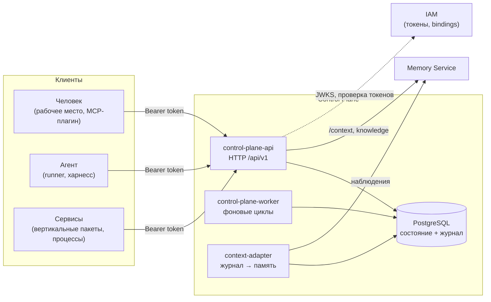
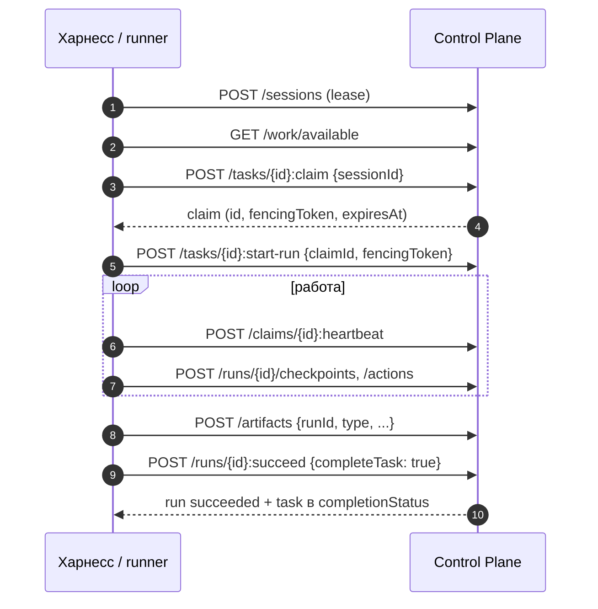

# Control Plane

Control Plane — координационное ядро платформы Taimen: он хранит
авторитетное состояние работы (задачи, цели, claims, runs, approvals,
артефакты) и журнал событий, по которому люди, агенты и сервисы
синхронизируются между собой. Раздел адресован архитекторам, разработчикам
интеграций и операторам, которым нужно понимать, как ядро устроено и как
с ним работать через HTTP API.

!!! note "Чего Control Plane не делает"
    Ядро **не исполняет** LLM- или агентную логику. Оно отвечает на вопросы
    «что нужно сделать», «кто сейчас этим владеет», «что произошло» и «можно
    ли это делать». Исполнение — задача харнессов и runner'ов
    (см. [Агенты и runner](../runner/index.md)).

## Место в платформе



Ключевой принцип: **непрерывность работы живёт не в разговоре с моделью, а в
связке** `principal + workspace + task + run + checkpoints + artifacts + events`.
Агент может упасть, смениться или передать работу человеку — всё, что нужно
для продолжения, остаётся в ядре.

## Основные сущности

| Сущность | Что это | Статья |
|---|---|---|
| Tenant | Изолированное пространство данных; всё остальное принадлежит ровно одному tenant'у | [Модель работы](work-model.md) |
| Principal | Identity участника: `human`, `agent` или `service`. Человек и агент равноправны в протоколе | [Авторизация и права](authorization.md) |
| Workspace | Узел иерархии, в которой живёт работа; бывает проектом, командой, потоком работ | [Модель работы](work-model.md) |
| Project | Профиль проекта, привязанный к workspace один-к-одному | [Модель работы](work-model.md) |
| Task (work item) | Единица работы с типом, статусом, полями, датами, связями | [Модель работы](work-model.md) |
| Task type | Версионируемый реестр: схема полей, lifecycle, исходы approval | [Типы задач и статусы](task-types.md) |
| Goal | Желаемое состояние, которому служит работа | [Цели, приёмка и evidence](goals-and-evidence.md) |
| Session | Живое подключение клиента (lease + heartbeat) | [Исполнение](execution.md) |
| Claim | Эксклюзивное арендованное владение задачей с fencing token | [Исполнение](execution.md) |
| Run | Одна попытка исполнения задачи под claim | [Исполнение](execution.md) |
| Approval | Решение человека или агента; gate блокирует задачу до решения | [Approvals](approvals.md) |
| Artifact | Append-only ссылка на результат работы | [Артефакты и комментарии](artifacts.md) |
| Comment | Реплика в треде задачи с историей правок | [Артефакты и комментарии](artifacts.md) |
| Event | Запись append-only журнала, основа аудита и синхронизации | [События](events.md) |

Различие сущностей исполнения стоит запомнить сразу:

```text
Principal = identity             (кто)
Session   = live-контекст        (живое подключение, lease + heartbeat)
Claim     = exclusive ownership  (арендованное владение задачей, fencing token)
Run       = execution attempt    (конкретная попытка; результат, артефакты)
```

## Процессы

Один образ `control-plane` запускается тремя процессами. В `deploy/local/compose.yml` суперпроекта они входят в профиль `core`.

| Сервис compose | Команда | Назначение |
|---|---|---|
| `control-plane-api` | `alembic upgrade head && uvicorn control_plane.main:app --port 8000` | HTTP API `/api/v1`, WebSocket журнала, `/health/*`, `/metrics`, `/openapi.json`, `/docs`. Применяет миграции при старте |
| `control-plane-worker` | `python -m control_plane.worker` | Фоновые циклы: доставка outbox, исполнение исходов approval, sweep истёкших sessions/claims, возврат просроченных lease вызовов skill, очистка ключей идемпотентности |
| `context-adapter` | `python -m control_plane.worker.context_adapter` | Переносит журнал событий в Memory Service как наблюдения: per-tenant курсор, at-least-once, парковка «ядовитых» пакетов |
| `control-plane-db` | `postgres:16-alpine` | Единственный источник истины: состояние, журнал, outbox, idempotency |

### control-plane-api

Обработчик маршрута делает ровно четыре вещи: валидирует HTTP-контракт,
получает контекст аутентификации из credentials, вызывает команду или запрос
прикладного слоя и превращает результат в HTTP-ответ. Бизнес-правил в
обработчиках нет; команды повторно проверяют права сами.

Каждая мутирующая команда выполняется **в одной транзакции** PostgreSQL:
состояние меняется в таблицах, в `events` пишется событие, в `outbox` —
запись для доставки, `pg_notify` будит подписчиков только после commit.
Откат не оставляет ничего — ни состояния, ни события.

### control-plane-worker

Цикл воркера (интервал `CP_WORKER_POLL_INTERVAL_SECONDS`, по умолчанию 1 с)
выполняет подзадачи, каждую в своей транзакции:

1. **outbox** — батчи по `FOR UPDATE SKIP LOCKED`, ограниченные повторы с
   экспоненциальным backoff (`CP_OUTBOX_*`); в базовой поставке целевая точка
   доставки — структурированный лог;
2. **исходы approval** — исполнение действий, объявленных типом задачи
   (см. [Approvals](approvals.md));
3. **sweep sessions** и **sweep claims** — перевод истёкших аренд в `stale`
   с событиями `session.expired` / `claim.expired`;
4. **lease вызовов skill** — возврат просроченных вызовов в очередь;
5. **GC идемпотентности** — удаление истёкших ключей.

!!! tip "Воркер — оптимизация, а не условие корректности"
    Истёкшие claims реквизируются и самой командой захвата, а просроченные
    аренды отклоняются лениво любой командой, которая их встретила. Остановка
    воркера замедляет сходимость, но не ломает инварианты. Исключения —
    исходы approval и доставка outbox: без воркера они не исполняются.

Несколько воркеров могут работать параллельно: все выборки идут с
`SKIP LOCKED`.

### context-adapter

Отдельный процесс-одиночка (второй экземпляр ждёт advisory lock, а не
потребляет повторно). Читает журнал по надёжному курсору, переводит события
в наблюдения по явному whitelist полей и отправляет их в память tenant'а;
курсор двигается только после подтверждения доставки. Сбой одного tenant'а
паркует только его строку. Недоступность памяти не влияет на API и воркер —
события просто накапливаются. Подробнее — в [Контекст задачи и память](context.md).

## Как устроен вызов

Все endpoint'ы — под `/api/v1`, поля в JSON — `camelCase`. Полная схема
доступна по `GET /openapi.json`, интерактивная — `/docs`.

```bash
export CP=https://platform.example.com/api/v1
export TOKEN=<access-token>   # см. IAM: токены, audiences, scopes

curl -s "$CP/tasks?limit=5" -H "Authorization: Bearer $TOKEN"
```

Общие правила протокола, на которые опираются все статьи раздела:

| Механизм | Как работает |
|---|---|
| Аутентификация | `Authorization: Bearer <token>`; actor всегда берётся из credential, `actorId` в теле не принимается |
| Оптимистическая конкурентность | `GET` отдаёт `ETag: "<entity>-<version>"`; `PATCH` и ряд action требуют `If-Match`. Нет заголовка — `428 if_match_required`, несовпадение — `409 version_conflict`, мусор — `400 invalid_if_match` |
| Идемпотентность | Заголовок `Idempotency-Key` на создающих и action-запросах: повтор возвращает сохранённый ответ с `Idempotency-Replayed: true`; тот же ключ с другим телом — `409 idempotency_key_reused` |
| Пагинация | `?limit=` (по умолчанию 50, максимум 200, иначе `422 invalid_limit`) и `?cursor=`; ответ `{"items": [...], "nextCursor": ...}` |
| Строгие query-параметры | Неизвестный параметр — `400 invalid_request` с `details.errors[].loc = "query.<имя>"`; фильтр никогда не игнорируется молча |
| Корреляция | `X-Request-ID` (echo в ответе и ошибках), `X-Correlation-ID` (попадает в события), `X-Run-Id` (trace-корреляция, не доменный Run) |

Формат ошибки единый:

```json
{
  "error": {
    "code": "task_already_claimed",
    "message": "Task already has an active claim",
    "details": {"taskId": "…", "claimId": "…", "expiresAt": "…"},
    "requestId": "req_…"
  }
}
```

Клиенту следует опираться на `error.code`, а не на текст `message`. Полный
перечень кодов — в [Справочнике ошибок](../reference/errors.md).

## Типичный цикл работы



Подробный разбор каждого шага — в [Исполнении](execution.md); пошаговый
пример для первого знакомства — в [Первой задаче](../getting-started/first-task.md).

## Инварианты, которые держит база

Корректность не зависит от аккуратности клиента или кода: ключевые правила
закреплены в PostgreSQL.

| Механизм | Что защищает |
|---|---|
| `SELECT … FOR UPDATE` строки задачи | Критическая секция claim / update / complete |
| Частичный уникальный индекс на `task_claims(task_id) WHERE status='active'` | Не больше одного активного claim на задачу |
| Частичный уникальный индекс на `runs(task_id) WHERE status='running'` | Не больше одного запущенного run на задачу |
| `tasks.version` + `If-Match` | Потерянные обновления |
| `tasks.claim_epoch` = fencing token | Запись «проснувшегося» старого владельца |
| Триггеры неизменяемости | Версии типов задач и шаблонов, append-only журнал, история правок комментариев |
| Advisory lock на tenant + рекурсивный CTE | Ацикличность дерева workspaces и графа зависимостей |

Глобальный порядок блокировок — **session → task → claim → run**; он
исключает взаимные блокировки между командами.

## См. также

- [Модель работы](work-model.md) — tenant, workspace, проект, задача.
- [Исполнение — claims и runs](execution.md) — протокол владения и попыток.
- [Харнесс-протокол](harness-protocol.md) — как клиенты подключаются к ядру.
- [API](api.md) и [Конфигурация](configuration.md) — справочные сведения.
- [Авторизация и права](authorization.md) — permissions, eligibility, PDP.
- [Архитектура платформы](../overview/architecture.md).
