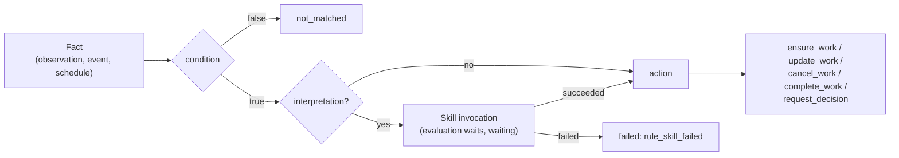

# Work rules

A work rule (`WorkRule`) is tenant data by which Control Plane
itself creates, updates, completes, or cancels work when a fact
appears in the log: an observation of an external system, a core event, or a schedule slot.
This article describes the rule document, its language, actions, the rule identity, and
the evaluation history. It is for tenant administrators and package authors.
Rationale: CP-ADR-0063 and TAI-ADR-0036; the rule identity, per-item task type, and
relations: TAI-ADR-0053.

## How a rule works



- The core worker reads the log with its own per-tenant cursor. A rule sees only
  events written after it was enabled, and does not react to consequences of rules
  (events of the `rule` entity, events with a rule's correlation, skill invocations
  enqueued by a rule).
- Each evaluation is a record in the rule's history with the rule version, the fact,
  the result (`matched`, `not_matched`, `failed`, `skipped`), evidence, and
  the work created.
- Redelivery of a fact does not duplicate work: the deduplication key links
  the work to the rule, and the uniqueness of an evaluation per `(rule, fact)` makes a repeat
  a no-op.

## Rule document

```json
{
  "key": "doc-review",
  "description": "A lawyer reviews every uploaded contract",
  "workspaceId": "<workspace-id>",
  "trigger": {"kind": "observation", "type": "document.uploaded"},
  "condition": {"eq": [{"var": "payload.data.kind"}, "contract"]},
  "interpretation": {"skill": "contract.extract@1",
                     "inputs": {"document": "{{payload.data.documentId}}"}},
  "action": {"kind": "ensure_work", "taskType": "contract-review",
             "dedupKeyTemplate": "contract:{{payload.data.documentId}}",
             "fields": {"title": "Review contract {{skill.output.number}}",
                        "assignee": "agent:contract-checker"}},
  "identity": {"agent": "contract-rules"},
  "status": "enabled"
}
```

| Field | Rule |
|---|---|
| `key` | `^[a-z0-9][a-z0-9._-]{0,127}$`, unique among the tenant's non-archived rules (`409 rule_key_taken`) |
| `workspaceId` | The rule's workspace or `null` — a tenant-level rule. Does not change after creation |
| `goalId` | The goal the created work serves |
| `trigger` | What wakes the rule (below) |
| `condition` | An expression over the fact; `true` by default |
| `interpretation` | `{skill: "name@version", inputs}` — a skill that turns the fact into data for the action |
| `action` | What to do (below) |
| `identity` | `{agent: <key>}` — on whose behalf the rule acts (see [Rule identity](#identity)) |
| `status` | `enabled`, `disabled`; `DELETE` archives |

A rule is mutable: `PATCH` with `If-Match: "rule-<version>"` changes
`description`, `trigger`, `condition`, `interpretation`, `action`, `goalId`, and
`identity`; `version` increments with each change to what the rule does.
Each evaluation records the version it was computed with.

On write, everything that can be checked without facts is checked: grammar, task
types (`422 unknown_task_type`), skills (`422 unknown_skill`), the absence of
skills with external writes in the interpretation (`422 rule_skill_side_effects`),
secrets in documents (`422 secret_material_rejected`), and the agent's identity and
permissions.

## Triggers

| `trigger.kind` | Fields | When it fires |
|---|---|---|
| `observation` | `type` — the observation kind, `source?` | An `observation.recorded` event of this kind (see [Events](events.md)) |
| `event` | `type` — the log event type | A log event of this type. `rule.*`, `work.*`, `skill.invocation_*` are forbidden (`422 invalid_rule_trigger`); observations only through `observation` |
| `schedule` | `type: interval`, `everySeconds` 60…604800 | Once per interval; slots missed during downtime are not caught up. A work-creating scheduled rule must have `interpretation` |

The `event` trigger lets you build chains on core events: for example, a rule
on `task.completed` with the condition `{eq: [{var: task.typeKey}, feature-tasks]}`
reacts only to the completion of a step of a particular type.

An event whose payload contains `workspaceId` reaches only the rules of that
workspace and tenant-level rules; an event without a workspace reaches all rules of the
tenant.

## Condition and template language { #language }

An **expression** is `true`, `false`, or an object with one operator: `and` / `or`
(1…50 operands), `not`, `eq`, `ne`, `lt`, `le`, `gt`, `ge`, `in`, `exists`.
An operand is `{"var": "<path>"}`, `{"const": <JSON>}`, a scalar, or a list. A path is
`root(.segment)*`. No calls, no arithmetic, no regular expressions;
depth up to 16, up to 256 nodes, document up to 16 KiB. An invalid condition is
`422 invalid_rule_condition` on write. Comparing incomparable values (a string with
a number) is an evaluation error `rule_condition_error`, not a silent false.

A **template** is a string with `{{ path }}`. A string consisting entirely of one
placeholder yields the raw value (a list stays a list); otherwise values
are substituted as text.

| Root | Stage | What it is |
|---|---|---|
| `trigger` | condition, inputs, action | Kind, type, reference to the event, time |
| `payload` | condition, inputs, action | The body of the log event |
| `goal` | condition, inputs, action | The rule's goal: `id`, `title`, `status`, `workspaceId` |
| `task` | condition, inputs, action | The task the event references (a `task` entity or `payload.taskId`) |
| `skill` | action | The interpretation result: `status`, `output`, `invocationId`, `artifactId` |
| `item` | action | A `forEach` element |

The task representation in the `task` root is the same as in the task API, including **`typeKey`**
and **`typeVersion`** — the key and version of the task type, and `verification` — a summary
of the last verification attempt `{status, attempt}` or `null`.

## Actions

| `action.kind` | What it does |
|---|---|
| `ensure_work` | If an open task with the key exists, it is that task; if not, creates a task with `origin = {kind: rule, ruleId, ref, evidence}` |
| `request_decision` | The same, plus a gate approval on the task (`fields.approver` or `fields.approverRole`); the decision executes the outcomes of the type's `approvalSchema`. Until the decision, the task cannot be claimed or completed (`409 approval_required`) |
| `update_work` | Changes `title`, `description`, `priority` of the open task with the key and appends evidence; under a live claim — `skipped: task_claimed` |
| `cancel_work` | Moves the open task to the first reachable status of the `terminal_cancelled` category |
| `complete_work` | Appends evidence and completes the task **through the verification stage** (see [Closing work with rules](goals-and-evidence.md#verification-stage)) |

Common fields:

- `forEach` — a path to a list (no more than 50 elements), `where` — a condition over
  `item`: the action is applied to each selected element;
- `dedupKeyTemplate` — the work key, up to 200 characters. The key is **shared across the
  tenant**: a second rule (`cancel_work`, `complete_work`) reconciles work
  created by the first;
- `fields` of `ensure_work` and `request_decision`: `title`, `description`,
  `priority`, `assignee`, `customFields` (name → template, up to 32 fields; an empty
  value is omitted), `relations` (below); `acceptance` — criteria of the
  task being created (added to the criteria of its type).

An open task found by key does not get `customFields`,
`acceptance`, or relations: the action is "ensure", not upsert.

### Per-item task type: `taskTypes`

A single action can create tasks of different types. For this, `taskType` is a
template (for example `{{item.type}}`), and next to it `taskTypes` is declared — a list
of allowed keys (1…20, no duplicates):

```yaml
action:
  kind: ensure_work
  forEach: skill.output.items
  taskType: "{{item.type}}"
  taskTypes: [coding-task, feature-converge]
  dedupKeyTemplate: "{{item.dedupKey}}"
```

- On write, each key in `taskTypes` must have an active version (`422
  unknown_task_type`, `details.field = action.taskTypes[i]`). A literal
  `taskType` next to `taskTypes` must be in the list, and a templated
  `taskType` without `taskTypes` is rejected (`422 invalid_rule_action`): the core will not
  create a task of a type named by the fact itself.
- On execution, a rendered type outside `taskTypes` is an element refusal
  `task_type_not_allowed`.
- `request_decision` accepts only a literal `taskType`.

### Relations: `fields.relations`

```yaml
fields:
  relations:
    spawnedBy: "{{task.id}}"
    dependsOn: "{{item.dependsOn}}"
```

- **`spawnedBy`** — a template yielding the id or `publicId` of a task. The new task
  gets a `spawned_by` relation to it. The task must be visible to the rule's
  authority, otherwise an element refusal `relation_target_not_found`.
- **`dependsOn`** — a template or a list (up to 50) of templates of **deduplication
  keys**. The new task gets `depends_on` on the task of each key
  and is not handed out to executors until that task is done. A template of a single
  placeholder can yield a list of keys — this way a skill element carries its own
  dependencies. `null`, `""`, and an empty list mean "no dependencies".

A `dependsOn` key is resolved first among the elements of **the same evaluation** (including
those that come later in `forEach`), then through the log of the tenant's rule work —
by the newest task with this key; a closed one also qualifies. Relations are written after
all tasks of the evaluation are created, by the regular relation command with its
`task.relation_added` events. That is why a repeated evaluation of the same fact duplicates neither
tasks nor relations.

### Assignment: a principal, an agent, or a role { #assignee }

`fields.assignee` of `ensure_work` and `request_decision` accepts a principal
UUID, a reference **`agent:<key>`** to an agent in the core registry, or a role
**`role:<slug>`**. The reference is resolved after the template is rendered;
an unknown, retired, or not yet identity-bound agent is an action error
`unknown_agent`, and the action is rolled back entirely.

The form **`role:<slug>`** assigns the work to a role: the task is created
without an assignee, with the role as a requirement, and any holder of the
role in the work's workspace or above can take it. If there is no role with
that slug there, it is an action error `unknown_role` (`action.fields.assignee:
no role '…' in the workspace of the work or above it`), and the action is
rolled back entirely; an empty slug is `invalid_rule_field`.

### Refusal of a single element

Normally a refusal of any command rolls back everything the action wrote, and the evaluation
becomes `failed` with the command's code. For refusals related to the per-item type
and relations, a different rule applies: the refusal affects **a single
element** of `forEach`, and the other elements proceed.

| Code | Reason |
|---|---|
| `task_type_not_allowed` | The rendered type is not in `taskTypes` |
| `invalid_relations` | `dependsOn` is not a string or has more than 50 keys |
| `relation_target_not_found` | The `spawnedBy` task was not found or is not visible to the rule |
| `dependency_not_found` | The `dependsOn` key is in neither the evaluation nor the log (or its task is not visible) |
| `dependency_refused` | The element depends on a refused element of the same evaluation |
| `dependency_cycle` | A dependency cycle among the evaluation's elements — all elements of the cycle are refused |

A refused element goes into the evaluation's `work[]` as `{dedupKey, refused:
<code>, detail}`. The evaluation is `matched` if at least one element was created or
found, and `failed` with the code `work_items_refused` if all were refused
(`details.refused` is a list of codes).

## Rule identity { #identity }

By default a rule acts **with the authority of whoever enabled it** (or
last changed it while enabled): a snapshot of their credential. The
**`identity: {agent: <key>}`** field switches the rule to the authority of the described
agent — usually of kind `service` with no placement (`placement: none`). This way the work
of rules in the log is distinguishable from the work of people, and the rule's permissions equal the permissions
declared in the agent description, not the permissions of the person who applied the package.

```yaml
# Agent — identity of the package's rules (no process)
apiVersion: taimen.ai/v1
kind: Agent
key: contract-rules
spec:
  displayName: Contract rules
  identity:
    kind: service
    permissions: [events.read, skills.invoke, tasks.read, tasks.write]
    iam:
      audiences: [control-plane]
      scopeCeiling: [control-plane:read, control-plane:write]
  placement: none
---
# WorkRule — acts on behalf of this agent
apiVersion: taimen.ai/v1
kind: WorkRule
key: doc-review
spec:
  identity: {agent: contract-rules}
  # …
```

### Checks on write

On `POST` and on any `PATCH` after which the rule has an identity:

- an agent with this key exists and is not retired — otherwise `422
  unknown_agent`, `details: {field: identity.agent, agent}`;
- **every permission** from `identity.permissions` of the agent's current revision is held by
  the writer (an administrator is the exception), otherwise `403 permission_escalation` with
  `details.missing`. This is the same check as for an agent revision: a holder of
  `rules.write` does not get another agent's permissions through a rule, and someone without the agent's
  permissions cannot edit the action of such a rule;
- whether the agent is bound to an identity is not checked on write: a package applies
  the agent description and the rule in one installation, and the identity is created later.

Changing the identity (including `identity: null`, which removes it) is a new
`version` of the rule; the `changes` field of the `rule.updated` event names `identity`.

### Evaluation and authorship

- The evaluation and all actions of a rule with an identity run with the authority of the agent's
  principal. The authority is rebuilt on every evaluation from its current
  IAM binding, so a new agent revision with different permissions changes the rule's
  permissions from the next evaluation.
- Each action goes through the regular command checks with the authority of this
  identity: a rule cannot do more than is declared for the agent.
- An agent without a principal, retired, or without an active binding — the
  evaluation is `failed: credential_inactive` (`details.agent`).
- **The author of the work** is the agent's principal: `createdBy` of created tasks, `actorId`
  of `work.derived`, `work.reconciled`, `task.created` events, decision requests,
  and the `skill_result` artifact.
- `RuleOut.authorityPrincipalId` still names whoever enabled the
  rule: it answers the question "who enabled it", not "on whose behalf it
  acts".

Which permissions the identity needs depends on the rule's actions: `events.read` —
reading the fact; `tasks.read`, `tasks.write` — finding and creating work, relations;
`skills.invoke` — interpretation; `approvals.manage` — `request_decision`;
`claims.manage` — `complete_work` / `cancel_work` of work under a live claim;
`goals.read` — a rule with a goal.

## History and audit

```bash
curl -s "https://platform.example.com/api/v1/rules/<rule-id>/evaluations?status=failed" \
  -H "Authorization: Bearer $TOKEN"
```

- `rule.created`, `rule.updated` (`changes` — field names, `version`),
  `rule.enabled`, `rule.disabled`, `rule.archived`;
- `rule.evaluated` for each finished evaluation: version, fact, result,
  evidence, skill invocation, work (including `refused`), error code;
- `work.derived` — work created by a rule, `work.reconciled` — work changed,
  completed, or cancelled.

## API

| Method | Path | Permission |
|---|---|---|
| `POST` | `/rules` | `rules.write` |
| `GET` | `/rules?status=&workspaceId=&key=&triggerKind=` | `rules.read` |
| `GET` | `/rules/{id}` | `rules.read` |
| `PATCH` | `/rules/{id}` (`If-Match: "rule-<v>"`) | `rules.write` |
| `DELETE` | `/rules/{id}` — archive | `rules.write` |
| `POST` | `/rules/{id}:enable`, `/rules/{id}:disable` | `rules.write` |
| `GET` | `/rules/{id}/evaluations?status=` | `rules.read` |

Permissions are resolved on the rule's workspace (a tenant-level rule — on the tenant).
SDK: `create_rule(identity=…)`, `update_rule(identity=…)`, `list_rules`,
`get_rule`, `enable_rule`, `disable_rule`, `archive_rule`,
`list_rule_evaluations`. The MCP server provides read-only access (`cp_list_rules`,
`cp_get_rule`). In packages, a rule is the `WorkRule` kind (see [Catalog
packages](catalog-packages.md)).

Worker settings (core environment variables):

| Variable | Default | Meaning |
|---|---|---|
| `CP_RULES_BATCH_SIZE` | `200` | Log events in one evaluation batch of a tenant |
| `CP_RULES_MAX_ATTEMPTS` | `3` | Consecutive failed batches after which a broken evaluation is recorded as `failed` and the batch moves on |
| `CP_RULES_SKILL_CHECK_SECONDS` | `15` | How often to revisit evaluations waiting for a skill or for a claim to be released |
| `CP_RULES_SKILL_WAIT_SECONDS` | `86400` | How long to wait for someone to pick up a skill invocation |
| `CP_RULES_CLAIM_WAIT_SECONDS` | `86400` | How long `complete_work` / `cancel_work` wait for a claim to be released |

## Common problems

| Symptom | Cause | What to do |
|---|---|---|
| `422 unknown_agent` when writing a rule | There is no agent description `identity.agent` or it is retired | Apply the `Agent` description before the rule (the package installer does exactly that) |
| `403 permission_escalation`, `details.missing` | The writer lacks the permissions declared for the identity agent | Apply with a token that has these permissions or narrow the agent's permissions |
| Evaluations `failed: credential_inactive`, `details.agent` | The agent's identity has not been created yet or is retired | Create the agent's identity (for `service` — the installation bootstrap) |
| `422 invalid_rule_action` on `taskType` | A templated `taskType` without `taskTypes` or a literal outside the list | Declare `taskTypes` |
| Evaluation `failed: work_items_refused` | All elements were refused: `details.refused` names the codes | Look at the evaluation's `work[].refused`; most often — wrong `dependsOn` keys |
| Evaluation `failed: unknown_agent` | `fields.assignee` rendered to an unknown or unbound agent | Check the agent key and its actual state |
| Evaluation `failed: unknown_role` | `fields.assignee: role:<slug>` names a role that does not exist in the work's workspace or above | Create the role (in a package, a `Role`) or fix the slug |
| The rule does not react to old events | A rule sees only events after it was enabled | Expected |

## See also

- [Goals, acceptance, and evidence](goals-and-evidence.md) — origin `rule`, `complete_work`.
- [Declarative agents](../runner/declarative-agents.md) — the rule identity and `agent:<key>`.
- [Catalog packages](catalog-packages.md) — the `WorkRule` kind.
- [Events](events.md)
- [Approvals](approvals.md) — `request_decision` outcomes.
