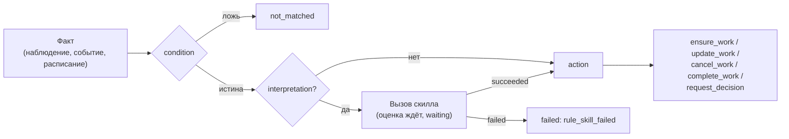

# Правила вывода работы

Правило вывода работы (`WorkRule`) — данные tenant'а, по которым Control Plane
сам заводит, обновляет, закрывает или отменяет работу, когда в журнале
появляется факт: наблюдение внешней системы, событие ядра или слот расписания.
Статья описывает документ правила, его язык, действия, личность правила и
историю оценок. Она для администраторов tenant'а и авторов пакетов.
Обоснование — CP-ADR-0063 и TAI-ADR-0036; личность правила, тип задачи на
элемент и связи — TAI-ADR-0053.

## Как работает правило



- Журнал читает worker ядра своим курсором по tenant'у. Правило видит только
  события, записанные после его включения, и не реагирует на следствия правил
  (события сущности `rule`, события с корреляцией правила, вызовы скиллов,
  поставленные правилом).
- Каждая оценка — запись в истории правила с версией правила, фактом,
  результатом (`matched`, `not_matched`, `failed`, `skipped`), evidence и
  заведённой работой.
- Повторная доставка факта не дублирует работу: ключ дедупликации связывает
  работу с правилом, а уникальность оценки по `(правило, факт)` делает повтор
  пустым.

## Документ правила

```json
{
  "key": "doc-review",
  "description": "Каждый загруженный договор проверяет юрист",
  "workspaceId": "<workspace-id>",
  "trigger": {"kind": "observation", "type": "document.uploaded"},
  "condition": {"eq": [{"var": "payload.data.kind"}, "contract"]},
  "interpretation": {"skill": "contract.extract@1",
                     "inputs": {"document": "{{payload.data.documentId}}"}},
  "action": {"kind": "ensure_work", "taskType": "contract-review",
             "dedupKeyTemplate": "contract:{{payload.data.documentId}}",
             "fields": {"title": "Проверить договор {{skill.output.number}}",
                        "assignee": "agent:contract-checker"}},
  "identity": {"agent": "contract-rules"},
  "status": "enabled"
}
```

| Поле | Правило |
|---|---|
| `key` | `^[a-z0-9][a-z0-9._-]{0,127}$`, уникален среди неархивных правил tenant'а (`409 rule_key_taken`) |
| `workspaceId` | Workspace правила или `null` — правило уровня tenant'а. После создания не меняется |
| `goalId` | Цель, которой служит заведённая работа |
| `trigger` | Что будит правило (ниже) |
| `condition` | Выражение над фактом; по умолчанию `true` |
| `interpretation` | `{skill: "name@version", inputs}` — скилл, который превращает факт в данные для действия |
| `action` | Что сделать (ниже) |
| `identity` | `{agent: <key>}` — от чьего имени действует правило (см. [Личность правила](#identity)) |
| `status` | `enabled`, `disabled`; `DELETE` архивирует |

Правило изменяемо: `PATCH` с `If-Match: "rule-<version>"` меняет
`description`, `trigger`, `condition`, `interpretation`, `action`, `goalId` и
`identity`; `version` растёт с каждым изменением того, что правило делает.
Каждая оценка записывает версию, по которой считалась.

При записи проверяется всё, что можно проверить без фактов: грамматика, типы
задач (`422 unknown_task_type`), скиллы (`422 unknown_skill`), отсутствие
скиллов с внешней записью в интерпретации (`422 rule_skill_side_effects`),
секреты в документах (`422 secret_material_rejected`), личность и права
агента.

## Триггеры

| `trigger.kind` | Поля | Когда срабатывает |
|---|---|---|
| `observation` | `type` — вид наблюдения, `source?` | Событие `observation.recorded` с этим видом (см. [События](events.md)) |
| `event` | `type` — тип события журнала | Событие журнала этого типа. `rule.*`, `work.*`, `skill.invocation_*` запрещены (`422 invalid_rule_trigger`); наблюдения — только через `observation` |
| `schedule` | `type: interval`, `everySeconds` 60…604800 | Раз в интервал; пропущенные за простой слоты не догоняются. Заводящее правило по расписанию обязано иметь `interpretation` |

Триггер `event` позволяет строить цепочки на событиях ядра: например, правило
на `task.completed` с условием `{eq: [{var: task.typeKey}, feature-tasks]}`
реагирует только на завершение шага определённого типа.

Событие, в payload которого есть `workspaceId`, доходит только до правил этого
workspace и правил уровня tenant'а; событие без workspace — до всех правил
tenant'а.

## Язык условий и шаблонов { #language }

**Выражение** — `true`, `false` или объект с одним оператором: `and` / `or`
(1…50 операндов), `not`, `eq`, `ne`, `lt`, `le`, `gt`, `ge`, `in`, `exists`.
Операнд — `{"var": "<путь>"}`, `{"const": <JSON>}`, скаляр или список. Путь —
`корень(.сегмент)*`. Ни вызовов, ни арифметики, ни регулярных выражений;
глубина до 16, узлов до 256, документ до 16 КиБ. Невалидное условие —
`422 invalid_rule_condition` при записи. Сравнение несравнимого (строка с
числом) — ошибка оценки `rule_condition_error`, а не молчаливая ложь.

**Шаблон** — строка с `{{ путь }}`. Строка, целиком состоящая из одного
плейсхолдера, даёт сырое значение (список остаётся списком), иначе значения
подставляются текстом.

| Корень | Стадия | Что это |
|---|---|---|
| `trigger` | условие, входы, действие | Вид, тип, ссылка на событие, время |
| `payload` | условие, входы, действие | Тело события журнала |
| `goal` | условие, входы, действие | Цель правила: `id`, `title`, `status`, `workspaceId` |
| `task` | условие, входы, действие | Задача, на которую ссылается событие (сущность `task` или `payload.taskId`) |
| `skill` | действие | Результат интерпретации: `status`, `output`, `invocationId`, `artifactId` |
| `item` | действие | Элемент `forEach` |

Представление задачи в корне `task` — как в API задачи, включая **`typeKey`**
и **`typeVersion`** — ключ и версию типа задачи, и `verification` — сводку
последней попытки проверки `{status, attempt}` или `null`.

## Действия

| `action.kind` | Что делает |
|---|---|
| `ensure_work` | Открытая задача по ключу есть — это она; нет — заводит задачу с `origin = {kind: rule, ruleId, ref, evidence}` |
| `request_decision` | То же, плюс gate-approval на задачу (`fields.approver` или `fields.approverRole`); решение исполняет исходы `approvalSchema` типа. До решения задачу нельзя взять и завершить (`409 approval_required`) |
| `update_work` | Меняет `title`, `description`, `priority` открытой задачи по ключу и дописывает evidence; под живым claim — `skipped: task_claimed` |
| `cancel_work` | Переводит открытую задачу в первый достижимый статус категории `terminal_cancelled` |
| `complete_work` | Дописывает evidence и завершает задачу **через стадию проверки** (см. [Закрытие работы правилами](goals-and-evidence.md#verification-stage)) |

Общие поля:

- `forEach` — путь к списку (не больше 50 элементов), `where` — условие над
  `item`: действие применяется к каждому отобранному элементу;
- `dedupKeyTemplate` — ключ работы, до 200 символов. Ключ **общий для
  tenant'а**: второе правило (`cancel_work`, `complete_work`) сверяет работу,
  заведённую первым;
- `fields` у `ensure_work` и `request_decision`: `title`, `description`,
  `priority`, `assignee`, `customFields` (имя → шаблон, до 32 полей; пустое
  значение опускается), `relations` (ниже); `acceptance` — критерии
  заводимой задачи (добавляются к критериям её типа).

Найденная по ключу открытая задача не получает `customFields`,
`acceptance` и связей: действие — «ensure», а не upsert.

### Тип задачи на элемент: `taskTypes`

Одно действие может заводить задачи разных типов. Для этого `taskType` —
шаблон (например `{{item.type}}`), а рядом объявлен `taskTypes` — список
допустимых ключей (1…20, без повторов):

```yaml
action:
  kind: ensure_work
  forEach: skill.output.items
  taskType: "{{item.type}}"
  taskTypes: [coding-task, feature-converge]
  dedupKeyTemplate: "{{item.dedupKey}}"
```

- При записи каждый ключ `taskTypes` должен иметь активную версию (`422
  unknown_task_type`, `details.field = action.taskTypes[i]`). Литеральный
  `taskType` рядом с `taskTypes` обязан входить в список, а шаблонный
  `taskType` без `taskTypes` отвергается (`422 invalid_rule_action`): ядро не
  заведёт задачу типа, который назвал сам факт.
- При исполнении отрендеренный тип вне `taskTypes` — отказ элемента
  `task_type_not_allowed`.
- `request_decision` принимает только литеральный `taskType`.

### Связи: `fields.relations`

```yaml
fields:
  relations:
    spawnedBy: "{{task.id}}"
    dependsOn: "{{item.dependsOn}}"
```

- **`spawnedBy`** — шаблон, дающий id или `publicId` задачи. Новая задача
  получает связь `spawned_by` на неё. Задача должна быть видна полномочиям
  правила, иначе отказ элемента `relation_target_not_found`.
- **`dependsOn`** — шаблон или список (до 50) шаблонов **ключей
  дедупликации**. Новая задача получает `depends_on` на задачу каждого ключа
  и не выдаётся исполнителям, пока та не выполнена. Шаблон из одного
  плейсхолдера может дать список ключей — так элемент скилла несёт свои
  зависимости сам. `null`, `""` и пустой список — «зависимостей нет».

Ключ `dependsOn` разрешается сначала среди элементов **той же оценки** (в том
числе идущих в `forEach` позже), затем по журналу работы правил tenant'а —
новейшей задачей с этим ключом, закрытая тоже подходит. Связи пишутся после
заведения всех задач оценки обычной командой связей с её событиями
`task.relation_added`. Поэтому повторная оценка того же факта не дублирует ни
задач, ни связей.

### Назначение: principal, агент или роль { #assignee }

`fields.assignee` у `ensure_work` и `request_decision` принимает UUID
principal'а, ссылку **`agent:<key>`** на агента реестра ядра или роль
**`role:<slug>`**. Ссылка разрешается после рендеринга шаблона; неизвестный,
выведенный или ещё не связанный с личностью агент — ошибка действия
`unknown_agent`, действие откатывается целиком.

Форма **`role:<slug>`** назначает работу роли: задача заводится без
исполнителя с требованием роли, и её берёт любой держатель роли в workspace
работы или выше. Роли с таким slug там нет — ошибка действия `unknown_role`
(`action.fields.assignee: no role '…' in the workspace of the work or above
it`), действие откатывается целиком; пустой slug — `invalid_rule_field`.

### Отказ отдельного элемента

Обычно отказ любой команды откатывает всё, что действие записало, и оценка
становится `failed` с кодом команды. Для отказов, связанных с типом на
элемент и связями, действует другое правило: отказ касается **одного
элемента** `forEach`, остальные элементы идут дальше.

| Код | Причина |
|---|---|
| `task_type_not_allowed` | Отрендеренный тип не входит в `taskTypes` |
| `invalid_relations` | `dependsOn` — не строка или больше 50 ключей |
| `relation_target_not_found` | Задача `spawnedBy` не найдена или не видна правилу |
| `dependency_not_found` | Ключа `dependsOn` нет ни в оценке, ни в журнале (или его задача не видна) |
| `dependency_refused` | Элемент зависит от отказанного элемента той же оценки |
| `dependency_cycle` | Цикл зависимостей среди элементов оценки — отказаны все элементы цикла |

Отказанный элемент попадает в `work[]` оценки как `{dedupKey, refused:
<код>, detail}`. Оценка `matched`, если хотя бы один элемент заведён или
найден, и `failed` с кодом `work_items_refused`, если отказаны все
(`details.refused` — список кодов).

## Личность правила { #identity }

По умолчанию правило действует **полномочиями того, кто его включил** (или
последним изменил включённое): снимок его credential'а. Поле
**`identity: {agent: <key>}`** переводит правило на полномочия описанного
агента — обычно вида `service` без размещения (`placement: none`). Так работа
правил в журнале отличима от работы людей, а права правила равны правам,
объявленным в описании агента, а не правам человека, применившего пакет.

```yaml
# Agent — личность правил пакета (процесса нет)
apiVersion: taimen.ai/v1
kind: Agent
key: contract-rules
spec:
  displayName: Contract rules
  identity:
    kind: service
    permissions: [events.read, skills.invoke, tasks.read, tasks.write]
    iam:
      audiences: [control-plane]
      scopeCeiling: [control-plane:read, control-plane:write]
  placement: none
---
# WorkRule — действует от имени этого агента
apiVersion: taimen.ai/v1
kind: WorkRule
key: doc-review
spec:
  identity: {agent: contract-rules}
  # …
```

### Проверки при записи

При `POST` и при любом `PATCH`, после которого у правила есть личность:

- агент с таким ключом есть и не выведен из оборота — иначе `422
  unknown_agent`, `details: {field: identity.agent, agent}`;
- **каждое право** из `identity.permissions` текущей ревизии агента есть у
  пишущего (администратор — исключение), иначе `403 permission_escalation` с
  `details.missing`. Это та же проверка, что у ревизии агента: обладатель
  `rules.write` не получит через правило права чужого агента, а правку
  действия такого правила не сделает тот, у кого нет прав агента;
- связан ли агент с личностью, при записи не проверяется: пакет применяет
  описание агента и правило одной установкой, а личность заводится позже.

Смена личности (в том числе `identity: null`, снимающее её) — новая
`version` правила; поле `changes` события `rule.updated` называет `identity`.

### Оценка и авторство

- Оценка и все действия правила с личностью идут полномочиями principal'а
  агента. Полномочия строятся заново на каждой оценке из его текущей
  IAM-связки, поэтому новая ревизия агента с другими правами меняет права
  правила со следующей оценки.
- Каждое действие проходит обычные проверки команд полномочиями этой
  личности: правило не может сделать больше, чем объявлено агенту.
- Агент без principal, выведенный из оборота или без активной связки —
  оценка `failed: credential_inactive` (`details.agent`).
- **Автор работы** — principal агента: `createdBy` заведённых задач, `actorId`
  событий `work.derived`, `work.reconciled`, `task.created`, запросов решения
  и артефакта `skill_result`.
- `RuleOut.authorityPrincipalId` по-прежнему называет того, кто включил
  правило: он отвечает на вопрос «кто включил», а не «от чьего имени
  действует».

Какие права нужны личности, зависит от действий правила: `events.read` —
чтение факта; `tasks.read`, `tasks.write` — поиск и заведение работы, связи;
`skills.invoke` — интерпретация; `approvals.manage` — `request_decision`;
`claims.manage` — `complete_work` / `cancel_work` работы под живым claim;
`goals.read` — правило с целью.

## История и аудит

```bash
curl -s "https://platform.example.com/api/v1/rules/<rule-id>/evaluations?status=failed" \
  -H "Authorization: Bearer $TOKEN"
```

- `rule.created`, `rule.updated` (`changes` — имена полей, `version`),
  `rule.enabled`, `rule.disabled`, `rule.archived`;
- `rule.evaluated` на каждую завершённую оценку: версия, факт, результат,
  evidence, вызов скилла, работа (в том числе `refused`), код ошибки;
- `work.derived` — работа заведена правилом, `work.reconciled` — изменена,
  закрыта или отменена.

## API

| Метод | Путь | Право |
|---|---|---|
| `POST` | `/rules` | `rules.write` |
| `GET` | `/rules?status=&workspaceId=&key=&triggerKind=` | `rules.read` |
| `GET` | `/rules/{id}` | `rules.read` |
| `PATCH` | `/rules/{id}` (`If-Match: "rule-<v>"`) | `rules.write` |
| `DELETE` | `/rules/{id}` — архив | `rules.write` |
| `POST` | `/rules/{id}:enable`, `/rules/{id}:disable` | `rules.write` |
| `GET` | `/rules/{id}/evaluations?status=` | `rules.read` |

Права решаются на workspace правила (правило уровня tenant'а — на tenant'е).
SDK: `create_rule(identity=…)`, `update_rule(identity=…)`, `list_rules`,
`get_rule`, `enable_rule`, `disable_rule`, `archive_rule`,
`list_rule_evaluations`. MCP-сервер даёт только чтение (`cp_list_rules`,
`cp_get_rule`). В пакетах правило — вид `WorkRule` (см. [Пакеты
каталога](catalog-packages.md)).

Настройки worker'а (переменные окружения ядра):

| Переменная | По умолчанию | Смысл |
|---|---|---|
| `CP_RULES_BATCH_SIZE` | `200` | Событий журнала в одном пакете оценки tenant'а |
| `CP_RULES_MAX_ATTEMPTS` | `3` | Неудачных пакетов подряд, после которых сломанная оценка фиксируется `failed` и пакет идёт дальше |
| `CP_RULES_SKILL_CHECK_SECONDS` | `15` | Как часто возвращаться к оценкам, ждущим скилл или освобождения claim |
| `CP_RULES_SKILL_WAIT_SECONDS` | `86400` | Сколько ждать, пока вызов скилла кто-то возьмёт |
| `CP_RULES_CLAIM_WAIT_SECONDS` | `86400` | Сколько `complete_work` / `cancel_work` ждут освобождения claim |

## Типичные проблемы

| Симптом | Причина | Что делать |
|---|---|---|
| `422 unknown_agent` при записи правила | Нет описания агента `identity.agent` или он выведен из оборота | Применить описание `Agent` раньше правила (установщик пакетов так и делает) |
| `403 permission_escalation`, `details.missing` | У пишущего нет прав, объявленных агенту-личности | Применять токеном с этими правами или сузить права агента |
| Оценки `failed: credential_inactive`, `details.agent` | Личность агента ещё не заведена или выведена из оборота | Завести личность агента (для `service` — bootstrap установки) |
| `422 invalid_rule_action` на `taskType` | Шаблонный `taskType` без `taskTypes` или литерал вне списка | Объявить `taskTypes` |
| Оценка `failed: work_items_refused` | Все элементы отказаны: `details.refused` называет коды | Смотреть `work[].refused` оценки; чаще всего — неверные ключи `dependsOn` |
| Оценка `failed: unknown_agent` | `fields.assignee` отрендерился в неизвестного или несвязанного агента | Проверить ключ агента и его фактическое состояние |
| Оценка `failed: unknown_role` | `fields.assignee: role:<slug>` называет роль, которой нет в workspace работы и выше | Завести роль (в пакете — `Role`) или исправить slug |
| Правило не реагирует на старые события | Правило видит только события после включения | Ожидаемо |

## См. также

- [Цели, приёмка и evidence](goals-and-evidence.md) — origin `rule`, `complete_work`.
- [Агенты описанием](../runner/declarative-agents.md) — личность правила и `agent:<key>`.
- [Пакеты каталога](catalog-packages.md) — вид `WorkRule`.
- [События](events.md)
- [Approvals](approvals.md) — исходы `request_decision`.
