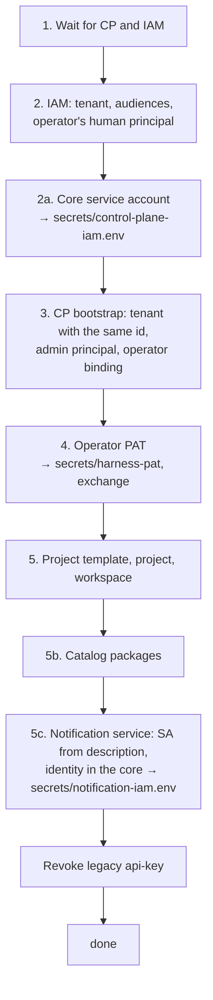

# Bootstrap

`deploy/bootstrap.py` is the single idempotent script for initial platform
setup: it creates the tenant in IAM and Control Plane, the first human
administrator, that administrator's Platform Access Token, the project and
workspace, the task type catalog, and service accounts for the core and
optional services. This page walks through each step based on the script's
code: which API calls it makes, what it saves, and what to do if it fails.

## Running

```bash
make bootstrap                                   # deploy/bootstrap.py --env .env
make bootstrap ARGS='--operator "Alice Operator"'
```

`make bootstrap` runs the script through
`uv run --no-project --quiet --with pyyaml --with jsonschema python3` if uv is
installed, and with the system `python3` if not. Where `make` is not
available (for example, on a deployment server), call the script directly:

```bash
uv run --no-project --with pyyaml --with jsonschema python3 deploy/bootstrap.py --env .env
# or with the system python3, if it has PyYAML and jsonschema:
python3 deploy/bootstrap.py --env .env
```

The script runs **on the host**, not in a container: it reaches Control Plane
and IAM through ports on `127.0.0.1` (`CP_HOST_PORT`, `IAM_HOST_PORT`) and
reads their values from `.env`.

### Parameters

| Flag | Default | Meaning |
|---|---|---|
| `--env` | `.env` | environment file (path relative to the superproject root) |
| `--name` | `COMPOSE_PROJECT_NAME` | environment name: state file `deploy/state/<name>.json` |
| `--operator` | a placeholder name in the script | display name of the first human administrator; set your own |
| `--tenant-slug` | `COMPOSE_PROJECT_NAME` | tenant slug in IAM and Control Plane (also the project template key and workspace slug) |
| `--pat-ttl` | `15552000` (180 days) | lifetime of issued PATs, in seconds (no more than `IAM_PAT_MAX_TTL_SECONDS`, 365 days) |
| `--secrets-dir` | `secrets` | where to write PATs and service account env files |
| `--packages` | `deploy/packages.yaml` | catalog installation file (`kind: Installation`), step 5b |
| `--no-packages` | off | skip step 5b: a human installs the packages with a plan (`plan --out` → `apply --plan`) |
| `--harness-people` | off | registry of people with a personal harness; without it, step 8 is skipped |

### Dependencies

The script uses only the Python standard library for HTTP, but step 5b
imports `package-sdk`, which needs **PyYAML** and **jsonschema**.
With uv installed, `make bootstrap` adds them itself; without uv, the system
Python must have them. The script checks for both before its first step and
stops right away if either is missing, so a bootstrap is never left half done
for this reason.
`package-sdk` takes the Control Plane domain validators from the
`services/control-plane/src` submodule; if they cannot be imported, it prints a warning
and validates only the format schema.

## Idempotency and state

All created IDs (not secrets) are written to `deploy/state/<name>.json` after
**every** step. A repeated run reads this file and skips what is already done:
the tenant, principals, template, and project are not created again. Some
actions run on every invocation on purpose, because they bring the deployment
in line with its description:

- `PATCH` of the scope ceilings of all audiences according to the script's registry;
- installation of catalog packages (a new type version is published only when something differs);
- publishing the descriptions of the notification service and fleet-controller and binding
  their identities in the core (steps 5c, 5d).

Secrets never go into the state file: PATs and client secrets are written only
to `secrets/` with mode `0600`, and stdout shows only prefixes and IDs.

!!! danger "State and data must match"
    The state file describes specific databases. If you delete volumes (a full
    reset), run `make reset-state`: the target moves
    `deploy/state/<name>.json` and the credentials issued by bootstrap
    (`secrets/harness-pat`, `secrets/*-iam.env`) to `secrets/stale-<time>/`;
    it does not touch the signing keys or `.env`. If you skip this, bootstrap
    stops right after
    waiting for services: the IAM tenant from the state file is not found (`404
    tenant_not_found`), and the script suggests `make reset-state`. The reverse
    situation (the databases are alive, but the state file is lost) produces
    `409 already_bootstrapped` at step 3: restore the file from a backup.

Example `deploy/state/taimen.json` after the first run:

```json
{
  "iamTenantId": "<tenant-id>",
  "iamAudiences": ["control-plane", "iam", "memory-service", "notification-service"],
  "iamOperatorPrincipalId": "<iam-principal-id>",
  "cpServiceAccountClientId": "<client-id>",
  "cpServiceAccountPrincipalId": "<iam-principal-id>",
  "cpServiceAccountCeiling": ["memory:on-behalf", "memory:read", "…"],
  "cpTenantId": "<tenant-id>",
  "cpOperatorPrincipalId": "<cp-principal-id>",
  "cpLegacyAdminKeyId": "<api-key-id>",
  "cpOperatorBindingId": "<binding-id>",
  "operatorPatPrefix": "<prefix>",
  "operatorPatExpiresAt": "<date>",
  "templateId": "<template-id>",
  "projectId": "<project-id>",
  "workspaceId": "<workspace-id>",
  "catalog": { "…": {} },
  "cpLegacyAdminKeyRevoked": true
}
```

## Steps



The numbering in the script output is historical: gaps in it are steps that
were retired, and the remaining steps keep their numbers.

### 1. Waiting for services

The script polls Control Plane `GET /health/ready` and IAM `GET /healthz`
every 2 seconds, for up to 180 seconds. If a service does not come up, it
exits with `SystemExit("timed out waiting for …")`.

If the state file already contains `iamTenantId`, the script checks that the
tenant exists in IAM (`GET /api/v1/tenants/{t}/audiences` with the bootstrap
token). A `404` response means the volumes were reset but the state remained;
the script stops with the message `… refers to IAM tenant …, which does not
exist in IAM (volumes reset?). Run `make reset-state` and repeat bootstrap.`

### 2. IAM: tenant, audiences, operator

All calls carry the header `X-IAM-Bootstrap-Token: ${IAM_BOOTSTRAP_TOKEN}`.

1. `POST /api/v1/tenants` `{"slug": <slug>, "name": <slug>}` → `iamTenantId`.
2. For each audience in the registry: `POST /api/v1/tenants/{t}/audiences`
   `{"key", "allowedScopes"}` (a `409` response means it already exists and is
   not an error), then always `PATCH /api/v1/tenants/{t}/audiences/{key}`
   `{"allowedScopes"}`, so the audience ceiling grows along with the service.

    | Audience | `allowedScopes` |
    |---|---|
    | `control-plane` | `control-plane:read`, `control-plane:write`, `control-plane:admin`, `control-plane:decide` |
    | `memory-service` | `memory:read`, `memory:write`, `memory:pii`, `memory:tenants`, `memory:on-behalf`, `memory:service` |
    | `notification-service` | `notifications:send`, `notifications:read`, `notifications:admin` |
    | `iam` | `iam:channel-links`, `iam:agents` |
    | `human-harness` | `harness:use`, `harness:inbound` |
    | `fleet` | `fleet:read`, `fleet:admin` |

3. `POST /api/v1/tenants/{t}/principals` `{"kind": "human", "displayName": <--operator>}`
   → `iamOperatorPrincipalId`.

If `IAM_TENANT_ID` in `.env` does not match the created tenant, the script
prints `!! add to .env: IAM_TENANT_ID=…`. Do it (the variable is needed by the
harness launcher, fleet-controller, and connectors).

### 2a. Control Plane service account

`POST /api/v1/tenants/{t}/service-accounts`:

```json
{
  "displayName": "Taimen Control Plane",
  "audiences": ["memory-service"],
  "scopeCeiling": ["memory:read", "memory:write", "memory:tenants", "memory:on-behalf",
                   "memory:service"]
}
```

The response (`clientId`, `clientSecret`) is written to
`secrets/control-plane-iam.env` as `CP_IAM_CLIENT_ID` / `CP_IAM_CLIENT_SECRET`.
This file is attached through `env_file` to the three core processes; with it,
Control Plane calls memory with an IAM token (`CP_CONTEXT_AUTH=auto`).

If the ceiling in the script's code differs from the saved one
(`cpServiceAccountCeiling`), the service account is **reissued** and the
previous one is revoked (`POST …/service-accounts/{clientId}:revoke`): a
service account's ceiling cannot be changed.

!!! note "Restarting the core"
    After the file is issued or reissued, run
    `tools/compose up -d control-plane-api control-plane-worker context-adapter`:
    `env_file` is read when the container is created.

### 3. Control Plane: tenant, administrator, binding

`POST /api/v1/bootstrap` with `Authorization: Bearer ${CP_BOOTSTRAP_TOKEN}`:

```json
{
  "tenantSlug": "taimen",
  "tenantName": "Taimen",
  "adminDisplayName": "Alice Operator",
  "tenantId": "<iam-tenant-id>",
  "iamBinding": {
    "issuer": "http://taimen.localhost/iam",
    "iamTenantId": "<iam-tenant-id>",
    "iamPrincipalId": "<iam-principal-id>"
  }
}
```

In a single transaction, Control Plane creates:

- a tenant **with the same UUID** as the IAM tenant, a single identifier for
  the organization;
- a `human` principal with the `admin` permission;
- a legacy administrator API key (returned in the response; the script
  revokes it later);
- the operator binding `(issuer, iamPrincipalId)` with **all** permissions
  listed by name, not just `admin`, so that a token with a read+write ceiling
  does not narrow the binding down to nothing.

The endpoint works once: if the database already has a tenant, the response is
`409 already_bootstrapped`. The issuer comes from `TAIMEN_PUBLIC_URL`, which is
why you must choose the public address **before** bootstrap.

### 4. Operator PAT

1. `POST /api/v1/tenants/{t}/principals/{p}/authentication-contexts`
   `{"issuer", "acr": "bootstrap", "amr": ["bootstrap-script"]}`: a fresh
   authentication context (IAM issues a PAT to a human only if the context is
   no older than 300 seconds).
2. `POST /api/v1/tenants/{t}/principals/{p}/platform-access-tokens` with
   `Idempotency-Key`:

    ```json
    {
      "name": "harness-admin-<YYYY-MM>",
      "audiences": ["control-plane"],
      "scopeCeiling": ["control-plane:read", "control-plane:write", "control-plane:admin"],
      "expiresInSeconds": 15552000
    }
    ```

3. The token is written to `secrets/harness-pat` (0600); its prefix and expiry
   go into the state.
4. The first exchange, `POST /api/v1/platform-access-tokens:exchange`, for a
   token for the `control-plane` audience with all three scopes — right away,
   so that a wrong PAT shows up at this step. All subsequent steps act on
   behalf of the operator, but the token is taken before each request: an
   access token lives for minutes, and step 5b takes longer. Bootstrap
   exchanges the PAT again before the token expires, and after
   `401 invalid_credentials` exchanges it once more and repeats the request,
   so a long installation does not fail with 401.

If `secrets/harness-pat` already exists, issuance is skipped and the file is
used.

### 5. Project template, project, and workspace

On behalf of the operator (the Bearer token from step 4):

1. `POST /api/v1/project-templates` `{"key": <slug>, "displayName": …}` →
   `templateId`.
2. `POST /api/v1/projects`:

    ```json
    {
      "workspaceSlug": "taimen",
      "workspaceName": "Taimen",
      "workspaceTypeKey": "generic",
      "templateId": "<template-id>",
      "ownerPrincipalId": "<cp-principal-id>"
    }
    ```

    Control Plane creates a workspace of the system type `generic` and attaches
    a Project Profile to it → `projectId`, `workspaceId`.

### 5b. Catalog from packages

The default installation file is `deploy/packages.yaml`:

```yaml
apiVersion: taimen.ai/v1
kind: Installation
key: default
spec:
  packages: [example]
```

The core is domain-neutral: by itself, an installation knows only the system
type `task`. Domain types come from their own packages. The default
installation adds the sample package `packages/example` (the task type
`request`); list your own packages instead.

The step installs the packages with the same single plan as `package-sdk plan`
→ `apply --plan`: `install.plan` builds the plan and writes it to
`deploy/state/<environment>.packages-plan.json`, and `install.apply` applies
exactly that plan. Running bootstrap itself stands in for a human's
confirmation here, and the log marks this. An empty plan is not applied: a
repeated run writes nothing.

The plan first validates the packages (the format's JSON Schema, Control Plane
domain validators, closure of references, `engines`, installation variables),
then compares them with the deployment section by section: the catalog, the
core plan for packages with processes or calendars, ontologies and enabling
them, notification rules, and retirement. The catalog is brought in line in the
order `WorkspaceType`, `Capability`, `ConnectionType`, `Role`, `Skill`, `ArtifactType`,
`TaskType`, `Agent`, `ProjectTemplate`, `WorkRule`; for a package with
processes or calendars, the core installs task types, agents, calendars,
processes, and rules with its own plan (details in [Catalog
packages](../control-plane/catalog-packages.md)):

| Object kind | How it is applied |
|---|---|
| `TaskType`, `ProjectTemplate` | versions are immutable: if the active version differs from the package, a new one is published and the previously active ones become `deprecated`; if it matches, "unchanged" |
| `WorkspaceType`, `Role` | created or updated with `PATCH` |
| `Capability` | create only |
| `Skill` | the contract is immutable and changes by bumping the version; description and config via `PATCH` |
| `retire` in the installation file | the listed objects are retired |

`${NAME}` strings in `spec` are substituted from `.env` and the process
environment. If the installation has notification rules (`NotificationRule`)
or retires them, the notification service is needed: the address is
`NOTIFICATION_SERVICE_URL`, and the token is `NOTIFY_TOKEN` or an exchange of
the operator's PAT for the `notification-service` audience (for such an
installation, bootstrap issues the operator's PAT with this audience; like the
core token, the exchanged token is renewed before it expires, `NOTIFY_TOKEN` is
not). Without
the address, the plan refuses, and bootstrap stops at step 5b. The step's
result is the `packages` entry in the state: the installation file, the plan
path, `planHash`, the number of changes, and the `applied` flag.

The `--no-packages` flag skips the step: on a running deployment, a human
installs the packages — `package-sdk lock` → `plan --out` → review of the plan
→ `apply --plan` (see [Installation and
release](../packages/install-and-release.md#plan)).

### 5c, 5d. Platform services

Services that call the core with IAM client credentials are described as agents
without placement (`placement: none`, `identity.kind: service`); the
descriptions are defined by `deploy/bootstrap.py`. For each of them —
`notification-service` (5c) and `fleet-controller` (5d) — the step always runs,
even if the service's profile is not up (it touches only IAM and Control Plane):

1. An IAM service account with the audiences and ceiling from the
   description's `identity.iam` → `secrets/notification-iam.env`
   (`NS_SERVICE_CLIENT_ID`, `NS_SERVICE_CLIENT_SECRET`) or
   `secrets/fleet-iam.env` (`FLEET_CLIENT_ID`, `FLEET_CLIENT_SECRET`). If the
   ceiling in the description changed, the account is reissued and the previous
   one revoked.
2. `POST /api/v1/agents`: publishes the description in the core.
3. `PUT /api/v1/agents/{key}/identity`: binds the account's IAM principal; the
   core derives the core principal and the binding with permissions from the
   description. Repeating it with the same account changes nothing.
4. If the account was reissued and the core still holds the previous one
   (`409 agent_identity_conflict` at step 3):
   `POST /api/v1/agents/{key}/identity:replace`. The core principal stays the
   same, the previous binding is revoked, and the new one gets the permissions
   of the current revision of the description.

After issuing the file, the script reminds you to recreate the service
(`tools/compose --profile notify up -d notification-service`,
`tools/compose --profile fleet up -d fleet-controller`).

The script then revokes the legacy administrator API key from step 3
(`POST /api/v1/api-keys/{id}:revoke`): the deployment works only through IAM.


### Result

At the end, the script prints the path to the state file and a hint for the
client:

```text
done: deploy/state/taimen.json
credential for the MCP plugin and CLI: ~/.config/iam/credentials.json, key http://taimen.localhost/iam|<tenant-id>|<iam-principal-id> → contents of secrets/harness-pat
```

How to use it is described in [First task](first-task.md).

## Files created by bootstrap

| File | Step | Contents | Read by |
|---|---|---|---|
| `deploy/state/<name>.json` | all | IDs, not secrets | bootstrap itself |
| `secrets/control-plane-iam.env` | 2a | core client credentials | Control Plane processes |
| `secrets/harness-pat` | 4 | operator PAT | a person: CLI, MCP plugin, curl |
| `secrets/notification-iam.env` | 5c | notification service client credentials | `notification-service` |
| `secrets/fleet-iam.env` | 5d | fleet controller client credentials | `fleet-controller` |

## Rerunning and reissuing

| Task | Action |
|---|---|
| Update the catalog after changing `packages/` | `make bootstrap`: only what differs changes |
| Install a different set of packages | `make bootstrap ARGS="--packages deploy/<env>/packages.yaml"` |
| Start over after resetting volumes | `make reset-state`, then `make bootstrap` |
| Reissue the operator PAT (expiring) | delete `secrets/harness-pat` and run bootstrap: a new PAT is issued with a fresh authentication context; revoke the old PAT separately |
| Reissue the core service account | delete `secrets/control-plane-iam.env` and run bootstrap, then restart the core |
| Add executors | describe the agent in a package and place it through fleet — [Declarative agents](../runner/declarative-agents.md) |

## Common errors

| Message | Cause | Fix |
|---|---|---|
| `timed out waiting for http://127.0.0.1:18000/health/ready` | the core did not start, or the port is different | `make ps`, `make logs svc=control-plane-api`; check `CP_HOST_PORT` |
| `POST /api/v1/tenants: HTTP 401` | `IAM_BOOTSTRAP_TOKEN` in `.env` does not match the one `iam-service` was started with | after editing `.env`, recreate the container: `tools/compose up -d iam-service` |
| `POST /api/v1/bootstrap: HTTP 409 … already_bootstrapped` | Control Plane is already initialized, and the state file is missing | restore `deploy/state/<name>.json` |
| `POST /api/v1/bootstrap: HTTP 403 … bootstrap_disabled` | `CP_BOOTSTRAP_TOKEN` is empty | set a value and recreate `control-plane-api` |
| `PyYAML and jsonschema required by step 5b (catalog from packages)` (or only one of them) | uv is not installed, and the system Python lacks the dependencies; the script stops before its first step | install uv or `pip install pyyaml jsonschema`; when calling the script directly, use `uv run --no-project --with pyyaml --with jsonschema python3 deploy/bootstrap.py …` |
| `… refers to IAM tenant …, which does not exist in IAM (volumes reset?)` | volumes were reset, but the state file remains | `make reset-state` and rerun bootstrap |
| `step 5b stopped: пакеты не прошли проверку: …` (`package-sdk` prints the reason in Russian: "packages failed validation") | an error in a package's YAML | `make packages-check`, fix the package |
| `platform-access-tokens:exchange: HTTP 500` | IAM cannot read the signing key | on Linux, `chown 10001:10001 secrets/iam-signing.pem`, then restart `iam-service` |
| `токен audience notification-service не получен` (the token for the notification-service audience was not obtained) | the installation has notification rules, but the operator's PAT was issued without the `notification-service` audience (for example, before the rules appeared) | set `NOTIFY_TOKEN`, or delete `secrets/harness-pat` and run bootstrap again: step 4 issues a PAT with this audience |
| `5b. установка пакетов остановлена: стенд ответил HTTP 401` (step 5b stopped: the stand answered HTTP 401) | the operator's PAT is revoked or expired: bootstrap renews an expired access token itself | reissue the PAT (see above) |

## See also

- [Installation and first launch](quickstart.md)
- [.env configuration](configuration.md)
- [Tenants and principals](../iam/principals.md)
- [Credentials and PATs](../iam/credentials.md)
- [Service accounts](../iam/service-accounts.md)
- [Catalog packages](../control-plane/catalog-packages.md)
- [Security model](../overview/security-model.md)
