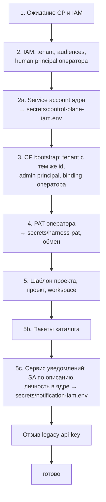

# Bootstrap

`deploy/bootstrap.py` — единый идемпотентный скрипт первичной инициализации
платформы: он заводит tenant в IAM и Control Plane, первого человека-
администратора, его Platform Access Token, проект и workspace, каталог типов
задач, service accounts ядра и опциональных сервисов. Статья разбирает каждый
шаг по коду скрипта: какие вызовы API он делает, что сохраняет и что делать при
сбое.

## Запуск

```bash
make bootstrap                                   # deploy/bootstrap.py --env .env
make bootstrap ARGS='--operator "Alice Operator"'
```

`make bootstrap` запускает скрипт через
`uv run --no-project --quiet --with pyyaml --with jsonschema python3`, если uv
установлен, и системным `python3` — если нет. Там, где `make` нет (например,
на сервере стенда), скрипт вызывают напрямую:

```bash
uv run --no-project --with pyyaml --with jsonschema python3 deploy/bootstrap.py --env .env
# или системным python3, если в нём есть PyYAML и jsonschema:
python3 deploy/bootstrap.py --env .env
```

Скрипт работает **с хоста**, а не из контейнера: к Control Plane и IAM он ходит
по портам `127.0.0.1` (`CP_HOST_PORT`, `IAM_HOST_PORT`), значения читает из
`.env`.

### Параметры

| Флаг | По умолчанию | Смысл |
|---|---|---|
| `--env` | `.env` | файл окружения (путь относительно корня суперпроекта) |
| `--name` | `COMPOSE_PROJECT_NAME` | имя окружения: файл состояния `deploy/state/<name>.json` |
| `--operator` | служебное имя в скрипте | отображаемое имя первого человека-администратора; задайте своё |
| `--tenant-slug` | `COMPOSE_PROJECT_NAME` | slug tenant в IAM и Control Plane (он же ключ шаблона проекта и slug workspace) |
| `--pat-ttl` | `15552000` (180 дней) | срок жизни выпускаемых PAT, секунды (не больше `IAM_PAT_MAX_TTL_SECONDS`, 365 дней) |
| `--secrets-dir` | `secrets` | куда писать PAT и env-файлы service accounts |
| `--packages` | `deploy/packages.yaml` | файл установки каталога (`kind: Installation`) — шаг 5b |
| `--no-packages` | выкл. | пропустить шаг 5b: пакеты ставит человек планом (`plan --out` → `apply --plan`) |

### Зависимости

Скрипт использует только стандартную библиотеку Python для HTTP, но шаг 5b
импортирует `package-sdk`, которому нужны **PyYAML** и **jsonschema**.
`make bootstrap` при установленном uv подключает их сам; без uv они нужны в
системном Python.
Доменные валидаторы Control Plane `package-sdk` берёт из сабмодуля
`services/control-plane/src`; если они не импортируются, выдаётся предупреждение и
проверяется только схема формата.

## Идемпотентность и состояние

Все созданные идентификаторы (не секреты) пишутся в
`deploy/state/<name>.json` после **каждого** шага. Повторный запуск читает этот
файл и пропускает сделанное: tenant, principals, шаблон и проект не создаются
заново. Некоторые действия выполняются при каждом запуске намеренно — они
приводят стенд к описанию:

- `PATCH` потолков scopes всех audiences по реестру скрипта;
- установка пакетов каталога (новая версия типа — только при расхождении);
- публикация описания сервиса уведомлений и привязка его личности в ядре (шаг 5c).

Секреты в файл состояния не попадают: PAT и client secrets пишутся только в
`secrets/` с правами `0600`, в stdout печатаются лишь префиксы и id.

!!! danger "Состояние и данные должны совпадать"
    Файл состояния описывает конкретные базы. Если удалить volumes (полный
    сброс), выполните `make reset-state`: цель переносит
    `deploy/state/<name>.json` и выданные bootstrap credentials
    (`secrets/harness-pat`, `secrets/*-iam.env`) в `secrets/stale-<время>/`;
    ключи подписи и `.env` не трогает. Если этого не сделать, bootstrap
    остановится сразу после
    ожидания сервисов: IAM tenant из файла состояния не найден (`404
    tenant_not_found`), и скрипт подскажет `make reset-state`. Обратная ситуация — базы
    живы, а файл состояния потерян — даёт `409 already_bootstrapped` на шаге 3:
    восстановите файл из резервной копии.

Пример `deploy/state/taimen.json` после первого прогона:

```json
{
  "iamTenantId": "<tenant-id>",
  "iamAudiences": ["control-plane", "iam", "memory-service", "notification-service"],
  "iamOperatorPrincipalId": "<iam-principal-id>",
  "cpServiceAccountClientId": "<client-id>",
  "cpServiceAccountPrincipalId": "<iam-principal-id>",
  "cpServiceAccountCeiling": ["memory:on-behalf", "memory:read", "…"],
  "cpTenantId": "<tenant-id>",
  "cpOperatorPrincipalId": "<cp-principal-id>",
  "cpLegacyAdminKeyId": "<api-key-id>",
  "cpOperatorBindingId": "<binding-id>",
  "operatorPatPrefix": "<prefix>",
  "operatorPatExpiresAt": "<дата>",
  "templateId": "<template-id>",
  "projectId": "<project-id>",
  "workspaceId": "<workspace-id>",
  "catalog": { "…": {} },
  "cpLegacyAdminKeyRevoked": true
}
```

## Шаги



Нумерация в выводе скрипта историческая: пропуски в ней — выведенные шаги,
номера остальных сохранены.

### 1. Ожидание сервисов

Опрос `GET /health/ready` Control Plane и `GET /healthz` IAM раз в 2 секунды,
до 180 секунд. Не дождался — `SystemExit("не дождался …")`.

Если в файле состояния уже есть `iamTenantId`, скрипт проверяет, что tenant
существует в IAM (`GET /api/v1/tenants/{t}/audiences` с bootstrap-токеном).
Ответ `404` означает, что volumes сброшены, а state остался; скрипт
останавливается с сообщением `… ссылается на IAM tenant …, которого нет в IAM
(volumes сброшены?). Запустите `make reset-state` и повторите bootstrap.`

### 2. IAM: tenant, audiences, оператор

Все вызовы — с заголовком `X-IAM-Bootstrap-Token: ${IAM_BOOTSTRAP_TOKEN}`.

1. `POST /api/v1/tenants` `{"slug": <slug>, "name": <slug>}` → `iamTenantId`.
2. Для каждого audience реестра — `POST /api/v1/tenants/{t}/audiences`
   `{"key", "allowedScopes"}` (ответ `409` — уже есть, не ошибка), затем
   всегда `PATCH /api/v1/tenants/{t}/audiences/{key}` `{"allowedScopes"}` —
   потолок audience растёт вместе с сервисом.

    | Audience | `allowedScopes` |
    |---|---|
    | `control-plane` | `control-plane:read`, `control-plane:write`, `control-plane:admin`, `control-plane:decide` |
    | `memory-service` | `memory:read`, `memory:write`, `memory:pii`, `memory:tenants`, `memory:on-behalf`, `memory:service` |
    | `notification-service` | `notifications:send`, `notifications:read`, `notifications:admin` |
    | `iam` | `iam:channel-links`, `iam:agents` |

3. `POST /api/v1/tenants/{t}/principals` `{"kind": "human", "displayName": <--operator>}`
   → `iamOperatorPrincipalId`.

Если `IAM_TENANT_ID` в `.env` не совпадает с созданным tenant, скрипт печатает
`!! впишите в .env: IAM_TENANT_ID=…` — сделайте это, чтобы `.env` описывал
стенд полностью.

### 2a. Service account Control Plane

`POST /api/v1/tenants/{t}/service-accounts`:

```json
{
  "displayName": "Taimen Control Plane",
  "audiences": ["memory-service"],
  "scopeCeiling": ["memory:read", "memory:write", "memory:tenants", "memory:on-behalf",
                   "memory:service"]
}
```

Ответ (`clientId`, `clientSecret`) записывается в
`secrets/control-plane-iam.env` как `CP_IAM_CLIENT_ID` / `CP_IAM_CLIENT_SECRET`.
Этот файл подключён `env_file` к трём процессам ядра; с ним Control Plane ходит
в память токеном IAM (`CP_CONTEXT_AUTH=auto`).

Если потолок в коде скрипта изменился по сравнению с сохранённым
(`cpServiceAccountCeiling`), service account **перевыпускается**, а прежний
отзывается (`POST …/service-accounts/{clientId}:revoke`): изменения потолка у
service account нет.

!!! note "Перезапуск ядра"
    После выпуска или перевыпуска файла выполните
    `tools/compose up -d control-plane-api control-plane-worker context-adapter` —
    `env_file` читается при создании контейнера.

### 3. Control Plane: tenant, администратор, binding

`POST /api/v1/bootstrap` с `Authorization: Bearer ${CP_BOOTSTRAP_TOKEN}`:

```json
{
  "tenantSlug": "taimen",
  "tenantName": "Taimen",
  "adminDisplayName": "Alice Operator",
  "tenantId": "<iam-tenant-id>",
  "iamBinding": {
    "issuer": "http://taimen.localhost/iam",
    "iamTenantId": "<iam-tenant-id>",
    "iamPrincipalId": "<iam-principal-id>"
  }
}
```

Одной транзакцией Control Plane создаёт:

- tenant **с тем же UUID**, что у tenant IAM, — единый идентификатор
  организации;
- principal `human` с правом `admin`;
- legacy API-ключ администратора (возвращается в ответе, скрипт его позже
  отзывает);
- binding оператора `(issuer, iamPrincipalId)` со **всеми** правами по имени —
  не только `admin`, чтобы токен с потолком read+write не сузил binding до нуля.

Эндпоинт работает один раз: если в базе уже есть tenant, ответ
`409 already_bootstrapped`. Issuer берётся из `TAIMEN_PUBLIC_URL` — поэтому
публичный адрес нужно выбрать **до** bootstrap.

### 4. PAT оператора

1. `POST /api/v1/tenants/{t}/principals/{p}/authentication-contexts`
   `{"issuer", "acr": "bootstrap", "amr": ["bootstrap-script"]}` — свежий
   контекст аутентификации (IAM выпускает PAT человеку, только если контекст не
   старше 300 секунд).
2. `POST /api/v1/tenants/{t}/principals/{p}/platform-access-tokens` с
   `Idempotency-Key`:

    ```json
    {
      "name": "harness-admin-<ГГГГ-ММ>",
      "audiences": ["control-plane"],
      "scopeCeiling": ["control-plane:read", "control-plane:write", "control-plane:admin"],
      "expiresInSeconds": 15552000
    }
    ```

3. Токен пишется в `secrets/harness-pat` (0600); префикс и срок — в состояние.
4. Первый обмен `POST /api/v1/platform-access-tokens:exchange` на токен
   audience `control-plane` со всеми тремя scopes — сразу, чтобы неверный PAT
   был виден на этом шаге. Все последующие шаги идут от имени оператора, но
   токен берётся перед каждым запросом: access token живёт минуты, а шаг 5b —
   дольше. Bootstrap обменивает PAT заново до истечения токена, а после
   `401 invalid_credentials` — ещё раз и повторяет запрос, поэтому долгая
   установка не падает на 401.

Если `secrets/harness-pat` уже существует, выпуск пропускается и используется
файл.

### 5. Шаблон проекта, проект и workspace

От имени оператора (Bearer-токен из шага 4):

1. `POST /api/v1/project-templates` `{"key": <slug>, "displayName": …}` →
   `templateId`.
2. `POST /api/v1/projects`:

    ```json
    {
      "workspaceSlug": "taimen",
      "workspaceName": "Taimen",
      "workspaceTypeKey": "generic",
      "templateId": "<template-id>",
      "ownerPrincipalId": "<cp-principal-id>"
    }
    ```

    Control Plane создаёт workspace системного типа `generic` и прикрепляет к
    нему Project Profile → `projectId`, `workspaceId`.

### 5b. Каталог из пакетов

Файл установки по умолчанию — `deploy/packages.yaml`:

```yaml
apiVersion: taimen.ai/v1
kind: Installation
key: default
spec:
  packages: [example]
```

Ядро доменно-нейтрально: само по себе оно знает только системный тип `task`.
Типы предметной области ставятся своими пакетами. Установка по умолчанию ставит
образец `packages/example` — тип задачи `request`; замените его своими пакетами.

Шаг ставит пакеты тем же единым планом, что и `package-sdk plan` → `apply
--plan`: `install.plan` строит план и пишет его в
`deploy/state/<окружение>.packages-plan.json`, `install.apply` применяет ровно
его. Подтверждение человека здесь заменяет сам запуск bootstrap, и это помечено
в журнале. Пустой план не применяется: повторный запуск ничего не пишет.

План сначала проверяет пакеты (JSON Schema формата, доменные валидаторы Control
Plane, замкнутость ссылок, `engines`, переменные установки), затем сравнивает их
со стендом по секциям: каталог, план ядра для пакетов с процессами или
календарями, онтологии и их включение, правила уведомлений, вывод из оборота.
Каталог приводится в порядке `WorkspaceType`, `Capability`, `ConnectionType`, `Role`, `Skill`,
`ArtifactType`, `TaskType`, `Agent`, `ProjectTemplate`, `WorkRule`; у пакета с
процессами или календарями типы задач, агентов, календари, процессы и правила
ставит ядро своим планом (подробно — в [Пакетах
каталога](../control-plane/catalog-packages.md)):

| Вид объекта | Как применяется |
|---|---|
| `TaskType`, `ProjectTemplate` | версии неизменяемы: если активная версия расходится с пакетом — публикуется новая, прежние активные → `deprecated`; совпадает — «без изменений» |
| `WorkspaceType`, `Role` | создаются или приводятся `PATCH` |
| `Capability` | только создание |
| `Skill` | контракт неизменяем, меняется поднятием версии; описание и config — `PATCH` |
| `retire` в файле установки | указанные объекты выводятся из оборота |

Строки `${NAME}` в `spec` подставляются из `.env` и окружения процесса. Если в
установке есть правила уведомлений (`NotificationRule`) или их вывод из
оборота, нужен сервис уведомлений: адрес — `NOTIFICATION_SERVICE_URL`, токен —
`NOTIFY_TOKEN` или обмен PAT оператора на audience `notification-service`
(для такой установки bootstrap выпускает PAT оператора с этим audience;
обменянный токен, как и токен ядра, обновляется перед истечением,
`NOTIFY_TOKEN` — нет). Без
адреса план отказывает, и bootstrap останавливается на шаге 5b. Итог шага —
запись `packages` в состоянии: файл установки, путь к плану, `planHash`, число
изменений и признак `applied`.

Флаг `--no-packages` пропускает шаг: на работающем стенде пакеты ставит
человек — `package-sdk lock` → `plan --out` → просмотр плана → `apply --plan`
(см. [Установку и выпуск](../packages/install-and-release.md#plan)).

### 5c. Сервис уведомлений

`notification-service` ходит в ядро по client credentials IAM и описан агентом
без размещения (`placement: none`, `identity.kind: service`). Шаг выполняется
всегда, даже если профиль `notify` не поднят (затрагивает только IAM и Control
Plane):

1. Service account IAM с audiences и потолком из `identity.iam` описания →
   `secrets/notification-iam.env` (`NS_SERVICE_CLIENT_ID`,
   `NS_SERVICE_CLIENT_SECRET`). Если потолок в описании изменился, учётка
   перевыпускается, прежняя отзывается.
2. `POST /api/v1/agents` — публикация описания в ядре.
3. `PUT /api/v1/agents/{key}/identity` — привязка IAM principal учётки;
   principal ядра и связку с правами из описания выводит ядро. Повтор с той же
   учёткой ничего не меняет.
4. Если учётка перевыпущена, а ядро помнит прежнюю (`409
   agent_identity_conflict` на шаге 3), —
   `POST /api/v1/agents/{key}/identity:replace`: principal ядра остаётся
   прежним, прежняя связка отзывается, новая получает права текущей ревизии
   описания.

После выпуска файла скрипт напоминает пересоздать сервис
(`tools/compose --profile notify up -d notification-service`).

Затем скрипт отзывает legacy API-ключ администратора из шага 3
(`POST /api/v1/api-keys/{id}:revoke`) — стенд работает только через IAM.


### Итог

В конце скрипт печатает путь к файлу состояния и подсказку для клиента:

```text
готово: deploy/state/taimen.json
credential для MCP-плагина/CLI: ~/.config/iam/credentials.json, ключ http://taimen.localhost/iam|<tenant-id>|<iam-principal-id> → содержимое secrets/harness-pat
```

Как этим воспользоваться — в [Первой задаче](first-task.md).

## Файлы, которые создаёт bootstrap

| Файл | Шаг | Содержимое | Кто читает |
|---|---|---|---|
| `deploy/state/<name>.json` | все | идентификаторы, не секреты | сам bootstrap |
| `secrets/control-plane-iam.env` | 2a | client credentials ядра | процессы Control Plane |
| `secrets/harness-pat` | 4 | PAT оператора | человек: CLI, MCP-плагин, curl |
| `secrets/notification-iam.env` | 5c | client credentials сервиса уведомлений | `notification-service` |

## Повторный запуск и перевыпуск

| Задача | Действие |
|---|---|
| Обновить каталог после изменения `packages/` | `make bootstrap` — изменится только то, что расходится |
| Поставить другой набор пакетов | `make bootstrap ARGS="--packages deploy/<env>/packages.yaml"` |
| Начать заново после сброса volumes | `make reset-state`, затем `make bootstrap` |
| Перевыпустить PAT оператора (истекает) | удалить `secrets/harness-pat` и запустить bootstrap: новый выпуск со свежим контекстом аутентификации; старый PAT отзовите отдельно |
| Перевыпустить service account ядра | удалить `secrets/control-plane-iam.env` и запустить bootstrap, затем перезапустить ядро |

## Типичные ошибки

| Сообщение | Причина | Решение |
|---|---|---|
| `не дождался http://127.0.0.1:18000/health/ready` | ядро не поднялось или порт другой | `make ps`, `make logs svc=control-plane-api`; проверить `CP_HOST_PORT` |
| `POST /api/v1/tenants: HTTP 401` | `IAM_BOOTSTRAP_TOKEN` в `.env` не совпадает с тем, с которым запущен `iam-service` | после правки `.env` пересоздать контейнер: `tools/compose up -d iam-service` |
| `POST /api/v1/bootstrap: HTTP 409 … already_bootstrapped` | Control Plane уже инициализирован, файла состояния нет | восстановить `deploy/state/<name>.json` |
| `POST /api/v1/bootstrap: HTTP 403 … bootstrap_disabled` | пустой `CP_BOOTSTRAP_TOKEN` | задать значение, пересоздать `control-plane-api` |
| `нужен PyYAML` / `нужен jsonschema` | uv не установлен, у системного Python нет зависимостей | установить uv или `pip install pyyaml jsonschema`; при прямом вызове — `uv run --no-project --with pyyaml --with jsonschema python3 deploy/bootstrap.py …` |
| `… ссылается на IAM tenant …, которого нет в IAM (volumes сброшены?)` | volumes сброшены, файл состояния остался | `make reset-state` и повторить bootstrap |
| `пакеты не прошли проверку: …` | ошибка в YAML пакета | `make packages-check`, исправить пакет |
| `platform-access-tokens:exchange: HTTP 500` | IAM не может прочитать ключ подписи | на Linux `chown 10001:10001 secrets/iam-signing.pem`, перезапустить `iam-service` |
| `токен audience notification-service не получен` | в установке есть правила уведомлений, а PAT оператора выпущен без audience `notification-service` (например, до того, как они появились) | задать `NOTIFY_TOKEN` или удалить `secrets/harness-pat` и запустить bootstrap снова: шаг 4 выпустит PAT с этим audience |
| `5b. установка пакетов остановлена: стенд ответил HTTP 401` | PAT оператора отозван или истёк: просроченный access token bootstrap обновляет сам | перевыпустить PAT (см. выше) |

## См. также

- [Установка и первый запуск](quickstart.md)
- [Конфигурация .env](configuration.md)
- [Tenants и principals](../iam/principals.md)
- [Credentials и PAT](../iam/credentials.md)
- [Service accounts](../iam/service-accounts.md)
- [Пакеты каталога](../control-plane/catalog-packages.md)
- [Модель безопасности](../overview/security-model.md)
