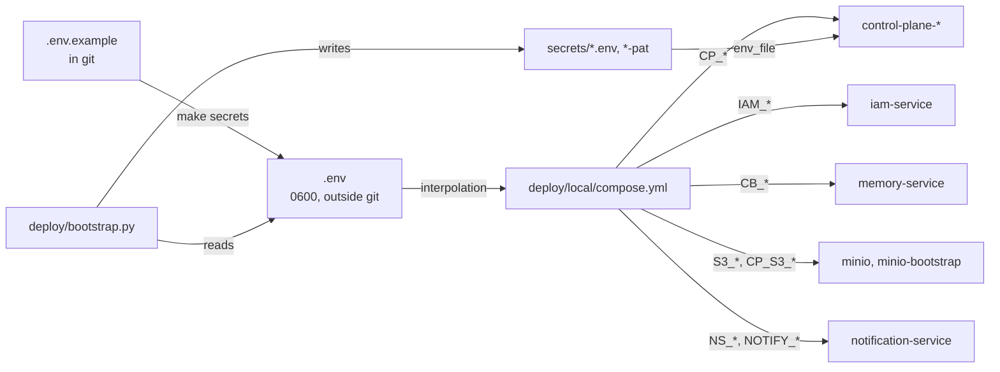

# .env configuration

This page walks through the platform's single environment file, `.env` in the
superproject root, group by group: what each variable means, which service
variables it maps to in `deploy/local/compose.yml`, which value is normal for a local
deployment, and what to change for your own. For a complete alphabetical list
of all variables of all components, see
[Environment variables](../reference/environment.md).

## How configuration works



Principles:

- **One concept, one name.** For example, `.env` sets a single
  `MEMORY_API_KEY`, and `deploy/local/compose.yml` maps it to memory's `CB_SERVER_API_KEY`
  and the core's `CP_CONTEXT_API_KEY`. You do not change service code to
  change the environment.
- **Local and production deployments differ only in `.env` and the Caddyfile.**
  Service DNS names inside the network are the same.
- **Secrets live only in `.env` and `secrets/`.** Both paths are in `.gitignore`.
- `.env` has three consumers: Docker Compose (automatically, from the root),
  `deploy/bootstrap.py` (`--env .env`), and `tools/smoke.py` (ports).
- Variables that are not in `.env.example` have defaults directly in
  `deploy/local/compose.yml` (`${VAR:-default}`); add them to `.env` to override them.

!!! warning "Whole-file interpolation"
    Compose substitutes variables into all services, including services of
    profiles that are not enabled. That is why only the values that
    `make secrets` generates are declared as required (`${VAR:?…}`).
    `IAM_TENANT_ID` is empty by default; see
    [Installation and first launch](quickstart.md).

## Environment

| Variable | Default | Meaning |
|---|---|---|
| `TAIMEN_PUBLIC_URL` | `http://taimen.localhost` | Public address of the platform without a trailing `/`. The IAM issuer is derived from it (`${TAIMEN_PUBLIC_URL}/iam`). It ends up in every token and in Control Plane bindings |
| `TAIMEN_PUBLIC_HOST` | `taimen.localhost` | Host name from the address above. It becomes a network alias of Caddy so that containers reach the public address through it |
| `COMPOSE_PROJECT_NAME` | `taimen` | Compose project name: prefix for containers and volumes, default tenant name (slug), and default bootstrap state file name |
| `TAIMEN_NETWORK` | `taimen_default` | Name of the Docker network for all services |
| `CADDYFILE` | `./deploy/caddy/Caddyfile.local` | Edge configuration. The local one is HTTP without ACME; for a production deployment, a file with TLS |
| `EDGE_HTTP_PORT`, `EDGE_HTTPS_PORT` | `80`, `443` | Caddy ports on the host |
| `LOG_LEVEL` | `INFO` | Service log level (`CP_LOG_LEVEL`) |

!!! danger "Changing `TAIMEN_PUBLIC_URL` on a live deployment"
    The IAM issuer is derived from the public address, and Control Plane looks
    up bindings by the (issuer, principal) pair. If you change the address, no
    principal can sign in until the bindings are moved to the new issuer.
    Choose the address before bootstrap. The migration procedure is in
    [Upgrades and migrations](../operations/upgrades.md).

## Tenant

| Variable | Meaning |
|---|---|
| `IAM_TENANT_ID` | UUID of the tenant in IAM. Known only after bootstrap (it prints the line `!! add to .env: IAM_TENANT_ID=…`). Services of the `core`, `edge`, and `notify` profiles do not need it |

Bootstrap stores the other IDs (Control Plane tenant, operator, project,
workspace) in `deploy/state/<name>.json`.

## Secrets

`make secrets` fills each of them with a random value if it is empty.

| Variable | Where it goes | Meaning |
|---|---|---|
| `CP_POSTGRES_PASSWORD` | `control-plane-db`, `CP_DATABASE_URL` | Control Plane database password |
| `IAM_POSTGRES_PASSWORD` | `iam-db`, `IAM_DATABASE_URL` | IAM database password |
| `MEMORY_POSTGRES_PASSWORD` | `memory-db`, `CB_DATABASE_URL` | memory database password |
| `CP_BOOTSTRAP_TOKEN` | `control-plane-api` | one-time `POST /api/v1/bootstrap` (`Authorization: Bearer`). An empty value disables the bootstrap endpoint |
| `IAM_BOOTSTRAP_TOKEN` | `iam-service` | IAM administrative operations (`X-IAM-Bootstrap-Token`): tenants, principals, PATs, service accounts |
| `MEMORY_API_KEY` | `CB_SERVER_API_KEY`, `CP_CONTEXT_API_KEY` | static memory key with full access; the core uses it only until a service account exists |
| `S3_ACCESS_KEY_ID`, `S3_SECRET_ACCESS_KEY` | `minio`, `minio-bootstrap` | MinIO root account; only `minio-bootstrap` uses it |
| `CP_S3_ACCESS_KEY_ID`, `CP_S3_SECRET_ACCESS_KEY` | `minio-bootstrap`, Control Plane processes | the core's MinIO user with access only to the artifacts bucket |
| `CP_S3_BUCKET` | `minio-bootstrap`, Control Plane processes | bucket for artifact content (default `artifacts`) |
| `IAM_SIGNING_KEY_FILE`, `IAM_SIGNING_KEY_ID` | Docker secret `iam_signing_key`, `IAM_SIGNING_KEY_ID` | path to the private RSA token signing key and its `kid` in JWKS |


!!! warning "`IAM_SIGNING_KEY_ID` when rotating the key"
    The `kid` is published in JWKS and appears in the header of every token.
    When you replace the signing key, change `IAM_SIGNING_KEY_ID` too;
    otherwise services with a cached JWKS verify new tokens against the old
    key until the cache refreshes. See [Secrets and rotation](../operations/secrets.md).

## LLM

One OpenAI-compatible provider serves all consumers: memory (embeddings,
reranking, synthesis).

| Variable | Default | Where it goes |
|---|---|---|
| `LLM_API_KEY` | empty | `CB_EMBEDDING_API_KEY`, `CB_LLM_API_KEY`: the provider key (the name is historical; any OpenAI-compatible endpoint works) |
| `LLM_BASE_URL` | OpenAI-compatible gateway from `.env.example` | `CB_EMBEDDING_BASE_URL`, `CB_LLM_BASE_URL`: the `/v1` base URL |
| `LLM_MODEL` | model from `.env.example` | `CB_LLM_MODEL` (memory reranking and synthesis) |
| `MEMORY_EMBEDDING_MODEL` | `text-embedding-3-small` | `CB_EMBEDDING_MODEL`; the dimension is fixed: `CB_EMBEDDING_DIM=1536` |
| `MEMORY_EMBEDDING_PROVIDER` | `fake` | `CB_EMBEDDING_PROVIDER`: `fake` (offline) or `openai` |
| `MEMORY_LLM_PROVIDER` | `echo` | `CB_LLM_PROVIDER`: `echo` (offline) or `openai` |
| `MEMORY_RERANK_ENABLED` | `false` | `CB_RERANK_ENABLED`: LLM reranking of search results (pool of 20) |
| `MEMORY_CONSOLE_ENABLED` | `false` | `CB_CONSOLE_ENABLED`: built-in memory console |

To enable a real provider:

```dotenv
LLM_API_KEY=<provider key>
LLM_BASE_URL=https://llm.example.com/v1
LLM_MODEL=<chat model>
MEMORY_EMBEDDING_PROVIDER=openai
MEMORY_LLM_PROVIDER=openai
MEMORY_RERANK_ENABLED=true
```

```bash
tools/compose up -d memory-service
```

!!! warning "Reindexing after `fake`"
    The `fake` provider builds vectors by hashing words, with the same
    dimension as the real model, so the schema accepts them, but semantic
    search over them does not work. Data loaded into memory in `fake` mode
    must be reindexed after you switch to `openai`. See
    [Knowledge ingestion](../memory/ingestion.md).

The embedding timeout in compose is 60 seconds (`CB_EMBEDDING_TIMEOUT`):
gateways occasionally respond slowly.

## Memory and access to it

| Variable | Default | Meaning |
|---|---|---|
| `MEMORY_IAM_ENABLED` | `true` | `CB_IAM_ENABLED`: memory accepts IAM tokens for the `memory-service` audience alongside the static key |
| `MEMORY_POLICY_ENABLED` | `false` | `CB_POLICY_ENABLED`: per-principal memory visibility through an external PDP (experimental); do not enable without a connected PDP |

Compose also pins: `CB_PII_PROTECTION=true`, `CB_DEFAULT_NAMESPACE=main`, the
IAM issuer and JWKS, and the `memory-service` audience.

## Control Plane

| Variable | Default | Meaning |
|---|---|---|
| `CP_LEGACY_API_KEYS_ENABLED` | `false` | Whether to accept static `cp_…` keys. The delivery uses IAM only; `true` is an emergency mode |
| `CP_CONTEXT_AUTH` | `auto` | How the core authenticates to memory: `auto` uses the service account from `secrets/control-plane-iam.env`, and `MEMORY_API_KEY` until that file exists; `api_key` or `iam` forces one method |
| `CP_AUTHZ_MODE` | `local` | Source of domain authorization: `local`; `shadow` and `policy` are modes with an external PDP (experimental) |
| `CP_CORS_ORIGINS` | `[]` | JSON list of origins for CORS on the Control Plane API (needed only if a browser client calls the API directly rather than through a gateway) |

Hard-coded in `deploy/local/compose.yml` and not configurable from `.env`:
`CP_IAM_ENABLED=true`, `CP_IAM_AUDIENCE=control-plane`,
`CP_IAM_ISSUER=${TAIMEN_PUBLIC_URL}/iam`, `CP_IAM_JWKS_URL` (internal IAM
address), `CP_CONTEXT_PROVIDER=http`, `CP_CONTEXT_BASE_URL`. Other Control
Plane settings (claim and session TTLs, context limits, bindings cache) have
defaults in code and are described in
[Control Plane configuration](../control-plane/configuration.md).


## Ports on 127.0.0.1

| Variable | Default | Service |
|---|---|---|
| `CP_HOST_PORT` | `18000` | control-plane-api |
| `MEMORY_HOST_PORT` | `18001` | memory-service |
| `IAM_HOST_PORT` | `18010` | iam-service |
| `NOTIFY_HOST_PORT` | `18045` | notification-service |

Bootstrap and `make smoke` reach the services on exactly these ports. To change
a value, change it in `.env`, not in `deploy/local/compose.yml`.

## Container memory limits

Every `mem_limit` is parameterized. `.env.example` contains commented-out
values for a 2 vCPU / 6 GB machine; add the other variables as needed.

| Variable | Default | Services |
|---|---|---|
| `PG_MEM_LIMIT` | `256m` | all PostgreSQL instances except `memory-db` |
| `MEMORY_DB_MEM_LIMIT` | `512m` | memory-db |
| `MEMORY_MEM_LIMIT` | `512m` | memory-service |
| `IAM_MEM_LIMIT` | `256m` | iam-service |
| `CP_MEM_LIMIT` | `512m` | control-plane-api |
| `CP_WORKER_MEM_LIMIT` | `256m` | control-plane-worker, context-adapter |
| `MINIO_MEM_LIMIT` | `256m` | minio |
| `NOTIFY_MEM_LIMIT` | `256m` | notification-service |

## Volume names

By default, a volume is named `${COMPOSE_PROJECT_NAME}_<name>`. The variables
`VOLUME_CONTROL_PLANE_DB`, `VOLUME_IAM_DB`, `VOLUME_MEMORY_DB`,
`VOLUME_CADDY_DATA`, `VOLUME_CADDY_CONFIG`, `VOLUME_NOTIFY_DB`, and
`VOLUME_PLATFORM_MINIO` (the MinIO volume with artifact content) let you point
to existing volumes, for example when moving a deployment that was brought up
earlier with other compose files to the `deploy/local/compose.yml` without losing data.

## Image builds

| Variable | Default | Meaning |
|---|---|---|
| `IMAGE_PREFIX`, `IMAGE_TAG` | `taimen`, `local` | name and tag of built images (`${IMAGE_PREFIX}/control-plane:${IMAGE_TAG}`) |
| `CP_BUILD_CONTEXT`, `MEMORY_BUILD_CONTEXT`, `IAM_BUILD_CONTEXT`, `NOTIFY_BUILD_CONTEXT` | root or component directory | build context; change it when release sources live in a different directory |

## Other variables of optional profiles

| Variable | Default | Meaning |
|---|---|---|
| `NOTIFY_POSTGRES_PASSWORD` | — (required) | notification-service database password, generated by `make secrets` |

## Files written by bootstrap

These files are attached to containers through `env_file` with
`required: false`, so the first `make up` succeeds without them:

| File | Read by | Contents |
|---|---|---|
| `secrets/control-plane-iam.env` | `control-plane-api`, `control-plane-worker`, `context-adapter` | `CP_IAM_CLIENT_ID`, `CP_IAM_CLIENT_SECRET`: the core service account |
| `secrets/notification-iam.env` | `notification-service` | `NS_SERVICE_CLIENT_ID`, `NS_SERVICE_CLIENT_SECRET`: the notification service's service account |

After such a file appears or is replaced, restart its consumer
(`tools/compose up -d <service>`): `env_file` is read when the container is
created.

## Production deployment: what to change

| Variable | Local | Production deployment |
|---|---|---|
| `TAIMEN_PUBLIC_URL` | `http://taimen.localhost` | `https://platform.example.com` |
| `TAIMEN_PUBLIC_HOST` | `taimen.localhost` | `platform.example.com` |
| `CADDYFILE` | `./deploy/caddy/Caddyfile.local` | a Caddyfile with your domain and automatic TLS |
| `MEMORY_EMBEDDING_PROVIDER` / `MEMORY_LLM_PROVIDER` | `fake` / `echo` | `openai` / `openai` |
| `*_MEM_LIMIT` | not set | according to machine resources |
| `COMPOSE_PROJECT_NAME`, `VOLUME_*` | defaults | per your naming conventions |

Details: [Production deployment](../operations/deployment.md) and
[Edge and TLS](../operations/edge-and-tls.md).

## See also

- [Environment variables](../reference/environment.md)
- [Bootstrap](bootstrap.md)
- [Secrets and rotation](../operations/secrets.md)
- [Control Plane configuration](../control-plane/configuration.md)
- [IAM configuration](../iam/configuration.md)
- [Memory configuration](../memory/configuration.md)
