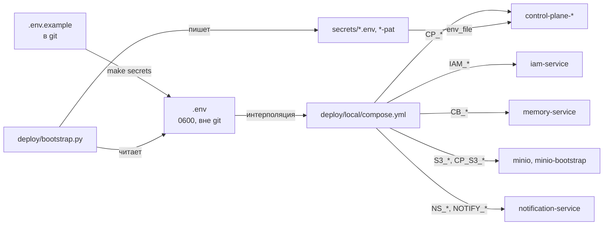

# Конфигурация .env

Статья разбирает единый файл окружения платформы — `.env` в корне
суперпроекта — по группам: что означает каждая переменная, в какие переменные
сервисов она раскладывается в `deploy/local/compose.yml`, какое значение нормально для
локального стенда и что менять для своего. Полный алфавитный перечень всех
переменных всех компонентов — в [Переменных окружения](../reference/environment.md).

## Как устроена конфигурация



Принципы:

- **Одно понятие — одно имя.** В `.env` задаётся, например, один
  `MEMORY_API_KEY`, а `deploy/local/compose.yml` сам раскладывает его в `CB_SERVER_API_KEY`
  памяти и `CP_CONTEXT_API_KEY` ядра. Код сервисов для смены окружения менять
  не нужно.
- **Локальный и промышленный стенд различаются только `.env` и Caddyfile.**
  DNS-имена сервисов внутри сети одинаковые.
- **Секреты — только в `.env` и `secrets/`.** Оба пути в `.gitignore`.
- `.env` читают три потребителя: Docker Compose (автоматически из корня),
  `deploy/bootstrap.py` (`--env .env`) и `tools/smoke.py` (порты).
- Переменные, которых нет в `.env.example`, имеют значения по умолчанию прямо в
  `deploy/local/compose.yml` (`${VAR:-default}`) — их можно добавить в `.env`, чтобы
  переопределить.

!!! warning "Интерполяция всего файла"
    Compose подставляет переменные во все сервисы, включая сервисы невключённых
    профилей. Поэтому обязательными (`${VAR:?…}`) объявлены только значения,
    которые генерирует `make secrets`. `IAM_TENANT_ID` по умолчанию пуст —
    см. [Установка и первый запуск](quickstart.md).

## Окружение

| Переменная | По умолчанию | Смысл |
|---|---|---|
| `TAIMEN_PUBLIC_URL` | `http://taimen.localhost` | Публичный адрес платформы без завершающего `/`. Из него выводится issuer IAM (`${TAIMEN_PUBLIC_URL}/iam`). Попадает в каждый токен и в bindings Control Plane |
| `TAIMEN_PUBLIC_HOST` | `taimen.localhost` | Имя хоста из адреса выше. Становится сетевым alias Caddy, чтобы контейнеры ходили на публичный адрес через него |
| `COMPOSE_PROJECT_NAME` | `taimen` | Имя compose-проекта: префикс контейнеров и volumes, имя tenant (slug) и файла состояния bootstrap по умолчанию |
| `TAIMEN_NETWORK` | `taimen_default` | Имя docker-сети всех сервисов |
| `CADDYFILE` | `./deploy/caddy/Caddyfile.local` | Конфигурация периметра. Локальная — http без ACME; для промышленного стенда — файл с TLS |
| `EDGE_HTTP_PORT`, `EDGE_HTTPS_PORT` | `80`, `443` | Порты Caddy на хосте |
| `LOG_LEVEL` | `INFO` | Уровень логов сервисов (`CP_LOG_LEVEL`) |

!!! danger "Смена `TAIMEN_PUBLIC_URL` на живом стенде"
    Issuer IAM выводится из публичного адреса, а bindings Control Plane ищутся
    по паре (issuer, principal). Сменив адрес, вы закроете вход всем principal,
    пока bindings не будут перенесены на новый issuer. Выбирайте адрес до
    bootstrap. Процедура переноса — в [Обновлении и
    миграциях](../operations/upgrades.md).

## Tenant

| Переменная | Смысл |
|---|---|
| `IAM_TENANT_ID` | UUID tenant в IAM. Известен только после bootstrap (он напечатает строку `впишите в .env: IAM_TENANT_ID=…`). Сервисам профилей `core`, `edge` и `notify` не нужен |

Остальные идентификаторы (tenant Control Plane, оператор, проект, workspace)
bootstrap хранит в `deploy/state/<имя>.json`.

## Секреты

Все заполняются `make secrets` случайными значениями, если пусты.

| Переменная | Куда попадает | Смысл |
|---|---|---|
| `CP_POSTGRES_PASSWORD` | `control-plane-db`, `CP_DATABASE_URL` | пароль БД Control Plane |
| `IAM_POSTGRES_PASSWORD` | `iam-db`, `IAM_DATABASE_URL` | пароль БД IAM |
| `MEMORY_POSTGRES_PASSWORD` | `memory-db`, `CB_DATABASE_URL` | пароль БД памяти |
| `CP_BOOTSTRAP_TOKEN` | `control-plane-api` | однократный `POST /api/v1/bootstrap` (`Authorization: Bearer`). Пустое значение выключает bootstrap-эндпоинт |
| `IAM_BOOTSTRAP_TOKEN` | `iam-service` | административные операции IAM (`X-IAM-Bootstrap-Token`): tenants, principals, PAT, service accounts |
| `MEMORY_API_KEY` | `CB_SERVER_API_KEY`, `CP_CONTEXT_API_KEY` | статический ключ памяти с полным доступом; ядро пользуется им только до появления service account |
| `S3_ACCESS_KEY_ID`, `S3_SECRET_ACCESS_KEY` | `minio`, `minio-bootstrap` | root-учётка MinIO; ею пользуется только `minio-bootstrap` |
| `CP_S3_ACCESS_KEY_ID`, `CP_S3_SECRET_ACCESS_KEY` | `minio-bootstrap`, процессы Control Plane | пользователь MinIO ядра с правами только на бакет артефактов |
| `CP_S3_BUCKET` | `minio-bootstrap`, процессы Control Plane | бакет содержимого артефактов (по умолчанию `artifacts`) |
| `IAM_SIGNING_KEY_FILE`, `IAM_SIGNING_KEY_ID` | docker-секрет `iam_signing_key`, `IAM_SIGNING_KEY_ID` | путь к приватному RSA-ключу подписи токенов и его `kid` в JWKS |


!!! warning "`IAM_SIGNING_KEY_ID` при ротации ключа"
    `kid` публикуется в JWKS и стоит в заголовке каждого токена. При замене
    ключа подписи меняйте и `IAM_SIGNING_KEY_ID`, иначе сервисы с
    закэшированным JWKS будут проверять новые токены старым ключом до
    обновления кэша. См. [Секреты и ротация](../operations/secrets.md).

## LLM

Один OpenAI-совместимый провайдер на всех потребителей: память (эмбеддинги,
реранк, синтез).

| Переменная | По умолчанию | Куда попадает |
|---|---|---|
| `LLM_API_KEY` | пусто | `CB_EMBEDDING_API_KEY`, `CB_LLM_API_KEY` — ключ провайдера (имя историческое, подходит любой OpenAI-совместимый endpoint) |
| `LLM_BASE_URL` | OpenAI-совместимый шлюз из `.env.example` | `CB_EMBEDDING_BASE_URL`, `CB_LLM_BASE_URL` — базовый URL `/v1` |
| `LLM_MODEL` | модель из `.env.example` | `CB_LLM_MODEL` (реранк и синтез памяти) |
| `MEMORY_EMBEDDING_MODEL` | `text-embedding-3-small` | `CB_EMBEDDING_MODEL`; размерность фиксирована — `CB_EMBEDDING_DIM=1536` |
| `MEMORY_EMBEDDING_PROVIDER` | `fake` | `CB_EMBEDDING_PROVIDER`: `fake` (офлайн) или `openai` |
| `MEMORY_LLM_PROVIDER` | `echo` | `CB_LLM_PROVIDER`: `echo` (офлайн) или `openai` |
| `MEMORY_RERANK_ENABLED` | `false` | `CB_RERANK_ENABLED` — LLM-реранк результатов поиска (пул 20) |
| `MEMORY_CONSOLE_ENABLED` | `false` | `CB_CONSOLE_ENABLED` — встроенная консоль памяти |

Включение настоящего провайдера:

```dotenv
LLM_API_KEY=<ключ провайдера>
LLM_BASE_URL=https://llm.example.com/v1
LLM_MODEL=<модель чата>
MEMORY_EMBEDDING_PROVIDER=openai
MEMORY_LLM_PROVIDER=openai
MEMORY_RERANK_ENABLED=true
```

```bash
tools/compose up -d memory-service
```

!!! warning "Переиндексация после `fake`"
    Провайдер `fake` строит векторы хэшированием слов той же размерности, что
    и настоящая модель, поэтому схема их принимает, но семантический поиск по
    ним не работает. Данные, загруженные в память в режиме `fake`, после
    переключения на `openai` нужно переиндексировать. См.
    [Загрузку знаний](../memory/ingestion.md).

Таймаут эмбеддингов в compose — 60 секунд (`CB_EMBEDDING_TIMEOUT`): у шлюзов
бывают редкие долгие ответы.

## Память и доступ к ней

| Переменная | По умолчанию | Смысл |
|---|---|---|
| `MEMORY_IAM_ENABLED` | `true` | `CB_IAM_ENABLED` — память принимает токены IAM audience `memory-service` параллельно со статическим ключом |
| `MEMORY_POLICY_ENABLED` | `false` | `CB_POLICY_ENABLED` — видимость памяти по principal через внешний PDP (experimental); без подключённого PDP не включать |

Дополнительно compose фиксирует: `CB_PII_PROTECTION=true`,
`CB_DEFAULT_NAMESPACE=main`, issuer и JWKS IAM, audience `memory-service`.

## Control Plane

| Переменная | По умолчанию | Смысл |
|---|---|---|
| `CP_LEGACY_API_KEYS_ENABLED` | `false` | Принимать ли статические ключи `cp_…`. В поставке — только IAM; `true` — аварийный режим |
| `CP_CONTEXT_AUTH` | `auto` | Чем ядро авторизуется в памяти: `auto` — service account из `secrets/control-plane-iam.env`, пока файла нет — `MEMORY_API_KEY`; `api_key` или `iam` — принудительно |
| `CP_AUTHZ_MODE` | `local` | Источник доменной авторизации: `local`; `shadow` и `policy` — режимы с внешним PDP (experimental) |
| `CP_CORS_ORIGINS` | `[]` | JSON-список origin'ов для CORS API Control Plane (нужен, только если браузерный клиент ходит в API напрямую, а не через шлюз) |

Жёстко заданы в `deploy/local/compose.yml` и из `.env` не меняются: `CP_IAM_ENABLED=true`,
`CP_IAM_AUDIENCE=control-plane`, `CP_IAM_ISSUER=${TAIMEN_PUBLIC_URL}/iam`,
`CP_IAM_JWKS_URL` (внутренний адрес IAM), `CP_CONTEXT_PROVIDER=http`,
`CP_CONTEXT_BASE_URL`. Остальные настройки Control Plane (TTL claims и сессий,
лимиты контекста, кэш bindings) имеют значения по умолчанию в коде и
описаны в [Конфигурации Control Plane](../control-plane/configuration.md).


## Порты на 127.0.0.1

| Переменная | По умолчанию | Сервис |
|---|---|---|
| `CP_HOST_PORT` | `18000` | control-plane-api |
| `MEMORY_HOST_PORT` | `18001` | memory-service |
| `IAM_HOST_PORT` | `18010` | iam-service |
| `NOTIFY_HOST_PORT` | `18045` | notification-service |

Bootstrap и `make smoke` ходят в сервисы именно по этим портам — при смене
значения меняйте его в `.env`, а не в `deploy/local/compose.yml`.

## Лимиты памяти контейнеров

Все `mem_limit` параметризованы. В `.env.example` закомментированы значения
для машины 2 vCPU / 6 ГБ; остальные переменные можно добавить при
необходимости.

| Переменная | По умолчанию | Сервисы |
|---|---|---|
| `PG_MEM_LIMIT` | `256m` | все PostgreSQL, кроме `memory-db` |
| `MEMORY_DB_MEM_LIMIT` | `512m` | memory-db |
| `MEMORY_MEM_LIMIT` | `512m` | memory-service |
| `IAM_MEM_LIMIT` | `256m` | iam-service |
| `CP_MEM_LIMIT` | `512m` | control-plane-api |
| `CP_WORKER_MEM_LIMIT` | `256m` | control-plane-worker, context-adapter |
| `MINIO_MEM_LIMIT` | `256m` | minio |
| `NOTIFY_MEM_LIMIT` | `256m` | notification-service |

## Имена volumes

По умолчанию volume называется `${COMPOSE_PROJECT_NAME}_<имя>`. Переменные
`VOLUME_CONTROL_PLANE_DB`, `VOLUME_IAM_DB`, `VOLUME_MEMORY_DB`,
`VOLUME_CADDY_DATA`, `VOLUME_CADDY_CONFIG`, `VOLUME_NOTIFY_DB`,
`VOLUME_PLATFORM_MINIO` (том MinIO с содержимым артефактов) позволяют указать
уже существующие volumes — например, при переводе стенда, поднятого раньше
другими compose-файлами, на `deploy/local/compose.yml` без потери данных.

## Сборка образов

| Переменная | По умолчанию | Смысл |
|---|---|---|
| `IMAGE_PREFIX`, `IMAGE_TAG` | `taimen`, `local` | имя и тег собираемых образов (`${IMAGE_PREFIX}/control-plane:${IMAGE_TAG}`) |
| `CP_BUILD_CONTEXT`, `MEMORY_BUILD_CONTEXT`, `IAM_BUILD_CONTEXT`, `NOTIFY_BUILD_CONTEXT` | корень или каталог компонента | контекст сборки; меняют, когда исходники релиза лежат в другом каталоге |

## Прочие переменные опциональных профилей

| Переменная | По умолчанию | Смысл |
|---|---|---|
| `NOTIFY_POSTGRES_PASSWORD` | — (обязательна) | пароль БД notification-service, генерирует `make secrets` |

## Файлы, которые пишет bootstrap

Эти файлы подключаются к контейнерам через `env_file` с `required: false`,
поэтому первый `make up` проходит и без них:

| Файл | Кем читается | Содержимое |
|---|---|---|
| `secrets/control-plane-iam.env` | `control-plane-api`, `control-plane-worker`, `context-adapter` | `CP_IAM_CLIENT_ID`, `CP_IAM_CLIENT_SECRET` — service account ядра |
| `secrets/notification-iam.env` | `notification-service` | `NS_SERVICE_CLIENT_ID`, `NS_SERVICE_CLIENT_SECRET` — service account сервиса уведомлений |

После появления или замены такого файла перезапустите потребителя
(`tools/compose up -d <сервис>`) — `env_file` читается при создании
контейнера.

## Промышленный стенд: что поменять

| Переменная | Локально | Промышленный стенд |
|---|---|---|
| `TAIMEN_PUBLIC_URL` | `http://taimen.localhost` | `https://platform.example.com` |
| `TAIMEN_PUBLIC_HOST` | `taimen.localhost` | `platform.example.com` |
| `CADDYFILE` | `./deploy/caddy/Caddyfile.local` | Caddyfile с доменом и автоматическим TLS |
| `MEMORY_EMBEDDING_PROVIDER` / `MEMORY_LLM_PROVIDER` | `fake` / `echo` | `openai` / `openai` |
| `*_MEM_LIMIT` | не заданы | по ресурсам машины |
| `COMPOSE_PROJECT_NAME`, `VOLUME_*` | по умолчанию | по договорённости об именах |

Подробно — [Промышленное развёртывание](../operations/deployment.md) и
[Периметр и TLS](../operations/edge-and-tls.md).

## См. также

- [Переменные окружения](../reference/environment.md)
- [Bootstrap](bootstrap.md)
- [Секреты и ротация](../operations/secrets.md)
- [Конфигурация Control Plane](../control-plane/configuration.md)
- [Конфигурация IAM](../iam/configuration.md)
- [Конфигурация памяти](../memory/configuration.md)
