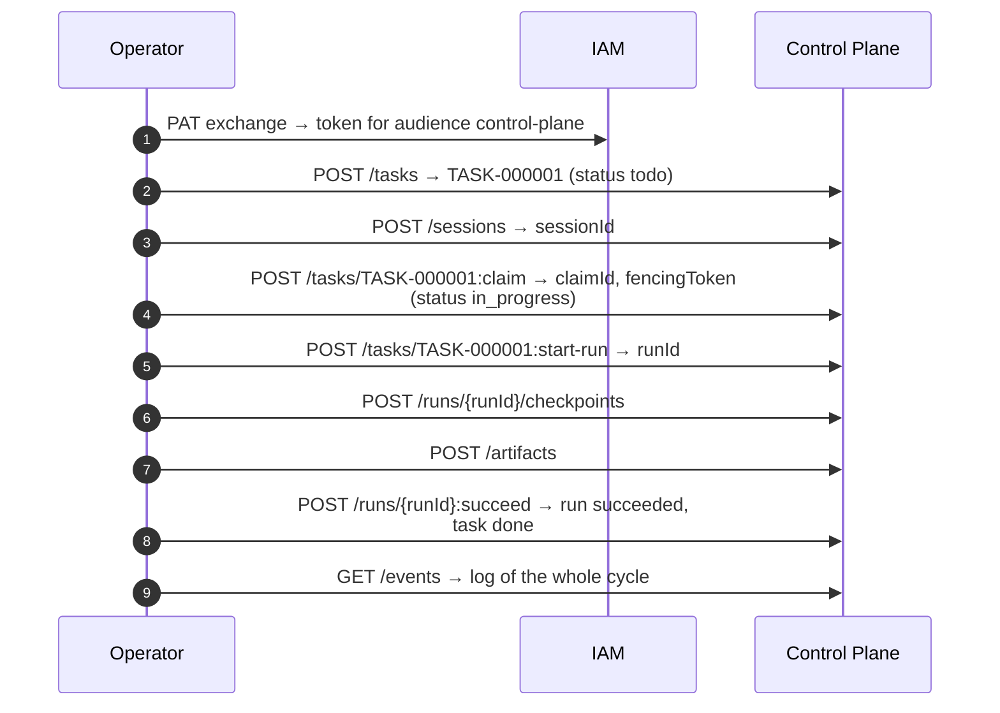

# First task

This page takes one task through the full execution cycle (creation, claim,
run, checkpoint, artifact, completion) in three ways: directly through the
HTTP API (`curl`), through the `control-plane` CLI, and through the Control
Plane MCP server in Claude Code. It assumes the stack is up and bootstrap has
run ([Installation and first launch](quickstart.md)).

## What happens



The examples use the domain task type `devops` with the fields `environment`
and `components`; this is what a type installed by its own catalog package
looks like (see [Catalog packages](../control-plane/catalog-packages.md)). A
clean installation does not have it: remove `typeKey` and `customFields` from
the request, and the system type `task` applies, with the same key statuses.

## Method 1. HTTP API

### Setting up variables

```bash
CP=http://127.0.0.1:18000
IAM=http://127.0.0.1:18010
STATE=deploy/state/taimen.json
WS=$(jq -r .workspaceId "$STATE")

TOKEN=$(curl -s -X POST "$IAM/api/v1/platform-access-tokens:exchange" \
  -H 'Content-Type: application/json' \
  -d "{\"token\": \"$(cat secrets/harness-pat)\", \"audience\": \"control-plane\"}" \
  | jq -r .accessToken)
AUTH="Authorization: Bearer $TOKEN"
```

The token lives for 300 seconds. If any step returns `401`, repeat the
exchange; the PAT stays valid.

### 1. Create a task

```bash
curl -s -X POST "$CP/api/v1/tasks" -H "$AUTH" -H 'Content-Type: application/json' \
  -H "Idempotency-Key: $(uuidgen)" \
  -d @- <<JSON | tee /tmp/task.json | jq '{publicId, status, systemStatusCategory, typeKey, origin}'
{
  "title": "Check smoke on the local deployment",
  "description": "Run make smoke and attach the output.",
  "priority": "high",
  "typeKey": "devops",
  "workspaceId": "$WS",
  "customFields": {"environment": "local", "components": ["control-plane", "iam-service"]},
  "acceptance": [
    {"key": "smoke-ok", "kind": "deterministic",
     "description": "make smoke returns exit code 0"}
  ]
}
JSON
```

```json
{
  "publicId": "TASK-000001",
  "status": "todo",
  "systemStatusCategory": "active",
  "typeKey": "devops",
  "origin": { "kind": "human", "evidence": [] }
}
```

Things to note:

- `status` is the type's initial status (`initialStatus`), and its category is `active`;
- `origin` was not passed: the core derived it from the kind of the writing principal (`human`);
- `customFields` are validated against the `fieldSchema` of the `devops` type
  (for example, `environment` accepts only values from the type's enumeration);
- `Idempotency-Key` protects against duplicates when a request is retried.

Where the task can move next:

```bash
curl -s "$CP/api/v1/tasks/TASK-000001/transitions" -H "$AUTH" | jq
```

### 2. Open a session

A claim is always taken within a client session:

```bash
SESSION=$(curl -s -X POST "$CP/api/v1/sessions" -H "$AUTH" -H 'Content-Type: application/json' \
  -d '{"clientName": "curl-quickstart",
       "harness": {"type": "curl", "protocolVersion": "2",
                   "capabilities": ["tasks.interactive", "checkpoints"]}}' | jq -r .id)
```

Without a heartbeat (`POST /api/v1/sessions/{id}:heartbeat`), a session lives
for `CP_SESSION_TTL_SECONDS` (300 s by default). Five minutes is enough for
this example.

### 3. Claim the task

```bash
curl -s -X POST "$CP/api/v1/tasks/TASK-000001:claim" -H "$AUTH" -H 'Content-Type: application/json' \
  -d "{\"sessionId\": \"$SESSION\", \"intent\": \"will check smoke\"}" | tee /tmp/claim.json \
  | jq '{id, status, fencingToken, expiresAt}'
CLAIM=$(jq -r .id /tmp/claim.json)
FENCE=$(jq -r .fencingToken /tmp/claim.json)
```

```json
{ "id": "<claim-id>", "status": "active", "fencingToken": 1, "expiresAt": "<time>" }
```

The task has moved to its type's `claimStatus`, `in_progress`. The lease lives
for 300 seconds; for longer work, extend it with
`POST /api/v1/claims/{id}:heartbeat`.

!!! tip "Why a claim is refused"
    If a claim is rejected, ask Control Plane for the reason:
    `GET /api/v1/tasks/TASK-000001/claimability`. The response explains what
    blocks it (an active claim by another principal, unfinished blocking tasks,
    unmet requirements, a terminal status).

### 4. Start a run

```bash
RUN=$(curl -s -X POST "$CP/api/v1/tasks/TASK-000001:start-run" -H "$AUTH" \
  -H 'Content-Type: application/json' \
  -d "{\"claimId\": \"$CLAIM\", \"fencingToken\": $FENCE}" | jq -r .id)
```

`claimId` and `fencingToken` are required: a run starts only under a live
claim with a current token.

### 5. Record a checkpoint and an artifact

```bash
curl -s -X POST "$CP/api/v1/runs/$RUN/checkpoints" -H "$AUTH" -H 'Content-Type: application/json' \
  -d '{"kind": "progress", "data": {"step": "smoke", "note": "running make smoke"}}' | jq '{seq, kind}'

curl -s -X POST "$CP/api/v1/artifacts" -H "$AUTH" -H 'Content-Type: application/json' \
  -d "{\"type\": \"report\", \"name\": \"smoke-output\", \"task\": \"TASK-000001\",
       \"runId\": \"$RUN\",
       \"content\": {\"text\": \"iam-service OK 200; control-plane-api OK 200; memory-service OK 200\"}}" \
  | jq '{id, type, name}'
```

A checkpoint enables resumption: if the run is interrupted, the next executor
reads the checkpoints from `GET /api/v1/runs/{id}/context`. An artifact is a
result of the work that you can later reference as evidence.

### 6. Complete

```bash
curl -s -X POST "$CP/api/v1/runs/$RUN:succeed" -H "$AUTH" -H 'Content-Type: application/json' \
  -d '{"output": {"summary": "smoke is green"}}' \
  | jq '{run: .run.status, task: .task.status, category: .task.systemStatusCategory}'
```

```json
{ "run": "succeeded", "task": "done", "category": "terminal_success" }
```

By default, `:succeed` atomically completes the task as well
(`completeTask: true`), moving it to the type's `completionStatus`, and
releases the claim. Pass `"completeTask": false` if the task must stay open,
for example for another attempt or a review.

!!! note "Failure and suspension"
    To report a genuine failure, use `POST /api/v1/runs/{id}:fail` with
    `failureReason`: the claim is kept, and you can start another run. To
    suspend until a human decides, use `:suspend` with `waitingForApprovalId`.
    See [Execution: claims and runs](../control-plane/execution.md).

### 7. View the log

```bash
TASK_ID=$(jq -r .id /tmp/task.json)
curl -s "$CP/api/v1/events?entityType=task&entityId=$TASK_ID" -H "$AUTH" \
  | jq -r '.items[] | "\(.occurredAt)  \(.type)"'
```

```text
…  task.created
…  task.claimed
…  task.completed
```

The full log for all entities is at `GET /api/v1/events?tail=20` (it also
includes `session.opened`, `run.started`, `run.checkpointed`,
`artifact.created`, `run.succeeded`). `context-adapter` delivers the same
events to the tenant's memory.

## Method 2. The `control-plane` CLI

The CLI is part of the `control-plane` package and is installed as a uv tool
from the submodule (`platform-auth-sdk` must sit next to it as a path
dependency):

```bash
uv tool install ./services/control-plane
control-plane --version
```

### Connecting

The CLI (like the MCP server) looks for a credential in this order: the IAM
identity, if `CONTROL_PLANE_IAM_URL` is set, then the legacy key. The simplest
option for a local deployment is to pass the PAT in an environment variable:

```bash
export CONTROL_PLANE_SERVER=http://127.0.0.1:18000
export CONTROL_PLANE_IAM_URL=http://127.0.0.1:18010
export CONTROL_PLANE_IAM_TENANT=$(jq -r .iamTenantId deploy/state/taimen.json)
export IAM_CREDENTIAL_MODE=environment
export IAM_PLATFORM_ACCESS_TOKEN=$(cat secrets/harness-pat)

control-plane whoami
```

!!! warning "`IAM_PLATFORM_ACCESS_TOKEN` requires `IAM_CREDENTIAL_MODE`"
    A PAT from an environment variable is accepted only together with
    `IAM_CREDENTIAL_MODE=environment` (or `ci`); otherwise the client returns
    `iam_environment_mode_required`. This way, an inherited variable cannot
    silently replace the developer's credential.

The persistent option is the file `~/.config/iam/credentials.json` with mode
`600`. The entry key is `<CONTROL_PLANE_IAM_URL>|<tenant-id>|<iam-principal-id>`:

```json
{
  "http://127.0.0.1:18010|<tenant-id>|<iam-principal-id>": {
    "token": "<contents of secrets/harness-pat>",
    "principalId": "<iam-principal-id>"
  }
}
```

If the file contains several credentials for the same tenant, the process
must identify itself with the variable `IAM_PRINCIPAL=<iam-principal-id>`;
otherwise it gets `iam_credential_ambiguous`. On macOS, the client checks the
Keychain first (service `iam.platform-access-token`); to disable this, set
`IAM_NO_KEYCHAIN=1`.

!!! note "The entry key matches the IAM address, not the issuer"
    Bootstrap prints a hint with a key based on the issuer
    (`http://taimen.localhost/iam|…`). That key works if
    `CONTROL_PLANE_IAM_URL=http://taimen.localhost/iam` (through Caddy). When
    you reach IAM directly by port, the key starts with
    `http://127.0.0.1:18010`.

### The cycle through the CLI

The CLI does not create tasks: create one through the API (method 1) or MCP
(method 3). Then:

```bash
control-plane work list                          # work available to the principal
control-plane task get TASK-000002
control-plane task claimability TASK-000002
control-plane task claim TASK-000002 --intent "taking it"
# → {"sessionId": "...", "claim": {"id": "<claim-id>", "fencingToken": 1, ...}}
control-plane run start TASK-000002 --claim <claim-id> --fencing-token 1
control-plane artifact add --type report --name smoke-output --task TASK-000002 --run <run-id>
control-plane run status <run-id>
control-plane events tail --replay 10            # Ctrl+C to exit
```

`task claim` opens its own CLI session and **does not send heartbeats**: you
have the session and claim TTL (5 minutes by default) to start and finish the
run. You complete the run through the API (`:succeed`) or MCP
(`cp_complete_run`). The full command list is in
[CLI and MCP server](../control-plane/cli-and-mcp.md).

## Method 3. MCP server in Claude Code

The `control-plane-mcp` MCP server is installed by the same
`uv tool install ./services/control-plane` and runs over stdio. It maintains the
session and the claim heartbeat itself, and its permissions are those of the
operator's PAT.

### Connecting

```bash
claude mcp add control-plane \
  -e CONTROL_PLANE_SERVER=http://127.0.0.1:18000 \
  -e CONTROL_PLANE_IAM_URL=http://127.0.0.1:18010 \
  -e CONTROL_PLANE_IAM_TENANT=<tenant-id> \
  -e CONTROL_PLANE_HARNESS_TYPE=claude-code \
  -- control-plane-mcp
```

The credential comes from `~/.config/iam/credentials.json` (see above) or from
the pair `IAM_CREDENTIAL_MODE=environment` + `IAM_PLATFORM_ACCESS_TOKEN`
passed with `-e`. Verify it in a Claude Code session: ask it to call
`cp_whoami`.

Instead of `CONTROL_PLANE_SERVER`, you can put a `.control-plane/config.json`
file in the repository (`control-plane init --server … --workspace …
--project …`); then the MCP server knows the repository's project and creates
tasks in its workspace.

### The cycle in a conversation

The MCP server's tools are designed for work with human confirmation: the
descriptions of `cp_create_task`, `cp_claim_task`, and `cp_complete_run`
require an explicit user decision. A typical conversation:

| Operator says | Tool | What happens |
|---|---|---|
| "Show me who I am and what I can access" | `cp_whoami`, `cp_list_work` | identity, permissions, available tasks |
| "Create a devops task: check smoke on the local deployment, environment=local" | `cp_list_task_types`, `cp_create_task` | task `TASK-000003` in status `todo` |
| "I'm taking TASK-000003" | `cp_claim_task` | session + claim; the MCP server keeps the heartbeat |
| "Start" | `cp_start_run` | a run under the current claim |
| — | `cp_checkpoint`, `cp_record_action` | progress and action audit |
| "Attach the smoke output" | `cp_create_artifact` | an artifact for the task and run |
| "Done, close it" | `cp_complete_run` | run `succeeded`, task `done`, claim released |

If a tool returns `stale_claim`, `task_already_claimed`, or `run_not_active`,
ownership of the task is lost: the MCP server advises you to reread
`cp_context` and not to repeat the write. For details on the plugin and
everyday work, see [MCP plugin for Claude Code](../operator/mcp-plugin.md).

## What's next

| I want to | Go to |
|---|---|
| Set up my own task types and statuses | [Task types and statuses](../control-plane/task-types.md), [Catalog packages](../control-plane/catalog-packages.md) |
| Link tasks to goals and evidence | [Goals, acceptance, and evidence](../control-plane/goals-and-evidence.md) |
| Add an approval before completion | [Approvals](../control-plane/approvals.md) |
| Hand a task to an autonomous agent | [Agents and runner](../runner/index.md) |
| Give an agent context from memory | [Task context and memory](../control-plane/context.md) |

## Common problems

| Symptom | Cause | Fix |
|---|---|---|
| `401` on any request to Control Plane | the token expired (300 s) or was exchanged from the wrong PAT | repeat the exchange |
| `403 scope_not_allowed` on exchange | a scope outside the PAT ceiling was requested, or without the prefix (`read` instead of `control-plane:read`) | request correct scopes or omit `scopes` |
| `stale_claim` on `start-run` or `:succeed` | the claim expired or was taken over; the fencing token is stale | claim the task again; for longer work, send heartbeats |
| `422` when creating a task with `customFields` | the fields do not pass the type's `fieldSchema` | `GET /api/v1/task-types/{id}` to see the schema |
| CLI: `no credentials for …` | `CONTROL_PLANE_IAM_URL` is not set or the PAT was not found | the variables from the "Connecting" section |
| CLI/MCP: `iam_credentials_file_permissions` | `credentials.json` has permissions wider than `600` | `chmod 600 ~/.config/iam/credentials.json` |

## See also

- [Work model](../control-plane/work-model.md)
- [Execution: claims and runs](../control-plane/execution.md)
- [Harness protocol](../control-plane/harness-protocol.md)
- [Control Plane API](../control-plane/api.md)
- [Execution and runner (troubleshooting)](../troubleshooting/runner.md)
