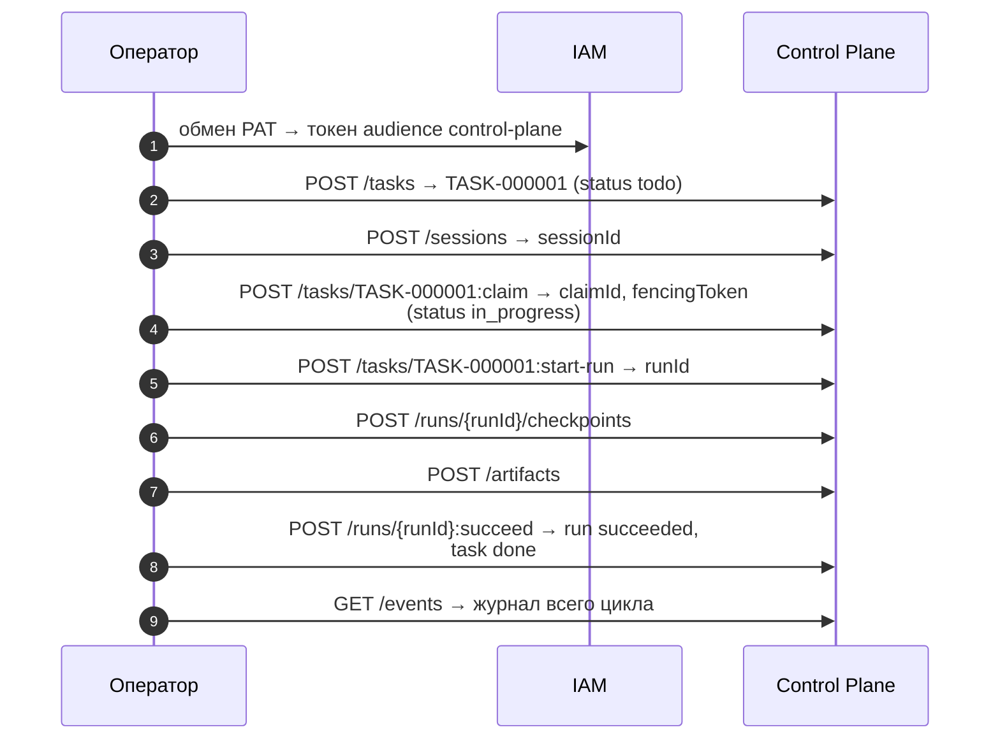

# Первая задача

Статья проводит одну задачу через полный цикл исполнения — создание, claim,
run, checkpoint, артефакт, завершение — тремя способами: напрямую через HTTP API
(`curl`), через CLI `control-plane` и через MCP-сервер Control Plane в Claude
Code. Предполагается, что стек поднят и bootstrap выполнен
([Установка и первый запуск](quickstart.md)).

## Что произойдёт



В примерах используется доменный тип задачи `devops` с полями `environment` и
`components` — так выглядит тип, который ставится своим пакетом каталога (см.
[Пакеты каталога](../control-plane/catalog-packages.md)). На чистой установке
его нет: уберите из запроса `typeKey` и `customFields` — тогда применится
системный тип `task` с теми же ключевыми статусами.

## Способ 1. HTTP API

### Подготовка переменных

```bash
CP=http://127.0.0.1:18000
IAM=http://127.0.0.1:18010
STATE=deploy/state/taimen.json
WS=$(jq -r .workspaceId "$STATE")

TOKEN=$(curl -s -X POST "$IAM/api/v1/platform-access-tokens:exchange" \
  -H 'Content-Type: application/json' \
  -d "{\"token\": \"$(cat secrets/harness-pat)\", \"audience\": \"control-plane\"}" \
  | jq -r .accessToken)
AUTH="Authorization: Bearer $TOKEN"
```

Токен живёт 300 секунд. Если на каком-то шаге пришёл `401`, повторите обмен —
PAT остаётся действительным.

### 1. Создать задачу

```bash
curl -s -X POST "$CP/api/v1/tasks" -H "$AUTH" -H 'Content-Type: application/json' \
  -H "Idempotency-Key: $(uuidgen)" \
  -d @- <<JSON | tee /tmp/task.json | jq '{publicId, status, systemStatusCategory, typeKey, origin}'
{
  "title": "Проверить smoke локального стенда",
  "description": "Выполнить make smoke и приложить вывод.",
  "priority": "high",
  "typeKey": "devops",
  "workspaceId": "$WS",
  "customFields": {"environment": "local", "components": ["control-plane", "iam-service"]},
  "acceptance": [
    {"key": "smoke-ok", "kind": "deterministic",
     "description": "make smoke возвращает код 0"}
  ]
}
JSON
```

```json
{
  "publicId": "TASK-000001",
  "status": "todo",
  "systemStatusCategory": "active",
  "typeKey": "devops",
  "origin": { "kind": "human", "evidence": [] }
}
```

Что стоит отметить:

- `status` — начальный статус типа (`initialStatus`), категория — `active`;
- `origin` не передан — ядро вывело его по виду пишущего principal (`human`);
- `customFields` проверены по `fieldSchema` типа `devops` (например,
  `environment` принимает только значения из перечисления типа);
- `Idempotency-Key` защищает от дубля при повторе запроса.

Куда задача может перейти дальше:

```bash
curl -s "$CP/api/v1/tasks/TASK-000001/transitions" -H "$AUTH" | jq
```

### 2. Открыть сессию

Claim всегда берётся в рамках сессии клиента:

```bash
SESSION=$(curl -s -X POST "$CP/api/v1/sessions" -H "$AUTH" -H 'Content-Type: application/json' \
  -d '{"clientName": "curl-quickstart",
       "harness": {"type": "curl", "protocolVersion": "2",
                   "capabilities": ["tasks.interactive", "checkpoints"]}}' | jq -r .id)
```

Сессия живёт `CP_SESSION_TTL_SECONDS` (по умолчанию 300 с) без heartbeat
(`POST /api/v1/sessions/{id}:heartbeat`). Для этого примера пяти минут хватит.

### 3. Взять задачу (claim)

```bash
curl -s -X POST "$CP/api/v1/tasks/TASK-000001:claim" -H "$AUTH" -H 'Content-Type: application/json' \
  -d "{\"sessionId\": \"$SESSION\", \"intent\": \"проверю smoke\"}" | tee /tmp/claim.json \
  | jq '{id, status, fencingToken, expiresAt}'
CLAIM=$(jq -r .id /tmp/claim.json)
FENCE=$(jq -r .fencingToken /tmp/claim.json)
```

```json
{ "id": "<claim-id>", "status": "active", "fencingToken": 1, "expiresAt": "<время>" }
```

Задача перешла в `claimStatus` своего типа — `in_progress`. Аренда живёт 300
секунд; для долгой работы продлевайте её
`POST /api/v1/claims/{id}:heartbeat`.

!!! tip "Почему нельзя взять"
    Если claim отвергнут, спросите у Control Plane причину:
    `GET /api/v1/tasks/TASK-000001/claimability` — ответ объясняет, что мешает
    (активный claim другого principal, незавершённые блокирующие задачи,
    неудовлетворённые requirements, терминальный статус).

### 4. Начать run

```bash
RUN=$(curl -s -X POST "$CP/api/v1/tasks/TASK-000001:start-run" -H "$AUTH" \
  -H 'Content-Type: application/json' \
  -d "{\"claimId\": \"$CLAIM\", \"fencingToken\": $FENCE}" | jq -r .id)
```

`claimId` и `fencingToken` обязательны: run стартует только под живым claim с
актуальным токеном.

### 5. Записать checkpoint и артефакт

```bash
curl -s -X POST "$CP/api/v1/runs/$RUN/checkpoints" -H "$AUTH" -H 'Content-Type: application/json' \
  -d '{"kind": "progress", "data": {"step": "smoke", "note": "запускаю make smoke"}}' | jq '{seq, kind}'

curl -s -X POST "$CP/api/v1/artifacts" -H "$AUTH" -H 'Content-Type: application/json' \
  -d "{\"type\": \"report\", \"name\": \"smoke-output\", \"task\": \"TASK-000001\",
       \"runId\": \"$RUN\",
       \"content\": {\"text\": \"iam-service OK 200; control-plane-api OK 200; memory-service OK 200\"}}" \
  | jq '{id, type, name}'
```

Checkpoint нужен для возобновления: если run прервётся, следующий исполнитель
прочитает checkpoints в `GET /api/v1/runs/{id}/context`. Артефакт — результат
работы, на который потом можно сослаться как на evidence.

### 6. Завершить

```bash
curl -s -X POST "$CP/api/v1/runs/$RUN:succeed" -H "$AUTH" -H 'Content-Type: application/json' \
  -d '{"output": {"summary": "smoke зелёный"}}' \
  | jq '{run: .run.status, task: .task.status, category: .task.systemStatusCategory}'
```

```json
{ "run": "succeeded", "task": "done", "category": "terminal_success" }
```

По умолчанию `:succeed` атомарно завершает и задачу (`completeTask: true`),
переводя её в `completionStatus` типа, и освобождает claim. Передайте
`"completeTask": false`, если задача должна остаться открытой — например, для
следующей попытки или ревью.

!!! note "Провал и приостановка"
    Честный провал — `POST /api/v1/runs/{id}:fail` с `failureReason`: claim
    сохраняется, можно начать следующий run. Приостановка до решения человека —
    `:suspend` с `waitingForApprovalId`. См.
    [Исполнение — claims и runs](../control-plane/execution.md).

### 7. Посмотреть журнал

```bash
TASK_ID=$(jq -r .id /tmp/task.json)
curl -s "$CP/api/v1/events?entityType=task&entityId=$TASK_ID" -H "$AUTH" \
  | jq -r '.items[] | "\(.occurredAt)  \(.type)"'
```

```text
…  task.created
…  task.claimed
…  task.completed
```

Полный журнал всех сущностей — `GET /api/v1/events?tail=20` (там же
`session.opened`, `run.started`, `run.checkpointed`, `artifact.created`,
`run.succeeded`). Эти же события `context-adapter` доставит в память tenant.

## Способ 2. CLI `control-plane`

CLI входит в пакет `control-plane` и ставится как uv-инструмент из сабмодуля
(рядом должен лежать `platform-auth-sdk` — path-зависимость):

```bash
uv tool install ./services/control-plane
control-plane --version
```

### Подключение

CLI (как и MCP-сервер) ищет credential в таком порядке: IAM-identity, если
задан `CONTROL_PLANE_IAM_URL`, затем legacy-ключ. Самый простой способ для
локального стенда — передать PAT переменной окружения:

```bash
export CONTROL_PLANE_SERVER=http://127.0.0.1:18000
export CONTROL_PLANE_IAM_URL=http://127.0.0.1:18010
export CONTROL_PLANE_IAM_TENANT=$(jq -r .iamTenantId deploy/state/taimen.json)
export IAM_CREDENTIAL_MODE=environment
export IAM_PLATFORM_ACCESS_TOKEN=$(cat secrets/harness-pat)

control-plane whoami
```

!!! warning "`IAM_PLATFORM_ACCESS_TOKEN` требует `IAM_CREDENTIAL_MODE`"
    PAT из переменной окружения принимается только вместе с
    `IAM_CREDENTIAL_MODE=environment` (или `ci`); иначе клиент отвечает
    `iam_environment_mode_required`. Так унаследованная переменная не может
    молча подменить credential разработчика.

Постоянный вариант — файл `~/.config/iam/credentials.json` с правами `600`.
Ключ записи — `<CONTROL_PLANE_IAM_URL>|<tenant-id>|<iam-principal-id>`:

```json
{
  "http://127.0.0.1:18010|<tenant-id>|<iam-principal-id>": {
    "token": "<содержимое secrets/harness-pat>",
    "principalId": "<iam-principal-id>"
  }
}
```

Если в файле несколько credential одного tenant, процесс должен объявить себя
переменной `IAM_PRINCIPAL=<iam-principal-id>`, иначе получит
`iam_credential_ambiguous`. На macOS клиент сначала смотрит в Keychain (сервис
`iam.platform-access-token`); отключить — `IAM_NO_KEYCHAIN=1`.

!!! note "Ключ записи совпадает с адресом IAM, а не с issuer"
    Bootstrap печатает подсказку с ключом на основе issuer
    (`http://taimen.localhost/iam|…`). Такой ключ подходит, если
    `CONTROL_PLANE_IAM_URL=http://taimen.localhost/iam` (через Caddy). При
    обращении к IAM напрямую по порту ключ начинается с
    `http://127.0.0.1:18010`.

### Цикл через CLI

CLI не создаёт задачи — создайте её через API (способ 1) или MCP (способ 3).
Дальше:

```bash
control-plane work list                          # доступная principal работа
control-plane task get TASK-000002
control-plane task claimability TASK-000002
control-plane task claim TASK-000002 --intent "беру"
# → {"sessionId": "...", "claim": {"id": "<claim-id>", "fencingToken": 1, ...}}
control-plane run start TASK-000002 --claim <claim-id> --fencing-token 1
control-plane artifact add --type report --name smoke-output --task TASK-000002 --run <run-id>
control-plane run status <run-id>
control-plane events tail --replay 10            # Ctrl+C для выхода
```

`task claim` открывает собственную сессию CLI и **не шлёт heartbeat**: у вас
есть TTL сессии и claim (по умолчанию 5 минут), чтобы начать и завершить run.
Завершение run выполняется через API (`:succeed`) или MCP (`cp_complete_run`).
Полный список команд — [CLI и MCP-сервер](../control-plane/cli-and-mcp.md).

## Способ 3. MCP-сервер в Claude Code

MCP-сервер `control-plane-mcp` ставится тем же `uv tool install ./services/control-plane`
и работает по stdio. Он держит сессию и heartbeat claim сам, а права — те же,
что у PAT оператора.

### Подключение

```bash
claude mcp add control-plane \
  -e CONTROL_PLANE_SERVER=http://127.0.0.1:18000 \
  -e CONTROL_PLANE_IAM_URL=http://127.0.0.1:18010 \
  -e CONTROL_PLANE_IAM_TENANT=<tenant-id> \
  -e CONTROL_PLANE_HARNESS_TYPE=claude-code \
  -- control-plane-mcp
```

Credential берётся из `~/.config/iam/credentials.json` (см. выше) или из пары
`IAM_CREDENTIAL_MODE=environment` + `IAM_PLATFORM_ACCESS_TOKEN`, переданной
через `-e`. Проверьте в сессии Claude Code: попросите вызвать `cp_whoami`.

Вместо `CONTROL_PLANE_SERVER` можно положить в репозиторий файл
`.control-plane/config.json` (`control-plane init --server … --workspace …
--project …`) — тогда MCP-сервер знает проект этого репозитория и создаёт
задачи в его workspace.

### Цикл в диалоге

Инструменты MCP-сервера рассчитаны на работу с подтверждением человека:
описания `cp_create_task`, `cp_claim_task` и `cp_complete_run` требуют явного
решения пользователя. Типичный диалог:

| Реплика оператора | Инструмент | Что происходит |
|---|---|---|
| «Покажи, кто я и что мне доступно» | `cp_whoami`, `cp_list_work` | identity, права, доступные задачи |
| «Создай задачу типа devops: проверить smoke локального стенда, environment=local» | `cp_list_task_types`, `cp_create_task` | задача `TASK-000003` в статусе `todo` |
| «Беру TASK-000003» | `cp_claim_task` | сессия + claim; heartbeat держит MCP-сервер |
| «Начинай» | `cp_start_run` | run под текущим claim |
| — | `cp_checkpoint`, `cp_record_action` | прогресс и аудит действий |
| «Приложи вывод smoke» | `cp_create_artifact` | артефакт к задаче и run |
| «Готово, закрывай» | `cp_complete_run` | run `succeeded`, задача `done`, claim освобождён |

Если инструмент вернул `stale_claim`, `task_already_claimed` или
`run_not_active`, владение задачей потеряно: MCP-сервер подсказывает
перечитать `cp_context` и не повторять запись. Подробно о плагине и
повседневной работе — [MCP-плагин для Claude Code](../operator/mcp-plugin.md).

## Что дальше

| Хочу | Куда |
|---|---|
| Настроить свои типы задач и статусы | [Типы задач и статусы](../control-plane/task-types.md), [Пакеты каталога](../control-plane/catalog-packages.md) |
| Связать задачи с целями и evidence | [Цели, приёмка и evidence](../control-plane/goals-and-evidence.md) |
| Добавить approval перед завершением | [Approvals](../control-plane/approvals.md) |
| Отдать задачу автономному агенту | [Агенты и runner](../runner/index.md) |
| Дать агенту контекст из памяти | [Контекст задачи и память](../control-plane/context.md) |

## Типичные проблемы

| Симптом | Причина | Решение |
|---|---|---|
| `401` на любом запросе к Control Plane | токен истёк (300 с) или обмен делался не тем PAT | повторить обмен |
| `403 scope_not_allowed` при обмене | запрошен scope вне потолка PAT или без префикса (`read` вместо `control-plane:read`) | запросить корректные scopes или не передавать `scopes` |
| `stale_claim` при `start-run` или `:succeed` | claim истёк или перехвачен, fencing token устарел | взять задачу заново; для долгой работы — heartbeat |
| `422` при создании задачи с `customFields` | поля не проходят `fieldSchema` типа | `GET /api/v1/task-types/{id}` — посмотреть схему |
| CLI: `no credentials for …` | не задан `CONTROL_PLANE_IAM_URL` или не найден PAT | переменные из раздела «Подключение» |
| CLI/MCP: `iam_credentials_file_permissions` | у `credentials.json` права шире `600` | `chmod 600 ~/.config/iam/credentials.json` |

## См. также

- [Модель работы](../control-plane/work-model.md)
- [Исполнение — claims и runs](../control-plane/execution.md)
- [Харнесс-протокол](../control-plane/harness-protocol.md)
- [API Control Plane](../control-plane/api.md)
- [Исполнение и runner — диагностика](../troubleshooting/runner.md)
