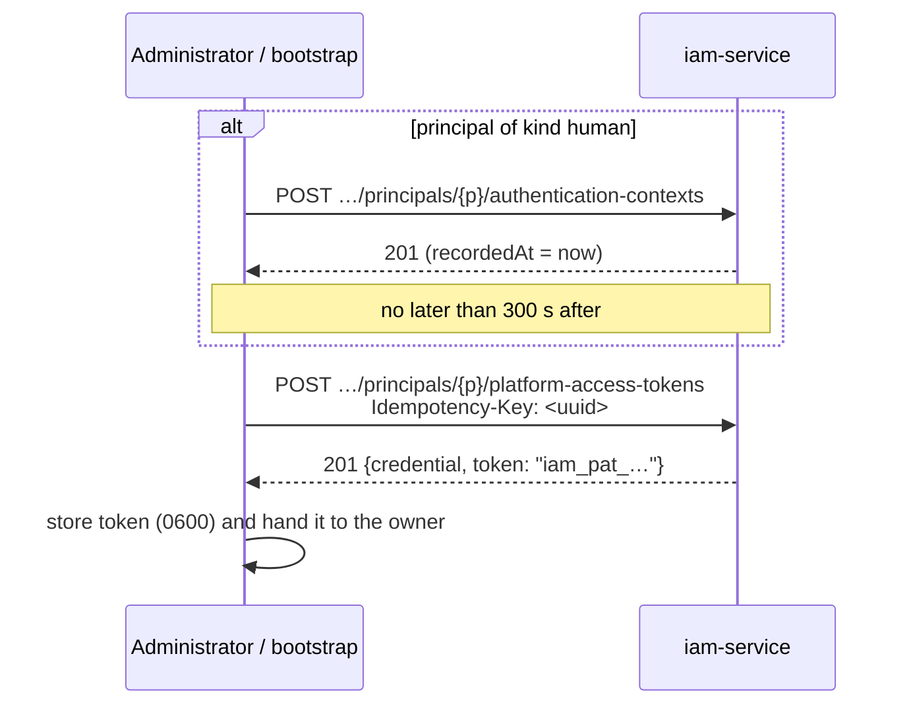
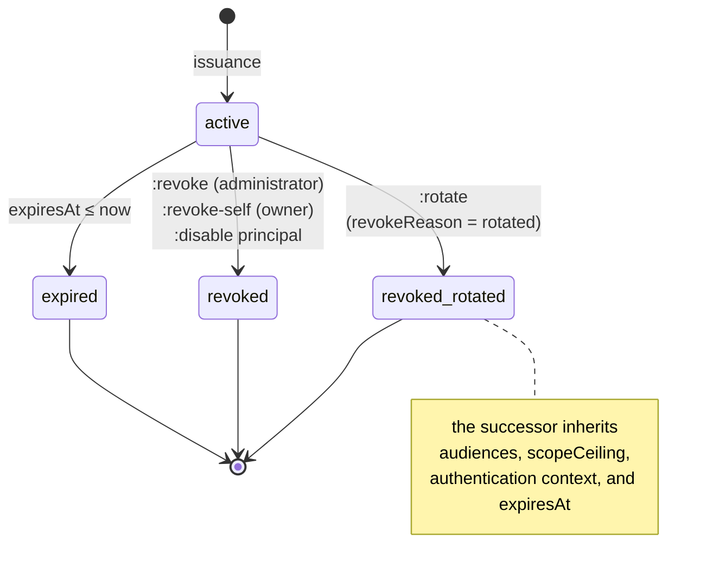

# Credentials and PAT

This article covers the long-lived credentials of people and agents, the
Platform Access Token (PAT): how it is structured, how to issue, rotate, and
revoke it, where it is stored on the user's machine, and how a client picks
the right one. It is for administrators who grant access and for engineers who
set up a local harness or a runner.

## What a PAT is

A Platform Access Token is a principal-bound credential for a local harness
(MCP plugin, CLI, Human Harness) and for an autonomous agent. The main rule:
**a PAT is presented only to IAM**, and only in the request body. It is never
passed to any resource service; instead, the service receives a short-lived
access token for its own audience (see [Tokens](tokens.md)).

```text
iam_pat_<public-prefix>_<secret>
        └── 12 hex ──┘ └ 32 random bytes (base64url) ┘
```

| Property | Value |
|---|---|
| Who can hold one | a principal of kind `human` or `agent` |
| What the server stores | `public_prefix` (for lookup) and the SHA-256 of the full token; the secret itself cannot be recovered |
| When the secret is visible | exactly once, in the issuance or rotation response |
| Default lifetime | `IAM_PAT_DEFAULT_TTL_SECONDS` = 2,592,000 s (30 days) |
| Maximum lifetime | `IAM_PAT_MAX_TTL_SECONDS` = 31,536,000 s (365 days) |
| Minimum lifetime in a request | 60 s |
| Authority ceiling | `audiences` + `scopeCeiling`; only narrows authority |

Service accounts and workloads do not get PATs: services have their own flow,
client credentials (see [Service accounts](service-accounts.md)). An attempt
to issue a PAT for them returns `422 principal_kind_not_allowed`.

### The PAT record

| Response field | Description |
|---|---|
| `id` | `credential_id`; goes into the `credential_id` claim of the access token |
| `tenantId`, `principalId` | owner |
| `name` | human-readable name, 1–200 characters |
| `kind` | `platform_access_token` (or `legacy_control_plane_api_key`, see below) |
| `publicPrefix` | non-secret prefix; safe to show in logs and UI |
| `audiences` | services for which the PAT can be exchanged |
| `scopeCeiling` | the maximum scopes obtainable by exchange |
| `createdAt`, `expiresAt`, `lastUsedAt` | issuance time, expiration time, and last exchange time |
| `revokedAt`, `revokeReason` | revocation |
| `rotatedFromId` | predecessor in a rotation |

## Issuing a PAT

Issuance is an administrative operation (header `X-IAM-Bootstrap-Token`).



### Step 1 (humans only): authentication context

A PAT is issued to a human only with a confirmed **recent** sign-in. The fact
of sign-in is stored as an authentication context. Normally, federated sign-in
writes it ([Federation](federation.md)); for bootstrap and operations, there is
an administrative endpoint:

```bash
curl -s -X POST \
  "$IAM_URL/api/v1/tenants/$TENANT/principals/$PRINCIPAL/authentication-contexts" \
  -H "X-IAM-Bootstrap-Token: $IAM_BOOTSTRAP_TOKEN" -H 'Content-Type: application/json' \
  -d '{"issuer":"https://platform.example.com/iam","acr":"bootstrap","amr":["bootstrap-script"]}'
```

```json
{
  "id": "<context-id>",
  "principalId": "<principal-id>",
  "issuer": "https://platform.example.com/iam",
  "acr": "bootstrap",
  "amr": ["bootstrap-script"],
  "authTime": "2026-01-15T10:05:00Z",
  "recordedAt": "2026-01-15T10:05:00Z",
  "source": "bootstrap"
}
```

| Request field | Required | Description |
|---|---|---|
| `issuer` | yes | Who confirmed the sign-in (1–500 characters) |
| `acr` | no | Authentication level; goes into the `acr` claim |
| `amr` | no | Authentication methods |
| `authTime` | no | Sign-in moment; a time in the future is clamped to server time |
| `externalIdentityId` | no | Linked external identity |

Freshness rules:

- the principal's **latest** context in the tenant is used;
- freshness is measured by the server-side `recordedAt`, not by `authTime`,
  so an old IdP session cannot pass as a new one by supplying an `authTime`;
- the allowed age is `IAM_PAT_MAX_AUTHENTICATION_AGE_SECONDS` (300 s).

Issuance errors: no context gives `403 authentication_context_required`; a
context older than the window gives `403 authentication_context_expired`. For a
non-human, the context endpoint returns `422 human_principal_required`.

!!! note "An agent does not need a context"
    An autonomous agent has no human sign-in, and there is nothing to imitate
    one with. An agent's PAT is issued without a context, and the PAT record
    stores an honest snapshot `{"source": "agent_bootstrap", "issuedBy": "bootstrap", "recordedAt": …}`.
    That is why an agent's access token has no `auth_time` or `acr`, and
    `principal_type` is `agent`: services can tell its sessions apart from
    human ones.

### Step 2: issuance

```bash
curl -s -X POST \
  "$IAM_URL/api/v1/tenants/$TENANT/principals/$PRINCIPAL/platform-access-tokens" \
  -H "X-IAM-Bootstrap-Token: $IAM_BOOTSTRAP_TOKEN" \
  -H "Idempotency-Key: $(uuidgen)" \
  -H 'Content-Type: application/json' \
  -d '{
        "name": "harness-alice",
        "audiences": ["control-plane"],
        "scopeCeiling": ["control-plane:read", "control-plane:write"],
        "expiresInSeconds": 15552000
      }'
```

```json
{
  "credential": {
    "id": "<credential-id>",
    "tenantId": "<tenant-id>",
    "principalId": "<principal-id>",
    "name": "harness-alice",
    "kind": "platform_access_token",
    "publicPrefix": "<prefix>",
    "audiences": ["control-plane"],
    "scopeCeiling": ["control-plane:read", "control-plane:write"],
    "createdAt": "2026-01-15T10:05:10Z",
    "expiresAt": "2026-07-14T10:05:10Z",
    "lastUsedAt": null,
    "revokedAt": null,
    "revokeReason": "",
    "rotatedFromId": null
  },
  "token": "iam_pat_<prefix>_<secret>"
}
```

| Request field | Required | Rules |
|---|---|---|
| `name` | yes | 1–200 characters |
| `audiences` | yes | At least one; each must be an active audience of the tenant, otherwise `422 unknown_audience` |
| `scopeCeiling` | no | Must be within the union of `allowedScopes` of the chosen audiences, otherwise `422 invalid_scope_ceiling`. An empty ceiling means the PAT grants no scope at all |
| `expiresInSeconds` | no | ≥ 60; defaults to `IAM_PAT_DEFAULT_TTL_SECONDS`; more than `IAM_PAT_MAX_TTL_SECONDS` gives `422 expiry_too_long` |

Extra fields in the body are rejected (`422`): the client cannot "declare" a
tenant, a principal, or permissions.

### Idempotency-Key

The `Idempotency-Key` header is **required** for issuance and rotation; without
it you get `400 idempotency_key_required`. The key is unique within the tenant.

Repeating a request with the same key (for example, after a dropped
connection) returns the same record with `token: null` and the
`Idempotency-Replayed: true` header: the secret is not stored on the server
and cannot be shown again. No second credential is created.

!!! warning "A lost secret cannot be recovered"
    If the response with `token` is lost, repeating the request with the same
    `Idempotency-Key` does not return the secret. Revoke the record (`:revoke`)
    and issue a new one with a new key.

## PAT lifecycle



### Listing PATs

```bash
curl -s "$IAM_URL/api/v1/tenants/$TENANT/platform-access-tokens?principalId=$PRINCIPAL&includeRevoked=true" \
  -H "X-IAM-Bootstrap-Token: $IAM_BOOTSTRAP_TOKEN"
```

Without `includeRevoked=true`, revoked records are not returned. Expired but
unrevoked records are returned (check `expiresAt`). The response contains
neither the secret nor the hash.

### Revocation by an administrator

```bash
curl -s -X POST \
  "$IAM_URL/api/v1/tenants/$TENANT/platform-access-tokens/$CREDENTIAL:revoke?reason=leaked" \
  -H "X-IAM-Bootstrap-Token: $IAM_BOOTSTRAP_TOKEN"
# 204 No Content
```

The operation is idempotent: a repeated revocation changes nothing and also
returns `204`. Exchange of a revoked PAT stops immediately.

### Revocation by the owner (`revoke-self`)

The owner of a secret can revoke their PAT without the bootstrap token;
possession of the secret is the justification:

```bash
curl -s -X POST "$IAM_URL/api/v1/platform-access-tokens:revoke-self" \
  -H 'Content-Type: application/json' \
  -d '{"token":"iam_pat_…","reason":"logout"}'
# 204
```

A repeated call with an already revoked token returns `401 invalid_token`: the
endpoint does not confirm that the record exists. This is what
`iam auth logout --revoke` does.

### Rotation versus a new issuance

```bash
curl -s -X POST \
  "$IAM_URL/api/v1/tenants/$TENANT/platform-access-tokens/$CREDENTIAL:rotate" \
  -H "X-IAM-Bootstrap-Token: $IAM_BOOTSTRAP_TOKEN" \
  -H "Idempotency-Key: $(uuidgen)" \
  -H 'Content-Type: application/json' -d '{}'
```

| | Rotation `:rotate` | New issuance |
|---|---|---|
| What changes | the secret only | everything: audiences, ceiling, lifetime |
| `expiresAt` | inherited, **not extended** | new, counted from issuance |
| Authority ceiling | inherited, cannot be widened (the body must be empty) | set anew |
| Authentication context | copied from the predecessor; no recent sign-in needed | a human needs a recent context |
| Predecessor | revoked in the same transaction (`revokeReason: rotated`) | stays valid until revoked |
| Link | `rotatedFromId` points to the predecessor | none |

When to use which:

- **The secret may have leaked, the lifetime is fine**: `:rotate`.
- **The lifetime is running out**: only a new issuance, because rotation does
  not extend the window. For a human, first record a recent authentication
  context. Then revoke the old PAT.
- **You need to add an audience or a scope**: a new issuance.

Rotation errors: `404 credential_not_found`, `409 credential_not_active`
(revoked or expired), `404`/`409` for the tenant and principal (see the table
below).

!!! tip "Planned PAT replacement"
    Expiration dates are visible in `GET …/platform-access-tokens` (`expiresAt`)
    and in `iam auth status`. Set a reminder to reissue agent and operator PATs
    in advance: an expired agent PAT silently stops its work with an
    `invalid_token` error.

### Disabling a principal

`POST …/principals/{id}:disable` revokes **all** of the principal's PATs in one
transaction; see [Tenants and principals](principals.md).

## Checking a PAT: introspect

The owner can find out who they are signed in as and until when the token is
valid, without getting access to any service:

```bash
curl -s -X POST "$IAM_URL/api/v1/platform-access-tokens:introspect" \
  -H 'Content-Type: application/json' -d '{"token":"iam_pat_…"}'
```

```json
{
  "tenantId": "<tenant-id>",
  "principalId": "<principal-id>",
  "principalKind": "human",
  "displayName": "Alice Operator",
  "credentialId": "<credential-id>",
  "name": "harness-alice",
  "publicPrefix": "<prefix>",
  "audiences": ["control-plane"],
  "scopeCeiling": ["control-plane:read", "control-plane:write"],
  "expiresAt": "2026-07-14T10:05:10Z",
  "issuedAt": "2026-01-15T10:05:10Z"
}
```

Introspect does not update `lastUsedAt`: that field marks authority obtained,
not a status check.

### One response for any token defect

Exchange, introspect, and revoke-self check the presented PAT the same way.
Any defect (unknown prefix, wrong secret, revocation, expiration, inactive
tenant, membership, or principal) yields the same `401 invalid_token`. The
exact cause is written only to the IAM audit (`credential_revoked`,
`credential_expired`, `tenant_not_active`, `membership_not_active`,
`principal_not_active`), so the endpoint does not serve as an oracle for
guessing. The hash is computed even for a nonexistent prefix.

## Local client: `iam auth`

The reference client `iam_client` is installed with the `iam-service` package
and provides the `iam` CLI. It talks to IAM through the same public contracts
as any client and has no database access.

```bash
iam auth login                          # hidden prompt; or --stdin
iam auth status [--json]                # who is signed in, with what, and until when
iam auth session --harness claude-code  # exchange the PAT and open a Harness Session in Control Plane
iam auth logout [--revoke]              # delete the local copy (and revoke in IAM)
```

| Command | What it does |
|---|---|
| `login` | Reads the PAT from a hidden prompt (or from stdin with `--stdin` / non-TTY), calls introspect, checks the tenant and audience against the binding, and saves it |
| `status` | Finds the local PAT and runs introspect |
| `session --harness <codex or claude-code>` | Exchanges the PAT for a token of the binding's audience and opens a session `POST /api/v1/sessions` in Control Plane |
| `logout` | Deletes the local record; with `--revoke`, also calls `revoke-self` in IAM |

!!! danger "Never pass the secret as an argument"
    If the command-line arguments contain `iam_pat_` or `cp_`, the command
    refuses to run (`credential_in_argv`) before it even parses the arguments:
    an argument is visible in shell history and in the process list. Treat
    such a token as compromised and revoke it.

CLI exit codes:

| Code | Meaning |
|---|---|
| `0` | success |
| `2` | usage or binding error (`BindingError`, empty token, secret in argv) |
| `3` | not signed in or token invalid (`invalid_token`, storage errors, tenant/audience/principal mismatch) |
| `4` | IAM or Control Plane is unreachable or returned an error |

### Repository binding: `.iam/binding.json`

The CLI works only in a directory bound to IAM. The binding is searched for up
the tree from the current directory (or taken from `IAM_BINDING_FILE`) and is
committed to the repository, so it contains only non-secret metadata:

```json
{
  "iamUrl": "https://platform.example.com/iam",
  "tenantId": "<tenant-id>",
  "audience": "control-plane",
  "controlPlaneUrl": "https://platform.example.com",
  "scopes": ["control-plane:read", "control-plane:write"]
}
```

| Field | Required | Description |
|---|---|---|
| `iamUrl` | yes | http(s) address of IAM; a trailing `/` is dropped |
| `tenantId` | yes | IAM tenant |
| `audience` | no | `control-plane` by default |
| `controlPlaneUrl` | for `session` | Control Plane address |
| `scopes` | no | Which scopes to request on exchange; empty means the whole ceiling |

A binding with a field that looks like a secret (`token`, `password`, `apiKey`,
`clientSecret`, `privateKey`, `bootstrapToken`, and so on, in any case), or
with a value starting with `iam_pat_`/`cp_`, is rejected entirely
(`secret_in_binding`). A directory without a binding gets the refusal
`repository_not_bound`, not someone else's credential.

### Where the secret is stored

Source resolution order:

1. **Environment**, only if the mode is declared explicitly:
   `IAM_CREDENTIAL_MODE=environment` (or `ci`) plus `IAM_PLATFORM_ACCESS_TOKEN`.
2. **OS keychain**: macOS Keychain, service `iam.platform-access-token`
   (the secret is passed to the `security` utility through stdin). Disable it
   with `IAM_NO_KEYCHAIN=1`.
3. **File** `$XDG_CONFIG_HOME/iam/credentials.json` (by default
   `~/.config/iam/credentials.json`) with permissions `0600`.

!!! warning "A variable without the mode is an error"
    `IAM_PLATFORM_ACCESS_TOKEN` without `IAM_CREDENTIAL_MODE=environment` is a
    refusal (`environment_mode_required`; in the Control Plane client,
    `iam_environment_mode_required`), not a silent choice of source: an
    accidentally inherited variable must not replace the developer's
    credential. In environment mode, `iam auth login` saves nothing
    (`environment_mode_read_only`).

### `credentials.json` format and the record key

A record is addressed by the triple **`<iam-url>|<tenant-id>|<principal-id>`**,
where `<iam-url>` is exactly the IAM address the client works with (`iamUrl`
from the binding or `CONTROL_PLANE_IAM_URL`), without a trailing `/`.

```json
{
  "https://platform.example.com/iam|<tenant-id>|<principal-id>": {
    "token": "iam_pat_…",
    "principalId": "<principal-id>"
  },
  "principals": {
    "https://platform.example.com/iam|<tenant-id>": ["<principal-id>", "<agent-principal-id>"]
  }
}
```

- The `principals` section is an index of the machine's executors **without
  secrets**. It exists because secrets in the Keychain cannot be enumerated.
- Records in the old format, keyed by the pair `<iam-url>|<tenant-id>`, are
  read as long as the machine has a single principal for that pair.
- The file is created with `0600` from the start. A file with wider
  permissions is **not read** (`credentials_file_permissions`); this is
  treated as an incident.

### Several executors on one machine: `IAM_PRINCIPAL`

If a machine holds credentials of several principals for the same IAM + tenant
pair (for example, a coder runner and a reviewer runner under one OS user),
the process must identify itself with the variable
`IAM_PRINCIPAL=<principal-id>`. Otherwise it gets the refusal
`credential_ambiguous` (`iam_credential_ambiguous` in the Control Plane
client), not a random pick: working under someone else's identity would be
visible only in audit.

When `IAM_PRINCIPAL` is set, `iam auth login` compares it with the token owner
and refuses on a mismatch (`principal_mismatch`).

### How Control Plane clients use the PAT

The operator's MCP plugin, the runner, and other clients built on
`control-plane-client` read the same store (read-only) and are configured
with these variables:

| Variable | Purpose |
|---|---|
| `CONTROL_PLANE_IAM_URL` | IAM address; without it, IAM mode is off |
| `CONTROL_PLANE_IAM_TENANT` | IAM tenant (required when the URL is set) |
| `CONTROL_PLANE_IAM_AUDIENCE` | `control-plane` by default |
| `CONTROL_PLANE_IAM_SCOPES` | requested scopes, separated by spaces or commas |

The client exchanges the PAT on demand, caches the access token until 30 s
before it expires, and then exchanges again. Details are in
[MCP plugin](../operator/mcp-plugin.md) and
[Runner configuration](../runner/configuration.md).

## Typical scenario: granting access to an operator

```bash
# 1. principal (if it does not exist yet)
P=$(curl -s -X POST "$IAM_URL/api/v1/tenants/$TENANT/principals" -H "$BT" \
      -H 'Content-Type: application/json' \
      -d '{"kind":"human","displayName":"Alice Operator"}' | jq -r .id)

# 2. recent authentication context (the PAT must be issued within 300 s)
curl -s -X POST "$IAM_URL/api/v1/tenants/$TENANT/principals/$P/authentication-contexts" -H "$BT" \
  -H 'Content-Type: application/json' -d '{"issuer":"'"$IAM_URL"'","acr":"bootstrap"}' >/dev/null

# 3. PAT for 180 days, secret goes straight into a 0600 file
( umask 077; curl -s -X POST "$IAM_URL/api/v1/tenants/$TENANT/principals/$P/platform-access-tokens" \
    -H "$BT" -H "Idempotency-Key: $(uuidgen)" -H 'Content-Type: application/json' \
    -d '{"name":"harness-alice","audiences":["control-plane"],
         "scopeCeiling":["control-plane:read","control-plane:write"],
         "expiresInSeconds":15552000}' | jq -r .token > alice.pat )

# 4. principal binding in Control Plane (see "Authorization and permissions")
# 5. the owner, on their machine, in a bound repository:
iam auth login --stdin < alice.pat && shred -u alice.pat
```

## Compatibility with old Control Plane keys

For migration, IAM can import an existing Control Plane key
`cp_<prefix>_<secret>` as a credential of kind `legacy_control_plane_api_key`.
Only the `(keyPrefix, keyHash)` pair is transferred: the plaintext key does
not cross the service boundary, and the owner keeps presenting it as is.

```bash
curl -s -X POST "$IAM_URL/api/v1/tenants/$TENANT/legacy-credentials:import" -H "$BT" \
  -H 'Content-Type: application/json' \
  -d '{"principalId":"<principal-id>","name":"legacy-key","keyPrefix":"<12 hex>",
       "keyHash":"<64 hex sha256>","audience":"control-plane",
       "scopeCeiling":["control-plane:read"],"expiresInSeconds":2592000}'
```

The compatibility window is always bounded: `expiresInSeconds` may not exceed
`IAM_LEGACY_CREDENTIAL_MAX_TTL_SECONDS` (90 days), otherwise
`422 compatibility_window_too_long`. Other errors:
`422 invalid_credential_material`, `422 invalid_scope_ceiling`,
`409 credential_exists`.

!!! warning "Migration only"
    New installations work without legacy keys: Control Plane in the `deploy/local/compose.yml` starts with `CP_LEGACY_API_KEYS_ENABLED=false`.

## Errors

| HTTP | `detail` | Where | Cause |
|---|---|---|---|
| 400 | `idempotency_key_required` | issuance, rotation | no `Idempotency-Key` header |
| 401 | `invalid_token` | exchange, introspect, revoke-self | any PAT defect (see above) |
| 401 | `unauthorized` | administrative operations | missing or wrong `X-IAM-Bootstrap-Token` |
| 403 | `authentication_context_required` | issuance (human) | the human has no recorded sign-in |
| 403 | `authentication_context_expired` | issuance (human) | the latest sign-in is older than 300 s |
| 404 | `tenant_not_found` | issuance, rotation, context | the tenant does not exist or is disabled |
| 404 | `principal_not_found` | issuance, rotation, context | no active membership |
| 404 | `credential_not_found` | revoke, rotate | unknown `credential_id` in the tenant |
| 409 | `principal_not_active` | issuance, rotation, context | principal is `disabled`/`paused` |
| 409 | `credential_not_active` | rotate | the PAT is already revoked or expired |
| 409 | `credential_conflict` | issuance, rotation | a uniqueness conflict unrelated to idempotency |
| 422 | `principal_kind_not_allowed` | issuance | the principal is neither `human` nor `agent` |
| 422 | `human_principal_required` | authentication context | a context is recorded only for a human |
| 422 | `unknown_audience` | issuance, import | the audience is not registered or is disabled |
| 422 | `invalid_scope_ceiling` | issuance, import | the ceiling is wider than the audiences' `allowedScopes` |
| 422 | `expiry_too_long` | issuance | lifetime exceeds `IAM_PAT_MAX_TTL_SECONDS` |

Client codes of `iam auth` / `control-plane-client`: `repository_not_bound`,
`invalid_binding`, `secret_in_binding`, `credential_in_argv`,
`environment_mode_required`, `credential_ambiguous`,
`credentials_file_permissions`, `principal_mismatch`, `tenant_mismatch`,
`audience_not_allowed`, `iam_unreachable`.

## See also

- [Tokens, audiences, scopes](tokens.md): what happens during PAT exchange
- [Tenants and principals](principals.md)
- [Agent identity](../runner/agent-identity.md)
- [MCP plugin for Claude Code](../operator/mcp-plugin.md)
- [Secrets and rotation](../operations/secrets.md)
- [IAM API](api.md#pat)
