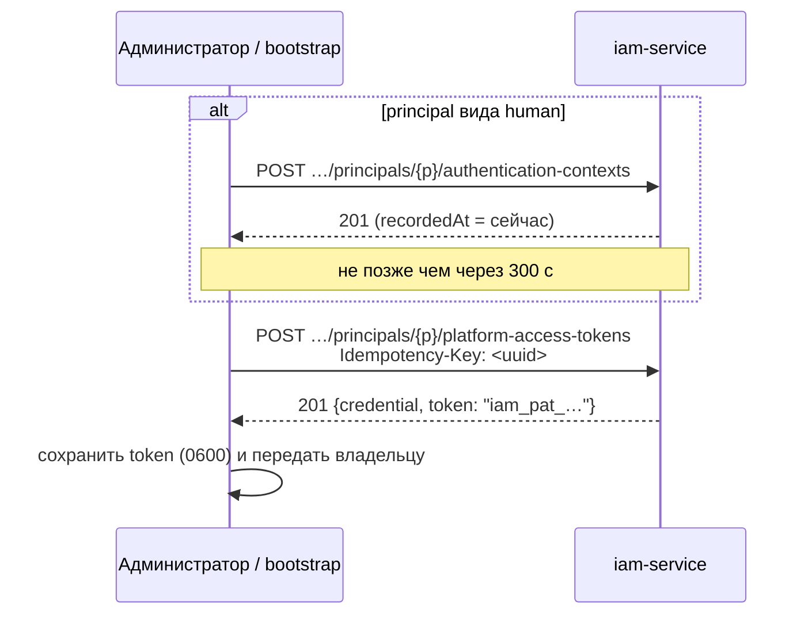
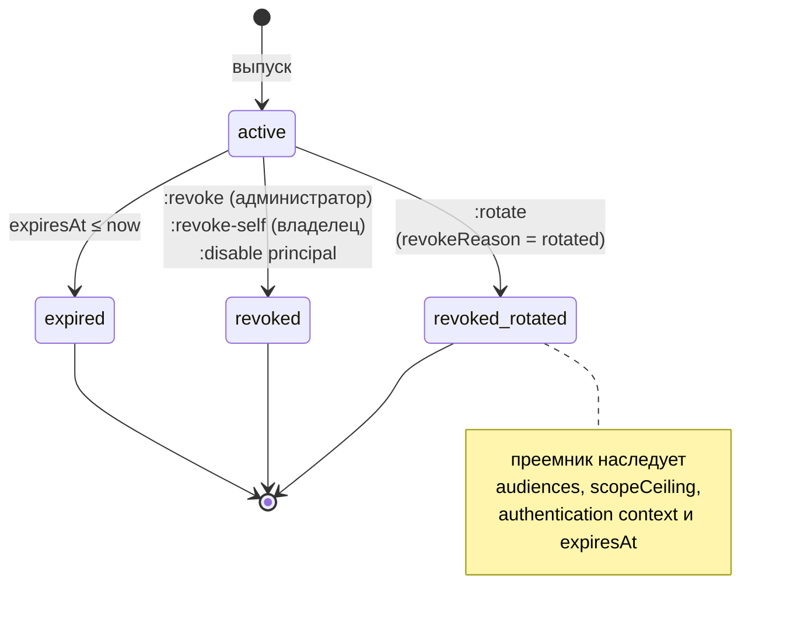

# Credentials и PAT

Статья о долгоживущих credentials людей и агентов — Platform Access Token
(PAT): как он устроен, как его выпустить, ротировать и отозвать, где он хранится
на машине пользователя и как клиент выбирает нужный. Для администраторов,
выдающих доступ, и для инженеров, настраивающих локальный harness или runner.

## Что такое PAT

Platform Access Token — principal-bound credential для локального harness
(MCP-плагин, CLI, Human Harness) и для автономного агента. Главное правило:
**PAT предъявляется только IAM** и только в теле запроса. Ни одному resource
service он не передаётся — вместо него сервис получает короткоживущий access
token своего audience (см. [Токены](tokens.md)).

```text
iam_pat_<public-prefix>_<secret>
        └── 12 hex ──┘ └ 32 случайных байта (base64url) ┘
```

| Свойство | Значение |
|---|---|
| Кто может держать | principal вида `human` или `agent` |
| Что хранит сервер | `public_prefix` (для поиска) и SHA-256 полного токена; сам секрет не восстановим |
| Когда виден секрет | ровно один раз — в ответе на выпуск или ротацию |
| Срок по умолчанию | `IAM_PAT_DEFAULT_TTL_SECONDS` = 2 592 000 с (30 дней) |
| Максимальный срок | `IAM_PAT_MAX_TTL_SECONDS` = 31 536 000 с (365 дней) |
| Минимальный срок в запросе | 60 с |
| Потолок полномочий | `audiences` + `scopeCeiling`, только сужает authority |

Service account и workload PAT не получают: у сервисов свой поток — client
credentials (см. [Service accounts](service-accounts.md)). Попытка выпустить
PAT для них даёт `422 principal_kind_not_allowed`.

### Запись PAT

| Поле ответа | Описание |
|---|---|
| `id` | `credential_id` — попадает в claim `credential_id` access token |
| `tenantId`, `principalId` | владелец |
| `name` | человекочитаемое имя, 1–200 символов |
| `kind` | `platform_access_token` (или `legacy_control_plane_api_key`, см. ниже) |
| `publicPrefix` | несекретный префикс; безопасно показывать в логах и UI |
| `audiences` | сервисы, для которых PAT можно обменять |
| `scopeCeiling` | максимум scopes, которые можно получить обменом |
| `createdAt`, `expiresAt`, `lastUsedAt` | время выпуска, истечения и последнего обмена |
| `revokedAt`, `revokeReason` | отзыв |
| `rotatedFromId` | предшественник при ротации |

## Выпуск PAT

Выпуск — административная операция (заголовок `X-IAM-Bootstrap-Token`).



### Шаг 1 (только для человека): authentication context

Человеку PAT выпускается только при подтверждённом **свежем** входе. Факт входа
хранится как authentication context. Штатно его пишет федеративный вход
([Федерация](federation.md)); для bootstrap и эксплуатации есть
административный эндпоинт:

```bash
curl -s -X POST \
  "$IAM_URL/api/v1/tenants/$TENANT/principals/$PRINCIPAL/authentication-contexts" \
  -H "X-IAM-Bootstrap-Token: $IAM_BOOTSTRAP_TOKEN" -H 'Content-Type: application/json' \
  -d '{"issuer":"https://platform.example.com/iam","acr":"bootstrap","amr":["bootstrap-script"]}'
```

```json
{
  "id": "<context-id>",
  "principalId": "<principal-id>",
  "issuer": "https://platform.example.com/iam",
  "acr": "bootstrap",
  "amr": ["bootstrap-script"],
  "authTime": "2026-01-15T10:05:00Z",
  "recordedAt": "2026-01-15T10:05:00Z",
  "source": "bootstrap"
}
```

| Поле запроса | Обязательно | Описание |
|---|---|---|
| `issuer` | да | Кто подтвердил вход (1–500 символов) |
| `acr` | нет | Уровень аутентификации, попадёт в claim `acr` |
| `amr` | нет | Методы аутентификации |
| `authTime` | нет | Момент входа; время в будущем подрезается до серверного |
| `externalIdentityId` | нет | Связанная external identity |

Правила свежести:

- берётся **последний** context principal в tenant;
- свежесть считается по серверному `recordedAt`, а не по `authTime`, — старую
  сессию IdP нельзя выдать за новую, подставив `authTime`;
- допустимый возраст — `IAM_PAT_MAX_AUTHENTICATION_AGE_SECONDS` (300 с).

Ошибки выпуска: нет context — `403 authentication_context_required`, старше
окна — `403 authentication_context_expired`. Для не-человека эндпоинт context
отвечает `422 human_principal_required`.

!!! note "Агенту context не нужен"
    У автономного агента нет человеческого входа, и имитировать его нечем.
    PAT агента выпускается без context, а в записи PAT фиксируется честный
    снимок `{"source": "agent_bootstrap", "issuedBy": "bootstrap", "recordedAt": …}`.
    Поэтому в access token агента нет `auth_time` и `acr`, а `principal_type`
    равен `agent` — сервисы могут отличить его сессии от человеческих.

### Шаг 2: выпуск

```bash
curl -s -X POST \
  "$IAM_URL/api/v1/tenants/$TENANT/principals/$PRINCIPAL/platform-access-tokens" \
  -H "X-IAM-Bootstrap-Token: $IAM_BOOTSTRAP_TOKEN" \
  -H "Idempotency-Key: $(uuidgen)" \
  -H 'Content-Type: application/json' \
  -d '{
        "name": "harness-alice",
        "audiences": ["control-plane"],
        "scopeCeiling": ["control-plane:read", "control-plane:write"],
        "expiresInSeconds": 15552000
      }'
```

```json
{
  "credential": {
    "id": "<credential-id>",
    "tenantId": "<tenant-id>",
    "principalId": "<principal-id>",
    "name": "harness-alice",
    "kind": "platform_access_token",
    "publicPrefix": "<prefix>",
    "audiences": ["control-plane"],
    "scopeCeiling": ["control-plane:read", "control-plane:write"],
    "createdAt": "2026-01-15T10:05:10Z",
    "expiresAt": "2026-07-14T10:05:10Z",
    "lastUsedAt": null,
    "revokedAt": null,
    "revokeReason": "",
    "rotatedFromId": null
  },
  "token": "iam_pat_<prefix>_<secret>"
}
```

| Поле запроса | Обязательно | Правила |
|---|---|---|
| `name` | да | 1–200 символов |
| `audiences` | да | Минимум один; каждый должен быть активным audience tenant, иначе `422 unknown_audience` |
| `scopeCeiling` | нет | Должен входить в объединение `allowedScopes` выбранных audiences, иначе `422 invalid_scope_ceiling`. Пустой потолок = PAT не даст ни одного scope |
| `expiresInSeconds` | нет | ≥ 60; по умолчанию `IAM_PAT_DEFAULT_TTL_SECONDS`; больше `IAM_PAT_MAX_TTL_SECONDS` — `422 expiry_too_long` |

Лишние поля в теле запрещены (`422`): клиент не может «объявить» tenant,
principal или права.

### Idempotency-Key

Заголовок `Idempotency-Key` **обязателен** для выпуска и ротации; без него —
`400 idempotency_key_required`. Ключ уникален в пределах tenant.

Повтор запроса с тем же ключом (например, после обрыва соединения) возвращает
ту же запись с `token: null` и заголовком `Idempotency-Replayed: true`:
секрет не хранится на сервере и повторно показан быть не может. Второй
credential при этом не создаётся.

!!! warning "Потерянный секрет не восстановить"
    Если ответ с `token` потерян, повтор с тем же `Idempotency-Key` секрета не
    вернёт. Отзовите запись (`:revoke`) и выпустите новую с новым ключом.

## Жизненный цикл PAT



### Список PAT

```bash
curl -s "$IAM_URL/api/v1/tenants/$TENANT/platform-access-tokens?principalId=$PRINCIPAL&includeRevoked=true" \
  -H "X-IAM-Bootstrap-Token: $IAM_BOOTSTRAP_TOKEN"
```

Без `includeRevoked=true` отозванные записи не возвращаются. Истёкшие, но не
отозванные — возвращаются (проверяйте `expiresAt`). Секрета и хэша в ответе нет.

### Отзыв администратором

```bash
curl -s -X POST \
  "$IAM_URL/api/v1/tenants/$TENANT/platform-access-tokens/$CREDENTIAL:revoke?reason=leaked" \
  -H "X-IAM-Bootstrap-Token: $IAM_BOOTSTRAP_TOKEN"
# 204 No Content
```

Операция идемпотентна: повторный отзыв ничего не меняет и тоже отвечает `204`.
Обмен отозванного PAT прекращается немедленно.

### Отзыв владельцем (`revoke-self`)

Владелец секрета может отозвать свой PAT без bootstrap-токена — владение
секретом и есть основание:

```bash
curl -s -X POST "$IAM_URL/api/v1/platform-access-tokens:revoke-self" \
  -H 'Content-Type: application/json' \
  -d '{"token":"iam_pat_…","reason":"logout"}'
# 204
```

Повторный вызов уже отозванным токеном отвечает `401 invalid_token` —
эндпоинт не подтверждает существование записи. Это то, что делает
`iam auth logout --revoke`.

### Ротация и новый выпуск — в чём разница

```bash
curl -s -X POST \
  "$IAM_URL/api/v1/tenants/$TENANT/platform-access-tokens/$CREDENTIAL:rotate" \
  -H "X-IAM-Bootstrap-Token: $IAM_BOOTSTRAP_TOKEN" \
  -H "Idempotency-Key: $(uuidgen)" \
  -H 'Content-Type: application/json' -d '{}'
```

| | Ротация `:rotate` | Новый выпуск |
|---|---|---|
| Что меняется | только секрет | всё: audiences, потолок, срок |
| `expiresAt` | наследуется, **не продлевается** | новый, от момента выпуска |
| Потолок полномочий | наследуется, расширить нельзя (тело должно быть пустым) | задаётся заново |
| Authentication context | копируется из предшественника; свежий вход не нужен | для человека нужен свежий context |
| Предшественник | отзывается в той же транзакции (`revokeReason: rotated`) | остаётся действующим, пока его не отозвали |
| Связь | `rotatedFromId` указывает на предшественника | нет |

Когда что использовать:

- **Секрет мог утечь, срок устраивает** — `:rotate`.
- **Срок подходит к концу** — только новый выпуск: ротация окно не продлевает.
  Для человека сначала запишите свежий authentication context. Затем отзовите
  старый PAT.
- **Нужно добавить audience или scope** — новый выпуск.

Ошибки ротации: `404 credential_not_found`, `409 credential_not_active`
(отозван или истёк), `404`/`409` по tenant и principal (см. таблицу ниже).

!!! tip "Плановая смена PAT"
    Сроки истечения видны в `GET …/platform-access-tokens` (`expiresAt`) и в
    `iam auth status`. Заведите напоминание на перевыпуск PAT агентов и
    операторов заранее: истёкший PAT агента молча останавливает его работу
    с ошибкой `invalid_token`.

### Отключение principal

`POST …/principals/{id}:disable` отзывает **все** PAT principal одной
транзакцией — см. [Tenants и principals](principals.md).

## Проверка PAT: introspect

Владелец может узнать, кем он вошёл и до какого момента действует токен, не
получая доступа ни к одному сервису:

```bash
curl -s -X POST "$IAM_URL/api/v1/platform-access-tokens:introspect" \
  -H 'Content-Type: application/json' -d '{"token":"iam_pat_…"}'
```

```json
{
  "tenantId": "<tenant-id>",
  "principalId": "<principal-id>",
  "principalKind": "human",
  "displayName": "Alice Operator",
  "credentialId": "<credential-id>",
  "name": "harness-alice",
  "publicPrefix": "<prefix>",
  "audiences": ["control-plane"],
  "scopeCeiling": ["control-plane:read", "control-plane:write"],
  "expiresAt": "2026-07-14T10:05:10Z",
  "issuedAt": "2026-01-15T10:05:10Z"
}
```

`lastUsedAt` при introspect не обновляется: это отметка о полученной
authority, а не о просмотре статуса.

### Единый ответ на любой дефект токена

Exchange, introspect и revoke-self проверяют предъявленный PAT одинаково.
Любой дефект — неизвестный префикс, неверный секрет, отзыв, истечение,
неактивный tenant, membership или principal — даёт один и тот же
`401 invalid_token`. Точная причина пишется только в audit IAM
(`credential_revoked`, `credential_expired`, `tenant_not_active`,
`membership_not_active`, `principal_not_active`) — эндпоинт не работает
оракулом для подбора. Хэш вычисляется и для несуществующего префикса.

## Локальный клиент: `iam auth`

Reference-клиент `iam_client` ставится вместе с пакетом `iam-service` и
даёт CLI `iam`. Он ходит в IAM по тем же публичным контрактам, что и любой
клиент, и не имеет доступа к базе.

```bash
iam auth login                          # скрытый prompt; или --stdin
iam auth status [--json]                # кто вошёл, чем и до когда
iam auth session --harness claude-code  # обмен PAT и открытие Harness Session в Control Plane
iam auth logout [--revoke]              # удалить локальную копию (и отозвать в IAM)
```

| Команда | Что делает |
|---|---|
| `login` | Читает PAT скрытым prompt (или из stdin при `--stdin` / не-TTY), вызывает introspect, проверяет tenant и audience против binding, сохраняет |
| `status` | Находит локальный PAT и делает introspect |
| `session --harness <codex или claude-code>` | Обменивает PAT на токен audience из binding и открывает session `POST /api/v1/sessions` в Control Plane |
| `logout` | Удаляет локальную запись; с `--revoke` — ещё и `revoke-self` в IAM |

!!! danger "Секрет не передаётся аргументом"
    Если в аргументах командной строки встречается `iam_pat_` или `cp_`,
    команда отказывается работать (`credential_in_argv`) ещё до разбора
    аргументов: аргумент виден в истории оболочки и в списке процессов.
    Такой токен считайте скомпрометированным и отзовите.

Коды выхода CLI:

| Код | Значение |
|---|---|
| `0` | успех |
| `2` | ошибка использования или binding (`BindingError`, пустой токен, секрет в argv) |
| `3` | нет входа или токен недействителен (`invalid_token`, ошибки хранилища, несовпадение tenant/audience/principal) |
| `4` | IAM или Control Plane недоступны либо ответили ошибкой |

### Binding репозитория: `.iam/binding.json`

CLI работает только в каталоге, привязанном к IAM. Binding ищется вверх по
дереву от текущего каталога (или берётся из `IAM_BINDING_FILE`) и коммитится
в репозиторий — поэтому в нём только несекретные метаданные:

```json
{
  "iamUrl": "https://platform.example.com/iam",
  "tenantId": "<tenant-id>",
  "audience": "control-plane",
  "controlPlaneUrl": "https://platform.example.com",
  "scopes": ["control-plane:read", "control-plane:write"]
}
```

| Поле | Обязательно | Описание |
|---|---|---|
| `iamUrl` | да | http(s)-адрес IAM; конечный `/` отбрасывается |
| `tenantId` | да | tenant IAM |
| `audience` | нет | По умолчанию `control-plane` |
| `controlPlaneUrl` | для `session` | Адрес Control Plane |
| `scopes` | нет | Какие scopes запрашивать при обмене; пусто — весь потолок |

Binding с полем, похожим на секрет (`token`, `password`, `apiKey`,
`clientSecret`, `privateKey`, `bootstrapToken` и т. п. в любом регистре), или
со значением, начинающимся с `iam_pat_`/`cp_`, отклоняется целиком
(`secret_in_binding`). Каталог без binding получает отказ
`repository_not_bound`, а не чужой credential.

### Где хранится секрет

Порядок разрешения источника:

1. **Окружение** — только если режим объявлен явно:
   `IAM_CREDENTIAL_MODE=environment` (или `ci`) плюс `IAM_PLATFORM_ACCESS_TOKEN`.
2. **Связка ключей ОС** — macOS Keychain, сервис `iam.platform-access-token`
   (секрет передаётся утилите `security` через stdin). Отключается
   `IAM_NO_KEYCHAIN=1`.
3. **Файл** `$XDG_CONFIG_HOME/iam/credentials.json` (по умолчанию
   `~/.config/iam/credentials.json`) с правами `0600`.

!!! warning "Переменная без режима — ошибка"
    `IAM_PLATFORM_ACCESS_TOKEN` без `IAM_CREDENTIAL_MODE=environment` — это
    отказ (`environment_mode_required`; в клиенте Control Plane —
    `iam_environment_mode_required`), а не тихий выбор источника: случайно
    унаследованная переменная не должна подменять credential разработчика.
    В режиме environment `iam auth login` ничего не сохраняет
    (`environment_mode_read_only`).

### Формат `credentials.json` и ключ записи

Запись адресуется тройкой **`<iam-url>|<tenant-id>|<principal-id>`**, где
`<iam-url>` — ровно тот адрес IAM, с которым работает клиент (`iamUrl` из
binding или `CONTROL_PLANE_IAM_URL`), без конечного `/`.

```json
{
  "https://platform.example.com/iam|<tenant-id>|<principal-id>": {
    "token": "iam_pat_…",
    "principalId": "<principal-id>"
  },
  "principals": {
    "https://platform.example.com/iam|<tenant-id>": ["<principal-id>", "<agent-principal-id>"]
  }
}
```

- Секция `principals` — индекс исполнителей машины **без секретов**. Она
  нужна, потому что секреты в Keychain нельзя перечислить.
- Записи старого формата с ключом-парой `<iam-url>|<tenant-id>` читаются, пока
  на машине для этой пары один principal.
- Файл создаётся сразу с `0600`. Файл с более широкими правами **не читается**
  (`credentials_file_permissions`) — это считается инцидентом.

### Несколько исполнителей на одной машине: `IAM_PRINCIPAL`

Если на машине для одной пары IAM + tenant лежат credentials нескольких
principals (например, runner-кодер и runner-ревьюер под одним пользователем
ОС), процесс обязан назвать себя переменной `IAM_PRINCIPAL=<principal-id>`.
Иначе — отказ `credential_ambiguous` (`iam_credential_ambiguous` в клиенте
Control Plane), а не выбор наугад: работа под чужой identity была бы видна
только в audit.

`iam auth login` при заданном `IAM_PRINCIPAL` сверяет его с владельцем
токена и отказывает при несовпадении (`principal_mismatch`).

### Как клиенты Control Plane используют PAT

MCP-плагин оператора, runner и другие клиенты на `control-plane-client`
читают то же хранилище (только чтение) и настраиваются переменными:

| Переменная | Назначение |
|---|---|
| `CONTROL_PLANE_IAM_URL` | адрес IAM; без неё IAM-режим выключен |
| `CONTROL_PLANE_IAM_TENANT` | tenant IAM (обязателен при заданном URL) |
| `CONTROL_PLANE_IAM_AUDIENCE` | по умолчанию `control-plane` |
| `CONTROL_PLANE_IAM_SCOPES` | запрашиваемые scopes через пробел или запятую |

Клиент обменивает PAT по требованию, кеширует access token до момента за 30 с
до истечения и обменивает заново. Подробнее — [MCP-плагин](../operator/mcp-plugin.md)
и [Конфигурация runner](../runner/configuration.md).

## Типичный сценарий: выдать доступ оператору

```bash
# 1. principal (если ещё нет)
P=$(curl -s -X POST "$IAM_URL/api/v1/tenants/$TENANT/principals" -H "$BT" \
      -H 'Content-Type: application/json' \
      -d '{"kind":"human","displayName":"Alice Operator"}' | jq -r .id)

# 2. свежий authentication context (PAT надо выпустить в течение 300 с)
curl -s -X POST "$IAM_URL/api/v1/tenants/$TENANT/principals/$P/authentication-contexts" -H "$BT" \
  -H 'Content-Type: application/json' -d '{"issuer":"'"$IAM_URL"'","acr":"bootstrap"}' >/dev/null

# 3. PAT на 180 дней, секрет — сразу в файл 0600
( umask 077; curl -s -X POST "$IAM_URL/api/v1/tenants/$TENANT/principals/$P/platform-access-tokens" \
    -H "$BT" -H "Idempotency-Key: $(uuidgen)" -H 'Content-Type: application/json' \
    -d '{"name":"harness-alice","audiences":["control-plane"],
         "scopeCeiling":["control-plane:read","control-plane:write"],
         "expiresInSeconds":15552000}' | jq -r .token > alice.pat )

# 4. binding principal в Control Plane (см. «Авторизация и права»)
# 5. владелец на своей машине, в привязанном репозитории:
iam auth login --stdin < alice.pat && shred -u alice.pat
```

## Совместимость со старыми ключами Control Plane

Для миграции IAM умеет импортировать существующий ключ Control Plane
`cp_<prefix>_<secret>` как credential вида `legacy_control_plane_api_key`.
Переносится только пара `(keyPrefix, keyHash)` — открытый ключ границу
сервисов не пересекает, а владелец продолжает предъявлять его как есть.

```bash
curl -s -X POST "$IAM_URL/api/v1/tenants/$TENANT/legacy-credentials:import" -H "$BT" \
  -H 'Content-Type: application/json' \
  -d '{"principalId":"<principal-id>","name":"legacy-key","keyPrefix":"<12 hex>",
       "keyHash":"<64 hex sha256>","audience":"control-plane",
       "scopeCeiling":["control-plane:read"],"expiresInSeconds":2592000}'
```

Окно совместимости обязательно ограничено: `expiresInSeconds` не больше
`IAM_LEGACY_CREDENTIAL_MAX_TTL_SECONDS` (90 дней), иначе
`422 compatibility_window_too_long`. Прочие ошибки:
`422 invalid_credential_material`, `422 invalid_scope_ceiling`,
`409 credential_exists`.

!!! warning "Только для миграции"
    Новые инсталляции работают без legacy-ключей: Control Plane в
    `deploy/local/compose.yml` запускается с `CP_LEGACY_API_KEYS_ENABLED=false`.

## Ошибки

| HTTP | `detail` | Где | Причина |
|---|---|---|---|
| 400 | `idempotency_key_required` | выпуск, ротация | нет заголовка `Idempotency-Key` |
| 401 | `invalid_token` | exchange, introspect, revoke-self | любой дефект PAT (см. выше) |
| 401 | `unauthorized` | административные операции | нет или неверный `X-IAM-Bootstrap-Token` |
| 403 | `authentication_context_required` | выпуск (human) | у человека нет записанного входа |
| 403 | `authentication_context_expired` | выпуск (human) | последний вход старше 300 с |
| 404 | `tenant_not_found` | выпуск, ротация, context | tenant не существует или выключен |
| 404 | `principal_not_found` | выпуск, ротация, context | нет активного membership |
| 404 | `credential_not_found` | revoke, rotate | неизвестный `credential_id` в tenant |
| 409 | `principal_not_active` | выпуск, ротация, context | principal `disabled`/`paused` |
| 409 | `credential_not_active` | rotate | PAT уже отозван или истёк |
| 409 | `credential_conflict` | выпуск, ротация | конфликт уникальности, не связанный с idempotency |
| 422 | `principal_kind_not_allowed` | выпуск | principal не `human` и не `agent` |
| 422 | `human_principal_required` | authentication context | context пишется только человеку |
| 422 | `unknown_audience` | выпуск, импорт | audience не зарегистрирован или выключен |
| 422 | `invalid_scope_ceiling` | выпуск, импорт | потолок шире `allowedScopes` audiences |
| 422 | `expiry_too_long` | выпуск | срок больше `IAM_PAT_MAX_TTL_SECONDS` |

Коды клиента `iam auth` / `control-plane-client`: `repository_not_bound`,
`invalid_binding`, `secret_in_binding`, `credential_in_argv`,
`environment_mode_required`, `credential_ambiguous`,
`credentials_file_permissions`, `principal_mismatch`, `tenant_mismatch`,
`audience_not_allowed`, `iam_unreachable`.

## См. также

- [Токены, audiences, scopes](tokens.md) — что происходит при обмене PAT
- [Tenants и principals](principals.md)
- [Identity агента](../runner/agent-identity.md)
- [MCP-плагин для Claude Code](../operator/mcp-plugin.md)
- [Секреты и ротация](../operations/secrets.md)
- [API IAM](api.md#pat)
