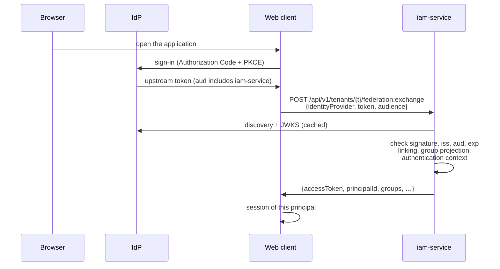
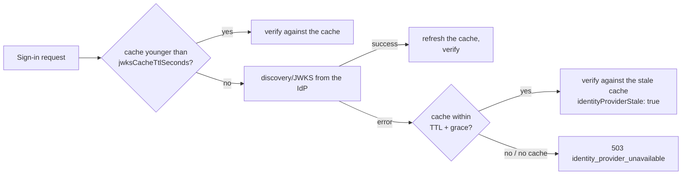
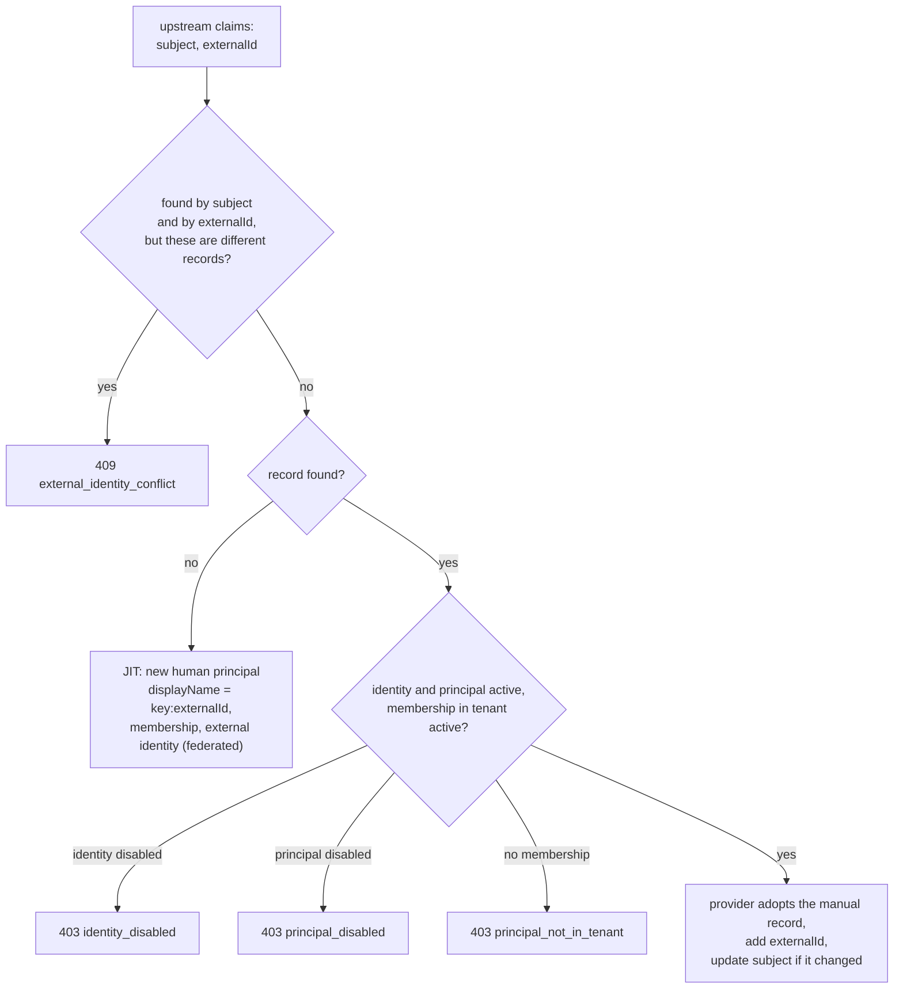

# Identity federation

IAM stores no passwords and shows no sign-in form: an external OIDC Identity
Provider (Keycloak in the distribution) authenticates the person, and IAM verifies its token, links the
account to a principal, and issues platform credentials. This article
describes IdP registration, sign-in through `federation:authenticate` and
`federation:exchange`, identity linking, group projection, and SCIM
provisioning. It is for administrators who connect corporate sign-in.


Federation is used by a client that takes a person through IdP sign-in (for
example, a web application) and exchanges their token through
`federation:exchange`.

## How it works




Federation confirms **identity and groups**. It grants no licenses and no
domain permissions: access to a resource is still decided by the resource
service (for Control Plane, by the principal binding; see
[Authorization and permissions](../control-plane/authorization.md)).

## Registering an identity provider


A provider is registered in a tenant by an administrative call:

```bash
curl -s -X POST "$IAM_URL/api/v1/tenants/$TENANT/identity-providers" \
  -H "X-IAM-Bootstrap-Token: $IAM_BOOTSTRAP_TOKEN" -H 'Content-Type: application/json' \
  -d '{
        "key": "corp-idp",
        "issuer": "https://idp.example.com/realms/corp",
        "audience": "iam-service",
        "lifecycleProfile": "managed",
        "groupClaim": "groups",
        "groupMappings": {"platform-operators": "operators"}
      }'
```

!!! note "This step is manual"
    `make bootstrap` does not register an identity provider. The key
    `corp-idp` is the provider name that the client passes to
    `federation:exchange` as `identityProvider`.

### Provider parameters

| Field | Default | Description |
|---|---|---|
| `key` | — | Provider name in the tenant, `^[a-z0-9][a-z0-9._-]{1,118}[a-z0-9]$`; clients pass it as `identityProvider` |
| `issuer` | — | Exact `iss` of upstream tokens; `http(s)://` only, a trailing `/` is dropped |
| `audience` | — | Which `aud` IAM requires in the upstream token (in Keycloak, the `iam-service` client and an audience mapper) |
| `jwksUri` | `""` | JWKS address. If empty, it is taken from discovery `<issuer>/.well-known/openid-configuration` |
| `subjectClaim` | `sub` | Claim with the stable subject |
| `externalIdClaim` | `sub` | Claim with the stable external ID (for LDAP, for example `entryUUID`); if empty in the token, the subject is used |
| `groupClaim` | `groups` | Claim with the list of groups |
| `groupMappings` | `{}` | Allowlist: upstream group → IAM group key |
| `requiredAcrValues` | `[]` | Allowed `acr` values; if non-empty, sign-in without a matching `acr` is denied |
| `requiredAmrValues` | `[]` | Methods, **all** of which must be present in `amr` |
| `lifecycleProfile` | `read_only` | Who manages the lifecycle of identities; see below |
| `jwksCacheTtlSeconds` | 300 | How long JWKS is considered fresh (0–86400) |
| `jwksStaleGraceSeconds` | 900 | How long after the TTL IAM may keep using the old JWKS if the IdP is unavailable (0–86400) |

IAM stores only the non-secret trust configuration. Client secrets, passwords,
and LDAP bind credentials stay in the IdP's own configuration. Extra fields in
the request are rejected (`422`).

Registration errors: `404 tenant_not_found`, `422 invalid_issuer`,
`409 identity_provider_exists` (the same `key` or the same `issuer` in the tenant).

!!! warning "You cannot change a provider through the API"
    There are no endpoints to read, change, or disable an identity provider.
    Check the parameters before registration; a fix is possible only in the
    IAM database.

### Lifecycle profiles {#lifecycle-profiles}

| `lifecycleProfile` | Who manages identities | Manual external identity linking for this issuer | SCIM source |
|---|---|---|---|
| `read_only` | the directory (LDAP/AD through the IdP) | denied: `409 identity_provider_managed` | cannot be registered: `409 population_managed_by_directory` |
| `managed` | administrator / SCIM | allowed | allowed |

Choose `managed` if principals already exist in IAM (for example, an operator
created by the bootstrap script) and you need to link them to IdP accounts
manually.

## Upstream token verification

IAM verifies the upstream token strictly, with no "lenient" modes:

| Check | Refusal |
|---|---|
| The token parses as a JWT | `401 invalid_token` |
| `alg` ∈ `RS256`, `RS384`, `RS512`, `ES256`, `ES384` (symmetric algorithms and `none` are rejected before the key is consulted) | `401 unsupported_algorithm` |
| A `kid` is present and exists in the provider's JWKS | `401 unknown_signing_key` |
| Signature | `401 invalid_signature` |
| `iss` exactly equals the provider's `issuer` | `401 invalid_issuer` |
| `aud` contains the provider's `audience` | `401 invalid_audience` |
| `exp` has not passed; `iss`, `sub`, `aud`, `exp`, `iat` are required | `401 token_expired` / `401 invalid_token` |
| The `subjectClaim` claim is non-empty | `401 missing_subject_claim` |
| `acr`/`amr` satisfy the provider's requirements | `403 step_up_required` |

An insufficient authentication context **closes** sign-in rather than lowering
the requirements (step-up).

### Provider JWKS and degradation

IAM caches each provider's JWKS in process memory:



- The discovery document must contain an `issuer` exactly equal to the
  configured one and a non-empty `jwks_uri`. The request timeout to the IdP
  is 5 s.
- When working from a stale cache, the response contains
  `identityProviderStale: true`, and the audit record gets the `jwks:stale`
  mark.
- After the grace window, sign-in closes (fail closed) instead of continuing
  to trust old keys.

!!! tip "IAM must reach the IdP at the issuer address"
    Discovery goes to `<issuer>/.well-known/openid-configuration`, that is, to
    the public address. In `deploy/local/compose.yml`, the Caddy edge has, in the services
    network,

    the alias `${TAIMEN_PUBLIC_HOST}`, so the IAM container reaches Keycloak
    by its public name. If IAM cannot resolve the public name in your
    topology, set `jwksUri` explicitly to an internal address.

## Linking to a principal

After verifying the token, IAM looks up the external identity:

1. by the `(issuer, subject)` pair;
2. by the `(identity provider, externalId)` pair.



- **JIT creation.** An unknown account creates a new principal of kind
  `human` named `<provider key>:<externalId>`, a membership in the tenant,
  and an external identity with `source = federated`. The events
  `principal.created` and `external_identity.linked` are published.
- **Adoption.** A manually linked record (without a provider) gets a reference
  to the provider on the first sign-in (`federation.identity_adopted` in audit).
- **Subject change.** If the IdP recreated the user but the stable
  `externalId` is the same, the record's subject is updated
  (`federation.subject_rotated` in audit), and no second principal appears.
- **Conflict.** If the `externalId` in the token differs from the one already
  recorded for this subject, you get `409 external_identity_conflict`.

!!! warning "Link the principal of an existing person in advance"
    If a person already works on the platform as a principal (for example,
    they have a PAT) and then signs in through the IdP for the first time,
    a **second** principal is created unless you linked them beforehand. For
    browser sign-in to use the same `principal_id`, link the external
    identity in advance (`POST …/principals/{id}/external-identities`, a
    provider with the `managed` profile); see
    [Tenants and principals](principals.md#external-identity).

## Group projection {#group-projection}

Groups from the `groupClaim` claim are projected into IAM groups **only**
through the `groupMappings` allowlist:

- a leading `/` and spaces in the upstream group name are ignored
  (`/platform-operators` = `platform-operators`);
- a group without an explicit mapping creates no membership;
- a missing IAM group is created with `source = federated`;
- on each sign-in, this provider's federated memberships are brought in line
  with the current token: extra ones are removed, missing ones are added.
  Local memberships and memberships from other providers are not affected.

Events: `group.created`, `group_membership.added`, `group_membership.removed`.

## Authentication context

Every successful federated sign-in records, in the same transaction, the
person's authentication context (`source = federation`) with `issuer`, `acr`,
`amr`, and `auth_time` from the upstream token. It:

- allows PAT issuance to the person for
  `IAM_PAT_MAX_AUTHENTICATION_AGE_SECONDS`
  (see [Credentials and PAT](credentials.md));
- provides the `auth_time` and `acr` values for the `federation:exchange` token.

An `auth_time` in the future is clamped to server time.

## `federation:authenticate`: confirmation only

```bash
curl -s -X POST "$IAM_URL/api/v1/tenants/$TENANT/federation:authenticate" \
  -H 'Content-Type: application/json' \
  -d '{"identityProvider":"corp-idp","token":"<IdP access token>"}'
```

```json
{
  "principalId": "<principal-id>",
  "identityProvider": "corp-idp",
  "groups": ["operators"],
  "authenticationContext": {"acr": "1", "amr": ["pwd"], "authTime": "2026-01-15T10:00:00Z"},
  "identityProviderStale": false
}
```

No credential is issued. The endpoint does not require the bootstrap token;
the upstream token itself is the proof. The body accepts **only**
`identityProvider` and `token`: the fields `username`/`password` are forbidden
by the contract, and only the IdP verifies the directory password.

## `federation:exchange`: sign-in and token in one request


This is for a person in a browser: the web client has only the user's upstream
token, a PAT does not pass through a web session, and a shared service
credential would lose the person in audit.

```bash
curl -s -X POST "$IAM_URL/api/v1/tenants/$TENANT/federation:exchange" \
  -H 'Content-Type: application/json' \
  -d '{"identityProvider":"corp-idp","token":"<IdP access token>",
       "audience":"control-plane","scopes":[]}'
```

```json
{
  "accessToken": "eyJ…",
  "tokenType": "Bearer",
  "expiresIn": 300,
  "audience": "control-plane",
  "scope": ["control-plane:admin", "control-plane:read", "control-plane:write"],
  "sessionId": "<session-id>",
  "principalId": "<principal-id>",
  "identityProvider": "corp-idp",
  "groups": ["operators"],
  "authenticationContext": {"acr": "1", "amr": ["pwd"], "authTime": "2026-01-15T10:00:00Z"},
  "identityProviderStale": false
}
```

Differences from PAT exchange:

| | `federation:exchange` | PAT `:exchange` |
|---|---|---|
| Ceiling | the audience's `allowedScopes`; web sign-in has no ceiling of its own | the PAT's `scopeCeiling` ∩ `allowedScopes` |
| Empty `scopes` | the audience's entire `allowedScopes` | the whole ceiling |
| `credential_id` in the token | id of the external identity: disabling it closes the next exchange | id of the PAT |
| Available to | `human` only (`422 human_principal_required`) | `human`, `agent` |
| `auth_time`, `acr` | from the current upstream token | from the snapshot taken at PAT issuance |

The token shape is the same as for PAT exchange (`principal_type`,
`scope_ceiling`, `session_id`, `auth_time`, `acr`); the resource service sees
no difference.

A refusal by audience or scope is written to audit as `federation.exchange`
with `outcome = denied`; the sign-in itself (linking, groups, context) stays
recorded.

!!! note "The service decides permissions, not the scope"
    An empty `scopes` yields the audience's entire registry, including
    `control-plane:admin`. This is a ceiling, not a permission: what the
    person can actually do is determined by the binding of their principal
    in Control Plane.

Launcher setup is described in [Personal workspace](../workplace/index.md), and Keycloak
setup in [Keycloak as the external IdP](keycloak.md).

## Connecting Keycloak: checklist

1. The realm has the `iam-service` client (bearer-only) and an audience mapper
   that adds `iam-service` to the `aud` of the **access token** of the client
   through which people sign in. IAM receives the IdP access token: in the
   shipped realm, the audience mapper writes `iam-service` only into it, not
   into the ID token.
2. The realm issuer matches the provider's `issuer` in IAM character for
   character (scheme, host, path `/auth/realms/<realm>`).
3. The provider is registered in IAM (`POST …/identity-providers`) with the
   same `key` that the launcher uses (`keycloak`).
4. For people who already exist as principals, external identities are linked
   in advance (`subject` = the user's `sub` in Keycloak).
5. For each person who will work in Control Plane, a binding of their IAM
   principal is created in Control Plane **before** the first request.
6. Check: `federation:authenticate` with a test user's token returns the
   expected `principalId` and groups.

## SCIM provisioning

IAM accepts inbound SCIM 2.0 from an HR system or an IGA and projects it onto
principals, external identities, and groups. This is not a way to sign in:
SCIM manages a lifecycle owned by someone else.

### Provisioning source

Each population (upstream identity provider) has exactly one authoritative
source. The source is registered administratively:

```bash
curl -s -X POST "$IAM_URL/api/v1/tenants/$TENANT/provisioning-sources" \
  -H "X-IAM-Bootstrap-Token: $IAM_BOOTSTRAP_TOKEN" -H 'Content-Type: application/json' \
  -d '{"key":"hr","kind":"scim","identityProvider":"corp-idp",
       "servicePrincipalId":"<service account principal-id>",
       "upstreamMode":"off","staleAfterSeconds":86400}'
```

| Field | Default | Description |
|---|---|---|
| `key` | — | Source name |
| `kind` | `scim` | `scim` or `ldap` |
| `identityProvider` | — | `key` of the population provider; SCIM is not allowed for `read_only` |
| `servicePrincipalId` | — | Principal of kind `service_account` on whose behalf the SCIM client works (required for `scim`) |
| `upstreamMode` | `off` | Writing to the IdP: `off`, IAM projection only; `scim`, native Keycloak SCIM; `admin`, Admin API; `auto`, SCIM with fallback to the Admin API |
| `upstreamBaseUrl`, `upstreamRealm` | `""` | IdP address and realm for writing |
| `staleAfterSeconds` | 86400 | Time without synchronization after which the source is considered stale (60–2,592,000) |

`GET …/provisioning-sources` returns sources with a `stale` flag; the first
detection of staleness publishes a `provisioning_source.stale` event, which is
convenient to build an alert on.

### SCIM client access

The SCIM client is a service account with audience `IAM_SCIM_AUDIENCE`
(`iam-scim` by default) and scope `IAM_SCIM_SCOPE` (`scim:write`). Create the
audience in the tenant, create the service account with this audience and
ceiling, and specify its `principalId` in the source.

```bash
TOKEN=$(curl -s -X POST "$IAM_URL/api/v1/tokens/exchange" -H 'Content-Type: application/json' \
  -d '{"clientId":"iam_sa_…","clientSecret":"…","audience":"iam-scim","scopes":["scim:write"]}' \
  | jq -r .accessToken)
curl -s "$IAM_URL/scim/v2/Users?filter=externalId%20eq%20%22E-1001%22" \
  -H "Authorization: Bearer $TOKEN"
```

A human's token is not accepted on `/scim/v2` (`403`):
`principal_type = service_account` is required. The tenant and source are
determined from the identity in the token; the client cannot declare another
tenant.

### SCIM behavior

- `Users` and `Groups`: `GET` (list with filter and pagination, up to
  `IAM_SCIM_MAX_PAGE_SIZE` = 200), `POST`, `GET/{id}`, `PUT`, `PATCH`, `DELETE`;
  `ServiceProviderConfig`, `ResourceTypes`, `Schemas`.
- Matching is by the required `externalId`; `userName` may change.
- Profile attributes (`name`, `emails`, phone numbers) are accepted and
  discarded: IAM is not a directory of personal data.
- The filter supports only `eq` and `and`; anything else gives `invalidFilter`.
- `ETag`/`If-Match` protect against a race between two synchronization passes.
- `active: false` and `DELETE` disable the principal and **immediately**
  revoke all of its PATs.
- Until a real OIDC `sub` exists, `subject` holds a temporary value; on the
  first federated sign-in, the record is found by `externalId`, and `subject`
  is replaced with the real one.
- If writing to the IdP is unavailable while `upstreamMode` ≠ `off`, the whole
  write is refused (`502`): a divergence between the projection and the
  directory is more dangerous than a refusal.
- Errors are returned as a `urn:ietf:params:scim:api:messages:2.0:Error` document.

## Federation errors {#federation-errors}

| HTTP | `detail` | Cause |
|---|---|---|
| 401 | `invalid_token` | the token does not parse or failed the general check |
| 401 | `unsupported_algorithm` | algorithm outside the allowlist |
| 401 | `unknown_signing_key` | no `kid`, or it is not in JWKS |
| 401 | `invalid_signature` | the signature does not match |
| 401 | `invalid_issuer` | `iss` does not equal the provider's issuer |
| 401 | `invalid_audience` | `aud` does not contain the provider's audience |
| 401 | `token_expired` | the upstream token has expired |
| 401 | `missing_subject_claim` | the `subjectClaim` claim is empty |
| 403 | `step_up_required` | `acr`/`amr` do not satisfy the requirements |
| 403 | `identity_disabled` | the external identity is disabled |
| 403 | `principal_disabled` | the principal is not active |
| 403 | `principal_not_in_tenant` | no active membership in the tenant |
| 403 | `audience_not_allowed` | (`exchange`) the audience is not registered or is disabled |
| 403 | `scope_not_allowed` | (`exchange`) scope outside `allowedScopes` |
| 404 | `identity_provider_not_found` | no active provider with this `key` |
| 409 | `external_identity_conflict` | subject and externalId point to different records |
| 422 | `human_principal_required` | (`exchange`) the identity is linked to a non-human |
| 503 | `identity_provider_unavailable` | the IdP is unavailable and the grace window is exhausted |

Refusals are written to the IAM audit (`federation.authenticate` /
`federation.exchange`, `outcome = denied`, with the error code as the reason);
the upstream token and the subject are not written to audit.

## See also

- [Keycloak as the external IdP](keycloak.md)
- [Personal workspace](../workplace/index.md)
- [Tenants and principals](principals.md)
- [Tokens, audiences, scopes](tokens.md)
- [IAM API](api.md#federation)
