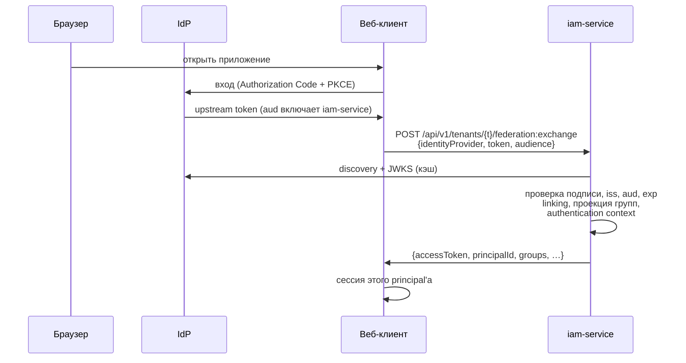
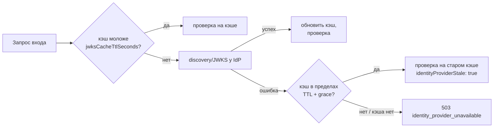
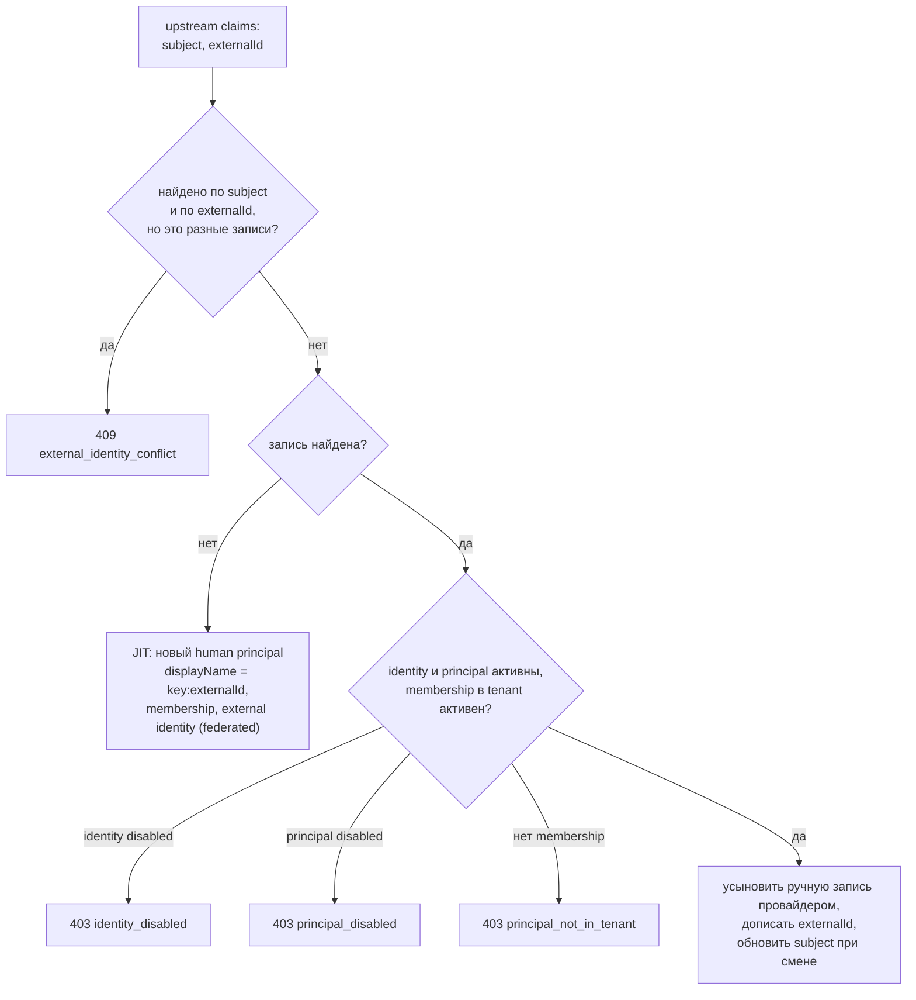

# Федерация identity

IAM не хранит паролей и не показывает форму входа: человека аутентифицирует
внешний OIDC Identity Provider (в поставке — Keycloak), а IAM проверяет его
токен, связывает учётную запись с principal и выпускает credentials
платформы. Статья описывает регистрацию IdP, вход через `federation:authenticate`
и `federation:exchange`, привязку identities, проекцию групп и
SCIM-провижининг. Для администраторов, подключающих корпоративный вход.


Федерацию использует клиент, который проводит человека через вход в IdP
(например, веб-приложение), и обменивает его токен через `federation:exchange`.

## Как это работает




Федерация подтверждает **identity и группы**. Она не выдаёт лицензий и
доменных прав: доступ к ресурсу по-прежнему решает resource service (для
Control Plane — binding principal, см. [Авторизация и права](../control-plane/authorization.md)).

## Регистрация identity provider


Провайдер регистрируется в tenant административным вызовом:

```bash
curl -s -X POST "$IAM_URL/api/v1/tenants/$TENANT/identity-providers" \
  -H "X-IAM-Bootstrap-Token: $IAM_BOOTSTRAP_TOKEN" -H 'Content-Type: application/json' \
  -d '{
        "key": "corp-idp",
        "issuer": "https://idp.example.com/realms/corp",
        "audience": "iam-service",
        "lifecycleProfile": "managed",
        "groupClaim": "groups",
        "groupMappings": {"platform-operators": "operators"}
      }'
```

!!! note "Шаг выполняется вручную"
    `make bootstrap` identity provider не регистрирует. Ключ `corp-idp` —
    имя провайдера, которое клиент передаёт в `federation:exchange`
    как `identityProvider`.

### Параметры провайдера

| Поле | По умолчанию | Описание |
|---|---|---|
| `key` | — | Имя провайдера в tenant, `^[a-z0-9][a-z0-9._-]{1,118}[a-z0-9]$`; передаётся клиентами как `identityProvider` |
| `issuer` | — | Точный `iss` upstream-токенов; только `http(s)://`, конечный `/` отбрасывается |
| `audience` | — | Какой `aud` IAM требует в upstream-токене (в Keycloak — клиент `iam-service` и audience-маппер) |
| `jwksUri` | `""` | Адрес JWKS. Пусто — берётся из discovery `<issuer>/.well-known/openid-configuration` |
| `subjectClaim` | `sub` | Claim со стабильным subject |
| `externalIdClaim` | `sub` | Claim со стабильным внешним ID (для LDAP — например `entryUUID`); пусто в токене → берётся subject |
| `groupClaim` | `groups` | Claim со списком групп |
| `groupMappings` | `{}` | Allowlist: upstream-группа → ключ группы IAM |
| `requiredAcrValues` | `[]` | Допустимые `acr`; непусто — вход без подходящего `acr` запрещён |
| `requiredAmrValues` | `[]` | Методы, **все** из которых должны быть в `amr` |
| `lifecycleProfile` | `read_only` | Кто ведёт жизненный цикл identities, см. ниже |
| `jwksCacheTtlSeconds` | 300 | Сколько JWKS считается свежим (0–86400) |
| `jwksStaleGraceSeconds` | 900 | Сколько после TTL можно работать на старом JWKS, если IdP недоступен (0–86400) |

В IAM хранится только несекретная конфигурация доверия. Client secrets,
пароли и LDAP bind credentials остаются в конфигурации самого IdP. Лишние
поля в запросе запрещены (`422`).

Ошибки регистрации: `404 tenant_not_found`, `422 invalid_issuer`,
`409 identity_provider_exists` (тот же `key` или тот же `issuer` в tenant).

!!! warning "Изменить провайдера через API нельзя"
    Эндпоинтов чтения, изменения и отключения identity provider нет. Проверьте
    параметры до регистрации; исправление — только в базе IAM.

### Профили жизненного цикла {#lifecycle-profiles}

| `lifecycleProfile` | Кто ведёт identities | Ручная привязка external identity для этого issuer | SCIM-источник |
|---|---|---|---|
| `read_only` | каталог (LDAP/AD через IdP) | запрещена: `409 identity_provider_managed` | не регистрируется: `409 population_managed_by_directory` |
| `managed` | администратор / SCIM | разрешена | разрешён |

Выбирайте `managed`, если principals уже существуют в IAM (например, оператор
создан bootstrap-скриптом) и их нужно привязать к учётным записям IdP вручную.

## Проверка upstream-токена

IAM проверяет upstream-токен строго, без «мягких» режимов:

| Проверка | Отказ |
|---|---|
| Токен разбирается как JWT | `401 invalid_token` |
| `alg` ∈ `RS256`, `RS384`, `RS512`, `ES256`, `ES384` (симметричные и `none` отклоняются до обращения к ключу) | `401 unsupported_algorithm` |
| Есть `kid`, и он есть в JWKS провайдера | `401 unknown_signing_key` |
| Подпись | `401 invalid_signature` |
| `iss` точно равен `issuer` провайдера | `401 invalid_issuer` |
| `aud` содержит `audience` провайдера | `401 invalid_audience` |
| `exp` не истёк; обязательны `iss`, `sub`, `aud`, `exp`, `iat` | `401 token_expired` / `401 invalid_token` |
| Claim `subjectClaim` непуст | `401 missing_subject_claim` |
| `acr`/`amr` удовлетворяют требованиям провайдера | `403 step_up_required` |

Недостаточный authentication context **закрывает** вход, а не понижает
требования (step-up).

### JWKS провайдера и деградация

IAM кеширует JWKS каждого провайдера в памяти процесса:



- Discovery-документ должен содержать `issuer`, точно равный настроенному, и
  непустой `jwks_uri`. Таймаут запроса к IdP — 5 с.
- При работе на устаревшем кэше ответ содержит `identityProviderStale: true`,
  а в audit добавляется пометка `jwks:stale`.
- После окна grace вход закрывается (fail closed), а не продолжает доверять
  старым ключам.

!!! tip "IAM должен видеть IdP по адресу issuer"
    Discovery идёт по `<issuer>/.well-known/openid-configuration`, то есть по
    публичному адресу. В `deploy/local/compose.yml` периметр Caddy имеет в сети сервисов

    псевдоним `${TAIMEN_PUBLIC_HOST}`, поэтому контейнер IAM достигает
    Keycloak по публичному имени. Если IAM в вашей топологии не может
    разрешить публичное имя, задайте `jwksUri` явно на внутренний адрес.

## Связывание с principal (linking)

После проверки токена IAM ищет external identity:

1. по паре `(issuer, subject)`;
2. по паре `(identity provider, externalId)`.



- **JIT-создание.** Неизвестная учётная запись создаёт новый principal вида
  `human` с именем `<key провайдера>:<externalId>`, membership в tenant и
  external identity с `source = federated`. Публикуются события
  `principal.created` и `external_identity.linked`.
- **Усыновление.** Запись, привязанная вручную (без провайдера), при первом
  входе получает ссылку на провайдера (`federation.identity_adopted` в audit).
- **Смена subject.** Если IdP пересоздал пользователя, но стабильный
  `externalId` тот же, subject записи обновляется
  (`federation.subject_rotated` в audit), второй principal не появляется.
- **Конфликт.** Если `externalId` в токене расходится с уже записанным для
  этого subject — `409 external_identity_conflict`.

!!! warning "Principal для существующего человека — заранее"
    Если человек уже работает в платформе как principal (например, получил
    PAT), а затем входит через IdP впервые, без предварительной привязки будет
    создан **второй** principal. Чтобы вход через браузер шёл под тем же
    `principal_id`, привяжите external identity заранее
    (`POST …/principals/{id}/external-identities`, провайдер с профилем
    `managed`) — см. [Tenants и principals](principals.md#external-identity).

## Проекция групп {#group-projection}

Группы из claim `groupClaim` проецируются в группы IAM **только** по
allowlist `groupMappings`:

- ведущий `/` и пробелы в имени upstream-группы игнорируются
  (`/platform-operators` = `platform-operators`);
- группа без явного маппинга не создаёт членства;
- отсутствующая группа IAM создаётся с `source = federated`;
- при каждом входе federated-членства этого провайдера приводятся к
  текущему токену: лишние удаляются, недостающие добавляются. Локальные
  членства и членства других провайдеров не затрагиваются.

События: `group.created`, `group_membership.added`, `group_membership.removed`.

## Authentication context

Каждый успешный федеративный вход в той же транзакции записывает
authentication context человека (`source = federation`) с `issuer`, `acr`,
`amr` и `auth_time` из upstream-токена. Он:

- открывает человеку выпуск PAT в течение `IAM_PAT_MAX_AUTHENTICATION_AGE_SECONDS`
  (см. [Credentials и PAT](credentials.md));
- даёт значения `auth_time` и `acr` для токена `federation:exchange`.

`auth_time` из будущего подрезается до серверного времени.

## `federation:authenticate` — только подтверждение

```bash
curl -s -X POST "$IAM_URL/api/v1/tenants/$TENANT/federation:authenticate" \
  -H 'Content-Type: application/json' \
  -d '{"identityProvider":"corp-idp","token":"<access token IdP>"}'
```

```json
{
  "principalId": "<principal-id>",
  "identityProvider": "corp-idp",
  "groups": ["operators"],
  "authenticationContext": {"acr": "1", "amr": ["pwd"], "authTime": "2026-01-15T10:00:00Z"},
  "identityProviderStale": false
}
```

Credential не выпускается. Эндпоинт не требует bootstrap-токена —
доказательством служит сам upstream-токен. Тело принимает **только**
`identityProvider` и `token`: поля `username`/`password` запрещены контрактом,
пароль каталога проверяет исключительно IdP.

## `federation:exchange` — вход и токен одним запросом


Для человека в браузере: у веб-клиента есть только upstream-токен пользователя,
PAT через веб-сессию не проходит, а общий сервисный credential потерял бы
человека в audit.

```bash
curl -s -X POST "$IAM_URL/api/v1/tenants/$TENANT/federation:exchange" \
  -H 'Content-Type: application/json' \
  -d '{"identityProvider":"corp-idp","token":"<access token IdP>",
       "audience":"control-plane","scopes":[]}'
```

```json
{
  "accessToken": "eyJ…",
  "tokenType": "Bearer",
  "expiresIn": 300,
  "audience": "control-plane",
  "scope": ["control-plane:admin", "control-plane:read", "control-plane:write"],
  "sessionId": "<session-id>",
  "principalId": "<principal-id>",
  "identityProvider": "corp-idp",
  "groups": ["operators"],
  "authenticationContext": {"acr": "1", "amr": ["pwd"], "authTime": "2026-01-15T10:00:00Z"},
  "identityProviderStale": false
}
```

Отличия от обмена PAT:

| | `federation:exchange` | PAT `:exchange` |
|---|---|---|
| Потолок | `allowedScopes` audience — собственного потолка у веб-входа нет | `scopeCeiling` PAT ∩ `allowedScopes` |
| Пустой `scopes` | весь `allowedScopes` audience | весь потолок |
| `credential_id` в токене | id external identity: её отключение закрывает следующий обмен | id PAT |
| Кому доступно | только `human` (`422 human_principal_required`) | `human`, `agent` |
| `auth_time`, `acr` | из текущего upstream-токена | из снимка при выпуске PAT |

Форма токена та же, что при обмене PAT (`principal_type`, `scope_ceiling`,
`session_id`, `auth_time`, `acr`) — resource service разницы не видит.

Отказ по audience или scope пишется в audit как `federation.exchange` с
`outcome = denied`; сам вход (linking, группы, context) при этом остаётся
зафиксированным.

!!! note "Права решает сервис, а не scope"
    Пустой `scopes` даёт весь реестр audience, включая `control-plane:admin`.
    Это потолок, а не право: что человек реально может, определяет binding
    его principal в Control Plane.

Настройка launcher'а — в статье [Рабочее место человека](../workplace/index.md),
настройка Keycloak — в статье [Keycloak — внешний IdP](keycloak.md).

## Подключение Keycloak: чек-лист

1. В realm есть клиент `iam-service` (bearer-only) и audience-маппер, который
   добавляет `iam-service` в `aud` **access token** клиента, через который
   входят люди. В IAM передаётся именно access token IdP: в поставляемом
   realm audience-маппер пишет `iam-service` только в него, не в ID token.
2. Issuer realm совпадает с `issuer` провайдера в IAM символ в символ
   (схема, хост, путь `/auth/realms/<realm>`).
3. Провайдер зарегистрирован в IAM (`POST …/identity-providers`) с тем же
   `key`, что использует launcher (`keycloak`).
4. Для людей, уже существующих как principals, external identities
   привязаны заранее (`subject` = `sub` пользователя в Keycloak).
5. Для каждого человека, который будет работать в Control Plane, создан
   binding его IAM principal в Control Plane **до** первого запроса.
6. Проверка: `federation:authenticate` с токеном тестового пользователя
   возвращает ожидаемый `principalId` и группы.

## SCIM-провижининг

IAM принимает входящий SCIM 2.0 из HR-системы или IGA и проецирует его на
principals, external identities и группы. Это не способ входа: SCIM
управляет чужим жизненным циклом.

### Источник провижининга

Каждая population (upstream identity provider) имеет ровно один
authoritative источник. Источник регистрируется административно:

```bash
curl -s -X POST "$IAM_URL/api/v1/tenants/$TENANT/provisioning-sources" \
  -H "X-IAM-Bootstrap-Token: $IAM_BOOTSTRAP_TOKEN" -H 'Content-Type: application/json' \
  -d '{"key":"hr","kind":"scim","identityProvider":"corp-idp",
       "servicePrincipalId":"<principal-id service account>",
       "upstreamMode":"off","staleAfterSeconds":86400}'
```

| Поле | По умолчанию | Описание |
|---|---|---|
| `key` | — | Имя источника |
| `kind` | `scim` | `scim` или `ldap` |
| `identityProvider` | — | `key` провайдера-population; для `read_only` SCIM запрещён |
| `servicePrincipalId` | — | Principal вида `service_account`, от имени которого ходит SCIM-клиент (обязателен для `scim`) |
| `upstreamMode` | `off` | Запись в IdP: `off` — только проекция IAM; `scim` — нативный SCIM Keycloak; `admin` — Admin API; `auto` — SCIM с откатом на Admin API |
| `upstreamBaseUrl`, `upstreamRealm` | `""` | Адрес и realm IdP для записи |
| `staleAfterSeconds` | 86400 | Через сколько без синхронизации источник считается устаревшим (60–2 592 000) |

`GET …/provisioning-sources` возвращает источники с флагом `stale`; первое
обнаружение устаревания публикует событие `provisioning_source.stale` —
по нему удобно строить alert.

### Доступ SCIM-клиента

SCIM-клиент — service account с audience `IAM_SCIM_AUDIENCE` (по умолчанию
`iam-scim`) и scope `IAM_SCIM_SCOPE` (`scim:write`). Audience нужно завести в
tenant, service account — создать с этим audience и потолком, а его
`principalId` указать в источнике.

```bash
TOKEN=$(curl -s -X POST "$IAM_URL/api/v1/tokens/exchange" -H 'Content-Type: application/json' \
  -d '{"clientId":"iam_sa_…","clientSecret":"…","audience":"iam-scim","scopes":["scim:write"]}' \
  | jq -r .accessToken)
curl -s "$IAM_URL/scim/v2/Users?filter=externalId%20eq%20%22E-1001%22" \
  -H "Authorization: Bearer $TOKEN"
```

Токен человека на `/scim/v2` не принимается (`403`): требуется
`principal_type = service_account`. Tenant и источник определяются по
identity из токена — объявить чужой tenant клиент не может.

### Поведение SCIM

- `Users` и `Groups`: `GET` (список с фильтром и пагинацией, до
  `IAM_SCIM_MAX_PAGE_SIZE` = 200), `POST`, `GET/{id}`, `PUT`, `PATCH`, `DELETE`;
  `ServiceProviderConfig`, `ResourceTypes`, `Schemas`.
- Сопоставление — по обязательному `externalId`; `userName` может меняться.
- Профильные атрибуты (`name`, `emails`, телефоны) принимаются и
  отбрасываются — IAM не каталог персональных данных.
- Фильтр поддерживает только `eq` и `and`; прочее — `invalidFilter`.
- `ETag`/`If-Match` защищают от гонки двух проходов синхронизации.
- `active: false` и `DELETE` отключают principal и **немедленно** отзывают
  все его PAT.
- Пока настоящего OIDC `sub` нет, в `subject` лежит временное значение; при
  первом федеративном входе запись находится по `externalId`, и `subject`
  заменяется настоящим.
- Недоступность записи в IdP при `upstreamMode` ≠ `off` закрывает запись
  целиком (`502`): расхождение проекции и каталога опаснее отказа.
- Ошибки — документ `urn:ietf:params:scim:api:messages:2.0:Error`.

## Ошибки федерации {#federation-errors}

| HTTP | `detail` | Причина |
|---|---|---|
| 401 | `invalid_token` | токен не разбирается или не прошёл общую проверку |
| 401 | `unsupported_algorithm` | алгоритм вне allowlist |
| 401 | `unknown_signing_key` | нет `kid` или его нет в JWKS |
| 401 | `invalid_signature` | подпись не сходится |
| 401 | `invalid_issuer` | `iss` не равен issuer провайдера |
| 401 | `invalid_audience` | в `aud` нет audience провайдера |
| 401 | `token_expired` | upstream-токен истёк |
| 401 | `missing_subject_claim` | пуст claim `subjectClaim` |
| 403 | `step_up_required` | `acr`/`amr` не удовлетворяют требованиям |
| 403 | `identity_disabled` | external identity отключена |
| 403 | `principal_disabled` | principal не активен |
| 403 | `principal_not_in_tenant` | нет активного membership в tenant |
| 403 | `audience_not_allowed` | (`exchange`) audience не зарегистрирован или выключен |
| 403 | `scope_not_allowed` | (`exchange`) scope вне `allowedScopes` |
| 404 | `identity_provider_not_found` | нет активного провайдера с таким `key` |
| 409 | `external_identity_conflict` | subject и externalId указывают на разные записи |
| 422 | `human_principal_required` | (`exchange`) identity привязана к не-человеку |
| 503 | `identity_provider_unavailable` | IdP недоступен, окно grace исчерпано |

Отказы пишутся в audit IAM (`federation.authenticate` / `federation.exchange`,
`outcome = denied`, причина — код ошибки); upstream-токен и subject в audit не
попадают.

## См. также

- [Keycloak — внешний IdP](keycloak.md)
- [Рабочее место человека](../workplace/index.md)
- [Tenants и principals](principals.md)
- [Токены, audiences, scopes](tokens.md)
- [API IAM](api.md#federation)
