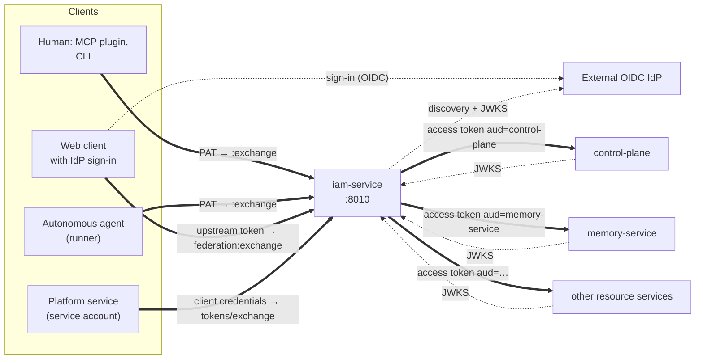
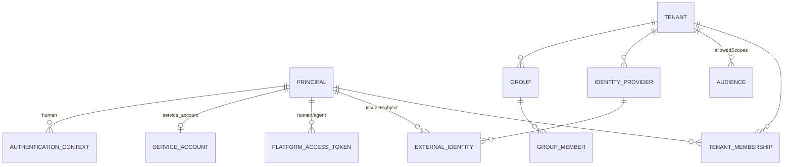

# IAM: identity and access

`iam-service` is the single identity service of the Taimen platform. It answers
the question "who is acting and in which tenant", issues short-lived access
tokens for a specific service, and publishes identity events. This section is
for installation administrators and for engineers who connect a new service to
the platform.

## What IAM does and does not do

IAM owns identity and credentials, but it does **not** decide what a specific
user is allowed to do with a resource. The final permission for an action is
the combination of several independent checks:


```text
IAM identity (who, and in which tenant)
AND license/feature (external license check, if connected)
AND organizational and domain authorization (resource service / external PDP)
AND transactional invariants of the resource (claims, fencing, etc.)
= permitted action
```

| IAM owns | IAM does not own |
|---|---|
| Tenant and principal membership in a tenant | Workspace, Project, Task, Run |
| Principals of kinds `human`, `agent`, `service_account`, `workload` | Memory namespaces, documents |
| External identity (`issuer + subject`) and groups | Product plans, licenses, quotas |
| Platform Access Token (PAT), service account client credentials | Domain roles and service permissions |
| Registry of audiences and allowed scopes | Decisions of the form "may P do A on R" |
| Federation with external IdPs (OIDC), SCIM provisioning | User passwords (the IdP verifies them) |
| Access token signing and JWKS | |
| Event log (outbox) and audit | |

!!! note "A valid token is not a permission"
    An IAM access token confirms only the identity, the tenant, and the
    **ceiling** of authority (`scope`). The service derives the specific right
    on a resource itself: Control Plane does it through the binding of the IAM
    principal to its own principal and that principal's permissions
    (see [Authorization and permissions](../control-plane/authorization.md)).

Rationale for these boundaries: `TAI-ADR-0013` (separate IAM and Entitlement)
and `TAI-ADR-0012` (token-based sign-in for local plugins and SCIM).

## Place in the architecture




The key principle: **one token, one service**. A long-lived credential (PAT,
service account secret, IdP upstream token) is presented only to IAM and is
exchanged for a short-lived (300 s by default) access token for exactly one
audience. A service accepts only tokens for its own audience; memory does not
accept a Control Plane token, and vice versa.

## Three ways to get an access token

| Who | Long-lived credential | Exchange endpoint | `principal_type` in the token |
|---|---|---|---|
| Human in a local harness (CLI, MCP plugin) | PAT `iam_pat_…` | `POST /api/v1/platform-access-tokens:exchange` | `human` |
| Autonomous agent (runner) | PAT `iam_pat_…` | `POST /api/v1/platform-access-tokens:exchange` | `agent` |
| Human in a browser (sign-in to the workspace through the launcher) | IdP upstream OIDC token | `POST /api/v1/tenants/{t}/federation:exchange` | `human` |
| Platform service | `clientId` + `clientSecret` | `POST /api/v1/tokens/exchange` | `service_account` |

Details are in [Credentials and PAT](credentials.md),
[Tokens, audiences, scopes](tokens.md), [Service accounts](service-accounts.md),
and [Identity federation](federation.md).

## The data model in brief



- **Tenant** is an isolated organization. Everything except the principal
  itself is addressed within a tenant.
- **Principal** is the subject of an action. It is linked to a tenant through
  a membership.
- **Audience** is a registered service that receives tokens, with a list of
  allowed scopes (`allowedScopes`).
- **External identity** links a principal to an account in an external IdP.
- **Authentication context** is a recorded fact of a recent human sign-in;
  without it, a PAT cannot be issued to a human.

See [Tenants and principals](principals.md).

## Administration: the bootstrap token

Management operations (creating tenants, principals, audiences, issuing PATs,
and so on) are protected by the shared secret `IAM_BOOTSTRAP_TOKEN`, which is
passed in the `X-IAM-Bootstrap-Token` header. IAM has no separate
administrative role.

```bash
curl -s -X POST "$IAM_URL/api/v1/tenants" \
  -H "X-IAM-Bootstrap-Token: $IAM_BOOTSTRAP_TOKEN" \
  -H 'Content-Type: application/json' \
  -d '{"slug":"acme","name":"Acme"}'
```

!!! danger "The bootstrap token is the key to all identity"
    Whoever holds `IAM_BOOTSTRAP_TOKEN` can create a principal, issue a PAT
    to it, and disable any user. Store it only in `.env` (0600), do not hand
    it to clients, and do not expose administrative endpoints unless you have
    to; see [Configuration](configuration.md#bootstrap-token).
    A wrong or empty header returns `401 unauthorized` with no explanation.

In a typical installation, `make bootstrap` (the `deploy/bootstrap.py` script)
performs the initial IAM setup: tenant, audiences, operator principal, core
service accounts, and PATs. See [Bootstrap](../getting-started/bootstrap.md).

## Deployment

In the `deploy/local/compose.yml`, IAM belongs to the `core` profile:

| Container | Purpose |
|---|---|
| `iam-db` | PostgreSQL 16, database `iam` |
| `iam-service` | API on port `8010`; runs `alembic upgrade head` on startup |

- On the host, the service is published only on `127.0.0.1:${IAM_HOST_PORT:-18010}`.
- The edge (Caddy) serves IAM under `/iam/*` and strips the prefix, so the
  public IAM address is `${TAIMEN_PUBLIC_URL}/iam`, which is also the token
  **issuer**.
- Administrative paths (`/api/v1/tenants/*` except `federation:*`, and
  `/api/v1/events`) return `404` at the edge, and the `X-IAM-Bootstrap-Token`
  header is stripped. Bootstrap and deployment scripts work through
  `127.0.0.1:${IAM_HOST_PORT:-18010}`; see
  [Edge and TLS](../operations/edge-and-tls.md), section "IAM administrative surface".
- Services inside the compose network fetch keys from the internal address
  `http://iam-service:8010/.well-known/jwks.json`.
- The signing key is mounted as the docker secret `iam_signing_key`
  (file `IAM_SIGNING_KEY_FILE`).

Liveness check:

```bash
curl -s http://127.0.0.1:18010/healthz
# {"status":"ok"}
curl -s https://platform.example.com/iam/.well-known/jwks.json
```

## What to read next

| Task | Article |
|---|---|
| Create tenants, people, agents; disable a user | [Tenants and principals](principals.md) |
| Issue, rotate, and revoke PATs; set up `iam auth` | [Credentials and PAT](credentials.md) |
| Understand the token format, audiences, and scopes; rotate the signing key | [Tokens, audiences, scopes](tokens.md) |
| Give a service its own identity | [Service accounts](service-accounts.md) |
| Connect an external OIDC IdP, SCIM | [Identity federation](federation.md) |
| Full list of endpoints | [API](api.md) |
| Environment variables and common configuration errors | [Configuration](configuration.md) |

## See also

- [Security model](../overview/security-model.md)
- [Control Plane authorization and permissions](../control-plane/authorization.md)
- [Agent identity](../runner/agent-identity.md)
- [platform-auth-sdk](../sdk/platform-auth-sdk.md): how services verify IAM tokens
- [Troubleshooting: authentication and access](../troubleshooting/auth.md)
