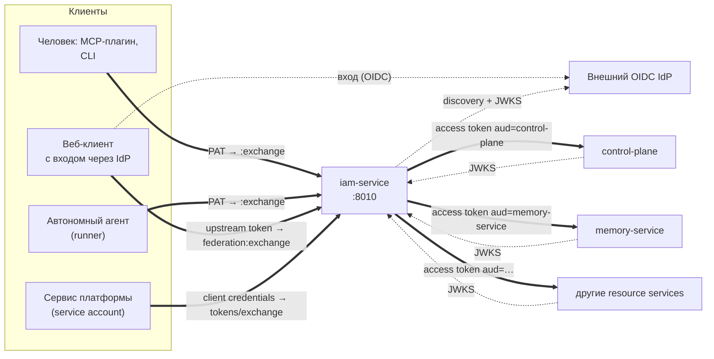
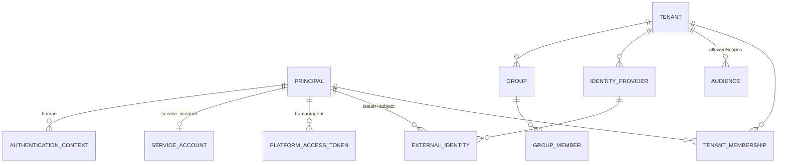

# IAM — identity и доступ

`iam-service` — единый сервис identity платформы Taimen. Он отвечает на вопрос
«кто действует и в каком tenant», выпускает короткоживущие access token для
конкретного сервиса и публикует события identity. Раздел предназначен для
администраторов инсталляции и инженеров, подключающих новый сервис к платформе.

## Что делает IAM и чего не делает

IAM владеет identity и credentials, но **не** решает, что конкретному
пользователю разрешено сделать с ресурсом. Итоговое разрешение действия
складывается из нескольких независимых проверок:


```text
IAM identity (кто и в каком tenant)
AND лицензия/feature (внешняя проверка лицензии, если подключена)
AND организационная и доменная авторизация (resource service / внешний PDP)
AND транзакционные инварианты ресурса (claims, fencing и т. п.)
= разрешённое действие
```

| IAM владеет | IAM не владеет |
|---|---|
| Tenant и членство principal в tenant | Workspace, Project, Task, Run |
| Principal видов `human`, `agent`, `service_account`, `workload` | Namespace памяти, документы |
| External identity (`issuer + subject`) и группы | Продуктовые планы, лицензии, квоты |
| Platform Access Token (PAT), client credentials service account | Доменные роли и права сервисов |
| Реестр audiences и допустимых scopes | Решения «может ли P сделать A над R» |
| Федерация внешних IdP (OIDC), SCIM-провижининг | Пароли пользователей (их проверяет IdP) |
| Подпись access token и JWKS | |
| Журнал событий (outbox) и audit | |

!!! note "Валидный токен — не разрешение"
    Access token IAM подтверждает только identity, tenant и **потолок**
    полномочий (`scope`). Конкретное право на ресурс сервис выводит сам:
    Control Plane — через binding IAM principal к своему principal и его права
    (см. [Авторизация и права](../control-plane/authorization.md)).

Обоснование границ — `TAI-ADR-0013` (раздельные IAM и Entitlement) и
`TAI-ADR-0012` (вход через токен для локальных плагинов и SCIM).

## Место в архитектуре




Ключевой принцип: **один токен — один сервис**. Долгоживущий credential
(PAT, секрет service account, upstream-токен IdP) предъявляется только IAM и
обменивается на короткоживущий (по умолчанию 300 с) access token ровно одного
audience. Сервис принимает токен только своего audience; токен Control Plane
не принимается памятью, и наоборот.

## Три пути получить access token

| Кто | Долгоживущий credential | Эндпоинт обмена | `principal_type` в токене |
|---|---|---|---|
| Человек в локальном harness (CLI, MCP-плагин) | PAT `iam_pat_…` | `POST /api/v1/platform-access-tokens:exchange` | `human` |
| Автономный агент (runner) | PAT `iam_pat_…` | `POST /api/v1/platform-access-tokens:exchange` | `agent` |
| Человек в браузере (вход в рабочее место через launcher) | upstream OIDC token IdP | `POST /api/v1/tenants/{t}/federation:exchange` | `human` |
| Сервис платформы | `clientId` + `clientSecret` | `POST /api/v1/tokens/exchange` | `service_account` |

Подробности — в статьях [Credentials и PAT](credentials.md),
[Токены, audiences, scopes](tokens.md), [Service accounts](service-accounts.md)
и [Федерация identity](federation.md).

## Модель данных в двух словах



- **Tenant** — изолированная организация. Всё, кроме самого principal,
  адресуется в разрезе tenant.
- **Principal** — субъект действия. Связан с tenant через membership.
- **Audience** — зарегистрированный сервис-получатель токенов со списком
  допустимых scopes (`allowedScopes`).
- **External identity** — привязка principal к учётной записи внешнего IdP.
- **Authentication context** — зафиксированный факт свежего входа человека;
  без него человеку нельзя выпустить PAT.

См. [Tenants и principals](principals.md).

## Администрирование: bootstrap-токен

Управляющие операции (создание tenant, principals, audiences, выпуск PAT и
т. д.) защищены общим секретом `IAM_BOOTSTRAP_TOKEN`, который передаётся
заголовком `X-IAM-Bootstrap-Token`. Отдельной административной роли в IAM нет.

```bash
curl -s -X POST "$IAM_URL/api/v1/tenants" \
  -H "X-IAM-Bootstrap-Token: $IAM_BOOTSTRAP_TOKEN" \
  -H 'Content-Type: application/json' \
  -d '{"slug":"acme","name":"Acme"}'
```

!!! danger "Bootstrap-токен — ключ ко всей identity"
    Владелец `IAM_BOOTSTRAP_TOKEN` может завести principal, выпустить ему PAT
    и отключить любого пользователя. Храните его только в `.env` (0600),
    не передавайте клиентам и не выставляйте административные эндпоинты
    наружу без необходимости — см. [Конфигурация](configuration.md#bootstrap-token).
    Неверный или пустой заголовок даёт `401 unauthorized` без пояснений.

В типовой инсталляции первичное наполнение IAM делает `make bootstrap`
(скрипт `deploy/bootstrap.py`): tenant, audiences, principal оператора,
service accounts ядра и PAT. См. [Bootstrap](../getting-started/bootstrap.md).

## Развёртывание

В `deploy/local/compose.yml` IAM входит в профиль `core`:

| Контейнер | Назначение |
|---|---|
| `iam-db` | PostgreSQL 16, база `iam` |
| `iam-service` | API на порту `8010`; при старте выполняет `alembic upgrade head` |

- Наружу хоста сервис публикуется только на `127.0.0.1:${IAM_HOST_PORT:-18010}`.
- Периметр (Caddy) отдаёт IAM по пути `/iam/*` с отрезанием префикса, поэтому
  публичный адрес IAM — `${TAIMEN_PUBLIC_URL}/iam`, и он же **issuer** токенов.
- Административные пути (`/api/v1/tenants/*`, кроме `federation:*`, и
  `/api/v1/events`) на периметре отвечают `404`, а заголовок
  `X-IAM-Bootstrap-Token` срезается. Bootstrap и скрипты стенда работают через
  `127.0.0.1:${IAM_HOST_PORT:-18010}` — см.
  [Периметр и TLS](../operations/edge-and-tls.md), раздел «Административная поверхность IAM».
- Сервисы внутри сети compose берут ключи по внутреннему адресу
  `http://iam-service:8010/.well-known/jwks.json`.
- Ключ подписи монтируется docker-секретом `iam_signing_key`
  (файл `IAM_SIGNING_KEY_FILE`).

Проверка живости:

```bash
curl -s http://127.0.0.1:18010/healthz
# {"status":"ok"}
curl -s https://platform.example.com/iam/.well-known/jwks.json
```

## Что читать дальше

| Задача | Статья |
|---|---|
| Завести tenant, людей, агентов; отключить пользователя | [Tenants и principals](principals.md) |
| Выпустить, ротировать, отозвать PAT; настроить `iam auth` | [Credentials и PAT](credentials.md) |
| Понять формат токена, audiences и scopes; ротировать ключ подписи | [Токены, audiences, scopes](tokens.md) |
| Дать сервису собственную identity | [Service accounts](service-accounts.md) |
| Подключить внешний OIDC IdP, SCIM | [Федерация identity](federation.md) |
| Полный список эндпоинтов | [API](api.md) |
| Переменные окружения и типичные ошибки конфигурации | [Конфигурация](configuration.md) |

## См. также

- [Модель безопасности](../overview/security-model.md)
- [Авторизация и права Control Plane](../control-plane/authorization.md)
- [Identity агента](../runner/agent-identity.md)
- [platform-auth-sdk](../sdk/platform-auth-sdk.md) — как сервисы проверяют токены IAM
- [Диагностика: аутентификация и доступ](../troubleshooting/auth.md)
