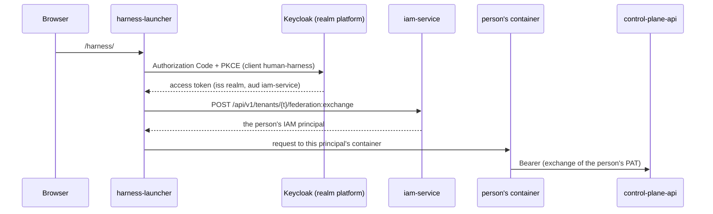
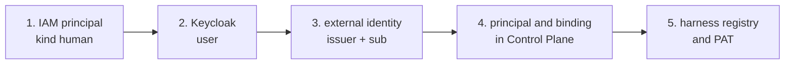

# Keycloak as the external IdP

In the delivery, Keycloak is the external identity provider for people: the sign-in form,
passwords, and browser sessions. It decides nothing else: a person's authority lives in IAM
(principal, PAT) and in Control Plane (binding and permissions). This article describes the
compose profile `idp`, the realm `platform` and its clients, the Admin API utility scripts,
registering Keycloak in IAM, and the procedure for onboarding a person. It is for
installation administrators.

## Keycloak's role in the identity chain

Keycloak tokens are consumed by the [console](../operator/console.md#login) server (client
`runtime-console`) and by the personal harness launcher (`harness-launcher`, profile
`harness`, client `human-harness`). Both take the person through Keycloak sign-in and
immediately exchange the resulting token in IAM. For example, the launcher:



Keycloak answers only the question "who is this person". Which principal corresponds to
them is decided by IAM through the external identity link; what the person can do in Control
Plane is decided by their principal's binding (see
[Authorization and permissions](../control-plane/authorization.md#bindings)). Agents,
services, and the operator MCP plugin do not use Keycloak: their identity is a Platform
Access Token or IAM client credentials.

## Deployment: the `idp` profile

The `idp` profile of `deploy/local/compose.yml` starts three services:

| Service | What it does |
|---|---|
| `keycloak-db` | PostgreSQL 16 for Keycloak only: database and role `keycloak`, password `KEYCLOAK_DB_PASSWORD`, volume `keycloak_db` |
| `realm-render` | A one-off container: substitutes the public address into the realm template and puts the result into the `realm_import` volume |
| `keycloak` | Keycloak 26 (`start --import-realm`), listens on `8080` in the compose network, on the host — `127.0.0.1:${KEYCLOAK_HOST_PORT}` (default `18081`) |

The console and people's workplaces sign in through Keycloak: the `console` profile also
starts the `idp` services, and the `harness` profile requires `idp` — without Keycloak the
launcher cannot let a person in.

```bash
make up PROFILES="core edge console"            # console and Keycloak
make up PROFILES="core edge console harness"    # plus the assistant
```


### `keycloak` container parameters

| Variable | Value | Meaning |
|---|---|---|
| `KC_HOSTNAME` | `${TAIMEN_PUBLIC_URL}/auth` | public address with a prefix; realm issuer = `${TAIMEN_PUBLIC_URL}/auth/realms/platform` |
| `KC_HTTP_RELATIVE_PATH` | `/auth` | Keycloak serves everything under `/auth` |
| `KC_HOSTNAME_STRICT` | `${KEYCLOAK_HOSTNAME_STRICT:-true}` | turned off (`false`) locally over http; `true` in a production installation |
| `KC_PROXY_HEADERS` | `xforwarded` | trust `X-Forwarded-*` from Caddy |
| `KC_HTTP_ENABLED` | `true` | Caddy terminates TLS |
| `KC_HEALTH_ENABLED` | `true` | healthcheck `GET /auth/health/ready` on management port 9000 |
| `KC_DB_URL_HOST`, `KC_DB_URL_DATABASE` | `keycloak-db`, `keycloak` | its own database in `keycloak-db` |
| `KC_BOOTSTRAP_ADMIN_USERNAME` / `_PASSWORD` | `KEYCLOAK_ADMIN` / `KEYCLOAK_ADMIN_PASSWORD` | administrator of the `master` realm (applied only on first start) |

The memory limit is `KEYCLOAK_MEM_LIMIT` (default `768m`); `keycloak-db` uses the shared
`PG_MEM_LIMIT`. The secrets `KEYCLOAK_DB_PASSWORD` and `KEYCLOAK_ADMIN_PASSWORD` are filled
in by `make secrets`.

### Realm template

The realm is described in git by the template `deploy/keycloak/platform-realm.json`.
Keycloak does not expand environment variables on import, so `realm-render` replaces the
placeholder `__WEB_BASE_URL__` with `TAIMEN_PUBLIC_URL` (redirect URIs and web origins of
the console and assistant clients). The console client (`runtime-console`) and the
assistant client (`human-harness`) are part of the template: a new installation gets them
on the first import.


!!! danger "The realm is imported only on first start"
    `--import-realm` creates the realm **if it does not exist yet**. Editing the template
    and restarting Keycloak has no effect on an already imported realm: the live realm is
    stored in `keycloak-db`. Changes to an existing realm are made through the Admin API or
    the admin console; keep the template consistent with them so that a new installation
    gets the same on import.

## Realm `platform`

### Main settings

| Parameter | Value |
|---|---|
| `sslRequired` | `external` |
| `loginWithEmailAllowed` | `true` (sign-in by e-mail) |
| `duplicateEmailsAllowed` | `false` |
| `registrationAllowed` | `false` — no self-registration |
| `resetPasswordAllowed` | `true` |
| `rememberMe` | `true` |
| `bruteForceProtected` | `true` — password-guessing protection on the IdP side |
| `accessTokenLifespan` | `300` s |
| `ssoSessionIdleTimeout` | `1800` s |
| `ssoSessionMaxLifespan` | `36000` s |
| `defaultSignatureAlgorithm` | `RS256` |

### Clients

| Client | Purpose |
|---|---|
| `runtime-console` | sign-in to the [console](../operator/console.md#login): confidential, Authorization Code + PKCE `S256`, redirect `${TAIMEN_PUBLIC_URL}/console/_auth/callback` |
| `human-harness` | sign-in for the personal harness launcher: Authorization Code + PKCE `S256`, redirect `${TAIMEN_PUBLIC_URL}/harness/*` |
| `iam-service` | bearer-only, audience only: IAM accepts upstream tokens addressed to it |

The console and assistant clients have the mapper `iam-service-audience`
(`oidc-audience-mapper`): it adds `iam-service` to the `aud` of tokens. This is exactly the
audience IAM checks for the `keycloak` provider.


The realm has no realm roles, group mappers, or organization attributes: neither IAM nor
Control Plane needs them.

### User profile

The realm declares a declarative user profile. What matters for onboarding people: `email`
is required, and the `keycloak-users.py` script always fills in `firstName` and `lastName` —
without them Keycloak may ask the person to complete the profile at sign-in (a required
action). Undeclared attributes can be changed only by an administrator
(`unmanagedAttributePolicy: ADMIN_EDIT`).

## Admin API utility scripts {#scripts}

The scripts live in `deploy/keycloak/`, use only the Python standard library, and reach
Keycloak at the internal address `http://keycloak:8080/auth` (overridden by
`KC_INTERNAL_URL`). They are run in a one-off container in the compose network; the launch
command is in each script's docstring.

| Script | What it does | Environment |
|---|---|---|
| `keycloak-users.py` | Creates or updates people in the realm: profile (`email`, `firstName`, `lastName`, `emailVerified: true`) and password. Idempotent. Prints `{"username", "id"}` — the `id` is the user's `sub` | `KC_ADMIN_PASSWORD`, `KC_USERS` (a JSON array: `username`, `email`, `password`, optionally `first_name`, `last_name`, `temporary`), `KC_ADMIN_USERNAME`, `KC_REALM` |
| `keycloak-runtime-console-client.py` | Creates the confidential console client `runtime-console` (Code + PKCE S256, redirect `<address>/console/_auth/callback`, audience `iam-service` in the id and access tokens) or brings an existing one in line with the template. Takes the secret from a file, or generates it and writes it there (0600); does not print it | `KC_ADMIN_PASSWORD`, `WEB_BASE_URL`, `SECRET_FILE` (default `/secrets/runtime-console-oidc-secret` — mount `secrets/`), `LOCAL_PORTS` |

```bash
docker run --rm --network taimen_default -v "$PWD/deploy/keycloak:/s:ro" \
  -e KC_ADMIN_PASSWORD="$KEYCLOAK_ADMIN_PASSWORD" \
  -e KC_USERS='[{"username":"alice","email":"alice@example.com","first_name":"Alice","last_name":"Example","password":"<password>"}]' \
  python:3.12-alpine python /s/keycloak-users.py
# {"username": "alice", "id": "<sub>"}
```

The network is `TAIMEN_NETWORK` from `.env` (default `taimen_default`). Passwords are passed
only through the environment and are never printed.

!!! tip "Permanent or temporary password"
    By default the script sets the password with `temporary: false`. With
    `"temporary": true`, Keycloak asks the person to change the password on its own page at
    first sign-in — acceptable for harness sign-in, which goes through the Keycloak page.

## Registering Keycloak in IAM {#iam-provider}

For IAM to accept Keycloak tokens in `federation:exchange`, the realm is registered in the
IAM tenant as an identity provider. `make bootstrap` does not do this — the step is
performed once with the IAM bootstrap token at the host address (administrative IAM paths
are closed at the edge):

```bash
IAM=http://127.0.0.1:18010
curl -s -X POST "$IAM/api/v1/tenants/$IAM_TENANT_ID/identity-providers" \
  -H "X-IAM-Bootstrap-Token: $IAM_BOOTSTRAP_TOKEN" -H "Content-Type: application/json" \
  -d '{
    "key": "keycloak",
    "issuer": "https://platform.example.com/auth/realms/platform",
    "audience": "iam-service",
    "lifecycleProfile": "managed"
  }'
```

| Field | Value | Why |
|---|---|---|
| `key` | `keycloak` | the provider name the launcher passes |
| `issuer` | the realm issuer | exactly the `iss` in Keycloak tokens |
| `audience` | `iam-service` | tokens carry it thanks to the `iam-service-audience` mapper |
| `subjectClaim`, `externalIdClaim` | `sub` by default | the stable Keycloak user id |
| `lifecycleProfile` | `managed` | allows linking an external identity to an existing principal in advance; with `read_only`, manual linking returns `409 identity_provider_managed` |

`jwksUri` can be omitted: IAM takes it from discovery at the issuer's public address (in the
compose network this address leads to Caddy thanks to the `${TAIMEN_PUBLIC_HOST}` alias).
Details of token verification and linking are in
[Identity federation](federation.md).

## Onboarding a person {#onboarding}

The main path is the [console](../operator/console.md#people), the "People and roles"
section: the people administrator enters the name, e-mail, Keycloak user id (`sub`, the ID
in the Users section), workspace, roles, and permission profile, and the console runs steps
1, 3, and 4 below in one idempotent flow and issues a first sign-in link. The console does
not create the user in Keycloak itself (step 2) or the personal workplace (step 5).

There are no invitations. If there is no console or a manual path is needed, a person is
onboarded in five steps; the order matters — the binding in Control Plane must exist before
the person's first request.



1. **IAM principal** — the IAM bootstrap endpoint:

    ```bash
    curl -s -X POST "$IAM/api/v1/tenants/$IAM_TENANT_ID/principals" \
      -H "X-IAM-Bootstrap-Token: $IAM_BOOTSTRAP_TOKEN" -H 'Content-Type: application/json' \
      -d '{"kind": "human", "displayName": "Alice Example"}'
    ```

    The `id` in the response is `<iam-principal-id>`.

2. **Keycloak user** — `deploy/keycloak/keycloak-users.py` (see
   [Utility scripts](#scripts)); the `id` in the output is the user's `sub`.

3. **Link the external identity to the principal**:

    ```bash
    curl -s -X POST \
      "$IAM/api/v1/tenants/$IAM_TENANT_ID/principals/<iam-principal-id>/external-identities" \
      -H "X-IAM-Bootstrap-Token: $IAM_BOOTSTRAP_TOKEN" -H 'Content-Type: application/json' \
      -d '{"issuer": "https://platform.example.com/auth/realms/platform", "subject": "<sub>"}'
    ```

    Without this step, the first sign-in creates a **new** principal (JIT) instead of using
    the one created in step 1.

4. **Principal and binding in Control Plane** — `POST /api/v1/principals` and
   `POST /api/v1/principals/{id}/iam-bindings` with a core administrator token (example
   requests are in [Agent identity](../runner/agent-identity.md); for a person,
   `kind: human`). To work in the harness, the binding needs `tasks.claim` and
   `skills.invoke` on top of the basic read and write permissions.

5. **Personal harness** — the entry `{"iamPrincipalId": "<iam-principal-id>", "name": …, "email": …}`
   in the people registry (`deploy/harness-people.json`) and
   `make bootstrap ARGS="--harness-people deploy/harness-people.json"`: step 8 issues the
   person's PAT and updates the launcher registry (see
   [Personal workspace](../workplace/index.md)).

After that, the person signs in to the console at `${TAIMEN_PUBLIC_URL}/console/` with the
e-mail and password from step 2; the assistant opens in it as a panel
(`${TAIMEN_PUBLIC_URL}/harness/` leads to the same place). They can work with the core from
Claude Code through the MCP plugin with their own PAT (see
[MCP plugin](../operator/mcp-plugin.md)).

## Operation

### Changes to the live realm

All changes after the first import go through the Admin API (`/auth/admin/realms/platform/…`),
the `deploy/keycloak/` scripts, or the admin console `https://platform.example.com/auth/admin/`.

!!! warning "The admin console is reachable from outside"
    The Caddy layout proxies all of `/auth/*`, including `/auth/admin/`. In a production
    installation, restrict access to `/auth/admin/*` at the external perimeter (an address
    allow-list or a separate internal entry point) and use a strong
    `KEYCLOAK_ADMIN_PASSWORD`.

### Disabling a person

Disabling the account in Keycloak only blocks new sign-ins to the harness. To close access
completely, disable the principal in IAM (`POST …/principals/{id}:disable` — this also
revokes its PATs) and revoke the binding in Control Plane (see
[Emergency procedures](../operations/emergency.md)).

### Backup

Keycloak state (users, passwords, the live realm) lives in the `keycloak` database of the
`keycloak-db` service, volume `keycloak_db`. Back it up with `pg_dump` of that database (see
[Backup](../operations/backup.md)).

## Common problems

| Symptom | Cause | What to do |
|---|---|---|
| A realm template edit did not take effect | the realm is imported only on first start | the Admin API or the `deploy/keycloak/` scripts |
| The console gets `invalid_client` | the live realm has no `runtime-console` client | `keycloak-runtime-console-client.py` |
| Keycloak stays in `starting` for a long time, then OOM | the JVM does not fit into `KEYCLOAK_MEM_LIMIT` | raise the limit, check free memory on the host |
| A hostname error or redirects to an internal address | `KC_HOSTNAME` is built from `TAIMEN_PUBLIC_URL`; with `KEYCLOAK_HOSTNAME_STRICT=true`, requests with a different name are rejected | check `TAIMEN_PUBLIC_URL` |
| No access to the admin console | the administrator password was changed in Keycloak but `.env` is outdated, or vice versa | `KEYCLOAK_ADMIN_PASSWORD` applies only on first start; change the password in Keycloak itself |
| The launcher responds "Sign-in denied" | IAM refused `federation:exchange`: the provider is not registered, the issuer or audience does not match, or the principal is disabled | [Federation errors](federation.md#federation-errors) |
| After sign-in the person works under a new, extra principal | the external identity was not linked in advance — JIT creation kicked in | link the identity to the right principal (step 3), disable the extra principal |

## See also

- [Identity federation](federation.md)
- [Tenants and principals](principals.md#external-identity)
- [Personal workspace](../workplace/index.md)
- [Authorization and permissions](../control-plane/authorization.md#bindings)
- [Secrets and rotation](../operations/secrets.md)
