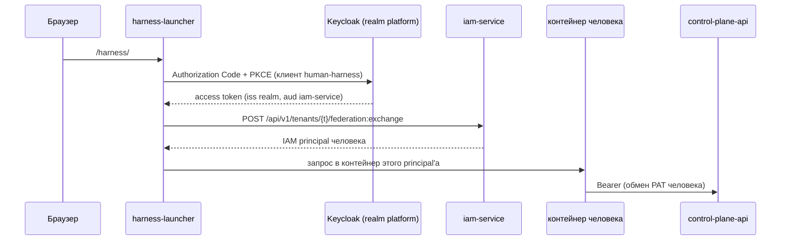
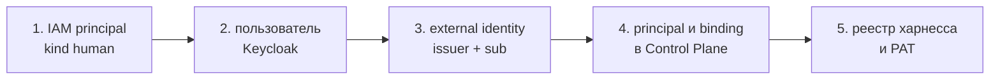

# Keycloak — внешний IdP людей

Keycloak в поставке — внешний identity provider людей: форма входа, пароли и
сессии браузера. Больше он ничего не решает: полномочия человека живут в IAM
(principal, PAT) и в Control Plane (binding и права). Статья описывает профиль
compose `idp`, realm `platform` и его клиенты, служебные скрипты Admin API,
регистрацию Keycloak в IAM и порядок заведения человека. Для администраторов
инсталляции.

## Роль Keycloak в цепочке identity

Токены Keycloak потребляют сервер [консоли](../operator/console.md#login) (клиент
`runtime-console`) и launcher личных харнессов (`harness-launcher`, профиль `harness`,
клиент `human-harness`). Оба проводят человека через вход в Keycloak и сразу обменивают
полученный токен в IAM — например, launcher:



Keycloak отвечает только на вопрос «кто этот человек». Какой principal ему
соответствует, решает IAM по связи external identity; что человек может в
Control Plane — binding его principal'а (см.
[Авторизация и права](../control-plane/authorization.md#bindings)). Агенты,
сервисы и MCP-плагин оператора Keycloak не используют: их identity — Platform
Access Token или client credentials IAM.

## Развёртывание: профиль `idp`

Профиль `idp` `deploy/local/compose.yml` поднимает три сервиса:

| Сервис | Что делает |
|---|---|
| `keycloak-db` | PostgreSQL 16 только для Keycloak: БД и роль `keycloak`, пароль `KEYCLOAK_DB_PASSWORD`, том `keycloak_db` |
| `realm-render` | Одноразовый контейнер: подставляет публичный адрес в шаблон realm и кладёт результат в том `realm_import` |
| `keycloak` | Keycloak 26 (`start --import-realm`), слушает `8080` в сети compose, на хосте — `127.0.0.1:${KEYCLOAK_HOST_PORT}` (по умолчанию `18081`) |

Консоль и рабочие места людей входят через Keycloak: профиль `console` поднимает и
сервисы `idp`, а профиль `harness` требует `idp` — без Keycloak launcher не может впустить
человека.

```bash
make up PROFILES="core edge console"            # консоль и Keycloak
make up PROFILES="core edge console harness"    # и ассистент
```


### Параметры контейнера `keycloak`

| Переменная | Значение | Смысл |
|---|---|---|
| `KC_HOSTNAME` | `${TAIMEN_PUBLIC_URL}/auth` | публичный адрес с префиксом; issuer realm = `${TAIMEN_PUBLIC_URL}/auth/realms/platform` |
| `KC_HTTP_RELATIVE_PATH` | `/auth` | Keycloak обслуживает всё под `/auth` |
| `KC_HOSTNAME_STRICT` | `${KEYCLOAK_HOSTNAME_STRICT:-true}` | локально по http выключают (`false`), в промышленной инсталляции — `true` |
| `KC_PROXY_HEADERS` | `xforwarded` | доверять `X-Forwarded-*` от Caddy |
| `KC_HTTP_ENABLED` | `true` | TLS терминирует Caddy |
| `KC_HEALTH_ENABLED` | `true` | healthcheck `GET /auth/health/ready` на management-порту 9000 |
| `KC_DB_URL_HOST`, `KC_DB_URL_DATABASE` | `keycloak-db`, `keycloak` | своя база в `keycloak-db` |
| `KC_BOOTSTRAP_ADMIN_USERNAME` / `_PASSWORD` | `KEYCLOAK_ADMIN` / `KEYCLOAK_ADMIN_PASSWORD` | администратор realm `master` (применяется только при первом старте) |

Лимит памяти — `KEYCLOAK_MEM_LIMIT` (по умолчанию `768m`), у `keycloak-db` —
общий `PG_MEM_LIMIT`. Секреты `KEYCLOAK_DB_PASSWORD` и
`KEYCLOAK_ADMIN_PASSWORD` заполняет `make secrets`.

### Шаблон realm

Realm описан в git шаблоном `deploy/keycloak/platform-realm.json`. Keycloak при
импорте не разворачивает переменные окружения, поэтому `realm-render`
заменяет плейсхолдер `__WEB_BASE_URL__` на `TAIMEN_PUBLIC_URL` (redirect URI и web
origins клиентов консоли и ассистента). Клиенты консоли (`runtime-console`) и
ассистента (`human-harness`) входят в шаблон: новая инсталляция получает их при первом
импорте.


!!! danger "Импорт realm выполняется только при первом старте"
    `--import-realm` создаёт realm, **если его ещё нет**. Правка шаблона и
    перезапуск Keycloak на уже импортированный realm не действуют: живой realm
    хранится в `keycloak-db`. Изменения в существующем realm вносятся через
    Admin API или админ-консоль; шаблон держите в согласии с ними, чтобы новая
    инсталляция получила то же при импорте.

## Realm `platform`

### Основные настройки

| Параметр | Значение |
|---|---|
| `sslRequired` | `external` |
| `loginWithEmailAllowed` | `true` (вход по e-mail) |
| `duplicateEmailsAllowed` | `false` |
| `registrationAllowed` | `false` — самостоятельной регистрации нет |
| `resetPasswordAllowed` | `true` |
| `rememberMe` | `true` |
| `bruteForceProtected` | `true` — защита от подбора пароля на стороне IdP |
| `accessTokenLifespan` | `300` с |
| `ssoSessionIdleTimeout` | `1800` с |
| `ssoSessionMaxLifespan` | `36000` с |
| `defaultSignatureAlgorithm` | `RS256` |

### Клиенты

| Клиент | Назначение |
|---|---|
| `runtime-console` | вход в [консоль](../operator/console.md#login): confidential, Authorization Code + PKCE `S256`, redirect `${TAIMEN_PUBLIC_URL}/console/_auth/callback` |
| `human-harness` | вход launcher'а личных харнессов: Authorization Code + PKCE `S256`, redirect `${TAIMEN_PUBLIC_URL}/harness/*` |
| `iam-service` | bearer-only, только audience: IAM принимает upstream-токены, адресованные ему |

У клиентов консоли и ассистента есть маппер `iam-service-audience`
(`oidc-audience-mapper`): добавляет `iam-service` в `aud` токенов. Именно этот audience
IAM проверяет у провайдера `keycloak`.


Ролей realm, групповых мапперов и атрибутов организации в realm нет: они не
нужны ни IAM, ни Control Plane.

### User profile

Realm объявляет декларативный user profile. Для заведения людей важно:
`email` обязателен, а скрипт `keycloak-users.py` всегда заполняет `firstName` и
`lastName` — без них Keycloak может потребовать дозаполнить профиль при входе
(required action). Необъявленные атрибуты может менять только администратор
(`unmanagedAttributePolicy: ADMIN_EDIT`).

## Служебные скрипты Admin API {#scripts}

Скрипты лежат в `deploy/keycloak/`, используют только стандартную библиотеку
Python и ходят в Keycloak по внутреннему адресу `http://keycloak:8080/auth`
(переопределяется `KC_INTERNAL_URL`). Запускаются одноразовым контейнером в сети
compose; строка запуска — в docstring каждого скрипта.

| Скрипт | Что делает | Окружение |
|---|---|---|
| `keycloak-users.py` | Создаёт или обновляет людей в realm: профиль (`email`, `firstName`, `lastName`, `emailVerified: true`), пароль. Идемпотентен. Печатает `{"username", "id"}` — `id` и есть `sub` пользователя | `KC_ADMIN_PASSWORD`, `KC_USERS` (JSON-массив: `username`, `email`, `password`, необязательно `first_name`, `last_name`, `temporary`), `KC_ADMIN_USERNAME`, `KC_REALM` |
| `keycloak-runtime-console-client.py` | Заводит confidential-клиент консоли `runtime-console` (Code + PKCE S256, redirect `<адрес>/console/_auth/callback`, audience `iam-service` в id и access token) или приводит существующий к шаблону. Секрет берёт из файла или генерирует и пишет туда (0600), на экран не печатает | `KC_ADMIN_PASSWORD`, `WEB_BASE_URL`, `SECRET_FILE` (по умолчанию `/secrets/runtime-console-oidc-secret` — смонтировать `secrets/`), `LOCAL_PORTS` |

```bash
docker run --rm --network taimen_default -v "$PWD/deploy/keycloak:/s:ro" \
  -e KC_ADMIN_PASSWORD="$KEYCLOAK_ADMIN_PASSWORD" \
  -e KC_USERS='[{"username":"alice","email":"alice@example.com","first_name":"Alice","last_name":"Example","password":"<пароль>"}]' \
  python:3.12-alpine python /s/keycloak-users.py
# {"username": "alice", "id": "<sub>"}
```

Сеть — `TAIMEN_NETWORK` из `.env` (по умолчанию `taimen_default`). Пароли
передаются только через окружение и не печатаются.

!!! tip "Постоянный или временный пароль"
    По умолчанию скрипт ставит пароль с `temporary: false`. С
    `"temporary": true` Keycloak попросит сменить пароль на своей странице при
    первом входе — для входа в харнесс это допустимо, он идёт через страницу
    Keycloak.

## Регистрация Keycloak в IAM {#iam-provider}

Чтобы IAM принимал токены Keycloak в `federation:exchange`, realm
регистрируется в tenant IAM как identity provider. `make bootstrap` этого не
делает — шаг выполняется один раз bootstrap-токеном IAM по адресу на хосте
(на периметре административные пути IAM закрыты):

```bash
IAM=http://127.0.0.1:18010
curl -s -X POST "$IAM/api/v1/tenants/$IAM_TENANT_ID/identity-providers" \
  -H "X-IAM-Bootstrap-Token: $IAM_BOOTSTRAP_TOKEN" -H "Content-Type: application/json" \
  -d '{
    "key": "keycloak",
    "issuer": "https://platform.example.com/auth/realms/platform",
    "audience": "iam-service",
    "lifecycleProfile": "managed"
  }'
```

| Поле | Значение | Почему |
|---|---|---|
| `key` | `keycloak` | имя провайдера, которое передаёт launcher |
| `issuer` | issuer realm | ровно тот `iss`, что в токенах Keycloak |
| `audience` | `iam-service` | токены несут его благодаря маппёру `iam-service-audience` |
| `subjectClaim`, `externalIdClaim` | по умолчанию `sub` | стабильный id пользователя Keycloak |
| `lifecycleProfile` | `managed` | позволяет заранее привязать внешнюю identity к существующему principal'у; при `read_only` ручная привязка отвечает `409 identity_provider_managed` |

`jwksUri` можно не указывать: IAM возьмёт его из discovery по публичному
адресу issuer (в сети compose этот адрес ведёт на Caddy благодаря псевдониму
`${TAIMEN_PUBLIC_HOST}`). Подробности проверки токена и связывания — в статье
[Федерация identity](federation.md).

## Заведение человека {#onboarding}

Основной путь — [консоль](../operator/console.md#people), раздел «Люди и роли»:
администратор людей вводит имя, e-mail, идентификатор пользователя Keycloak (`sub`,
ID в разделе Users), workspace, роли и профиль прав, а консоль одним идемпотентным
потоком проходит шаги 1, 3 и 4 ниже и выдаёт ссылку первого входа. Пользователя в
самом Keycloak (шаг 2) и личное рабочее место (шаг 5) консоль не заводит.

Инвайтов нет. Если консоли нет или нужен ручной путь, человека заводят пятью
шагами; порядок важен — binding в Control Plane должен существовать до первого
запроса человека.



1. **IAM principal** — bootstrap-эндпоинт IAM:

    ```bash
    curl -s -X POST "$IAM/api/v1/tenants/$IAM_TENANT_ID/principals" \
      -H "X-IAM-Bootstrap-Token: $IAM_BOOTSTRAP_TOKEN" -H 'Content-Type: application/json' \
      -d '{"kind": "human", "displayName": "Alice Example"}'
    ```

    `id` ответа — `<iam-principal-id>`.

2. **Пользователь Keycloak** — `deploy/keycloak/keycloak-users.py` (см.
   [Служебные скрипты](#scripts)); `id` из вывода — `sub` пользователя.

3. **Связь внешней identity с principal**:

    ```bash
    curl -s -X POST \
      "$IAM/api/v1/tenants/$IAM_TENANT_ID/principals/<iam-principal-id>/external-identities" \
      -H "X-IAM-Bootstrap-Token: $IAM_BOOTSTRAP_TOKEN" -H 'Content-Type: application/json' \
      -d '{"issuer": "https://platform.example.com/auth/realms/platform", "subject": "<sub>"}'
    ```

    Без этого шага первый вход создаст **новый** principal (JIT), а не
    использует заведённый в шаге 1.

4. **Principal и binding в Control Plane** — `POST /api/v1/principals` и
   `POST /api/v1/principals/{id}/iam-bindings` токеном администратора ядра
   (пример запросов — в статье [Identity агента](../runner/agent-identity.md);
   для человека `kind: human`). Для работы в харнессе binding нужны
   `tasks.claim` и `skills.invoke` сверх базовых прав чтения и записи.

5. **Личный харнесс** — запись `{"iamPrincipalId": "<iam-principal-id>", "name": …, "email": …}`
   в реестр людей (`deploy/harness-people.json`) и
   `make bootstrap ARGS="--harness-people deploy/harness-people.json"`: шаг 8
   выпускает PAT человека и обновляет реестр launcher'а (см.
   [Рабочее место человека](../workplace/index.md)).

Дальше человек входит в консоль `${TAIMEN_PUBLIC_URL}/console/` e-mail'ом и паролем из
шага 2; ассистент открывается в ней панелью (`${TAIMEN_PUBLIC_URL}/harness/` ведёт туда же). Работать с ядром из Claude Code он может через MCP-плагин по своему PAT
(см. [MCP-плагин](../operator/mcp-plugin.md)).

## Эксплуатация

### Изменения в живом realm

Все изменения после первого импорта — через Admin API
(`/auth/admin/realms/platform/…`), скрипты `deploy/keycloak/` или админ-консоль
`https://platform.example.com/auth/admin/`.

!!! warning "Админ-консоль доступна снаружи"
    Раскладка Caddy проксирует весь `/auth/*`, включая `/auth/admin/`. В
    промышленной инсталляции ограничьте доступ к `/auth/admin/*` на внешнем
    контуре (allow-list адресов или отдельный внутренний вход) и используйте
    стойкий `KEYCLOAK_ADMIN_PASSWORD`.

### Отключение человека

Отключение учётной записи в Keycloak закрывает только новый вход в харнесс.
Чтобы закрыть доступ полностью, отключите principal в IAM
(`POST …/principals/{id}:disable` — отзывает и его PAT) и отзовите binding в
Control Plane (см. [Аварийные процедуры](../operations/emergency.md)).

### Резервное копирование

Состояние Keycloak (пользователи, пароли, живой realm) — в базе `keycloak`
сервиса `keycloak-db`, том `keycloak_db`. Бэкап — `pg_dump` этой базы (см.
[Резервное копирование](../operations/backup.md)).

## Типичные проблемы

| Симптом | Причина | Что делать |
|---|---|---|
| Правка шаблона realm не применилась | realm импортируется только при первом старте | Admin API или скрипты `deploy/keycloak/` |
| Консоль получает `invalid_client` | в живом realm нет клиента `runtime-console` | `keycloak-runtime-console-client.py` |
| Keycloak долго в `starting`, затем OOM | JVM не укладывается в `KEYCLOAK_MEM_LIMIT` | поднять лимит, проверить свободную память хоста |
| Ошибка про hostname или редиректы на внутренний адрес | `KC_HOSTNAME` строится из `TAIMEN_PUBLIC_URL`; при `KEYCLOAK_HOSTNAME_STRICT=true` запросы с другим именем отвергаются | проверить `TAIMEN_PUBLIC_URL` |
| Нет доступа к админ-консоли | пароль администратора сменили в Keycloak, а `.env` устарел, или наоборот | `KEYCLOAK_ADMIN_PASSWORD` применяется только при первом старте; меняйте пароль в самом Keycloak |
| Launcher отвечает «Вход запрещён» | IAM отказал в `federation:exchange`: провайдер не зарегистрирован, не совпадает issuer или audience, principal отключён | [Ошибки федерации](federation.md#federation-errors) |
| После входа человек работает под новым лишним principal'ом | external identity не была привязана заранее — сработало JIT-создание | привязать identity к нужному principal'у (шаг 3), лишний principal отключить |

## См. также

- [Федерация identity](federation.md)
- [Tenants и principals](principals.md#external-identity)
- [Рабочее место человека](../workplace/index.md)
- [Авторизация и права](../control-plane/authorization.md#bindings)
- [Секреты и ротация](../operations/secrets.md)
