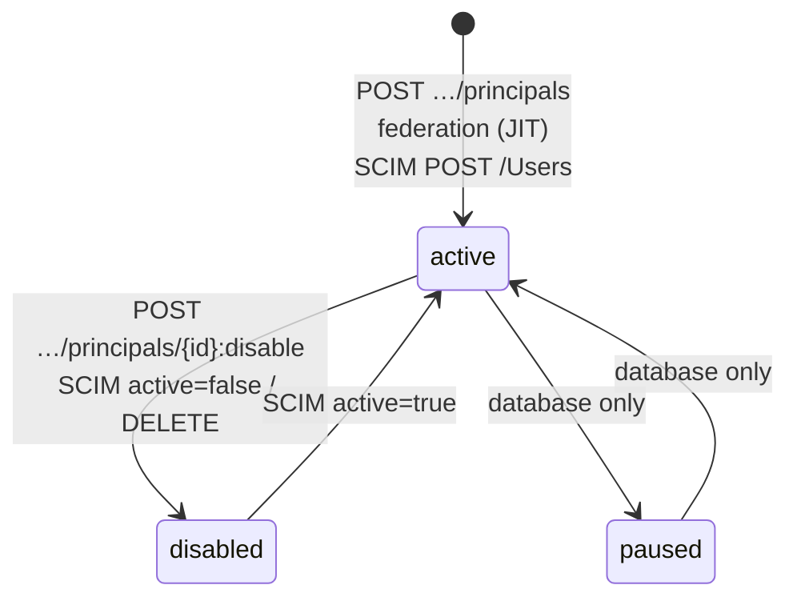

# Tenants and principals

This article describes the core IAM entities (tenant, principal, membership,
groups, and external identity), their lifecycle, and the administrative
operations on them. It is for the installation administrator who creates
people, agents, and services.

All operations in this article are performed with the
`X-IAM-Bootstrap-Token` header (see [Configuration](configuration.md#bootstrap-token)).
In the examples:

```bash
export IAM_URL=http://127.0.0.1:18010          # or https://platform.example.com/iam
export BT="X-IAM-Bootstrap-Token: $IAM_BOOTSTRAP_TOKEN"
```

## Tenant

A tenant is an isolated organization. All audiences, groups, identity
providers, PATs, and events are addressed within a tenant; a principal joins a
tenant through a membership.

| Field | Type | Description |
|---|---|---|
| `id` | UUID | Identifier. You can set it explicitly on creation |
| `slug` | string | Unique key: `^[a-z0-9][a-z0-9-]{1,78}[a-z0-9]$` |
| `name` | string | Display name, 1–200 characters |
| `status` | `active` \| `disabled` | A disabled tenant blocks PAT exchange and issuance of new PATs |
| `created_at` | datetime | Creation time |

### Creating a tenant

```bash
curl -s -X POST "$IAM_URL/api/v1/tenants" -H "$BT" \
  -H 'Content-Type: application/json' \
  -d '{"slug":"acme","name":"Acme"}'
```

```json
{
  "id": "<tenant-id>",
  "slug": "acme",
  "name": "Acme",
  "status": "active",
  "created_at": "2026-01-15T10:00:00Z"
}
```

!!! tip "A single platform tenant"

    The `id` field in the request lets you set the tenant UUID explicitly, so
    that IAM and Control Plane refer to one organization by one identifier
    (`TAI-ADR-0030`). `make bootstrap` first creates the tenant in IAM and then
    passes its UUID to the Control Plane bootstrap. Write the resulting id to
    `.env` as `IAM_TENANT_ID`; the personal workspace launcher, fleet-controller, and runners use it.

Errors: `409 tenant_id_exists` (that `id` already exists), `409 tenant_slug_exists`,
`422` for an invalid `slug`/`name`.

!!! note "What the API does not have"
    The API cannot list, rename, or disable tenants. PAT checks honor the
    `disabled` status, but it can only be set directly in the IAM database.

## Principal

A principal is the subject on whose behalf an action is performed.

| Field | Type | Description |
|---|---|---|
| `id` | UUID | Identifier; goes into the `sub` of the access token |
| `kind` | `human` \| `agent` \| `service_account` \| `workload` | Kind of principal |
| `display_name` | string | Display name, 1–200 characters |
| `status` | `active` \| `paused` \| `disabled` | State; only `active` principals work |
| `created_at` | datetime | Creation time |

### Kinds of principal

| `kind` | Who it is | How it gets an access token | Notes |
|---|---|---|---|
| `human` | A person | PAT (local harness) or `federation:exchange` (browser) | Issuing a PAT requires a recent authentication context |
| `agent` | An autonomous agent working under its own identity | PAT | No authentication context needed; the token has no `auth_time` or `acr` |
| `service_account` | A platform service | Client credentials | Created only by the service accounts endpoint; no PAT is issued |
| `workload` | A short-lived execution instance | — | The kind is reserved by the model; the current version has no dedicated path to obtain a credential |

!!! note "Why an agent gets its own principal"
    An autonomous agent picks work from the queue itself and does not live
    inside someone else's run. If it used a person's credential, the work of
    the person and of the agent would be indistinguishable in audit. That is
    why each executor has its own principal of kind `agent` and its own PAT.
    See [Agent identity](../runner/agent-identity.md).

### Creating a principal

A principal is always created together with a membership in the given tenant.

```bash
curl -s -X POST "$IAM_URL/api/v1/tenants/$TENANT/principals" -H "$BT" \
  -H 'Content-Type: application/json' \
  -d '{"kind":"human","displayName":"Alice Operator"}'
```

```json
{
  "id": "<principal-id>",
  "kind": "human",
  "display_name": "Alice Operator",
  "status": "active",
  "created_at": "2026-01-15T10:01:00Z"
}
```

!!! warning "Request fields are camelCase"
    In the request body the name is written as `displayName`; the response
    returns fields in snake_case (`display_name`, `created_at`). This applies
    to all "basic" IAM entities (tenant, principal, audience, groups, identity
    providers). PATs and token exchange responses use camelCase.

With `kind` = `service_account`, this endpoint creates a principal, but no
client credentials appear for it: a service account with a secret is created
by a separate endpoint; see [Service accounts](service-accounts.md).

Errors: `404 tenant_not_found`, `422` for an unknown `kind` or an empty name.

### Reading a principal

```bash
curl -s "$IAM_URL/api/v1/tenants/$TENANT/principals/$PRINCIPAL" -H "$BT"
```

Returns the principal only if it has an **active** membership in this tenant;
otherwise `404 principal_not_found`. The API has no list of principals, so
save the identifiers when you create them (`deploy/bootstrap.py` does this by
writing them to `deploy/state/<env>.json`).

### Lifecycle



- **active** is the only working state: only an active principal can exchange
  a PAT, get a new PAT, or pass federation.
- **disabled** is set by the `:disable` operation or by SCIM deactivation.
  All of the principal's PATs are revoked in the same transaction.
- **paused** is a valid schema value; there is no API to move a principal into it.

Besides the principal status, the **membership** is checked as well: for a
given tenant, a principal without an active membership in it does not exist
(`principal_not_found`, or `principal_not_in_tenant` during federation).

### Disabling a principal

```bash
curl -s -X POST \
  "$IAM_URL/api/v1/tenants/$TENANT/principals/$PRINCIPAL:disable?reason=offboarding" \
  -H "$BT"
```

```json
{"principalId": "<principal-id>", "status": "disabled", "revokedCredentials": 2}
```

What happens:

1. The principal `status` becomes `disabled`.
2. All of the principal's unrevoked PATs are revoked (`revoke_reason` is the
   `reason` value, `principal_disabled` by default); a `credential.revoked`
   event is published for each.
3. A `principal.disabled` event is published with the number of revoked
   credentials.
4. Exchange of already issued PATs stops immediately; client credentials
   exchange for this principal's service account returns `401 invalid_client`;
   federation returns `403 principal_disabled`.

!!! warning "Access tokens already issued live until `exp`"
    IAM takes no part in access token verification on the service side. A
    token issued before the principal was disabled stays cryptographically
    valid until it expires (up to 300 s by default). Closing this window is
    the job of the resource service's revocation policy
    (see [platform-auth-sdk](../sdk/platform-auth-sdk.md)).

There is no reverse "enable" API call: reactivation is possible only through
SCIM (`active: true`) or in the database.

## Tenant membership

A membership (`tenant_memberships`) is a `(tenant_id, principal_id)` pair with
status `active`/`disabled`. It is created automatically:

- on `POST …/principals`;
- when a service account is created;
- on the first federated sign-in (JIT principal creation);
- during SCIM provisioning.

There is no separate API to add an existing principal to a second tenant.

## Groups

Groups are tenant-wide sets of principals. IAM stores them and projects
membership from external sources into them, but groups **by themselves** grant
no access: consuming services (for example, an external PDP) use them.

| Field | Description |
|---|---|
| `key` | Key unique within the tenant: `^[a-z0-9][a-z0-9._-]{1,118}[a-z0-9]$` |
| `name` | Display name |
| `source` | `local`: managed through the API; `federated`: from the IdP token; `scim`: from SCIM |

```bash
# create a local group
curl -s -X POST "$IAM_URL/api/v1/tenants/$TENANT/groups" -H "$BT" \
  -H 'Content-Type: application/json' \
  -d '{"key":"operators","name":"Operators"}'

# add a member
curl -s -X POST "$IAM_URL/api/v1/tenants/$TENANT/groups/$GROUP/members" -H "$BT" \
  -H 'Content-Type: application/json' \
  -d '{"principalId":"<principal-id>"}'
```

Errors: `409 group_exists`, `404 group_not_found`,
`409 group_is_federated` (the membership of federated/SCIM groups is set by
the external source and cannot be changed manually), `404 principal_not_found`,
`409 group_membership_exists`.

Group projection from the IdP is described in [Federation](federation.md#group-projection).

## External identity

An external identity links a principal to an account in an external IdP by the
`issuer + subject` pair. The pair is **globally** unique: one external account
cannot belong to two principals, whether in the same tenant or in different
tenants.

Usually an external identity is created automatically on the first federated
sign-in. You need a manual link when the principal already exists (for
example, an operator created by the bootstrap script before the IdP was
connected) and must sign in through the IdP under the same `principal_id`:

```bash
curl -s -X POST \
  "$IAM_URL/api/v1/tenants/$TENANT/principals/$PRINCIPAL/external-identities" \
  -H "$BT" -H 'Content-Type: application/json' \
  -d '{"issuer":"https://platform.example.com/auth/realms/platform","subject":"<sub from the IdP>"}'
```

On the first sign-in, the provider "adopts" such a record: the identity
provider is attached to it, a stable external ID is added, and
`federation.identity_adopted` is written to audit.

Errors: `404 principal_not_found`, `409 external_identity_exists`,
`409 identity_provider_managed`: an active provider with the `read_only`
profile is registered for the issuer, and its identities are managed by the
directory, not by the administrator (see [lifecycle profiles](federation.md#lifecycle-profiles)).

!!! tip "How to find the `subject`"

    `subject` is the value of the claim configured on the provider as
    `subjectClaim` (`sub` by default). In Keycloak, it is the UUID of the
    realm user.

## Link to principals in services

An IAM principal is an identity. For a principal to do anything in Control
Plane, Control Plane needs a **local** principal and a binding to the
`(issuer, iam_principal_id)` pair with a set of permissions. The binding is
created through the Control Plane API (or by `make bootstrap`); see
[Authorization and permissions](../control-plane/authorization.md).

!!! warning "Create the binding before the first request"
    Create the binding in Control Plane **before** the principal presents a
    token for the first time. Otherwise a negative answer may get cached on
    the service side. Details are in [Troubleshooting](../troubleshooting/auth.md).

## Events and audit

Every mutation writes the domain change, an outbox event, and an audit record
in one transaction. The event log is available at `GET /api/v1/events` (see
[API](api.md#events)). Event types relevant to this article:

| Event | When |
|---|---|
| `tenant.created` | a tenant is created |
| `principal.created` | a principal is created (API, federation, SCIM) |
| `principal.disabled` | a principal is disabled |
| `external_identity.linked` | an external identity is linked |
| `group.created`, `group.deleted` | a group is created/deleted |
| `group_membership.added`, `group_membership.removed` | group membership changes |

Event payloads contain only identifiers and limited metadata; secrets, hashes,
and the external `subject` are not published.

## See also

- [Credentials and PAT](credentials.md)
- [Service accounts](service-accounts.md)
- [Identity federation](federation.md)
- [IAM API](api.md)
- [Bootstrap](../getting-started/bootstrap.md)
