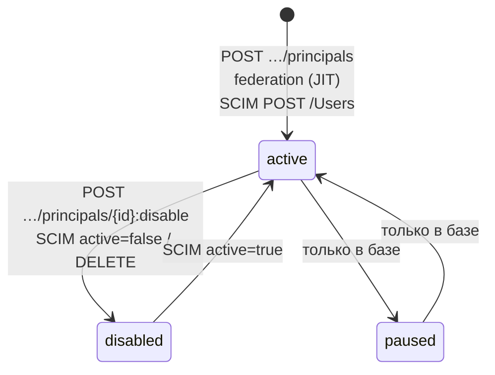

# Tenants и principals

Статья описывает базовые сущности IAM — tenant, principal, членство, группы и
external identity, — их жизненный цикл и административные операции над ними.
Для администратора инсталляции, который заводит людей, агентов и сервисы.

Все операции этой статьи выполняются с заголовком
`X-IAM-Bootstrap-Token` (см. [Конфигурация](configuration.md#bootstrap-token)).
В примерах:

```bash
export IAM_URL=http://127.0.0.1:18010          # или https://platform.example.com/iam
export BT="X-IAM-Bootstrap-Token: $IAM_BOOTSTRAP_TOKEN"
```

## Tenant

Tenant — изолированная организация. Все audiences, группы, identity providers,
PAT и события адресуются в разрезе tenant; principal попадает в tenant через
membership.

| Поле | Тип | Описание |
|---|---|---|
| `id` | UUID | Идентификатор. Можно задать явно при создании |
| `slug` | строка | Уникальный ключ: `^[a-z0-9][a-z0-9-]{1,78}[a-z0-9]$` |
| `name` | строка | Отображаемое имя, 1–200 символов |
| `status` | `active` \| `disabled` | Выключенный tenant закрывает обмен PAT и выпуск новых |
| `created_at` | datetime | Время создания |

### Создание tenant

```bash
curl -s -X POST "$IAM_URL/api/v1/tenants" -H "$BT" \
  -H 'Content-Type: application/json' \
  -d '{"slug":"acme","name":"Acme"}'
```

```json
{
  "id": "<tenant-id>",
  "slug": "acme",
  "name": "Acme",
  "status": "active",
  "created_at": "2026-01-15T10:00:00Z"
}
```

!!! tip "Единый tenant платформы"

    Поле `id` в запросе позволяет задать UUID tenant явно, чтобы IAM и Control
    Plane называли одну организацию одним идентификатором
    (`TAI-ADR-0030`). `make bootstrap` сначала создаёт tenant в IAM, а затем
    передаёт его UUID в bootstrap Control Plane. Полученный id нужно вписать в
    `.env` как `IAM_TENANT_ID` — его используют launcher рабочих мест, fleet-controller и runner'ы.

Ошибки: `409 tenant_id_exists` (такой `id` уже есть), `409 tenant_slug_exists`,
`422` — невалидный `slug`/`name`.

!!! note "Чего нет в API"
    Чтения списка tenants, переименования и выключения tenant через API нет.
    Статус `disabled` учитывается проверками PAT, но выставляется только
    напрямую в базе IAM.

## Principal

Principal — субъект, от имени которого выполняется действие.

| Поле | Тип | Описание |
|---|---|---|
| `id` | UUID | Идентификатор; попадает в `sub` access token |
| `kind` | `human` \| `agent` \| `service_account` \| `workload` | Вид principal |
| `display_name` | строка | Отображаемое имя, 1–200 символов |
| `status` | `active` \| `paused` \| `disabled` | Состояние; работают только `active` |
| `created_at` | datetime | Время создания |

### Виды principal

| `kind` | Кто это | Как получает access token | Особенности |
|---|---|---|---|
| `human` | Человек | PAT (локальный harness) или `federation:exchange` (браузер) | Выпуск PAT требует свежего authentication context |
| `agent` | Автономный агент, работающий под своей identity | PAT | Authentication context не нужен; в токене нет `auth_time` и `acr` |
| `service_account` | Сервис платформы | Client credentials | Создаётся только эндпоинтом service accounts; PAT не выпускается |
| `workload` | Короткоживущий экземпляр исполнения | — | Вид зарезервирован моделью; собственного пути получения credential в текущей версии нет |

!!! note "Почему агенту — собственный principal"
    Автономный агент берёт работу из очереди сам и не живёт внутри чужого
    прогона. Если бы он ходил credential'ом человека, работа человека и агента
    в audit стали бы неразличимы. Поэтому у каждого исполнителя — свой
    principal вида `agent` и свой PAT. См. [Identity агента](../runner/agent-identity.md).

### Создание principal

Principal всегда создаётся вместе с membership в указанном tenant.

```bash
curl -s -X POST "$IAM_URL/api/v1/tenants/$TENANT/principals" -H "$BT" \
  -H 'Content-Type: application/json' \
  -d '{"kind":"human","displayName":"Alice Operator"}'
```

```json
{
  "id": "<principal-id>",
  "kind": "human",
  "display_name": "Alice Operator",
  "status": "active",
  "created_at": "2026-01-15T10:01:00Z"
}
```

!!! warning "Поля запроса — в camelCase"
    В теле запроса имя пишется как `displayName`; ответ возвращает поля в
    snake_case (`display_name`, `created_at`). Это относится ко всем «базовым»
    сущностям IAM (tenant, principal, audience, группы, identity providers).
    PAT и ответы обмена токенов — в camelCase.

Для `kind` = `service_account` этим эндпоинтом можно создать principal, но
client credentials к нему не появятся: service account с секретом заводится
отдельным эндпоинтом, см. [Service accounts](service-accounts.md).

Ошибки: `404 tenant_not_found`, `422` — неизвестный `kind` или пустое имя.

### Чтение principal

```bash
curl -s "$IAM_URL/api/v1/tenants/$TENANT/principals/$PRINCIPAL" -H "$BT"
```

Возвращает principal, только если у него **активное** membership в этом
tenant; иначе `404 principal_not_found`. Списка principals в API нет —
идентификаторы сохраняйте при создании (так делает `deploy/bootstrap.py`,
записывая их в `deploy/state/<env>.json`).

### Жизненный цикл



- **active** — единственное рабочее состояние: только активный principal
  может обменять PAT, получить новый PAT, пройти федерацию.
- **disabled** — выставляется операцией `:disable` или SCIM-деактивацией.
  Все PAT principal отзываются в той же транзакции.
- **paused** — допустимое значение схемы; API для перевода в него нет.

Помимо статуса principal проверяется и **membership**: principal без активного
membership в tenant для этого tenant не существует (`principal_not_found`,
`principal_not_in_tenant` при федерации).

### Отключение principal

```bash
curl -s -X POST \
  "$IAM_URL/api/v1/tenants/$TENANT/principals/$PRINCIPAL:disable?reason=offboarding" \
  -H "$BT"
```

```json
{"principalId": "<principal-id>", "status": "disabled", "revokedCredentials": 2}
```

Что происходит:

1. `status` principal становится `disabled`.
2. Все неотозванные PAT principal отзываются (`revoke_reason` = значение
   `reason`, по умолчанию `principal_disabled`); по каждому публикуется
   событие `credential.revoked`.
3. Публикуется событие `principal.disabled` с числом отозванных credential.
4. Обмен уже выданных PAT прекращается немедленно; обмен client credentials
   service account этого principal отвечает `401 invalid_client`; федерация —
   `403 principal_disabled`.

!!! warning "Уже выданные access token живут до `exp`"
    IAM не участвует в проверке access token на стороне сервиса. Токен,
    выданный до отключения, остаётся криптографически валидным до истечения
    (по умолчанию до 300 с). Закрывать это окно — задача revocation-политики
    resource service (см. [platform-auth-sdk](../sdk/platform-auth-sdk.md)).

Обратного API-вызова «включить» нет: повторная активация возможна только
через SCIM (`active: true`) или в базе.

## Членство в tenant

Membership (`tenant_memberships`) — пара `(tenant_id, principal_id)` со
статусом `active`/`disabled`. Создаётся автоматически:

- при `POST …/principals`;
- при создании service account;
- при первом входе через федерацию (JIT-создание principal);
- при SCIM-провижининге.

Отдельного API для добавления существующего principal во второй tenant нет.

## Группы

Группы — глобальные для tenant наборы principals. IAM хранит их и проецирует
в них членство из внешних источников, но **сам по себе** доступ группы не
дают: их используют сервисы-потребители (например, внешний PDP).

| Поле | Описание |
|---|---|
| `key` | Уникальный в tenant ключ: `^[a-z0-9][a-z0-9._-]{1,118}[a-z0-9]$` |
| `name` | Отображаемое имя |
| `source` | `local` — ведётся через API; `federated` — из токена IdP; `scim` — из SCIM |

```bash
# создать локальную группу
curl -s -X POST "$IAM_URL/api/v1/tenants/$TENANT/groups" -H "$BT" \
  -H 'Content-Type: application/json' \
  -d '{"key":"operators","name":"Операторы"}'

# добавить участника
curl -s -X POST "$IAM_URL/api/v1/tenants/$TENANT/groups/$GROUP/members" -H "$BT" \
  -H 'Content-Type: application/json' \
  -d '{"principalId":"<principal-id>"}'
```

Ошибки: `409 group_exists`, `404 group_not_found`,
`409 group_is_federated` (состав federated/SCIM-групп задаёт внешний источник,
вручную его менять нельзя), `404 principal_not_found`,
`409 group_membership_exists`.

Проекция групп из IdP описана в [Федерации](federation.md#group-projection).

## External identity

External identity связывает principal с учётной записью внешнего IdP по паре
`issuer + subject`. Пара **глобально** уникальна: одна внешняя учётная запись
не может принадлежать двум principals — ни в одном, ни в разных tenants.

Обычно external identity создаётся автоматически при первом федеративном
входе. Ручная привязка нужна, когда principal уже существует (например,
оператор, заведённый bootstrap-скриптом до подключения IdP) и должен входить
через IdP под тем же `principal_id`:

```bash
curl -s -X POST \
  "$IAM_URL/api/v1/tenants/$TENANT/principals/$PRINCIPAL/external-identities" \
  -H "$BT" -H 'Content-Type: application/json' \
  -d '{"issuer":"https://platform.example.com/auth/realms/platform","subject":"<sub из IdP>"}'
```

При первом входе такая запись «усыновляется» провайдером: к ней привязывается
identity provider, дописывается стабильный external ID, а в audit пишется
`federation.identity_adopted`.

Ошибки: `404 principal_not_found`, `409 external_identity_exists`,
`409 identity_provider_managed` — для issuer зарегистрирован активный
провайдер с профилем `read_only`, его identities ведёт каталог, а не
администратор (см. [профили жизненного цикла](federation.md#lifecycle-profiles)).

!!! tip "Как узнать `subject`"

    `subject` — это значение claim, указанного у провайдера как
    `subjectClaim` (по умолчанию `sub`). В Keycloak это UUID пользователя
    realm.

## Связь с principal в сервисах

IAM principal — это identity. Чтобы principal мог что-то делать в Control
Plane, там должен быть **локальный** principal и binding к паре
`(issuer, iam_principal_id)` с набором прав. Binding создаётся API Control
Plane (или `make bootstrap`) — см. [Авторизация и права](../control-plane/authorization.md).

!!! warning "Binding — до первого запроса"
    Создавайте binding в Control Plane **до** того, как principal впервые
    предъявит токен. Иначе отрицательный ответ может закешироваться на стороне
    сервиса. Подробнее — в [Диагностике](../troubleshooting/auth.md).

## События и audit

Каждая мутация пишет в одной транзакции доменное изменение, событие outbox и
запись audit. Журнал событий доступен по `GET /api/v1/events` (см.
[API](api.md#events)). Типы событий, относящиеся к этой статье:

| Событие | Когда |
|---|---|
| `tenant.created` | создан tenant |
| `principal.created` | создан principal (API, федерация, SCIM) |
| `principal.disabled` | principal отключён |
| `external_identity.linked` | привязана external identity |
| `group.created`, `group.deleted` | создана/удалена группа |
| `group_membership.added`, `group_membership.removed` | изменён состав группы |

В payload событий попадают только идентификаторы и ограниченные метаданные —
секреты, хэши и внешний `subject` не публикуются.

## См. также

- [Credentials и PAT](credentials.md)
- [Service accounts](service-accounts.md)
- [Федерация identity](federation.md)
- [API IAM](api.md)
- [Bootstrap](../getting-started/bootstrap.md)
