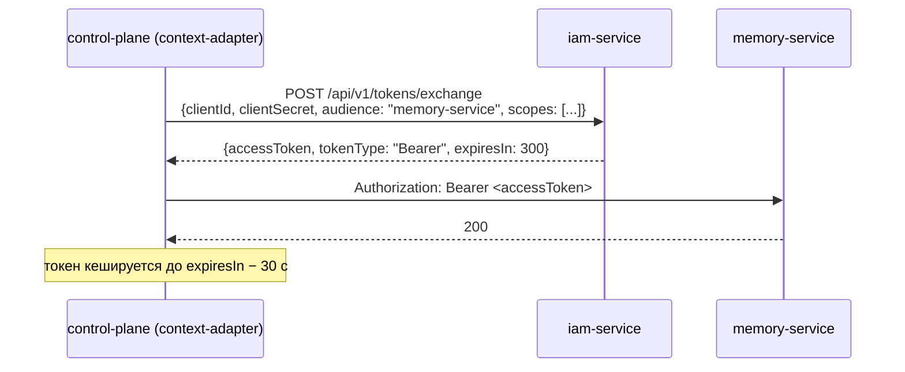

# Service accounts

Service account — собственная machine identity сервиса платформы. Статья
описывает, когда она нужна, как её завести, как сервис получает токен по
client credentials и как сменить или отозвать секрет. Для инженеров,
подключающих сервис, и для администраторов инсталляции.

## Зачем сервису своя identity


Токен IAM выпускается ровно для одного audience. Когда Control Plane должен
обратиться в память или в другой сервис, он не может «переслать»
токен пользователя — тот выпущен для audience `control-plane` и в другом
сервисе отклоняется. Поэтому сервис предъявляет **свой** credential и
получает токен нужного audience.



| | Service account | PAT |
|---|---|---|
| Вид principal | `service_account` | `human` или `agent` |
| Credential | `clientId` + `clientSecret` | `iam_pat_…` |
| Хранение секрета на сервере | Argon2-хэш | SHA-256 полного токена |
| Срок жизни credential | бессрочно, до отзыва | ограничен (`expiresAt`) |
| Несколько audiences | да | да |
| Пустой `scopes` при обмене | токен **без** scopes | весь потолок |
| `principal_type` в токене | `service_account` | `human`/`agent` |
| `scope_ceiling`, `session_id` в токене | нет | есть |

## Создание service account

```bash
curl -s -X POST "$IAM_URL/api/v1/tenants/$TENANT/service-accounts" \
  -H "X-IAM-Bootstrap-Token: $IAM_BOOTSTRAP_TOKEN" \
  -H 'Content-Type: application/json' \
  -d '{
        "displayName": "Reports Service",
        "audiences": ["control-plane", "memory-service"],
        "scopeCeiling": ["control-plane:read", "memory:read"]
      }'
```

```json
{
  "principalId": "<principal-id>",
  "clientId": "iam_sa_<случайная строка>",
  "clientSecret": "<секрет>"
}
```

Одним вызовом создаются principal вида `service_account`, его membership в
tenant и запись service account.

| Поле запроса | Обязательно | Правила |
|---|---|---|
| `displayName` | да | 1–200 символов |
| `audiences` | да | минимум один; все должны быть активными audiences tenant, иначе `422 unknown_audience` |
| `scopeCeiling` | нет | потолок scopes; при создании **не** сверяется с `allowedScopes` — лишнее просто не выдастся при обмене |

!!! danger "Секрет показывается один раз"
    `clientSecret` возвращается только в ответе на создание. Сервер хранит
    Argon2-хэш. Сразу запишите пару в файл с правами `0600` (в типовой
    инсталляции — `secrets/<service>-iam.env`) и не выводите её в логи.

## Обмен client credentials на токен

```bash
curl -s -X POST "$IAM_URL/api/v1/tokens/exchange" \
  -H 'Content-Type: application/json' \
  -d '{"clientId":"iam_sa_…","clientSecret":"…","audience":"memory-service","scopes":["memory:read"]}'
```

```json
{"accessToken": "eyJ…", "tokenType": "Bearer", "expiresIn": 300}
```

Проверки:

1. `clientId` существует и не отозван, секрет совпадает — иначе `401 invalid_client`.
2. Principal и его membership в tenant активны — иначе `401 invalid_client`.
3. `audience` входит в `audiences` service account и активен в tenant —
   иначе `403 audience_not_allowed`.
4. Каждый запрошенный scope входит **и** в `scopeCeiling`, **и** в
   `allowedScopes` audience — иначе `403 scope_not_allowed`.

После успеха обновляется `last_used_at`, в audit пишется `tokens.exchange`.

!!! warning "Scopes надо запрашивать явно"
    Пустой `scopes` даёт токен с `"scope": []`. Получатель, требующий scope,
    ответит `403`. Передавайте полный список нужных scopes.

### Готовый клиент в SDK

Сервисам не нужно писать обмен вручную: в
[platform-auth-sdk](../sdk/platform-auth-sdk.md) есть `ServiceTokenProvider`,
который обменивает client credentials, кеширует токен до момента за 30 с до
истечения и сбрасывает кэш по `forget()` (например, после `401` от
получателя):

```python
from platform_auth.service_identity import ServiceCredentials, ServiceTokenProvider

tokens = ServiceTokenProvider(
    "http://iam-service:8010",
    ServiceCredentials(
        client_id=settings.iam_client_id,
        client_secret=settings.iam_client_secret,
        audience="memory-service",
        scopes=("memory:read",),
    ),
)
access_token = await tokens()   # обмен или значение из кэша
```

Ошибки обмена SDK наружу не пересказывает (в теле ответа может оказаться эхо
секрета): провайдер поднимает `VerificationUnavailable("service_token_exchange_failed")`.

## Service accounts типовой инсталляции

`make bootstrap` (`deploy/bootstrap.py`) заводит следующие service accounts и
пишет их credentials в `secrets/` (0600). Сервисы подхватывают файлы через
`env_file` в `deploy/local/compose.yml`.


| Service account | Audiences | Потолок | Файл | Кто использует |
|---|---|---|---|---|
| Control Plane | `memory-service`, `openbao` | `memory:read`, `memory:write`, `memory:tenants`, `memory:on-behalf`, `memory:service`, `secrets:read` | `control-plane-iam.env` (`CP_IAM_CLIENT_ID`, `CP_IAM_CLIENT_SECRET`) | control-plane-api, worker, context-adapter |

!!! note "Service account — это ещё и principal в Control Plane"
    Если service account ходит в Control Plane (как коннектор или сервис уведомлений), ему,
    как и любому principal, нужен локальный principal ядра и binding с
    правами. Bootstrap создаёт их автоматически. См.
    [Авторизация и права](../control-plane/authorization.md).

После появления или смены env-файла сервисы нужно пересоздать, чтобы они
прочитали его: например,
`tools/compose up -d control-plane-api control-plane-worker context-adapter`.

## Смена секрета и изменение потолка { #update }

`PATCH /api/v1/tenants/{tenantId}/service-accounts/{clientId}` меняет учётку на
месте: principal и `clientId` остаются прежними, поэтому права в Control Plane и
агенты, которыми владеет учётка, остаются за ней (iam-service ADR-0005). Вызывает
только bootstrap (`X-IAM-Bootstrap-Token`).

| Поле | Описание |
|---|---|
| `audiences` | Новый список audiences целиком (не пустой); каждый должен быть зарегистрирован и активен в tenant |
| `scopeCeiling` | Новый потолок целиком; каждый scope — из `allowedScopes` указанных audiences |
| `rotateSecret` | `true` — выпустить новый секрет; прежний гаснет тем же commit |

Пропущенное поле не меняется. Без изменений и без `rotateSecret` IAM ничего не
пишет и отдаёт представление учётки — так пустой `PATCH {}` проверяет, что учётка
жива.

```bash
curl -s -X PATCH "$IAM_URL/api/v1/tenants/$TENANT/service-accounts/$CLIENT_ID" \
  -H "X-IAM-Bootstrap-Token: $IAM_BOOTSTRAP_TOKEN" -H "Content-Type: application/json" \
  -d '{"rotateSecret": true}'
```

```json
{"principalId": "<principal-id>", "clientId": "<client-id>",
 "audiences": ["memory-service"], "scopeCeiling": ["memory:read"],
 "clientSecret": "<новый секрет — показывается один раз>"}
```

`clientSecret` в ответе есть только при `rotateSecret`. Уже выданные access token
живут до своего `exp`. Изменение пишет событие `service_account.updated` и audit
`service_accounts.update` (разница вида `audience:+x`, `scope:-y`), смена секрета —
`service_account.secret_rotated` и `service_accounts.rotate_secret`.

После смены секрета запишите его в env-файл сервиса (0600) и пересоздайте
контейнеры сервиса.

### Как это делает bootstrap


Для учёток ядра и `notification-service` `deploy/bootstrap.py` держит в state
отпечаток (scopes и audiences) и на каждом запуске:

1. сверяется с IAM пустым `PATCH {}`; principal в ответе не тот, что в state, —
   остановка до любой записи;
2. потолок в коде изменился — сначала приводит `allowedScopes` audiences, затем
   `PATCH` с полными `audiences` и `scopeCeiling`;
3. env-файла нет — `PATCH {"rotateSecret": true}` и сразу пишет новый секрет в
   env-файл (атомарно); остаётся перезапустить сервис;
4. IAM ответил `404 service_account_not_found` или `409 service_account_revoked` —
   заводит новую учётку (`POST`).

IAM без маршрута `PATCH` останавливает bootstrap: тихого перехода на новую учётку
нет.

### Новая учётка вместо прежней

Если прежняя учётка отозвана или её нужно заменить целиком — «выпустить новую,
переключить, отозвать старую»:

1. Создайте новый service account (`POST …/service-accounts`).
2. Запишите новую пару в env-файл сервиса (0600).
3. Пересоздайте контейнеры сервиса и убедитесь, что обмен работает.
4. Отзовите прежний `clientId`:

    ```bash
    curl -s -X POST \
      "$IAM_URL/api/v1/tenants/$TENANT/service-accounts/$OLD_CLIENT_ID:revoke" \
      -H "X-IAM-Bootstrap-Token: $IAM_BOOTSTRAP_TOKEN"
    # 204
    ```

!!! warning "Новый service account — новый principal"
    Каждое создание заводит **новый** principal с новым `principal_id`
    (`sub` в токене). Если получатель привязывает права к principal (например,
    binding в Control Plane или роль ядра в хранилище секретов), их нужно
    завести и для нового principal. Поэтому смена потолка и секрета идёт через
    `PATCH`, а не через новую учётку.

## Отзыв

`POST …/service-accounts/{clientId}:revoke`:

- выставляет `revoked_at`; повторный вызов идемпотентен (`204`);
- публикует событие `credential.revoked` (aggregate `service_account`) и
  пишет audit `service_accounts.revoke`;
- все следующие обмены этого `clientId` получают `401 invalid_client`.

Уже выданные токены живут до `exp` (по умолчанию до 300 с) — см.
[окно отзыва](tokens.md#revocation-window).

Отключение principal service account (`:disable`) тоже закрывает обмен
(`invalid_client`), но запись service account при этом не помечается
отозванной.

## Ошибки

| HTTP | `detail` | Операция | Причина |
|---|---|---|---|
| 401 | `unauthorized` | создание, отзыв, `PATCH` | нет или неверный `X-IAM-Bootstrap-Token` |
| 401 | `invalid_client` | обмен | неизвестный/отозванный `clientId`, неверный секрет, неактивный principal или membership |
| 403 | `audience_not_allowed` | обмен | audience не в списке service account или не активен |
| 403 | `scope_not_allowed` | обмен | scope вне потолка или вне `allowedScopes` (частая причина — без префикса) |
| 404 | `service_account_not_found` | отзыв, `PATCH` | `clientId` не найден в tenant |
| 409 | `service_account_revoked` | `PATCH` | учётка отозвана |
| 422 | `unknown_audience` | создание, `PATCH` | audience не зарегистрирован или выключен |
| 422 | `invalid_scope_ceiling` | `PATCH` | scope вне `allowedScopes` указанных audiences |

## См. также

- [Токены, audiences, scopes](tokens.md)
- [platform-auth-sdk](../sdk/platform-auth-sdk.md)
- [Клиенты сервисов](../sdk/clients.md)
- [Секреты и ротация](../operations/secrets.md)
- [API IAM](api.md#service-accounts)
