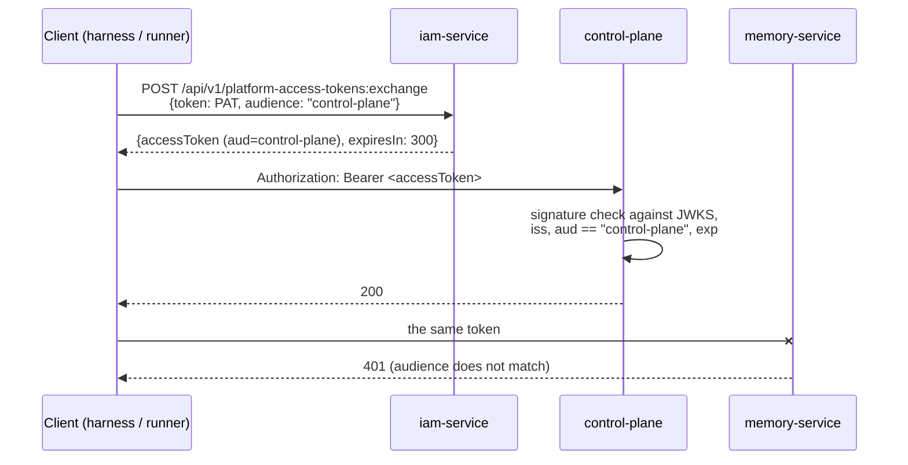

# Tokens, audiences, scopes

This article describes short-lived IAM access tokens: how to obtain them by
exchange, which claims they carry, how audiences and scopes work, how services
verify the signature against JWKS, and how to change the signing key safely.
It is for engineers who connect a service to the platform and for
administrators.

## Principle: one token, one service

Long-lived credentials (PAT, service account secret, IdP upstream token) never
reach a resource service. They are presented only to IAM, which returns an
**access token for exactly one audience** with a lifetime of
`IAM_TOKEN_TTL_SECONDS` (300 s by default).



## Audiences

An audience is a service registered in the tenant as a token recipient, with a
registry of allowed scopes (`allowedScopes`). A token can be issued only for
an active audience, and only with scopes from its registry.

### Audience registry of a typical installation

`deploy/bootstrap.py` creates the following audiences and keeps them in line
with the code:

| Audience | `allowedScopes` |
|---|---|
| `control-plane` | `control-plane:read`, `control-plane:write`, `control-plane:admin` |
| `memory-service` | `memory:read`, `memory:write`, `memory:pii`, `memory:tenants`, `memory:on-behalf`, `memory:service` |

The owning service defines what each scope means; see
[Permissions and scopes](../reference/permissions.md).

!!! warning "A scope includes the audience prefix"
    A scope is the entire string from `allowedScopes`: `control-plane:write`,
    not `write`. Requesting a short `write` for the `control-plane` audience
    returns `403 scope_not_allowed`. IAM does not interpret scopes; it only
    compares strings against the registry.

### Managing audiences

```bash
# create
curl -s -X POST "$IAM_URL/api/v1/tenants/$TENANT/audiences" -H "$BT" \
  -H 'Content-Type: application/json' \
  -d '{"key":"reports","allowedScopes":["reports:read","reports:write"]}'

# list
curl -s "$IAM_URL/api/v1/tenants/$TENANT/audiences" -H "$BT"

# replace allowedScopes entirely (idempotent)
curl -s -X PATCH "$IAM_URL/api/v1/tenants/$TENANT/audiences/reports" -H "$BT" \
  -H 'Content-Type: application/json' \
  -d '{"allowedScopes":["reports:read","reports:write","reports:admin"]}'
```

```json
{
  "id": "<audience-id>",
  "tenant_id": "<tenant-id>",
  "key": "reports",
  "allowed_scopes": ["reports:admin", "reports:read", "reports:write"],
  "status": "active"
}
```

| Rule | Value |
|---|---|
| `key` | `^[a-z0-9][a-z0-9._-]{1,118}[a-z0-9]$`, unique within the tenant |
| scope | non-empty string up to 120 characters, otherwise `422 invalid_scope` |
| order | `allowedScopes` are sorted and deduplicated |
| `PATCH` | replaces the list entirely; on change, writes an `audience.updated` event; with no change, it is a no-op |

Errors: `404 tenant_not_found`, `409 audience_exists`, `404 audience_not_found`.

!!! note "Narrowing the registry does not revoke what was issued"
    A `PATCH` with a narrower list affects **subsequent** exchanges: a scope
    removed from the registry is no longer issued, even if it is in the
    ceiling of a PAT or service account. Access tokens already issued live
    until `exp`. The API cannot disable an audience (`status = disabled`);
    only the database can.

## Exchanging a PAT for an access token

```bash
curl -s -X POST "$IAM_URL/api/v1/platform-access-tokens:exchange" \
  -H 'Content-Type: application/json' \
  -d '{"token":"iam_pat_…","audience":"control-plane","scopes":["control-plane:read"]}'
```

```json
{
  "accessToken": "eyJhbGciOiJSUzI1NiIsImtpZCI6…",
  "tokenType": "Bearer",
  "expiresIn": 300,
  "audience": "control-plane",
  "scope": ["control-plane:read"],
  "sessionId": "<session-id>"
}
```

The tenant and principal are not passed in the request; they come from the
PAT record. This endpoint does not accept an IAM access token itself (it is
not recognized as a PAT and yields `401 invalid_token`).

Checks, in order:

1. The PAT is valid (see [Credentials](credentials.md)); otherwise `401 invalid_token`.
2. `audience` is in the PAT's `audiences` **and** is active in the tenant;
   otherwise `403 audience_not_allowed`.
3. The requested scopes are within the intersection `scopeCeiling ∩ allowedScopes`;
   otherwise `403 scope_not_allowed`.
4. The PAT's `lastUsedAt` is updated, and `platform_access_tokens.exchange` is
   written to audit with the `session_id`.

## Effective scopes

The rule depends on how the token is obtained:

| Path | Empty `scopes` in the request | Non-empty `scopes` | `scope_ceiling` claim |
|---|---|---|---|
| PAT `:exchange` | `scopeCeiling ∩ allowedScopes` | must be within `scopeCeiling ∩ allowedScopes` | the PAT's `scopeCeiling` |
| `federation:exchange` | the audience's entire `allowedScopes` | must be within `allowedScopes` | the audience's `allowedScopes` |
| client credentials `tokens/exchange` | **empty list** | must be within `scopeCeiling ∩ allowedScopes` | none |

!!! tip "A service account must request scopes explicitly"
    With client credentials, an empty request yields a token **with no
    scopes**, not "the whole ceiling". A service with such a token will most
    likely get `403` from the recipient. Always pass the scopes you need.

The ceiling only narrows authority: a scope missing from the audience's
`allowedScopes` does not get into the token, even if it is in the ceiling.

## Access token format

A JWT signed with RS256. Header:

```json
{"alg": "RS256", "kid": "<IAM_SIGNING_KEY_ID>", "typ": "at+jwt"}
```

Payload of a token obtained by exchanging a human's PAT:

```json
{
  "iss": "https://platform.example.com/iam",
  "sub": "<principal-id>",
  "tenant_id": "<tenant-id>",
  "aud": "control-plane",
  "scope": ["control-plane:read", "control-plane:write"],
  "principal_type": "human",
  "credential_id": "<credential-id>",
  "scope_ceiling": ["control-plane:read", "control-plane:write"],
  "session_id": "<session-id>",
  "auth_time": "2026-01-15T10:05:00+00:00",
  "acr": "bootstrap",
  "iat": 1768471510,
  "nbf": 1768471510,
  "exp": 1768471810,
  "jti": "<uuid>"
}
```

### Claims

| Claim | Always | Description |
|---|---|---|
| `iss` | yes | `IAM_ISSUER`, the public IAM address |
| `sub` | yes | `principal_id` |
| `tenant_id` | yes | the principal's tenant |
| `aud` | yes | **a single string**, not a list |
| `scope` | yes | **an array of strings** (not a space-separated string); may be empty |
| `principal_type` | yes | `human`, `agent`, or `service_account` |
| `credential_id` | yes | id of the credential: PAT, service account, or external identity (for federation); the key for the service's revocation cache |
| `iat`, `nbf`, `exp` | yes | issuance and expiration time (`exp = iat + IAM_TOKEN_TTL_SECONDS`) |
| `jti` | yes | unique token id |
| `scope_ceiling` | PAT, federation | the ceiling from which scopes were computed |
| `session_id` | PAT, federation | a new UUID for each exchange; goes into the IAM audit |
| `auth_time` | human | sign-in moment in **ISO 8601** format (not a number of seconds) |
| `acr` | human, if known | authentication level from the authentication context |

How tokens of different principals differ:

| `principal_type` | `auth_time`, `acr` | `scope_ceiling`, `session_id` |
|---|---|---|
| `human` (PAT) | from the authentication context captured at PAT issuance | present |
| `human` (federation) | from the upstream token of the current sign-in | present |
| `agent` (PAT) | **absent** | present |
| `service_account` | absent | absent |

!!! note "What the token does not contain"
    The token has no Product, Plan, License, Workspace, Project, Task, or
    memory namespace, and no domain permissions. `scope` is a ceiling, not a
    permission: the service derives the specific right itself (for Control
    Plane, from the principal binding; see
    [Authorization and permissions](../control-plane/authorization.md)).

## Token verification by a service

Platform services verify tokens with
[platform-auth-sdk](../sdk/platform-auth-sdk.md) (`TokenVerifier` + `JwksCache`).
Requirements that every service must follow:

| Check | How the SDK does it |
|---|---|
| Asymmetric signature | `RS256`, `RS384`, `RS512` allowed; `none` and `HS*` are rejected before the key is consulted |
| Exact issuer | `iss` == the configured issuer (string equality) |
| Exact audience | `aud` is a string equal to the service's own audience; a list is rejected |
| Time | `exp`, `nbf`, `iat` with 5 s clock skew tolerance |
| Required claims | `iss`, `sub`, `aud`, `tenant_id`, `iat`, `nbf`, `exp`, `jti` |
| Revocation | the service's local policy (see below) |

A service is configured with three values. Example for Control Plane from
`deploy/local/compose.yml`:

```yaml
CP_IAM_ISSUER: ${TAIMEN_PUBLIC_URL}/iam
CP_IAM_JWKS_URL: http://iam-service:8010/.well-known/jwks.json
CP_IAM_AUDIENCE: control-plane
```

!!! tip "The issuer is public, JWKS is internal"
    The issuer must match what IAM writes into `iss`, which is the public
    address `${TAIMEN_PUBLIC_URL}/iam`. JWKS, however, is fetched from the
    internal address in the compose network: signature verification must not
    depend on the external proxy or on your own TLS.

!!! danger "Changing the issuer is a migration"
    `iss` goes into every token and is part of the binding key in Control
    Plane (`issuer + iam_principal_id`). Changing `TAIMEN_PUBLIC_URL` (and with
    it `IAM_ISSUER`) requires migrating the bindings at the same time;
    otherwise sign-in closes for everyone. See
    [Upgrades and migrations](../operations/upgrades.md).

### Revocation window {#revocation-window}

IAM stops **exchange** of revoked credentials immediately, but an access token
already issued stays cryptographically valid until `exp`. Closing this window
is the resource service's job: the SDK offers the `RevocationDirectory` port
(for example, a projection of `credential.revoked` / `principal.disabled`
events from the IAM event log) or a deliberate "token lifetime window" mode
with a bounded TTL. That is why you should keep `IAM_TOKEN_TTL_SECONDS` short.

## JWKS and the signing key

```bash
curl -s http://127.0.0.1:18010/.well-known/jwks.json
```

```json
{
  "keys": [
    {"kty": "RSA", "use": "sig", "alg": "RS256", "kid": "local-dev", "n": "…", "e": "AQAB"}
  ]
}
```

- The key is an RSA key in PEM without a passphrase: `IAM_SIGNING_PRIVATE_KEY`
  (as a string) or `IAM_SIGNING_PRIVATE_KEY_FILE` (as a file; in compose, a
  docker secret). `make secrets` generates RSA 3072.
- `kid` is the value of `IAM_SIGNING_KEY_ID`.
- JWKS publishes **only the current** key. After a change, the previous key
  does not remain in JWKS.
- Without a key, token exchange is impossible: IAM returns error 500
  (`IAM_SIGNING_PRIVATE_KEY is required for token exchange`), and JWKS is not
  served.

Key cache on the service side (SDK `JwksPolicy` defaults):

| Parameter | Default | Meaning |
|---|---|---|
| `refresh_after_seconds` | 300 | past this age, a `kid` miss triggers a refresh |
| `min_refresh_interval_seconds` | 10 | at most one refresh per interval |
| `stale_after_seconds` | 3600 | past this age, an unrefreshed cache is not used → `verification_unavailable` (503) |

### Signing key rotation procedure

Because JWKS holds a single key, after a key change all previously issued
access tokens (no older than `IAM_TOKEN_TTL_SECONDS`) stop passing
verification. Clients get `401` and exchange their credential again.
Procedure:

1. Generate a new key:

    ```bash
    openssl genpkey -algorithm RSA -pkeyopt rsa_keygen_bits:3072 \
      -out secrets/iam-signing-2.pem
    chmod 600 secrets/iam-signing-2.pem
    # Linux: the container runs as uid 10001
    sudo chown 10001:10001 secrets/iam-signing-2.pem
    ```

2. In `.env`, set the new file and a **new** `kid`:

    ```bash
    IAM_SIGNING_KEY_FILE=./secrets/iam-signing-2.pem
    IAM_SIGNING_KEY_ID=iam-2026-02
    ```

3. Recreate the container: `tools/compose up -d iam-service`.
4. Check JWKS (new `kid`) and a trial PAT exchange.
5. Within `IAM_TOKEN_TTL_SECONDS`, clients get `401` on old tokens and reissue
   them; `control-plane-client` and `ServiceTokenProvider` clients exchange
   the credential again on their own.
6. Delete the old key file.

!!! warning "Always change the `kid`"
    If you keep the old `kid` with a new key, services will not notice that
    the key changed: a cache with the same `kid` is considered valid until
    `refresh_after_seconds`, and all new tokens are rejected with a signature
    error for up to five minutes.

## Exchange errors

| HTTP | `detail` | Path | Cause |
|---|---|---|---|
| 401 | `invalid_token` | PAT | the PAT is invalid for any reason |
| 401 | `invalid_client` | client credentials | wrong `clientId`/`clientSecret`, revoked service account, inactive principal |
| 403 | `audience_not_allowed` | all | the audience is not in the credential or is not active |
| 403 | `scope_not_allowed` | all | a scope outside the ceiling or registry was requested (a common cause is a scope without the prefix) |
| 422 | — | all | extra fields in the body, empty `token`/`audience` |
| 500 | — | all | the signing key is not configured |

Token verification errors on the service side (`invalid_token`,
`verification_unavailable`, `insufficient_scope`) are described in
[platform-auth-sdk](../sdk/platform-auth-sdk.md) and
[Error codes](../reference/errors.md).

## See also

- [Credentials and PAT](credentials.md)
- [Service accounts](service-accounts.md)
- [Identity federation](federation.md)
- [platform-auth-sdk](../sdk/platform-auth-sdk.md)
- [Permissions and scopes](../reference/permissions.md)
- [Secrets and rotation](../operations/secrets.md)
