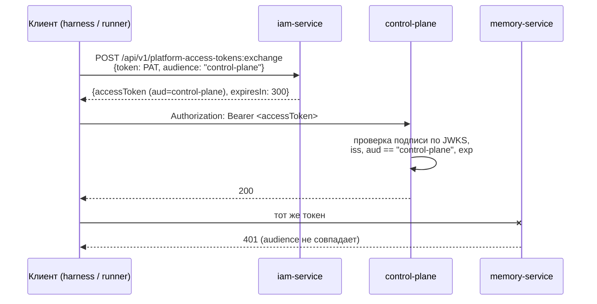

# Токены, audiences, scopes

Статья описывает короткоживущие access token IAM: как их получить обменом,
какие в них claims, как устроены audiences и scopes, как сервисы проверяют
подпись по JWKS и как безопасно сменить ключ подписи. Для инженеров,
подключающих сервис к платформе, и для администраторов.

## Принцип: один токен — один сервис

Долгоживущие credentials (PAT, секрет service account, upstream-токен IdP)
никогда не уходят в resource service. Их предъявляют только IAM, а взамен
получают **access token ровно одного audience** со сроком жизни
`IAM_TOKEN_TTL_SECONDS` (по умолчанию 300 с).



## Audiences

Audience — зарегистрированный в tenant сервис-получатель токенов с реестром
допустимых scopes (`allowedScopes`). Токен можно выпустить только для
активного audience, и только со scopes из его реестра.

### Реестр audiences типовой инсталляции

`deploy/bootstrap.py` заводит и приводит к коду следующие audiences:

| Audience | `allowedScopes` |
|---|---|
| `control-plane` | `control-plane:read`, `control-plane:write`, `control-plane:admin` |
| `memory-service` | `memory:read`, `memory:write`, `memory:pii`, `memory:tenants`, `memory:on-behalf`, `memory:service` |

Смысл каждого scope определяет сервис-владелец — см.
[Права и scopes](../reference/permissions.md).

!!! warning "Scope пишется с префиксом audience"
    Scope — это строка из `allowedScopes` целиком: `control-plane:write`, а не
    `write`. Запрос короткого `write` к audience `control-plane` даёт
    `403 scope_not_allowed`. IAM не интерпретирует scopes — он только сверяет
    строки с реестром.

### Управление audiences

```bash
# создать
curl -s -X POST "$IAM_URL/api/v1/tenants/$TENANT/audiences" -H "$BT" \
  -H 'Content-Type: application/json' \
  -d '{"key":"reports","allowedScopes":["reports:read","reports:write"]}'

# список
curl -s "$IAM_URL/api/v1/tenants/$TENANT/audiences" -H "$BT"

# заменить allowedScopes целиком (идемпотентно)
curl -s -X PATCH "$IAM_URL/api/v1/tenants/$TENANT/audiences/reports" -H "$BT" \
  -H 'Content-Type: application/json' \
  -d '{"allowedScopes":["reports:read","reports:write","reports:admin"]}'
```

```json
{
  "id": "<audience-id>",
  "tenant_id": "<tenant-id>",
  "key": "reports",
  "allowed_scopes": ["reports:admin", "reports:read", "reports:write"],
  "status": "active"
}
```

| Правило | Значение |
|---|---|
| `key` | `^[a-z0-9][a-z0-9._-]{1,118}[a-z0-9]$`, уникален в tenant |
| scope | непустая строка до 120 символов, иначе `422 invalid_scope` |
| порядок | `allowedScopes` сортируются и дедуплицируются |
| `PATCH` | заменяет список целиком; при изменении пишет событие `audience.updated`; без изменений — no-op |

Ошибки: `404 tenant_not_found`, `409 audience_exists`, `404 audience_not_found`.

!!! note "Сужение реестра не отзывает выданное"
    `PATCH` с более узким списком действует на **следующие** обмены: scope,
    исчезнувший из реестра, перестаёт выдаваться, даже если он есть в потолке
    PAT или service account. Уже выданные access token доживают до `exp`.
    Отключить audience (`status = disabled`) API не позволяет — только в базе.

## Обмен PAT на access token

```bash
curl -s -X POST "$IAM_URL/api/v1/platform-access-tokens:exchange" \
  -H 'Content-Type: application/json' \
  -d '{"token":"iam_pat_…","audience":"control-plane","scopes":["control-plane:read"]}'
```

```json
{
  "accessToken": "eyJhbGciOiJSUzI1NiIsImtpZCI6…",
  "tokenType": "Bearer",
  "expiresIn": 300,
  "audience": "control-plane",
  "scope": ["control-plane:read"],
  "sessionId": "<session-id>"
}
```

Tenant и principal в запросе не передаются — они берутся из записи PAT.
Access token IAM сам по себе на этом эндпоинте не принимается (не
распознаётся как PAT и даёт `401 invalid_token`).

Проверки по порядку:

1. PAT действителен (см. [Credentials](credentials.md)) — иначе `401 invalid_token`.
2. `audience` входит в `audiences` PAT **и** активен в tenant — иначе
   `403 audience_not_allowed`.
3. Запрошенные scopes входят в пересечение `scopeCeiling ∩ allowedScopes` —
   иначе `403 scope_not_allowed`.
4. Обновляется `lastUsedAt` PAT, в audit пишется `platform_access_tokens.exchange`
   с `session_id`.

## Эффективные scopes

Правило зависит от пути получения токена:

| Путь | Пустой `scopes` в запросе | Непустой `scopes` | Claim `scope_ceiling` |
|---|---|---|---|
| PAT `:exchange` | `scopeCeiling ∩ allowedScopes` | должны входить в `scopeCeiling ∩ allowedScopes` | `scopeCeiling` PAT |
| `federation:exchange` | весь `allowedScopes` audience | должны входить в `allowedScopes` | `allowedScopes` audience |
| client credentials `tokens/exchange` | **пустой список** | должны входить в `scopeCeiling ∩ allowedScopes` | нет |

!!! tip "Service account должен просить scopes явно"
    У client credentials пустой запрос даёт токен **без scopes**, а не «весь
    потолок». Сервис с таким токеном, скорее всего, получит `403` у
    получателя. Всегда передавайте нужные scopes.

Потолок только сужает authority: scope, отсутствующий в `allowedScopes`
audience, не попадёт в токен, даже если записан в потолке.

## Формат access token

JWT, подписанный RS256. Заголовок:

```json
{"alg": "RS256", "kid": "<IAM_SIGNING_KEY_ID>", "typ": "at+jwt"}
```

Payload токена, полученного обменом PAT человека:

```json
{
  "iss": "https://platform.example.com/iam",
  "sub": "<principal-id>",
  "tenant_id": "<tenant-id>",
  "aud": "control-plane",
  "scope": ["control-plane:read", "control-plane:write"],
  "principal_type": "human",
  "credential_id": "<credential-id>",
  "scope_ceiling": ["control-plane:read", "control-plane:write"],
  "session_id": "<session-id>",
  "auth_time": "2026-01-15T10:05:00+00:00",
  "acr": "bootstrap",
  "iat": 1768471510,
  "nbf": 1768471510,
  "exp": 1768471810,
  "jti": "<uuid>"
}
```

### Claims

| Claim | Всегда | Описание |
|---|---|---|
| `iss` | да | `IAM_ISSUER` — публичный адрес IAM |
| `sub` | да | `principal_id` |
| `tenant_id` | да | tenant principal |
| `aud` | да | **одна строка**, не список |
| `scope` | да | **массив строк** (не строка через пробел); может быть пустым |
| `principal_type` | да | `human`, `agent` или `service_account` |
| `credential_id` | да | id credential: PAT, service account или external identity (для федерации) — ключ для revocation-кэша сервиса |
| `iat`, `nbf`, `exp` | да | время выпуска и истечения (`exp = iat + IAM_TOKEN_TTL_SECONDS`) |
| `jti` | да | уникальный id токена |
| `scope_ceiling` | PAT, федерация | потолок, от которого считались scopes |
| `session_id` | PAT, федерация | новый UUID на каждый обмен; попадает в audit IAM |
| `auth_time` | человек | момент входа в формате **ISO 8601** (не число секунд) |
| `acr` | человек, если известен | уровень аутентификации из authentication context |

Чем отличаются токены разных principals:

| `principal_type` | `auth_time`, `acr` | `scope_ceiling`, `session_id` |
|---|---|---|
| `human` (PAT) | из authentication context, снятого при выпуске PAT | есть |
| `human` (федерация) | из upstream-токена текущего входа | есть |
| `agent` (PAT) | **отсутствуют** | есть |
| `service_account` | отсутствуют | отсутствуют |

!!! note "Чего в токене нет"
    В токене нет Product, Plan, License, Workspace, Project, Task или
    namespace памяти, и нет доменных прав. `scope` — потолок, а не разрешение:
    конкретное право сервис выводит сам (для Control Plane — из binding
    principal, см. [Авторизация и права](../control-plane/authorization.md)).

## Проверка токена сервисом

Сервисы платформы проверяют токены через
[platform-auth-sdk](../sdk/platform-auth-sdk.md) (`TokenVerifier` + `JwksCache`).
Требования, которым обязан следовать любой сервис:

| Проверка | Как в SDK |
|---|---|
| Подпись асимметричным алгоритмом | разрешены `RS256`, `RS384`, `RS512`; `none` и `HS*` отклоняются до обращения к ключу |
| Точный issuer | `iss` == настроенный issuer (строковое равенство) |
| Точный audience | `aud` — строка, равная своему audience; список отклоняется |
| Время | `exp`, `nbf`, `iat` с допуском часов 5 с |
| Обязательные claims | `iss`, `sub`, `aud`, `tenant_id`, `iat`, `nbf`, `exp`, `jti` |
| Revocation | локальная политика сервиса (см. ниже) |

Сервис настраивается тремя значениями. Пример для Control Plane из
`deploy/local/compose.yml`:

```yaml
CP_IAM_ISSUER: ${TAIMEN_PUBLIC_URL}/iam
CP_IAM_JWKS_URL: http://iam-service:8010/.well-known/jwks.json
CP_IAM_AUDIENCE: control-plane
```

!!! tip "Issuer публичный, JWKS — внутренний"
    Issuer должен совпадать с тем, что IAM пишет в `iss`, — это публичный
    адрес `${TAIMEN_PUBLIC_URL}/iam`. JWKS при этом берётся по внутреннему
    адресу сети compose: проверка подписи не должна зависеть ни от внешнего
    прокси, ни от собственного TLS.

!!! danger "Смена issuer — миграция"
    `iss` попадает в каждый токен и является частью ключа binding в Control
    Plane (`issuer + iam_principal_id`). Смена `TAIMEN_PUBLIC_URL` (а с ним
    `IAM_ISSUER`) требует одновременного переноса bindings, иначе вход
    закроется для всех. См. [Обновление и миграции](../operations/upgrades.md).

### Окно отзыва {#revocation-window}

IAM прекращает **обмен** отозванных credentials немедленно, но уже выданный
access token криптографически валиден до `exp`. Закрывать это окно — задача
resource service: SDK предлагает порт `RevocationDirectory` (например,
проекцию событий `credential.revoked` / `principal.disabled` из журнала IAM)
или осознанный режим «окна жизни токена» с ограничением TTL. Поэтому
`IAM_TOKEN_TTL_SECONDS` стоит держать коротким.

## JWKS и ключ подписи

```bash
curl -s http://127.0.0.1:18010/.well-known/jwks.json
```

```json
{
  "keys": [
    {"kty": "RSA", "use": "sig", "alg": "RS256", "kid": "local-dev", "n": "…", "e": "AQAB"}
  ]
}
```

- Ключ — RSA в PEM без пароля: `IAM_SIGNING_PRIVATE_KEY` (строкой) или
  `IAM_SIGNING_PRIVATE_KEY_FILE` (файлом; в compose — docker-секрет).
  `make secrets` генерирует RSA 3072.
- `kid` — значение `IAM_SIGNING_KEY_ID`.
- JWKS публикует **только текущий** ключ. Предыдущий ключ после смены в JWKS
  не остаётся.
- Без ключа обмен токенов невозможен: IAM отвечает ошибкой 500
  (`IAM_SIGNING_PRIVATE_KEY is required for token exchange`), а JWKS не
  отдаётся.

Кэш ключей на стороне сервиса (`JwksPolicy` SDK по умолчанию):

| Параметр | По умолчанию | Смысл |
|---|---|---|
| `refresh_after_seconds` | 300 | после этого возраста промах по `kid` вызывает обновление |
| `min_refresh_interval_seconds` | 10 | не чаще одного обновления за интервал |
| `stale_after_seconds` | 3600 | дольше этого непроверенный кэш не используется → `verification_unavailable` (503) |

### Процедура ротации ключа подписи

Поскольку JWKS содержит один ключ, после смены ключа все ранее выданные
access token (не старше `IAM_TOKEN_TTL_SECONDS`) перестают проходить проверку.
Клиенты получат `401` и обменяют credential заново. Процедура:

1. Сгенерируйте новый ключ:

    ```bash
    openssl genpkey -algorithm RSA -pkeyopt rsa_keygen_bits:3072 \
      -out secrets/iam-signing-2.pem
    chmod 600 secrets/iam-signing-2.pem
    # Linux: контейнер работает под uid 10001
    sudo chown 10001:10001 secrets/iam-signing-2.pem
    ```

2. В `.env` укажите новый файл и **новый** `kid`:

    ```bash
    IAM_SIGNING_KEY_FILE=./secrets/iam-signing-2.pem
    IAM_SIGNING_KEY_ID=iam-2026-02
    ```

3. Пересоздайте контейнер: `tools/compose up -d iam-service`.
4. Проверьте JWKS (новый `kid`) и пробный обмен PAT.
5. В течение `IAM_TOKEN_TTL_SECONDS` клиенты получат `401` на старые токены
   и перевыпустят их; клиенты `control-plane-client` и `ServiceTokenProvider`
   обменивают credential заново сами.
6. Удалите старый файл ключа.

!!! warning "Всегда меняйте `kid`"
    Если оставить прежний `kid` с новым ключом, сервисы не поймут, что ключ
    сменился: кэш с тем же `kid` будет считаться годным до
    `refresh_after_seconds`, и все новые токены будут отклоняться с ошибкой
    подписи до пяти минут.

## Ошибки обмена

| HTTP | `detail` | Путь | Причина |
|---|---|---|---|
| 401 | `invalid_token` | PAT | PAT недействителен по любой причине |
| 401 | `invalid_client` | client credentials | неверный `clientId`/`clientSecret`, отозванный service account, неактивный principal |
| 403 | `audience_not_allowed` | все | audience не входит в credential или не активен |
| 403 | `scope_not_allowed` | все | запрошен scope вне потолка или реестра (частая причина — scope без префикса) |
| 422 | — | все | лишние поля в теле, пустой `token`/`audience` |
| 500 | — | все | не настроен ключ подписи |

Ошибки проверки токена на стороне сервиса (`invalid_token`,
`verification_unavailable`, `insufficient_scope`) описаны в
[platform-auth-sdk](../sdk/platform-auth-sdk.md) и
[Кодах ошибок](../reference/errors.md).

## См. также

- [Credentials и PAT](credentials.md)
- [Service accounts](service-accounts.md)
- [Федерация identity](federation.md)
- [platform-auth-sdk](../sdk/platform-auth-sdk.md)
- [Права и scopes](../reference/permissions.md)
- [Секреты и ротация](../operations/secrets.md)
