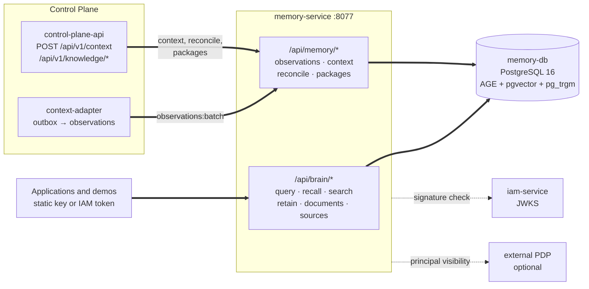

# Memory (memory-service)

memory-service is the memory service of the Taimen platform: a typed knowledge
graph and a vector index on top of a single PostgreSQL, which answer questions
**with citations to sources** and assemble ready-to-use context for agents.
This section is for integrators who write knowledge to memory and read it, and
for administrators who deploy and maintain the service.

## Purpose

The service does three things:

1. **Stores knowledge** (articles, documents, facts, events from external
   systems) as a graph of entities and relations (Apache AGE) and as text
   fragments with embeddings (pgvector).
2. **Finds what is relevant** with hybrid search (vector + full-text search +
   graph neighbors), with optional reranking and answer synthesis by an LLM.
3. **Assembles context**: a structured `ContextPack` within a token budget,
   where each element carries provenance (where it came from) and an
   explanation of why it was included.

The main product requirement is **a source in every answer**: by `source_path`
and `node_key`, a consumer can always show the original document a hint came
from (`GET /api/brain/sources/{natural_key}`).

The service is product-neutral: its code knows no domains. The entity kinds
and relations of a specific subject area are described as data, in domain packs
(see [Knowledge model](knowledge-model.md#domain-packs)).

## Place in the platform




- **Control Plane** is the main consumer. Its `context-adapter` delivers core
  domain events to memory as observations (`POST /api/memory/observations:batch`),
  and `control-plane-api` assembles the combined work context (the core's
  `POST /api/v1/context` calls `POST /api/memory/context`) and publishes
  client knowledge snapshots (`POST /api/memory/reconcile`, kind packages).
  Details are in [Control Plane context](../control-plane/context.md).
- **Applications** (chatbots, prompters, consoles) call `/api/brain/*` directly
  with a static key or an IAM access token.
- **IAM** issues tokens with audience `memory-service`; the service verifies
  their signature against JWKS.

- **An external PDP** (experimental, off by default) determines which
  namespaces and scopes a particular person or agent can see.

!!! note "Memory is not the source of truth for operational state"
    Control Plane holds the authoritative state of tasks, runs, and approvals.
    Memory holds evidence and knowledge, and the application's current state
    can be passed into a request as `ephemeral_context`: it takes part in
    context assembly but is not stored.

## What the service consists of

| Part | What it is | Entry point |
|---|---|---|
| HTTP service | FastAPI: `/api/brain/*`, `/api/memory/*`, `/healthz` | `platform-memory-serve` |
| MCP server | Graph tools for agents (stdio or streamable HTTP) | `platform-memory-mcp` |
| CLI | Schema initialization, vault loading, queries, traces | `cb` |
| Client | `platform-memory-client`: `MemoryClient` / `AsyncMemoryClient` | directory `services/memory-service/client` |
| Database | PostgreSQL 16 + Apache AGE + pgvector + pg_trgm | image `memory-db` |

Additional surfaces, the administrative console `/console` and the public demo
showcase `/demo`, are off by default and are not part of the consumer contract
(see [Configuration](configuration.md#console-demo)).

## Key concepts

| Concept | In short | More |
|---|---|---|
| Namespace | A hard knowledge base boundary: data of different namespaces never overlaps | [Namespaces and access](namespaces.md) |
| Scope | A visibility label `type:id` inside a namespace (`workspace:<id>`, `principal:<id>`) | [Namespaces and access](namespaces.md#visibility) |
| Node | A graph entity with a `natural_key`, type, title, and provenance | [Knowledge model](knowledge-model.md) |
| Chunk | A text fragment with an embedding and a link to its source | [Knowledge model](knowledge-model.md#chunks) |
| Observation | An immutable piece of evidence from an external system | [Knowledge ingestion](ingestion.md#observations) |
| Fact | A graph edge with a validity interval and an evidence class | [Knowledge model](knowledge-model.md#facts) |
| ContextPack | Assembled context with sections, sources, and a trace | [Search and context](retrieval.md#context-compiler) |

## Deployment as part of the platform

In the `deploy/local/compose.yml`, memory belongs to the `core` profile as two services:

| Service | Image | Port | Purpose |
|---|---|---|---|
| `memory-db` | `memory-db` (built from `services/memory-service/infra/memory-db`) | compose network only | PostgreSQL 16 + AGE + pgvector, database `company_brain` |
| `memory-service` | `memory-service` (build context is the superproject root) | `127.0.0.1:${MEMORY_HOST_PORT:-18001}` → `8077` | HTTP API |

The image build context is the superproject root because the service pulls in
the neighboring `platform-auth-sdk` as a path dependency. Memory is not
published through the edge proxy: platform services call it at the internal
address `http://memory-service:8077`.

Quick check after startup:

```bash
curl -fsS http://127.0.0.1:18001/healthz
# {"ok": true, "graph": "company_brain", "nodes": 123, "chunks": 456}

curl -fsS -H "Authorization: Bearer $MEMORY_API_KEY" \
  http://127.0.0.1:18001/api/brain/health
# the same, but with a token check
```

`/healthz` requires no authorization and returns `503` if the database is
unavailable.

## Operating principles

- **Knowledge base isolation.** Each request works in explicitly specified
  namespaces; access to them is checked against the token's grants. See
  [Namespaces and access](namespaces.md).
- **Idempotent writes.** Sending the same article (`external_id`), the same
  document (`natural_key`), the same event (`source.system` + `stream` +
  `external_id`), or the same snapshot (`snapshotId`) again creates no
  duplicates.
- **Deletion with audit.** Every deletion is recorded as a `delete` event in
  the audit trail of its knowledge base and can be reconstructed with
  `GET /api/brain/trace/{trace_id}`.
- **An LLM is optional.** Writing, projection, hybrid search, context assembly,
  and traces work without a generative model. An LLM is needed only for
  answer synthesis (`synthesize: true`), reranking, and entity extraction from
  unstructured text. Embeddings are needed for the vector channel; for tests,
  there are offline providers `fake`/`echo`.
- **Personal data protection.** When protection is on, tokens without
  clearance get masked results, and every release of unmasked personal data is
  logged as a `pii_access` event.

## What next

- [Knowledge model](knowledge-model.md): how the graph, chunks, facts, and provenance work.
- [Namespaces and access](namespaces.md): knowledge base names, keys, IAM tokens, visibility.
- [Knowledge ingestion](ingestion.md): retain, documents, observations, snapshots, deletion.
- [Search and context assembly](retrieval.md): hybrid search, reranking, ContextPack.
- [API](api.md): reference for all routes.
- [Configuration](configuration.md): `CB_*` variables, providers, operations.

## See also

- [Control Plane context](../control-plane/context.md)
- [Platform architecture](../overview/architecture.md)
- [IAM tokens](../iam/tokens.md)
- [Service accounts](../iam/service-accounts.md)
- [SDK clients](../sdk/clients.md)
- [Common memory problems](../troubleshooting/memory.md)
