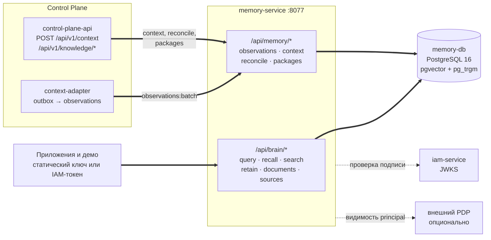

# Память (memory-service)

memory-service — сервис памяти платформы Taimen: типизированный граф знаний и
векторный индекс поверх одного PostgreSQL, которые отвечают на вопросы **с цитатами
на источники** и собирают готовый контекст для агентов. Раздел предназначен
интеграторам, которые пишут знания в память и читают их, и администраторам,
которые разворачивают и сопровождают сервис.

## Назначение

Сервис решает три задачи:

1. **Хранит знания** — статьи, документы, факты, события внешних систем — в виде
   графа сущностей и связей (таблицы PostgreSQL) и текстовых фрагментов с эмбеддингами
   (pgvector).
2. **Находит релевантное** — гибридным поиском (вектор + полнотекстовый поиск +
   соседи по графу), с необязательным реранкингом и синтезом ответа через LLM.
3. **Собирает контекст** — структурированный `ContextPack` под бюджет токенов, где у
   каждого элемента есть provenance (откуда взят) и объяснение, почему он включён.

Главное продуктовое требование — **источник в каждом ответе**: по `source_path` и
`node_key` потребитель всегда может показать оригинальный документ, из которого
взята подсказка (`GET /api/brain/sources/{natural_key}`).

Сервис продукт-нейтрален: он не знает доменов в коде. Виды сущностей и связи
конкретной предметной области описываются данными — доменными пакетами (см.
[Модель знаний](knowledge-model.md#domain-packs)).

## Место в платформе




- **Control Plane** — главный потребитель. Его `context-adapter` доставляет доменные
  события ядра в память наблюдениями (`POST /api/memory/observations:batch`), а
  `control-plane-api` собирает объединённый контекст работы (`POST /api/v1/context`
  ядра вызывает `POST /api/memory/context`) и публикует снимки знаний клиентов
  (`POST /api/memory/reconcile`, пакеты видов). Подробнее — в
  [Контексте Control Plane](../control-plane/context.md).
- **Приложения** (чат-боты, суфлёры, консоли) ходят в `/api/brain/*` напрямую со
  статическим ключом или access token IAM.
- **IAM** выпускает токены с audience `memory-service`; сервис проверяет их подпись
  по JWKS.

- **Внешний PDP** (экспериментально, выключен по умолчанию) определяет, какие
  namespaces и scopes видит конкретный человек или агент.

!!! note "Память не источник истины об операционном состоянии"
    Авторитетное состояние задач, прогонов и approvals хранит Control Plane. Память
    хранит свидетельства и знания, а текущее состояние приложения может быть передано
    в запрос как `ephemeral_context` — оно участвует в сборке контекста, но не
    сохраняется.

## Из чего состоит сервис

| Часть | Что это | Точка входа |
|---|---|---|
| HTTP-сервис | FastAPI: `/api/brain/*`, `/api/memory/*`, `/healthz` | `platform-memory-serve` |
| MCP-сервер | Инструменты графа для агентов (stdio или streamable HTTP) | `platform-memory-mcp` |
| CLI | Инициализация схемы, загрузка vault, запросы, трейсы | `cb` |
| Клиент | `platform-memory-client`: `MemoryClient` / `AsyncMemoryClient` | каталог `services/memory-service/client` |
| БД | PostgreSQL 16 + pgvector + pg_trgm; граф — обычные таблицы (MEM-ADR-023) | образ `memory-db` |

Дополнительные поверхности — административная консоль `/console` и публичная
демо-витрина `/demo` — выключены по умолчанию и не входят в контракт потребителя (см.
[Конфигурацию](configuration.md#console-demo)).

## Ключевые понятия

| Понятие | Кратко | Подробнее |
|---|---|---|
| Namespace | Жёсткая граница базы знаний: данные разных namespaces не пересекаются | [Namespaces и доступ](namespaces.md) |
| Scope | Метка видимости `type:id` внутри namespace (`workspace:<id>`, `principal:<id>`) | [Namespaces и доступ](namespaces.md#visibility) |
| Узел (node) | Сущность графа с `natural_key`, типом, заголовком и provenance | [Модель знаний](knowledge-model.md) |
| Чанк (chunk) | Фрагмент текста с эмбеддингом и ссылкой на источник | [Модель знаний](knowledge-model.md#chunks) |
| Observation | Неизменяемое свидетельство внешней системы | [Загрузка знаний](ingestion.md#observations) |
| Факт | Ребро графа с интервалом валидности и классом свидетельства | [Модель знаний](knowledge-model.md#facts) |
| ContextPack | Собранный контекст с секциями, источниками и трейсом | [Поиск и контекст](retrieval.md#context-compiler) |

## Развёртывание в составе платформы

В `deploy/local/compose.yml` память входит в профиль `core` двумя сервисами:

| Сервис | Образ | Порт | Назначение |
|---|---|---|---|
| `memory-db` | `memory-db` (сборка из `services/memory-service/infra/memory-db`) | только сеть compose | PostgreSQL 16 + pgvector + pg_trgm, БД `company_brain` |
| `memory-service` | `memory-service` (контекст сборки — корень суперпроекта) | `127.0.0.1:${MEMORY_HOST_PORT:-18001}` → `8077` | HTTP API |

Контекст сборки образа — корень суперпроекта, потому что сервис подключает соседний
`platform-auth-sdk` path-зависимостью. Наружу через edge-прокси память не
публикуется: её вызывают сервисы платформы по внутреннему адресу
`http://memory-service:8077`.

Быстрая проверка после запуска:

```bash
curl -fsS http://127.0.0.1:18001/healthz
# {"ok": true, "graph": "company_brain", "nodes": 123, "chunks": 456}

curl -fsS -H "Authorization: Bearer $MEMORY_API_KEY" \
  http://127.0.0.1:18001/api/brain/health
# то же, но с проверкой токена
```

`/healthz` не требует авторизации и отвечает `503`, если БД недоступна.

## Принципы работы

- **Изоляция баз знаний.** Каждый запрос работает в явно указанных namespaces;
  доступ к ним проверяется грантами токена. См. [Namespaces и доступ](namespaces.md).
- **Идемпотентная запись.** Повторная отправка той же статьи (`external_id`), того же
  документа (`natural_key`), того же события (`source.system` + `stream` +
  `external_id`) или того же снимка (`snapshotId`) не создаёт дубликатов.
- **Удаление с аудитом.** Любое удаление фиксируется событием `delete` в аудит-контуре
  своей базы знаний и восстанавливается по `GET /api/brain/trace/{trace_id}`.
- **LLM необязателен.** Запись, проекция, гибридный поиск, сборка контекста и трейсы
  работают без генеративной модели. LLM нужен только для синтеза ответа
  (`synthesize: true`), реранкинга и извлечения сущностей из неструктурированного
  текста. Эмбеддинги нужны для векторного канала; для тестов есть офлайн-провайдеры
  `fake`/`echo`.
- **Защита ПДн.** При включённой защите токены без допуска получают выдачу с
  масками, а выдача немаскированных ПДн журналируется событием `pii_access`.

## Что дальше

- [Модель знаний](knowledge-model.md) — как устроены граф, чанки, факты и provenance.
- [Namespaces и доступ](namespaces.md) — имена баз знаний, ключи, IAM-токены, видимость.
- [Загрузка знаний](ingestion.md) — retain, документы, наблюдения, снимки, удаление.
- [Поиск и сборка контекста](retrieval.md) — гибридный поиск, реранкинг, ContextPack.
- [API](api.md) — справочник всех маршрутов.
- [Конфигурация](configuration.md) — переменные `CB_*`, провайдеры, эксплуатация.

## См. также

- [Контекст Control Plane](../control-plane/context.md)
- [Архитектура платформы](../overview/architecture.md)
- [Токены IAM](../iam/tokens.md)
- [Service accounts](../iam/service-accounts.md)
- [Клиенты SDK](../sdk/clients.md)
- [Типичные проблемы с памятью](../troubleshooting/memory.md)
