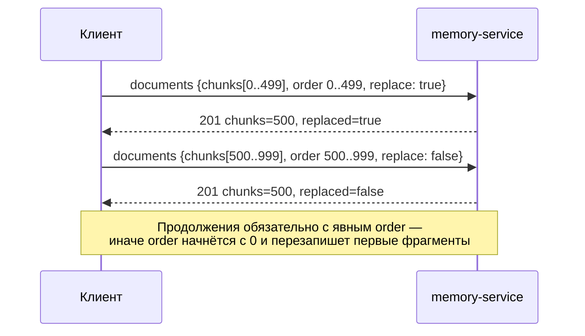

# Загрузка знаний

Статья описывает все способы положить знания в память — статьи, документы
готовыми фрагментами, структурированные факты, наблюдения внешних систем, снимки
источников и загрузку каталога документов, — а также обновление, удаление и расчёт
эмбеддингов. Она для интеграторов, которые наполняют базу знаний.

## Какой способ выбрать

| Способ | Маршрут | Когда использовать | Идемпотентность | Эмбеддинги |
|---|---|---|---|---|
| Статья / заметка | `POST /api/brain/retain` | Сырой текст статьи «как есть», короткие заметки и решения агентов | `external_id` | Один чанк на запись |
| Документ фрагментами | `POST /api/brain/documents` | Миграция базы знаний: PDF/DOCX/HTML разобраны у вас на фрагменты | `natural_key` + `replace` | Каждый фрагмент |
| Структурный узел | `POST /api/brain/facts` | Узел с собственным ключом, типом и свойствами | `natural_key` | Один чанк |
| Наблюдение | `POST /api/memory/observations[:batch]` | События внешних систем (трекер, CRM, почта, ядро) | `source.system` + `stream` + `external_id` | Только для `text`-assertions |
| Снимок источника | `POST /api/memory/reconcile` | Полное состояние источника (код, реестр, трекер) по доменному пакету | `snapshotId` | Нет |
| Каталог документов | `cb ingest --vault …` | Markdown-vault с frontmatter, загрузка с машины администратора | mark-and-sweep | Каждый фрагмент |

Все маршруты записи требуют права **записи** в namespace (см.
[Namespaces и доступ](namespaces.md)) и принимают заголовок `X-Run-Id` — сквозной
идентификатор, который попадает в provenance и аудит.

!!! tip "Главное правило"
    Всегда передавайте стабильный ключ (`external_id`, `natural_key`, `source.external_id`).
    Тогда повторная отправка обновит запись, а не создаст копию, а удаление по
    требованию пройдёт по тому же ключу.

## Статья: `POST /api/brain/retain`

Основной путь для контента, скопированного со страницы: текст кладётся как есть,
оригинал сохраняется в узле и возвращается в source-view.

```bash
curl -X POST "$MEMORY_URL/api/brain/retain" \
  -H "Authorization: Bearer $TOKEN" -H "Content-Type: application/json" \
  -d '{
    "content": "Как оформить пропуск для гостя.\n\nЗаявку подаёт сотрудник...",
    "type": "article",
    "title": "Гостевой пропуск",
    "external_id": "https://kb.example.com/articles/guest-pass",
    "provenance": {"source": "kb.example.com", "actor": "kb-import"},
    "confidence": 0.9,
    "scope": {"namespace": "support"}
  }'
```

Ответ `201`:

```json
{
  "retained": true,
  "type": "article",
  "title": "Гостевой пропуск",
  "natural_key": "https://kb.example.com/articles/guest-pass",
  "namespace": "support",
  "origin": "agent",
  "edges": 0,
  "trace": null
}
```

Как обрабатываются поля:

| Поле | По умолчанию | Что происходит |
|---|---|---|
| `content` | — | Кладётся в `props.content` узла и целиком в **один** чанк индекса |
| `type` | `note` | Тип узла и его метка в графе |
| `title` | первая непустая строка `content` (до 120 символов) | Заголовок узла и чанка |
| `external_id` | — | Становится `natural_key` узла. Без него ключ выводится из содержимого: `fact:<sha1[:16]>` или `fact:<trace_id>:<sha1[:16]>` |
| `provenance` | — | Сохраняется целиком в `props.provenance`; поля `actor`, `actor_id`, `issue_id`, `trace_id`, `kind`, `source` копируются в свойства узла |
| `provenance.source` | `agent:run/<run_id>` | Становится `source_path` чанка — целью цитаты |
| `provenance.trace_id` / `issue_id` / `run_id` | `run_id` из `X-Run-Id` | Трейс: узел связывается ребром `IN_TRACE` с якорем `pc-trace:<trace_id>`, в ответе — `"trace"` |
| `links` | — | Рёбра `LINKS_TO` к **существующим** узлам |
| `confidence` | `0.8` | Сохраняется в узле |
| `pii`, `pii_categories` | — | Явная маркировка ПДн (при `CB_PII_PROTECTION=true`) |

!!! warning "Без `external_id` правка текста создаёт новую запись"
    Ключ, выведенный из содержимого, меняется вместе с текстом. Обновлённая статья
    без `external_id` окажется рядом со старой. Используйте URL статьи или
    идентификатор из вашей системы.

!!! note "Одна статья — один фрагмент"
    `retain` индексирует весь `content` одним чанком (без `heading`). Для длинных
    документов это ухудшает точность поиска, а у моделей эмбеддингов есть предел
    длины входа. Длинные тексты разбивайте сами и загружайте через
    `POST /api/brain/documents`.

## Документ фрагментами: `POST /api/brain/documents`

Для миграции существующих баз знаний: вы парсите документ у себя и присылаете
готовые текстовые фрагменты. Движок считает эмбеддинги, создаёт узел документа и
кладёт фрагменты в индекс одним вызовом.

```bash
curl -X POST "$MEMORY_URL/api/brain/documents" \
  -H "Authorization: Bearer $TOKEN" -H "Content-Type: application/json" \
  -d '{
    "natural_key": "doc:licenses-2026",
    "title": "Реестр лицензий",
    "type": "document",
    "namespace": "support",
    "source_path": "s3://kb/licenses.pdf",
    "meta": {"collection": "licenses"},
    "properties": {"owner": "legal"},
    "chunks": [
      {"text": "Лицензия на строительство...", "heading": "Раздел 1", "order": 0},
      {"text": "Лицензия на проектирование...", "heading": "Раздел 2", "order": 1}
    ],
    "replace": true
  }'
```

Ответ `201`:

```json
{"natural_key": "doc:licenses-2026", "namespace": "support", "type": "document",
 "chunks": 2, "replaced": true}
```

| Поле | По умолчанию | Смысл |
|---|---|---|
| `natural_key` | — | Ключ документа (идемпотентность) |
| `title` | — | Заголовок узла и всех фрагментов |
| `type` | `document` | Тип узла |
| `namespace` или `scope.namespace` | namespace по умолчанию | База знаний (оба сразу — только одинаковые) |
| `source_path` | `agent:run/<X-Run-Id>` | Цель цитат в выдаче |
| `meta` | `{}` | Теги, копируются на каждый фрагмент и в свойства узла; фильтр `filters.meta` в `search` |
| `properties` | `{}` | Свойства узла |
| `links` | — | Рёбра `LINKS_TO` к существующим узлам |
| `chunks[]` | `[]` | `{text, heading, order}`; без `order` — позиция в массиве |
| `replace` | `true` | `true` — сначала удалить все фрагменты узла в этом namespace |
| `pii`, `pii_categories` | — | Явная маркировка ПДн; автодетекция идёт по всем фрагментам |

Ограничение — **500 фрагментов за вызов**. Большой документ досылайте частями:



!!! danger "Явный `order` в продолжениях"
    Фрагменты уникальны по `(namespace, node_key, order)`. Если в продолжении не
    передать `order`, он возьмётся из позиции в массиве (0, 1, 2…) и **заменит**
    фрагменты первой части.

## Структурный узел: `POST /api/brain/facts`

Запись узла с собственным ключом, типом и свойствами (используется агентами):

```json
{
  "natural_key": "decision:cache-ttl",
  "type": "decision",
  "title": "TTL кэша — 5 минут",
  "properties": {"content": "Решили держать TTL кэша 5 минут.", "status": "accepted"},
  "links": ["component:api-gateway"],
  "run_id": "run-42",
  "confidence": 0.8,
  "scope": {"namespace": "support"}
}
```

Текст индексируемого чанка — `properties.content`, а если его нет — `title`. Цель
цитаты — `agent:run/<run_id>` (`run_id` из тела или `X-Run-Id`).

## Наблюдения: `POST /api/memory/observations` {#observations}

Наблюдение — неизменяемое свидетельство внешней системы. Этим путём Control Plane
доставляет в память свои доменные события.

```bash
curl -X POST "$MEMORY_URL/api/memory/observations" \
  -H "Authorization: Bearer $TOKEN" -H "Content-Type: application/json" \
  -d '{
    "source": {"system": "issue-tracker", "stream": "events", "external_id": "event-1842"},
    "kind": "work.completed",
    "occurred_at": "2026-08-11T10:00:00Z",
    "actor": {"type": "principal", "id": "alice"},
    "scopes": ["project:alpha"],
    "content": "Regression was fixed",
    "data": {"issue": "PROJ-1842"},
    "provenance": {"uri": "https://tracker.example.com/event/1842"},
    "assertions": [
      {"assert": "fact", "fact": {"subject": "person:alice", "predicate": "WORKS_ON",
        "object": "project:alpha", "valid_from": "2026-08-01T00:00:00Z"}}
    ],
    "scope": {"namespace": "support"}
  }'
# 201 {"observation_id": "obs-…", "duplicate": false, "status": "processed"}
```

Повторная доставка того же `source.system` + `source.stream` + `source.external_id`
вернёт тот же `observation_id` с `"duplicate": true`. Поля и ограничения — в
[Модели знаний](knowledge-model.md). Поля принимаются и в camelCase
(`occurredAt`, `externalId`).

### Конвейер проекции

```text
POST observation
  ├─ сырая запись (идемпотентно, ACK сразу)             — всегда
  ├─ structured assertions → узлы / факты / чанки       — синхронно, без LLM
  └─ неструктурированный content → lexical/recent-каналы — виден сразу
       └─ извлечение LLM                               — только явно (consolidate)
```

Assertions — структурированные утверждения, не требующие LLM:

| `assert` | Содержимое | Результат |
|---|---|---|
| `entity` | `{"entity": {"key" или "type"+"id", "title", "properties"}}` | Узел-сущность |
| `fact` | `{"fact": {"subject", "predicate", "object", "valid_from", "valid_to", "supersedes", "confidence"}}` | Temporal-факт с `evidence=asserted`; отсутствующие концы создаются placeholder-узлами |
| `text` | `{"text": {"content", "key", "title", "type"}}` | Узел с текстом и индексируемый чанк с цитатой на `provenance.uri` |

Ошибка проекции не теряет сырую запись. Статус отражает результат:

| Статус | Смысл |
|---|---|
| `processed` | Всё спроецировано |
| `partially_processed` | Часть assertions не спроецировалась |
| `failed` | Проекция не удалась |

Посмотреть проблемные — `GET /api/memory/observations?namespace=…&status=failed`,
повторить обработку — `POST /api/memory/consolidate` (идемпотентно). Эмбеддинг
сырого `content` наблюдений выключен по умолчанию (`CB_OBSERVATIONS_EMBED=false`):
lexical- и recent-каналы находят их и без векторов, а приём не зависит от внешнего
провайдера.

| Что | Когда видно поиску |
|---|---|
| Сырое наблюдение (lexical/recent) | Сразу после ACK |
| Узлы и факты из assertions | Сразу после ACK |
| Вектор `text`-assertion | После эмбеддинга (синхронно при доступном провайдере, иначе после consolidate) |
| Знания, выведенные LLM | Только после явного извлечения |

### Пакетный приём

`POST /api/memory/observations:batch` принимает
`{"observations": [...], "scope": {"namespace": "…"}}` и отвечает `207` с
результатами по элементам (`results[]` с `observation_id` либо `error`) и
счётчиками `accepted`/`duplicates`/`failed`. Ошибка одного элемента не откатывает
остальные. Максимум — `CB_OBSERVATIONS_MAX_BATCH` (по умолчанию 500), больше → `413`.

## Снимки источников: `POST /api/memory/reconcile` {#reconcile}

Сверка принимает **полное** состояние источника (например, эндпоинты и файлы
репозитория, записи реестра) в формате доменного пакета и приводит к нему граф:

- новое открывается, изменившееся закрывается и открывается новой версией
  (`supersedes`), пропавшее закрывается (`valid_to = observedAt`);
- **ничего не удаляется** — прошлое состояние доступно через `as_of`;
- снимок одного `(source, scope)` не закрывает сущности другого источника;
- связь на сущность, которой ещё нет, хранится отложенной и становится ребром, когда
  цель появится;
- повтор того же `(namespace, source, scope, snapshotId)` ничего не меняет и
  возвращает `"duplicate": true`; снимок старше последнего принятого → `409`;
- максимум `CB_RECONCILE_MAX_ITEMS` (по умолчанию 20000) элементов в снимке.

Пример тела и ответа — в [API](api.md#reconcile). В платформе клиенты публикуют
снимки не напрямую, а через Control Plane (`POST /api/v1/knowledge/snapshots`), который
вычисляет namespace воркспейса и вызывает сверку service account'ом ядра. При
включённом ограничении маршрутов ядра прямой вызов доступен только identity ядра
(см. [Namespaces и доступ](namespaces.md#core-routes)).

## Каталог документов: `cb ingest`

CLI проецирует каталог Markdown-файлов (vault, только чтение) в граф и индекс:

```bash
cb init-db                          # граф и таблицы (идемпотентно)
cb ingest --vault /opt/taimen/kb    # или CB_VAULT_PATH
cb ingest --vault /opt/taimen/kb --reset            # пересоздать граф и индекс
cb ingest --vault /opt/taimen/kb --extract-entities # + сущности из текста через LLM
cb stats
```

Особенности:

- vault проецируется в namespace по умолчанию (`CB_DEFAULT_NAMESPACE`);
- frontmatter документа задаёт тип и свойства узла, ссылки превращаются в рёбра;
- текст режется на фрагменты по заголовкам Markdown, затем по абзацам с
  ограничением размера; `heading` фрагмента — «хлебные крошки» заголовков
  (`Раздел > Подраздел`);
- ingest самоочищается (mark-and-sweep): узлы, рёбра и чанки vault-происхождения,
  не встреченные в текущем прогоне, удаляются — **только** в этом namespace и
  **только** vault-происхождения; записи через API не затрагиваются;
- `CB_CACHE_DIR` включает кэш: неизменённые заметки и уже посчитанные эмбеддинги
  пропускаются.

!!! warning "`--reset` удаляет граф и индекс целиком"
    Флаг пересоздаёт граф и таблицу чанков для всего инстанса, а не для одного
    namespace. Делайте бэкап перед использованием.

## Эмбеддинги

Эмбеддинги считает сервис — единая модель и размерность для всех namespaces.

| Параметр | Значение |
|---|---|
| Провайдер | `CB_EMBEDDING_PROVIDER`: `openai` (любой OpenAI-совместимый endpoint) или `fake` |
| Модель | `CB_EMBEDDING_MODEL`, по умолчанию `text-embedding-3-small` |
| Размерность | `CB_EMBEDDING_DIM`, по умолчанию `1536`; для моделей `text-embedding-3-*` передаётся параметром `dimensions` |
| Батч | 64 текста на запрос к провайдеру |
| Таймаут | `CB_EMBEDDING_TIMEOUT`, по умолчанию 25 с |
| Вход | `"<title> — <heading>\n<text>"` |

Если провайдер вернул вектор другой размерности, запись падает с ошибкой, которая
называет обе размерности. Смена модели требует переиндекса — см.
[Конфигурацию](configuration.md#reindex).

!!! danger "Провайдер `fake` — не для реальных данных"
    `fake` считает векторы хешированием слов той же размерности, поэтому проходит все
    проверки схемы, но семантического поиска нет — выдача лексическая. Сервис пишет
    об этом предупреждение в лог. Данные, проиндексированные так, после включения
    настоящего провайдера нужно переиндексировать.

## Строгий режим видов

Если для namespace включён строгий режим (`PUT /api/memory/namespaces/{ns}/kinds`
с `"strict": true`), запись сущности неизвестного вида или с ключом/атрибутами вне
схемы вида отвергается ответом `422` на `/api/brain/facts`, `/api/brain/retain`,
`/api/brain/documents` и `/api/memory/reconcile`. В наблюдениях такой assertion
получает статус ошибки, а само наблюдение сохраняется. Подробнее — в
[Модели знаний](knowledge-model.md#domain-packs).

## Удаление

| Что удаляем | Маршрут | Повторный вызов | Аудит |
|---|---|---|---|
| Узел (статья, факт) с рёбрами и чанками | `DELETE /api/brain/nodes/{natural_key}?namespace=…` | `404` | событие `delete` |
| Документ с рёбрами и всеми фрагментами | `DELETE /api/brain/documents/{natural_key}?namespace=…` | `200 {"deleted": false}` | событие `delete` (только при фактическом удалении) |
| Наблюдение | `DELETE /api/memory/observations/{id}?namespace=…&mode=redact\|purge` | `404` | событие удаления в аудит-контуре |

```bash
# natural_key может содержать слэши — экранировать не нужно
curl -X DELETE \
  "$MEMORY_URL/api/brain/nodes/https://kb.example.com/articles/guest-pass?namespace=support&actor=kb-admin" \
  -H "Authorization: Bearer $TOKEN"
```

```json
{"deleted": true, "natural_key": "https://kb.example.com/articles/guest-pass",
 "type": "article", "title": "Гостевой пропуск", "chunks_deleted": 1,
 "trace_id": "3f2c…"}
```

- Удаление **безвозвратное**: узел удаляется вместе с рёбрами (`DETACH DELETE`),
  фрагменты — из индекса. Снимок удалённого (тип, заголовок, число фрагментов)
  попадает в аудит; `actor` и `trace_id` (или `X-Run-Id`) передаются query-параметрами.
- Узлы аудит-контура (`audit_event`, `pc_trace`) удалить нельзя → `400`.
- Для наблюдений `redact` затирает содержимое (запись и id остаются), `purge`
  удаляет строку. Чанки наблюдения удаляются, свидетельство вычёркивается из фактов;
  факты без оставшихся свидетельств выпадают из выдачи.
- Документы-источники (vault) не затрагиваются.

!!! note "Ключ-URL за прокси"
    Некоторые reverse-прокси схлопывают `//` в пути, и `https://x` доезжает как
    `https:/x`. Сервис восстанавливает схему в ключах маршрутов по `natural_key`
    автоматически.

## Рекомендации

- Используйте URL или идентификатор исходной системы как `external_id` /
  `natural_key` — это делает загрузку идемпотентной и упрощает удаление по требованию
  субъекта ПДн.
- Передавайте `source_path` / `provenance.source`, по которым пользователь сможет
  открыть оригинал: это цель цитаты во всех ответах.
- Длинные документы разбивайте на фрагменты по разделам и передавайте `heading` —
  раздел попадает и в эмбеддинг, и в выдачу.
- Массовую загрузку ведите последовательно: rate limiting на уровне API нет, а
  каждый вызов синхронно ходит к провайдеру эмбеддингов.
- ФИО и адреса помечайте явно (`"pii": true, "pii_categories": ["fio"]`) — автоматика
  их не распознаёт.

## См. также

- [Модель знаний](knowledge-model.md)
- [Поиск и сборка контекста](retrieval.md)
- [API](api.md)
- [Конфигурация](configuration.md)
- [Контекст Control Plane](../control-plane/context.md)
