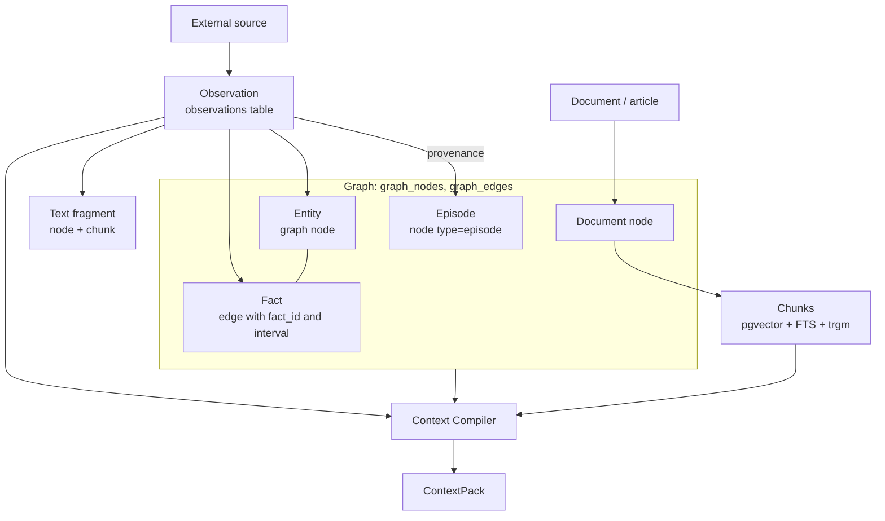

# Knowledge model

This article describes how memory-service stores knowledge: a graph in PostgreSQL
tables, chunks in pgvector, observations, temporal facts, provenance, and audit.
It is for integrators who design what to put into memory and how, and for
administrators who need to understand what is in the database.

The model in brief:

> **Observations are evidence. Facts are interpretations. Documents are sources.
> The graph expresses relations. Retrieval finds candidates. The Context
> Compiler decides what is useful right now.**

## Storage

All of memory lives in a single PostgreSQL 16 database with the extensions
`vector` (pgvector, required) and `pg_trgm` (trigrams, recommended). The graph
is ordinary tables `graph_nodes` and `graph_edges` (MEM-ADR-023); no graph
extension is needed. The init script of the `memory-db` image (or a database
setup step) creates the extensions; the service creates the graph tables and
the rest of the schema itself on startup, idempotently (if the
database is unavailable at startup, the schema is completed on first access or
with the `cb init-db` command). The service itself is stateless.

| Object | Where | Default name | Variable |
|---|---|---|---|
| Knowledge graph (nodes and edges) | tables `graph_nodes`, `graph_edges` in the graph schema | `company_brain` | `CB_GRAPH_NAME` |
| Chunks with embeddings | `public.<table>` | `chunks` | `CB_CHUNKS_TABLE` |
| Observations | table | `observations` | `CB_OBSERVATIONS_TABLE` |
| Context compilation traces | table | `context_traces` | `CB_CONTEXT_TRACES_TABLE` |
| Domain pack registry | table | `domain_packs` | `CB_DOMAIN_PACKS_TABLE` |
| Namespace kind settings | table | `namespace_settings` | `CB_NAMESPACE_SETTINGS_TABLE` |
| Source snapshot journal | tables | `source_snapshots`, `source_snapshots_items` | `CB_SNAPSHOTS_TABLE` |

All namespaces of one instance live in **one** graph and the same tables;
isolation is provided by the `namespace` property/column and a predicate in
every query (see [Namespaces and access](namespaces.md)).



## Graph nodes

A node is a typed entity, unique within the `(namespace, natural_key)` pair.
Writing the same key again updates the node (upsert via `INSERT … ON CONFLICT`) rather than
creating a new one.

| Property | Purpose |
|---|---|
| `natural_key` | Stable node key: article URL, `doc:<id>`, `person:alice`, a tracker issue identifier, etc. |
| `namespace` | The knowledge base the node belongs to |
| `type` | Entity kind: `article`, `document`, `note`, `episode`, `entity`, kinds from domain packs |
| `title` | Title (the key itself by default) |
| `source_path` | Citation target: file path, URI, `agent:run/<run_id>` |
| `source_id` | Identifier of the source or run |
| `confidence` | Confidence (a ranking and audit signal) |
| `last_seen` | When the node was last seen during a write |
| `origin` | `vault`: projection of the document vault; `agent`: written through the API |
| `props` | Map of free-form properties: `content` (original article), `provenance`, `pii`, `pii_categories`, `scopes`, `meta`, and others |

A node's **label** (the `label` column) is its `type` converted to a valid
identifier (`[A-Za-z_][A-Za-z0-9_]*`; other characters are replaced with `_`,
and an empty type becomes `entity`). A label is a column value, not a separate
table, so a new kind needs no DDL. Snapshot reconciliation and lookup by key
use the `(namespace, label, natural_key)` and `(namespace, natural_key)`
indexes, and property filters use the GIN index on `props`, so the table is not
scanned.

!!! note "The original article is stored in the node"
    `POST /api/brain/retain` puts the full text into `props.content`. That is
    why `GET /api/brain/sources/{natural_key}` returns the article exactly as
    it was loaded (`content_source: "original"`). If the node has no original
    (for example, a document loaded as ready-made chunks), the text is
    reconstructed by joining the chunks in order (`content_source: "chunks"`).

### Origin: vault and agent

The engine distinguishes two origins of data:

- **`vault`**: nodes and edges projected by the `cb ingest` command from a
  directory of Markdown documents. A repeated full ingest works as
  mark-and-sweep: everything of vault origin in the namespace that was not
  encountered in the current run is deleted.
- **`agent`**: everything written through the HTTP API (`retain`, `facts`,
  `documents`, observations, snapshots). A vault re-ingest **does not sweep**
  such data.

The HTTP service never writes to the source documents themselves: an API write
goes only into the graph and the index.

## Edges and relations

An edge connects two nodes of the **same** namespace (edges do not cross
namespaces). System edge types:

| Type | Who creates it | Meaning |
|---|---|---|
| `LINKS_TO` | `retain`, `facts`, `documents` (`links` field), vault links | The node refers to an existing target node |
| `IN_TRACE` | a write with a `trace_id` | The fact belongs to a task or run trace |
| types from vault frontmatter | `cb ingest` | Document relations (`SUPERSEDED_BY`, `PART_OF_PROJECT`, etc.) |
| fact predicates | observations, snapshots | Temporal facts (see below) |

A `links` reference to a nonexistent node is silently skipped: an edge is
created only between existing nodes.

## Facts: time and evidence {#facts}

A fact is a graph edge with a unique `fact_id` and a validity interval. Several
edges of the same type between the same pair of nodes can coexist, differing
in their intervals.

```text
person:alice  WORKS_ON  project:alpha
  fact_id        = fact-<sha256(namespace|subject|predicate|object|valid_from)[:24]>
  valid_from     = 2026-08-01T00:00:00Z
  valid_to       = (none: the fact is in effect)
  evidence       = asserted        confidence = 0.9
  observation_ids = [obs-…]        (what proves it)
```

Fact edge properties: `namespace`, `observed_at`, `valid_from`, `valid_to`,
`evidence`, `confidence`, `observation_ids`, `supersedes`, `superseded_by`,
`source_path`, `scopes`, `origin`; facts from snapshots also have `attributes`,
`snapshot_source`, `snapshot_scope`, `snapshot_id`.

Rules:

- **Three times are kept distinct:** the observation's `occurred_at` (when it
  happened), the ingestion time (when memory learned about it), and
  `valid_from`/`valid_to` (when the fact is true). All timestamps are
  normalized to ISO-8601 UTC; all temporal filtering relies on lexicographic
  string comparison.
- **Idempotency.** `fact_id` is deterministic: repeating the same assertion
  from a new observation does not create an edge but **reinforces** the fact,
  appending to `observation_ids` and raising `confidence` to the maximum.
- **Supersession.** A new fact with `supersedes` closes the `valid_to` of the
  old one and links it via `superseded_by`. History is not deleted: "no longer
  works on X" is the closing of an interval.
- **Conflicts are not resolved automatically.** Overlapping versions of the
  same `(subject, predicate)` both remain; during context assembly they are
  marked `conflict: true`, and the consumer decides.
- **The evidence class** (`evidence`) is a ranking signal, not truth:

| Class | Rank | Source |
|---|---|---|
| `asserted` | 3 | A structured assertion by the source (observation assertions, snapshot) |
| `extracted` | 2 | A deterministic rule |
| `inferred` | 1 | An LLM inference from unstructured text |
| `derived` | 1 | Derived by consolidation (summary, merge) |

- **Loss of evidence.** If an observation that supported a fact is deleted
  (`redact`/`purge`), the evidence is removed from `observation_ids`; a fact
  with no remaining evidence gets `evidence_lost` and drops out of results,
  staying in the graph for audit.

## Observations

An observation is an **immutable** record of what an external source reported:
a tracker event, an email, a core domain event. It is stored in a relational
table, not in the graph. The engine never rewrites an observation; only its
processing status changes (and its content, on redaction).

| Field | Meaning |
|---|---|
| `observation_id` | `obs-<sha256[:24]>` of `namespace` and the source identity; the client can compute it in advance |
| `source.system`, `source.stream`, `source.external_id` | Source identity: repeating the same event does not create a duplicate |
| `kind` | Event kind (`task.completed`, `work.completed`…), `[a-z0-9][a-z0-9._-]{0,127}` |
| `occurred_at` | Event time |
| `actor`, `subject` | Participants, `{type, id}` |
| `scopes` | Visibility labels `type:id` (up to 20) |
| `content` | Human-readable text (up to 1 MiB) |
| `data` | Structured payload (up to 1 MiB) |
| `assertions` | Structured assertions for projection (up to 200) |
| `provenance` | `{uri, …}`: a link to the original event |

Without an `external_id`, duplicates are filtered by a hash of the canonical
form of the content. Processing statuses: `received`, `processed`,
`partially_processed`, `failed`, `redacted`. Projection into the graph is
described in [Knowledge ingestion](ingestion.md#observations).

## Episodes and entities

- **Entity** is a graph node of any kind. An `entity` assertion creates or
  updates it; fact endpoints that do not exist yet are created as placeholder
  nodes, so delivery order does not matter. An entity key is a string or
  `{type, id}` (key `type:id`).
- **Episode** is a meaningful fragment of experience ("the deploy failed", "a
  decision was made"). Physically, it is a node with `type=episode` and
  provenance leading to observations; there is no separate table.

## Chunks and documents {#chunks}

A chunk is a text fragment in the `chunks` table that search runs over.

| Column | Purpose |
|---|---|
| `node_key` | Owning node |
| `namespace` | Knowledge base |
| `chunk_order` | Sequence number of the fragment within the document |
| `source_path` | Citation target |
| `title`, `heading` | Node title and section within the document |
| `text` | Fragment text |
| `embedding` | Vector `vector(CB_EMBEDDING_DIM)` |
| `meta` | `jsonb`: consumer tags (`collection`, etc.), `observation_id`, `scopes` |
| `seen_run` | Vault ingest run mark; empty for records written through the API |

Uniqueness is `(namespace, node_key, chunk_order)`: writing the same sequence
number again replaces the fragment. Indexes: HNSW on the cosine distance of the
embedding, GIN on the full-text document with the Russian configuration
(`title + heading + text`), GIN on `meta`, B-tree on `namespace`, and, if you
have the right to `CREATE EXTENSION`, a trigram GIN on `text` for searching
exact identifiers.

The embedding is computed not from the bare text but from the text with its
title: `"<title> — <heading>\n<text>"`. This way a short fragment keeps the
document's context.

!!! warning "The embedding dimension is fixed when the table is created"
    The `embedding` column is created with dimension `CB_EMBEDDING_DIM`. If you
    later change the model or the dimension, the service refuses to work with a
    clear error, and you need a reindex (see
    [Configuration](configuration.md#reindex)).

## Provenance: the path to the source

Every significant result element can be traced back to the original event or
document:

```text
ContextItem
  → Fact (observation_ids) / Chunk (node_key, meta.observation_id) / Observation
    → Observation (source.system / stream / external_id, provenance.uri)
      → the original event in the external system
```

For articles written through `retain`, the request's `provenance` field is
stored as a whole in `props.provenance` and returned by the source view as
`provenance.metadata`. For indexing Git repositories, the convention is to
pass `repository`, `branch`, `commit_sha`, `path`, `content_hash`, `author`,
`committed_at`, `indexed_at` in it.

## Audit trail

Audit events are graph nodes of type `audit_event`, linked by an edge to a
`pc_trace` trace anchor. They are written by:

- an explicit call to `POST /api/brain/audit`;
- every deletion (`action="delete"` with a snapshot of what was deleted: type,
  title, number of chunks);
- a release of unmasked personal data to a token with clearance
  (`action="pii_access"`, if personal data protection is on).

Audit is kept **in the namespace of the knowledge base** where the event
occurred. Nodes of types `audit_event` and `pc_trace` are protected: the
deletion mechanism responds to them with `400`, so the trace of a deletion
cannot be erased by the same mechanism. The trace is read through
`GET /api/brain/trace/{trace_id}?namespace=…`.

## Visibility inside a namespace

Besides the namespace, a node, chunk, observation, or fact can have a list of
**scopes**, labels of the form `type:id`. The prefixes `workspace:` and
`principal:` have special meaning: an element with such scopes is visible only
to a caller whose allowed scopes intersect them. An element without scopes (or
only with relevance scopes such as `task:`/`project:`) is visible to everyone
who can read the namespace. The rules are in
[Namespaces and access](namespaces.md#visibility).

## Personal data

With `CB_PII_PROTECTION=true`, a write marks the node with `pii: true` and
`pii_categories` based on automatic detection (`phone`, `email`,
`passport_rf`, `snils`, `card`, `inn`) and on an explicit label in the
request. The detector does not recognize full names or addresses; you must
label them explicitly (`"pii": true, "pii_categories": ["fio"]`). Masking in
results works even without labeling, using the same patterns. Details are in
[API](api.md#pii).

## Domain packs and strict mode {#domain-packs}

The engine contains no domain kinds in its code. The entity kinds, relations,
and identifier patterns of a subject area are described by a **domain pack**, a
versioned JSON that is registered through `POST /api/memory/packages`:

| Pack element | Meaning |
|---|---|
| `kinds[].kind` | Kind name (`endpoint`, `component`, `issue`…) |
| `kinds[].naturalKey` | JSON Schema of the key, or a key template with `<name>` / `{name}` placeholders |
| `kinds[].aliases` | Alternative key forms (traversal anchors are resolved by them) |
| `kinds[].kindAliases` | Synonyms of the kind name |
| `kinds[].idPatterns` | Regular expressions for extracting identifiers of the kind from text |
| `kinds[].attributes` | JSON Schema of attributes |
| `relations[]` | `relation`, `fromKinds`, `toKinds`, `temporal` (`true` by default), `cardinality` (`many`/`one`) |

The base kinds `document`, `entity`, `fact` always exist; the built-in pack
`default` is reserved. A pack version is immutable: registering the same
version with different content returns `409`.

A pack takes effect **only in namespaces where it is explicitly enabled**
(`PUT /api/memory/namespaces/{ns}/kinds`). In **strict mode** (`strict: true`),
writing an entity of an unknown kind, or with a key/attributes outside the
schema, is rejected with `422`; during snapshot reconciliation, relations are
checked as well. Without strict mode, unknown kinds are stored as free-form
nodes.

Packs are used together with source snapshot reconciliation
(`POST /api/memory/reconcile`) and typed traversal
(`POST /api/memory/context/typed`); see
[Knowledge ingestion](ingestion.md#reconcile) and
[Search and context](retrieval.md#typed).

## See also

- [Namespaces and access](namespaces.md)
- [Knowledge ingestion](ingestion.md)
- [Search and context assembly](retrieval.md)
- [API](api.md)
- [Glossary](../reference/glossary.md)
