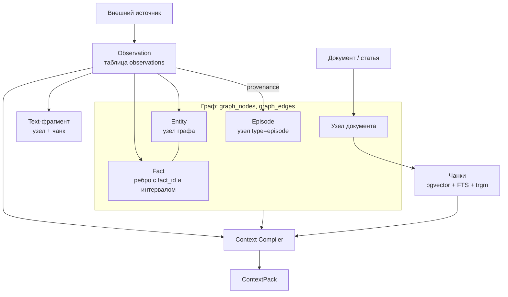

# Модель знаний

Статья описывает, как memory-service хранит знания: граф в таблицах PostgreSQL, чанки в
pgvector, наблюдения, temporal-факты, provenance и аудит. Она нужна интеграторам,
которые проектируют, что и как класть в память, и администраторам, которым важно
понимать, что лежит в базе.

Коротко о модели:

> **Observations — свидетельства. Facts — интерпретации. Documents — источники.
> Граф выражает связи. Retrieval находит кандидатов. Context Compiler решает, что
> полезно сейчас.**

## Хранилище

Вся память живёт в одной базе PostgreSQL 16 с расширениями `vector` (pgvector,
обязательно) и `pg_trgm` (триграммы, рекомендуется). Граф — обычные таблицы
`graph_nodes` и `graph_edges` (MEM-ADR-023), графовое расширение не нужно.
Расширения создаёт init-скрипт образа `memory-db` (или шаг подготовки базы); таблицы
графа и остальную схему сервис создаёт сам при старте — идемпотентно
(если БД на старте недоступна, схема досоздаётся при первом обращении или командой
`cb init-db`). Сам сервис stateless.

| Объект | Где | Имя по умолчанию | Переменная |
|---|---|---|---|
| Граф знаний (узлы и рёбра) | таблицы `graph_nodes`, `graph_edges` в схеме графа | `company_brain` | `CB_GRAPH_NAME` |
| Чанки с эмбеддингами | `public.<table>` | `chunks` | `CB_CHUNKS_TABLE` |
| Наблюдения (observations) | таблица | `observations` | `CB_OBSERVATIONS_TABLE` |
| Трейсы компиляции контекста | таблица | `context_traces` | `CB_CONTEXT_TRACES_TABLE` |
| Реестр доменных пакетов | таблица | `domain_packs` | `CB_DOMAIN_PACKS_TABLE` |
| Настройки видов namespace | таблица | `namespace_settings` | `CB_NAMESPACE_SETTINGS_TABLE` |
| Журнал снимков источников | таблицы | `source_snapshots`, `source_snapshots_items` | `CB_SNAPSHOTS_TABLE` |

Все namespaces одного инстанса лежат в **одном** графе и одних таблицах; изоляция
обеспечивается свойством/колонкой `namespace` и предикатом в каждом запросе (см.
[Namespaces и доступ](namespaces.md)).



## Узлы графа

Узел — типизированная сущность, уникальная в паре `(namespace, natural_key)`.
Повторная запись того же ключа обновляет узел (upsert через `INSERT … ON CONFLICT`), а не создаёт
новый.

| Свойство | Назначение |
|---|---|
| `natural_key` | Стабильный ключ узла: URL статьи, `doc:<id>`, `person:alice`, идентификатор задачи трекера и т. п. |
| `namespace` | База знаний, которой принадлежит узел |
| `type` | Вид сущности: `article`, `document`, `note`, `episode`, `entity`, виды доменных пакетов |
| `title` | Заголовок (по умолчанию — сам ключ) |
| `source_path` | Цель цитаты: путь файла, URI, `agent:run/<run_id>` |
| `source_id` | Идентификатор источника или прогона |
| `confidence` | Уверенность (сигнал ранжирования и аудита) |
| `last_seen` | Когда узел последний раз видели при записи |
| `origin` | `vault` — проекция документного vault, `agent` — запись через API |
| `props` | Карта свободных свойств: `content` (оригинал статьи), `provenance`, `pii`, `pii_categories`, `scopes`, `meta` и др. |

**Метка** узла (колонка `label`) — это его `type`, приведённый к допустимому
идентификатору (`[A-Za-z_][A-Za-z0-9_]*`; прочие символы заменяются на `_`, пустой
тип становится `entity`). Метка — значение колонки, а не отдельная таблица: новый вид
не требует DDL. Сверка снимков и поиск по ключу идут по индексам
`(namespace, label, natural_key)` и `(namespace, natural_key)`, фильтры по свойствам —
по GIN-индексу `props`, поэтому таблица не сканируется.

!!! note "Оригинал статьи хранится в узле"
    `POST /api/brain/retain` кладёт полный текст в `props.content`. Поэтому
    `GET /api/brain/sources/{natural_key}` возвращает статью ровно в том виде, в каком
    её загрузили (`content_source: "original"`). Если оригинала в узле нет
    (например, документ загружен готовыми чанками), текст восстанавливается склейкой
    чанков по порядку (`content_source: "chunks"`).

### Происхождение: vault и agent

Движок различает два происхождения данных:

- **`vault`** — узлы и рёбра, спроецированные командой `cb ingest` из каталога
  Markdown-документов. Повторный полный ingest работает по схеме mark-and-sweep:
  всё vault-происхождение namespace, не встреченное в текущем прогоне, удаляется.
- **`agent`** — всё, что записано через HTTP API (`retain`, `facts`, `documents`,
  наблюдения, снимки). Такие данные ре-ingest vault **не подметает**.

HTTP-сервис никогда не пишет в сами документы-источники: запись через API попадает
только в граф и индекс.

## Рёбра и связи

Ребро соединяет два узла **одного** namespace (рёбра не пересекают namespaces).
Служебные типы рёбер:

| Тип | Кто создаёт | Смысл |
|---|---|---|
| `LINKS_TO` | `retain`, `facts`, `documents` (поле `links`), vault-ссылки | Узел ссылается на существующий узел-цель |
| `IN_TRACE` | запись с `trace_id` | Факт относится к трейсу задачи или прогона |
| типы из frontmatter vault | `cb ingest` | Связи документов (`SUPERSEDED_BY`, `PART_OF_PROJECT` и т. п.) |
| предикаты фактов | наблюдения, снимки | Temporal-факты (см. ниже) |

Ссылка `links` на несуществующий узел молча пропускается: ребро создаётся только
между существующими узлами.

## Факты: время и свидетельства {#facts}

Факт — ребро графа с уникальным `fact_id` и интервалом валидности. Несколько рёбер
одного типа между одной парой узлов могут сосуществовать, различаясь интервалами.

```text
person:alice  WORKS_ON  project:alpha
  fact_id        = fact-<sha256(namespace|subject|predicate|object|valid_from)[:24]>
  valid_from     = 2026-08-01T00:00:00Z
  valid_to       = (нет — факт действует)
  evidence       = asserted        confidence = 0.9
  observation_ids = [obs-…]        (чем доказан)
```

Свойства ребра факта: `namespace`, `observed_at`, `valid_from`, `valid_to`,
`evidence`, `confidence`, `observation_ids`, `supersedes`, `superseded_by`,
`source_path`, `scopes`, `origin`; у фактов из снимков — ещё `attributes`,
`snapshot_source`, `snapshot_scope`, `snapshot_id`.

Правила:

- **Три времени различаются явно:** `occurred_at` наблюдения (когда произошло),
  время приёма (когда узнала память) и `valid_from`/`valid_to` (когда факт истинен).
  Все метки нормализуются к ISO-8601 UTC — на лексикографическом сравнении строк
  стоит вся temporal-фильтрация.
- **Идемпотентность.** `fact_id` детерминирован: повтор того же утверждения из нового
  наблюдения не создаёт ребро, а **усиливает** факт — дописывает `observation_ids` и
  поднимает `confidence` до максимума.
- **Supersession.** Новый факт с `supersedes` закрывает `valid_to` старого и связывает
  его `superseded_by`. История не удаляется: «больше не работает над X» — это
  закрытие интервала.
- **Конфликты не разрешаются автоматически.** Перекрывающиеся версии одного
  `(subject, predicate)` остаются обе; при сборке контекста они помечаются
  `conflict: true`, решение за потребителем.
- **Класс свидетельства** (`evidence`) — сигнал ранжирования, не истина:

| Класс | Ранг | Откуда |
|---|---|---|
| `asserted` | 3 | Структурированное утверждение источника (assertions наблюдения, снимок) |
| `extracted` | 2 | Детерминированное правило |
| `inferred` | 1 | Вывод LLM из неструктурированного текста |
| `derived` | 1 | Производное consolidation (сводка, слияние) |

- **Потеря свидетельства.** Если наблюдение, на котором держался факт, удалено
  (`redact`/`purge`), свидетельство вычёркивается из `observation_ids`; факт без
  оставшихся свидетельств получает `evidence_lost` и выпадает из выдачи, оставаясь в
  графе для аудита.

## Наблюдения (observations)

Наблюдение — **неизменяемая** запись того, что сообщил внешний источник: событие
трекера, письмо, доменное событие ядра. Хранится в реляционной таблице, а не в графе.
Движок никогда не переписывает наблюдение; меняется только статус его обработки (и
содержимое при redaction).

| Поле | Смысл |
|---|---|
| `observation_id` | `obs-<sha256[:24]>` от `namespace` и source identity — клиент может вычислить заранее |
| `source.system`, `source.stream`, `source.external_id` | Source identity: повтор того же события не создаёт дубликат |
| `kind` | Вид события (`task.completed`, `work.completed`…), `[a-z0-9][a-z0-9._-]{0,127}` |
| `occurred_at` | Время события |
| `actor`, `subject` | Участники, `{type, id}` |
| `scopes` | Метки видимости `type:id` (до 20) |
| `content` | Человекочитаемый текст (до 1 МиБ) |
| `data` | Структурированный payload (до 1 МиБ) |
| `assertions` | Структурированные утверждения для проекции (до 200) |
| `provenance` | `{uri, …}` — ссылка на исходное событие |

Без `external_id` дубликаты отсекаются по хешу канонической формы содержимого.
Статусы обработки: `received`, `processed`, `partially_processed`, `failed`,
`redacted`. Проекция в граф описана в [Загрузке знаний](ingestion.md#observations).

## Эпизоды и сущности

- **Entity** — узел графа произвольного вида. Assertion `entity` создаёт или
  обновляет его; концы факта, которых ещё нет, создаются placeholder-узлами, так что
  порядок доставки не важен. Ключ сущности — строка или `{type, id}` (ключ
  `type:id`).
- **Episode** — осмысленный фрагмент опыта («деплой упал», «решение принято»).
  Физически — узел `type=episode` с provenance до наблюдений; отдельной таблицы нет.

## Чанки и документы {#chunks}

Чанк — фрагмент текста в таблице `chunks`, по которому идёт поиск.

| Колонка | Назначение |
|---|---|
| `node_key` | Узел-владелец |
| `namespace` | База знаний |
| `chunk_order` | Порядковый номер фрагмента в документе |
| `source_path` | Цель цитаты |
| `title`, `heading` | Заголовок узла и раздел внутри документа |
| `text` | Текст фрагмента |
| `embedding` | Вектор `vector(CB_EMBEDDING_DIM)` |
| `meta` | `jsonb`: теги потребителя (`collection` и т. п.), `observation_id`, `scopes` |
| `seen_run` | Метка прогона vault-ingest; пустая у записей через API |

Уникальность — `(namespace, node_key, chunk_order)`: повторная запись того же
порядкового номера заменяет фрагмент. Индексы: HNSW по косинусному расстоянию
эмбеддинга, GIN по полнотекстовому документу на русской конфигурации
(`title + heading + text`), GIN по `meta`, B-tree по `namespace` и, если есть права
на `CREATE EXTENSION`, триграммный GIN по `text` для поиска точных идентификаторов.

В эмбеддинг уходит не голый текст, а текст с заголовком: `"<title> — <heading>\n<text>"`.
Так короткий фрагмент сохраняет контекст документа.

!!! warning "Размерность эмбеддинга фиксируется при создании таблицы"
    Колонка `embedding` создаётся с размерностью `CB_EMBEDDING_DIM`. Если позже
    поменять модель или размерность, сервис откажется работать с понятной ошибкой —
    нужен переиндекс (см. [Конфигурацию](configuration.md#reindex)).

## Provenance: путь до источника

Каждый значимый элемент выдачи восстановим до исходного события или документа:

```text
ContextItem
  → Fact (observation_ids) / Chunk (node_key, meta.observation_id) / Observation
    → Observation (source.system / stream / external_id, provenance.uri)
      → исходное событие внешней системы
```

Для статей, записанных через `retain`, поле `provenance` запроса сохраняется целиком
в `props.provenance` и возвращается source-view как `provenance.metadata`. Для
индексации Git-репозиториев в нём принято передавать `repository`, `branch`,
`commit_sha`, `path`, `content_hash`, `author`, `committed_at`, `indexed_at`.

## Аудит-контур

События аудита — это узлы графа `audit_event`, привязанные ребром к якорю трейса
`pc_trace`. Их пишут:

- явный вызов `POST /api/brain/audit`;
- каждое удаление (`action="delete"` со снимком удалённого: тип, заголовок, число
  чанков);
- выдача немаскированных ПДн токену с допуском (`action="pii_access"`, если защита
  ПДн включена).

Аудит ведётся **в namespace той базы знаний**, где произошло событие. Узлы типов
`audit_event` и `pc_trace` защищены: механизм удаления отвечает на них `400`, чтобы
нельзя было стереть след удаления тем же механизмом. След читается через
`GET /api/brain/trace/{trace_id}?namespace=…`.

## Видимость внутри namespace

Помимо namespace, у узла, чанка, наблюдения или факта может быть список **scopes** —
меток `type:id`. Особое значение имеют префиксы `workspace:` и `principal:`: элемент
с такими scopes виден только вызывающему, чьи разрешённые scopes его пересекают.
Элемент без scopes (или только со scopes релевантности вроде `task:`/`project:`)
видят все, кто может читать namespace. Правила — в
[Namespaces и доступ](namespaces.md#visibility).

## Персональные данные

При `CB_PII_PROTECTION=true` запись маркирует узел `pii: true` и `pii_categories` по
результатам автодетекции (`phone`, `email`, `passport_rf`, `snils`, `card`, `inn`) и
явной метке запроса. ФИО и адреса детектор не распознаёт — их нужно помечать явно
(`"pii": true, "pii_categories": ["fio"]`). Маскирование на выдаче работает и без
маркировки — по тем же шаблонам. Подробнее — в [API](api.md#pii).

## Доменные пакеты и строгий режим {#domain-packs}

Движок не содержит доменных видов в коде. Виды сущностей, связи и шаблоны
идентификаторов предметной области описываются **доменным пакетом** — версионируемым
JSON, который регистрируется через `POST /api/memory/packages`:

| Элемент пакета | Смысл |
|---|---|
| `kinds[].kind` | Имя вида (`endpoint`, `component`, `issue`…) |
| `kinds[].naturalKey` | JSON Schema ключа или шаблон ключа с плейсхолдерами `<name>` / `{name}` |
| `kinds[].aliases` | Альтернативные формы ключа (по ним разрешаются якоря обхода) |
| `kinds[].kindAliases` | Синонимы имени вида |
| `kinds[].idPatterns` | Регулярные выражения для извлечения идентификаторов вида из текста |
| `kinds[].attributes` | JSON Schema атрибутов |
| `relations[]` | `relation`, `fromKinds`, `toKinds`, `temporal` (по умолчанию `true`), `cardinality` (`many`/`one`) |

Базовые виды `document`, `entity`, `fact` есть всегда; встроенный пакет `default`
зарезервирован. Версия пакета неизменяема: регистрация той же версии с другим
содержимым даёт `409`.

Пакет действует **только в namespaces, где явно включён**
(`PUT /api/memory/namespaces/{ns}/kinds`). В **строгом режиме** (`strict: true`)
запись сущности неизвестного вида или с ключом/атрибутами вне схемы отвергается
ответом `422`; при сверке снимка проверяются и связи. Без строгого режима неизвестные
виды сохраняются как свободные узлы.

Пакеты используются вместе со сверкой снимков источников (`POST /api/memory/reconcile`)
и типизированным обходом (`POST /api/memory/context/typed`) — см.
[Загрузку знаний](ingestion.md#reconcile) и [Поиск и контекст](retrieval.md#typed).

## См. также

- [Namespaces и доступ](namespaces.md)
- [Загрузка знаний](ingestion.md)
- [Поиск и сборка контекста](retrieval.md)
- [API](api.md)
- [Глоссарий](../reference/glossary.md)
