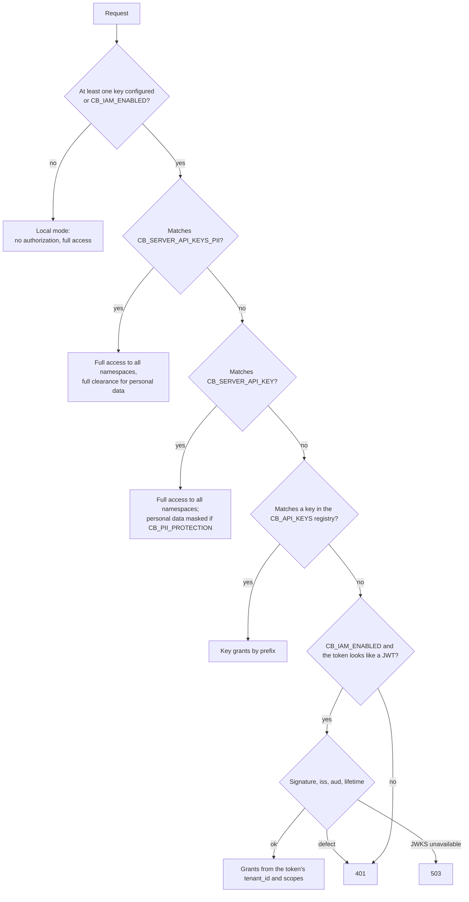

# Namespaces and access

This article describes how memory-service isolates knowledge bases
(namespaces), how it authenticates callers (static keys and IAM access
tokens), how it derives permissions on namespaces, and how it restricts
visibility inside a namespace. It is for integrators and administrators who
grant access to memory.

## A namespace is a knowledge base boundary

A namespace is an opaque string that separates one knowledge base from
another. The engine validates the format and filters by **exact match** at
every step: chunk search, graph traversal (the predicate is applied at both
ends of the path), observations, facts, audit. The engine does not interpret
the name's segments; the hierarchy exists for consumers, for prefix grants and
naming conventions.

| Rule | Value |
|---|---|
| Format | `^[a-z0-9][a-z0-9._:-]{0,199}$`: lowercase Latin letters, digits, and `._:-`, up to 200 characters |
| Write | Exactly one namespace per request |
| Read | One or more namespaces (up to 50 in one request) |
| Creation | Not needed: a namespace appears with the first write |
| Without `scope` | The request works in the default namespace (`CB_DEFAULT_NAMESPACE`) |

An invalid name or a list that is too long → `400`.

!!! tip "Always pass the scope explicitly"
    A request without `scope` works in the service's default namespace. If the
    token was not granted that namespace, you get `403`. In integrations,
    specify the knowledge base in every request.

### How to pass the namespace

| Routes | Method |
|---|---|
| Read `/api/brain/{query,recall,search}`, `/api/memory/context`, `/api/memory/context/typed` | Body: `"scope": {"namespace": "support"}` or `"scope": {"namespaces": ["support", "shared"]}` |
| Write `/api/brain/{retain,facts,audit}`, `/api/memory/observations[:batch]` | Body: `"scope": {"namespace": "support"}` |
| `/api/brain/documents` | `"namespace": "support"` or `"scope": {"namespace": "support"}` (if both are set, they must match, otherwise `400`) |
| `/api/memory/reconcile` | The `namespace` field in the body or `?namespace=` (if both, they must be identical) |
| `GET/DELETE` by key, traces, observations | Query parameter `?namespace=support` |

### Naming scheme in the platform

The platform builds namespace names from identifiers, not from display names:

| Namespace | Who writes | What it holds |
|---|---|---|
| `tenant:<tenant-id>` | Control Plane `context-adapter` | Core domain events (observations): tasks, runs, approvals |
| `tenant:<tenant-id>:ws:<root-workspace-id>` | Control Plane (`/api/v1/knowledge/*`) | Knowledge of the workspace tree: source snapshots, domain packs |
| `tenant:<tenant-id>:principal:<principal-id>` | — | A principal's private namespace (used in the visibility model) |

When assembling context, Control Plane reads the tenant's namespace and the
namespace of the task's root workspace. The `tenant:` prefix is the core
setting `CP_CONTEXT_NAMESPACE_PREFIX`. For standalone applications (a support
bot, a demo), the administrator chooses the name, for example `support` or
`sales`.

!!! note "Logical isolation"
    The namespaces of one instance share one database. If a deployment needs
    physical data isolation, run a separate memory-service instance with a
    separate database.

## Authentication methods

There is one header, `Authorization: Bearer <token>`. The token is checked in
this order:



All key comparisons are done in constant time. Any IAM token defect (expired,
foreign `aud`/`iss`, unknown signing key) yields **the same `401`** as a wrong
key: the service does not hint at which method "almost" worked.

!!! danger "Local mode"
    If none of `CB_SERVER_API_KEY`, `CB_SERVER_API_KEYS_PII`, or `CB_API_KEYS`
    is set, and `CB_IAM_ENABLED=false`, the service works **without
    authorization**. This mode is acceptable only for development on an
    isolated machine.

### Static keys without grants

`CB_SERVER_API_KEY` and the keys from `CB_SERVER_API_KEYS_PII` (comma-separated)
grant read and write access to **all** namespaces. The difference is personal
data clearance:

| Key | Personal data with `CB_PII_PROTECTION=true` |
|---|---|
| `CB_SERVER_API_KEYS_PII` | Full clearance; every release of personal data is logged as `pii_access` |
| `CB_SERVER_API_KEY` | Masked results (`[ПДн:phone]` and so on) |

In the platform's `deploy/local/compose.yml`, `CB_SERVER_API_KEY` equals
`MEMORY_API_KEY`, `CB_SERVER_API_KEYS_PII` is empty, and
`CB_PII_PROTECTION=true`, so the platform's static key gets masked results.

### Key registry with grants (`CB_API_KEYS`)

`CB_API_KEYS` is a JSON array of keys, each with a list of grants on namespace
prefixes. This way one instance serves several consumers with different
permissions.

```json
[
  {
    "name": "answer-bot",
    "key": "<random-key-1>",
    "grants": [
      {"prefix": "support", "read": true, "write": true},
      {"prefix": "shared",  "read": true, "write": false}
    ]
  },
  {
    "name": "kb-admin",
    "key": "<random-key-2>",
    "pii": true,
    "grants": [{"prefix": "", "read": true, "write": true}]
  },
  {
    "name": "orchestrator",
    "key": "<random-key-3>",
    "service": true,
    "grants": [{"prefix": "tenant:", "read": true, "write": true}]
  }
]
```

| Field | Required | Meaning |
|---|---|---|
| `key` | yes | Bearer token value |
| `name` | no | Caller label in audit and in `CB_CORE_IDENTITIES` (`key-<i>` by default) |
| `grants` | yes, non-empty | `{prefix, read, write}`; `read` defaults to `true`, `write` to `false` |
| `pii` | no | Full personal data clearance (otherwise masking when protection is on) |
| `service` | no | Service scope: domain pack registration and access to core routes |

Grant rules:

- a grant covers a namespace if the name **starts with** `prefix`; an empty
  prefix covers all namespaces;
- a request is authorized only if **all** of its namespaces are covered by a
  grant with the required flag; otherwise `403` with the name of the first
  uncovered namespace in `detail`, and no data is read or written, not even
  partially;
- `GET /api/brain/stats` (statistics for the whole instance) is available only
  to keys with a grant on the empty prefix.

!!! warning "A prefix is just the start of a string"
    The grant `support` also covers `support-archive` and `supporters`. If you
    need a restriction to exactly a subtree, end the prefix with a separator:
    `support:`.

Invalid JSON in `CB_API_KEYS` does not break startup, but every authorized
request gets `500` with a description of the configuration error.

### IAM access token

With `CB_IAM_ENABLED=true`, a Bearer that matches no static key and looks like
a JWT (three non-empty dot-separated parts) is verified by the shared
`platform-auth-sdk`: signature against JWKS (`CB_IAM_JWKS_URL`), exact `iss`
(`CB_IAM_ISSUER`), exact `aud` (`CB_IAM_AUDIENCE`, `memory-service` by default;
audience lists are rejected), and time claims with a tolerance of
`CB_IAM_LEEWAY_SECONDS`.

A consumer gets such a token by exchanging its Platform Access Token for
audience `memory-service` (see [IAM tokens](../iam/tokens.md)). Permissions
are derived from the token:

| What is in the token | What it grants |
|---|---|
| `tenant_id` | Namespace `tenant:<tenant_id>` (exactly) and the subtree `tenant:<tenant_id>:*` |
| claim `memory_namespaces` (list) | Each namespace from the list, exactly, and the subtree `<ns>:*` |
| scope `memory:read` | Read flag on all of the token's grants |
| scope `memory:write` | Write flag on all of the token's grants |
| scope `memory:pii` | Full personal data clearance |
| scope `memory:tenants` | The whole `tenant:*` subtree, regardless of the token's `tenant_id` |
| scope `memory:service` | Service scope: core identity (domain packs, core routes); does not extend namespaces |
| scope `memory:on-behalf` | Reading on behalf of another principal with the passed visibility (see below) |

A scope takes effect only if it is present both in the token and in the
client's scope ceiling (the SDK checks this). A valid token without
`memory:read`/`memory:write` covers no namespace, and any data request gets
`403`. IAM grants are strict: `tenant:<id>` is covered by exact match, so
`tenant:<id>0` is not available to someone else's token.

| Situation | Response |
|---|---|
| Defective token | `401` |
| JWKS unavailable or not configured | `503` (fail closed; static keys keep working) |
| Token without permissions on the request's namespace | `403` |
| `GET /api/brain/stats` with an IAM token | `403` |

!!! tip "JWKS at the internal address"
    Point `CB_IAM_JWKS_URL` at the internal IAM address in the deployment's
    network (`http://iam-service:8010/.well-known/jwks.json` in `deploy/local/compose.yml`),
    not at the external proxy: signature verification must not depend on
    external TLS. Keys are cached with rotation in mind.

### Memory scopes in IAM

The `memory-service` audience and its scope ceiling are created by
`deploy/bootstrap.py`:

| Scope | Whom to grant it to |
|---|---|
| `memory:read`, `memory:write` | Applications and agents working with their own memory |
| `memory:pii` | Only those who need unmasked text with personal data |
| `memory:tenants` | Only the Control Plane service account |
| `memory:service` | Only the Control Plane service account |
| `memory:on-behalf` | Only the Control Plane service account (principal-based visibility mode) |

## The core service account

Control Plane calls memory as the **IAM service account** "Taimen Control
Plane" (created by `deploy/bootstrap.py`; the secret is in
`secrets/control-plane-iam.env`). Its ceiling includes `memory:read`,
`memory:write`, `memory:tenants`, `memory:on-behalf`, and `memory:service`:

- `memory:tenants` is needed because `context-adapter` writes and reads the
  memory of **all** tenants of the installation, while the service account
  has a single IAM tenant;
- `memory:service` grants the right to register domain packs and reconcile
  knowledge snapshots that clients publish through the core's
  `POST /api/v1/knowledge/*`;
- `memory:on-behalf` is used when the core works in the `policy`
  authorization mode and reads memory on behalf of the end principal.

As long as the `secrets/control-plane-iam.env` file does not exist (before
bootstrap), the core in `CP_CONTEXT_AUTH=auto` mode uses the static
`MEMORY_API_KEY`; after bootstrap and a restart of the core processes, it uses
IAM. See [Control Plane configuration](../control-plane/configuration.md).

## Core routes {#core-routes}

You can reserve knowledge schema management for a trusted orchestrator. If
`CB_CORE_ONLY=true` is set or `CB_CORE_IDENTITIES` is non-empty, the routes

- `POST/GET /api/memory/packages`, `GET /api/memory/packages/{name}`,
- `GET/PUT /api/memory/namespaces/{ns}/kinds`,
- `POST /api/memory/reconcile`

return `403` to everyone except callers with the service scope (IAM
`memory:service`, a registry key with `"service": true`) and the labels from
`CB_CORE_IDENTITIES`, even if the token has permissions on the namespace.
Labels: the registry key's `name`, `base` (for `CB_SERVER_API_KEY`),
`pii-full` (for `CB_SERVER_API_KEYS_PII` keys),
`iam:<principal_type>:<principal_id>` for an IAM token. Local mode without
authentication is not recognized as the core (fail closed) unless the
`default` label is listed explicitly. A trusted caller still needs
permissions on the namespace.

Without the restriction, pack registration (`POST /api/memory/packages`)
still requires the service scope: a key with `"service": true`, IAM
`memory:service`, a key with a write grant on the empty prefix, or a legacy
key without grants.

## Visibility inside a namespace {#visibility}

A namespace is a storage boundary. Inside it, an element can carry visibility
scopes:

- `workspace:<id>`: the element belongs to a workspace;
- `principal:<id>`: a principal's private element.

An element with such scopes is visible only if they intersect with the
caller's **allowed scopes**. Elements without scopes (or only with relevance
scopes such as `task:…`) are visible to everyone who reads the namespace.

The server determines the allowed namespaces and scopes:


| Caller | Visibility |
|---|---|
| Static key, local mode | Unrestricted |
| IAM token with `CB_POLICY_ENABLED=false` | Unrestricted (grants only) |
| IAM token of a human or agent with `CB_POLICY_ENABLED=true` | From the external PDP: `list_objects(memory.read, memory_namespace)` → namespaces, `list_objects(memory.read, workspace)` → `workspace:<id>`, plus the caller's own `principal:<id>` and the principal's private namespace |
| Service account with `memory:on-behalf` and `CB_POLICY_ENABLED=true` | From the request body: `allowedNamespaces` and `allowedScopes` are required, otherwise `403` |

The PDP response is cached for `CB_POLICY_CACHE_TTL_SECONDS` (5 s by default)
per tenant/principal pair. PDP unavailability → `503`, not "allow". A request
to a namespace outside visibility → `403`. To call the PDP, memory uses its own
service identity (`CB_IAM_CLIENT_ID`/`CB_IAM_CLIENT_SECRET`; the
`secrets/memory-service-iam.env` file is added together with the PDP).


!!! warning "Experimental mode"
    Principal-based visibility relies on an external PDP and is an
    experimental capability. By default, `MEMORY_POLICY_ENABLED=false`.

### Narrowing visibility in a request

Any caller can narrow their visibility for a single request with the body
fields `allowedNamespaces` and/or `allowedScopes` (accepted by
`/api/memory/context`, `/api/memory/context/typed`, `/api/brain/query`,
`/api/brain/recall`, `/api/brain/search`):

- the **intersection** with server-side visibility is used; narrowing does not
  extend permissions;
- a missing field or `null` leaves visibility unchanged;
- an empty list means **nothing**: `"allowedScopes": []` hides all elements
  with `workspace:`/`principal:`, and `"allowedNamespaces": []` forbids reading
  any namespace (`403`);
- a request namespace outside the narrowed `allowedNamespaces` → `403`;
- not a list of strings, or an invalid name → `400`; `allowedScopes` takes up
  to 500 elements.

Example: read the memory of the `backend` workspace and its ancestor `org`,
but not the sibling `finance` in the same knowledge base:

```json
{
  "strategy": "briefing",
  "scope": {"namespace": "tenant:<tenant-id>:ws:<org-id>"},
  "allowedScopes": ["workspace:<backend-id>", "workspace:<org-id>"]
}
```

!!! note "Where the visibility filter does not apply"
    The structural mode of `/api/brain/search` (with `filters.type`) does not
    apply the visibility scope filter; `GET /api/brain/nodes` drops nodes by
    scopes only after the selection (the response may contain fewer than
    `limit` records); `GET /api/brain/nodes/{key}` and
    `GET /api/brain/sources/{key}` check only the grants on the namespace. Do
    not rely on visibility scopes as the only protection for point reads by key.

## Access code summary

| Code | When |
|---|---|
| `400` | Invalid namespace/scope name, more than 50 namespaces, conflicting `namespace` and `scope.namespace` |
| `401` | No header, wrong key, defective IAM token |
| `403` | Namespace not covered by grants; namespace outside the principal's visibility; core route without the service scope; `stats` without a global grant; `memory:on-behalf` without `allowed*` |
| `500` | Invalid `CB_API_KEYS` |
| `503` | JWKS or the external visibility PDP (if enabled) is unavailable |

## See also

- [API](api.md)
- [Configuration](configuration.md)
- [IAM tokens](../iam/tokens.md)
- [Service accounts](../iam/service-accounts.md)
- [Permissions and scopes](../reference/permissions.md)
- [Control Plane context](../control-plane/context.md)
