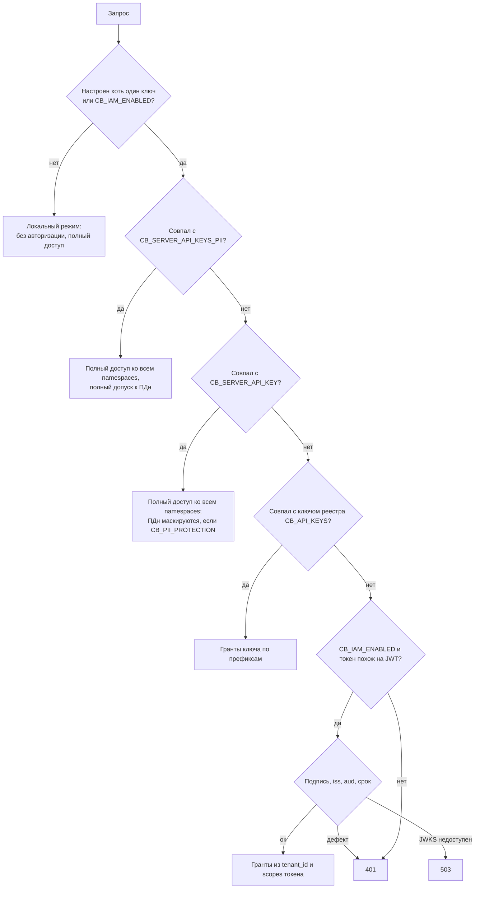

# Namespaces и доступ

Статья описывает, как memory-service изолирует базы знаний (namespaces), как
аутентифицирует вызывающих (статические ключи и access token IAM), как выводит права
на namespaces и как ограничивает видимость внутри namespace. Она для интеграторов и
администраторов, которые выдают доступ к памяти.

## Namespace — граница базы знаний

Namespace — опаковая строка, которая отделяет одну базу знаний от другой. Движок
проверяет формат и фильтрует по **точному совпадению** на каждом шаге: поиск чанков,
обход графа (предикат стоит на обоих концах пути), наблюдения, факты, аудит. Сегменты
имени движок не интерпретирует — иерархия существует для потребителей: для префиксных
грантов и для договорённостей об именах.

| Правило | Значение |
|---|---|
| Формат | `^[a-z0-9][a-z0-9._:-]{0,199}$` — строчные латинские буквы, цифры и `._:-`, до 200 символов |
| Запись | Ровно один namespace на запрос |
| Чтение | Один или несколько namespaces (до 50 в одном запросе) |
| Создание | Не нужно: namespace появляется с первой записью |
| Без `scope` | Запрос работает в namespace по умолчанию (`CB_DEFAULT_NAMESPACE`) |

Некорректное имя или слишком длинный список → `400`.

!!! tip "Всегда передавайте scope явно"
    Запрос без `scope` работает в namespace по умолчанию сервиса. Если токену этот
    namespace не выдан, будет `403`. В интеграциях указывайте базу знаний в каждом
    запросе.

### Как передать namespace

| Маршруты | Способ |
|---|---|
| Чтение `/api/brain/{query,recall,search}`, `/api/memory/context`, `/api/memory/context/typed` | Тело: `"scope": {"namespace": "support"}` или `"scope": {"namespaces": ["support", "shared"]}` |
| Запись `/api/brain/{retain,facts,audit}`, `/api/memory/observations[:batch]` | Тело: `"scope": {"namespace": "support"}` |
| `/api/brain/documents` | `"namespace": "support"` или `"scope": {"namespace": "support"}` (если заданы оба — они должны совпадать, иначе `400`) |
| `/api/memory/reconcile` | Поле `namespace` в теле или `?namespace=` (оба — только одинаковые) |
| `GET/DELETE` по ключу, трейсы, наблюдения | Query-параметр `?namespace=support` |

### Схема имён в платформе

Платформа строит имена namespaces от идентификаторов, а не от отображаемых названий:

| Namespace | Кто пишет | Что лежит |
|---|---|---|
| `tenant:<tenant-id>` | `context-adapter` Control Plane | Доменные события ядра (наблюдения): задачи, прогоны, approvals |
| `tenant:<tenant-id>:ws:<root-workspace-id>` | Control Plane (`/api/v1/knowledge/*`) | Знания дерева воркспейсов: снимки источников, доменные пакеты |
| `tenant:<tenant-id>:principal:<principal-id>` | — | Приватный namespace principal (используется в модели видимости) |

При сборке контекста Control Plane читает namespace tenant'а и namespace корневого
воркспейса задачи. Префикс `tenant:` — настройка ядра `CP_CONTEXT_NAMESPACE_PREFIX`.
Для самостоятельных приложений (бот поддержки, демо) имя выбирает администратор,
например `support` или `sales`.

!!! note "Логическая изоляция"
    Namespaces одного инстанса делят одну БД. Если контуру нужна физическая изоляция
    данных, поднимайте отдельный инстанс memory-service с отдельной БД.

## Способы аутентификации

Заголовок один — `Authorization: Bearer <token>`. Токен проверяется по порядку:



Все сравнения ключей выполняются в постоянном времени. Любой дефект IAM-токена
(истёк, чужой `aud`/`iss`, неизвестный ключ подписи) даёт **тот же `401`**, что и
неверный ключ, — сервис не подсказывает, какой способ «почти» подошёл.

!!! danger "Локальный режим"
    Если не задан ни `CB_SERVER_API_KEY`, ни `CB_SERVER_API_KEYS_PII`, ни `CB_API_KEYS`,
    и `CB_IAM_ENABLED=false`, сервис работает **без авторизации**. Такой режим
    допустим только для разработки на изолированной машине.

### Статические ключи без грантов

`CB_SERVER_API_KEY` и ключи из `CB_SERVER_API_KEYS_PII` (через запятую) дают доступ ко
**всем** namespaces на чтение и запись. Разница — в допуске к ПДн:

| Ключ | ПДн при `CB_PII_PROTECTION=true` |
|---|---|
| `CB_SERVER_API_KEYS_PII` | Полный допуск, каждая выдача ПДн журналируется `pii_access` |
| `CB_SERVER_API_KEY` | Маскированная выдача (`[ПДн:phone]` и т. п.) |

В `deploy/local/compose.yml` платформы `CB_SERVER_API_KEY` равен `MEMORY_API_KEY`,
`CB_SERVER_API_KEYS_PII` пуст, а `CB_PII_PROTECTION=true` — то есть статический ключ
платформы получает маскированную выдачу.

### Реестр ключей с грантами (`CB_API_KEYS`)

`CB_API_KEYS` — JSON-массив ключей, у каждого — список грантов на префиксы namespaces.
Так один инстанс обслуживает несколько потребителей с разными правами.

```json
[
  {
    "name": "answer-bot",
    "key": "<случайный-ключ-1>",
    "grants": [
      {"prefix": "support", "read": true, "write": true},
      {"prefix": "shared",  "read": true, "write": false}
    ]
  },
  {
    "name": "kb-admin",
    "key": "<случайный-ключ-2>",
    "pii": true,
    "grants": [{"prefix": "", "read": true, "write": true}]
  },
  {
    "name": "orchestrator",
    "key": "<случайный-ключ-3>",
    "service": true,
    "grants": [{"prefix": "tenant:", "read": true, "write": true}]
  }
]
```

| Поле | Обязательно | Смысл |
|---|---|---|
| `key` | да | Значение Bearer-токена |
| `name` | нет | Метка вызывающего в аудите и в `CB_CORE_IDENTITIES` (по умолчанию `key-<i>`) |
| `grants` | да, непустой | `{prefix, read, write}`; `read` по умолчанию `true`, `write` — `false` |
| `pii` | нет | Полный допуск к ПДн (иначе при включённой защите — маска) |
| `service` | нет | Service scope: регистрация доменных пакетов и доступ к маршрутам ядра |

Правила грантов:

- грант покрывает namespace, если имя **начинается** с `prefix`; пустой префикс
  покрывает все namespaces;
- запрос авторизуется, только если **все** его namespaces покрыты грантом с нужным
  флагом; иначе `403` с именем первого непокрытого namespace в `detail` — данные не
  читаются и не пишутся даже частично;
- `GET /api/brain/stats` (статистика всего инстанса) доступна только ключам с грантом
  на пустой префикс.

!!! warning "Префикс — это просто начало строки"
    Грант `support` покроет и `support-archive`, и `supporters`. Если нужно
    ограничение ровно поддеревом, заканчивайте префикс разделителем: `support:`.

Некорректный JSON в `CB_API_KEYS` не валит старт, но каждый запрос с авторизацией
будет получать `500` с описанием ошибки конфигурации.

### Access token IAM

При `CB_IAM_ENABLED=true` Bearer, не совпавший ни с одним статическим ключом и похожий
на JWT (три непустые части через точку), проверяется общим `platform-auth-sdk`:
подпись по JWKS (`CB_IAM_JWKS_URL`), точный `iss` (`CB_IAM_ISSUER`), точный `aud`
(`CB_IAM_AUDIENCE`, по умолчанию `memory-service`; списки audience отвергаются) и
временные claims с допуском `CB_IAM_LEEWAY_SECONDS`.

Потребитель получает такой токен обменом своего Platform Access Token на audience
`memory-service` (см. [Токены IAM](../iam/tokens.md)). Права выводятся из токена:

| Что в токене | Что даёт |
|---|---|
| `tenant_id` | Namespace `tenant:<tenant_id>` (ровно он) и поддерево `tenant:<tenant_id>:*` |
| claim `memory_namespaces` (список) | Каждый namespace из списка — ровно он и поддерево `<ns>:*` |
| scope `memory:read` | Флаг чтения всех грантов токена |
| scope `memory:write` | Флаг записи всех грантов токена |
| scope `memory:pii` | Полный допуск к ПДн |
| scope `memory:tenants` | Всё поддерево `tenant:*`, независимо от `tenant_id` токена |
| scope `memory:service` | Service scope: identity ядра (доменные пакеты, маршруты ядра); namespaces не расширяет |
| scope `memory:on-behalf` | Чтение от имени другого principal с переданной видимостью (см. ниже) |

Scope действует, только если он есть и в токене, и в потолке scope клиента (проверяет
SDK). Валидный токен без `memory:read`/`memory:write` не покрывает ни одного
namespace — любой запрос к данным получит `403`. Гранты IAM строгие: `tenant:<id>`
покрывается точным совпадением, поэтому `tenant:<id>0` чужому токену недоступен.

| Ситуация | Ответ |
|---|---|
| Токен с дефектом | `401` |
| JWKS недоступен или не настроен | `503` (fail closed; статические ключи продолжают работать) |
| Токен без прав на namespace запроса | `403` |
| `GET /api/brain/stats` с IAM-токеном | `403` |

!!! tip "JWKS — по внутреннему адресу"
    Указывайте `CB_IAM_JWKS_URL` на внутренний адрес IAM в сети контура
    (`http://iam-service:8010/.well-known/jwks.json` в `deploy/local/compose.yml`), а не на внешний
    прокси: проверка подписи не должна зависеть от внешнего TLS. Ключи кэшируются с
    учётом ротации.

### Scopes памяти в IAM

Audience `memory-service` и его потолок scope заводит `deploy/bootstrap.py`:

| Scope | Кому выдавать |
|---|---|
| `memory:read`, `memory:write` | Приложениям и агентам, которые работают со своей памятью |
| `memory:pii` | Только тем, кому нужен немаскированный текст с ПДн |
| `memory:tenants` | Только service account Control Plane |
| `memory:service` | Только service account Control Plane |
| `memory:on-behalf` | Только service account Control Plane (режим видимости по principal) |

## Service account ядра

Control Plane ходит в память **service account'ом IAM** «Taimen Control Plane»
(создаётся `deploy/bootstrap.py`, секрет — `secrets/control-plane-iam.env`).
Его потолок включает `memory:read`, `memory:write`, `memory:tenants`,
`memory:on-behalf` и `memory:service`:

- `memory:tenants` нужен, потому что `context-adapter` пишет и читает память **всех**
  tenant'ов инсталляции, а tenant IAM у service account один;
- `memory:service` даёт право регистрировать доменные пакеты и сверять снимки знаний,
  которые клиенты публикуют через `POST /api/v1/knowledge/*` ядра;
- `memory:on-behalf` используется, когда ядро работает в режиме авторизации `policy`
  и читает память от имени конечного principal.

Пока файла `secrets/control-plane-iam.env` нет (до bootstrap), ядро в режиме
`CP_CONTEXT_AUTH=auto` использует статический `MEMORY_API_KEY`; после bootstrap и
перезапуска процессов ядра — IAM. См. [Конфигурацию Control Plane](../control-plane/configuration.md).

## Маршруты ядра {#core-routes}

Управление схемой знаний можно закрепить за доверенным оркестратором. Если задан
`CB_CORE_ONLY=true` или непустой `CB_CORE_IDENTITIES`, маршруты

- `POST/GET /api/memory/packages`, `GET /api/memory/packages/{name}`,
- `GET/PUT /api/memory/namespaces/{ns}/kinds`,
- `POST /api/memory/reconcile`

отвечают `403` всем, кроме вызывающих со service scope (IAM `memory:service`, ключ
реестра с `"service": true`) и меток из `CB_CORE_IDENTITIES`, — даже если у токена
есть права на namespace. Метки: `name` ключа реестра, `base` (для
`CB_SERVER_API_KEY`), `pii-full` (для ключей `CB_SERVER_API_KEYS_PII`),
`iam:<principal_type>:<principal_id>` для IAM-токена. Локальный режим без
аутентификации ядро не опознаёт (fail closed), если метка `default` не перечислена
явно. Доверенному вызывающему права на namespace всё равно нужны.

Без ограничения регистрация пакета (`POST /api/memory/packages`) всё равно требует
service scope: ключ с `"service": true`, IAM `memory:service`, ключ с грантом записи
на пустой префикс или legacy-ключ без грантов.

## Видимость внутри namespace {#visibility}

Namespace — граница хранения. Внутри него элемент может нести scopes видимости:

- `workspace:<id>` — элемент принадлежит воркспейсу;
- `principal:<id>` — приватный элемент principal.

Элемент с такими scopes виден, только если они пересекаются с **разрешёнными scopes**
вызывающего. Элементы без scopes (или только со scopes релевантности вроде `task:…`)
видны всем, кто читает namespace.

Разрешённые namespaces и scopes определяет сервер:


| Вызывающий | Видимость |
|---|---|
| Статический ключ, локальный режим | Без ограничений |
| IAM-токен при `CB_POLICY_ENABLED=false` | Без ограничений (только гранты) |
| IAM-токен человека или агента при `CB_POLICY_ENABLED=true` | Из внешнего PDP: `list_objects(memory.read, memory_namespace)` → namespaces, `list_objects(memory.read, workspace)` → `workspace:<id>`, плюс собственный `principal:<id>` и приватный namespace principal |
| Service account с `memory:on-behalf` при `CB_POLICY_ENABLED=true` | Из тела запроса: `allowedNamespaces` и `allowedScopes` обязательны, иначе `403` |

Ответ PDP кэшируется на `CB_POLICY_CACHE_TTL_SECONDS` (по умолчанию 5 с)
по паре tenant/principal. Недоступность PDP → `503`, не «разрешить».
Запрос к namespace вне видимости → `403`. Для вызова PDP память использует
свою service identity (`CB_IAM_CLIENT_ID`/`CB_IAM_CLIENT_SECRET`, файл
`secrets/memory-service-iam.env` кладётся вместе с подключением PDP).


!!! warning "Экспериментальный режим"
    Видимость по principal опирается на внешний PDP и относится к
    экспериментальным возможностям. По умолчанию `MEMORY_POLICY_ENABLED=false`.

### Сужение видимости в запросе

Любой вызывающий может сузить свою видимость на один запрос полями тела
`allowedNamespaces` и/или `allowedScopes` (принимаются `/api/memory/context`,
`/api/memory/context/typed`, `/api/brain/query`, `/api/brain/recall`,
`/api/brain/search`):

- берётся **пересечение** с серверной видимостью — сужение не расширяет права;
- поле отсутствует или `null` — видимость без изменений;
- пустой список — **ничего**: `"allowedScopes": []` скрывает все элементы с
  `workspace:`/`principal:`, `"allowedNamespaces": []` запрещает чтение любого
  namespace (`403`);
- namespace запроса вне суженного `allowedNamespaces` → `403`;
- не список строк или некорректное имя → `400`; `allowedScopes` — до 500 элементов.

Пример: читать память воркспейса `backend` и его предка `org`, но не соседнего
`finance` в той же базе знаний:

```json
{
  "strategy": "briefing",
  "scope": {"namespace": "tenant:<tenant-id>:ws:<org-id>"},
  "allowedScopes": ["workspace:<backend-id>", "workspace:<org-id>"]
}
```

!!! note "Где фильтр видимости не применяется"
    Структурный режим `/api/brain/search` (с `filters.type`) scope-фильтра видимости
    не применяет, `GET /api/brain/nodes` отсекает узлы по scopes уже после выборки
    (ответ может содержать меньше `limit` записей); `GET /api/brain/nodes/{key}` и
    `GET /api/brain/sources/{key}` проверяют только гранты на namespace. Не
    полагайтесь на scopes видимости как на единственную защиту для точечного чтения
    по ключу.

## Сводка кодов доступа

| Код | Когда |
|---|---|
| `400` | Некорректное имя namespace/scope, больше 50 namespaces, противоречивые `namespace` и `scope.namespace` |
| `401` | Нет заголовка, неверный ключ, дефектный IAM-токен |
| `403` | Namespace не покрыт грантами; namespace вне видимости principal; маршрут ядра без service scope; `stats` без глобального гранта; `memory:on-behalf` без `allowed*` |
| `500` | Некорректный `CB_API_KEYS` |
| `503` | JWKS или внешний PDP видимости (если включён) недоступны |

## См. также

- [API](api.md)
- [Конфигурация](configuration.md)
- [Токены IAM](../iam/tokens.md)
- [Service accounts](../iam/service-accounts.md)
- [Права и scopes](../reference/permissions.md)
- [Контекст Control Plane](../control-plane/context.md)
