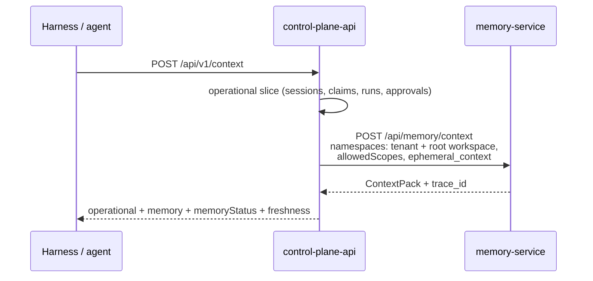

# Search and context assembly

This article describes how memory-service finds relevant knowledge and
assembles context from it: hybrid search (vector + full-text + graph), RRF
fusion, LLM reranking, answer synthesis, sources, the Context Compiler
(`/api/memory/context`), and typed traversal. It is for integrators who build
bot answers and agent context on top of memory, and for those who tune search
quality.

## Read modes

| Route | What it returns | LLM | When to use |
|---|---|---|---|
| `POST /api/brain/query` | Fragments, graph neighbors, sources, ready-made context text; optionally an LLM answer | Only with `synthesize: true` | Question → answer with citations |
| `POST /api/brain/recall` | The same, with the volume set by the `low`/`mid`/`high` budget | No | Realtime path, prompter, operator hints |
| `POST /api/brain/search` | Semantic top-k or a structural list of nodes | No | Point search, filters by tags |
| `GET /api/brain/sources/{key}` | The full original document with provenance | No | A "where it came from" card |
| `POST /api/memory/context` | `ContextPack`: sections, sources, budget, trace | No | Context for an agent or a harness |
| `POST /api/memory/context/typed` | Traversal over typed relations as of `as_of` | No | Task context according to the domain model |

## Hybrid search `/api/brain/*`

`query`, `recall`, and semantic `search` use a single pipeline:

```mermaid
flowchart TD
    Q[Question] --> E[Question embedding]
    E --> V[Vector search<br/>cosine, HNSW]
    Q --> F[Full-text search<br/>Russian configuration]
    V --> R[RRF fusion<br/>score = Σ 1/(60 + rank + 1)]
    F --> R
    R --> N[Graph neighbors<br/>hops 1–2, up to 40 nodes]
    N --> RR{Rerank enabled?}
    RR -- no --> TOP[top-k by RRF]
    RR -- yes --> POOL[Pool: vector hits ∪ neighbors with text]
    POOL --> LLM[LLM score 0–100 → rerank_score 0..1]
    LLM --> TOP2[top-k by rerank_score]
    TOP --> S[Sources + context text]
    TOP2 --> S
    S --> SYN{synthesize?}
    SYN -- yes --> ANS[LLM answer with citations]
```

### Channels and fusion

1. **Vector channel.** The question is embedded with the same model as the
   fragments; search uses cosine distance (the pgvector HNSW index). A
   fragment's `score` in this channel is `1 - cosine_distance`.
2. **Full-text channel.** A fragment's document is `title + heading + text` in
   the PostgreSQL Russian configuration; the query is an OR over the stemmed
   lexemes of the question (stop words are dropped); ranking uses `ts_rank`.
3. **Candidate pool.** Each channel returns
   `max(20, k × max(2, number of namespaces))` candidates: filters (namespace,
   `meta`, visibility) are applied on top of HNSW, so the pool is enlarged.
4. **Reciprocal Rank Fusion.** A fragment's final `score` is the sum of
   `1 / (60 + rank + 1)` over the channels where it was found. The top-k are
   taken.
5. **Graph.** From the nodes of the found fragments, the engine takes
   neighbors `hops` steps away (1–2, at most 40 nodes), strictly within the
   requested namespaces. Neighbors go into `neighbors`, the sources, and the
   context text.

All filters are real `WHERE` predicates: fragments from another namespace or
outside the principal's visibility never get into results, not even as
candidates.

!!! warning "`score` is not confidence"
    An RRF score is small by nature: the maximum is about `2/61 ≈ 0.033` (a
    fragment ranked first in both channels). It is good only for ordering.
    **Do not build a confidence threshold on `score`**; use `rerank_score`
    (0..1), which appears when reranking is enabled.

### LLM reranking

With `CB_RERANK_ENABLED=true`, the model re-scores the candidates:

| Step | How |
|---|---|
| Vector candidates | `min(CB_RERANK_POOL, 12)`: fewer, to leave room for neighbors |
| Pool | Vector hits ∪ graph neighbors with text (`content` or title), deduplicated by `node_key`, at most `max(CB_RERANK_POOL, k)` |
| Call | A single chat completions request for the whole pool; the first 600 characters of each candidate (`title — heading` + text) |
| Score | The model returns JSON `{"0": 91, "1": 37, …}` on a 0–100 scale; `rerank_score = score / 100` |
| Model | `CB_RERANK_MODEL`, `CB_LLM_MODEL` by default; `temperature=0`, 12 s timeout |
| Result | Sorted by `rerank_score`, top-k |

**Reranking never breaks search.** If the LLM is unavailable
(`CB_LLM_PROVIDER=echo` or an empty key), or the call fails, times out, or
returns incomplete JSON, the original RRF order is returned and `rerank_score`
stays `null`.

!!! tip "How to choose a confidence threshold"
    To show users only confident answers, use the `rerank_score` of the first
    hit: for example, hide the hint when the value is below 0.3. Tune the
    threshold on your own control questions: different models have different
    scales.

Reranking adds one LLM call to the request. For realtime scenarios, choose a
fast model, or leave reranking off and rely on the RRF order.

### Answer synthesis

`POST /api/brain/query` with `"synthesize": true` (or
`CB_QUERY_SYNTHESIZE_DEFAULT=true` if the field is not passed) sends the
found context to the LLM with a system instruction: answer only from the
context, do not make things up, say honestly when there is no data, and list
the sources used. Call parameters: `temperature=0.1`, 25 s timeout. If nothing
is found, the LLM is not called, and a fixed answer is returned stating that
the knowledge graph has no data on this question.

With `CB_LLM_PROVIDER=echo`, the context itself is returned instead of an
answer, marked as echo mode. If your own model generates the answer, call with
`synthesize: false` and use the `context` field.

### Context text

The `context` field is text ready to insert into a prompt:

```text
# Найденные фрагменты

## [<node_key>] <title> — <heading>
Источник: <source_path>

<fragment text>

# Связанные сущности (граф, соседи)
- [<natural_key>] (<type>) <title> status=… — <source_path>
```

Before being joined, the body of each fragment goes through prompt-injection
neutralization: the content of emails, transcripts, and agent records is
treated as untrusted.

### Sources

`sources` is a list of `{source_path, node_key, title}` deduplicated by
`node_key`: first the nodes of the found fragments, then the neighbors. A
source opens in full by `node_key`:

```bash
curl "$MEMORY_URL/api/brain/sources/https://kb.example.com/articles/guest-pass?namespace=support" \
  -H "Authorization: Bearer $TOKEN"
```

The response contains `content` (the original or the joined fragments),
`content_source` (`original` | `chunks`), the number of fragments,
`provenance`, and personal data flags. The node is looked up strictly in the
specified namespace: an article from another knowledge base gives `404`.

## Example: question → answer with citations

```bash
curl -X POST "$MEMORY_URL/api/brain/query" \
  -H "Authorization: Bearer $TOKEN" -H "Content-Type: application/json" \
  -d '{"question": "How do I get a guest pass?", "k": 8, "hops": 1,
       "synthesize": false, "scope": {"namespace": "support"}}'
```

```json
{
  "question": "How do I get a guest pass?",
  "scope": {"namespace": "support"},
  "synthesized": false,
  "hits": [
    {"chunk_id": 128, "node_key": "https://kb.example.com/articles/guest-pass",
     "source_path": "kb.example.com", "title": "Guest pass", "heading": "",
     "text": "How to get a guest pass…", "score": 0.0325,
     "namespace": "support", "meta": {}, "rerank_score": 0.91}
  ],
  "neighbors": [],
  "sources": [{"source_path": "kb.example.com",
               "node_key": "https://kb.example.com/articles/guest-pass",
               "title": "Guest pass"}],
  "context": "# Найденные фрагменты\n\n## [https://kb.example.com/…"
}
```

## Recall and search

**`POST /api/brain/recall`** is the same read, but the size is set by a budget:

| `budget` | k fragments |
|---|---|
| `low` | 4 |
| `mid` (default) | 8 |
| `high` | 16 |

Response: `memories[]` (`node_key`, `title`, `heading`, `source_path`, `text`,
`namespace`), `sources`, `neighbors`, `context`, `count`.

**`POST /api/brain/search`** works in two modes:

- without `filters.type`: semantic top-k (`filters.limit`, 20 by default)
  with an optional `filters.meta`, a filter on fragment tags (`meta @> {...}`:
  a fragment matches if it contains all the specified pairs);
- with `filters.type` (and optionally `filters.status`): a structural list of
  graph nodes without vector search.

```json
{"query": "license", "filters": {"meta": {"collection": "licenses"}, "limit": 10},
 "scope": {"namespace": "support"}}
```

## Context Compiler: `POST /api/memory/context` {#context-compiler}

The main read route for agents: it returns a structured `ContextPack` within a
token budget, **without** LLM synthesis. This is what Control Plane calls when
it assembles task context (the core's `POST /api/v1/context`).

```json
{
  "query": "Continue the investigation of the failed deploy",
  "scopes": ["project:alpha"],
  "anchors": ["person:alice"],
  "ephemeral_context": {"current_state": "deploy failed on step 3"},
  "budget": {"tokens": 12000},
  "strategy": "hybrid",
  "as_of": "",
  "k": 8,
  "scope": {"namespaces": ["support", "shared"]}
}
```

| Field | Default | Meaning |
|---|---|---|
| `query` | `""` | Query text |
| `scopes` | `[]` | Relevance scopes `type:id` (up to 10): elements that intersect them **plus** elements without scopes |
| `anchors` | `[]` | Anchor entities for graph and fact traversal |
| `subject` | — | `{type, id}`: whom the context is assembled for |
| `ephemeral_context` | `{}` | The caller's current state: goes into the `current` section and is **not stored** |
| `budget.tokens` / `max_tokens` | `CB_CONTEXT_DEFAULT_MAX_TOKENS` (8000) | Pack budget |
| `strategy` | `hybrid` | Set of channels (see below) |
| `as_of` | now | Historical slice of facts (ISO-8601) |
| `k` | 8 | Target size of each channel |

### Channels and strategies

| Channel | What it finds | Weight in RRF |
|---|---|---|
| `lexical` | Exact identifiers (UUIDs, SHAs, error codes, file names) through trigrams + Russian FTS | 1.0 |
| `vector` | Fragments by embedding | 1.0 |
| `facts` | Temporal facts around the anchors as of `as_of`; conflicts are marked | 1.0 |
| `graph` | Neighbors of the anchors and top hits (depth ≤ `CB_CONTEXT_MAX_DEPTH`, nodes ≤ `CB_CONTEXT_MAX_NODES`, edges ≤ `CB_CONTEXT_MAX_EDGES`) | 0.7 |
| `recent` | Recent observations by scopes | 0.6 |

| `strategy` | Channels |
|---|---|
| `hybrid` (default), `context` | all five |
| `semantic` | `vector` |
| `exact` | `lexical` |
| `graph` | `graph`, `facts` |
| `briefing` | `graph`, `facts`, `recent`: standing context without a `query` |

### Scoring

The base is a weighted RRF: `Σ channel_weight / (60 + rank + 1)`. On top of it
come additive bonuses that break ties:

| Signal | Bonus |
|---|---|
| Exact match of an identifier from the query | +0.010 |
| Element in an explicitly requested scope | +0.004 |
| Fact in effect (interval not closed) | +0.003 |
| Evidence strength | +0.002 per rank (`asserted` = 3 → +0.006) |
| Recency (exponential decay, 14-day half-life) | up to +0.005 |

All terms are returned in the `signals` of each element, so the results are
explainable.

### Budget and sections

An element's size is estimated as `len(text) / CB_CONTEXT_CHARS_PER_TOKEN`
(3.0 by default, conservative for Cyrillic). The `current` section is included
first; the other elements are selected greedily by score; whatever does not
fit goes into `budget.dropped` with a reason.

Section order: `current` → `relevant_facts` → `episodes` → `documents` →
`related_entities` → `recent_observations`.

```json
{
  "query": "…",
  "sections": [
    {"kind": "current", "items": [...]},
    {"kind": "relevant_facts", "items": [...]},
    {"kind": "documents", "items": [...]}
  ],
  "sources": [{"source_path": "…", "node_key": "…", "title": "…"}],
  "token_estimate": 9341,
  "budget": {"max_tokens": 12000, "dropped": [...], "truncated": false},
  "conflicts": ["fact-…"],
  "trace_id": "ctx-…"
}
```

A section element carries `kind`, `id`, `text`, `title`, `source_path`,
`score`, `signals`, `token_estimate`, and `provenance` (the chain to the
observation or document). Conflicting fact versions are marked
`"conflict": true`, and both stay in the results.

### Compilation trace

`GET /api/memory/context/trace/{trace_id}?namespace=…` returns what happened
during assembly: channels and their counters, weights, ranking and budget
decisions. From it you can reconstruct why a particular element did (or did
not) get into the context. `ephemeral_context` is not stored in the trace,
only its size.

## Typed traversal: `POST /api/memory/context/typed` {#typed}

The compiler's second mode, for task context in a domain model: instead of
ranking candidates, a deterministic traversal over the relations of domain
packs.

```json
{
  "anchors": [{"kind": "endpoint", "value": "GET /api/v1/runs/{}/checkpoints"}],
  "traverse": [
    {"relation": "calls", "direction": "in", "depth": 1, "limit": 50}
  ],
  "as_of": "2026-09-05T00:00:00Z",
  "allow_semantic": false,
  "scope": {"namespaces": ["tenant:<tenant-id>:ws:<workspace-id>"]}
}
```

- An anchor is resolved in order: exact entity key → key alias (the pack's
  `aliases`) → identifier extracted from `value` by the `idPatterns` patterns.
  Vector search is used only with `"allow_semantic": true`, and such anchors
  are marked `"evidence": "inferred"`.
- A traversal step: `relation`, `direction` (`in` | `out` | `both`), `depth`
  1..5, `limit` 1..200 new entities per step, `from` is `anchors` (default) or
  `previous`.
- Only facts valid as of `as_of` (now by default) are traversed: closed
  relations are not followed; entity attributes are taken from the version in
  effect as of `as_of`.

Response: `anchors` (how each anchor was resolved), `unresolved`, `sections`
by entity kind, `facts`, `used` (the full list of entities, facts, and
snapshots, for evidence in your system), `sources`, `trace_id`. Permissions,
visibility, and personal data masking work as in `POST /api/memory/context`.

## How Control Plane assembles context



- The harness does not choose the namespace itself: the core computes it after
  checking the principal, workspace, task, and run.
- The core's operational state is passed in `ephemeral_context` and is not
  stored in memory.
- Memory unavailability does not block work: the core returns the operational
  context and a `memoryStatus` of `unavailable` or `timeout` instead of an
  error.

Details are in [Control Plane context](../control-plane/context.md).

## Search performance

| Factor | Impact | What to do |
|---|---|---|
| Question embedding | The first call in the pipeline, before the database is queried | Keep `CB_EMBEDDING_TIMEOUT` reasonable: otherwise a hung provider holds the worker |
| Rerank | +1 LLM call (12 s timeout) | A fast model, or reranking off for realtime |
| Synthesis | +1 LLM call (25 s timeout) | `synthesize: false` and your own model |
| Graph traversal | SQL over the graph tables, one hop per query, using the edge indexes | PostgreSQL JIT is off by default (`CB_DB_JIT=false`); do not enable it without measuring |
| Number of namespaces in a request | Enlarges the candidate pool | Read only the bases you need |

More on operational settings is in [Configuration](configuration.md#performance).

## See also

- [Knowledge ingestion](ingestion.md)
- [Namespaces and access](namespaces.md)
- [API](api.md)
- [Configuration](configuration.md)
- [Control Plane context](../control-plane/context.md)
