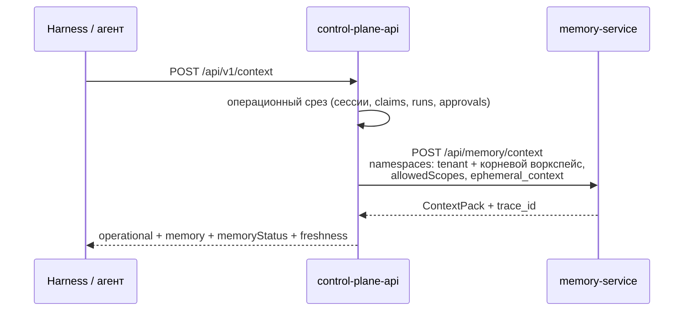

# Поиск и сборка контекста

Статья описывает, как memory-service находит релевантные знания и собирает из них
контекст: гибридный поиск (вектор + полнотекстовый + граф), слияние RRF, реранкинг
через LLM, синтез ответа, источники, Context Compiler (`/api/memory/context`) и
типизированный обход. Она для интеграторов, которые строят на памяти ответы ботов и
контекст агентов, и для тех, кто настраивает качество поиска.

## Режимы чтения

| Маршрут | Что возвращает | LLM | Когда использовать |
|---|---|---|---|
| `POST /api/brain/query` | Фрагменты, соседи по графу, источники, готовый текст контекста; опционально ответ LLM | Только при `synthesize: true` | Вопрос → ответ с цитатами |
| `POST /api/brain/recall` | То же, объём задан бюджетом `low`/`mid`/`high` | Нет | Realtime-путь, суфлёр, подсказки оператору |
| `POST /api/brain/search` | Семантический top-k или структурный список узлов | Нет | Точечный поиск, фильтры по тегам |
| `GET /api/brain/sources/{key}` | Оригинал документа целиком с provenance | Нет | Карточка «откуда взято» |
| `POST /api/memory/context` | `ContextPack`: секции, источники, бюджет, трейс | Нет | Контекст для агента или harness |
| `POST /api/memory/context/typed` | Обход по типизированным связям на момент `as_of` | Нет | Контекст задачи по доменной модели |

## Гибридный поиск `/api/brain/*`

`query`, `recall` и семантический `search` используют один конвейер:

```mermaid
flowchart TD
    Q[Вопрос] --> E[Эмбеддинг вопроса]
    E --> V[Векторный поиск<br/>косинус, HNSW]
    Q --> F[Полнотекстовый поиск<br/>русская конфигурация]
    V --> R[RRF-слияние<br/>score = Σ 1/(60 + rank + 1)]
    F --> R
    R --> N[Соседи по графу<br/>hops 1–2, до 40 узлов]
    N --> RR{Реранк включён?}
    RR -- нет --> TOP[top-k по RRF]
    RR -- да --> POOL[Пул: вектор-хиты ∪ соседи с текстом]
    POOL --> LLM[LLM-оценка 0–100 → rerank_score 0..1]
    LLM --> TOP2[top-k по rerank_score]
    TOP --> S[Источники + текст контекста]
    TOP2 --> S
    S --> SYN{synthesize?}
    SYN -- да --> ANS[Ответ LLM с цитатами]
```

### Каналы и слияние

1. **Векторный канал.** Вопрос векторизуется той же моделью, что и фрагменты;
   поиск идёт по косинусному расстоянию (HNSW-индекс pgvector). `score` фрагмента в
   этом канале — `1 - cosine_distance`.
2. **Полнотекстовый канал.** Документ фрагмента — `title + heading + text` в
   русской конфигурации PostgreSQL; запрос — OR по стеммированным лексемам вопроса
   (стоп-слова отбрасываются); ранжирование — `ts_rank`.
3. **Пул кандидатов.** Каждый канал возвращает `max(20, k × max(2, число namespaces))`
   кандидатов: фильтры (namespace, `meta`, видимость) применяются поверх HNSW, поэтому
   пул расширен.
4. **Reciprocal Rank Fusion.** Итоговый `score` фрагмента — сумма `1 / (60 + rank + 1)`
   по каналам, где он найден. Берутся top-k.
5. **Граф.** От узлов найденных фрагментов движок берёт соседей на `hops` шагов
   (1–2, не более 40 узлов) — строго внутри запрошенных namespaces. Соседи идут в
   `neighbors`, в источники и в текст контекста.

Все фильтры — реальные `WHERE`-предикаты: фрагменты другого namespace или вне
видимости principal в выдачу не попадают даже как кандидаты.

!!! warning "`score` — это не уверенность"
    RRF-score мал по природе: максимум около `2/61 ≈ 0.033` (фрагмент первый в обоих
    каналах). Он годится только для порядка. **Не стройте порог уверенности по
    `score`** — используйте `rerank_score` (0..1), который появляется, когда включён
    реранкинг.

### Реранкинг через LLM

При `CB_RERANK_ENABLED=true` кандидаты переоцениваются моделью:

| Шаг | Как |
|---|---|
| Вектор-кандидатов | `min(CB_RERANK_POOL, 12)` — меньше, чтобы освободить место соседям |
| Пул | Вектор-хиты ∪ соседи по графу с текстом (`content` или заголовок), дедуп по `node_key`, не больше `max(CB_RERANK_POOL, k)` |
| Вызов | Один запрос chat completions на весь пул; от каждого кандидата — первые 600 символов (`title — heading` + текст) |
| Оценка | Модель возвращает JSON `{"0": 91, "1": 37, …}` по шкале 0–100; `rerank_score = оценка / 100` |
| Модель | `CB_RERANK_MODEL`, по умолчанию `CB_LLM_MODEL`; `temperature=0`, таймаут 12 с |
| Итог | Сортировка по `rerank_score`, top-k |

**Реранк никогда не роняет поиск.** Если LLM недоступен (`CB_LLM_PROVIDER=echo` или
пустой ключ), вызов упал, превысил таймаут или вернул неполный JSON — возвращается
исходный порядок RRF, а `rerank_score` остаётся `null`.

!!! tip "Как выбрать порог уверенности"
    Показывать пользователю только уверенные ответы можно по `rerank_score` первого
    хита: например, скрывать подсказку при значении ниже 0.3. Подбирайте порог на
    своих контрольных вопросах: у разных моделей шкала разная.

Реранк добавляет к запросу один вызов LLM. Для realtime-сценариев выбирайте быструю
модель или оставляйте реранк выключенным и опирайтесь на порядок RRF.

### Синтез ответа

`POST /api/brain/query` с `"synthesize": true` (или `CB_QUERY_SYNTHESIZE_DEFAULT=true`,
если поле не передано) отправляет найденный контекст в LLM с системной инструкцией:
отвечать только по контексту, не выдумывать, при отсутствии данных честно сказать об
этом и перечислить использованные источники. Параметры вызова: `temperature=0.1`,
таймаут 25 с. Если ничего не найдено, LLM не вызывается и возвращается фиксированный
ответ «В графе знаний нет данных по этому вопросу».

С `CB_LLM_PROVIDER=echo` вместо ответа возвращается сам контекст с пометкой режима
echo. Если ответ генерирует ваша модель, вызывайте `synthesize: false` и используйте
поле `context`.

### Текст контекста

Поле `context` — готовый к вставке в промпт текст:

```text
# Найденные фрагменты

## [<node_key>] <title> — <heading>
Источник: <source_path>

<text фрагмента>

# Связанные сущности (граф, соседи)
- [<natural_key>] (<type>) <title> status=… — <source_path>
```

Тело каждого фрагмента перед склейкой проходит нейтрализацию prompt-injection:
контент писем, транскриптов и записей агентов считается недоверенным.

### Источники

`sources` — дедуплицированный по `node_key` список `{source_path, node_key, title}`:
сначала узлы найденных фрагментов, затем соседи. По `node_key` источник открывается
целиком:

```bash
curl "$MEMORY_URL/api/brain/sources/https://kb.example.com/articles/guest-pass?namespace=support" \
  -H "Authorization: Bearer $TOKEN"
```

Ответ содержит `content` (оригинал или склейка фрагментов), `content_source`
(`original` | `chunks`), число фрагментов, `provenance` и признаки ПДн. Узел ищется
строго в указанном namespace: статья другой базы знаний даёт `404`.

## Пример: вопрос → ответ с цитатами

```bash
curl -X POST "$MEMORY_URL/api/brain/query" \
  -H "Authorization: Bearer $TOKEN" -H "Content-Type: application/json" \
  -d '{"question": "Как оформить гостевой пропуск?", "k": 8, "hops": 1,
       "synthesize": false, "scope": {"namespace": "support"}}'
```

```json
{
  "question": "Как оформить гостевой пропуск?",
  "scope": {"namespace": "support"},
  "synthesized": false,
  "hits": [
    {"chunk_id": 128, "node_key": "https://kb.example.com/articles/guest-pass",
     "source_path": "kb.example.com", "title": "Гостевой пропуск", "heading": "",
     "text": "Как оформить пропуск для гостя…", "score": 0.0325,
     "namespace": "support", "meta": {}, "rerank_score": 0.91}
  ],
  "neighbors": [],
  "sources": [{"source_path": "kb.example.com",
               "node_key": "https://kb.example.com/articles/guest-pass",
               "title": "Гостевой пропуск"}],
  "context": "# Найденные фрагменты\n\n## [https://kb.example.com/…"
}
```

## Recall и search

**`POST /api/brain/recall`** — то же чтение, но размер задаётся бюджетом:

| `budget` | k фрагментов |
|---|---|
| `low` | 4 |
| `mid` (по умолчанию) | 8 |
| `high` | 16 |

Ответ: `memories[]` (`node_key`, `title`, `heading`, `source_path`, `text`,
`namespace`), `sources`, `neighbors`, `context`, `count`.

**`POST /api/brain/search`** работает в двух режимах:

- без `filters.type` — семантический top-k (`filters.limit`, по умолчанию 20) с
  необязательным `filters.meta` — фильтром по тегам фрагментов (`meta @> {...}`:
  фрагмент подходит, если содержит все указанные пары);
- с `filters.type` (и опционально `filters.status`) — структурный список узлов графа
  без векторного поиска.

```json
{"query": "лицензия", "filters": {"meta": {"collection": "licenses"}, "limit": 10},
 "scope": {"namespace": "support"}}
```

## Context Compiler: `POST /api/memory/context` {#context-compiler}

Главный маршрут чтения для агентов: возвращает структурированный `ContextPack` под
бюджет токенов **без** LLM-синтеза. Именно его вызывает Control Plane, когда собирает
контекст задачи (`POST /api/v1/context` ядра).

```json
{
  "query": "Продолжить разбор падения деплоя",
  "scopes": ["project:alpha"],
  "anchors": ["person:alice"],
  "ephemeral_context": {"current_state": "deploy failed on step 3"},
  "budget": {"tokens": 12000},
  "strategy": "hybrid",
  "as_of": "",
  "k": 8,
  "scope": {"namespaces": ["support", "shared"]}
}
```

| Поле | По умолчанию | Смысл |
|---|---|---|
| `query` | `""` | Текст запроса |
| `scopes` | `[]` | Scopes релевантности `type:id` (до 10): элементы с пересечением **плюс** элементы без scopes |
| `anchors` | `[]` | Сущности-якоря для обхода графа и фактов |
| `subject` | — | `{type, id}` — за кого собирается контекст |
| `ephemeral_context` | `{}` | Текущее состояние вызывающего: попадает в секцию `current`, **не сохраняется** |
| `budget.tokens` / `max_tokens` | `CB_CONTEXT_DEFAULT_MAX_TOKENS` (8000) | Бюджет пака |
| `strategy` | `hybrid` | Набор каналов (см. ниже) |
| `as_of` | сейчас | Исторический срез фактов (ISO-8601) |
| `k` | 8 | Целевой размер каждого канала |

### Каналы и стратегии

| Канал | Что находит | Вес в RRF |
|---|---|---|
| `lexical` | Точные идентификаторы (UUID, SHA, коды ошибок, имена файлов) через триграммы + русский FTS | 1.0 |
| `vector` | Фрагменты по эмбеддингу | 1.0 |
| `facts` | Temporal-факты вокруг якорей на `as_of`; конфликты помечаются | 1.0 |
| `graph` | Соседи якорей и топ-хитов (глубина ≤ `CB_CONTEXT_MAX_DEPTH`, узлов ≤ `CB_CONTEXT_MAX_NODES`, рёбер ≤ `CB_CONTEXT_MAX_EDGES`) | 0.7 |
| `recent` | Свежие наблюдения по scopes | 0.6 |

| `strategy` | Каналы |
|---|---|
| `hybrid` (по умолчанию), `context` | все пять |
| `semantic` | `vector` |
| `exact` | `lexical` |
| `graph` | `graph`, `facts` |
| `briefing` | `graph`, `facts`, `recent` — стоячий контекст без `query` |

### Скоринг

Базис — взвешенный RRF: `Σ weight_канала / (60 + rank + 1)`. Поверх — аддитивные
бонусы, которые решают ничьи:

| Сигнал | Бонус |
|---|---|
| Точное совпадение идентификатора из запроса | +0.010 |
| Элемент в явно запрошенном scope | +0.004 |
| Действующий факт (интервал не закрыт) | +0.003 |
| Сила свидетельства | +0.002 за ранг (`asserted` = 3 → +0.006) |
| Свежесть (экспоненциальный спад, полупериод 14 дней) | до +0.005 |

Все слагаемые возвращаются в `signals` каждого элемента — выдача объяснима.

### Бюджет и секции

Размер элемента оценивается как `len(text) / CB_CONTEXT_CHARS_PER_TOKEN` (по
умолчанию 3.0 — консервативно для кириллицы). Секция `current` включается первой,
остальные элементы отбираются жадно по score; что не влезло, попадает в
`budget.dropped` с причиной.

Порядок секций: `current` → `relevant_facts` → `episodes` → `documents` →
`related_entities` → `recent_observations`.

```json
{
  "query": "…",
  "sections": [
    {"kind": "current", "items": [...]},
    {"kind": "relevant_facts", "items": [...]},
    {"kind": "documents", "items": [...]}
  ],
  "sources": [{"source_path": "…", "node_key": "…", "title": "…"}],
  "token_estimate": 9341,
  "budget": {"max_tokens": 12000, "dropped": [...], "truncated": false},
  "conflicts": ["fact-…"],
  "trace_id": "ctx-…"
}
```

Элемент секции несёт `kind`, `id`, `text`, `title`, `source_path`, `score`,
`signals`, `token_estimate` и `provenance` (цепочку до наблюдения или документа). Конфликтующие версии
фактов помечены `"conflict": true`, обе остаются в выдаче.

### Трейс компиляции

`GET /api/memory/context/trace/{trace_id}?namespace=…` возвращает, что происходило
при сборке: каналы и их счётчики, веса, ranking- и budget-решения. По нему
восстанавливается, почему в контекст попал (или не попал) конкретный элемент.
`ephemeral_context` в трейс не сохраняется — только его размер.

## Типизированный обход: `POST /api/memory/context/typed` {#typed}

Второй режим компилятора для контекста задачи в доменной модели: вместо ранжирования
кандидатов — детерминированный обход по связям доменных пакетов.

```json
{
  "anchors": [{"kind": "endpoint", "value": "GET /api/v1/runs/{}/checkpoints"}],
  "traverse": [
    {"relation": "calls", "direction": "in", "depth": 1, "limit": 50}
  ],
  "as_of": "2026-09-05T00:00:00Z",
  "allow_semantic": false,
  "scope": {"namespaces": ["tenant:<tenant-id>:ws:<workspace-id>"]}
}
```

- Якорь разрешается по порядку: точный ключ сущности → псевдоним ключа (`aliases`
  пакета) → идентификатор, извлечённый из `value` шаблонами `idPatterns`. Векторный
  поиск — только при `"allow_semantic": true`, такие якоря помечаются
  `"evidence": "inferred"`.
- Шаг обхода: `relation`, `direction` (`in` | `out` | `both`), `depth` 1..5, `limit`
  1..200 новых сущностей на шаг, `from` — `anchors` (по умолчанию) или `previous`.
- Проходятся только факты, валидные на `as_of` (по умолчанию — сейчас): закрытые
  связи не проходятся; атрибуты сущности берутся из версии, действовавшей на `as_of`.

Ответ: `anchors` (как разрешён каждый якорь), `unresolved`, `sections` по видам
сущностей, `facts`, `used` (полный список сущностей, фактов и снимков — для evidence
в вашей системе), `sources`, `trace_id`. Права, видимость и маскирование ПДн — как у
`POST /api/memory/context`.

## Как контекст собирает Control Plane



- Harness не выбирает namespace сам: его вычисляет ядро после проверки principal,
  воркспейса, задачи и прогона.
- Операционное состояние ядра передаётся в `ephemeral_context` и не сохраняется в
  памяти.
- Недоступность памяти не блокирует работу: ядро возвращает операционный контекст и
  `memoryStatus` `unavailable` или `timeout` вместо ошибки.

Подробнее — в [Контексте Control Plane](../control-plane/context.md).

## Производительность поиска

| Фактор | Влияние | Что делать |
|---|---|---|
| Эмбеддинг вопроса | Первый вызов конвейера, до обращения к БД | Держите `CB_EMBEDDING_TIMEOUT` разумным: зависший провайдер иначе держит воркер |
| Реранк | +1 вызов LLM (таймаут 12 с) | Быстрая модель или реранк выключен для realtime |
| Синтез | +1 вызов LLM (таймаут 25 с) | `synthesize: false` и своя модель |
| Обход графа | SQL по таблицам графа, по одному хопу за запрос, по индексам рёбер | JIT PostgreSQL выключен по умолчанию (`CB_DB_JIT=false`); не включайте без замера |
| Число namespaces в запросе | Расширяет пул кандидатов | Читайте только нужные базы |

Подробнее об эксплуатационных настройках — в [Конфигурации](configuration.md#performance).

## См. также

- [Загрузка знаний](ingestion.md)
- [Namespaces и доступ](namespaces.md)
- [API](api.md)
- [Конфигурация](configuration.md)
- [Контекст Control Plane](../control-plane/context.md)
