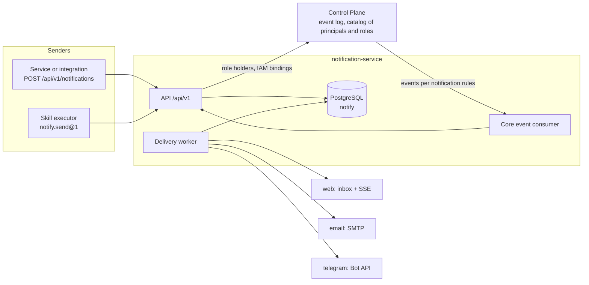
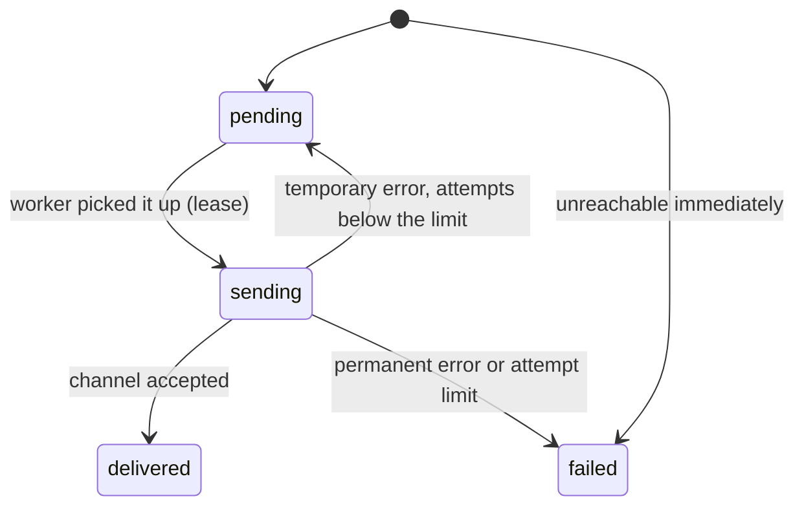

# Notifications

The notification service `notification-service` delivers platform messages to people: a
request to make a decision, the result of a task verification, a notification sent by a
package or an external service. The article describes how the service works, how to send a
notification through the API and the `notify.send@1` skill, how channels are chosen, and how
the web inbox, the delivery log, and automatic decision notifications work. It is for package
and integration developers and for installation operators. The Telegram channel is described
separately, in the [Telegram](telegram.md) article.

## What the service does

- **Accepts notifications from any sender** — a service, a skill, the core — with a
  deduplication key. The sender names the recipient and the content, but not the channels.
- **Addresses people through Control Plane.** The recipient is a core principal, a role in a
  workspace (all its holders), or a linked messenger group. The service reads who holds the
  role and which IAM identity a principal has from the core with its service account.
- **Chooses channels** based on the recipient's preferences and the organization's mandatory
  rules: the web inbox (`web`), `email`, `telegram`.
- **Keeps a delivery log** — a record for every "recipient × channel" pair with retries and
  failure reasons.
- **Turns core events into notifications according to rules.** Which events reach whom and
  with what text is described by `NotificationRule` notification rules — package data, not
  service code (see [Notification rules](notification-rules.md)). The `notify` package
  provides a decision request with buttons and notifications about failed acceptance
  verification.

The service is domain-neutral: the sender sets the type, title, text, and links. Rationale:
TAI-ADR-0048 (service and channels), TAI-ADR-0049 (event model), TAI-ADR-0050 (channel as a
login method).



There is one process: the HTTP API, the background delivery worker, and the core event
consumer run inside one container with one database.

## Deployment

The service belongs to the `notify` compose profile: the containers `notification-db`
(PostgreSQL 16, database `notify`) and `notification-service`. At startup the container runs
`alembic upgrade head` and then starts the service on port 8000.

```bash
tools/compose --profile core --profile edge --profile notify up -d
```

| What | Value |
|---|---|
| Port in the compose network | `notification-service:8000` |
| Port on the host | `127.0.0.1:${NOTIFY_HOST_PORT:-18045}` |
| Edge route | `/notify/*` (the prefix is stripped), see [Edge and TLS](../operations/edge-and-tls.md) |
| Health | `GET /healthz` → `{"status": "ok"}` |
| API schema | `GET /openapi.json`, `GET /docs` |
| DB password | `NOTIFY_POSTGRES_PASSWORD` in `.env` (generated by `make secrets`) |
| Service account | `secrets/notification-iam.env` (written by bootstrap) |
| Telegram bot | `secrets/notification-telegram.env` (filled in by the operator) |

### Bootstrap

Step `5c` of the `deploy/bootstrap.py` script prepares the service's identity (details:
[Bootstrap](../getting-started/bootstrap.md)):

1. creates a principal of kind `service`, "Taimen Notification Service", in Control Plane;
2. issues an IAM service account with the audiences `control-plane` and `iam` and the
   ceiling `control-plane:read`, `iam:channel-links`, and writes `NS_SERVICE_CLIENT_ID` and
   `NS_SERVICE_CLIENT_SECRET` to `secrets/notification-iam.env`;
3. creates a binding with the permissions `events.read`, `approvals.read`, `tasks.read`,
   `principals.read`, `workspaces.read`.

Bootstrap also registers the `notification-service` audience with the scopes
`notifications:send`, `notifications:read`, `notifications:admin`, the `iam` audience with
the scope `iam:channel-links`, and adds `control-plane:decide` to the scopes of the
`control-plane` audience.

`env_file` is read when the container is created, so after the first bootstrap you need to
recreate the service:

```bash
tools/compose --profile notify up -d notification-service
```

### What works without configuration

| Not configured | Behavior |
|---|---|
| IAM (`NS_IAM_ISSUER` and JWKS) | All `/api/v1` routes return `503` |
| Control Plane or service account | Sending to a principal or a role — `503 dependency_unavailable`; the event consumer does not start |
| Notification rules not applied | The event consumer does not start: there are no notifications from core events |
| `NS_TELEGRAM_BOT_TOKEN` | There is no `telegram` channel; the webhook returns `404` |
| `NS_EMAIL_MODE=disabled` | There is no `email` channel |

## Authentication and scopes

The service is a resource server for exactly one audience, `notification-service`
(`NS_AUDIENCE`). Tokens are verified by `platform-auth-sdk` against the IAM JWKS. The scope
determines the caller's role:

| Scope | Who | What it opens |
|---|---|---|
| `notifications:send` | Services, the skill executor | `POST /api/v1/notifications`, `POST /api/v1/skills/notify.send`, reading your own sent notifications |
| `notifications:read` | A human | Your own inbox, the SSE stream, your own preferences |
| `notifications:admin` | Organization administrator, package installer | Mandatory rules, channel groups, notification rules (`/notification-rules`), reading any notification of the tenant |

You obtain the token with a regular PAT or client credentials exchange in IAM with
`audience: notification-service` and an explicit list of scopes — see
[Tokens, audiences, scopes](../iam/tokens.md). Errors come in the envelope
`{"error": {"code", "message", "details"}}`, as in Control Plane.

## Sending a notification

```bash
curl -s -X POST "$NS/api/v1/notifications" \
  -H "Authorization: Bearer $TOKEN" \
  -H "Content-Type: application/json" \
  -H "Idempotency-Key: invoice-42-approved" \
  -d '{
    "recipient": {"kind": "role", "id": "<role-id>", "workspaceId": "<workspace-id>"},
    "type": "invoice.payment_approved",
    "title": "Payment approved: invoice 42",
    "body": "The finance director approved the payment.",
    "links": [{"label": "Open task", "url": "https://platform.example.com/tasks/42"}]
  }'
```

Here `$NS` is the service address: `http://notification-service:8000` inside the compose
network or `https://platform.example.com/notify` through the edge.

### Request fields

| Field | Required | Constraints | Meaning |
|---|---|---|---|
| `recipient.kind` | yes | `principal`, `role`, `group` | Whom we address |
| `recipient.id` | yes | UUID | A core principal, a core role, or a channel group |
| `recipient.workspaceId` | for `role` | UUID | The workspace in which role holders are looked up |
| `type` | yes | 1–200 characters, a dot-separated name (`invoice.payment_approved`) | Notification type: preferences and mandatory rules work by it |
| `title` | yes | 1–200 characters, one line | Title |
| `body` | no | up to 4000 characters | Text, without control characters |
| `links` | no | up to 10; `label` 1–100, `url` — http(s) | Links |
| `actions` | no | up to 5; `id` `^[A-Za-z0-9_.:-]+$` up to 64, `label` up to 64, `data` — an object | Actions a channel can show as buttons |
| `Idempotency-Key` (header) | yes | 1–200 characters | Deduplication key |

Unknown fields are rejected (`422 validation_error`).

### Recipients

| `kind` | Who receives it |
|---|---|
| `principal` | A human. The service finds the principal's IAM identity — an active binding in the sender's IAM tenant — and delivers over that identity's channels |
| `role` | All active holders of the role to whom it is assigned at the tenant level or on this workspace or its ancestor (the core's `GET /roles/{id}/principals?workspaceId=`), and all messenger groups linked to this workspace and role |
| `group` | One linked messenger group (an id from the workspace's group list, see [Telegram](telegram.md)) |

A principal without a binding in the sender's IAM tenant is known but unreachable: the log
shows a `web` delivery with status `failed` and the reason `recipient_has_no_identity`. A
binding from another tenant is not used — a notification does not cross the tenant
boundary.

### Response

`201 Created` — the notification is accepted, and the delivery log is already planned:

```json
{
  "id": "<notification-id>",
  "type": "invoice.payment_approved",
  "title": "Payment approved: invoice 42",
  "body": "The finance director approved the payment.",
  "links": [{"label": "Open task", "url": "https://platform.example.com/tasks/42"}],
  "actions": [],
  "actionsClosedAt": null,
  "actionsOutcome": null,
  "recipient": {"kind": "role", "id": "<role-id>", "workspaceId": "<workspace-id>"},
  "senderId": "<iam-principal-id>",
  "createdAt": "2026-01-15T10:00:00Z",
  "deliveries": [
    {"id": "…", "channel": "web", "recipientKind": "principal", "recipientId": "<principal-id>",
     "mandatory": false, "status": "pending", "attempts": 0,
     "nextAttemptAt": "2026-01-15T10:00:00Z", "lastError": null, "deliveredAt": null},
    {"id": "…", "channel": "telegram", "recipientKind": "principal", "recipientId": "<principal-id>",
     "mandatory": false, "status": "pending", "attempts": 0,
     "nextAttemptAt": "2026-01-15T10:00:00Z", "lastError": null, "deliveredAt": null}
  ]
}
```

Delivery is asynchronous; `GET /api/v1/notifications/{id}` returns the current state of the
log — to the sender (`notifications:send`) or an administrator (`notifications:admin`).
Someone else's notification is indistinguishable from a nonexistent one (`404`).

### Deduplication

The `Idempotency-Key` is unique within the "tenant × sender" pair. The service stores a hash
of the canonical request body together with the notification:

| Repeat | Response |
|---|---|
| Same key, same body | `200` and the first notification with its log; no second delivery |
| Same key, different body | `409 idempotency_conflict` |
| Two concurrent requests with one key | One creates, the other receives a repeat of the first |

Derive the key from the domain event (`invoice-42-approved`, `<event-id>`) rather than
choosing a random one: then a retry after a network failure is safe.

### Sending errors

| Code | HTTP | Reason |
|---|---|---|
| `validation_error` | 422 | The body fails the schema (a role without `workspaceId`, a multi-line `title`, control characters) |
| `unknown_recipient` | 422 | The core does not know the principal or role; the group is not found or unlinked |
| `idempotency_conflict` | 409 | The key was already used with a different body |
| `dependency_unavailable` | 503 | Control Plane did not answer or is not configured |
| `insufficient_scope` and other `platform-auth-sdk` codes | 401/403 | A token of the wrong audience or without `notifications:send` |

## Channel selection

The channels available on an installation are `web` always, `email` if `NS_EMAIL_MODE` is not
`disabled`, and `telegram` if a bot token is set. For each human recipient, the service goes
through them by a fixed rule:

1. **An organization's mandatory rule** selects the channel regardless of what the recipient
   chose and ignores quiet hours.
2. Otherwise **the most specific matching recipient preference** decides: an exact type is
   more specific than the prefix `invoice.*`, a long prefix is more specific than a short one,
   `*` is the most general. If there are no preferences, the channel is **on**: opting out is
   the recipient's move.
3. A channel is selected only if the recipient is **reachable** on it: `email` and `telegram`
   need a saved and not disabled address. A mandatory channel without an address still goes
   into the log — with status `failed` and the reason `recipient_unreachable`, so that it is
   visible that the required delivery did not happen.
4. **Quiet hours** postpone push channels (`email`, `telegram`) until the end of the window.
   The inbox does not interrupt anyone and is not delayed by quiet hours.

| Channel | Push | Address | Where the address comes from |
|---|---|---|---|
| `web` | no | not needed — the IAM identity | The person's inbox |
| `email` | yes | e-mail | The `email` field in the recipient's preferences |
| `telegram` | yes | private chat id | Account linking with a code, see [Telegram](telegram.md) |

Messenger groups receive a notification without channel selection: a group has one channel,
and people's preferences do not apply to it.

### Recipient preferences

A person reads and changes their preferences with a token that has the `notifications:read`
scope:

```bash
curl -s "$NS/api/v1/me/notification-preferences" -H "Authorization: Bearer $TOKEN"
```

```json
{
  "channels": ["web", "email", "telegram"],
  "preferences": [{"type": "invoice.*", "channel": "email", "enabled": false}],
  "quietHours": {"start": "22:00", "end": "08:00", "timezone": "Europe/Moscow"},
  "addresses": [
    {"channel": "email", "address": "alice@example.com", "disabledAt": null, "disabledReason": null},
    {"channel": "telegram", "address": "<chat-id>", "disabledAt": null, "disabledReason": null}
  ],
  "mandatory": [
    {"id": "…", "type": "approval.requested", "channel": "telegram",
     "createdBy": "<iam-principal-id>", "createdAt": "…"}
  ]
}
```

`PATCH` changes only the fields passed:

```bash
curl -s -X PATCH "$NS/api/v1/me/notification-preferences" \
  -H "Authorization: Bearer $TOKEN" -H "Content-Type: application/json" \
  -d '{
    "preferences": [
      {"type": "invoice.*", "channel": "email", "enabled": false},
      {"type": "*", "channel": "telegram", "enabled": null}
    ],
    "quietHours": {"start": "22:00", "end": "08:00", "timezone": "Europe/Moscow"},
    "email": "alice@example.com"
  }'
```

| Field | Meaning |
|---|---|
| `preferences[].type` | A type, a prefix `prefix.*`, or `*` |
| `preferences[].channel` | A channel configured on the installation; otherwise `422 unknown_channel` |
| `preferences[].enabled` | `true`/`false`; `null` deletes the preference (back to "on") |
| `quietHours` | `start`, `end` (time), `timezone` (IANA zone name); `null` removes quiet hours. The window can cross midnight (`22:00`–`08:00`); `start` = `end` means no window |
| `email` | Address of the `email` channel; `null` deletes it. Setting the same address again re-enables an address disabled after a mail server rejection |

### Organization mandatory rules

An administrator (`notifications:admin`) makes delivery over a channel mandatory for a type
or a prefix — for example, so that decision requests always go to Telegram:

```bash
curl -s -X POST "$NS/api/v1/mandatory-rules" \
  -H "Authorization: Bearer $ADMIN_TOKEN" -H "Content-Type: application/json" \
  -d '{"type": "approval.requested", "channel": "telegram"}'

curl -s "$NS/api/v1/mandatory-rules" -H "Authorization: Bearer $ADMIN_TOKEN"
curl -s -X DELETE "$NS/api/v1/mandatory-rules/<rule-id>" -H "Authorization: Bearer $ADMIN_TOKEN"
```

Repeating the same rule returns the existing one (`200` instead of `201`). Rules apply to the
whole tenant and are visible to every person in the `mandatory` field of their preferences.

## Web inbox

The `web` channel puts a notification into the recipient's inbox. Every entry has a sequence
number `seq` that grows within one person's inbox.

```bash
# The last 50, newest first
curl -s "$NS/api/v1/me/notifications?limit=50" -H "Authorization: Bearer $TOKEN"

# Unread only, next page
curl -s "$NS/api/v1/me/notifications?unreadOnly=true&cursor=<nextCursor>" \
  -H "Authorization: Bearer $TOKEN"
```

```json
{
  "items": [
    {"id": "<item-id>", "seq": 17, "notificationId": "…", "type": "approval.requested",
     "title": "Decision needed: …", "body": "…", "links": [],
     "actions": [{"id": "approve", "label": "Approve", "data": {"kind": "approval.decide", "…": "…"}}],
     "actionsClosedAt": null, "actionsOutcome": null,
     "senderId": "…", "createdAt": "…", "readAt": null}
  ],
  "unreadCount": 3,
  "nextCursor": "17"
}
```

| Request | Meaning |
|---|---|
| `GET /api/v1/me/notifications` | An inbox page: `unreadOnly`, `limit` (1–200, default 50), `cursor` |
| `POST /api/v1/me/notifications/{itemId}:read` | Mark as read |
| `POST /api/v1/me/notifications:read-all` | Mark everything → `{"marked": N}` |
| `GET /api/v1/me/notifications/stream` | SSE stream |

When a notification's actions stop being valid (the decision has already been made),
`actionsClosedAt` and `actionsOutcome` (for example, `{"status": "approved", "by": "…",
"channel": "telegram"}`) arrive in the same entry.

### SSE stream

```bash
curl -N "$NS/api/v1/me/notifications/stream" \
  -H "Authorization: Bearer $TOKEN" -H "Last-Event-ID: 17"
```

```text
retry: 3000

id: 18
event: notification
data: {"id":"…","seq":18,"notificationId":"…","type":"…","title":"…",…}

: keep-alive
```

- The event `id` is the entry's `seq`. A browser `EventSource` sends the last `id` in the
  `Last-Event-ID` header on reconnect and receives everything that arrived during the break.
  A client that opens the stream anew can pass the same value in the `?lastEventId=`
  parameter.
- Without `Last-Event-ID` the stream starts at the current end of the inbox: read the history
  through `GET /me/notifications`.
- Every `NS_INBOX_KEEPALIVE_SECONDS` (15 s) an idle stream sends the comment `: keep-alive`,
  and every `NS_INBOX_POLL_SECONDS` (5 s) it checks the database — so deliveries made by
  another process also get through.
- The stream **closes when the token it was opened with expires**. The client reconnects with
  a fresh token and `Last-Event-ID` and loses nothing.
- A non-numeric `Last-Event-ID` gives `422 invalid_last_event_id`.

!!! note "A proxy in front of the stream"
    The response is sent with `Cache-Control: no-cache` and `X-Accel-Buffering: no`. If you
    have your own proxy in front of the service, turn off buffering in it for
    `…/me/notifications/stream`.

## Delivery log and retries

Every "recipient × channel" pair is a separate delivery with its own status:



- The worker takes deliveries whose time has come in a batch (`FOR UPDATE SKIP LOCKED`) and
  under a lease of `NS_WORKER_LEASE_SECONDS` (120 s). The result is written with an attempt
  number check: if the lease expired and another worker took the delivery, the first worker's
  late result is discarded.
- **Temporary errors** (timeout, Bot API 429 and 5xx, temporary SMTP codes) are retried with
  an exponential pause: `NS_DELIVERY_BACKOFF_SECONDS` × 2ⁿ⁻¹, no more than
  `NS_DELIVERY_BACKOFF_MAX_SECONDS` (by default 5 s, 10 s, 20 s … up to an hour), up to
  `NS_DELIVERY_MAX_ATTEMPTS` (8) attempts in total. After they are exhausted — `failed` with
  the reason `retries_exhausted: …`.
- **Permanent errors** end the delivery immediately. If the address itself was refused (the
  bot is blocked, the mailbox is rejected with a 5xx code), the address is **disabled**: the
  channel is no longer selected for this person until the address is set again.
- Deliveries for one recipient over one channel go out one at a time in creation order — the
  chat and the inbox show them in the order they were sent. Different recipients are served
  in parallel, and a failure of one channel does not delay the others.
- If the notification's actions were closed before a postponed delivery (quiet hours, a
  retry), the message goes out without buttons.

| `lastError` | Meaning |
|---|---|
| `recipient_has_no_identity` | The principal has no IAM binding in the sender's tenant |
| `recipient_unreachable` | There is no channel address, or the address is disabled |
| `channel_not_configured` | The group's channel is not configured on the installation |
| `send_timeout` | The channel did not answer within half of the lease |
| `telegram_…`, `smtp_…` | The channel's response; see [Telegram](telegram.md#troubleshooting) |
| `retries_exhausted: <reason>` | A temporary error was retried up to the limit |

## The `notify.send@1` skill {#notify-send}


Packages send notifications not over direct HTTP but with a skill: it can be called from an
approval outcome, a work rule, or a process step — in any domain. The skill contract is
published in the core catalog by a catalog package, and the skill executor daemon executes
it over the `http` protocol.

| Contract parameter | Value |
|---|---|
| Name and version | `notify.send`, `1` |
| `sideEffects` / `riskLevel` | `external_write` / `low` |
| Endpoint | `${NOTIFICATION_SERVICE_URL}/api/v1/skills/notify.send` |
| Token | audience `notification-service`, scope `notifications:send` |
| `idempotency` | `required` |
| `timeoutSeconds` / `retryPolicy` | 30 / 3 attempts with a 10 s pause |

**Inputs** are the same fields as in `POST /api/v1/notifications`, **without `actions`**:
`recipient`, `type`, `title`, `body`, `links`. Only the core itself places decision buttons,
through events; a package cannot forge them.

**Outputs**:

```json
{
  "notificationId": "<notification-id>",
  "deliveries": [{"channel": "web", "status": "pending"}, {"channel": "telegram", "status": "pending"}]
}
```

The call's idempotency key — the same on all attempts — becomes the notification's
deduplication key (`skill:<idempotencyKey>`; a key that is too long is hashed). Repeating the
call does not create a second notification. Errors come in the skill-sdk format
`{"error": {"code", "message", "retryable", "details"}}`: 5xx are marked `retryable: true`,
4xx — `false` (for example, `invalid_inputs`, `unknown_recipient`).

### Example: notify a role after an approval

The task type declares the outcome of a gate decision: after approval, notify the holders of
a role in the task's workspace and leave a comment about the result.

```yaml
apiVersion: taimen.ai/v1
kind: TaskType
key: payment-approval
spec:
  displayName: Pay invoice
  # lifecycleSchema omitted
  approvalSchema:
    gates:
      default:
        outcomes:
          approved:
            - invokeSkill:
                skill: notify.send@1
                inputs:
                  recipient:
                    kind: role
                    id: ${ACCOUNTING_ROLE_ID}
                    workspaceId: "$.task.workspaceId!"
                  type: invoice.payment_approved
                  title: "Payment approved: $.task.title|truncate:150"
                  body: "Payment approved ($.task.publicId). $.approval.comment"
                onSuccess:
                  - comment: {body: "Accounting has been notified of the payment approval."}
                onFailure:
                  - comment: {body: "Failed to notify accounting: $.invocation.error.code $.invocation.error.message"}
          rejected:
            - comment: {body: "Payment not approved: $.approval.comment"}
            - transition: {status: withdrawn}
```

- `${ACCOUNTING_ROLE_ID}` is substituted from the environment when the package is applied,
  `$.task.…` and `$.approval.…` come from the decision context, `$.invocation.…` from the
  result of the skill call (see [Approvals](../control-plane/approvals.md) and
  [Catalog packages](../control-plane/catalog-packages.md)).
- `onSuccess`/`onFailure` run after the call completes. If you need to close the task or
  change its status based on the notification result, do it there.

- The example shows a decision outcome on a task type. Where the work path is longer than one
  decision, the notification is a process step (`call: {skill: notify.send@1}`), for example:
  verification, approval by an amount threshold, notifying accounting, and payment.

### What the skill executor needs

The skill is executed by a daemon with the `skills.execute` permission (see
[Runner configuration](../runner/configuration.md)). For `notify.send@1` it needs:

| Setting | Value |
|---|---|
| `NOTIFICATION_SERVICE_URL` | When applying the `notify` package: a service address reachable by the executor (for example, `https://platform.example.com/notify`) |
| `CONTROL_PLANE_SKILLS_PROTOCOLS` | includes `http` |
| `CONTROL_PLANE_SKILLS_HTTP_ALLOWED_ORIGINS` | the notification service origin |
| `CONTROL_PLANE_SKILLS_PRIVATE_HOSTS` | the service host, if it resolves to an internal address |
| `CONTROL_PLANE_SKILLS_ALLOWED_AUDIENCES` | `notification-service` |
| Executor PAT ceiling | includes the `notification-service` audience and the `notifications:send` scope |

## Notifications from core events {#core-events}

The core event consumer runs inside the service if both IAM and Control Plane are configured,
`NS_EVENTS_ENABLED=true`, and the tenant has at least one enabled notification rule. It reads
the log through the `control_plane_client.events` SDK (see
[Event subscriptions](../control-plane/event-subscriptions.md)) with a filter — the union of
the types from the rules (`on.type` and `close.on`), stores the cursor and processed-event
marks in its own database, and sends ordinary notifications on behalf of its service
account.

What exactly happens on an event — to whom, with what text, links, and buttons, which events
close the buttons — is set by the rules, not by the service code. Their specification, API,
and application by a package are in the [Notification rules](notification-rules.md) article.
The `notify` package provides the default behavior:

| Event | What happens |
|---|---|
| `approval.requested` | A notification to the assigned principal (`assignedPrincipalId`) or to holders of the `requiredRoleId` role in the approval's workspace: "Decision needed: <task>", who is requesting, the comment, "Approve" / "Reject" buttons (`data.kind = approval.decide`) |
| `approval.approved`, `approval.rejected`, `approval.cancelled` | The buttons of that notification are closed with the outcome: who decided, through which channel, when. Telegram messages are edited and lose their buttons |
| `task.verification_failed` | A notification to the task owner (otherwise the executor): which verification failed and why, whether the task went back to work or is waiting for a human |

- **Exactly one notification per event and rule.** The deduplication key is derived from the
  event by the rule's template (for the `notify` rules —
  `control-plane:approval:<approval-id>` and `control-plane:event:<event-id>`), so an event
  processed again after a failure reproduces the notification instead of creating a second
  one.
- **The first run** starts at the end of the log (`NS_EVENTS_START=latest`): a new
  installation does not send notifications about history. `earliest` processes the whole
  available log. The cursor is kept when the consumer restarts on a new set of rules.
- **Subtree.** `NS_EVENTS_WORKSPACE_ID` narrows reading to a workspace and its descendants;
  empty means the whole tenant (requires `events.read` on the tenant).
- **The task link** is part of the rule: for the `notify` rules it is
  `${TASK_URL_BASE}/<publicId>`, and the base is a package installation variable.
- If the core refused the subscription itself (no `events.read`, the credential was not
  accepted), the consumer stops with an error in the log, while the API and delivery keep
  working. After fixing the permissions, restart the service.

Decision buttons are executed by the Telegram channel — how a button press becomes a human
decision in the core is described in the [Telegram](telegram.md#decisions) article. In the web
inbox the actions arrive as data (`actions`), and the person makes the decision itself in the
workplace, through the MCP plugin, or through the approvals API.

## Configuration

All variables have the `NS_` prefix; the full list is in
[Environment variables](../reference/environment.md#notification-service). The main ones:

| Variable | Default | Purpose |
|---|---|---|
| `NS_DATABASE_URL` | local PostgreSQL | The service database; in the stack — `notification-db` |
| `NS_IAM_URL`, `NS_IAM_ISSUER`, `NS_IAM_JWKS_URL` | empty | IAM: client credentials exchange and token verification |
| `NS_CONTROL_PLANE_URL` | empty | Core: recipient catalog, events, decisions |
| `NS_SERVICE_CLIENT_ID`, `NS_SERVICE_CLIENT_SECRET` | empty | Service account (`secrets/notification-iam.env`) |
| `NS_EMAIL_MODE` | `log` | `smtp` — send, `log` — only write the message to the log, `disabled` — no channel |
| `NS_EVENTS_ENABLED`, `NS_EVENTS_START`, `NS_EVENTS_WORKSPACE_ID` | `true`, `latest`, empty | Core event consumer |
| `NS_EVENTS_POLL_SECONDS` | `30` | Log polling period; within one cycle the consumer sees a change in the rule set |
| `NS_TELEGRAM_*` | empty | Telegram bot, see [Telegram](telegram.md) |

!!! note "In the standard stack, email is only written to the log"
    `deploy/local/compose.yml` passes `NS_EMAIL_FROM`, `NS_SMTP_HOST`, and `NS_SMTP_PORT` to the service
    (from `NOTIFY_EMAIL_FROM`, `NOTIFY_SMTP_HOST`, `NOTIFY_SMTP_PORT`), but not
    `NS_EMAIL_MODE`, so the `email` channel works in `log` mode. For real sending, set
    `NS_EMAIL_MODE=smtp` and the credentials `NS_SMTP_USERNAME`/`NS_SMTP_PASSWORD` for the
    service (for example, with a compose override file).

## Common problems

| Symptom | Cause | What to do |
|---|---|---|
| Any request to `/api/v1` returns `503` | `NS_IAM_ISSUER` or JWKS is not set | Check the container environment |
| Sending to a role returns `503 dependency_unavailable` | No `secrets/notification-iam.env`, or the container was created before bootstrap | Run bootstrap and `tools/compose --profile notify up -d notification-service` |
| `422 unknown_recipient` | The principal or role does not exist in the core; the group is unlinked | Check the id; for a group — `GET …/channel-groups` |
| The notification is accepted, but the person sees nothing, and the log shows `recipient_has_no_identity` | The principal has no IAM binding in the sender's tenant | Create a binding for the principal (see [Permissions and scopes](../reference/permissions.md)) |
| A role is addressed, but `deliveries` is empty | The role has no holders in this workspace and no linked groups | Assign the role or link a group |
| No notifications about decision requests | Notification rules are not applied, or the consumer is not running: no Control Plane/IAM, `NS_EVENTS_ENABLED=false`, the core refused the subscription | Apply the `notify` package (see [Notification rules](notification-rules.md)); service logs; the service's binding permissions (`events.read`) |
| Old decision requests did not arrive after installation | `NS_EVENTS_START=latest`: history is not sent | Expected |
| `409 idempotency_conflict` | The key was used with a different body | The key must uniquely determine the content |
| The SSE stream breaks after a few minutes | The token expired | Reconnect with a fresh token and `Last-Event-ID` |

## See also

- [Notification rules](notification-rules.md) — which events become notifications.
- [Telegram](telegram.md) — linking people and groups, decisions with buttons.
- [Event subscriptions](../control-plane/event-subscriptions.md) — log filters and the
  consumer SDK on which the service's consumer is built.
- [Approvals](../control-plane/approvals.md) — request and decision, task type outcomes.
- [Catalog packages](../control-plane/catalog-packages.md) — the `notify` package.
- [Tokens, audiences, scopes](../iam/tokens.md)
- [Edge and TLS](../operations/edge-and-tls.md) — the `/notify/*` route.
