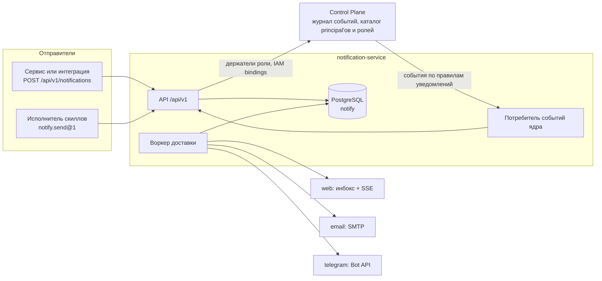
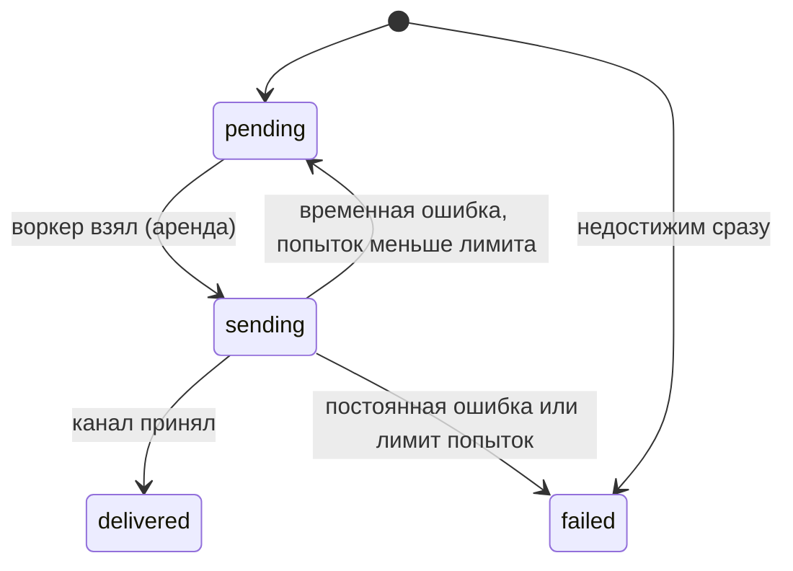

# Уведомления

Сервис уведомлений `notification-service` доставляет людям сообщения платформы:
просьбу принять решение, результат проверки задачи, уведомление, которое
отправил пакет или внешний сервис. Статья описывает, как сервис устроен, как
отправить уведомление через API и скилл `notify.send@1`, как выбираются каналы,
как устроены веб-инбокс, журнал доставки и автоматические уведомления о
решениях. Она для разработчика пакетов и интеграций и для оператора установки.
Канал Telegram описан отдельно — в статье [Telegram](telegram.md).

## Что делает сервис

- **Принимает уведомления от любого отправителя** — сервиса, скилла, ядра — с
  ключом дедупликации. Отправитель называет адресата и содержание, но не
  каналы.
- **Адресует людей через Control Plane.** Адресат — principal ядра, роль в
  workspace (все её держатели) или привязанная группа мессенджера. Кто держит
  роль и какая IAM-identity у principal'а, сервис читает у ядра своим service
  account'ом.
- **Выбирает каналы** по настройкам получателя и обязательным правилам
  организации: веб-инбокс (`web`), `email`, `telegram`.
- **Ведёт журнал доставки** — запись на каждую пару «получатель × канал» с
  повторами и причинами отказа.
- **Превращает события ядра в уведомления по правилам.** Какие события кому и
  с каким текстом приходят, описывают правила уведомлений `NotificationRule` —
  данные пакета, а не код сервиса (см. [Правила уведомлений](notification-rules.md)).
  Пакет `notify` даёт запрос решения с кнопками и уведомления о провале проверки
  приёмки.

Сервис нейтрален к домену: тип, заголовок, текст и ссылки задаёт отправитель.
Обоснование — TAI-ADR-0048 (сервис и каналы), TAI-ADR-0049 (событийная модель),
TAI-ADR-0050 (канал как способ входа).



Процесс один: HTTP API, фоновый воркер доставки и потребитель событий ядра
работают внутри одного контейнера и одной базы.

## Развёртывание

Сервис входит в профиль compose `notify`: контейнеры `notification-db`
(PostgreSQL 16, база `notify`) и `notification-service`. При старте контейнер
выполняет `alembic upgrade head`, затем запускает сервис на порту 8000.

```bash
tools/compose --profile core --profile edge --profile notify up -d
```

| Что | Значение |
|---|---|
| Порт в сети compose | `notification-service:8000` |
| Порт на хосте | `127.0.0.1:${NOTIFY_HOST_PORT:-18045}` |
| Маршрут периметра | `/notify/*` (префикс срезается), см. [Периметр и TLS](../operations/edge-and-tls.md) |
| Health | `GET /healthz` → `{"status": "ok"}` |
| Схема API | `GET /openapi.json`, `GET /docs` |
| Пароль БД | `NOTIFY_POSTGRES_PASSWORD` в `.env` (генерирует `make secrets`) |
| Service account | `secrets/notification-iam.env` (пишет bootstrap) |
| Бот Telegram | `secrets/notification-telegram.env` (заполняет оператор) |

### Bootstrap

Шаг `5c` скрипта `deploy/bootstrap.py` готовит сервису identity (подробно —
[Bootstrap](../getting-started/bootstrap.md)):

1. заводит в Control Plane principal вида `service` «Taimen Notification
   Service»;
2. выпускает в IAM service account с audiences `control-plane` и `iam` и
   потолком `control-plane:read`, `iam:channel-links`, пишет
   `NS_SERVICE_CLIENT_ID` и `NS_SERVICE_CLIENT_SECRET` в
   `secrets/notification-iam.env`;
3. создаёт binding с правами `events.read`, `approvals.read`, `tasks.read`,
   `principals.read`, `workspaces.read`.

Bootstrap также регистрирует audience `notification-service` со scopes
`notifications:send`, `notifications:read`, `notifications:admin`, audience
`iam` со scope `iam:channel-links` и добавляет `control-plane:decide` к scopes
audience `control-plane`.

`env_file` читается при создании контейнера, поэтому после первого bootstrap
сервис нужно пересоздать:

```bash
tools/compose --profile notify up -d notification-service
```

### Что работает без настройки

| Не настроено | Поведение |
|---|---|
| IAM (`NS_IAM_ISSUER` и JWKS) | Все маршруты `/api/v1` отвечают `503` |
| Control Plane или service account | Отправка principal'у и роли — `503 dependency_unavailable`; потребитель событий не запускается |
| Правила уведомлений не применены | Потребитель событий не запускается: из событий ядра уведомлений нет |
| `NS_TELEGRAM_BOT_TOKEN` | Канала `telegram` нет; вебхук отвечает `404` |
| `NS_EMAIL_MODE=disabled` | Канала `email` нет |

## Аутентификация и scopes

Сервис — resource server ровно одного audience, `notification-service`
(`NS_AUDIENCE`). Токены проверяет `platform-auth-sdk` по JWKS IAM. Scope
определяет роль вызывающего:

| Scope | Кто | Что открывает |
|---|---|---|
| `notifications:send` | Сервисы, исполнитель скиллов | `POST /api/v1/notifications`, `POST /api/v1/skills/notify.send`, чтение своих отправленных уведомлений |
| `notifications:read` | Человек | Свой инбокс, поток SSE, свои настройки |
| `notifications:admin` | Администратор организации, установщик пакетов | Обязательные правила, группы каналов, правила уведомлений (`/notification-rules`), чтение любого уведомления tenant'а |

Токен получают обычным обменом PAT или client credentials в IAM с
`audience: notification-service` и явным списком scopes — см.
[Токены, audiences, scopes](../iam/tokens.md). Ошибки — в конверте
`{"error": {"code", "message", "details"}}`, как у Control Plane.

## Отправка уведомления

```bash
curl -s -X POST "$NS/api/v1/notifications" \
  -H "Authorization: Bearer $TOKEN" \
  -H "Content-Type: application/json" \
  -H "Idempotency-Key: invoice-42-approved" \
  -d '{
    "recipient": {"kind": "role", "id": "<role-id>", "workspaceId": "<workspace-id>"},
    "type": "invoice.payment_approved",
    "title": "Оплата согласована: счёт 42",
    "body": "Финансовый директор согласовал оплату.",
    "links": [{"label": "Открыть задачу", "url": "https://platform.example.com/tasks/42"}]
  }'
```

Здесь `$NS` — адрес сервиса: `http://notification-service:8000` внутри сети
compose или `https://platform.example.com/notify` через периметр.

### Поля запроса

| Поле | Обязательно | Ограничения | Смысл |
|---|---|---|---|
| `recipient.kind` | да | `principal`, `role`, `group` | Кого адресуем |
| `recipient.id` | да | UUID | Principal ядра, роль ядра или группа канала |
| `recipient.workspaceId` | для `role` | UUID | Workspace, в котором ищутся держатели роли |
| `type` | да | 1–200 символов, имя через точки (`invoice.payment_approved`) | Тип уведомления: по нему работают настройки и обязательные правила |
| `title` | да | 1–200 символов, одна строка | Заголовок |
| `body` | нет | до 4000 символов | Текст, без управляющих символов |
| `links` | нет | до 10; `label` 1–100, `url` — http(s) | Ссылки |
| `actions` | нет | до 5; `id` `^[A-Za-z0-9_.:-]+$` до 64, `label` до 64, `data` — объект | Действия, которые канал может показать кнопками |
| `Idempotency-Key` (заголовок) | да | 1–200 символов | Ключ дедупликации |

Неизвестные поля отклоняются (`422 validation_error`).

### Адресаты

| `kind` | Кто получит |
|---|---|
| `principal` | Человек. Сервис находит IAM-identity principal'а — активный binding в IAM-tenant'е отправителя — и доставляет по каналам этой identity |
| `role` | Все активные держатели роли, которым роль назначена на уровне tenant или на этом workspace либо его предке (`GET /roles/{id}/principals?workspaceId=` ядра), и все группы мессенджера, привязанные к этому workspace и роли |
| `group` | Одна привязанная группа мессенджера (id из списка групп workspace, см. [Telegram](telegram.md)) |

Principal без binding в IAM-tenant'е отправителя известен, но недостижим: в
журнале появится доставка `web` со статусом `failed` и причиной
`recipient_has_no_identity`. Binding из другого tenant'а не используется —
уведомление не пересекает границу tenant'ов.

### Ответ

`201 Created` — уведомление принято, журнал доставки уже спланирован:

```json
{
  "id": "<notification-id>",
  "type": "invoice.payment_approved",
  "title": "Оплата согласована: счёт 42",
  "body": "Финансовый директор согласовал оплату.",
  "links": [{"label": "Открыть задачу", "url": "https://platform.example.com/tasks/42"}],
  "actions": [],
  "actionsClosedAt": null,
  "actionsOutcome": null,
  "recipient": {"kind": "role", "id": "<role-id>", "workspaceId": "<workspace-id>"},
  "senderId": "<iam-principal-id>",
  "createdAt": "2026-01-15T10:00:00Z",
  "deliveries": [
    {"id": "…", "channel": "web", "recipientKind": "principal", "recipientId": "<principal-id>",
     "mandatory": false, "status": "pending", "attempts": 0,
     "nextAttemptAt": "2026-01-15T10:00:00Z", "lastError": null, "deliveredAt": null},
    {"id": "…", "channel": "telegram", "recipientKind": "principal", "recipientId": "<principal-id>",
     "mandatory": false, "status": "pending", "attempts": 0,
     "nextAttemptAt": "2026-01-15T10:00:00Z", "lastError": null, "deliveredAt": null}
  ]
}
```

Доставка идёт асинхронно; текущее состояние журнала отдаёт
`GET /api/v1/notifications/{id}` — отправителю (`notifications:send`) или
администратору (`notifications:admin`). Чужое уведомление неотличимо от
несуществующего (`404`).

### Дедупликация

Ключ `Idempotency-Key` уникален в паре «tenant × отправитель». Сервис хранит
вместе с уведомлением хэш канонического тела запроса:

| Повтор | Ответ |
|---|---|
| Тот же ключ, то же тело | `200` и первое уведомление с его журналом; второй доставки нет |
| Тот же ключ, другое тело | `409 idempotency_conflict` |
| Два одновременных запроса с одним ключом | Один создаёт, второй получает повтор первого |

Выбирайте ключ из предметного события (`invoice-42-approved`,
`<event-id>`), а не случайный: тогда повтор после сбоя сети безопасен.

### Ошибки отправки

| Код | HTTP | Причина |
|---|---|---|
| `validation_error` | 422 | Тело не проходит схему (роль без `workspaceId`, многострочный `title`, управляющие символы) |
| `unknown_recipient` | 422 | Ядро не знает principal'а или роль; группа не найдена или отвязана |
| `idempotency_conflict` | 409 | Ключ уже использован с другим телом |
| `dependency_unavailable` | 503 | Control Plane не ответил или не настроен |
| `insufficient_scope` и другие коды `platform-auth-sdk` | 401/403 | Токен не того audience или без `notifications:send` |

## Выбор каналов

Каналы, доступные на установке, — это `web` всегда, `email`, если
`NS_EMAIL_MODE` не `disabled`, и `telegram`, если задан токен бота. Для каждого
получателя-человека сервис проходит их по фиксированному правилу:

1. **Обязательное правило организации** выбирает канал, что бы ни выбрал
   получатель, и игнорирует тихие часы.
2. Иначе решает **самая точная подходящая настройка получателя**: точный тип
   точнее префикса `invoice.*`, длинный префикс точнее короткого, `*` — самая
   общая. Если настроек нет, канал **включён**: отписка — ход получателя.
3. Канал выбирается, только если получатель на нём **достижим**: для `email` и
   `telegram` нужен сохранённый и не отключённый адрес. Обязательный канал без
   адреса всё равно попадает в журнал — со статусом `failed` и причиной
   `recipient_unreachable`, чтобы было видно, что требуемая доставка не
   случилась.
4. **Тихие часы** откладывают push-каналы (`email`, `telegram`) до конца окна.
   Инбокс никого не прерывает и тихими часами не задерживается.

| Канал | Push | Адрес | Откуда адрес |
|---|---|---|---|
| `web` | нет | не нужен — IAM-identity | Инбокс человека |
| `email` | да | e-mail | Поле `email` в настройках получателя |
| `telegram` | да | id личного чата | Привязка аккаунта кодом, см. [Telegram](telegram.md) |

Группы мессенджера получают уведомление без выбора каналов: у группы один
канал, и настройки людей к ней не применяются.

### Настройки получателя

Человек читает и меняет свои настройки токеном со scope
`notifications:read`:

```bash
curl -s "$NS/api/v1/me/notification-preferences" -H "Authorization: Bearer $TOKEN"
```

```json
{
  "channels": ["web", "email", "telegram"],
  "preferences": [{"type": "invoice.*", "channel": "email", "enabled": false}],
  "quietHours": {"start": "22:00", "end": "08:00", "timezone": "Europe/Moscow"},
  "addresses": [
    {"channel": "email", "address": "alice@example.com", "disabledAt": null, "disabledReason": null},
    {"channel": "telegram", "address": "<chat-id>", "disabledAt": null, "disabledReason": null}
  ],
  "mandatory": [
    {"id": "…", "type": "approval.requested", "channel": "telegram",
     "createdBy": "<iam-principal-id>", "createdAt": "…"}
  ]
}
```

`PATCH` меняет только переданные поля:

```bash
curl -s -X PATCH "$NS/api/v1/me/notification-preferences" \
  -H "Authorization: Bearer $TOKEN" -H "Content-Type: application/json" \
  -d '{
    "preferences": [
      {"type": "invoice.*", "channel": "email", "enabled": false},
      {"type": "*", "channel": "telegram", "enabled": null}
    ],
    "quietHours": {"start": "22:00", "end": "08:00", "timezone": "Europe/Moscow"},
    "email": "alice@example.com"
  }'
```

| Поле | Смысл |
|---|---|
| `preferences[].type` | Тип, префикс `prefix.*` или `*` |
| `preferences[].channel` | Канал, настроенный на установке; иначе `422 unknown_channel` |
| `preferences[].enabled` | `true`/`false`; `null` удаляет настройку (возврат к «включено») |
| `quietHours` | `start`, `end` (время), `timezone` (имя зоны IANA); `null` — снять тихие часы. Окно может переходить через полночь (`22:00`–`08:00`); `start` = `end` — окна нет |
| `email` | Адрес канала `email`; `null` — удалить. Повторная установка того же адреса снова включает адрес, отключённый после отказа почтового сервера |

### Обязательные правила организации

Администратор (`notifications:admin`) делает доставку по каналу обязательной
для типа или префикса — например, чтобы запросы решений всегда уходили в
Telegram:

```bash
curl -s -X POST "$NS/api/v1/mandatory-rules" \
  -H "Authorization: Bearer $ADMIN_TOKEN" -H "Content-Type: application/json" \
  -d '{"type": "approval.requested", "channel": "telegram"}'

curl -s "$NS/api/v1/mandatory-rules" -H "Authorization: Bearer $ADMIN_TOKEN"
curl -s -X DELETE "$NS/api/v1/mandatory-rules/<rule-id>" -H "Authorization: Bearer $ADMIN_TOKEN"
```

Повтор того же правила возвращает существующее (`200` вместо `201`). Правила
действуют на весь tenant и видны каждому человеку в поле `mandatory` его
настроек.

## Веб-инбокс

Канал `web` складывает уведомление во входящие получателя. У каждой записи —
порядковый номер `seq`, растущий в пределах инбокса одного человека.

```bash
# Последние 50, новые сверху
curl -s "$NS/api/v1/me/notifications?limit=50" -H "Authorization: Bearer $TOKEN"

# Только непрочитанные, следующая страница
curl -s "$NS/api/v1/me/notifications?unreadOnly=true&cursor=<nextCursor>" \
  -H "Authorization: Bearer $TOKEN"
```

```json
{
  "items": [
    {"id": "<item-id>", "seq": 17, "notificationId": "…", "type": "approval.requested",
     "title": "Нужно решение: …", "body": "…", "links": [],
     "actions": [{"id": "approve", "label": "Одобрить", "data": {"kind": "approval.decide", "…": "…"}}],
     "actionsClosedAt": null, "actionsOutcome": null,
     "senderId": "…", "createdAt": "…", "readAt": null}
  ],
  "unreadCount": 3,
  "nextCursor": "17"
}
```

| Запрос | Смысл |
|---|---|
| `GET /api/v1/me/notifications` | Страница инбокса: `unreadOnly`, `limit` (1–200, по умолчанию 50), `cursor` |
| `POST /api/v1/me/notifications/{itemId}:read` | Отметить прочитанным |
| `POST /api/v1/me/notifications:read-all` | Отметить всё → `{"marked": N}` |
| `GET /api/v1/me/notifications/stream` | Поток SSE |

Когда действия уведомления перестают действовать (решение уже принято),
`actionsClosedAt` и `actionsOutcome` (например, `{"status": "approved", "by":
"…", "channel": "telegram"}`) приходят в той же записи.

### Поток SSE

```bash
curl -N "$NS/api/v1/me/notifications/stream" \
  -H "Authorization: Bearer $TOKEN" -H "Last-Event-ID: 17"
```

```text
retry: 3000

id: 18
event: notification
data: {"id":"…","seq":18,"notificationId":"…","type":"…","title":"…",…}

: keep-alive
```

- `id` события — `seq` записи. Браузерный `EventSource` сам присылает
  последний `id` в заголовке `Last-Event-ID` при переподключении и получает
  всё, что пришло за время обрыва. Клиент, который открывает поток заново,
  может передать то же значение параметром `?lastEventId=`.
- Без `Last-Event-ID` поток начинается с текущего конца инбокса: историю
  читают через `GET /me/notifications`.
- Раз в `NS_INBOX_KEEPALIVE_SECONDS` (15 с) простаивающий поток шлёт
  комментарий `: keep-alive`, раз в `NS_INBOX_POLL_SECONDS` (5 с) сверяется с
  базой — так доставки, сделанные другим процессом, тоже доходят.
- Поток **закрывается, когда истекает токен**, которым он открыт. Клиент
  переподключается со свежим токеном и `Last-Event-ID` и ничего не теряет.
- Нечисловой `Last-Event-ID` — `422 invalid_last_event_id`.

!!! note "Прокси перед потоком"
    Ответ идёт с `Cache-Control: no-cache` и `X-Accel-Buffering: no`. Если
    перед сервисом стоит свой прокси, отключите в нём буферизацию для
    `…/me/notifications/stream`.

## Журнал доставки и повторы

Каждая пара «получатель × канал» — отдельная доставка со своим статусом:



- Воркер берёт доставки, чьё время пришло, пачкой (`FOR UPDATE SKIP LOCKED`)
  и под арендой `NS_WORKER_LEASE_SECONDS` (120 с). Итог записывается с
  проверкой номера попытки: если аренда истекла и доставку взял другой воркер,
  поздний результат первого отбрасывается.
- **Временные ошибки** (таймаут, 429 и 5xx Bot API, временные коды SMTP)
  повторяются с экспоненциальной паузой: `NS_DELIVERY_BACKOFF_SECONDS` × 2ⁿ⁻¹,
  не больше `NS_DELIVERY_BACKOFF_MAX_SECONDS` (по умолчанию 5 с, 10 с, 20 с …
  до часа), всего до `NS_DELIVERY_MAX_ATTEMPTS` (8) попыток. После
  исчерпания — `failed` с причиной `retries_exhausted: …`.
- **Постоянные ошибки** завершают доставку сразу. Если отказал сам адрес
  (бот заблокирован, почтовый ящик отвергнут кодом 5xx), адрес **отключается**:
  канал больше не выбирается для этого человека, пока адрес не будет задан
  заново.
- Доставки одного получателя по одному каналу уходят по очереди в порядке
  создания — чат и инбокс показывают их в порядке отправки. Разные получатели
  обслуживаются параллельно, сбой одного канала не задерживает другие.
- Если действия уведомления закрылись до отложенной доставки (тихие часы,
  повтор), сообщение уходит без кнопок.

| `lastError` | Смысл |
|---|---|
| `recipient_has_no_identity` | У principal'а нет IAM-binding в tenant'е отправителя |
| `recipient_unreachable` | Нет адреса канала или адрес отключён |
| `channel_not_configured` | Канал группы не настроен на установке |
| `send_timeout` | Канал не ответил за половину аренды |
| `telegram_…`, `smtp_…` | Ответ канала; см. [Telegram](telegram.md#troubleshooting) |
| `retries_exhausted: <причина>` | Временная ошибка повторялась до лимита |

## Скилл `notify.send@1` {#notify-send}


Пакеты шлют уведомления не прямым HTTP, а скиллом: его можно вызвать из
исхода approval, правила вывода работы или шага процесса — в любом домене.
Контракт скилла публикуется в каталоге ядра пакетом каталога, исполняет его
демон-исполнитель скиллов протоколом `http`.

| Параметр контракта | Значение |
|---|---|
| Имя и версия | `notify.send`, `1` |
| `sideEffects` / `riskLevel` | `external_write` / `low` |
| Endpoint | `${NOTIFICATION_SERVICE_URL}/api/v1/skills/notify.send` |
| Токен | audience `notification-service`, scope `notifications:send` |
| `idempotency` | `required` |
| `timeoutSeconds` / `retryPolicy` | 30 / 3 попытки с паузой 10 с |

**Входы** — те же поля, что у `POST /api/v1/notifications`, **без `actions`**:
`recipient`, `type`, `title`, `body`, `links`. Кнопки решений ставит только
само ядро через события, пакет их подделать не может.

**Выходы**:

```json
{
  "notificationId": "<notification-id>",
  "deliveries": [{"channel": "web", "status": "pending"}, {"channel": "telegram", "status": "pending"}]
}
```

Ключ идемпотентности вызова — один и тот же на всех попытках — становится
ключом дедупликации уведомления (`skill:<idempotencyKey>`, слишком длинный
ключ хэшируется). Повтор вызова не создаёт второго уведомления. Ошибки идут в
формате skill-sdk `{"error": {"code", "message", "retryable", "details"}}`:
5xx помечены `retryable: true`, 4xx — `false` (например, `invalid_inputs`,
`unknown_recipient`).

### Пример: уведомить роль после согласования

Тип задачи объявляет исход gate-решения: после одобрения уведомить держателей
роли в workspace задачи и оставить комментарий о результате.

```yaml
apiVersion: taimen.ai/v1
kind: TaskType
key: payment-approval
spec:
  displayName: Оплатить счёт
  # lifecycleSchema опущена
  approvalSchema:
    gates:
      default:
        outcomes:
          approved:
            - invokeSkill:
                skill: notify.send@1
                inputs:
                  recipient:
                    kind: role
                    id: ${ACCOUNTING_ROLE_ID}
                    workspaceId: "$.task.workspaceId!"
                  type: invoice.payment_approved
                  title: "Оплата согласована: $.task.title|truncate:150"
                  body: "Оплата согласована ($.task.publicId). $.approval.comment"
                onSuccess:
                  - comment: {body: "Бухгалтерия уведомлена о согласовании оплаты."}
                onFailure:
                  - comment: {body: "Уведомить бухгалтерию не удалось: $.invocation.error.code $.invocation.error.message"}
          rejected:
            - comment: {body: "Оплата не согласована: $.approval.comment"}
            - transition: {status: withdrawn}
```

- `${ACCOUNTING_ROLE_ID}` подставляется из окружения при применении пакета,
  `$.task.…` и `$.approval.…` — из контекста решения, `$.invocation.…` — из
  итога вызова скилла (см. [Approvals](../control-plane/approvals.md) и
  [Пакеты каталога](../control-plane/catalog-packages.md)).
- `onSuccess`/`onFailure` исполняются после завершения вызова. Закрывать
  задачу или менять её статус по итогу уведомления нужно именно в них.

- Пример показывает исход решения у типа задачи. Там, где путь работы длиннее
  одного решения, уведомление — шаг процесса (`call: {skill: notify.send@1}`),
  например: проверка, согласование по порогу суммы, уведомление бухгалтерии
  и оплата.

### Что нужно исполнителю скиллов

Скилл исполняет демон с правом `skills.execute` (см.
[Конфигурация runner](../runner/configuration.md)). Для `notify.send@1` ему
нужны:

| Настройка | Значение |
|---|---|
| `NOTIFICATION_SERVICE_URL` | При применении пакета `notify`: адрес сервиса, доступный исполнителю (например, `https://platform.example.com/notify`) |
| `CONTROL_PLANE_SKILLS_PROTOCOLS` | включает `http` |
| `CONTROL_PLANE_SKILLS_HTTP_ALLOWED_ORIGINS` | origin сервиса уведомлений |
| `CONTROL_PLANE_SKILLS_PRIVATE_HOSTS` | хост сервиса, если он резолвится во внутренний адрес |
| `CONTROL_PLANE_SKILLS_ALLOWED_AUDIENCES` | `notification-service` |
| Потолок PAT исполнителя | включает audience `notification-service` и scope `notifications:send` |

## Уведомления из событий ядра {#core-events}

Потребитель событий ядра работает внутри сервиса, если настроены и IAM, и
Control Plane, `NS_EVENTS_ENABLED=true` и в tenant'е есть хотя бы одно
включённое правило уведомлений. Он читает журнал через SDK
`control_plane_client.events` (см. [Подписки на события](../control-plane/event-subscriptions.md))
с фильтром — объединением типов из правил (`on.type` и `close.on`), хранит
курсор и отметки обработанных событий в своей базе и отправляет обычные
уведомления от имени своего service account'а.

Что именно происходит на событие — кому, с каким текстом, ссылками и кнопками,
какие события закрывают кнопки, — задают правила, а не код сервиса. Их
спецификация, API и применение пакетом — в статье [Правила
уведомлений](notification-rules.md). Пакет `notify` даёт поведение по
умолчанию:

| Событие | Что происходит |
|---|---|
| `approval.requested` | Уведомление назначенному principal'у (`assignedPrincipalId`) или держателям роли `requiredRoleId` в workspace approval'а: «Нужно решение: <задача>», кто запрашивает, комментарий, кнопки «Одобрить» / «Отклонить» (`data.kind = approval.decide`) |
| `approval.approved`, `approval.rejected`, `approval.cancelled` | Кнопки того уведомления закрываются с исходом: кто решил, через какой канал, когда. Сообщения Telegram редактируются и теряют кнопки |
| `task.verification_failed` | Уведомление владельцу задачи (иначе исполнителю): какая проверка не прошла и почему, вернулась ли задача в работу или ждёт человека |

- **Ровно одно уведомление на событие и правило.** Ключ дедупликации выводится
  из события шаблоном правила (у правил `notify` —
  `control-plane:approval:<approval-id>` и `control-plane:event:<event-id>`),
  поэтому событие, обработанное повторно после сбоя, воспроизводит уведомление,
  а не создаёт второе.
- **Первый запуск** начинается с конца журнала (`NS_EVENTS_START=latest`):
  новая установка не рассылает уведомления об истории. `earliest` — обработать
  весь доступный журнал. Курсор сохраняется, когда потребитель перезапускается
  на новом наборе правил.
- **Поддерево.** `NS_EVENTS_WORKSPACE_ID` сужает чтение до workspace и его
  потомков; пусто — весь tenant (нужно `events.read` на tenant).
- **Ссылка на задачу** — часть правила: у правил `notify` это
  `${TASK_URL_BASE}/<publicId>`, база — переменная установки пакета.
- Если ядро отказало в самой подписке (нет `events.read`, credential не
  принят), потребитель останавливается с ошибкой в журнале, а API и доставка
  продолжают работать. После исправления прав перезапустите сервис.

Кнопки решения исполняет канал Telegram — как нажатие становится решением
человека в ядре, описано в статье [Telegram](telegram.md#decisions). В веб-инбоксе
действия приходят данными (`actions`), а само решение человек принимает в
рабочем месте, через MCP-плагин или API approvals.

## Конфигурация

Все переменные — с префиксом `NS_`, полный перечень — в
[Переменных окружения](../reference/environment.md#notification-service). Основное:

| Переменная | По умолчанию | Назначение |
|---|---|---|
| `NS_DATABASE_URL` | локальный PostgreSQL | База сервиса; в стеке — `notification-db` |
| `NS_IAM_URL`, `NS_IAM_ISSUER`, `NS_IAM_JWKS_URL` | пусто | IAM: обмен client credentials и проверка токенов |
| `NS_CONTROL_PLANE_URL` | пусто | Ядро: каталог адресатов, события, решения |
| `NS_SERVICE_CLIENT_ID`, `NS_SERVICE_CLIENT_SECRET` | пусто | Service account (`secrets/notification-iam.env`) |
| `NS_EMAIL_MODE` | `log` | `smtp` — отправлять, `log` — только писать письмо в лог, `disabled` — канала нет |
| `NS_EVENTS_ENABLED`, `NS_EVENTS_START`, `NS_EVENTS_WORKSPACE_ID` | `true`, `latest`, пусто | Потребитель событий ядра |
| `NS_EVENTS_POLL_SECONDS` | `30` | Период опроса журнала; за один цикл потребитель видит изменение набора правил |
| `NS_TELEGRAM_*` | пусто | Бот Telegram, см. [Telegram](telegram.md) |

!!! note "Email в стандартном стеке только пишется в лог"
    `deploy/local/compose.yml` передаёт сервису `NS_EMAIL_FROM`, `NS_SMTP_HOST` и
    `NS_SMTP_PORT` (из `NOTIFY_EMAIL_FROM`, `NOTIFY_SMTP_HOST`,
    `NOTIFY_SMTP_PORT`), но не `NS_EMAIL_MODE`, поэтому канал `email` работает
    в режиме `log`. Для реальной отправки задайте сервису `NS_EMAIL_MODE=smtp`
    и учётные данные `NS_SMTP_USERNAME`/`NS_SMTP_PASSWORD` (например,
    compose override-файлом).

## Типичные проблемы

| Симптом | Причина | Что делать |
|---|---|---|
| Любой запрос к `/api/v1` — `503` | Не заданы `NS_IAM_ISSUER` или JWKS | Проверить окружение контейнера |
| Отправка роли — `503 dependency_unavailable` | Нет `secrets/notification-iam.env` или контейнер создан до bootstrap | Выполнить bootstrap и `tools/compose --profile notify up -d notification-service` |
| `422 unknown_recipient` | Principal или роль не существуют в ядре; группа отвязана | Проверить id; для группы — `GET …/channel-groups` |
| Уведомление принято, но у человека пусто, в журнале `recipient_has_no_identity` | У principal'а нет IAM-binding в tenant'е отправителя | Завести binding principal'у (см. [Права и scopes](../reference/permissions.md)) |
| Роль адресована, а `deliveries` пуст | У роли нет держателей в этом workspace и нет привязанных групп | Назначить роль или привязать группу |
| Нет уведомлений о запросах решений | Не применены правила уведомлений, или потребитель не запущен: нет Control Plane/IAM, `NS_EVENTS_ENABLED=false`, ядро отказало в подписке | Применить пакет `notify` (см. [Правила уведомлений](notification-rules.md)); логи сервиса; права binding сервиса (`events.read`) |
| Старые запросы решений не пришли после установки | `NS_EVENTS_START=latest`: история не рассылается | Ожидаемо |
| `409 idempotency_conflict` | Ключ использован с другим телом | Ключ должен однозначно определять содержание |
| Поток SSE обрывается через несколько минут | Истёк токен | Переподключаться со свежим токеном и `Last-Event-ID` |

## См. также

- [Правила уведомлений](notification-rules.md) — какие события становятся уведомлениями.
- [Telegram](telegram.md) — привязка людей и групп, решения кнопками.
- [Подписки на события](../control-plane/event-subscriptions.md) — фильтры
  журнала и SDK потребителя, на которых построен потребитель сервиса.
- [Approvals](../control-plane/approvals.md) — запрос и решение, исходы
  типа задачи.
- [Пакеты каталога](../control-plane/catalog-packages.md) — пакет `notify`.
- [Токены, audiences, scopes](../iam/tokens.md)
- [Периметр и TLS](../operations/edge-and-tls.md) — маршрут `/notify/*`.
