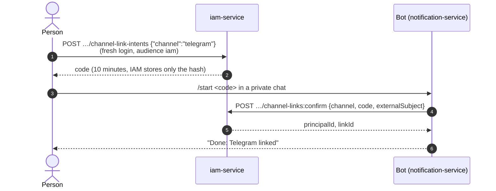
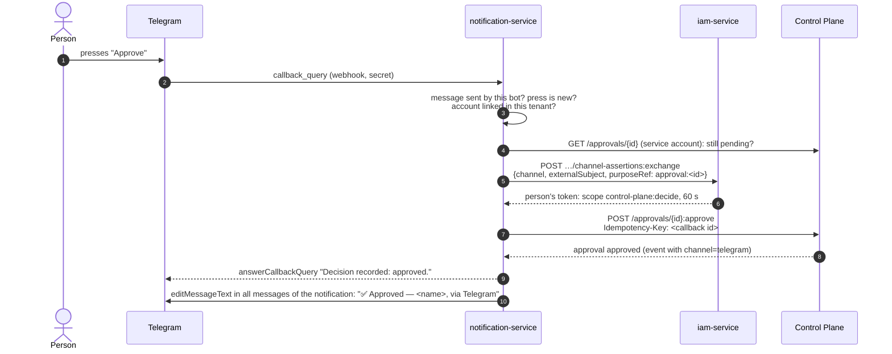

# Telegram

The `telegram` channel of the notification service: the bot sends notifications to a
person's private chat and to the team's group chats, and with buttons under a message a
person makes approval decisions without opening the workplace. The article describes linking
people and groups, the path from a button press to a decision in Control Plane, bot setup by
the operator, and common problems. The overall service design is in the
[Notifications](index.md) article.

## How it works

Three participants, each with its own responsibility:

| Participant | What it does |
|---|---|
| **IAM** (`iam-service`) | Owns the "person ↔ Telegram account" link as an external identity. Issues one-time link codes and exchanges a button press for a short-lived token of the person |
| **notification-service** | Runs the bot: receives the Telegram webhook, confirms links in IAM (a service account with the `iam:channel-links` scope), sends messages, turns presses into decisions |
| **Control Plane** | Accepts the approval decision with the person's token and records in the decision event the channel through which it came |

Only the person and IAM know the link code: the notification service cannot link someone
else's account to a person. Only a human can decide through the channel — linking to an
agent or a service account is rejected. Rationale: TAI-ADR-0050 and CP-ADR-0070.

!!! warning "Trust in the notification service"
    Telegram has no user signature on a press: the claim "this account pressed the button" is
    made by the notification service as the bot owner. A compromised service can decide
    approvals on behalf of linked people — but only one at a time, within 60 seconds, a
    specific approval, within the person's permissions, and every such decision is visible in
    the IAM audit and the core log. Treat the bot token and the webhook secret as IAM-level
    secrets.

## Operator setup

### 1. Create a bot

Create a bot with `@BotFather` in Telegram and save the token and the bot name
(`@username`). If the bot works in groups in privacy mode (the default), it sees only
commands addressed to it — exactly the kind of commands the service issues
(`/start@<bot> <code>`).

### 2. Give the service the token and the webhook secret

The `secrets/notification-telegram.env` file is attached to the container through `env_file`
(`required: false`: without the file there is no channel):

```bash
cat > secrets/notification-telegram.env <<EOF
NS_TELEGRAM_BOT_TOKEN=<token from BotFather>
NS_TELEGRAM_WEBHOOK_SECRET=$(openssl rand -hex 32)
NS_TELEGRAM_BOT_USERNAME=<bot name without @>
EOF
chmod 600 secrets/notification-telegram.env
tools/compose --profile notify up -d notification-service
```

| Variable | Default | Meaning |
|---|---|---|
| `NS_TELEGRAM_BOT_TOKEN` | empty | Bot token. Without it there is no `telegram` channel, and the webhook returns `404` |
| `NS_TELEGRAM_WEBHOOK_SECRET` | empty | Webhook secret. Without it the webhook rejects every call (`401`) |
| `NS_TELEGRAM_BOT_USERNAME` | empty | Bot name: commands and group link URLs |
| `NS_TELEGRAM_API_URL` | `https://api.telegram.org` | Bot API address |
| `NS_TELEGRAM_TIMEOUT_SECONDS` | `10` | Bot API call timeout |
| `NS_CHANNEL_GROUP_CODE_TTL_SECONDS` | `600` | Group link code lifetime |
| `NS_IAM_CHANNEL_AUDIENCE`, `NS_IAM_CHANNEL_SCOPE` | `iam`, `iam:channel-links` | The audience and scope the service uses when calling IAM as a channel adapter |

The bot token appears only in the URLs of Bot API requests and does not end up in the
service's errors or logs.

### 3. Enable the provider in IAM

The channel as a login method is enabled **for each tenant** separately with an IAM bootstrap
endpoint. The IAM administrative surface is closed at the edge, so the call is made from the
host:

```bash
curl -s -X PUT "http://127.0.0.1:18010/api/v1/tenants/<tenant-id>/channel-providers/telegram" \
  -H "X-IAM-Bootstrap-Token: $IAM_BOOTSTRAP_TOKEN" \
  -H "Content-Type: application/json" \
  -d '{"status": "active"}'
```

```json
{"channel": "telegram", "status": "active", "updatedAt": "2026-01-15T10:00:00Z"}
```

`GET …/channel-providers` shows the state. `{"status": "disabled"}` immediately stops
confirmation of new links and the exchange of presses for tokens; the links themselves remain
and work again after re-enabling.

Besides the provider, the tenant needs the `iam` audience with the `iam:channel-links` scope
and the `control-plane:decide` scope on the `control-plane` audience. Both are registered by
`deploy/bootstrap.py`.

### 4. Register the webhook

The webhook is the service's `POST /channels/telegram/webhook`, publicly available through
the edge as `https://platform.example.com/notify/channels/telegram/webhook`. Register it in
the Bot API with the same secret:

```bash
source secrets/notification-telegram.env
curl -s "https://api.telegram.org/bot$NS_TELEGRAM_BOT_TOKEN/setWebhook" \
  -d url=https://platform.example.com/notify/channels/telegram/webhook \
  -d secret_token="$NS_TELEGRAM_WEBHOOK_SECRET" \
  -d 'allowed_updates=["message","callback_query","my_chat_member"]'

curl -s "https://api.telegram.org/bot$NS_TELEGRAM_BOT_TOKEN/getWebhookInfo"
```

Telegram sends the secret in the `X-Telegram-Bot-Api-Secret-Token` header; the service
compares it with `NS_TELEGRAM_WEBHOOK_SECRET` in constant time. This is the only proof that
the request came from Telegram, so the route is public but useless without the secret.

The service processes three kinds of updates: `message` (commands), `callback_query` (button
presses), and `my_chat_member` (the bot was blocked or removed from a group). The rest are
ignored. The webhook answers `200` to any authentic update, even if processing failed:
otherwise Telegram would send the same update again and again. A person whose press did not
work simply presses again.

| Webhook response | Reason |
|---|---|
| `200 {"ok": true}` | The update is accepted |
| `401 invalid_token` | No secret header, the secret is wrong, or no secret is set |
| `404 not_found` | The bot token is not set — the channel is not configured |
| `400 bad_request` | The body is not a JSON object |

### 5. Verify

1. Link your account (next section) and get the bot's reply "Done: Telegram linked".
2. The `telegram` channel address appears in the preferences at
   `GET /api/v1/me/notification-preferences`.
3. Request an approval assigned to yourself — a message with "Approve" and "Reject" buttons
   arrives in your private chat.

## Linking a person



### Get a code

IAM issues the code to the person with the person's own token. Token requirements:

- audience `iam` (`IAM_CHANNEL_AUDIENCE`) and a `tenant_id` that matches the path;
- `principal_type = human`, the principal is active;
- **a fresh login**: `auth_time` no older than
  `IAM_CHANNEL_LINK_MAX_AUTHENTICATION_AGE_SECONDS` (300 s) — a stolen old token must not
  open a permanent channel for an attacker;
- the token was not issued by the channel itself (`acr=channel:*`): a channel cannot
  replicate itself.

A person gets such a token right after login, for example with a `federation:exchange` using
`"audience": "iam"` (see [Identity federation](../iam/federation.md)).

```bash
curl -s -X POST "$IAM/api/v1/tenants/<tenant-id>/channel-link-intents" \
  -H "Authorization: Bearer $HUMAN_IAM_TOKEN" -H "Content-Type: application/json" \
  -d '{"channel": "telegram"}'
```

```json
{"intentId": "<intent-id>", "channel": "telegram", "code": "<code>", "expiresAt": "2026-01-15T10:10:00Z"}
```

The code is shown once and lives for `IAM_CHANNEL_LINK_CODE_TTL_SECONDS` (600 s). No more than
`IAM_CHANNEL_LINK_INTENT_LIMIT` (5) codes per `IAM_CHANNEL_LINK_INTENT_WINDOW_SECONDS`
(600 s), otherwise `429 rate_limited` with `Retry-After`.

!!! note "There is no linking screen"
    In the delivery, the code is requested with an IAM API call. Embedding it into your own
    interface is the installation client's job: it is a single `POST` with the person's token.

!!! warning "Linking routes are closed at the reference edge"
    The reference Caddyfile returns `404` for all `/iam/api/v1/tenants/*` paths except
    `federation:authenticate` and `federation:exchange` (see
    [Edge and TLS](../operations/edge-and-tls.md)). Therefore `channel-link-intents` and
    `channel-links` are available only from inside the compose network
    (`$IAM` = `http://iam-service:8010`) — for example, from your web backend that calls IAM
    with the person's token. If people need to call them directly, add exceptions to the
    closed-paths matcher for exactly `…/channel-link-intents`, `…/channel-links`, and
    `…/channel-links/*:revoke`. Do not expose the adapter routes (`channel-links:confirm`,
    `channel-assertions:exchange`) and `channel-providers`: only the notification service
    and the operator call them from inside.

| Refusal | HTTP | Reason |
|---|---|---|
| `channel_provider_disabled` | 403 | The provider is not enabled for the tenant |
| `authentication_context_expired` | 403 | The login is older than 300 s — log in again |
| `human_principal_required` | 403 | The token does not belong to a human |
| `channel_authentication_not_allowed` | 403 | The token was issued by a channel |
| `channel_already_linked` | 409 | The person already has an active Telegram link — revoke it first |
| `rate_limited` | 429 | Too many codes |

### Send the code to the bot

The person writes `/start <code>` to the bot in a **private** chat. The service confirms the
code in IAM (`POST …/channel-links:confirm`) with the sender id as `externalSubject` —
exactly the account that sent the code is linked — and saves the chat as this person's
`telegram` channel address.

| Bot reply | Reason (IAM code) |
|---|---|
| "Done: Telegram linked…" | The link is created |
| "The code does not fit: it is wrong, already used, or expired." | `invalid_link_code` — from the outside IAM does not distinguish an unknown, someone else's, used, or expired code; the exact reason is only in audit |
| "Another Telegram is already linked to your account." | `channel_already_linked` |
| "This Telegram is already linked to another account." | `channel_account_linked` — one Telegram account belongs to one person |
| "Login through Telegram is disabled by the organization." | `channel_provider_disabled` |
| "The account is inactive." | `principal_not_active` |
| "Only a human can link Telegram." | `human_principal_required` |
| "Too many attempts. Try again later." | `rate_limited` — no more than `IAM_CHANNEL_CONFIRM_FAILURE_LIMIT` (10) failed confirmations per 600 s |
| "The service is currently unavailable…" | IAM did not answer or the service is not configured |

If the same chat was previously the address of another person in this tenant, the previous
address is disabled with the reason `linked_to_another_account`.

### Bot commands

| Command | Where | What it does |
|---|---|---|
| `/start <code>` | private chat | Link the account with a code from IAM |
| `/start <code>` | group | Link the group with an administrator's code (see below) |
| `/start` | private chat | Restore an address disabled by blocking the bot; otherwise — help |
| `/unlink` | private chat | Disable the address: messages no longer arrive here, buttons do not work |
| `/help` | private chat | Help |

!!! warning "`/unlink` does not revoke the link in IAM"
    The command disables the address in the notification service — messages and buttons stop
    working. The link itself remains in IAM: the person can revoke it through the IAM API
    (below). After `/unlink`, messages can be restored only with a new code — unlinking is
    treated as a security measure, not a pause.

### Viewing and revoking links

A person sees and revokes their links with the same `iam` audience token:

```bash
curl -s "$IAM/api/v1/tenants/<tenant-id>/channel-links" \
  -H "Authorization: Bearer $HUMAN_IAM_TOKEN"

curl -s -X POST "$IAM/api/v1/tenants/<tenant-id>/channel-links/<link-id>:revoke" \
  -H "Authorization: Bearer $HUMAN_IAM_TOKEN"
```

After revocation, the next press exchange is rejected (`channel_account_not_linked`), and the
notification service disables the address with the reason `iam_link_revoked`. Channel tokens
already issued live no longer than `IAM_CHANNEL_ASSERTION_TTL_SECONDS` (60 s); the IAM event
`channel_link.revoked` carries a `credentialId` for revocation caches. Someone else's link is
indistinguishable from a nonexistent one (`404 channel_link_not_found`).

### If the bot is blocked

When a person blocks the bot (a `my_chat_member` update with status `kicked`) or sending
returns `403`, the address is disabled with the reason `bot_blocked` or `telegram_403…`, and
the channel is no longer selected. After unblocking, it is enough to send `/start` to the bot
without a code — the address comes back.

## Team groups

A messenger group is linked to a workspace and, optionally, to a role in it. Notifications
addressed to this role in this workspace reach both its holders personally and the group; you
can also address the group directly (`recipient.kind = group`).

```bash
curl -s -X POST "$NS/api/v1/workspaces/<workspace-id>/channel-groups" \
  -H "Authorization: Bearer $ADMIN_TOKEN" -H "Content-Type: application/json" \
  -d '{"channel": "telegram", "roleId": "<role-id>"}'
```

```json
{
  "id": "<intent-id>",
  "channel": "telegram",
  "workspaceId": "<workspace-id>",
  "roleId": "<role-id>",
  "code": "<code>",
  "command": "/start@<bot> <code>",
  "deepLink": "https://t.me/<bot>?startgroup=<code>",
  "expiresAt": "2026-01-15T10:10:00Z"
}
```

The `notifications:admin` scope is required. Then the administrator either adds the bot to
the group and sends `command` there, or opens `deepLink` — Telegram offers to choose a group,
adds the bot, and sends the code. The code is single-use and lives for
`NS_CHANNEL_GROUP_CODE_TTL_SECONDS` (600 s); `deepLink` is present only if
`NS_TELEGRAM_BOT_USERNAME` is set. The bot replies in the group "Group linked…".

| Request | Meaning |
|---|---|
| `POST /api/v1/workspaces/{id}/channel-groups` | Group link code (`roleId` is optional) |
| `GET /api/v1/workspaces/{id}/channel-groups` | Linked groups, including disabled ones |
| `DELETE /api/v1/workspaces/{id}/channel-groups/{groupId}` | Unlink: delivery to the group stops (reason `unlinked_by_admin`) |

- Linking the same chat again moves it to the new workspace and role.
- A group that became a supergroup keeps receiving messages: the service moves it to the new
  chat id itself.
- A bot removed from a group disables it (`bot_removed`); restore it with a new code.
- Decision buttons in a group are visible to all members, but only a linked person with the
  right to decide makes the decision (see below).

## Decision with a button {#decisions}

When the core requests a decision (`approval.requested`), the service sends a notification
with the `approve` and `reject` actions (see [Notifications](index.md#core-events)). The
Telegram channel turns actions with `data.kind = approval.decide` into buttons under the
message; it does not show other actions.



### A single-decision token

On a press, IAM issues a token **on behalf of the person** that has no other capabilities:

| Claim | Value |
|---|---|
| `aud` | `control-plane` (`IAM_CHANNEL_ASSERTION_AUDIENCE`) |
| `scope`, `scope_ceiling` | `[control-plane:decide]` (`IAM_CHANNEL_ASSERTION_SCOPE`) |
| `principal_type` | `human` |
| `acr`, `amr` | `channel:telegram` |
| `purpose_ref` | `approval:<approval-id>` |
| `credential_id` | the link id: revoking the link blocks the next exchange |
| lifetime | `IAM_CHANNEL_ASSERTION_TTL_SECONDS` (60 s), no longer than the general token TTL |

With such a token, Control Plane:

- keeps only `approvals.decide` from the person's binding permissions — the scope by itself
  grants nothing, the binding must have the permission (`403 permission_denied`);
- accepts it **only** on `POST /api/v1/approvals/{id}:approve` and `:reject` with the same
  `{id}`; any other request, including reading this approval, `:cancel`, another approval,
  and the log WebSocket, is refused with `outside_purpose` (HTTP `403`);
- requires `Idempotency-Key` (`422 idempotency_key_required`). The service uses the press id
  as the key, so a repeated webhook delivery becomes a replay of the first decision rather
  than a second attempt;
- records `channel = "telegram"` in the `approval.approved` / `approval.rejected` event (for
  a direct API call — `null`).

The exchange is rate-limited: no more than `IAM_CHANNEL_ASSERTION_LIMIT` (10) tokens per link
and refusals per adapter within `IAM_CHANNEL_ASSERTION_WINDOW_SECONDS` (60 s). Every exchange
and every refusal is in the IAM audit.

!!! warning "Decision outcomes from the channel run with decide-only permissions"
    Gate decision outcomes declared by the task type run with the authority of the decider,
    taken from the decision context, and a channel token has only `approvals.decide`. If an
    outcome action needs other permissions (write the task, call a skill), in the `local` and
    `shadow` authorization modes it ends with a permission refusal. The decision itself stays
    in force, and the outcome is in the `failed` state; the decider replays it from the web
    with `POST /approvals/{id}:replay-outcome` using their full account (see
    [Approvals](../control-plane/approvals.md)).

### What the person sees

| Reply to the press | When |
|---|---|
| "Decision recorded: approved." / "…rejected." | The decision is recorded |
| "Already decided: ✅ Approved — <name>, via Telegram." | The approval is already decided or cancelled — the buttons of this message are closed as well |
| "Your Telegram is not linked to an account — the decision was not made…" | The account is not linked in the message's tenant |
| "The Telegram link was revoked — the decision was not made." | The link was revoked in IAM; the address is disabled |
| "Decisions from Telegram are disabled by the organization." | The provider is disabled |
| "You do not have the right to make this decision — the decision was not recorded." | The core refused: no permission, or the person cannot decide this approval |
| "Decision not found — the button no longer works." | The approval was not found |
| "The button no longer works." | The press was not on a message from this bot, or the action is not a decision |
| "The service is currently unavailable. Try again later." | IAM or the core did not answer — the press can be repeated |

A press is checked in the context of the tenant the message came from: a person linked in
several tenants decides where they were asked. The result of every press is recorded; a
redelivered press gets the same reply. Temporary refusals (IAM or the core unavailable) are
not recorded as final, and a repeat decides again.

After the decision — through Telegram, the web, or the API — the notification's actions are
closed, and **all** messages of this notification for all recipients are edited: the buttons
disappear, and the outcome appears at the bottom ("✅ Approved", "❌ Rejected", "Cancelled"),
along with who decided and through which channel.

## Message format

A message goes to the Bot API with HTML markup: the title in bold, the text, then links and
the outcome line in italics. The text is escaped; if the message exceeds the Telegram limit
of 4096 characters, the body is truncated, while the links and the outcome remain.

## Common problems {#troubleshooting}

| Symptom | Cause | What to do |
|---|---|---|
| The bot is silent, `getWebhookInfo` shows `401` errors | The secret in `setWebhook` does not match `NS_TELEGRAM_WEBHOOK_SECRET`, or the secret is empty | Re-register the webhook with the same secret |
| The webhook returns `404` | The bot token did not reach the container | Check `secrets/notification-telegram.env`, recreate the container |
| The webhook is unreachable from outside (`502`) | The `notify` profile is not up, or there is no `/notify/*` route in the Caddyfile | Start the profile, check the edge |
| `/start <code>` — "The code does not fit" | The code expired (10 minutes), was used, or was issued in another tenant | Request a new code |
| `/start <code>` — "The service is currently unavailable" | No `secrets/notification-iam.env`, or the service account lacks the `iam` audience | Run bootstrap, recreate the container |
| Link code in IAM — `403 authentication_context_expired` | The login is older than 300 s | Log in again and request the code immediately |
| Messages do not arrive, the log shows `recipient_unreachable` | The address is not linked or is disabled (`/unlink`, blocking, revocation) | Check `addresses` in the person's preferences; link again |
| Deliveries are `pending` with `lastError` `telegram_unauthorized` | The bot token is wrong or revoked | Fix the token; deliveries retry on their own |
| `telegram_429…` in `lastError` | Bot API limit | Retried automatically with a pause |
| Buttons are there, but a press gives "Decisions from Telegram are disabled by the organization" | The tenant's provider is `disabled` | `PUT …/channel-providers/telegram {"status":"active"}` |
| A press gives "You do not have the right to make this decision" | The person's binding lacks `approvals.decide`, the approval is assigned to another principal, or the person does not hold the required role in the approval's workspace (`not_eligible`) | Check the person's permissions and role |
| The press goes through, but the decision outcome is `failed` with a permission refusal | The outcome needs permissions wider than `approvals.decide` | `:replay-outcome` from the web with a full account |
| Nothing arrives in the group | The group is unlinked (`bot_removed`, `unlinked_by_admin`) or linked to another role | `GET …/channel-groups`, link with a new code |
| A command in the group is ignored | A bot in privacy mode does not see `/start <code>` without the bot name | Send `command` from the response (`/start@<bot> <code>`) or use `deepLink` |

## See also

- [Notifications](index.md) — sending, channels, inbox, delivery log.
- [Approvals](../control-plane/approvals.md) — request, decision, and outcomes.
- [Identity federation](../iam/federation.md) — external identities and
  `federation:exchange`.
- [Tokens, audiences, scopes](../iam/tokens.md)
- [Secrets and rotation](../operations/secrets.md)
- [Edge and TLS](../operations/edge-and-tls.md) — the `/notify/*` route and the closed IAM
  administrative surface.
