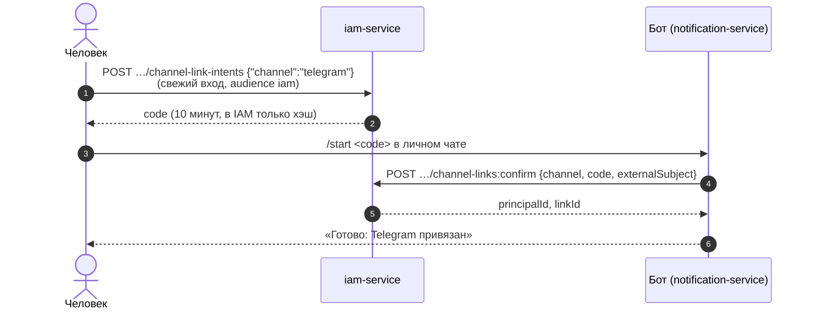
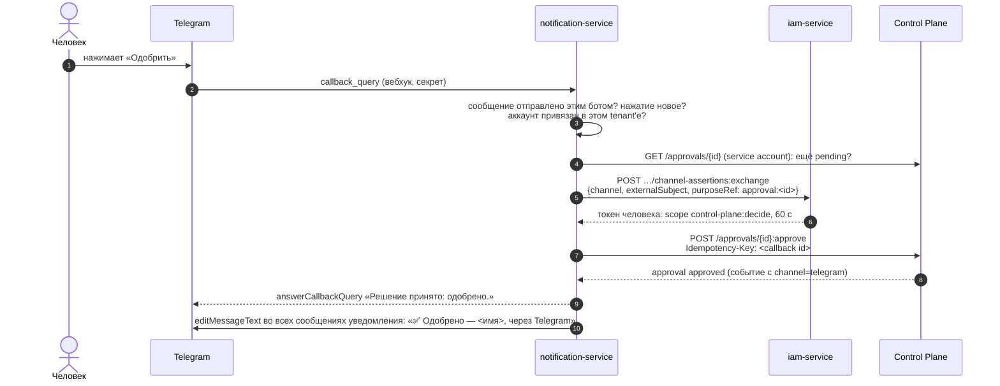

# Telegram

Канал `telegram` сервиса уведомлений: бот присылает уведомления в личный чат
человека и в групповые чаты команды, а кнопками под сообщением человек
принимает решения по approvals, не открывая рабочее место. Статья описывает
привязку людей и групп, путь нажатия кнопки до решения в Control Plane,
настройку бота оператором и типичные проблемы. Общее устройство сервиса — в
статье [Уведомления](index.md).

## Как это устроено

Три участника, у каждого своя ответственность:

| Участник | Что делает |
|---|---|
| **IAM** (`iam-service`) | Владеет привязкой «человек ↔ аккаунт Telegram» как внешней identity. Выдаёт одноразовые коды привязки и обменивает нажатие кнопки на короткий токен человека |
| **notification-service** | Держит бота: принимает вебхук Telegram, подтверждает привязки в IAM (service account со scope `iam:channel-links`), рассылает сообщения, превращает нажатия в решения |
| **Control Plane** | Принимает решение approval токеном человека и записывает в событие решения канал, через который оно пришло |

Код привязки знают только человек и IAM: сервис уведомлений не может
привязать к человеку чужой аккаунт. Решать через канал может только человек —
привязка к агенту или service account отвергается. Обоснование — TAI-ADR-0050
и CP-ADR-0070.

!!! warning "Доверие к сервису уведомлений"
    Подписи нажатия от имени пользователя у Telegram нет: утверждение «этот
    аккаунт нажал кнопку» делает сервис уведомлений как владелец бота.
    Компрометация сервиса позволяет решать approvals за привязанных людей —
    но только по одному, в течение 60 секунд, конкретный approval, в пределах
    прав человека, и каждое такое решение видно в audit IAM и в журнале ядра.
    Держите токен бота и секрет вебхука как секреты уровня IAM.

## Настройка оператором

### 1. Создать бота

Создайте бота у `@BotFather` в Telegram и сохраните токен и имя бота
(`@username`). Если бот будет работать в группах в режиме приватности (по
умолчанию), он видит только команды, адресованные ему, — именно такие команды
выдаёт сервис (`/start@<бот> <код>`).

### 2. Передать сервису токен и секрет вебхука

Файл `secrets/notification-telegram.env` подключается к контейнеру через
`env_file` (`required: false`: без файла канала нет):

```bash
cat > secrets/notification-telegram.env <<EOF
NS_TELEGRAM_BOT_TOKEN=<токен от BotFather>
NS_TELEGRAM_WEBHOOK_SECRET=$(openssl rand -hex 32)
NS_TELEGRAM_BOT_USERNAME=<имя бота без @>
EOF
chmod 600 secrets/notification-telegram.env
tools/compose --profile notify up -d notification-service
```

| Переменная | По умолчанию | Смысл |
|---|---|---|
| `NS_TELEGRAM_BOT_TOKEN` | пусто | Токен бота. Без него канала `telegram` нет, вебхук отвечает `404` |
| `NS_TELEGRAM_WEBHOOK_SECRET` | пусто | Секрет вебхука. Без него вебхук отклоняет любой вызов (`401`) |
| `NS_TELEGRAM_BOT_USERNAME` | пусто | Имя бота: команды и ссылки привязки групп |
| `NS_TELEGRAM_API_URL` | `https://api.telegram.org` | Адрес Bot API |
| `NS_TELEGRAM_TIMEOUT_SECONDS` | `10` | Таймаут вызова Bot API |
| `NS_CHANNEL_GROUP_CODE_TTL_SECONDS` | `600` | Срок кода привязки группы |
| `NS_IAM_CHANNEL_AUDIENCE`, `NS_IAM_CHANNEL_SCOPE` | `iam`, `iam:channel-links` | С каким audience и scope сервис ходит в IAM как адаптер канала |

Токен бота входит только в URL запросов к Bot API и не попадает в ошибки и
логи сервиса.

### 3. Включить провайдер в IAM

Канал как способ входа включается **для каждого tenant'а** отдельно
bootstrap-эндпоинтом IAM. Административная поверхность IAM на периметре
закрыта, поэтому вызов делается с хоста:

```bash
curl -s -X PUT "http://127.0.0.1:18010/api/v1/tenants/<tenant-id>/channel-providers/telegram" \
  -H "X-IAM-Bootstrap-Token: $IAM_BOOTSTRAP_TOKEN" \
  -H "Content-Type: application/json" \
  -d '{"status": "active"}'
```

```json
{"channel": "telegram", "status": "active", "updatedAt": "2026-01-15T10:00:00Z"}
```

`GET …/channel-providers` показывает состояние. `{"status": "disabled"}`
сразу закрывает подтверждение новых привязок и обмен нажатий на токены;
сами привязки остаются и снова работают после включения.

Кроме провайдера нужно, чтобы в tenant'е были audience `iam` со scope
`iam:channel-links` и scope `control-plane:decide` у audience
`control-plane`. Оба регистрирует `deploy/bootstrap.py`.

### 4. Зарегистрировать вебхук

Вебхук — `POST /channels/telegram/webhook` сервиса, публично через
периметр `https://platform.example.com/notify/channels/telegram/webhook`.
Зарегистрируйте его в Bot API с тем же секретом:

```bash
source secrets/notification-telegram.env
curl -s "https://api.telegram.org/bot$NS_TELEGRAM_BOT_TOKEN/setWebhook" \
  -d url=https://platform.example.com/notify/channels/telegram/webhook \
  -d secret_token="$NS_TELEGRAM_WEBHOOK_SECRET" \
  -d 'allowed_updates=["message","callback_query","my_chat_member"]'

curl -s "https://api.telegram.org/bot$NS_TELEGRAM_BOT_TOKEN/getWebhookInfo"
```

Telegram присылает секрет в заголовке `X-Telegram-Bot-Api-Secret-Token`;
сервис сравнивает его с `NS_TELEGRAM_WEBHOOK_SECRET` за постоянное время. Это
единственное доказательство, что запрос пришёл от Telegram, поэтому маршрут
публичный, но без секрета бесполезен.

Сервис обрабатывает три вида обновлений: `message` (команды), `callback_query`
(нажатия кнопок) и `my_chat_member` (бота заблокировали или удалили из
группы). Остальные игнорируются. На любое аутентичное обновление вебхук
отвечает `200`, даже если обработка упала: иначе Telegram присылал бы то же
обновление снова и снова. Человек, чьё нажатие не сработало, просто нажимает
ещё раз.

| Ответ вебхука | Причина |
|---|---|
| `200 {"ok": true}` | Обновление принято |
| `401 invalid_token` | Нет заголовка секрета, он неверный, или секрет не задан |
| `404 not_found` | Токен бота не задан — канал не настроен |
| `400 bad_request` | Тело не JSON-объект |

### 5. Проверить

1. Привяжите свой аккаунт (следующий раздел) и получите ответ бота «Готово:
   Telegram привязан».
2. В настройках `GET /api/v1/me/notification-preferences` появится адрес
   канала `telegram`.
3. Запросите approval на себя — в личный чат придёт сообщение с кнопками
   «Одобрить» и «Отклонить».

## Привязка человека



### Получить код

Код выдаёт IAM человеку с его собственным токеном. Требования к токену:

- audience `iam` (`IAM_CHANNEL_AUDIENCE`) и `tenant_id`, совпадающий с путём;
- `principal_type = human`, principal активен;
- **свежий вход**: `auth_time` не старше
  `IAM_CHANNEL_LINK_MAX_AUTHENTICATION_AGE_SECONDS` (300 с) — украденный
  старый токен не должен открывать атакующему постоянный канал;
- токен не выпущен самим каналом (`acr=channel:*`): канал не может
  размножить себя.

Такой токен человек получает сразу после входа, например обменом
`federation:exchange` с `"audience": "iam"` (см.
[Федерация identity](../iam/federation.md)).

```bash
curl -s -X POST "$IAM/api/v1/tenants/<tenant-id>/channel-link-intents" \
  -H "Authorization: Bearer $HUMAN_IAM_TOKEN" -H "Content-Type: application/json" \
  -d '{"channel": "telegram"}'
```

```json
{"intentId": "<intent-id>", "channel": "telegram", "code": "<код>", "expiresAt": "2026-01-15T10:10:00Z"}
```

Код показывается один раз и живёт `IAM_CHANNEL_LINK_CODE_TTL_SECONDS`
(600 с). Не больше `IAM_CHANNEL_LINK_INTENT_LIMIT` (5) кодов за
`IAM_CHANNEL_LINK_INTENT_WINDOW_SECONDS` (600 с), иначе `429 rate_limited` с
`Retry-After`.

!!! note "Экрана привязки нет"
    В поставке код запрашивается вызовом API IAM. Встроить его в свой
    интерфейс — задача клиента установки: это один `POST` токеном человека.

!!! warning "Маршруты привязки закрыты на эталонном периметре"
    Эталонный Caddyfile отвечает `404` на все пути
    `/iam/api/v1/tenants/*`, кроме `federation:authenticate` и
    `federation:exchange` (см. [Периметр и TLS](../operations/edge-and-tls.md)).
    Поэтому `channel-link-intents` и `channel-links` доступны только изнутри
    сети compose (`$IAM` = `http://iam-service:8010`) — например, из вашего
    веб-бэкенда, который вызывает IAM токеном человека. Если людям нужно
    обращаться к ним напрямую, добавьте в матчер закрытых путей исключения
    ровно для `…/channel-link-intents`, `…/channel-links` и
    `…/channel-links/*:revoke`. Маршруты адаптера (`channel-links:confirm`,
    `channel-assertions:exchange`) и `channel-providers` наружу не открывайте:
    их вызывают только сервис уведомлений и оператор изнутри.

| Отказ | HTTP | Причина |
|---|---|---|
| `channel_provider_disabled` | 403 | Провайдер не включён для tenant'а |
| `authentication_context_expired` | 403 | Вход старше 300 с — войти заново |
| `human_principal_required` | 403 | Токен не человека |
| `channel_authentication_not_allowed` | 403 | Токен выпущен каналом |
| `channel_already_linked` | 409 | У человека уже есть активная привязка Telegram — сначала отозвать |
| `rate_limited` | 429 | Слишком много кодов |

### Отправить код боту

Человек пишет боту в **личном** чате `/start <код>`. Сервис подтверждает код в
IAM (`POST …/channel-links:confirm`) с id отправителя как `externalSubject` —
привязывается ровно тот аккаунт, который прислал код, — и сохраняет чат как
адрес канала `telegram` этого человека.

| Ответ бота | Причина (код IAM) |
|---|---|
| «Готово: Telegram привязан…» | Привязка создана |
| «Код не подходит: он неверный, уже использован или истёк.» | `invalid_link_code` — IAM не различает неизвестный, чужой, использованный и просроченный код снаружи; точная причина только в audit |
| «К вашей учётной записи уже привязан другой Telegram.» | `channel_already_linked` |
| «Этот Telegram уже привязан к другой учётной записи.» | `channel_account_linked` — один аккаунт Telegram принадлежит одному человеку |
| «Вход через Telegram выключен организацией.» | `channel_provider_disabled` |
| «Учётная запись неактивна.» | `principal_not_active` |
| «Привязать Telegram может только человек.» | `human_principal_required` |
| «Слишком много попыток. Попробуйте позже.» | `rate_limited` — не больше `IAM_CHANNEL_CONFIRM_FAILURE_LIMIT` (10) неудачных подтверждений за 600 с |
| «Сервис сейчас недоступен…» | IAM не ответил или сервис не настроен |

Если тот же чат раньше был адресом другого человека в этом tenant'е, прежний
адрес отключается с причиной `linked_to_another_account`.

### Команды бота

| Команда | Где | Что делает |
|---|---|---|
| `/start <код>` | личный чат | Привязать аккаунт кодом из IAM |
| `/start <код>` | группа | Привязать группу кодом администратора (см. ниже) |
| `/start` | личный чат | Вернуть адрес, отключённый блокировкой бота; иначе — справка |
| `/unlink` | личный чат | Отключить адрес: сообщения сюда не приходят, кнопки не действуют |
| `/help` | личный чат | Справка |

!!! warning "`/unlink` не отзывает привязку в IAM"
    Команда отключает адрес в сервисе уведомлений — сообщения и кнопки
    перестают работать. Сама привязка в IAM остаётся: отозвать её человек
    может через API IAM (ниже). Вернуть сообщения после `/unlink` можно
    только новым кодом — отвязка считается мерой безопасности, а не паузой.

### Просмотр и отзыв привязок

Человек видит и отзывает свои привязки тем же токеном audience `iam`:

```bash
curl -s "$IAM/api/v1/tenants/<tenant-id>/channel-links" \
  -H "Authorization: Bearer $HUMAN_IAM_TOKEN"

curl -s -X POST "$IAM/api/v1/tenants/<tenant-id>/channel-links/<link-id>:revoke" \
  -H "Authorization: Bearer $HUMAN_IAM_TOKEN"
```

После отзыва следующий обмен нажатия отклоняется (`channel_account_not_linked`),
и сервис уведомлений отключает адрес с причиной `iam_link_revoked`. Уже
выданные токены канала живут не дольше `IAM_CHANNEL_ASSERTION_TTL_SECONDS`
(60 с); событие IAM `channel_link.revoked` несёт `credentialId` для
revocation-кэшей. Чужая привязка неотличима от несуществующей (`404
channel_link_not_found`).

### Если бот заблокирован

Когда человек блокирует бота (обновление `my_chat_member` со статусом
`kicked`) или отправка возвращает `403`, адрес отключается с причиной
`bot_blocked` или `telegram_403…`, и канал перестаёт выбираться. После
разблокировки достаточно отправить боту `/start` без кода — адрес вернётся.

## Группы команды

Группа мессенджера привязывается к workspace и, по желанию, к роли в нём.
Уведомления, адресованные этой роли в этом workspace, приходят и её
держателям лично, и в группу; группу можно адресовать и напрямую
(`recipient.kind = group`).

```bash
curl -s -X POST "$NS/api/v1/workspaces/<workspace-id>/channel-groups" \
  -H "Authorization: Bearer $ADMIN_TOKEN" -H "Content-Type: application/json" \
  -d '{"channel": "telegram", "roleId": "<role-id>"}'
```

```json
{
  "id": "<intent-id>",
  "channel": "telegram",
  "workspaceId": "<workspace-id>",
  "roleId": "<role-id>",
  "code": "<код>",
  "command": "/start@<бот> <код>",
  "deepLink": "https://t.me/<бот>?startgroup=<код>",
  "expiresAt": "2026-01-15T10:10:00Z"
}
```

Нужен scope `notifications:admin`. Дальше администратор либо добавляет бота
в группу и отправляет там `command`, либо открывает `deepLink` — Telegram
предложит выбрать группу, добавит бота и отправит код. Код одноразовый и
живёт `NS_CHANNEL_GROUP_CODE_TTL_SECONDS` (600 с); `deepLink` есть, только
если задан `NS_TELEGRAM_BOT_USERNAME`. Бот отвечает в группе «Группа
привязана…».

| Запрос | Смысл |
|---|---|
| `POST /api/v1/workspaces/{id}/channel-groups` | Код привязки группы (`roleId` необязателен) |
| `GET /api/v1/workspaces/{id}/channel-groups` | Привязанные группы, включая отключённые |
| `DELETE /api/v1/workspaces/{id}/channel-groups/{groupId}` | Отвязать: доставка в группу прекращается (причина `unlinked_by_admin`) |

- Повторная привязка того же чата переносит его в новый workspace и роль.
- Группа, ставшая супергруппой, продолжает получать сообщения: сервис
  переносит её на новый id чата сам.
- Бот, удалённый из группы, отключает её (`bot_removed`); вернуть — новым
  кодом.
- Кнопки решения в группе видны всем участникам, но решение принимает
  только привязанный человек с правом решать (см. ниже).

## Решение кнопкой {#decisions}

Когда ядро запрашивает решение (`approval.requested`), сервис рассылает
уведомление с действиями `approve` и `reject` (см.
[Уведомления](index.md#core-events)). Канал Telegram превращает действия с
`data.kind = approval.decide` в кнопки под сообщением; прочие действия он не
показывает.



### Токен одного решения

IAM выпускает по нажатию токен **от имени человека**, у которого нет других
возможностей:

| Claim | Значение |
|---|---|
| `aud` | `control-plane` (`IAM_CHANNEL_ASSERTION_AUDIENCE`) |
| `scope`, `scope_ceiling` | `[control-plane:decide]` (`IAM_CHANNEL_ASSERTION_SCOPE`) |
| `principal_type` | `human` |
| `acr`, `amr` | `channel:telegram` |
| `purpose_ref` | `approval:<approval-id>` |
| `credential_id` | id привязки: её отзыв закрывает следующий обмен |
| срок | `IAM_CHANNEL_ASSERTION_TTL_SECONDS` (60 с), не дольше общего TTL токенов |

Control Plane с таким токеном:

- оставляет из прав binding человека только `approvals.decide` — само по себе
  scope ничего не даёт, право должно быть у binding (`403 permission_denied`);
- принимает его **только** на `POST /api/v1/approvals/{id}:approve` и
  `:reject` с тем же `{id}`; любой другой запрос, включая чтение этого
  approval, `:cancel`, чужой approval и WebSocket журнала, получает отказ
  `outside_purpose` (HTTP `403`);
- требует `Idempotency-Key` (`422 idempotency_key_required`). Сервис ставит
  ключом id нажатия, поэтому повторная доставка вебхука становится
  replay первого решения, а не второй попыткой;
- записывает `channel = "telegram"` в событие `approval.approved` /
  `approval.rejected` (у прямого вызова API — `null`).

Обмен ограничен по частоте: не больше `IAM_CHANNEL_ASSERTION_LIMIT` (10)
токенов на привязку и отказов на адаптер за
`IAM_CHANNEL_ASSERTION_WINDOW_SECONDS` (60 с). Каждый обмен и каждый отказ —
в audit IAM.

!!! warning "Исходы решения из канала исполняются с правом только на решение"
    Исходы gate-решения, объявленные типом задачи, исполняются с полномочиями
    решившего, снятыми с контекста решения, а у токена канала это только
    `approvals.decide`. Если действию исхода нужны другие права (записать
    задачу, вызвать скилл), в режимах авторизации `local` и `shadow` оно
    завершается отказом прав. Решение при этом остаётся в силе, исход — в
    состоянии `failed`; решивший повторяет его из веба
    `POST /approvals/{id}:replay-outcome` со своей полной учётной записью
    (см. [Approvals](../control-plane/approvals.md)).

### Что видит человек

| Ответ на нажатие | Когда |
|---|---|
| «Решение принято: одобрено.» / «…отклонено.» | Решение записано |
| «Уже решено: ✅ Одобрено — <имя>, через Telegram.» | Approval уже решён или отменён — кнопки этого сообщения заодно закрываются |
| «Ваш Telegram не привязан к учётной записи — решение не принято…» | Аккаунт не привязан в tenant'е сообщения |
| «Привязка Telegram отозвана — решение не принято.» | Привязка отозвана в IAM; адрес отключается |
| «Решения из Telegram выключены организацией.» | Провайдер выключен |
| «У вас нет права принять это решение — решение не записано.» | Ядро отказало: нет права или человек не может решать этот approval |
| «Решение не найдено — кнопка больше не действует.» | Approval не найден |
| «Кнопка больше не действует.» | Нажатие не на сообщение этого бота или действие не решение |
| «Сервис сейчас недоступен. Попробуйте позже.» | IAM или ядро не ответили — нажатие можно повторить |

Нажатие проверяется в контексте tenant'а, из которого пришло сообщение:
человек, привязанный в нескольких tenant'ах, решает там, где его спросили.
Результат каждого нажатия записывается; повторно доставленное нажатие
получает тот же ответ. Временные отказы (IAM или ядро недоступны) не
фиксируются окончательно, и повтор решает заново.

После решения — через Telegram, веб или API — действия уведомления
закрываются, и **все** сообщения этого уведомления у всех получателей
редактируются: кнопки исчезают, внизу появляется исход («✅ Одобрено»,
«❌ Отклонено», «Отменено»), кто решил и через какой канал.

## Формат сообщений

Сообщение уходит в Bot API с разметкой HTML: заголовок жирным, текст, затем
ссылки и строка исхода курсивом. Текст экранируется; если сообщение длиннее
лимита Telegram в 4096 символов, обрезается тело, а ссылки и исход остаются.

## Типичные проблемы {#troubleshooting}

| Симптом | Причина | Что делать |
|---|---|---|
| Бот молчит, `getWebhookInfo` показывает ошибки `401` | Секрет в `setWebhook` не совпадает с `NS_TELEGRAM_WEBHOOK_SECRET` или секрет пуст | Перерегистрировать вебхук с тем же секретом |
| Вебхук отвечает `404` | Токен бота не дошёл до контейнера | Проверить `secrets/notification-telegram.env`, пересоздать контейнер |
| Вебхук недоступен снаружи (`502`) | Профиль `notify` не поднят или нет маршрута `/notify/*` в Caddyfile | Поднять профиль, проверить периметр |
| `/start <код>` — «Код не подходит» | Код истёк (10 минут), использован или выдан в другом tenant'е | Запросить новый код |
| `/start <код>` — «Сервис сейчас недоступен» | Нет `secrets/notification-iam.env` или у service account нет audience `iam` | Выполнить bootstrap, пересоздать контейнер |
| Код привязки в IAM — `403 authentication_context_expired` | Вход старше 300 с | Войти заново и сразу запросить код |
| Сообщения не приходят, в журнале `recipient_unreachable` | Адрес не привязан или отключён (`/unlink`, блокировка, отзыв) | Посмотреть `addresses` в настройках человека; привязать заново |
| Доставки `pending` с `lastError` `telegram_unauthorized` | Токен бота неверный или отозван | Исправить токен; доставки повторятся сами |
| `telegram_429…` в `lastError` | Лимит Bot API | Повторяется автоматически с паузой |
| Кнопки есть, но нажатие — «Решения из Telegram выключены организацией» | Провайдер tenant'а в статусе `disabled` | `PUT …/channel-providers/telegram {"status":"active"}` |
| Нажатие — «У вас нет права принять это решение» | У binding человека нет `approvals.decide`, approval назначен другому principal'у или человек не держит нужную роль в workspace approval'а (`not_eligible`) | Проверить права и роль человека |
| Нажатие проходит, но исход решения `failed` с отказом прав | Исходу нужны права шире `approvals.decide` | `:replay-outcome` из веба полной учёткой |
| В группу ничего не приходит | Группа отвязана (`bot_removed`, `unlinked_by_admin`) или привязана к другой роли | `GET …/channel-groups`, привязать новым кодом |
| Команда в группе игнорируется | Бот в режиме приватности не видит `/start <код>` без имени бота | Отправлять `command` из ответа (`/start@<бот> <код>`) или `deepLink` |

## См. также

- [Уведомления](index.md) — отправка, каналы, инбокс, журнал доставки.
- [Approvals](../control-plane/approvals.md) — запрос, решение и исходы.
- [Федерация identity](../iam/federation.md) — внешние identity и
  `federation:exchange`.
- [Токены, audiences, scopes](../iam/tokens.md)
- [Секреты и ротация](../operations/secrets.md)
- [Периметр и TLS](../operations/edge-and-tls.md) — маршрут `/notify/*` и
  закрытая административная поверхность IAM.
