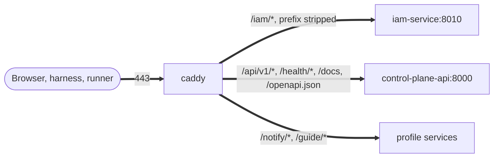

# Edge and TLS

In the whole installation, only one container faces the outside: `caddy`
(the `edge` profile). It terminates TLS, issues and renews certificates
itself, and routes requests to services by path prefix. This article is for
the engineer who prepares the installation's Caddyfile and is responsible
for certificates.

## How the edge works




- The `caddy` container publishes `${EDGE_HTTP_PORT:-80}` and `${EDGE_HTTPS_PORT:-443}`.
- The other services either publish no ports at all (`control-plane-worker`,
  `context-adapter`, databases) or publish them only on the host's
  `127.0.0.1`, for operational access and `make smoke`.
- `memory-service` is **not exposed** in the production Caddyfile: memory is
  available only to the core and to services on the internal network.
- On the compose network, `caddy` has the alias `${TAIMEN_PUBLIC_HOST}`.
  Containers that reach IAM or an external IdP by the public address (the
  issuer must match what the browser sees) resolve the public name directly
  to `caddy` inside the network, without going outside and without hairpin
  NAT.

## Routes


The template is `deploy/caddy/Caddyfile.local` (the local variant without
TLS). The production file differs from it in the site address and enabled
TLS; see "Minimal installation Caddyfile" below.

| Path | Upstream | Prefix | Profile | Purpose |
|---|---|---|---|---|
| `/iam/*` | `iam-service:8010` | stripped (`handle_path`) | `core` | IAM for clients: JWKS, PAT exchange/introspection/revocation, `tokens/exchange`, `federation:*`, SCIM; issuer `${TAIMEN_PUBLIC_URL}/iam`. Administrative paths return 404 (see below) |
| `/api/v1/*`, `/health/*`, `/docs*`, `/redoc*`, `/openapi.json` | `control-plane-api:8000` | no | `core` | Control Plane API; WebSocket subscriptions use the same route. `/metrics` is not exposed |
| `/secrets/*` | `openbao:8200` | stripped | `core` | [Secret store](secret-store.md#perimeter): only `POST /v1/auth/jwt/login`, `GET /v1/kv/data/tenants/…` and `GET /v1/oauth2/creds/tenants/…`; everything else is `404`; `X-Vault-Token` is not logged |
| `/notify/*` | `notification-service:8000` | stripped | `notify` | Notification service: API and inbox, the Telegram bot webhook (`/notify/channels/telegram/webhook`, verified by the webhook secret), the intake point of the `notify.send@1` skill |
| `/guide/*` | `guide:8080` | stripped | `edge` | This guide: a static MkDocs site (`guide/Dockerfile`) |


!!! warning "Block order matters"
    The Control Plane route is declared with the named matcher `@cp_api`. If
    the file has a generic `handle` without a matcher (a root fallback
    route), declare your routes before it; otherwise the request goes to the
    fallback route.

A route for a profile that is not running returns `502`; this is expected.
It is better to remove extra routes from the installation file.

## Minimal installation Caddyfile


```caddyfile
platform.example.com {
	encode zstd gzip

	# IAM administrative paths are not needed at the edge: see "Closing internal paths"
	handle_path /iam/* {
		@iam_admin {
			path /api/v1/events /api/v1/events/* /api/v1/tenants /api/v1/tenants/*
			not path_regexp ^/api/v1/tenants/[^/]+/federation:(authenticate|exchange)$
		}
		respond @iam_admin 404
		request_header -X-IAM-Bootstrap-Token
		reverse_proxy iam-service:8010
	}

	# /metrics is intentionally not in the list: see "Closing internal paths"
	@cp_api path /api/v1/* /health/* /docs /docs/* /redoc /redoc/* /openapi.json
	handle @cp_api {
		reverse_proxy control-plane-api:8000 {
			header_up Host {host}
			header_up X-Real-IP {remote_host}
		}
	}

	log {
		output stderr
		format json
	}
}
```


The file path is set in `.env` by the `CADDYFILE` variable.

## TLS and certificates

Caddy enables automatic HTTPS for any site address with a domain name: it
obtains a certificate from an ACME CA, renews it itself, and redirects
`http` to `https`. The state (certificates, keys, ACME account) is kept in
the `caddy_data` volume (`${COMPOSE_PROJECT_NAME}_caddy_data`), and the
configuration in `caddy_config`.

### Requirements for issuance

| Condition | Why |
|---|---|
| The A/AAAA record of the name points to the host **before** the first start of `caddy` | The ACME challenge (HTTP-01 or TLS-ALPN-01) arrives at the address from DNS |
| Ports 80 and 443 are reachable from the internet | The challenges go through them |
| No CDN/proxy that terminates TLS sits in front of the host | The TLS-ALPN challenge does not pass through someone else's TLS |
| The `caddy_data` volume persists across container recreation | Otherwise every recreated container issues the certificate again |

!!! danger "Do not keep names in the Caddyfile that do not point to the host"
    Caddy tries to certify every such name; the challenge goes to someone
    else's address and fails. A series of failed challenges hits the ACME
    CA's limits on failed validations, and issuance for that name is blocked
    for a while (Let's Encrypt responds with `429`). Add a site block only
    after DNS has been switched, and keep names that are not ready commented
    out.

### Moving to a new host

1. Stop `caddy` on the old host.
2. Copy the `caddy_data` volume (see [Backup](backup.md)) to the new host
   before the first start of `caddy` there.
3. Switch DNS and start `caddy`. The transferred certificates are picked up
   without reissuance, and renewal continues on the new host.

### If you need a load balancer or CDN in front of Caddy

- TLS challenges do not pass through a CDN; you need DNS-01, and the
  standard `caddy:2-alpine` image contains no DNS providers, so you need a
  custom Caddy build with your provider's plugin.
- By default Caddy does not trust an incoming `X-Forwarded-For` and sets the
  connection address. Behind a load balancer that is the load balancer's
  address: declare it in the global option
  `servers { trusted_proxies static <cidr> }`, otherwise services see the
  load balancer's address instead of the client's (`X-Real-IP`, logs).

## Closing internal paths

### `/metrics`


Control Plane `GET /metrics` is **not authenticated**. It does not reveal
tenants and tasks (the metrics are aggregate), but it does reveal counters,
paths, and load. The shipped `deploy/caddy/Caddyfile.local` and the template
in this article do not expose it at the edge: `/metrics` is not in the
`@cp_api` matcher. Scrape metrics from inside the compose network
(`control-plane-api:8000/metrics`) or from the host:

```bash
curl -s http://127.0.0.1:18000/metrics
```

### IAM administrative surface

IAM administrative operations (tenants, principals, audiences, identity
providers, PAT issuance and revocation, service accounts, the
`/api/v1/events` log) are protected only by the `X-IAM-Bootstrap-Token`
header. There is no separate administrative role, so a leaked or
brute-forced token means taking over the entire identity. The shipped
Caddyfiles **do not publish** this surface:

- the paths `/api/v1/tenants`, `/api/v1/tenants/*`, and `/api/v1/events`
  return `404` at the edge. The exceptions are `federation:authenticate` and
  `federation:exchange`: clients call them with an external provider's
  token;
- the second line of defense: the `X-IAM-Bootstrap-Token` header is stripped
  before the proxy. Even a request that bypasses the matcher is not
  authorized at the administrative endpoint.

What stays exposed is what clients need: `/.well-known/jwks.json`, PAT
exchange, introspection, and revocation (`/api/v1/platform-access-tokens:*`),
`/api/v1/tokens/exchange` for service accounts, `federation:*`, SCIM
(`/scim/v2/*`, authenticated by the provisioning source's token), and
`/healthz`.


`deploy/bootstrap.py` and the installation's utility scripts reach IAM at
`127.0.0.1:${IAM_HOST_PORT:-18010}` and do not use the edge. If an external
tool in your installation performs administrative operations through the
public address, switch it to the internal address or an SSH tunnel: such
requests no longer pass through the edge.


## Changing the Caddyfile without downtime

```bash
# 1. Validate the syntax of the new version
tools/compose exec caddy caddy validate --config /etc/caddy/Caddyfile

# 2. Apply
tools/compose exec caddy caddy reload --config /etc/caddy/Caddyfile
```

!!! warning "A file bind mount holds the inode"
    The Caddyfile is mounted into the container as a **file**. Commands that
    replace the file with a new one (`mv new Caddyfile`, many editors with
    atomic writes, `sed -i`) create a new inode, while the container keeps
    seeing the old one, so `caddy reload` rereads the previous version. Edit
    the file in place (`cat new > Caddyfile`) or recreate the container:
    `tools/compose up -d --force-recreate caddy`.

Check that the container sees the current file:

```bash
tools/compose exec caddy cat /etc/caddy/Caddyfile | diff - /opt/taimen/Caddyfile && echo "identical"
```

## Edge verification

```bash
# Certificate and expiry
echo | openssl s_client -connect platform.example.com:443 -servername platform.example.com 2>/dev/null \
  | openssl x509 -noout -subject -enddate

# Routes
curl -fsS https://platform.example.com/health/ready
curl -fsS https://platform.example.com/iam/healthz
curl -fsS https://platform.example.com/iam/.well-known/jwks.json
curl -s -o /dev/null -w '%{http_code}\n' https://platform.example.com/metrics   # not 200

# Nothing but 80/443 should be visible from outside
nmap -Pn -p 1-65535 platform.example.com
```

## Common problems

| Symptom | Cause | Solution |
|---|---|---|
| The browser gets a TLS error; the `caddy` logs show `challenge failed` / `429` | The name does not point to the host or port 80/443 is closed; ACME limits exceeded | Check `dig`, open the ports, remove names that are not ready; after a `429`, wait for the limit window |
| Nothing changed after editing the Caddyfile | The file was replaced with a new inode | Write it in place or run `up -d --force-recreate caddy` |

## See also

- [Production deployment](deployment.md)
- [Monitoring and health](monitoring.md)
- [Services and ports](../reference/services-and-ports.md)
