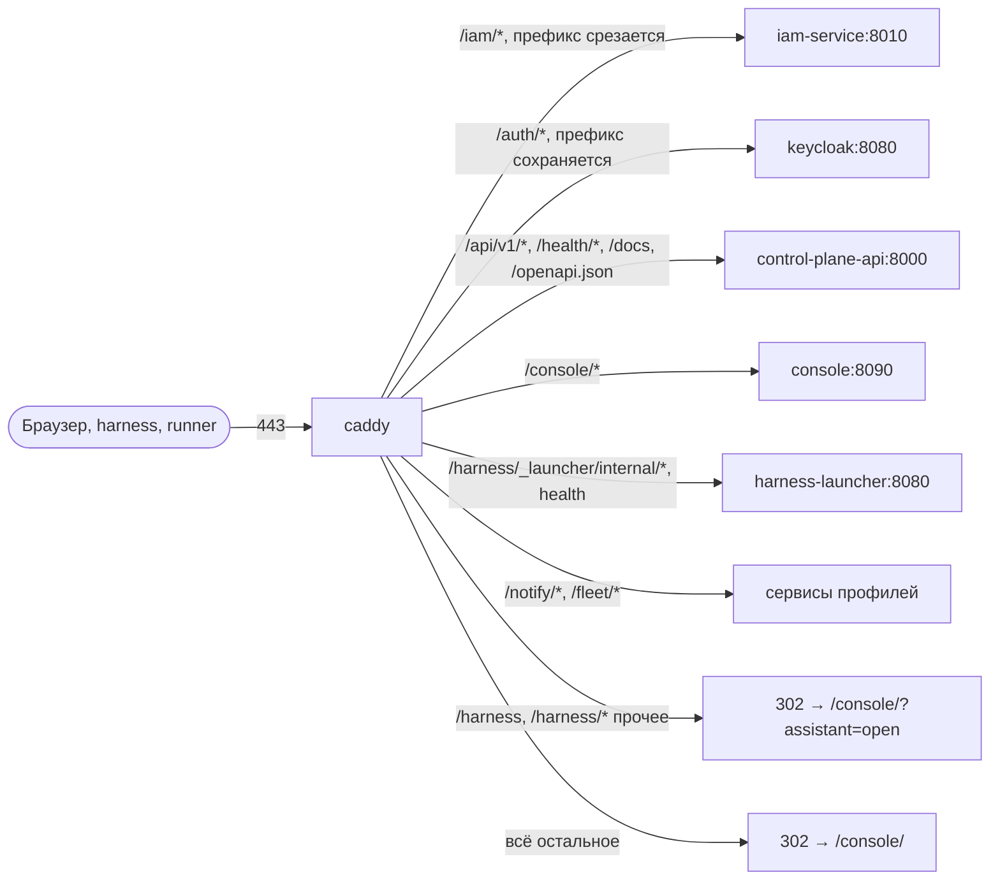

# Периметр и TLS

Во всей установке наружу смотрит один контейнер — `caddy` (профиль `edge`).
Он терминирует TLS, сам выпускает и продлевает сертификаты и раскладывает
запросы по сервисам по префиксу пути. Статья — для инженера, который готовит
Caddyfile установки и отвечает за сертификаты.

## Как устроен периметр



- Контейнер `caddy` публикует `${EDGE_HTTP_PORT:-80}` и `${EDGE_HTTPS_PORT:-443}`.
- Остальные сервисы либо не публикуют порты вовсе (`control-plane-worker`,
  `context-adapter`, базы), либо публикуют их только на `127.0.0.1` хоста —
  для эксплуатационного доступа и `make smoke`.
- `memory-service` в промышленном Caddyfile **наружу не выводится**: память
  доступна только ядру и сервисам во внутренней сети.
- В сети compose у `caddy` есть alias `${TAIMEN_PUBLIC_HOST}`. Контейнеры,
  которые ходят к IAM или внешнему IdP по публичному адресу (issuer должен
  совпадать с тем, что видит браузер), резолвят публичное имя прямо в `caddy`
  внутри сети — без выхода наружу и hairpin NAT.

## Маршруты


Образец — `deploy/caddy/Caddyfile.local` (локальный вариант без TLS).
Промышленный файл отличается от него адресом сайта и включённым TLS, см.
«Минимальный Caddyfile установки» ниже.

| Путь | Upstream | Префикс | Профиль | Назначение |
|---|---|---|---|---|
| `/iam/*` | `iam-service:8010` | срезается (`handle_path`) | `core` | IAM для клиентов: JWKS, обмен/интроспекция/отзыв PAT, `tokens/exchange`, `federation:*`, SCIM; issuer `${TAIMEN_PUBLIC_URL}/iam`. Административные пути — 404 (см. ниже) |
| `/auth/*` | `keycloak:8080` | **сохраняется** (`handle`) | `idp` | Keycloak живёт под `KC_HTTP_RELATIVE_PATH=/auth` |
| `/api/v1/*`, `/health/*`, `/docs*`, `/redoc*`, `/openapi.json` | `control-plane-api:8000` | нет | `core` | Control Plane API, WebSocket-подписки идут тем же маршрутом. `/metrics` наружу не выводится |
| `/harness/_launcher/internal/*`, `/harness/_launcher/health` | `harness-launcher:8080` | **сохраняется** (`handle @harness_service`; префикс срезает сам launcher) | `harness` | Служебные маршруты движка ассистента: поверхность беседы и вход каналов (Bearer IAM). Заголовки `X-Harness-Launcher` и `X-Harness-Principal` снаружи срезаются — их ставит только launcher; `flush_interval -1` — поток беседы без буферизации |
| `/harness`, `/harness/*` (прочее) | — | — | `edge` | Веб-интерфейса у движка ассистента нет: редирект `302` на `/console/?assistant=open` — консоль с открытой панелью [ассистента](../operator/assistant.md) |
| `/fleet/*` | `fleet-controller:8040` | срезается | `fleet` | Регистрация узлов fleet и их исходящие запросы желаемого состояния |
| `/notify/*` | `notification-service:8000` | срезается | `notify` | Сервис уведомлений: API и инбокс, вебхук бота Telegram (`/notify/channels/telegram/webhook`, проверяется секретом вебхука), точка приёма скилла `notify.send@1` |
| `/console/*` | `console:8090` | **сохраняется** (`handle`; сервер консоли сам живёт под `/console`) | `core` (в открытой поставке — `console`) | [Консоль](../operator/console.md): вход OIDC, API, WebSocket событий, интерфейс. `flush_interval -1` — потоки без буферизации. `/console` без слэша — редирект `301` на `/console/` |
| `/guide/*` | `guide:8080` | срезается | `edge` | Это руководство: статический сайт MkDocs (`guide/Dockerfile`) |
| `/` (всё прочее) | — | — | `edge` | Редирект `302` на `/console/` |

!!! warning "Порядок блоков важен"
    Маршрут Control Plane объявлен именованным матчером `@cp_api` раньше
    общего `handle` корня. Если добавляете свои маршруты, объявляйте их до
    блока корня, иначе запрос получит редирект на `/console/`.

Маршрут профиля, который не поднят, отвечает `502` — это ожидаемо. Лишние
маршруты лучше убрать из файла установки.

## Минимальный Caddyfile установки

```caddyfile
platform.example.com {
	encode zstd gzip

	# Административные пути IAM на периметре не нужны: см. «Закрытие служебных путей»
	handle_path /iam/* {
		@iam_admin {
			path /api/v1/events /api/v1/events/* /api/v1/tenants /api/v1/tenants/*
			not path_regexp ^/api/v1/tenants/[^/]+/federation:(authenticate|exchange)$
		}
		respond @iam_admin 404
		request_header -X-IAM-Bootstrap-Token
		reverse_proxy iam-service:8010
	}

	handle /auth/* {
		reverse_proxy keycloak:8080 {
			header_up X-Forwarded-Host {host}
			header_up X-Forwarded-Proto {scheme}
		}
	}

	# /metrics намеренно не входит в список: см. «Закрытие служебных путей»
	@cp_api path /api/v1/* /health/* /docs /docs/* /redoc /redoc/* /openapi.json
	handle @cp_api {
		reverse_proxy control-plane-api:8000 {
			header_up Host {host}
			header_up X-Real-IP {remote_host}
		}
	}

	redir /console /console/ 301
	handle /console/* {
		reverse_proxy console:8090 {
			flush_interval -1
		}
	}

	@harness_service path /harness/_launcher/internal/* /harness/_launcher/health
	handle @harness_service {
		request_header -X-Harness-Launcher
		request_header -X-Harness-Principal
		reverse_proxy harness-launcher:8080 {
			flush_interval -1
		}
	}

	@harness_ui path /harness /harness/*
	handle @harness_ui {
		redir * /console/?assistant=open 302
	}

	handle {
		redir * /console/ 302
	}

	log {
		output stderr
		format json
	}
}
```

Путь к файлу задаётся в `.env` переменной `CADDYFILE`. Если профили
`idp` и `harness` не поднимаются, уберите блоки `/auth/*`, `@harness_service` и
`@harness_ui`.

## TLS и сертификаты

Caddy включает automatic HTTPS для любого адреса сайта с доменным именем:
получает сертификат у ACME-центра, продлевает его сам и редиректит `http` на
`https`. Состояние (сертификаты, ключи, ACME-аккаунт) лежит в томе
`caddy_data` (`${COMPOSE_PROJECT_NAME}_caddy_data`), конфигурация — в
`caddy_config`.

### Требования для выпуска

| Условие | Почему |
|---|---|
| A/AAAA-запись имени указывает на хост **до** первого запуска `caddy` | ACME-проверка (HTTP-01 или TLS-ALPN-01) приходит на адрес из DNS |
| Порты 80 и 443 доступны из интернета | Через них идут проверки |
| Перед хостом нет CDN/прокси, терминирующего TLS | TLS-ALPN-проверка через чужой TLS не проходит |
| Том `caddy_data` сохраняется между пересозданиями контейнера | Иначе каждый пересозданный контейнер выпускает сертификат заново |

!!! danger "Не держите в Caddyfile имена, которые не указывают на хост"
    Каждое такое имя Caddy будет пытаться сертифицировать, проверка будет
    уходить на чужой адрес и падать. Серия неудачных проверок упирается в
    лимиты ACME-центра на неудачные валидации, и выпуск для этого имени
    блокируется на время (у Let's Encrypt — ответ `429`). Добавляйте блок
    сайта только когда DNS уже переключён, а неготовые имена держите
    закомментированными.

### Перенос на новый хост

1. Остановите `caddy` на старом хосте.
2. Скопируйте том `caddy_data` (см. [Резервное копирование](backup.md)) на
   новый хост до первого запуска `caddy` там.
3. Переключите DNS, поднимите `caddy`. Перенесённые сертификаты
   подхватываются без перевыпуска, продление продолжится на новом хосте.

### Если перед Caddy нужен балансировщик или CDN

- TLS-проверки через CDN не проходят; нужен DNS-01, а стандартный образ
  `caddy:2-alpine` DNS-провайдеров не содержит — потребуется собственная
  сборка Caddy с плагином провайдера.
- Caddy по умолчанию не доверяет входящему `X-Forwarded-For` и ставит адрес
  соединения. За балансировщиком это будет адрес балансировщика: объявите его
  в глобальной опции `servers { trusted_proxies static <cidr> }`, иначе
  сервисы увидят вместо адреса клиента адрес балансировщика (`X-Real-IP`,
  журналы).

## Закрытие служебных путей

### `/metrics`


`GET /metrics` Control Plane **не аутентифицирован**. Он не раскрывает
tenant'ов и задачи (метрики агрегатные), но раскрывает счётчики, пути и
нагрузку. Поставляемый `deploy/caddy/Caddyfile.local` и образец из этой
статьи его на периметр не выводят: `/metrics` нет в матчере `@cp_api`.
Снимайте метрики изнутри сети compose (`control-plane-api:8000/metrics`) или
с хоста:

```bash
curl -s http://127.0.0.1:18000/metrics
```

### Административная поверхность IAM

Административные операции IAM (tenants, principals, audiences, identity
providers, выпуск и отзыв PAT, service accounts, журнал `/api/v1/events`)
защищены только заголовком `X-IAM-Bootstrap-Token`. Отдельной
административной роли нет, поэтому утечка или перебор токена — это захват
всей identity. Поставляемые Caddyfile эту поверхность наружу **не публикуют**:

- пути `/api/v1/tenants`, `/api/v1/tenants/*` и `/api/v1/events` отвечают на
  периметре `404`. Исключение — `federation:authenticate` и
  `federation:exchange`: их вызывают клиенты с токеном внешнего провайдера;
- второй рубеж — заголовок `X-IAM-Bootstrap-Token` срезается до прокси. Даже
  запрос, обошедший матчер, до административного эндпоинта не авторизуется.

Наружу остаётся то, что нужно клиентам: `/.well-known/jwks.json`, обмен,
интроспекция и отзыв PAT (`/api/v1/platform-access-tokens:*`),
`/api/v1/tokens/exchange` для service account'ов, `federation:*`, SCIM
(`/scim/v2/*`, аутентифицируется токеном источника провижининга) и `/healthz`.


`deploy/bootstrap.py` и служебные скрипты установки ходят в IAM по
`127.0.0.1:${IAM_HOST_PORT:-18010}` и периметр не используют. Если внешний
инструмент вашей установки выполняет административные операции через
публичный адрес, переведите его на внутренний адрес или SSH-туннель — через
периметр такие запросы больше не проходят.

### Консоль администратора Keycloak

Маршрут `/auth/*` открывает и `/auth/admin/`. Если администраторы Keycloak
работают из известной сети, ограничьте этот путь матчером `remote_ip` или
выполняйте администрирование через SSH-туннель к `127.0.0.1:18081`.

## Изменение Caddyfile без простоя

```bash
# 1. Проверить синтаксис новой версии
tools/compose exec caddy caddy validate --config /etc/caddy/Caddyfile

# 2. Применить
tools/compose exec caddy caddy reload --config /etc/caddy/Caddyfile
```

!!! warning "Bind-mount файла держит inode"
    Caddyfile смонтирован в контейнер как **файл**. Команды, которые
    заменяют файл новым (`mv new Caddyfile`, многие редакторы с атомарной
    записью, `sed -i`), создают новый inode, а контейнер продолжает видеть
    старый — `caddy reload` перечитает прежнюю версию. Правьте файл на месте
    (`cat new > Caddyfile`) или пересоздайте контейнер:
    `tools/compose up -d --force-recreate caddy`.

Проверить, что контейнер видит актуальный файл:

```bash
tools/compose exec caddy cat /etc/caddy/Caddyfile | diff - /opt/taimen/Caddyfile && echo "совпадает"
```

## Проверка периметра

```bash
# Сертификат и срок
echo | openssl s_client -connect platform.example.com:443 -servername platform.example.com 2>/dev/null \
  | openssl x509 -noout -subject -enddate

# Маршруты
curl -fsS https://platform.example.com/health/ready
curl -fsS https://platform.example.com/iam/healthz
curl -fsS https://platform.example.com/iam/.well-known/jwks.json
curl -s -o /dev/null -w '%{http_code}\n' https://platform.example.com/metrics   # не 200

# Снаружи не должно быть ничего, кроме 80/443
nmap -Pn -p 1-65535 platform.example.com
```

## Типичные проблемы

| Симптом | Причина | Решение |
|---|---|---|
| Браузер получает ошибку TLS, в логах `caddy` — `challenge failed` / `429` | Имя не указывает на хост или порт 80/443 закрыт; превышены лимиты ACME | Проверить `dig`, открыть порты, убрать неготовые имена; после `429` ждать окна лимита |
| После правки Caddyfile ничего не изменилось | Файл заменён новым inode | Записать на месте или `up -d --force-recreate caddy` |
| Свой маршрут отвечает `302` на `/console/` | Маршрут объявлен после блока корня | Перенести блок выше `handle { redir * /console/ 302 }` |
| Issuer в токенах Keycloak не совпадает с ожидаемым, IAM отвечает `401 invalid_issuer` на `federation:exchange` | Контейнеры резолвят публичное имя мимо `caddy` | Проверить `TAIMEN_PUBLIC_HOST` (alias сети) и `KC_HOSTNAME` |

## См. также

- [Промышленное развёртывание](deployment.md)
- [Мониторинг и здоровье](monitoring.md)
- [Keycloak — внешний IdP](../iam/keycloak.md)
- [Рабочее место человека](../workplace/index.md)
- [Ассистент](../operator/assistant.md)
- [Сервисы и порты](../reference/services-and-ports.md)
